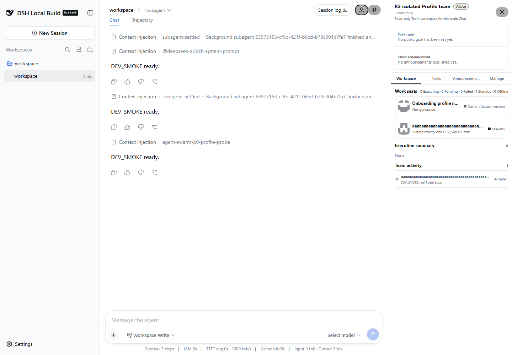
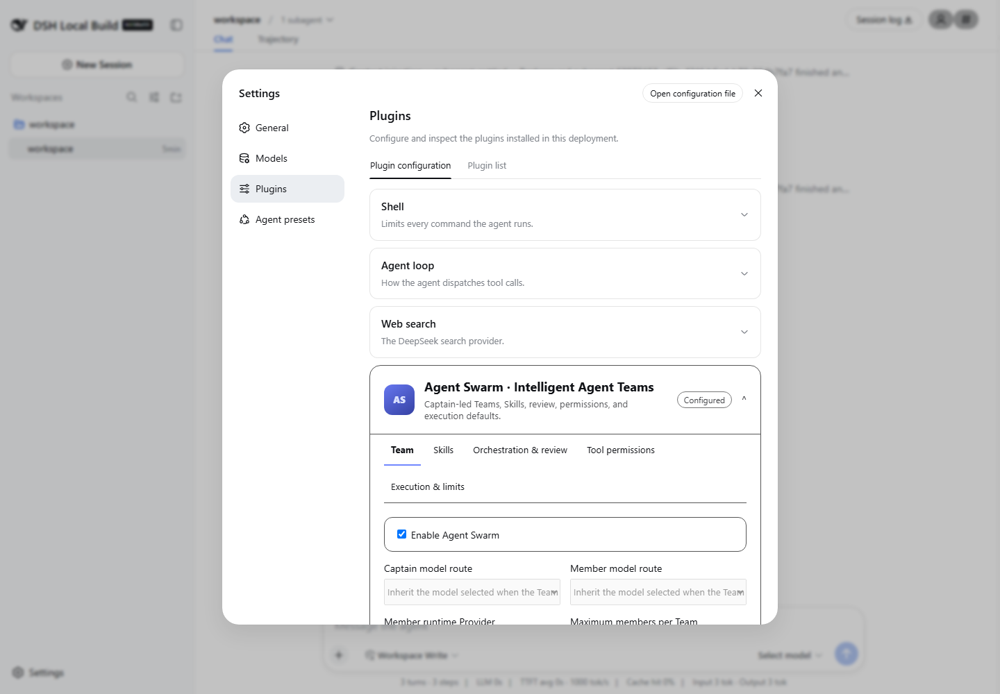
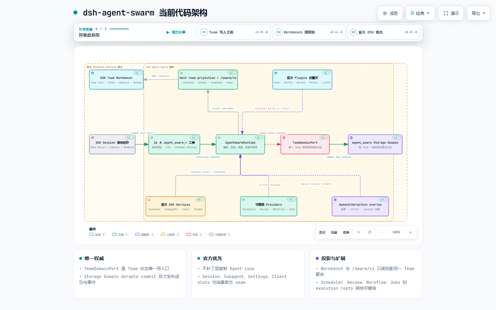

# dsh-agent-swarm

[](https://github.com/leinasi2014/dsh-agent-swarm/actions/workflows/verify.yml)
[](LICENSE)
[](https://nodejs.org/)

A persistent multi-agent team orchestration plugin for [DeepSeek Harness](https://github.com/deepseek-ai/deepseek-harness) (DSH).

It keeps the root session as the **Main Brain** while giving every managed team an independent **Captain Session**. Captains can recruit specialists, build task DAGs, dispatch work, review deliveries, and expose goals, announcements, people, tasks, and runtime state through a DSH-native side workbench.

> **Status:** actively developed pre-release source. The repository provides build, test, and packaging entry points, but no public npm release is available yet. `package.json` remains `private: true` to prevent accidental publication.

## Real Profile UI

These screenshots come from an isolated official DSH `web` Profile running a packed build of this repository. The Profile used separate Session, Storage Domain, and workspace roots; the Team, member, task, and accepted attempt shown below were created through the real plugin runtime rather than a mocked browser fixture.

### Team side workbench



The root conversation remains in the main Chat area while the selected Team is projected into the native DSH details surface. The workbench exposes the Team goal and announcement, Captain/member seats, task execution summary, and recent activity without turning browser state into Team authority.

### Plugin settings



Agent Swarm registers with the official Plugins settings surface. Its five groups cover Team defaults, Skills, orchestration and review, tool permissions, and execution/resource limits. Saved settings are validated and applied on DSH restart; existing Team state remains durable.

## Implemented capabilities

- **Main Brain and independent Captains** — `agent_swarm_create_managed` creates a dedicated Captain Session without replacing the root chat with team execution logs.
- **Team and member identities** — Captains and members can store a name, profession, personality, and safe pixel-style SVG avatar. Members run through the official continuable subagent seam.
- **Task collaboration** — DAG dependencies, priorities, revision CAS, `attemptId` fencing, targeted assignment, submission, reassignment, and Captain review.
- **Durable runtime state** — the Team aggregate is stored through the official Storage Domain; member descriptors, tasks, mailboxes, budgets, and memories can survive restarts.
- **Messaging and supervision** — persistent mailboxes, quiet/wakeup delivery, member interruption, budget limits, waiting, status reads, and pagination.
- **Memory and experience** — team-shared memory and member-private memory have distinct persistence and authorization boundaries.
- **DSH Team Workbench V3** — team rail, shared goal, latest announcement, and four mutually exclusive views: Workbench, Tasks, Announcements, and Management. Member and task details open as overlays instead of shrinking the root chat.
- **26 `agent_swarm_*` tools** — see [docs/04-core-protocol.md](docs/04-core-protocol.md) for parameters, permissions, and state contracts.

## Current code architecture

[Open the interactive Archify diagram](docs/assets/readme/architecture.html) to inspect source-backed components, guided write/read paths, themes, search, and relationship tracing.



The diagram is generated from the current `src/` graph, not from the future roadmap. Its source specification records the exact repository revision and 22 code references in [`architecture.archify.json`](docs/assets/readme/architecture.archify.json).

- **Write path:** the Main Brain, dedicated Captains, and members act through 26 scoped `agent_swarm_*` tools. `AgentSwarmRuntime` applies identity, revision CAS, and `attemptId` fencing before every Team mutation crosses the single `TeamDomainPort` contract.
- **Durable authority:** `StorageDomainTeamStore` stores one versioned Team aggregate per record in the official `agent_swarm` Storage Domain. Successful results and change events are published only after the authoritative commit.
- **Read path:** Host read projection and the local `/swarm/v1` RPC derive bounded binding, status, snapshot, and page views from the same aggregate. The DSH Team Workbench is a read/navigation Consumer, never a second state machine.
- **Official composition:** the plugin consumes official Session, Agent, Subagent, Tools, System Prompt, Session persistence, Storage Domain, Settings, and Client slot seams. It does not patch or duplicate the official Agent Loop.
- **Replaceable policy seams:** scheduling, review, workflow bridge, Team jobs projection, execution roots, permissions, and human-interaction correlation remain explicit Providers or overlays. Missing required services, invalid Provider selection, stale revisions, and stale attempts fail loudly.

## Quick start

### Requirements

- Node.js `^22.19.0 || >=24` (CI uses Node.js 24)
- pnpm `9.15.9`
- A DSH checkout/Profile compatible with the peer dependencies in `package.json` and the pinned baseline in `docs/OFFICIAL_BASELINE.json`

### Clone and verify

```bash
git clone https://github.com/leinasi2014/dsh-agent-swarm.git
cd dsh-agent-swarm
corepack enable
pnpm install --frozen-lockfile
pnpm verify:candidate
```

`pnpm verify:candidate` runs structure and boundary checks, linting, duplicate and dead-export checks, both type-check lanes, tests, scenario checks, builds, and package-artifact verification.

### Build a pre-release tarball

```powershell
$artifact = Join-Path $env:TEMP 'dsh-agent-swarm-artifact'
New-Item -ItemType Directory -Force $artifact | Out-Null
pnpm build
pnpm pack --pack-destination $artifact
$tgz = (Get-ChildItem $artifact\dsh-agent-swarm-*.tgz | Select-Object -First 1).FullName
```

Install development candidates only into a fresh, isolated `DSH_HOME` and Profile. Do not test them in your default user Profile:

```powershell
$env:DSH_HOME = Join-Path $env:TEMP ('dsh-swarm-home-' + [guid]::NewGuid().ToString('N'))
New-Item -ItemType Directory -Force $env:DSH_HOME | Out-Null
dsh plugin --profile web add --workspace-root $tgz
```

The Profile must still compose an official Storage hub, KV backend, Storage Domain, Session persistence, Subagent runtime, and a real LLM Provider. Installing this plugin does not automatically create a Team or spawn members.

### Configure and run an isolated Web Profile

Before the first boot, make sure the selected Profile resolves all of the required official services above. Configure the root/Captain model and member model routes through DSH's normal model configuration. Store provider credentials through the DSH credential service/Models page or the provider's documented environment variables; never place API keys in Team goals, announcements, memory, or committed Profile files.

Inspect the assembled Profile, then start the official Web host:

```powershell
dsh --profile web --dump-config
dsh --profile web --host 127.0.0.1 --port 3180 --no-open
```

Open `http://127.0.0.1:3180`, add the project through the official workspace selector, create a root Session, and select the model that will act as the Main Brain. The Team action opens the side workbench; it does not replace the root conversation.

## Basic usage

Describe the desired outcome in a DSH root session, for example:

```text
Create an independent delivery team. Ask the Captain to recruit specialists for
requirements, implementation, and review, then build and execute a dependency-aware
task plan for adding integration tests to this project.
```

A typical flow is:

1. The Main Brain calls `agent_swarm_create_managed` with the user's complete requested outcome, constraints, identity preferences, and acceptance criteria to create an independent Captain.
2. The Captain sets the team goal and identity, then recruits members with `agent_swarm_add_member`.
3. The Captain builds a DAG with `agent_swarm_create_task`; the scheduler dispatches ready tasks.
4. Members submit fenced attempts; the Captain accepts or rejects them with `agent_swarm_review_task`.
5. The user follows progress in the Team Workbench or opens Captain Chat to adjust goals and assignments directly.

After managed creation, the Main Brain may call `agent_swarm_list_managed_teams` once and then ends that turn. It must not poll the Team with `agent_swarm_wait`, `agent_swarm_status`, messages, shell sleeps, or repeated tool calls. Ongoing execution belongs to the independent Captain and members; observe it in the Workbench or talk to the Captain directly.

## Repository layout

```text
src/        Plugin host/client, domain, runtime, providers, and tools
tests/      Unit, composition, restart, fault, and UI tests
packages/   Reusable packages owned by this repository
docs/       Product, protocol, architecture, verification, and historical records
scripts/    Engineering gates, isolation lifecycle, packaging, and acceptance scripts
ref/        Pinned reference pointers; materialized source is read-only
.github/    CI workflows and pull request template
```

## Development and contributing

```bash
pnpm verify:isolation:status   # Before writing, freezing a candidate, or integrating
pnpm test -- <affected-test>   # Smallest affected check during iteration
pnpm verify:candidate          # Candidate engineering gate
pnpm verify:policy             # Only when governance/instructions/registered docs change
pnpm verify:compatibility      # When official/reference compatibility is decision-bearing
```

See [CONTRIBUTING.md](CONTRIBUTING.md) for managed worktrees, review, and serial integration. Start with [AGENTS.md](AGENTS.md) for the repository's authoritative development rules.

## Documentation

- [Documentation index](docs/README.md)
- [Product goals](docs/GOALS.md)
- [Core protocol](docs/04-core-protocol.md)
- [Implementation roadmap and exit criteria](docs/07-implementation-roadmap.md)
- [Testing and verification](docs/08-testing-verification.md)
- [Official-first development strategy](docs/11-official-first-development.md)

## Current limitations

- There is no public npm package, plugin-marketplace listing, or stable release identity yet.
- Privileged Browser/Canvas write and control capabilities are not exposed as a public protocol.
- Distributed cross-process CAS, remote members, and automatic Skill Evolution are future capabilities and must not be inferred from the current local runtime evidence.

## License

[MIT](LICENSE)
