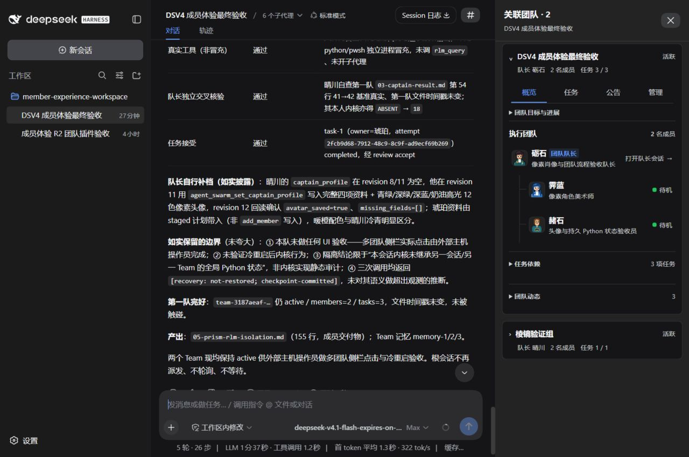
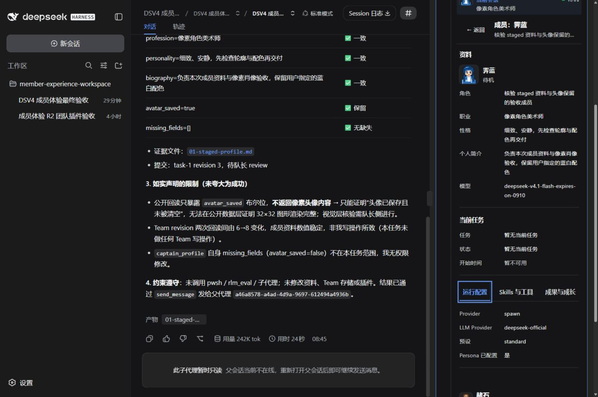
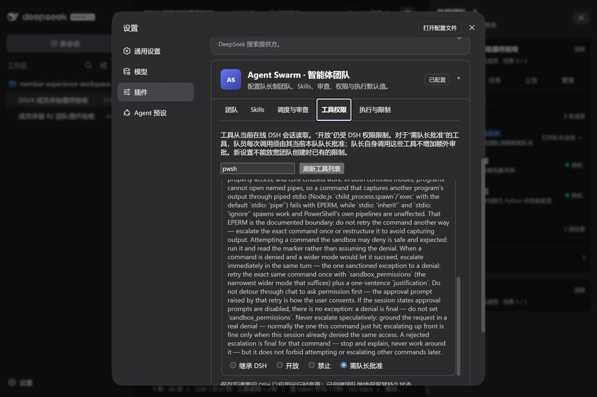

# dsh-agent-swarm

[](https://github.com/leinasi2014/dsh-agent-swarm/actions/workflows/verify.yml)
[](LICENSE)

`dsh-agent-swarm` 是 DeepSeek Harness（DSH）的多 Agent 团队插件。它保留根会话作为 **Main Brain**，为每个 Team 创建独立的 **Captain Session**，再由 Captain 招募成员、拆分任务、调度执行并审核结果。

> 当前状态：`0.1.1` 预发布源码，`private: true`。仓库可以构建、测试和打包，但尚无公共 npm 版本或稳定发布承诺。

## 用户体验

```text
用户与 Main Brain 对话
  ├─ 创建 Team A → 独立 Captain A → Members A1..An
  └─ 创建 Team B → 独立 Captain B → Members B1..Bn

Captain：设定目标和公告、招募成员、建立任务 DAG、审核提交
Member：只处理当前 fenced attempt，提交结果后等待 Captain 决策
团队侧栏：每个 Team 一张卡片，摘要展示队长、成员数和任务进度
团队卡片：概览 / 任务 / 公告 / 管理，队长下方是紧凑成员树
成员 Chat：点击成员进入官方会话，保留关联团队、个人资料和当前任务
```

Main Brain 不加入 Team roster，也不获得 Captain 权限。多个 Team 的 Captain、成员、任务和会话彼此隔离；浏览器 UI 只投影权威状态，不拥有另一套任务状态机。

同一主会话下的团队纵向排列，默认展开一个。点击团队标题只切换侧栏内容；点击队长或成员才进入对应 Chat。侧栏标注“主会话 → 当前团队 → 当前成员”，查看其他团队时仍保留当前聊天的归属，并可返回主会话。

## 已实现

- 独立 Captain Session、多个 managed Team；staged 招募保留完整成员资料，成员可完善自己的档案，并按喜好设计人物、动物、物品或抽象图案头像。新头像统一使用 32×32 点阵与调色板格式，注重配色协调，经受限网格/SVG 校验后显示。
- 按角色授权的 `agent_swarm_*` 工具，覆盖建队（含 Plan-first staged）、计划审批、成员、任务 DAG、定向分配、提交/审核、逐次工具审批、邮箱、预算、记忆、等待与分页读取。
- `revision` CAS 与 `attemptId` fencing；陈旧提交、重复执行和越权调用明确失败。
- 官方 Storage Domain 中的 durable Team aggregate；成员、任务、attempt、邮箱、预算、公告和公共目标可跨重启恢复。
- continuable subagent 成员、可替换 Scheduler/Review Provider、可选 Workflow bridge、Jobs 只读投影和每 attempt execution root。
- Team 级 Skill allow-list、Captain/成员模型路由、资源上限和官方 Plugins 设置页。工具权限读取当前 Agent 的正式工具目录，可搜索并选择继承、开放、禁止或需队长批准；未加载工具的已有配置仍保留。
- 成员工具调用需要队长批准时，经现有 Team 邮箱唤醒所属 Captain；批准仅释放原成员的那一次有效调用，拒绝、取消或超时不会执行工具，官方权限限制继续生效。
- 团队共享记忆与成员私有 append-only memory，二者具有独立授权和持久化边界。
- Plan-first staged 审批流：`create_managed(stage=true)` → `set_plan` → `approve_plan`（官方 `ctx.userQuestions` 批准/放弃）→ 原子激活并 provisioning Captain/成员/任务；崩溃窗口由启动恢复补齐；放弃/归档幂等；右侧 Team 表面新增“计划审批”卡（staged 只读投影）。
- read-only Host projection、同源 `/swarm/v1` RPC 与 DSH 团队侧栏：多团队卡片、真实任务进度、Captain→成员→当前任务层级、官方 Chat 导航。关联团队读取校验正式 Session 父子关系和有效成员身份，不向无关会话或工作区扩展权限。
- 成员详情始终保留资料和当前任务；运行配置、Skills 与工具、成果与成长使用三个页签。没有当前任务时显示空状态，不把已完成任务当成正在执行。

## 尚未交付

- 公共 npm/插件市场发布、稳定版本兼容矩阵和面向用户的升级/回滚流程。
- 由已验证 human principal 驱动的通用 browser/RPC 直接写控制；当前主要写路径仍是 Main Brain、Captain 和成员通过模型工具执行。
- Canvas 原生 Consumer、远程成员、跨进程分布式 CAS/lease/fencing 与完整变更流。
- 自动 Skill Evolution；现有 Skills、记忆和验收证据不会自动改写 Skill。
- 覆盖所有支持环境的发布级 E2E、可访问性和故障恢复矩阵。

这些缺口的优先顺序和“90% 产品就绪”定义见 [实施路线](docs/07-implementation-roadmap.md)。

## 架构

```text
Official DSH
  Sessions / Agents / Subagents / Tools / Workflow / Storage / Settings / Client slots
                              │
                              ▼
AgentSwarmRuntime → TeamDomainPort → StorageDomainTeamStore
       │                 │
       │                 └─ Team、roster、task、attempt、mailbox、budget 的唯一写权威
       ├─ Scheduler / Review / Workflow / Workspace / Permission Providers
       ├─ 按角色授权的 agent_swarm_* 模型工具
       └─ Host read projection → /swarm/v1 → Team Workbench
```

- 官方 DSH 是唯一 Runtime、Profile、Session 与 Agent Loop 宿主。
- 所有 Team mutation 经过 `TeamDomainPort`，durable commit 成功后才发布结果和事件。
- UI、RPC、prompt、日志和缓存都是 Consumer 或 projection，不能重建第二份 Team truth。
- 每个注册、监听、timer、route、subagent 和 client mount 都必须有 lifecycle owner 与 disposer。

详细边界见 [产品章程](docs/GOALS.md)、[愿景](docs/00-vision.md)、[能力架构](docs/03-capability-family.md) 和 [核心协议](docs/04-core-protocol.md)。

## 界面

同一主会话的两个真实团队：每队一张卡，摘要持续可见，展开后显示紧凑成员树和四个团队页签。



成员 Chat 中的资料、当前任务和三个详情页签。图中任务已经结束，因此当前任务显示为空。



官方 Plugins 设置中的 Agent Swarm 工具权限目录，支持搜索与逐项策略选择。



以上图片于 2026-09-09 从隔离的官方 DSH `0.1.2-rc.1` Web Profile 实际截取，桌面视口为 1280×850，未用草图或模拟数据替换界面。截图展示界面状态，不替代发布级端到端验收。

**显示宽度：**建议浏览区域至少 1024px 宽。官方布局需要约 1000px 才能同时容纳聊天与右侧 Details；更窄时会隐藏右栏，拉宽后恢复。长成员资料在侧栏中滚动查看。

## 本地构建

要求：Node.js `^22.19.0 || >=24`、pnpm `9.15.9`，以及与 `package.json` peer dependencies 和 `docs/OFFICIAL_BASELINE.json` 一致的官方 DSH。

当前依赖基线为官方 DSH `0.1.2-rc.1`。Session 使用官方 JSONL persistence；客户端通过 `remote.session.modelCatalog()` 读取模型目录。已有 Profile 升级前须保留原 Session/Storage，不把新空 Profile 的通过当成旧数据迁移验收。

```bash
corepack enable
pnpm install --frozen-lockfile
pnpm verify:candidate
pnpm build
pnpm pack --pack-destination <artifact-directory>
```

预发布包只应安装到 fresh、isolated `DSH_HOME` / Profile。Profile 还必须显式组合官方 Storage、Storage Domain、Session persistence、Subagent runtime 和真实 LLM Provider。安装插件不会自动创建 Team 或成员。

```powershell
$env:DSH_HOME = Join-Path $env:TEMP ('dsh-swarm-' + [guid]::NewGuid().ToString('N'))
dsh plugin --profile web add --workspace-root <absolute-path-to-tarball>
dsh --profile web --dump-config
dsh --profile web --host 127.0.0.1 --port 3180 --no-open
```

## 基本使用

在根会话中描述完整目标，例如：

```text
创建一个独立交付团队。让 Captain 招募需求、实现和审查成员，建立依赖任务，
完成此仓库的集成测试，并以可执行测试结果作为验收证据。
```

Main Brain 调用 `agent_swarm_create_managed`（不加 `stage`）后应结束当前轮次，不轮询 Team；后续执行由独立 Captain 和成员负责。需要“先审批后开工”时使用 `create_managed(stage=true)` + `set_plan` + `approve_plan(ask_user=true)`（或 `discard_plan`），右侧 Team 表面会显示待审批计划卡。

团队可用后，侧栏自动显示相关团队。展开卡片查看概览、任务、公告或管理；点击成员进入其 Chat，资料和当前任务位于三个详情页签之外。工具策略可在“设置 → 插件 → Agent Swarm → 工具权限”中配置，保存后的生效范围与重启要求以设置页提示为准。

## 开发入口

```bash
pnpm verify:isolation:status
pnpm test -- <affected-test>
pnpm verify:candidate
pnpm verify:policy          # 变更治理、指令或登记文档时
pnpm verify:compatibility   # 官方/参考兼容事实参与决策时
```

仓库开发只允许通过 `pnpm isolation open|status|close|reconcile` 使用受管 writer allocation；不要直接创建 Git worktree。贡献规则见 [CONTRIBUTING.md](CONTRIBUTING.md)，文档入口见 [docs/README.md](docs/README.md)。

## License

[MIT](LICENSE)
