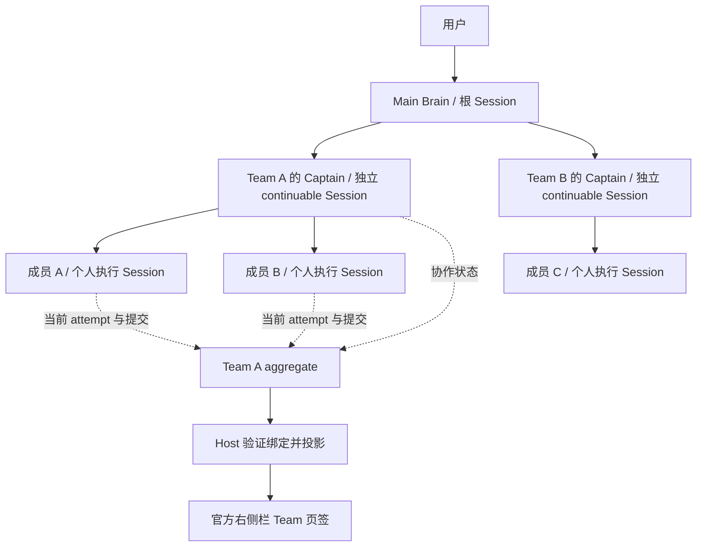
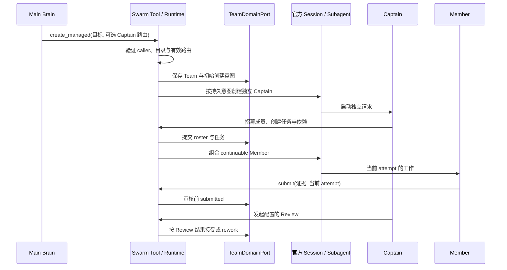
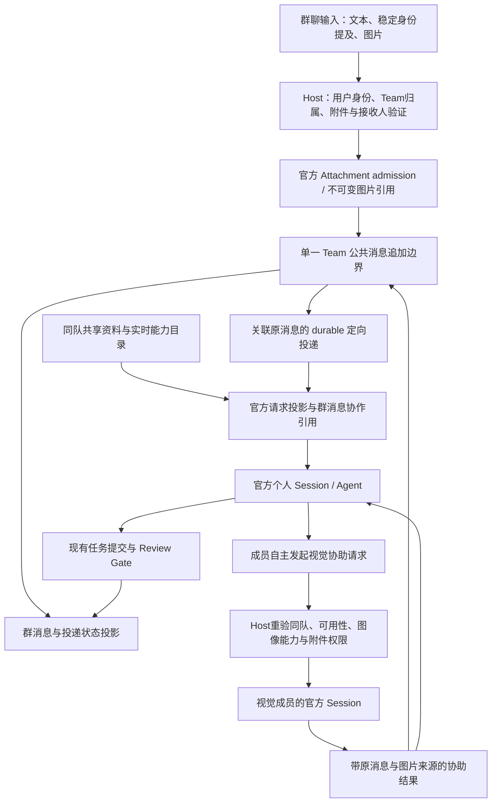

# 03. Team 总体架构与能力边界

本文件是 Team 总体架构与 capability ownership 的唯一说明。具体状态机、错误和并发合同以 [04-core-protocol.md](04-core-protocol.md) 为准；界面结构以 [10-team-ui-layout.md](10-team-ui-layout.md) 为准。下文区分已有实现、接入约束与后续设计；设计图不证明某个安装环境已完成验收。版本身份读取 [OFFICIAL_BASELINE.json](OFFICIAL_BASELINE.json)，部署与验收结果留在对应候选和真实运行证据中。

## 1. 组合图

```text
Official DSH execution plane
  Session + Agent + Subagent + Tools + System Prompt
  Workflow + Jobs + Storage Domain + Settings + Client slots
                              │ consumed by
                              ▼
AgentSwarmRuntime
  ├─ TeamDomainPort ── StorageDomainTeamStore
  │    Team / Captain binding / roster / tasks / attempts / mail / budget
  ├─ orchestration Providers
  │    Scheduler / Review / Workflow bridge / execution root / permission
  ├─ model Consumers
  │    role-scoped agent_swarm_* tools + ordered usage prompt
  ├─ read producer
  │    Host binding → /swarm/v1 read RPC
  └─ client Consumers
       Team Workbench V3 + Plugin Settings
```

`TeamDomainPort` 是 Team 协作的唯一 mutation 边界。Human-interaction overlay、workflow run overlay 和 member-private-memory domain 只拥有自己的关联数据，不复制 Team aggregate。

### 1.1 用户、会话与执行关系



Main Brain 负责跨 Team 的用户入口；Captain 在自己的 Session 中统筹单个 Team；成员的模型调用、工具执行和结果保留在各自 Session。Team 是协作域对象，不是另一份聊天历史。成员间邮箱消息可以进入收件人的官方模型上下文，但不能把多个个人 transcript 拼接成 Team 的权威群聊。

### 1.2 权威与投影

| 数据或动作 | 唯一权威 | 允许的投影与边界 |
|---|---|---|
| 模型请求、工具调用、会话模型选择 | 官方 Session log / Agent / model selection | UI 可展示已记录事实；Team 初始路由不能覆盖会话当前选择 |
| Team、成员绑定、任务、attempt、邮箱、预算 | `TeamDomainPort` 与官方 `agent_swarm` Storage Domain | Host/RPC/UI、prompt 与 Jobs 只消费对应 projection |
| 子会话地址、父子关系、导航和后代计数 | 官方 Subagent catalog / Sessions service | 插件核验归属并替换显示文字；不生成地址或自算官方计数 |
| Settings 默认值 | 官方 SettingsScope 与插件 config | provider/model 成对保存、回读，在重启后重新组合 runtime |
| 面板是否展开、选中页签及宿主布局 | 官方 SidebarRight；插件只保存必要的 UI 选择 | 页面刷新不重开用户已关闭的页签；选择状态不构成读写权限 |
| 成员工作文件 | execution-root Provider 的当前租约 | 绑定真实工具 cwd/FS capability；不是 Prompt 路径，也不是仓库开发 writer 分配 |

UI 的 controller 复用同一个只读目标和读取生命周期。姓名、状态、进度或页面是否可见都不能反向改变 Team 权威。

### 1.3 官方 Agent Teams 的复用边界

固定版本已发布的 `@deepseek-ai/dsh-experimental-agent-team` 提供基础招募、耐久成员邮箱、DAG/CAS 任务板及恢复，配套 tool/client 包提供模型工具和基本面板。本插件尚未接入该 Team Provider，但已直接复用官方 Session、Agent、Subagents、Storage Domain、Skills、Workflow/Jobs 和 Client 扩展；这些底座不属于新增的替换机会。

基础成员生命周期、peer mailbox 和基本任务板是优先评估的职责替换候选。不能仅因接口名称相似就挂载第二个 Team 写权威：官方将普通 root Session 作为 Lead，排除 provider-owned continuable child，而当前 managed Captain 正是 Main 的 child；官方任务没有本插件的 attempt/Review Gate 与预算共同提交入口，邮箱也没有当前 quiet 与任务过期取消合同。直接接入会改变产品语义，双写官方任务与自建 attempt 不能替代当前事务。

功能完整性优先于复用。只有官方公开组件已具备所需的 Host 绑定、原子后端和策略能力，且实际组合保持功能时才由 Swarm 适配；尚缺接口的职责标为“等待官方完善”，不为采用主动开发官方补丁或私有分叉。保留 Main→Captain→member 的真实 Session 层级和现有 Storage Domain 聚合的唯一持久权威；官方基础操作必须能与 Swarm 的 attempt、Review Gate、预算及取消策略在同一事务中提交。`TeamDomainPort` 保持对现有 Consumer 的兼容入口，不另实现一套与官方并行的通用算法。

官方当前把同步 Session projection 与私有 Journal/Roster/Mailbox/TaskBoard 直接组合，尚无可替换异步事务后端；公开生命周期缺少 removed 和本插件的失败重试语义。这些限制未由官方补齐前保留现有实现，不重复投入迁移。成员退出仍须同时撤权、fence/requeue attempt 和终止旧消息，不能把 removed 映射为 failed，不能把普通缓存当作授权事务。Main 作官方 Lead 的扁平化路线、Captain 改普通 root 的路线都会改变现有真实层级，不采用。

采用顺序、功能清单、扩展点验证和回退条件见 [统一开发方案 §2.1](07-implementation-roadmap.md#21-官方-agent-teams-完整功能采用方案)。每项在同一版本的实际组合中通过后才删除相应自建职责，不能凭源码同名或模型自评放行。依据见 [官方源登记](09-sources.md)及固定版本的 agent-team 服务、roster、mailbox、journal、projection 和 task-board 源码。

## 2. 当前实现

| 能力 | 当前 owner / seam | 已实现边界 |
|---|---|---|
| Main Brain → Captain | official Session/Subagent + dedicated captain provisioning | 默认 managed Team 创建独立 Captain；可选 staged 计划审批后激活；root 留在 Team 外；支持多个 Team |
| Team state | `TeamDomainPort` → `StorageDomainTeamStore` | versioned aggregate、durable commit、显式迁移；legacy file store 只读 |
| 成员与身份 | official continuable subagent + identity context | 招募前校验 route；队长分配职责/职业，各人自定四项资料并在保存读回后绘制头像；当前资料进入官方 prompt，durable descriptor 支持恢复 |
| 任务 | Team domain + `AgentSwarmRuntime` | DAG、priority、target member、revision CAS、attempt fencing、submit/review/reassign；工作请求、开放认领、任务活动与目标生命周期共享该权威 |
| 调度 | Scheduler Provider registry | 默认 priority-ready；adaptive 与 workflow run 保持单一 transition owner |
| 审核 | Review Provider registry | manual、executable commands/templates、review root 与 reviewer boundary |
| 邮箱与交流 | durable Team mailbox + wakeup surface | quota、receipt、quiet/wakeup、真实 reply_to、按成员限制主动同伴唤醒、队长持久覆盖、bounded wait 与 spin fuse |
| 预算 | Team budget + committed usage fold | token/request/retry 限制、reservation、carry、exhaustion/recovery |
| Skills | `TeamSkillSurface` + `allowedSkills` setting | 三层区分（issue #184）：Team allowed（不可变策略）/ member assigned（招募时子集，持久化+重启重建，进一步收窄 surface）/ Session-visible（官方 scoped catalog，仅可见不等于拥有）；不自动演化 Skill |
| Tools | official tool restriction + plugin permission surface | Captain-only 隐藏、成员 deny-only 收窄、plugin allow/ask/deny setting |
| Memory | Team memory + private-memory domain | 共享分类记忆；成员私有 append-only memory 和独立授权 |
| Workflow/Jobs | official Workflow bridge + caller-scoped jobs projection | 可选、显式启用；唯一 Consumer seam 是 `ctx.agentSwarmWorkflow.start(request)`，仅委托同一 bridge，不提供激活/销毁权限；disabled/unload 时服务缺席，默认官方 `workflowEngine` 不变。`runtime.workflowBridge` 是内部实现细节；jobs 是 read projection，不影子注册官方 producer |
| Execution root | execution-root Provider | 可选 per-attempt 物理 root、capability 声明、settlement 和 residue 告警 |
| Host/RPC | Host target read + versioned public/work/goal Consumers | `/swarm/v1` 保持只读；公共消息、工作请求和目标控制分别按其版本接口授权、提交和读回 |
| UI | official Client slots / Session navigation / Settings | Workbench、Tasks、Announcements、Management、栏内详情、Captain Chat、V7 公共群聊及设置页 |

## 3. 模型工具面

`src/tools/index.ts` 汇总当前 `agent_swarm_*` 工具，按职责分组；各 caller 只看到其权限允许的面：

- Team lifecycle：create/create-managed、identity、goal、announcement、member、archive、interrupt。
- Task board：create、claim、submit、review、reassign。
- Plan-first：set-plan、approve-plan、discard-plan。
- Collaboration：send-message、set-communication、wait。
- Budget and memory：set-budget、shared memory、member private memory。
- Read surfaces：status、managed teams、members、tasks、jobs、memory。
- Policy helpers：逐次工具审批；运行时按 caller role、live Agent/Session、revision 和 attempt 过滤权限。

工具只暴露 Team 概念，不暴露 Storage key、内部 Session token 或 Provider 私有状态。授权来自 `exec.agent` 和权威绑定；参数中的 id 只是查找条件。

## 4. Host、RPC 与 UI

Host 从官方 live/cold Session、workspace scope 和 Team Captain binding 建立读上下文。`/swarm/v1` 只发布严格、版本化的 read envelope；公共群聊、工作请求与目标控制使用各自的版本化写入入口。客户端不能上传 principal、Captain Session 或 provenance 来扩大权限，详见核心协议的公共消息、工作请求与目标生命周期合同。

Workbench 消费同一 read contract：公开目标、成员身份、任务/attempt、budget 和 activity 来自权威 projection。布局、卡片层级、页签、详情、短名称、窄屏与错误展示统一定义在 [UI 布局设计](10-team-ui-layout.md)，不在本文件维护第二套视觉规则。

SidebarRight 拥有展开、浮动、分栏及可见性；插件通过 `openTabIn` 寻址选中的 Session，以实际页签挂载确认显示。成员导航复用官方 continuable child catalog，精确父子地址和每次读取的权限验证见 [核心协议](04-core-protocol.md)。管理页的交流强度请求进入正式 Captain human prompt，由队长调用工具保存，canonical read-back 决定应用状态；`/swarm/v1` 的 direct write capabilities 仍 unavailable。

Plugin Settings 是独立的官方 Settings Consumer。它配置默认模型、成员 provider/depth、Skills、Scheduler/Review、tool policy、默认交流强度、Workflow/Jobs/execution roots 和资源限制；设置在重启后重新组装 runtime。队长保存的本队交流覆盖立即持久生效，清除覆盖后跟随插件默认。

默认模型选择读取官方 remote Session catalog；provider/model 成对以 SettingsScope `mutate` 提交并回读。路由优先级为调用显式参数、插件默认、发起者当前 Session request header。`create_managed` 支持 `captain_llm_provider`、`captain_model`、`captain_reasoning_effort`；成员招募和计划审批支持 `llm_provider`、`model`、`reasoning_effort`。同路由省略推理等级时继承发起者当前等级，换路由时使用新模型默认；显式等级由目标模型验证。即时创建和 staged 审批均在 Team 提交中保存初始路由，启动失败后恢复不会改用后来的默认值。

身份详情展示 durable personality/biography，成员自行更新姓名、性格、简介与头像；Captain 的成员资料管理限于职责和职业。当前资料及有效交流策略共同构成 prompt 快照，不重写历史。

独立 managed Captain 可调用 `agent_swarm_set_captain_model` 修改自身后续请求的模型，不中断当前请求，不修改插件或全局默认。选择保存在该 Captain 自己的官方 `model/selection` 会话事件中，由官方 projection 与 `installModelSelection` 恢复；继承的父会话历史不能覆盖子会话的初始路由。此入口要求 Host 提供官方模型选择 projection；legacy 根 Captain 继续使用 Host 模型选择器。Team 内的 `captainRoute` 只保存初始创建意图，当前使用的模型以 Session 请求记录为准。

### 4.1 创建与执行链路



此图表示行为顺序，不额外定义跨服务事务。启动、重试、回滚与部分失败服从现有 provisioning 和 Domain 合同；提交证据只进入 submitted，不能由 UI 或自然语言直接变为 completed。staged Team 的计划批准是独立入口，必须在激活前验证并保存相应路由。

### 4.2 模型路由的两个时点

| 时点 | 决策路径 | 检查结果的依据 |
|---|---|---|
| 新 Captain / Member 创建 | 显式调用参数 → 插件该角色默认 → 发起者当前 Session；校验 provider/model 与 effort 后持久保存创建意图 | 首个实际请求的 `request/header` |
| 独立 Captain 自行换模型 | caller 必须是当前绑定 Captain → 官方模型 resolver 验证 → 写入该子会话的官方选择事件 | 下一次实际请求的 header 与冷恢复后的请求 |

两条路径不互相替代。设置页保存成功、工具返回成功、初始路由字段和模型实际生效，是不同证据。更换路由时推理等级的继承与默认规则继续服从本节已有合同。

### 4.3 UI 接入与官方扩展边界

Swarm 使用官方 Session 导航、SidebarRight、Settings、locale 和 slots。会话顶部文字通过通用 `conversation.session.header.lineage.display` seam 接入；Core 提供实际 owner、原始文字、地址与计数，Swarm 只返回文字显示。该 seam 属于需要随目标 Core 交付和核验的扩展，不能据此声称某个官方已发布版本自带这项能力。

显示 Consumer 不替换 Core 的导航控件、可访问性语义或事件处理；插件缺失、关系未知或数据陈旧时沿用 Core 原始文字。安装包构建成功不能证明 Host 使用了对应 Core seam，须结合实际包导出、装配和浏览器结果验收。

## 5. 生命周期与失败语义

- `sessionPersistence` 和 `storageDomain` 是 required injection；缺失时插件保持 pending，不降级为易失状态。
- 未知 Provider、无驱动的 workflow mode、非法 Skill/tool policy、stale revision/attempt 和 identity mismatch 都 fail loud。
- 注册、route、listener、timer、waiter、subagent、workflow、storage domain 和 React mount 均由 Cordis effect 或显式 disposer 回收。
- unload 先关闭 admission，再收敛在途事务，最后释放资源。
- Workflow bridge 恢复在局部 store/domain 上完成后才发布；恢复失败按 store → domain 回收，保留原始和清理错误。同域可重试；正在打开资源时的 unload 等待该次 activation 回收，不留下部分激活的句柄。
- legacy Team import 只允许显式单向迁移、空目的地和 durable read-back；不自动迁移、双写或 fallback。

## 6. 尚缺能力

| 缺口 | 所需边界 |
|---|---|
| 公共稳定发布 | immutable package identity、兼容矩阵、upgrade/rollback、发布观察 |
| browser/RPC direct controls | verified human principal、operation-scoped idempotency/read-back、逐 capability 开放 |
| Canvas Consumer | 复用已接受的 RPC schema/fixtures，Canvas 只做宿主原生投影 |
| 远程成员与 distributed store | real remote executor、CAS/lease/fencing、partition/late-ACK/recovery tests |
| 自动 Skill Evolution | accepted evidence → proposal → deterministic validation → approval → write 分权 |
| 发布级 UX/E2E | fresh Profile、多 Team、重启、accessibility、error/reconnect、卸载/升级矩阵 |

缺口不能通过新增 UI 状态、第二 storage、transcript parser 或更宽模型权限绕过。

团队公共群聊属于独立的产品方向，其边界与定稿布局见 [UI 布局设计第 8 节](10-team-ui-layout.md#8-团队公共群聊v7-定稿)。实现新增写入切片前，需要在核心协议中定义消息权威、写入身份、幂等、投递与重启语义；现有邮箱和个人 Session 不自动等于可编辑的公共群聊。

### 6.1 公共群聊的候选架构

本节约束已选定的 V7 功能开发。群聊新增 API、消息与调度仍须按独立切片实现；现有 `/swarm/v1` 只读合同在明确版本化扩展前保持不变。功能范围见 [产品设计](00-vision.md)，界面与交互见 [UI 第 8 节](10-team-ui-layout.md#8-团队公共群聊v7-定稿)。



公共消息只有一个耐久记录入口。优先作为 `TeamDomainPort` 现有协作域的扩展，沿用官方 Storage Domain 和提交后发布原则；不建立可独立修改的平行聊天数据库。个人 Session 保存模型实际收到的输入及执行历史，公共消息是显式发布的协作记录，两者通过 ID 关联，不拼接多个 transcript。大规模消息需要分页时可调整内部存储形式，外部 mutation owner 仍保持唯一；具体 schema 必须在实现前纳入核心协议。

| 事实 | 唯一来源或候选 owner | 必需关联 |
|---|---|---|
| 公共消息 | Team 公共消息追加边界 | `teamId`、稳定 `messageId`、发送人身份、`replyTo`、顺序、时间、提及成员 ID、附件引用 |
| 接收与模型消费 | 现有 durable 邮箱及官方 Session 事件 | 原消息、接收人、投递 ID、实际消费事件；全员可见不表示全员已消费 |
| 图片 | 官方 Attachment 服务 | 不可变 `ImageAttachmentRef`、内容完整性与授权访问；不以本地路径或外部 bearer URL 作为转交权限 |
| 共享队员目录 | Team identity / roster 加官方成员组合、Skills 与 LLM 能力的只读投影 | 稳定成员 ID、目录 revision、各来源更新时间与完整性 |
| 视觉协助 | 原接收人的受控协作请求，经 Host 验证与耐久投递 | 原消息、图片 ID、发起人与视觉成员、协助 request ID、回报 ID、到期和已访问成员 |
| 任务、审核、模型选择 | 现有 Team 任务/attempt、Review Gate 与官方 Session model selection | 协助只是来源关联，不暗改任务 owner、审核权或模型 |

公开消息提交与投递意图必须可从耐久状态重建。图片先经过官方 admission；附件失败时整条消息不标记成功。提交时冻结 `teamId`、接收人 ID、附件引用与草稿版本；异步完成只更新原群与原草稿，不随用户当前选择改变目标。公共消息已提交而投递尚未完成时显示排队，恢复过程按 `(messageId, recipientId)` 幂等补投；重试上传、发送、协助和公开结果均保留同一逻辑请求身份。消息顺序来自耐久提交，不采用客户端时钟决定先后。

### 6.2 共享队员目录与能力判定

每个成员在首次加入、恢复及核心协作信息改变后的下一次处理前，自动获得来自当前 Team 聚合的轻量摘要：稳定 ID、名称、职责、职业、成员阶段和开放任务。本人身份与角色指令保留；自动装配不读取全员 Session、模型、Skills 或工具目录。

UI 资料卡、`@` 候选和显式 `agent_swarm_directory` 继续消费同一个受验证的完整目录，不各自猜测或维护姓名缓存。完整条目包括稳定 ID、名称、职责、职业、性格、简介、Skills 名称及用途、assigned 与 Session-visible 状态、工具可用/需批准/禁用信息、当前 provider/model、图像能力、成员阶段、当前任务及各来源时间。自动摘要限制成员和任务数量、缩略长职责与题目，并标明未读数量及显式读取入口；需要完整资料、能力或任务详情时再读取对应工具。Skill 正文通过已有授权读能力按需获取，不将分配某 Skill 等同于已学会、已使用或有权调用全部相关工具。成员私有记忆、凭据、系统私密内容与原始工具秘密参数不进入目录；队员资料作为协作数据，不获得系统指令权限。

图像能力读取目标 Agent 当前解析模型的官方 `inputModalities`，并与实际组合/权限一起确认：包含 `image` 为已声明支持，明确省略为不支持，字段缺失为未知。不得依据模型名称、职业、性格或自我介绍猜测。派发协助时重新核验目录 revision 与成员当前状态；模型变更、成员退出或权限撤销会使旧能力判断失效。

### 6.3 非视觉成员的自主图片转交

1. 用户发给非视觉成员的群消息先保留完整文字和官方 admission 后的原始图片引用。Host 为明确不支持图片的目标使用官方 `textOnlyImageText` 生成占位，并附可申请协助的受控消息/图片 ID；官方 Subagents 图片能力入口会先拒绝此类目标，不能把原图交给它后寄望下游自动投影。原图仍留在 Team 的唯一消息记录中，占位不伪造图片描述，也不授予任意附件访问。能力未知保持 deferred，不能按已支持图片发送。
2. 原接收人读取共享目录，选择同队可用且图像能力已确认的成员，调用拟新增的视觉协助 capability。Host 验证发起人、Team、接收人、原消息可见性与附件访问权，并从原消息解析图片；模型不能提交任意路径或伪造附件引用越权读取。
3. 视觉成员通过官方 Attachment/Session 通道实际收到图片及明确问题。协助结果引用原消息和图片，公开摘要进入群聊，结果定向回到原接收人；原接收人继续负责自己的任务。
4. 同一协助请求复用不可变图片，保留稳定请求与结果 ID；限制重复/并发重试，记录已访问成员，初始方案禁止协助对象继续链式转交同一请求。无可用视觉成员、能力未知、超时或内容不可读时公开明确状态，由原接收人/Captain 决定下一步，不反复互相唤醒。
5. 图片协助不会自动招募新成员、切换原成员模型、扩大工具权限或接受任务。是否以后允许 Captain 受预算约束补充视觉成员，另作扩展。

图片追加、授权读取和协助是现有 Host、TeamDomain 与 Client Consumer 的扩展，不新增 Service 或恢复 owner。Attachment 是可选服务，缺失时明确关闭图片路径而保留文本路径。已支持图片的目标经官方 `readImage` 完整性校验后，由现有 `@deepseek-ai/dsh-subagent/internal` 的 `steerHostSubagentPrompt` 接收原始 `ContentBlock[]` 与真实来源，沿官方 ContinuationManager 执行能力、准确父级和冷恢复校验。该入口是固定 alpha.2 已发布的 internal Host adapter，升级须验证契约，不称为稳定公共 Service。它避免将已 admission 的图再编码送入 `subagents.prompt` 导致二次 normalization 和引用漂移；仍须由 Host 检查 Team 访问权、当前成员、取消信号及 Captain lease。

读取证据入口为 `packages/attachment/attachment/src/types.ts`、`packages/client/file-upload/src/types.ts`、`packages/llm/llm/src/content.ts`、`packages/subagent/subagent/src/internal.ts` 与 `src/continuation.ts`。官方 file upload receipt 具有接收 Agent scope；群聊不另设 receipt 上传协议，而在同一 v3 append 中由 Host 整批 admission。两参考源只供 durable-before-live 投递和 Swarm 协作失败语义，附件及 Session 类型遵循官方。具体 wire、投影冻结与去重见 [图片与视觉协助协议](04-core-protocol.md#83-公共图片与自主视觉协助)。底层接口证据不等于群聊功能、真实模型或冷恢复验收；本轮产品不包含视频。

### 6.4 发言模式扩展与验收边界

队长协调、轮流发言、自由发言属于未来 admission/scheduling policy，必须复用同一个任务/消息投递 owner。它们不等于 UI 刷新频率或现有交流强度；公开范围、任务状态与模型消费事实保持独立。轮流模式需持久轮次与发言权，自由发言需公平性、预算、结束条件及回应风暴抑制；切换要验证权限、revision 和在途工作边界。此轮只记录扩展，不注册 mode runtime 或假造生效状态。

代表性设计验收覆盖：同名/改名/退出成员的 `@`、中文输入法与键盘、多提及去重、图片独立发送与上传失败、切 Team 草稿隔离、非视觉原接收人自主选择视觉成员、未知/撤销能力、零视觉成员、协助去重与责任保持、目录变更后成员读到新资料、关闭页面和冷恢复后原消息/图片/结果仍可追溯。原型交互、静态设计、真实模型、持久化及正式部署分别记证据。

### 6.5 目标推进与任务认领的候选扩展

本节约束 [选定产品方向](00-vision.md#32-团队目标与任务协作选定方向新增机制尚未实现)。工作请求和开放认领以 [核心协议 8.4](04-core-protocol.md#84-工作请求与公开任务事实) 为准，目标控制以 [核心协议 8.5](04-core-protocol.md#85-目标修订暂停与维护待命) 为准；具体安装的可用能力和真实验收仍须分别核对。

1. **保留一个正式任务权威。** 沿用 Team domain 的任务、owner、attempt 与 Review Gate；群消息、工作请求和公告通过 ID 引用。工作请求可由原群消息及其处理结果表达，采纳后按原请求身份幂等创建任务，未创建前不占用正式任务编号、进度或执行槽位。来源、创建者、执行者与验收者的新增关联须从实际 Host/Agent authority 派生并耐久保存，不能相信浏览器填写的 actor。
2. **保留现有成员权限，显式增加人类入口。** `createTask` 与 self-claim 面向活跃 Team participant，指定别人和管理操作仍受 Captain 边界限制。人类和 Main 通过有来源的工作请求参与，普通成员创建不被降为待审批提案。目标保存和控制则由独立 `goal/v1` 接纳真实 local-operator、准确 Main 或 Captain；浏览器不借所查看成员身份，Captain 单独确认协调及达成结论。
3. **开放认领是独立的任务策略。** `automatic` 为默认，`open-claim` 不与固定目标成员并存。开放任务从自动 Provider 候选中排除，Host 自领和改派检查同一策略；改为指派时以同一 Task revision 原子更新策略与目标。认领沿用依赖、active membership、成员忙碌、预算、revision CAS 和 attempt fencing，并在实际新增 attempt 的事务中检查暂停。
4. **认领需要可恢复的通知。** 同队符合条件的空闲成员通过现有 durable mailbox 收到有界、幂等的“有任务可认领”通知，再读当前任务并自主决定。竞争失败后刷新或结束，不能循环抢领；成员退出、任务变化与恢复需重新核验资格，未交付通知可以恢复。此策略不是添字段就完成，也不建立第二个调度 owner。
5. **目标修订协调只由一个编排 owner 驱动。** `publicGoal` 是唯一正文，optional `goalLifecycle` 保存独立控制 revision、目标修订、结果水位、唯一当前通知及 Captain 协调事实。开始/继续、运行目标修改、实际 review/cancel 结果和维护到期形成有界协调；一般 Team 更新及 usage 不成为重复规划触发。复用原 adaptive owner、邮箱、单次最早 timer、预算和准确 Main→Captain 官方恢复；workflow 持有期间延后，workflow-only 不承诺自主开始。目标修改不改写已有任务或历史输入，Captain 通过原任务操作与显式 cancel_task 处理受影响工作。
6. **暂停在所有新增 attempt 边界一致执行。** Domain claim/retry 的实际 seating 检查覆盖自动派工、自领、返修和重派后的新认领。暂停保留已有 reserved/排队/运行 attempt 的投递、提交、审核、原 attempt 补偿及控制消息。cancel_task 是单独终态命令：持久成功后，在原 Team 锁释放前同步核对并收尾精确旧执行，无法证明归属就跳过；保留输出和证据，不退款或中断新任务。

有限目标由 Captain 对当前目标修订和完成标准明确确认；两种模式的完成结论均要求所有 Team Task 及活跃 attempt 已闭合，空任务板不自动表示达成。维护本轮结束后按结束时间加 60 秒至 7 天间隔待命，停机错过周期只恢复一个当前轮次。开始/继续要求有限 Token 总上限高于最新用量，同时满足原请求、重试和期限限制；可与目标命令同事务提交带旧上限 CAS 的预算变更。目标保存、已协调、通知投递、模型消费及运行时实际中断分别报告。

未来执行验收按三条纵向链分别推进：先验证人类工作请求的身份、幂等、现有任务创建/审核与群内回报；再验证开放认领的通知、竞争、改指派与冷恢复；最后验证目标修订协调、暂停所有新增 attempt 入口、已有工作收尾、维护待命与重启。它们各自复用现有权威，不用原型交互替代真实模型及恢复证据。

## 7. 拆包原则

当前实现保持一个 dual-face package。只有出现第二 Provider/Consumer、独立 lifecycle、独立发布价值或 host/client 编译边界时才拆分；目录整齐本身不是理由。未来官方 Agent Team 成为受支持依赖时，也只能在 `TeamDomainPort` 后替换 Provider，不能并存两个可写 Team authority。

### Host 定向读取与枚举成本

`HostTargetReadService` 统一解析 live/cold Session、Captain 父子关系、scope 和可见 Team，服务 snapshot/page、Captain sections、Team selector 与 Skill catalog。RPC 只处理传输信任、严格解析及响应投影；不直接读取 Team store/snapshot 或成员/Skill Registry。每次 selector 读取从一次 canonical aggregate list 投影完整 Captain identity 和 public goal，不建立跨请求缓存或索引。

尚未创建 Captain 的 staged Team，以及显式 discarded 的草稿归档，以同 scope 内的持久 `managedOrigin` 精确证明所属 Main Brain。读取仍要求官方 live 或持久化 root Session，child 与其他 root 不继承草稿。Selector 保留真实的空 `captainSessionId`；binding、snapshot/page 和三个 Captain sections 使用所属 root 作为读取锚点，UI 明示队长尚未创建并禁止 Captain Chat 交接。该只读路径不批准计划、不创建 Session，也不放宽 active Team 的 Captain 绑定。

`tests/host-read-scale.spec.ts` 在真实 Storage Domain 上覆盖多个 Team、成员规模及任务历史，要求同一次 teams RPC 只执行一次 canonical aggregate list，成员及任务历史不进入 selector payload。操作计数不等于延迟或全部 UI 流量承诺；可选 `SWARM_READ_BASELINE` 仅用于对接受基线进行只读比较。

## 8. 个人记忆与独立 Skills 模块的目标边界

本节定义已选定的开发方向；维护、自动召回、专用模型、release 和热分配仍须按 [统一开发方案](07-implementation-roadmap.md) 逐项实现与验收，不能由本节推断当前安装版本已提供接口。

- TeamDomain 继续独占业务任务、attempt、review、mailbox 与 workActivity；取消另建 Team 成长账本、成长审核和逐条聊天提炼服务。成员局部协作继续同伴直连，Captain 归并实际技能申请。
- 私有记忆服务维护本人记录、有效性、容量和逻辑操作幂等，独立 context Consumer 只召回当前合法任务的一小组笔记。本人权限、Session 分区和真实请求留痕不因自动读取被绕过；私有内容不进入共享目录或 Skills 观察入口。
- 独立 Skills Host 模块拥有自己的 Session/config/disposer、请求与候选、验证/批准记录、不可变 release 和观察游标；专用模型只调用受限 Consumer。可以随现包组合，但不共享 Team mutation authority，不以目录拆包代替生命周期分离。
- Host 提供绑定真实专用 Session 与授权 workspace/Team 清单的管理读取。复用 Team 聚合、活动分页与精确证据读取，不借操作者 RPC 的根会话身份。首次使用保留历史快照，后续用有界消费者记录追赶；跨 Host/分布式事务不在本轮范围。
- 技能发现/加载复用官方 scoped SkillRegistry；批准、版本 manifest 和资源树摘要由独立模块维护。Captain 选择获准 release，Host 窄分配接口保存并在安全装配边界应用；assigned/effective/loaded 分开记录，与实际 task/attempt 关联。
- 官方 Storage Domain 单记录 update 承载需共同原子提交的模块记录；Jobs 仅承载慢验证的观察与取消。模块离线不阻塞任务审核或现有获准版本使用，模型不能自批候选或扩大 allow-list。

自动身份上下文使用轻量成员/当前任务摘要；完整 TeamDirectory 保持显式可读及源一致性检查。本人行为规则、撤权复核和官方 context 恢复保持有效，不能将减少目录读取表述为已经提升实际任务效率。

## 9. 实现与验收入口

| 架构入口 | 源码 |
|---|---|
| Team mutation 与持久化 | `src/domain/team-domain-port.ts`、`src/storage/storage-domain-team-store.ts` |
| 独立 Captain 与初始组合 | `src/runtime/dedicated-captain-provisioning.ts` |
| Captain 会话模型选择 | `src/tools/model-selection.ts`、`src/runtime/captain-model-selection.ts` |
| durable 邮箱 | `src/domain/team-domain-mailbox.ts` |
| UI 组合与生命周期 | `src/client/team-dashboard-plugin.ts`、`src/client/team-dashboard-controller.ts`、`src/client/team-dashboard-surface-coordinator.ts` |

工程门、真实 Profile、冷恢复与发布验证沿用 [08-testing-verification.md](08-testing-verification.md)；升级与回滚分权沿用 [13-self-hosting-dogfood.md](13-self-hosting-dogfood.md)。检查必须对应同一可识别候选和安装组合，工程、真实模型、浏览器、重启与正式环境证据分别陈述。

## 10. 部门与员工生命周期（需求讨论基线）

<a id="department-spec"></a>

| 阅读契约 | 内容 |
|---|---|
| 文档身份 | `capability-family` 的 `department-spec` 节；负责人及变更权限沿用[文档注册表](governance/document-registry.yaml) |
| 目的与范围 | 定义部门、管理员、员工、任职、岗位记忆、Skills 提炼及审计之间的边界，供需求讨论与后续分步实现使用 |
| 决策成熟度 | 已确认需求与设计建议并列；本次整理不批准尚未决定的业务权限，也不启动产品实现 |
| 实现证据范围 | 仅列当前源码可核对事实；部门方案未进行端到端、真实模型或冷恢复验收，不因文档归档而视为已实现 |
| 依赖权威 | 现有能力见本文 §1–9；任务与权限见[核心协议](04-core-protocol.md)；验证见[测试与验收](08-testing-verification.md)；实施顺序见[开发路线](07-implementation-roadmap.md) |
| 修订输入 | 用户的部门制需求，以及“组织架构文档评审室”最终汇总和已接受的修正；本节合并有效结论，不要求读者再去群聊寻找更正 |

**核心内容：部门承担长期组织职责，员工以任职加入部门，Team 承担工作协作，Session 承担具体执行。四者不能混为同一个身份。**

阅读顺序：先读 10.1 术语及标签，再读 10.2 已确认需求；10.3–10.8 是建议方案，10.9 是未执行的验收场景，10.10 是待决事项。引用某条规则时保留其 ID 和决策标签。将来定案时更新相应条目，不整段把建议转换成“已确认”。

### 10.1 术语、标签与现有边界

| 术语 | 本节含义 | 不能据此推导的结论 |
|---|---|---|
| 部门 | 围绕长期职责组织人员、岗位、政策和获准知识的组织单位 | 不是某次群聊、任务或队长会话的别名 |
| 岗位 | 一组职责、所需能力及评价条件 | 不等于某个固定模型或员工 |
| 员工 | 可以经历不同任职的长期个体身份；管理员也是承担管理岗位的员工 | 不等于一个 Session；不声称模型具有真实意识 |
| 任职 | 员工在某部门、岗位及授权范围内的一段任用关系 | 调岗不使旧部门资料自动获准在新部门使用 |
| Team / Session | 沿用现有协作与执行合同 | 用量聚合、会话续接不提供组织身份权威 |
| 记忆 / Skill | 有来源的工作知识 / 可重复使用的方法与资源 | 保存、批准、分配、实际加载和有效使用是不同事实 |
| 污染 | 错误、失效或超出适用范围的内容影响当前判断的具体问题 | 风格不同、个性开放、员工与管理员意见不同本身不构成污染 |

本节使用两组独立标签：**〔需求〕**为用户已明确的要求，**〔约束〕**为既有项目规则，**〔建议〕**为待采用设计，**〔待决〕**为尚未确定的选择；**〔源码事实〕**仅说明指定实现，**〔推断〕**说明推理结论，**〔未验证〕**说明证据缺口。需求成立不证明实现完成；建议中的“必须”只描述该方案成立所需条件。

- **CUR-01〔源码事实〕**：现有私有记忆分区使用 scope、Team 与成员 Session，见 [member-private-memory-service.ts 的固定版本](https://github.com/leinasi2014/dsh-agent-swarm/blob/51ddbe29bf35f39064cd99269d824e0b3a9e856d/src/runtime/member-private-memory-service.ts#L36-L43) 中的 `OwningMember`。未来按部门、岗位、任职隔离是设计，不是该分区已支持的事实。
- **CUR-02〔源码事实〕**：现有成员恢复核对 `stored.meta.parentSession` 与恢复队长的 ID，不一致返回失败并要求 drain，见 [member-provisioning.ts 的固定版本](https://github.com/leinasi2014/dsh-agent-swarm/blob/51ddbe29bf35f39064cd99269d824e0b3a9e856d/src/runtime/member-provisioning.ts#L546-L563)。**〔推断〕**只改管理员绑定不足以完成接管；本轮没有执行该故障的运行时实验。
- **CUR-03〔约束〕**：Team 继续拥有任务、attempt、审核、邮箱、依赖及预算的既有状态；Session 日志继续记录执行事实。部门不复制第二份任务状态机。扩展遵循[DSH 分层原则](01-dsh-principles.md)。
- **CUR-04〔未验证〕**：部门实体存储、长期员工与任职接入、受支持的会话迁移、完整入职门及个人档案彻底删除均没有本节所需的完整实现证据。源码检索未见不等于官方没有能力；接入前核对目标安装包与真实组合，不改变现有兼容基线。

CUR-01/02 的源码观察基线为 `51ddbe29bf35f39064cd99269d824e0b3a9e856d`，核对日期为 2026-09-14；源码变化后应重核受影响结论。代码观察、设计走查和产品验收分别记录。

### 10.2 已确认需求

| ID | 要求〔需求〕 | 设计落点 / 验收 |
|---|---|---|
| DEP-R01 | 先成立部门，再任命管理员，由管理员招募员工；员工只有一个当前直接汇报对象 | 10.3、10.5 / DEP-A01 |
| DEP-R02 | 部门持续存在；管理员更换后员工保留，由继任管理员接管 | 10.4、10.5 / DEP-A03 |
| DEP-R03 | 正式接任务或自动领取前，完成个人资料、头像、灵魂/性格文档、个人操作文档及记忆初始化；资料必须实际保存并可用于工作 | 10.5 / DEP-A02；人格具体规则仍为 DEP-O02 |
| DEP-R04 | 管理员与员工均可调岗、档案室冷处理或真实解雇；冷处理可恢复且停止工作，真实解雇删除全部个人档案并保留必要人事流程记录 | 10.5、10.8 / DEP-A03、DEP-A08、DEP-A11 |
| DEP-R05 | 岗位经验可形成员工专属职业 Skills，存放个人目录，与部门、岗位绑定并纳入 Skills 系统 | 10.6 / DEP-A04、DEP-A05 |
| DEP-R06 | Skills 系统定期整理通用候选，供其他模型员工使用；提炼不等于自动批准发布 | 10.6 / DEP-A05、DEP-A06 |
| DEP-R07 | 不同部门因职责不同，可以约束或开放个性与工作方式，不能全员采用同一标准 | 10.3 / DEP-A09 |

独立审计的组织形态、汇报线与权限是本节设计建议，不列为用户已最终确认的要求。汇报对象与沟通对象也不能互相替代，具体协作范围见 DEP-O03。

### 10.3 部门定义与行为政策〔建议〕

**DEP-D01：先定义部门职责，再根据岗位招募。** 部门定义使用以下结构；不固定部门类型枚举，简单部门可简写，但不能省略决定招募、授权与评价的条件。

| 字段 | 需要写清的内容 |
|---|---|
| 身份与生命周期 | 稳定部门 ID、名称、设立主体、当前管理员任职引用；设立、暂停和撤销时的处置入口 |
| 使命与产出 | 服务对象、预期成果、成果如何被使用；不以消息量或 token 消耗作为绩效 |
| 职责与边界 | 负责事项、不负责事项、跨部门依赖及移交条件 |
| 岗位与能力 | 每个岗位的职责、所需职业能力、工具条件、最低入职要求；模型品牌不能替代能力验证 |
| 行为默认值 | 表达、探索、流程灵活性分别取值，注明来源、版本、允许覆盖的范围及适用任务阶段 |
| 管理与沟通 | 人事/派工/审批的授权主体，允许联系的对象、目的和必要共享范围；报告链与同伴协作分开 |
| 知识与资源 | 个人、岗位、部门知识的归属和访问边界；可使用工具、预算及资源引用，不复制授权事实 |
| 评价与纠错 | 产出质量、验收证据、允许的试错、调查及异议入口；区分风格偏好与事实错误 |

**DEP-D02：行为分五轴。** 个性表达、探索空间、流程灵活性、通信范围、实际操作权限分别规定。系统共同硬约束不可通过下层默认值放宽；部门行为与噪音判断默认值可以在上层明确允许的范围内放宽或收紧。岗位与任务阶段可以采用获准覆盖值，须可追溯其来源和生效版本。规则由谁修改仍待 DEP-O02 决定。

行为规则可以通过人格与工作指令表达；真实授权必须由 Host 在操作边界检查，提示文本与 Skill 本身不能授予权限。通信范围进一步区分“允许与谁交换什么信息”和“频率/配额”；前者须在投递入口执行，后者不能替代访问控制。

以下仅为**非规范性示例**，用于检验模板能否表达部门差异，不构成已批准配置：

| 示例部门 | 允许差异 | 评价与共同边界 |
|---|---|---|
| 创作部门 | 鼓励独特表达、多方案试验；探索阶段允许高分歧 | 依据创作目标与审美要求评价；不得把受限素材随意共享 |
| 研究部门 | 鼓励假设和反驳；结论区分证据与推测 | 检查来源、适用条件和可复核性；猜想不进入已核事实 |
| 质量审查部门 | 允许质疑作者；复现与记录流程较严格 | 检查可重复失败与实际影响；不因不喜欢风格就判定污染 |

### 10.4 身份、数据归属与执行接入〔建议〕

**DEP-D03：逻辑身份独立，物理实现按证据选择。** 部门、员工、岗位、任职分别具有稳定标识；Team 引用组织关系，Session 映射一次合法执行。建议一个部门可关联多个 Team，关系基数与存储方式分开设计；跨部门协作不自动改变直接汇报对象。

| 内容 | 拟定权威 / 使用规则 |
|---|---|
| 部门、员工、任职 | 一个合法持久化的组织事实来源；创建、变更与恢复有明确 owner，不以统计记录冒充主档 |
| 任务、attempt、邮箱与审核 | 既有 Team 权威；部门只引用，不双写任务状态 |
| 执行记录 | 既有 Session 日志；个人文件保存必要引用，不再复制一份完整聊天权威 |
| 私人岗位记忆与 Skill | 员工个人目录按部门/岗位/任职区分，目录位置不代替 Host 的实际访问与加载检查 |
| 通用候选及已发布版本 | Skills 系统依既有提案、验证、批准、发布和分配合同管理；源档与派生内容分别标识 |

新增组织持久化应复用合法的官方扩展面，明确 schema、迁移和读回；现有 Main 级记录是否适合仍未知。更换管理员可采用创建合法新会话并续接员工身份等方式，但官方支持与冷恢复须先验证，不能改写历史 Session parent。具体方案由架构负责人依据证据决策，不让用户选择底层存储表。

部门记录与 Team 投影不一致时，以各自事实的既定权威核对：组织关系回到组织来源，任务状态回到 Team，执行结果回到 Session。暂停依赖冲突关系的新增动作，由人事办理流程恢复引用并读回；不能按“最新一条记录”覆盖所有域，也不能冻结无关部门。具体恢复实现见 DEP-O06。

### 10.5 招募、入职与人员变动〔建议〕

**DEP-D04：初始化不依赖正式领任务。** 外部获授权操作者先建立部门及首任管理员的合法会话；管理员通过自身入职检查后才开放招募职责。管理员招募的员工先进入入职阶段，完成 DEP-R03 所列内容。尚无管理员时由谁任命、是否设置代理及其期限由 DEP-O01 决定，不能由候选管理员自批授权。

入职检查读取实际资料与文件，检查非空有效内容、所有者/任职绑定，以及执行上下文对操作文档的正确引用；头像不是占位图或仅口头声称存在。文件数量合格不等于人格质量已被验证。未就绪人员可以补资料，正式派单、自领和自动调度都不得绕过检查。缺项返回原因，重试有界且可恢复，不反复重建员工身份。

**DEP-D05：变动先处理旧执行，再启用新关系。** 共同路径为：核对获授权决定 → 阻止受影响的旧派工/唤醒 → 确认在途动作终止或获准移交 → 处理排队消息与任务归属 → 更新组织关系及合法执行映射 → 读回并验证恢复。取消请求不等于执行已停，多域写入不声称共同原子提交；无法确认旧动作状态时不允许同一工作双重执行。

| 事件 | 关系与知识处置 | 恢复/失败边界 |
|---|---|---|
| 管理员替换 | 保留部门和员工身份；撤销旧管理资格，处理其在途工作及消息后绑定新任职 | 验证成员冷恢复和任务续接；不能只改显示名或队长绑定 |
| 调岗 | 结束旧任职并建立新任职；默认停用旧岗位记忆与 Skills，按授权选取可迁移经验 | 新会话不注入整段旧上下文；旧知识可读范围见 DEP-O04 |
| 冷处理 | 保留档案，停止该员工全部业务执行、正式派工与自动唤醒；只有已移交给其他合法执行者的工作可继续 | 未确认停止或移交不得报告冷处理完成；恢复时重核当前岗位、权限和知识版本，不自动复活旧权限 |
| 真实解雇 | 按 10.8 完成交接、停止执行、删除个人档案，保留必要人事过程 | 同一办理记录恢复失败步骤，未核清清单不得报告全部删除 |
| 部门暂停/撤销 | 暂停先阻止新增工作；撤销必须明确员工去向及资产归属 | 不等于批量解雇；处置未定不得自动删除人员与知识，见 DEP-O01 |

### 10.6 记忆、个人成长与 Skills〔建议〕

**DEP-D06：保存、启用和共享分别控制。** 调岗后的员工保留长期身份，不自动获得旧部门记忆在新岗位的使用权。隔离需要实际检索过滤、授权检查和上下文装配共同保证，不能因目录不同就声称“天然不污染”。选取的可迁移经验须有证据与授权；复制、改写或摘要本身均不能证明已复核。

| 阶段 | 输入与输出 | 必需边界 |
|---|---|---|
| 工作记录 | 会话、工具结果、产物、验收和失败事实 | 原始来源可定位；不逐条聊天调用模型提炼 |
| 任务记忆 | 当前约束、进度和待解问题 | 服务当前任务；纠错立即修正当前计划，收尾再筛选长期价值 |
| 长期岗位记忆 | 有价值且有适用条件的事实与经验 | 保存来源、环境/版本、有效性与争议；重复出现不自动提高可信度 |
| 私人职业 Skill | 可重复方法、资源、检查及失败处理 | 保留员工/部门/岗位归属；原稿与可用版本分开，不把一次任务整体固化 |
| 通用候选 | 从新增或修订的纳管 Skills 提炼方法 | 另建候选，保留私人原版；删除私人信息和不可共享内容，但保留方法所需条件 |
| 验证与发布 | 对明确候选的检查、独立批准、不可变版本 | 作者不能自批；验证目标模型及工具环境，未验证范围不宣称通用 |
| 分配与使用 | 管理员选择获准版本，Host 合法加载 | 发布不自动替换已分配版本或扩大权限；分配、加载、效果分别核对 |
| 纠错与撤回 | 失效记录、派生版本及加载者范围 | 停用受影响贡献并处理已加载上下文；只删源文件不等于影响消失 |

**DEP-D07：通用化是保留条件的提炼，不是删细节比赛。** 删除一个要素后已有样例仍通过，只能作为该样例的证据；不能证明跨模型、跨环境有效。选用有代表性的成功/失败场景检查适用范围。研究、创作类使用明确评价标准及独立评审记录；模型评审不称为人工验收。证据不足时保留候选或限制适用范围，不自动发布给所有员工。候选正文或资源变化后，旧批准不直接执行，仅重做受影响验证。

**DEP-D08：整理按增量触发。** 执行中发现错误先修正当前任务；任务收尾筛选经验，空闲周期先检查新增/变更，无新增则不调用模型。业务优先，整理可取消、去重和恢复。矛盾经验按条件与版本分开，不能以更新日期、重复次数或多数模型意见直接覆盖事实。

Skills 系统纳管个人职业 Skill 不等于可以扫描所有私人记忆。员工提交候选及获授权的必要证据；其他模型只得到获准内容。正式通用版本能否作为独立部门资产在个人解雇后保留，仍为 DEP-O04，不能提前复制可还原个人档案的内容来绕过删除要求。

### 10.7 审计、误判与政策变更〔建议〕

**DEP-D09：审计模型提供判断，Host 执行授权与事实检查。** 建议审计独立于被审管理员、技能作者和发布执行者，向操作者或其授权上级报告，不产生第二条业务派工链。初期可使用一个按事件调用的专属会话；组织形式、授权主体和私人调查范围仍为 DEP-O05。模型品牌不同不能单独证明独立性。

| 动作 | 建议处理 |
|---|---|
| 日常记忆维护、使用获准 Skill | Host 校验身份、归属、版本及状态；留痕并按需抽查，不逐次等待审计模型 |
| 疑似污染或不胜任 | 先检查任务、工具环境、指令、记忆及 Skill 版本；必要时可逆暂停受影响动作，有界复核，不先认定员工有错 |
| 发布或迁移知识 | 独立审查者核对准确候选、授权与实际证据，执行前重核当前版本和任职 |
| 私人记忆调查 | 只读获授权案件中的相关片段，记录目的、范围及访问者；常规审计不能默认读取全部私人内容 |
| 审计规则与自身经验修改 | 基于可核验案例独立复核；不由审计模型批准扩大自己的权限 |

**DEP-D10：按问题分类，不给员工贴永久标签。** 分别记录事实错误、环境/版本过期、适用范围不符、权限问题和风格差异，允许多个问题并存；未知保持未知。风格不同本身不构成污染，但违反明确产出要求可作为质量问题，不能混称事实错误。

历史行为依据**当时生效**的规则判断；当前知识是否可继续使用依据**现在生效**的条件检查。标准收紧不追溯地把原先合规行为判错。待执行批准在相关任职、候选或条件变化后须重核；不因此抹掉所有历史审查。误判解除时恢复受影响工作前检查当前授权，不自动恢复已撤销权限。

每次结论分别记录事实、推断、缺失证据和建议动作，绑定对象与版本；执行后读回。审计记录由 Host 追加及授权访问，模型不能修改过去的记录；这不是防御任意宿主文件写权限的保证。审计队列按增量、优先级、去重及可恢复处理。

审计模型不可用时，既有授权和获准版本下的普通工作继续；必须审查的发布、调查或删除等待相应处置，不能静默跳过。明确的上级决定也要留痕，不能把审计变成全部业务的串行瓶颈。

### 10.8 解雇与删除边界〔需求 + 建议分列〕

**DEP-R04 的已确认边界**是删除全部个人档案、保留必要人事办理过程。部门成果、通用 Skill 及历史会话混合内容如何处置仍需 DEP-O04 定案。

**DEP-D11〔建议〕**：先完成必要交接并确认旧执行停止，再按清单处理个人资料、头像、灵魂/操作文档、记忆、私人 Skills、个人会话及可恢复副本。分别列出索引、缓存、备份和派生内容；无受支持的删除方式或无法证明清除时记录未完成，不使用“删除了入口文件”作为全部完成的证据。

人事记录仅保存办理所需的员工编号、任职关系、申请/决定/执行主体、原因及必要证据摘要、时间、交接结果和删除结果，不复制私人正文。保留员工编号意味着仍存在必要历史关联，不能声称完全匿名或不可关联。批准者与提案者、执行者的具体关系见 DEP-O01；审计模型不得自行决定扩大保留范围。

### 10.9 验收场景（设计预期，均未执行）

以下是可交给后续实现者的预期结果，既不是通过记录，也不是新的在线任务台账。

| ID / 关联 | 起点与动作 | 可观察结果 |
|---|---|---|
| DEP-A01 / R01、D04 | 无部门、无管理员时创建部门，再任命和招募 | 顺序可读回；首任初始化不依赖其自批或先领取正式业务任务；只有一个当前直接汇报关系 |
| DEP-A02 / R03、D04 | 缺头像、操作文档或记忆初始化时尝试派单、自领、自动调度，再补齐并重启 | 三条正式任务入口均拦截缺项；补齐后可就绪，重启不丢检查状态，合法初始化仍可进行 |
| DEP-A03 / R02、R04、D05 | 管理员替换/员工调岗时存在在途任务和排队消息 | 旧执行被确认处理；员工身份保留，新映射合法，冷恢复可用；任务不悬空、不重复执行 |
| DEP-A04 / R05、D06 | 调岗前存在旧部门私人知识，在新岗位发起检索 | 新工作不自动召回受限旧内容；获准选择的经验可按证据迁移，私人目录与纳管归属可读回 |
| DEP-A05 / R05、R06、D07 | 提炼私人 Skill，源方法含环境条件；更换目标模型或工具环境 | 原版保留；候选保留适用条件，验证范围明确，未验证对象不被标为已支持 |
| DEP-A06 / R06、D07、D08 | 有/无增量时触发整理；发布前修改候选；错误版本已被他人加载 | 无新增不调用模型；旧批准不用于新候选；受影响派生版本和加载上下文均被处理 |
| DEP-A07 / D09 | 审计模型离线或积压 | 普通获准工作继续，必审动作等待；恢复后可按既有记录继续，不伪造批准 |
| DEP-A08 / R04、D11 | 解雇删除途中失败并重启 | 旧身份不可工作；同一办理流程恢复，完成清单才报告完成；人事记录不夹带私人正文 |
| DEP-A09 / R07、D02、D10 | 同一表达在创作/审查部门评价；随后收紧部门规则 | 按职责与当时规则解释结果；当前使用重新检查，风格差异不自动变成历史污染 |
| DEP-A10 / D03、D05 | 部门任职与 Team 引用不一致，或仅更改队长绑定 | 冲突显式可见，受影响新增动作停下，回到各自权威恢复；不按最后写入覆盖其他域 |
| DEP-A11 / R04、D05 | 冷处理后触发任务/唤醒，再以变化后的岗位或权限恢复 | 冷处理保留档案且不继续工作；恢复重新校验，不复活旧权限 |

### 10.10 待决事项与下一步

| ID | 需决定的内容 | 决策责任 / 影响边界 |
|---|---|---|
| DEP-O01 | 人事权限表、首任任命、代理管理员范围/期限、部门暂停与撤销处置 | 产品负责人确认业务权限；影响人事操作，不阻止文档整理 |
| DEP-O02 | 性格与工作方式如何初始化、谁能修改、部门/岗位/任务覆盖与员工异议机制 | 后续需求讨论第二点；不能从组织归属自动推出答案 |
| DEP-O03 | 自主行动、选择性沟通和跨部门协作的具体授权 | 后续需求讨论第三点；只向管理员汇报不等于禁止同伴交流 |
| DEP-O04 | 调岗后旧知识可读范围、通用 Skill/部门成果保留、备份和混合历史内容删除边界 | 产品负责人定业务边界，架构负责人核实可执行与删除能力；影响迁移与解雇验收 |
| DEP-O05 | 独立审计组织、汇报线、私人调查授权、争议复核 | 产品负责人确认权利边界；审计建议不能当成已经授权 |
| DEP-O06 | 组织权威实际承载、会话接入/迁移、跨域恢复及旧数据回退 | 架构负责人按目标安装包与真实组合选择；Main 复用和官方再挂靠保持未知 |
| DEP-O07 | 跨模型 Skill 验证范围及不同部门的质量判定方法 | 对应业务负责人和独立验收者制定适用标准；无证据不得声称普适 |

先继续 DEP-O02 的需求讨论，再讨论 DEP-O03。技术选型由架构负责人承担；进入实现前按受影响待决项决定哪条最小能力已具备条件，先验证身份持久读回及管理员替换后的冷恢复等关键风险，不要求所有远期功能同时开发。正式文档编写、需求批准、实现、验收和发布分别陈述。
