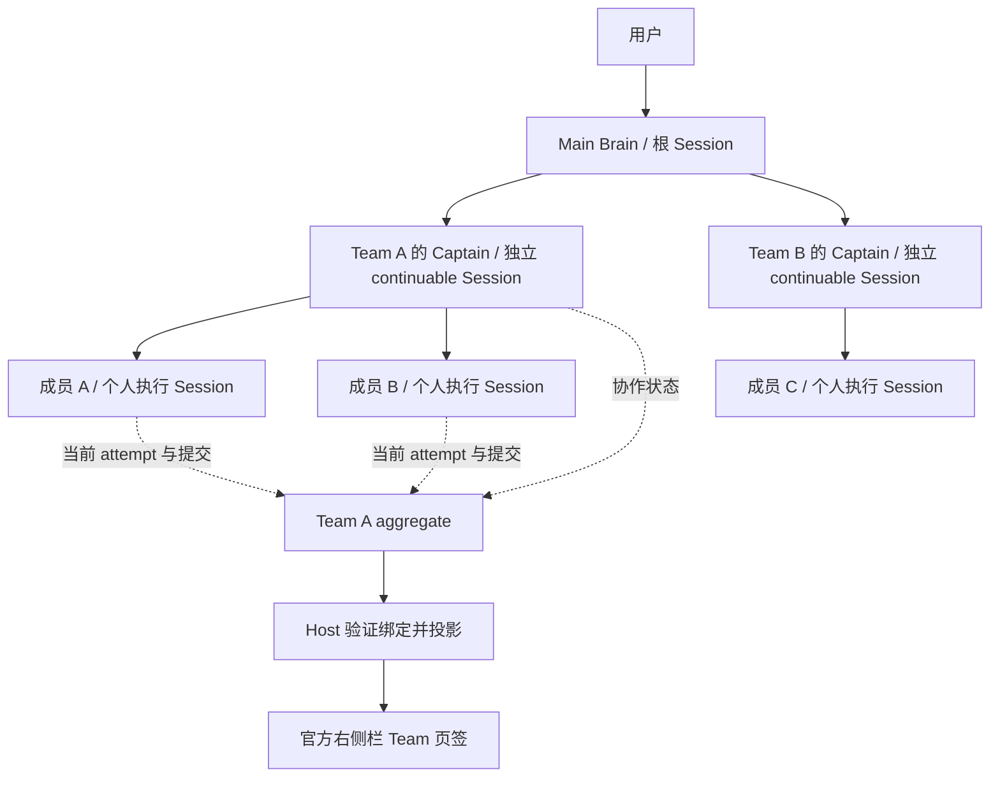
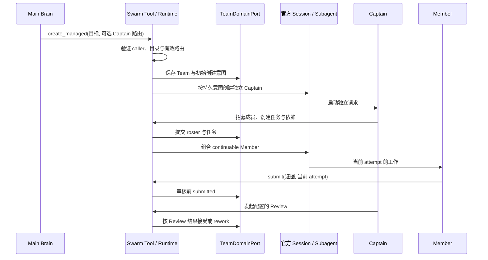

# 03. Team 总体架构与能力边界

本文件是 Team 总体架构与 capability ownership 的唯一说明。具体状态机、错误和并发合同以 [04-core-protocol.md](04-core-protocol.md) 为准；界面结构以 [10-team-ui-layout.md](10-team-ui-layout.md) 为准。下文区分已有实现、接入约束与后续设计；设计图不证明某个安装环境已完成验收。版本身份读取 [OFFICIAL_BASELINE.json](OFFICIAL_BASELINE.json)，部署与验收结果留在对应候选和真实运行证据中。

## 1. 组合图

```text
Official DSH execution plane
  Session + Agent + Subagent + Tools + System Prompt
  Workflow + Jobs + Storage Domain + Settings + Client slots
                              │ consumed by
                              ▼
AgentSwarmRuntime
  ├─ TeamDomainPort ── StorageDomainTeamStore
  │    Team / Captain binding / roster / tasks / attempts / mail / budget
  ├─ orchestration Providers
  │    Scheduler / Review / Workflow bridge / execution root / permission
  ├─ model Consumers
  │    role-scoped agent_swarm_* tools + ordered usage prompt
  ├─ read producer
  │    Host binding → /swarm/v1 read RPC
  └─ client Consumers
       Team Workbench V3 + Plugin Settings
```

`TeamDomainPort` 是 Team 协作的唯一 mutation 边界。Human-interaction overlay、workflow run overlay 和 member-private-memory domain 只拥有自己的关联数据，不复制 Team aggregate。

### 1.1 用户、会话与执行关系



Main Brain 负责跨 Team 的用户入口；Captain 在自己的 Session 中统筹单个 Team；成员的模型调用、工具执行和结果保留在各自 Session。Team 是协作域对象，不是另一份聊天历史。成员间邮箱消息可以进入收件人的官方模型上下文，但不能把多个个人 transcript 拼接成 Team 的权威群聊。

### 1.2 权威与投影

| 数据或动作 | 唯一权威 | 允许的投影与边界 |
|---|---|---|
| 模型请求、工具调用、会话模型选择 | 官方 Session log / Agent / model selection | UI 可展示已记录事实；Team 初始路由不能覆盖会话当前选择 |
| Team、成员绑定、任务、attempt、邮箱、预算 | `TeamDomainPort` 与官方 `agent_swarm` Storage Domain | Host/RPC/UI、prompt 与 Jobs 只消费对应 projection |
| 子会话地址、父子关系、导航和后代计数 | 官方 Subagent catalog / Sessions service | 插件核验归属并替换显示文字；不生成地址或自算官方计数 |
| Settings 默认值 | 官方 SettingsScope 与插件 config | provider/model 成对保存、回读，在重启后重新组合 runtime |
| 面板是否展开、选中页签及宿主布局 | 官方 SidebarRight；插件只保存必要的 UI 选择 | 页面刷新不重开用户已关闭的页签；选择状态不构成读写权限 |
| 成员工作文件 | execution-root Provider 的当前租约 | 绑定真实工具 cwd/FS capability；不是 Prompt 路径，也不是仓库开发 writer 分配 |

UI 的 controller 复用同一个只读目标和读取生命周期。姓名、状态、进度或页面是否可见都不能反向改变 Team 权威。

## 2. 当前实现

| 能力 | 当前 owner / seam | 已实现边界 |
|---|---|---|
| Main Brain → Captain | official Session/Subagent + dedicated captain provisioning | 默认 managed Team 创建独立 Captain；可选 staged 计划审批后激活；root 留在 Team 外；支持多个 Team |
| Team state | `TeamDomainPort` → `StorageDomainTeamStore` | versioned aggregate、durable commit、显式迁移；legacy file store 只读 |
| 成员与身份 | official continuable subagent + identity context | 招募前校验 route；队长分配职责/职业，各人自定四项资料并在保存读回后绘制头像；当前资料进入官方 prompt，durable descriptor 支持恢复 |
| 任务 | Team domain + `AgentSwarmRuntime` | DAG、priority、target member、revision CAS、attempt fencing、submit/review/reassign |
| 调度 | Scheduler Provider registry | 默认 priority-ready；adaptive 与 workflow run 保持单一 transition owner |
| 审核 | Review Provider registry | manual、executable commands/templates、review root 与 reviewer boundary |
| 邮箱与交流 | durable Team mailbox + wakeup surface | quota、receipt、quiet/wakeup、真实 reply_to、按成员限制主动同伴唤醒、队长持久覆盖、bounded wait 与 spin fuse |
| 预算 | Team budget + committed usage fold | token/request/retry 限制、reservation、carry、exhaustion/recovery |
| Skills | `TeamSkillSurface` + `allowedSkills` setting | 三层区分（issue #184）：Team allowed（不可变策略）/ member assigned（招募时子集，持久化+重启重建，进一步收窄 surface）/ Session-visible（官方 scoped catalog，仅可见不等于拥有）；不自动演化 Skill |
| Tools | official tool restriction + plugin permission surface | Captain-only 隐藏、成员 deny-only 收窄、plugin allow/ask/deny setting |
| Memory | Team memory + private-memory domain | 共享分类记忆；成员私有 append-only memory 和独立授权 |
| Workflow/Jobs | official Workflow bridge + caller-scoped jobs projection | 可选、显式启用；唯一 Consumer seam 是 `ctx.agentSwarmWorkflow.start(request)`，仅委托同一 bridge，不提供激活/销毁权限；disabled/unload 时服务缺席，默认官方 `workflowEngine` 不变。`runtime.workflowBridge` 是内部实现细节；jobs 是 read projection，不影子注册官方 producer |
| Execution root | execution-root Provider | 可选 per-attempt 物理 root、capability 声明、settlement 和 residue 告警 |
| Host/RPC | Host read service + `/swarm/v1` | target-bound、bounded、redacted、read-only、loopback/same-origin fail-closed |
| UI | official Client slots / Session navigation / Settings | Workbench、Tasks、Announcements、Management、栏内详情、Captain Chat、设置页 |

## 3. 模型工具面

`src/tools/index.ts` 汇总当前 `agent_swarm_*` 工具，按职责分组；各 caller 只看到其权限允许的面：

- Team lifecycle：create/create-managed、identity、goal、announcement、member、archive、interrupt。
- Task board：create、claim、submit、review、reassign。
- Plan-first：set-plan、approve-plan、discard-plan。
- Collaboration：send-message、set-communication、wait。
- Budget and memory：set-budget、shared memory、member private memory。
- Read surfaces：status、managed teams、members、tasks、jobs、memory。
- Policy helpers：逐次工具审批；运行时按 caller role、live Agent/Session、revision 和 attempt 过滤权限。

工具只暴露 Team 概念，不暴露 Storage key、内部 Session token 或 Provider 私有状态。授权来自 `exec.agent` 和权威绑定；参数中的 id 只是查找条件。

## 4. Host、RPC 与 UI

Host 每次从 live root Agent、Session、workspace scope 和 Team Captain binding 建立读上下文。`/swarm/v1` 只发布严格、版本化的 read envelope；客户端不能上传 principal、Captain Session 或 provenance 来扩大权限。

Workbench 消费同一 read contract：公开目标、成员身份、任务/attempt、budget 和 activity 来自权威 projection。布局、卡片层级、页签、详情、短名称、窄屏与错误展示统一定义在 [UI 布局设计](10-team-ui-layout.md)，不在本文件维护第二套视觉规则。

SidebarRight 拥有展开、浮动、分栏及可见性；插件通过 `openTabIn` 寻址选中的 Session，以实际页签挂载确认显示。成员导航复用官方 continuable child catalog，精确父子地址和每次读取的权限验证见 [核心协议](04-core-protocol.md)。管理页的交流强度请求进入正式 Captain human prompt，由队长调用工具保存，canonical read-back 决定应用状态；`/swarm/v1` 的 direct write capabilities 仍 unavailable。

Plugin Settings 是独立的官方 Settings Consumer。它配置默认模型、成员 provider/depth、Skills、Scheduler/Review、tool policy、默认交流强度、Workflow/Jobs/execution roots 和资源限制；设置在重启后重新组装 runtime。队长保存的本队交流覆盖立即持久生效，清除覆盖后跟随插件默认。

默认模型选择读取官方 remote Session catalog；provider/model 成对以 SettingsScope `mutate` 提交并回读。路由优先级为调用显式参数、插件默认、发起者当前 Session request header。`create_managed` 支持 `captain_llm_provider`、`captain_model`、`captain_reasoning_effort`；成员招募和计划审批支持 `llm_provider`、`model`、`reasoning_effort`。同路由省略推理等级时继承发起者当前等级，换路由时使用新模型默认；显式等级由目标模型验证。即时创建和 staged 审批均在 Team 提交中保存初始路由，启动失败后恢复不会改用后来的默认值。

身份详情展示 durable personality/biography，成员自行更新姓名、性格、简介与头像；Captain 的成员资料管理限于职责和职业。当前资料及有效交流策略共同构成 prompt 快照，不重写历史。

独立 managed Captain 可调用 `agent_swarm_set_captain_model` 修改自身后续请求的模型，不中断当前请求，不修改插件或全局默认。选择保存在该 Captain 自己的官方 `model/selection` 会话事件中，由官方 projection 与 `installModelSelection` 恢复；继承的父会话历史不能覆盖子会话的初始路由。此入口要求 Host 提供官方模型选择 projection；legacy 根 Captain 继续使用 Host 模型选择器。Team 内的 `captainRoute` 只保存初始创建意图，当前使用的模型以 Session 请求记录为准。

### 4.1 创建与执行链路



此图表示行为顺序，不额外定义跨服务事务。启动、重试、回滚与部分失败服从现有 provisioning 和 Domain 合同；提交证据只进入 submitted，不能由 UI 或自然语言直接变为 completed。staged Team 的计划批准是独立入口，必须在激活前验证并保存相应路由。

### 4.2 模型路由的两个时点

| 时点 | 决策路径 | 检查结果的依据 |
|---|---|---|
| 新 Captain / Member 创建 | 显式调用参数 → 插件该角色默认 → 发起者当前 Session；校验 provider/model 与 effort 后持久保存创建意图 | 首个实际请求的 `request/header` |
| 独立 Captain 自行换模型 | caller 必须是当前绑定 Captain → 官方模型 resolver 验证 → 写入该子会话的官方选择事件 | 下一次实际请求的 header 与冷恢复后的请求 |

两条路径不互相替代。设置页保存成功、工具返回成功、初始路由字段和模型实际生效，是不同证据。更换路由时推理等级的继承与默认规则继续服从本节已有合同。

### 4.3 UI 接入与官方扩展边界

Swarm 使用官方 Session 导航、SidebarRight、Settings、locale 和 slots。会话顶部文字通过通用 `conversation.session.header.lineage.display` seam 接入；Core 提供实际 owner、原始文字、地址与计数，Swarm 只返回文字显示。该 seam 属于需要随目标 Core 交付和核验的扩展，不能据此声称某个官方已发布版本自带这项能力。

显示 Consumer 不替换 Core 的导航控件、可访问性语义或事件处理；插件缺失、关系未知或数据陈旧时沿用 Core 原始文字。安装包构建成功不能证明 Host 使用了对应 Core seam，须结合实际包导出、装配和浏览器结果验收。

## 5. 生命周期与失败语义

- `sessionPersistence` 和 `storageDomain` 是 required injection；缺失时插件保持 pending，不降级为易失状态。
- 未知 Provider、无驱动的 workflow mode、非法 Skill/tool policy、stale revision/attempt 和 identity mismatch 都 fail loud。
- 注册、route、listener、timer、waiter、subagent、workflow、storage domain 和 React mount 均由 Cordis effect 或显式 disposer 回收。
- unload 先关闭 admission，再收敛在途事务，最后释放资源。
- Workflow bridge 恢复在局部 store/domain 上完成后才发布；恢复失败按 store → domain 回收，保留原始和清理错误。同域可重试；正在打开资源时的 unload 等待该次 activation 回收，不留下部分激活的句柄。
- legacy Team import 只允许显式单向迁移、空目的地和 durable read-back；不自动迁移、双写或 fallback。

## 6. 尚缺能力

| 缺口 | 所需边界 |
|---|---|
| 公共稳定发布 | immutable package identity、兼容矩阵、upgrade/rollback、发布观察 |
| browser/RPC direct controls | verified human principal、operation-scoped idempotency/read-back、逐 capability 开放 |
| Canvas Consumer | 复用已接受的 RPC schema/fixtures，Canvas 只做宿主原生投影 |
| 远程成员与 distributed store | real remote executor、CAS/lease/fencing、partition/late-ACK/recovery tests |
| 自动 Skill Evolution | accepted evidence → proposal → deterministic validation → approval → write 分权 |
| 发布级 UX/E2E | fresh Profile、多 Team、重启、accessibility、error/reconnect、卸载/升级矩阵 |

缺口不能通过新增 UI 状态、第二 storage、transcript parser 或更宽模型权限绕过。

团队公共群聊属于独立的产品方向，其边界与待讨论布局见 [UI 布局设计第 8 节](10-team-ui-layout.md#8-待讨论团队公共群聊)。采用该方向前，需要在核心协议中定义消息权威、写入身份、幂等、投递与重启语义；现有邮箱和个人 Session 不自动等于可编辑的公共群聊。

## 7. 拆包原则

当前实现保持一个 dual-face package。只有出现第二 Provider/Consumer、独立 lifecycle、独立发布价值或 host/client 编译边界时才拆分；目录整齐本身不是理由。未来官方 Agent Team 成为受支持依赖时，也只能在 `TeamDomainPort` 后替换 Provider，不能并存两个可写 Team authority。

### Host 定向读取与枚举成本

`HostTargetReadService` 统一解析 live/cold Session、Captain 父子关系、scope 和可见 Team，服务 snapshot/page、Captain sections、Team selector 与 Skill catalog。RPC 只处理传输信任、严格解析及响应投影；不直接读取 Team store/snapshot 或成员/Skill Registry。每次 selector 读取从一次 canonical aggregate list 投影完整 Captain identity 和 public goal，不建立跨请求缓存或索引。

尚未创建 Captain 的 staged Team，以及显式 discarded 的草稿归档，以同 scope 内的持久 `managedOrigin` 精确证明所属 Main Brain。读取仍要求官方 live 或持久化 root Session，child 与其他 root 不继承草稿。Selector 保留真实的空 `captainSessionId`；binding、snapshot/page 和三个 Captain sections 使用所属 root 作为读取锚点，UI 明示队长尚未创建并禁止 Captain Chat 交接。该只读路径不批准计划、不创建 Session，也不放宽 active Team 的 Captain 绑定。

`tests/host-read-scale.spec.ts` 在真实 Storage Domain 上覆盖多个 Team、成员规模及任务历史，要求同一次 teams RPC 只执行一次 canonical aggregate list，成员及任务历史不进入 selector payload。操作计数不等于延迟或全部 UI 流量承诺；可选 `SWARM_READ_BASELINE` 仅用于对接受基线进行只读比较。

## 8. 实现与验收入口

| 架构入口 | 源码 |
|---|---|
| Team mutation 与持久化 | `src/domain/team-domain-port.ts`、`src/storage/storage-domain-team-store.ts` |
| 独立 Captain 与初始组合 | `src/runtime/dedicated-captain-provisioning.ts` |
| Captain 会话模型选择 | `src/tools/model-selection.ts`、`src/runtime/captain-model-selection.ts` |
| durable 邮箱 | `src/domain/team-domain-mailbox.ts` |
| UI 组合与生命周期 | `src/client/team-dashboard-plugin.ts`、`src/client/team-dashboard-controller.ts`、`src/client/team-dashboard-surface-coordinator.ts` |

工程门、真实 Profile、冷恢复与发布验证沿用 [08-testing-verification.md](08-testing-verification.md)；升级与回滚分权沿用 [13-self-hosting-dogfood.md](13-self-hosting-dogfood.md)。检查必须对应同一可识别候选和安装组合，工程、真实模型、浏览器、重启与正式环境证据分别陈述。
