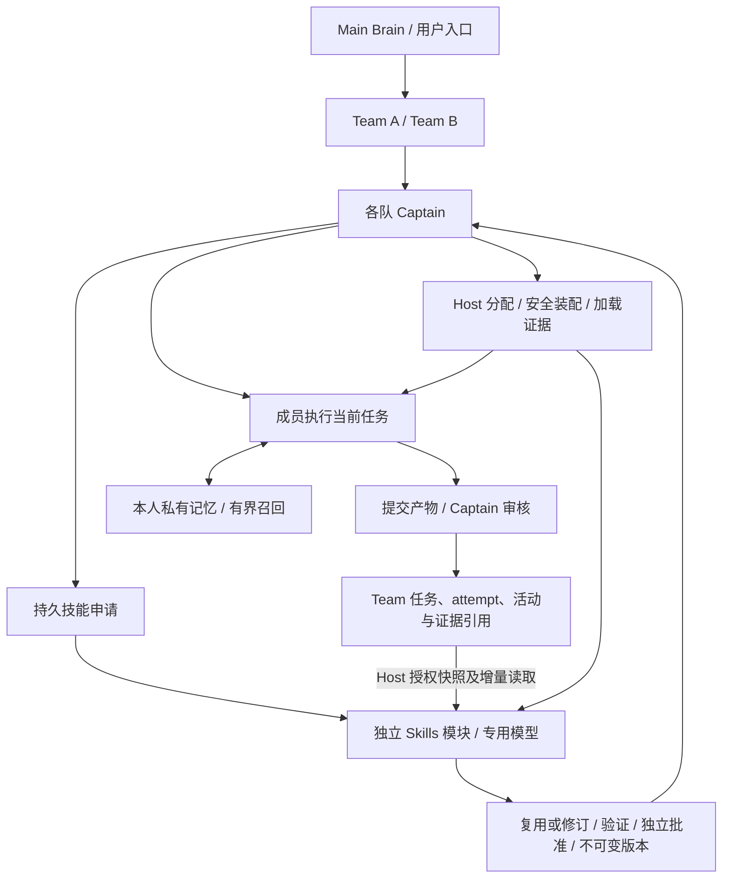

# 07. Team 协作、个人记忆与独立 Skills 管理开发方案

本文是本轮开发的统一入口，取代旧的“90% 产品就绪”路线和仓库外的架构简化草稿。产品职责由 [03-capability-family.md](03-capability-family.md) 定义，状态与权限合同由 [04-core-protocol.md](04-core-protocol.md) 定义；本文串起完整用户结果、实现边界、依赖、测试和交付顺序，不复制第二份协议。具体排期、Issue 状态、候选 SHA 和验收结果留在 GitHub；历史代码由 Git 保留，已记录的失败证据不因方案替换而删除。

部门与资料室设计见 [重构规范 01](refactoring/01-departments.md)，员工原需求及未决业务权利见 [能力边界 §10](03-capability-family.md#department-spec)，公司重构收敛候选见 [§11](03-capability-family.md#11-单人多部门公司的重构候选合同)。文档不代表实现、验收或发布。

公司重构的候选顺序：先咨询与三模型只读反驳审查，由统筹解决阻塞，再按以下可独立使用的纵向批次执行；不先建立全部模块空壳。

| 阶段 | 可使用出口 | 本阶段必要边界 |
|---|---|---|
| 第一片：一个部门的完整工作闭环 | 建部门、任命管理员、招募/完整入职、真实领取/交付/审核、必要 UI、重启恢复 | 身份/装配、所有正式准入、实际单 writer、撤权与 claim 一致性；验证后即可发布试用，不等待成长自动化 |
| 第二片：两个部门协作 | 部门/员工入口、能力发现、定向咨询、正式交接、资料室成果引用与审查 | 跨部门授权、去重/预算/暂停、无双派工和越权知识；这是基础版必需，不能整体推到远期 |
| 第三片：人员变化与旧 Team 纳管 | 正常/紧急更换管理员、调岗、冷处理/恢复、显式迁移与回退 | 第一片就预留并验证控制风险，不拖到本片才发现不能接管；彻底删除按未决权利/能力限制明确标注 |
| 第四片：成长及知识治理完善 | 增量整理、个人职业 Skills→获准通用版本→实际加载→纠错撤回 | 第一片已有个人文件/初始化/正常自我修正，复用已有记忆与 Skills；更广自动教学、性能研究为后续扩展 |

每片一条 Feature Pipeline，独立验收后经现有 Git PR/发布流程进入可用版本；能力相关缺陷仍回原 Issue 管理。整体基本版需覆盖能力架构 ORG-A01–08 的对应出口，未验部分明确列限制，不能把第一片叫全部完成。源码/文档、工程测试、真实模型、浏览器、重启、实际安装分别报告。

## 1. 目标与代码基线

目标是让多个团队可靠完成工作，让成员能在下一任务召回自己的有效经验，并由一个独立 Skills 模块及专用模型管理可复用技能。成员向 Captain 提出技能需求，Captain 统一申请和分配；模型负责分析、设计和修订，Host 负责授权、持久化、实际装配和版本证据。

代码事实以 GitHub main 为开发与集成基线，依赖版本以 package.json、pnpm-lock.yaml 和 [官方基线](OFFICIAL_BASELINE.json) 为准。遵循 [official-first 开发原则](11-official-first-development.md)：先核对官方已发布能力和实际装配，再确定需要保留的插件扩展。源码、安装版本、工程检查、真实模型、浏览器、重启和正式环境分别验收。官方上游出现新版本不自动改变本轮兼容目标；采用新 API 前完成对应兼容性核对。

现有实现可以继续复用：

- Main Brain 创建多个 managed Team，独立 Captain 和 continuable 成员保持官方 Session 身份与父子关系；staged 计划可审核后激活。
- TeamDomain 保存任务 DAG、revision、attempt、分配、提交、审核、预算与邮箱；adaptive/workflow 保持唯一编排 owner。
- V7 群聊具备公共消息、真实提及、图片、自主视觉协助、工作请求、开放认领与目标生命周期的代码路径；相应 API 仍由各自版本合同约束，不把任意浏览器输入变成管理权限。
- 正式任务事件写入 Team 聚合内的 workActivity；分页具有事件 ID、序号、水位和保留边界，但旧 Team 可能没有该字段。
- 成员私有记忆已有独立分区、本人 append/list；Team shared memory 已有自身的提交与脱敏边界。自动召回、笔记作废与替代并非已有能力。
- TeamSkillSurface 已区分 Team allowed、member assigned 和 Session-visible；招募时分配与冷恢复可用，精确 release 的动态分配与实际加载归因仍需实现。

本轮不建立 Team 成长评分、永久累计账本、另一套任务审核或逐条聊天总结服务。不同时引入分布式消息中间件、向量数据库、远程 Skills 管理或公共包发布。

## 2. 完整目标架构



| 模块 | 唯一职责 | 不承担的职责 |
|---|---|---|
| TeamDomain / Captain | 业务任务、审核、协调、技能需求归并和成员分配决定 | 技能候选流水线、跨队成长评分 |
| 私有记忆服务 | 本人笔记维护、有效性与当前任务召回 | 向队长或 Skills 模块暴露私有全文 |
| Skills 模块 | 请求、观察游标、候选、验证、批准记录、release 和效果关联 | 认领/接受业务任务、修改 Team 生命周期 |
| Skills 专用 Session | 在模块授予的工具范围内分析问题、提出候选和解释证据 | 自批候选、扩大团队授权、直接写成员配置或生产文件 |
| Host / 官方 DSH | 真实身份、权限、storage-domain、Session、工具、Jobs、装配与恢复 | 复制 Agent Loop、以 UI 是否打开驱动工作 |
| UI | 现有群聊/任务事实、必要的技能申请与版本状态 | 从聊天推算“已经学会”或伪造已读 |

Skills 模块采用独立生命周期和独立 Storage Domain，通过明确的 Service/Consumer 边界接入。首版可随同仓库构建与安装，保持代码和状态分离；不为拆目录提前建立多个空包。独立模型路由由模块配置指定，配置与 Team 默认路由分开。未启用或缺少有效模型时明示 unavailable；已安装的获准版本仍可工作。

官方 Agent Teams 的替换候选与身份、消息、事务约束统一见 [能力边界 §1.3](03-capability-family.md#13-官方-agent-teams-的复用边界)。以下采用方案优先处理完整功能与复用的冲突；基础生命周期、peer mailbox 和基本 DAG/CAS 通过各自合同后移除对应自建实现，不同时保留两套 Team 写权威。

### 2.1 官方 Agent Teams 完整功能采用方案

本节是优先方案，尚未实现或迁移。目标是实际调用官方维护的通用团队机制，同时保留现有产品能力、真实身份、持久记录及失败语义。功能完整性按合同及实际结果判断，不要求保留旧内部代码，也不把已知缺陷当作必须复刻的行为。

采用遵循固定顺序：核对两边代码与功能基线 → 判断官方公开能力是否足够 → 隔离小团队验证 → 逐项接管成员、邮箱及任务通用内核 → 同版本完整验收 → 逐队迁移 → 最后删除重复实现。任一职责复用会损害现有功能、权限、数据、恢复或流程时，放弃该职责的本次复用并标为“等待官方完善”；写明具体缺口和重新评估条件。官方未解决该缺口时不继续投入，不阻塞其他产品开发，也不靠削弱需求或自行维护官方补丁来推进。后续变动按 [官方变更复用评估](11-official-first-development.md#官方-agent-teams-变更复用评估)执行。

#### 推荐架构与当前缺口

现有模型工具、Host/RPC 和 UI 继续经过 `TeamDomainPort` 兼容入口。底层由可组合的官方 Team 组件负责通用 roster、耐久 peer mailbox、DAG/CAS 和恢复机制；Swarm 提供管理绑定、权限、调度、attempt、审核、预算及产品扩展策略。个人记忆和独立 Skills 模块仍拥有自己的限定状态。

初期保留官方 Storage Domain 中的现有 Team 聚合和真实 Session 层级，避免把代码复用、数据搬迁和身份改造合成一次上线。一个 Team 的共同约束仍在一个后端事务中检查和提交；适配层不得复制通用算法、维护第二份可写 roster/task/mailbox，或将两个持久写包装成“原子”。官方默认的 Session 日志后端可以继续供其他官方 Profile 使用，本插件采用的 Team 不同时写该后端。

当前官方包并未提供上述组合能力：TeamService 直接创建私有 Journal/Roster/Mailbox/TaskBoard，Journal 与若干公开读取依赖同步 Session projection。相关职责因此等待官方提供足够的公开扩展面，再进行组合验证；不以改服务名、强制类型转换、访问私有字段、假 Agent 或自建补丁代替。下表记录重新评估所需条件，不构成本轮对官方模块的开发任务。

| 等待官方具备的能力 | 最小职责与证据 | 不能省略的条件 |
|---|---|---|
| Host 团队绑定与生命周期策略 | 从真实 Agent/Session、持久 Team/Captain 关系确定 Lead 和成员；保留现有 Team ID、Main 多队、实际父子关系；冻结包含逐人模型、persona、toolFilter 和 Skills 的 provisioning plan | 不从请求中的任意 root ID 借权；ID/名字分配、失败重试、冷恢复、同名新 Session、父先停/子先停都重验；未选择采用的团队不被官方扫描恢复或卸载清理 |
| 显式原子后端及操作策略 | 在同一 transaction handle 中读取、校验、计算与提交官方基本事实和 Swarm 扩展；外部副作用在合法准入后执行，成功发布在提交后 | 异步 Storage Domain 不靠普通缓存或隐式“当前 draft”兼容同步 Journal；成员移除、任务取消、审核与预算的跨字段约束保持单次提交 |
| 消息投递准入与终态 | 支持 quiet/wakeup、当前权限与 task/attempt 因果检查、去重、过期/撤销、恢复和真实投递读回；enqueue/supersede/cancel 参与同一 Team draft，实际 dispatch 与 remove/过期共用准入围栏 | queued、已持久接收、实际 claimed、absent 和 unknown 分开；代次拒绝 late ACK；原 frame/source/ID 不重建，授权后的图片 ContentBlocks 不二次归一化；重试不重复唤醒，过期消息不再次进入请求 |

采用时核对官方实际公开的接口，上表不是声称已有同名官方 API。若官方 Task 状态或事件格式发生变化，核对版本和旧日志读取规则，不能静默向 strict schema 塞扩展字段。raw 官方工具和 Remote 也必须服从同一 Host 策略；仅从模型工具列表隐藏 `complete` 不能防止绕过 Review Gate。

任务先保留 TeamDomain 的全部业务 mutation，优先复用正式公开的 DAG/通用校验内核。不能把 submitted/verifying 简化为官方 in_progress、把 failed/cancelled 简化为 deleted 后接入原生 complete；这种映射会改变依赖、保留和审核语义。只有官方可组合操作能忠实表达原状态及共同约束时才继续接管对应基本转换；产品特有状态机不为增加复用数量而迁走。

#### 功能完整性清单

实施前将以下每类链接到当前源码、代表性测试和实际组合场景；已知失败单独列出。没有对应证据的条目保持未通过，不以总测试数量代替覆盖范围。

| 必须保留的用户能力 | 采用后的归属与代表性验收 |
|---|---|
| 多 Team 与真实 Main→Captain→member | Host 管理绑定 + 官方生命周期；两队独立招募、Main 不成为 Captain，实际 parentSession 与工具授权不变 |
| staged 计划、批准/丢弃、归档 | Swarm 管理策略；未批准不创建执行工作，归档后不恢复旧写权，历史仍按原权限可读 |
| 成员配置及身份 | Swarm profile/model/permission/Skills 策略；独立模型、本人资料/头像、专业职责、允许/待审批/禁用工具正确，未配服务明确失败 |
| 招募失败、移除与重试 | 官方机制 + 扩展生命周期；不能将 removed 写成 failed；退出同次撤权、处理相关 attempt 和旧消息，重试身份与名字规则不退化 |
| DAG、优先级、定向与开放认领 | 官方基础图/CAS + Swarm admission；两人抢同一任务只有一人成功，指定成员不能被其他人抢走，依赖未完成不能领取 |
| attempt、提交、审核、重派和取消 | Swarm 扩展参与同一事务；旧 attempt 不能提交/回流，普通成员和官方 raw complete 均不能绕过审核，验证命令前后都核对适用版本 |
| 预算、预留、计量与目标维护 | Swarm 策略 + 官方 token/Workflow/Jobs 底座；认领/重试/移除/审核与预算一致，失败可恢复且无双调度 owner |
| peer quiet/wakeup 与因果消息 | 官方队列 + Swarm 准入；quiet 不主动唤醒，撤权/过期的排队消息不投递，崩溃重试不重复接收或错误标为 claimed |
| 群聊、提及、引用、图片、视觉协助 | 现有公共消息和 Host 合同；同队/跨队访问、原图引用、未知结果查询、原 request ID、TTL 与回报保持一致 |
| 工作请求、批量任务、活动与公开目标 | Swarm 产品合同；来源关联和批量创建原子，目标暂停/恢复/完成及事件序号、水位、保留缺口可核对 |
| 个人与共享记忆、Skills | 既有及计划中的独立模块；私有分区不泄露，共享写入脱敏，允许/分配/有效/加载分开，技能审批不被官方基础操作绕过 |
| UI、Settings 与可运营性 | 现有官方 Client 入口继续消费兼容投影；多队导航、草稿、分页、预算统计、冷恢复、禁用/卸载、升级和回退均可操作 |
| execution root 与 Provider 组合 | 真实 cwd/FS/工具根及 lease 保留；可选 Provider 未启用保持现有语义，取消/卸载不留下失去 owner 的工作 |

其中成员退出是首个跨模块检查：若 roster 已删除成员而任务仍运行、对应运行预留未释放或旧消息仍可投递，则该后端组合立即失败，不能通过异步补偿将其宣称为现有原子语义。已消费的 usedTokens/usedRequests 等历史计量必须保留，退出不是退款或清零。

#### 分阶段采用与删除条件

| 阶段 | 具体产物 | 进入下一步的条件 |
|---|---|---|
| A：冻结功能合同 | 当前基线与上述能力逐项映射，保留既有回归，列出真实已知失败；确定官方发布版本和公开接口差异 | 拟替换职责所需的官方公开能力已经具备；缺失则登记等待，不进入其 B 阶段 |
| B：验证官方可组合性 | 一个新建小团队在隔离 Profile 中使用固定官方组件、真实父子关系与现有 Storage Domain；只写必要的公开接口适配 | 能创建/恢复成员，原子完成“移除成员 + 处理 attempt/预算 + 撤销旧消息”；缺服务、崩溃及 raw API 绕过反例通过；不满足则放弃该次复用 |
| C：接管成员基础机制 | 官方实现承担招募、占位、恢复和生命周期通用部分；Swarm 保留配置与权限策略 | 模型/Skills 配置、失败重试、删除和同名新身份的实际组合通过；所选 Team 停止调用旧实现，未迁移绑定保留受控兼容执行器 |
| D：接管 peer mailbox | 官方实现承担持久排队、目标去重和恢复；Swarm 控制 quiet、因果有效性、限流与公共协作关联 | 在排队前、持久后、接收后分别注入故障；无重复投递、无陈旧回流、无到达状态夸大；所选 Team 只启用一个队列执行器 |
| E：复用任务通用内核 | 官方图校验成为可用公开入口后优先评估；基本 CRUD/CAS 仅在官方组件能表达原状态和共同策略时继续接管；Swarm 的业务 mutation 与 attempt/审核/预算仍由同一事务执行 | 抢占、晚提交、审核旁路、重派、批量工作请求、目标维护和冷恢复全部通过；无等价替代的产品逻辑继续保留 |
| F：同版本验收与旧团队切换 | 构建不可变包，旧数据只读转换演练、隔离环境的两队真实任务与浏览器完整流程、前后操作/结果对照 | 冻结候选通过完整工程门和非作者复核；旧 Team 无在途执行/待投递副作用时才可切换，读回实际 owner 与所有未终结业务状态 |

阶段 B 必须先验证最强的共同事务，不先花大量时间重写 roster 然后才发现任务/邮箱无法协同。只调用官方公开组件；所需通用内部组件未公开时等待官方，不在本轮代为增加导出，不复制官方源码到 Swarm 后称为采用。阶段 C–E 可以逐职责替换内部实现，但同一 Team 不并行运行两个写 owner；跨职责的事务始终由同一个后端执行。

C–E 的局部接管不授权提前删除仍被其他 Team 绑定的旧执行器。混合期间，按每队的持久绑定只装配一个实现，并验证新旧队在同一 Host 的冷恢复互不干扰；若不能提供这种兼容装配，候选只能进入所有相关 Team 都已迁移的隔离 Profile。只有受影响的所有可执行旧绑定已迁移或由明确保留的兼容版本服务、替代与回退证据完备时，才在后续候选删除重复执行代码；归档数据所需的只读旧格式读取器可保留。回退使用固定旧 artifact，并再次验证其能读取最新合法数据。

版本与数据切换由候选进程之外的 Host 控制器完成。每队的实现选择及其代次持久绑定，恢复只启动已绑定实现；进程本地 feature flag 不能授权重启后变更 owner。观察对照使用输入和输出的只读回放，不向两个运行时同时发送会产生副作用的命令。

#### 优化收益、性能与流程验收

采用的首要收益是假如官方组件能承接同一职责，就减少重复实现、重复修复及版本跟进的工作；这仍需计入公开接口适配、迁移及后续升级成本。维护的总负担没有下降时，不能仅凭 Swarm 删除的行数宣称优化。当前三个组合缺口先按阶段 A 登记等待；官方补齐拟替换职责的条件后，才用阶段 B 判断采用是否值得继续。

运行速度、token 和任务完成效率没有自动收益。若引入第二次状态转换、额外 RPC、重复轮询或每次操作多一个模型决策，可能增加延迟与故障面。保留同一事务和直接组件调用，通用机制替换不应新增模型推理步骤。轻量自动上下文是独立优化，不能把它的收益归给官方 Team 采用。

| 比较维度 | 同条件下实际采集的证据 |
|---|---|
| 功能与结果质量 | 相同完整用户任务的成功率、权限及业务不变量、产物要求与审核结果；保留失败样本，不能靠跳过审核或减少应完成工作提速 |
| Host 运行开销 | 招募、认领、提交、审核、入队到接收、冷恢复的耗时分布；存储读写/事务/RPC 次数、CPU、内存及重复 worker；模型等待与 Host 时间分开 |
| 模型成本与流程 | 实际请求的输入/输出 token、模型调用与工具往返次数、无效重试、Captain 转交次数、端到端完成时间；未知计量明确缺失，字节数不能当 token |
| 恢复与维护成本 | 故障后恢复时间、重复/丢失/陈旧操作、历史可读性，以及一次官方升级演练需要改动的公开接口适配；迁移期间的临时成本单列 |

阶段 A 先采集固定环境、相同数据规模及代表性并发的多次基线，依据波动和用户可感知影响预先登记性能允许范围。阶段 B 采用可控执行器隔离 Host 开销；阶段 F 用相同模型、配置、输入和验收要求重复真实任务，报告样本数与波动，不将单次模型随机差异当成架构收益。每次只改变正在比较的组件，使用不可变包及独立可回放数据，防止不同版本或其他优化混入结论。

进入采用的条件是功能合同全部保持、同工作量下无超出预登记范围的持续性能退化，并有可核查的维护或运行收益。若组合扩展使总复杂度升高且无法证明收益，则停止迁移该职责，保留现有已验证实现并缩小到可直接复用的公开内核。不能以“未来官方会优化”为当前退化放行。

#### 回退、完整采用的定义与本轮边界

优先保持旧存储和协议可读，使代码回退不丢失切换后的合法写入。若新 schema、事件或操作不能被旧实现理解，则必须先验证从最新已提交状态的反向转换；保留迁移水位、稳定 ID、待处理请求和不可变证据。没有可用反向转换时不进入旧团队切换。回退先关闭准入、收敛在途操作、固定最新状态，再由外部控制器切回；不能恢复一份旧备份而丢弃切换后的数据，也不能重复外部 effect。

只有“官方组件实际承接通用职责、Swarm 对应重复代码已删除、全部保留合同有同版本证据、既有数据与恢复/回退通过”才能称为完成采用。接口接通、安装了包、少量 demo 通过或代码量下降都不单独构成完成。官方升级是另一个兼容性决策，不为换版本扩大本轮范围。

方案确定后先核对两边代码，仅对官方已具备完整条件的职责推进采用切片；等待项不阻塞个人记忆、独立 Skills 和群聊 UI 的既定目标。采用实现与现有课堂切换须有各自证据，不能因方案通过而记为完成；群聊视觉改动仍沿用户要求先方案后实现。

## 3. 通信与操作效率

课堂记录显示，大部分保留通信涉及 Captain；同伴唤醒限流不是全队消息限流。耗时还包括模型传输、审批、依赖、人工写入时段和恢复，不能全部归因消息系统。开发前后应使用同一任务比较，保留无法归因部分，不预设节省比例。

### 3.1 自动上下文和显式读取

本轮替换的旧身份装配每轮调用完整 TeamDirectory，先两次采集全员 Session、模型、Skills 和工具，再做分页。自动上下文改为简短成员 ID、姓名/职责、阶段和开放任务摘要；本人角色指令保留。完整资料与能力继续通过已有 directory 工具读取。身份、成员退出和撤权仍实时检查，完整目录原有一致性检查保留，不以固定 TTL 或仅 Team revision 缓存独立变化的能力来源。

稳定 context 已经避免仅因 observedAt 变化而重复追加；新检查分别统计目录读取成本、上下文文本与实际请求体量，不能混为同一指标。撤权、切 Team、压缩和冷恢复后移除或重建正确贡献。

### 3.2 交流与任务操作

- 消息包含当前任务/attempt、问题或变化、版本化证据和需要的决定；共同材料引用一次，后续补差异。普通局部协作直接联系相关同伴，Captain 处理派工、验收、冲突、实际阻塞和技能申请。
- 保留必要的验收短通知。submit 只提交业务状态，END TURN 也不等于官方自然 settlement；pending inbox、子代理或 lease 能延迟通知。不能为减少消息删掉唯一通知或清空 quiet 输入。
- 明确任务 revision 与 Team revision 的用途，依据已返回的 ready/status/owner/attempt 操作，最终 CAS 保留。写后结果有变化的验证仍保留。
- 审批请求一次提供具体操作与范围，只有 Host 的实际授权有效。失败、未知结果与待审批区别显示，不能以文字“同意”冒充可执行。
- 首期不自动合并或删除历史消息。将来 latest-wins 需要同发送者、接收者、task/attempt、主题与明确替代语义，并保留审计及撤回因果。

## 4. 个人记忆：维护后再召回

沿用 scope + Team + Session 的本人分区。先扩展当前严格 schema 的兼容读取，增加必要的标签/适用条件、作废/替代、任务出处和稳定操作 ID。本人可以纠正自己的笔记；未作废不等于已验证。旧合法记录不得因新增容量规则无法打开。

写入在真实持久副作用前重新检查 live Agent、Session、membership、权限和取消，与退出串行化；已经开始或提交的写入不能宣称被 abort 回滚。同一持久操作重试去重，不承诺不同模型调用的语义去重。容量准入限制正文、引用数量、成员及全域大小；首期满额明确拒绝，不物理删除导致 seq 重用或 offset 漂移。分区索引可以从原记录重建，不另设知识库。

自动召回仅在本人唯一合法 in-progress 任务及当前 running attempt 下选少量笔记，固定 taskId/attemptId、选中 ID 和摘要。没有合法目标不猜“最近任务”；自领任务、普通消息和迟到分配分别测试。自动读取有独立授权契约，不借用显式工具曾经获批的事实。

召回通过独立的私有 durable context 进入实际请求，按任务相关性和输入预算有界选择。无命中、失效、任务变化或撤权时清除旧贡献；压缩和恢复后重建当前选集。正文是待判断的数据，不能覆盖高优先级规则。选择器单次读取失败可降级为未知；存储打开失败与 schema 损坏保持明确故障，不伪装成已有容错。

验收闭环：本人保存 → 下一真实任务选中 → 实际请求可核对 → 作废后撤下 → 压缩/冷恢复一致 → 跨成员与同名新 Session 不泄露。

### 4.1 后续自我整理与经验质量

M1/M2 的维护与有界召回不等于自主进化已经完成。后继 [M3 #291](https://github.com/leinasi2014/dsh-agent-swarm/issues/291) 保留经验质量与整理触发的完整出口。人格/行为资料（包括未来 SOUL 类文件呈现）描述长期职业、性格和偏好；本人经验记录、实际工具与 Skills 能力分别沿现有权威更新。文件呈现不得产生第二份可写身份权威，也不能自行扩大权限或改变基础模型权重。

后续个人记忆切片采用三种触发，复用官方 Session 与现有生命周期，不建立空闲轮询服务：

| 时机 | 行为与边界 |
|---|---|
| 任务执行中 | 遇到具体错误或与既有经验矛盾时纠正当前行动；保留触发条件与实际结果，不要求每次工具调用另跑反思回合。尚未验证的猜测作为候选经验 |
| 任务收尾后 | 有新增可复用事实才形成简短笔记，引用实际 task/attempt、版本和验证结果；任务 accepted 不能独自证明技术结论正确 |
| 空闲且有待整理内容 | 有界合并重复记录、补适用条件、标记冲突/过时、提出替代；没有新增内容不唤醒。新任务优先，整理有单次预算、去重、可取消与恢复边界 |

经验质量的后续出口是区分观察事实、未验证假设、经检验且有适用范围的经验，以及获准技能。未作废或被重复提到不等于正确；保存引用也不等于引用内容已经被验证。来源不明的历史记录保留可读及未知标记，不能自动补造出处或升为已验证经验。

验真使用与结论相匹配的实际结果和反例；外部材料、聊天总结、模型自评与多个模型一致意见均不能单独升级为可信证据。冲突经验先区分环境、版本与适用条件，保留原记录和替代关系，不能按新旧顺序覆盖仍有效的不同条件。召回须限制无依据、过时、重复和矛盾内容的影响；当前的关键词相关性筛选只证明相关，不证明真实。无可用经验时允许明确未知。

个人笔记的整理和纠错不直接发布共享 Skill。只有获授权的可共享问题与证据进入 Captain 申请、独立验证/批准、不可变 release、下一合法任务装配与效果回读。人格核心规则不随一次失败自动重写；任何资料更新继续遵循本人/队长既有字段权限，且可追溯。新增质量机制须按独立后继验证错误经验不得因自我重复而晋级、同条件失败能撤下经验、跨条件知识不被误删，以及新任务能够中止空闲整理；该切片不阻止已验收 M1/M2 的阶段发布。

## 5. 独立 Skills 模块与跨队观察

### 5.1 最小接入面

这些是拟实现的项目接口，不是声称已有同名官方 API。

| 接口 | 调用者与输入 | 持久或可观察结果 |
|---|---|---|
| requestSkill / requestStatus | 本队 Captain；问题、目标、当前任务及可共享证据 | 持久接收后的请求 ID；可用版本、需补材料、失败或处理中 |
| managementSnapshot / readWorkActivity / readEvidence | Host 绑定的专用 Session，限已授权同 Host/Profile 的 workspace/Team 管理清单 | 有界保留历史、当前 phase/来源状态、活动分页和精确 task/attempt 证据 |
| propose / validate / approve / publish | 专用 Session 提案，验证执行器提供结果，独立获授权主体或配置策略批准 | 基于原版本的候选与验证证据、独立批准记录、不可变 release |
| assignSkill / assignmentStatus | 本队 Captain；成员、获准 release 与预期修订 | 目标分配已保存、后续装配采用、实际加载版本的分别读回 |

所有身份、scope、Team、attempt、去重键和摘要由 Host 推导或校验。现有 work RPC 面向操作者 Connection 和所选根会话，不能直接借给无 Team 关系的专用模型，更不能填写别人的根会话 ID 借权。管理清单之外不可枚举或读取；私有记忆始终排除。

### 5.2 状态与原子性

模块使用官方 Storage Domain 保存自己的请求、候选、release 和消费者记录。官方 KvTable.update 是单记录原子变换，不提供跨表事务；同一页待处理引用和游标必须放进同一消费者记录一次更新，不能分成两次 put 后称为原子。限制单队未处理页/引用数量，慢处理使用确定的继续位置，不复制完整 Team 账本。

首次接入从同一个 Team 聚合快照获得仍保留的 task/attempt 与 activity 水位，标记历史覆盖范围，再追赶增量。旧 Team 无 workActivity 不等于无历史，不补造旧事件。每队只有一个游标写入者；hasMore 时仅推进本页最后序号，记录事件 ID 去重。

现有活动保留 1024 条。游标落后于保留边界时报告覆盖缺口；高于来源水位时要求重新同步；同序号不同事件 ID 表示来源冲突。归档或来源消失单独反映，来源不可用不返回“已追平空历史”。本轮不承诺永久零漏采，也不增加采集 outbox。

引用不等于证据。Host 按精确 Team/task/attempt 读取保留记录；外部文件缺失、改变或不能证明原版本时返回 needs_evidence。案例成为候选依据时才保留必要的摘要与版本证据。失败可以触发调查，可重现反例可以成为经核验的改进依据；业务状态接受不自动批准技能发布。

### 5.3 专用模型工作方式

明确申请优先，历史活动批量登记元数据；只有需要判断时才调用专用模型。已有适用获准版本直接复用，状态查询只读存储。Captain 归并同任务、技能版本与问题的请求，模块为同一请求修订去重；缺材料一次列清，后续只补变化。不同用途或版本不能仅按相似文字合并。

同一技能候选串行写入并校验原版本。慢验证可以用官方 Jobs 提供观察与取消，Jobs 不替代持久请求和发布状态。模块离线不阻塞业务任务审核，恢复后继续持久请求；重试采用有界退避且可取消。状态变化才通知 Captain，避免查询和每条活动都触发新回合。

## 6. 版本、批准与安全热分配

release 包含稳定技能身份、不可变版本、正文及资源树摘要、来源 Provider/locator、适用条件、验证证据和批准主体。官方 catalog 的名称/说明摘要不能证明正文与资源未变；模块维护完整 manifest。路径规范化、资源范围和摘要核对在 Host 执行，不允许模型任意覆盖工作区或既有技能目录。

候选作者不能批准自己。批准复用现有获授权主体或明确配置的策略；在无自动发布策略时走独立批准入口。批准结果与目标 release 绑定，改变正文、资源或基础版本后旧批准失效。发布并不扩大 Team allow-list；Captain 只能分配该队已获准的技能。

assigned、effective、loaded 是三个事实：目标分配保存、新请求装配采用、工具结果或合法 `skill-invocation` 正文实际进入请求。两条加载路径都核对精确 release、Provider、正文及资源摘要，Host 记录使用的 Session/task/attempt，模块据此关联结果；当前名单或任务 completed 不能反推历史版本使用。

保持官方 assemble 先于 pre-step 的顺序。在当前工具全部收尾后的安全装配点切换 manifest 与工具，必要时重新装配；在途请求不受影响。当前 attempt 通过任一路径已加载旧版同名正文时，首版延至下一 attempt 切换，明确新旧版本关系并核对新版实际加载。空目录、撤销、失败回滚、压缩、冷恢复和卸载都要清理旧贡献，不能只测试首次注入。

热分配提供窄命令，不借现有 profile patch 修改 assignedSkills。已批准旧版可作为明确回退目标，但回退也必须经过授权与版本读回。模块和 Team 生命周期分离，禁用模块保留既有持久数据与已安装获准版本。

## 7. 已知可靠性缺口的修复范围

| 缺口 | 最小改动 | 必需反例 |
|---|---|---|
| 单队恢复异常传播至整个插件 | 逐队隔离绑定/恢复故障；全局存储故障仍明确失败 | 一个坏 Team 和一个好 Team，后者可执行且前者可诊断 |
| 维护 timer 一次失败不再推进 | 在现有 owner 内按持久债务有界重试，不新增调度器 | 一次失败后恢复、重复触发、暂停/卸载取消 |
| 私有写入排队后撤权或取消仍提交 | 持久副作用前围栏与退出串行 | 阻塞队列中撤权/abort，释放后不出现非法记录 |
| stale review 先执行 Provider 后才 CAS 失败 | Provider 前检查 Captain、任务修订和 attempt，提交仍 CAS | 无效调用不触发命令；有效调用期间竞态仍被最终 CAS 拦住 |
| Skills 目录只发一次及旧闭包 | 有效 manifest 驱动完整目录恢复，安全装配与释放 | 压缩后重建、同名正文变化、撤销/空集、冷恢复 |

启动恢复排除名单只跳过指定 Team，不等于故障隔离或运行中冻结。各缺陷单独修复和验收；不把五项全部完成设为任意功能工作的统一前置门。

## 8. Feature Pipeline 与实施顺序

GitHub milestone 汇总本轮，Issue 保存一个独立可验收结果及依赖，PR 绑定代码与测试。开始实现前在对应 Issue 固定当前代码基线、范围和代表性验收；实时状态不回写 Markdown。仓库不设固定 writer 数量上限；协调者按就绪依赖、独占写范围、实际资源和集成能力分配受管工作区，保留已有 allocation 身份与成果；读者可以独立复核，集成串行。

官方 Agent Teams 完整功能采用按 §2.1 优先评审和验证；下列其他切片保留各自范围和验收，后续按采用结果更新受影响实现，避免在已满足采用条件并确定替换的边界上重复开发。等待官方的职责继续按现有实现推进产品工作。当前未合入候选及已知失败继续保留，不因优先级变化记成已完成。

| 切片 | 用户结果与代码边界 | 依赖与验收出口 |
|---|---|---|
| 团队归档与永久删除 | 左侧右键操作与归档历史；Host 操作者身份、停止边界、专属数据清理与恢复 receipt | 固定 Windows alpha.2 JSONL Provider；独立审查与临时真实组合证明停止、永久删除、重启不复活和共享数据保留，真实 React 验证菜单/确认/历史 |
| 通信上下文减负 | identity-context、TeamDirectory 与任务工具说明；保留完整显式目录 | 无前置；真实装配不自动读取富目录，实际请求、身份变化/撤权/压缩恢复保持正确，量化同任务差异 |
| 切队与成员导航读取减负（#268） | target-read 身份使用公开 stat；Main 标题先于最终授权 cut；live 成员资料复用当前 Session；已绑定成员不等待共享目录；独立 RPC 并发，切换目标即时 busy；群聊隐藏任务活动并在进入时读取最新尾页 | 保留 fresh 身份、父链、roster、分页及取消复核；Main 一次聚合枚举、身份正文读取为 0、live 资料磁盘读取为 0；固定场景真实切队和单聊响应分别复测，侧栏隐藏及官方 Chat 进入到底另验 |
| 审核前置校验 | review Provider 调用前的任务/Captain/attempt 检查 | 无前置；无效请求不执行 Provider，最终 CAS 保留 |
| 逐队恢复隔离 | 现有 startup recovery owner | 无前置；坏队不阻止好队恢复，错误可见，全局损坏不吞掉 |
| 维护债务重试 | 现有 goal maintenance timer | 无前置；失败后可恢复、无双 owner/重复协调、取消可收敛 |
| 私有记忆维护 | service/store/tool；授权围栏、容量、有效性、幂等与旧记录兼容 | 独立完成；真实 Storage Domain 重开、失败原子性和撤权反例通过 |
| 个人自动召回 | 独立 private context selector 与实际请求记录 | 依赖记忆维护；一个新任务完成保存到召回/作废/恢复闭环 |
| Skills 请求与获准版本 | 独立模块 Session/config/storage/tools，管理授权及精确证据读取 | 先提供一个技能的请求、复用、持久状态和批准版本，不依赖全队历史扫描 |
| 安全分配与版本加载 | 窄 assign 接口、TeamSkillSurface、manifest/context/官方工具及合法 invocation | 依赖获准版本；两队分别按授权使用同一 release，双路径精确加载、热应用、旧 attempt、冷恢复、撤销均可读回 |
| 技能缺陷修订闭环 | 请求取证、候选、Jobs 验证、独立批准、发布/回退 | 依赖请求和加载；一个真实可复现缺陷，旧版/新版与相邻反例有实际证据 |
| 跨队观察与效果关联 | 管理快照、活动游标与版本/attempt 关联 | 在单技能闭环后扩展；旧历史、分页去重、保留缺口、来源回退、离线恢复及请求优先均通过 |

群聊 UI 沿用已实现的正文折叠、引用单行省略与悬停全文、返回顶部/最新内容定位，以及官方当前 Session 的 token 用量和速度口径；群聊不再显示活动任务块。后续修改复用现有 controller 与官方滚动容器，不能把 Team 累计用量当作单条消息或单个 Session 的速度。

### 8.1 基础可用版与各功能后续路线

基础可用版是本轮完整目标中的一个明确出口，阶段包可以先供使用。发布一个阶段包不关闭其功能尚未达到的验收项，也不把剩余必做项改称可选扩展。本文只登记范围、依赖和出口；当前完成项、候选及缺陷状态以里程碑 [Team 协作、个人记忆与独立 Skills 管理](https://github.com/leinasi2014/dsh-agent-swarm/milestone/9)、关联 Issue 和原生团队任务为准。

| 功能与负责团队 | 基础可用版必须达到 | 分片交付后仍须继续的完整路线 | 可后置扩展 |
|---|---|---|---|
| 群聊、资料与成员会话：UI 团队 | 正确进入所属 Team；点击成员查看资料，再从发送消息进入同一成员 Chat；父会话空闲及冷恢复后仍可发送、看到实际回复；两队切换与公开资料更新不串队 | [成员会话 #286](https://github.com/leinasi2014/dsh-agent-swarm/issues/286) 保留实际发送出口；现有头像、名称、返回群聊和权限入口的回归按 UI 功能修复 | [批量权限界面 #279](https://github.com/leinasi2014/dsh-agent-swarm/issues/279)、[媒体链接嵌入 #280](https://github.com/leinasi2014/dsh-agent-swarm/issues/280) 分别交付，不牵制文本协作 |
| 公开与选择性通信：通信团队 | 成员能分页及精确读取公共证据，按真实能力选择同伴直接提问与回复；公共投递和同伴交流共用本队预算，记录可追溯 | C1 历史读取 → C2 定向协作、耐久投递、恢复/到期/暂停/取消；一条路径通过不代表其他路径完成。使用同一 outbox 与调度 owner | 通信排序和效果调优；更大团队性能测量，不增加逐条聊天总结服务 |
| 能力、目标与个体资料感知：通信团队负责协作接线，UI 团队负责资料，总控负责跨队边界 | 成员可读本队职业、性格、职责、当前任务、真实工具/模型/Skills 能力；Captain 可读本队目标与进展，Main 只读其获授权团队；自己的有效资料进入后续请求，改变资料不篡改历史 | A1 核验能力变更、退出/撤权及冷恢复后的实际可见内容；职业、性格和行动倾向以持久资料和实际请求证明，不能凭头像或自述宣称完成。私有记忆不进入目录 | 更细的沟通偏好、可解释的协作建议；不引入人格打分或“真实意识”承诺 |
| 任务、生命周期与集成可靠性：原领域团队修复，总控集成 | 分配、依赖、认领、提交、审核、暂停/取消及恢复保持同一权威；一个坏队不使正常队不可用；升级保留已有 Session 和合法写入 | 复用已交付机制；[团队清退 #266](https://github.com/leinasi2014/dsh-agent-swarm/issues/266) 保留其完整出口；[用户命令优先 #278](https://github.com/leinasi2014/dsh-agent-swarm/issues/278) 独立验收；合包引发的回归归回该功能 | [官方 Team 复用 #264](https://github.com/leinasi2014/dsh-agent-swarm/issues/264) 等实际公开能力足够时重新评估，不等待上游而停止产品交付 |
| 个人经验与记忆：个人记忆团队 | 本人保存、修订、替代/作废；获明确授权后在下一合法任务有界召回；其他成员不可读；压缩、冷恢复、禁用与撤权后边界正确 | [M1 #256](https://github.com/leinasi2014/dsh-agent-swarm/issues/256) → [M2 #257](https://github.com/leinasi2014/dsh-agent-swarm/issues/257)；源码、真实模型验证、合入和安装分别读回。已完成部分由原队接收后续记忆缺陷，不空转重复检查 | 以实际检索失败为依据改善筛选、容量和维护体验；不默认引入向量数据库 |
| Skills 申请、分配与更新：Skills 团队 | Captain 可申请；独立模块/专用 Session 处理需求；候选经独立批准成不可变版本；Captain 授权分配；实际加载归因到成员 Session/task/attempt；旧获准版本可明确回退 | [S1 #258](https://github.com/leinasi2014/dsh-agent-swarm/issues/258) → [S2 #259](https://github.com/leinasi2014/dsh-agent-swarm/issues/259) → [S3 #260](https://github.com/leinasi2014/dsh-agent-swarm/issues/260)；正文首片之后继续资源树、完整提案/批准/修订、冷恢复、撤销和安全换版。只有 Host 导入、仅 inline 正文或仅保存 assigned 都不是完整出口 | 远程 Provider、公共发布和更复杂资源分发分别评估；不扩大当前 Team allow-list |
| 授权跨队观察与经验复用：Skills 团队，总控负责授权接线 | 获授权团队的工作事实可以支持一次真实技能改进；来源、使用版本与效果可回读；不读个人私有笔记，不能从任务完成推断学会 | 单技能修订闭环之后完成 [G1 #261](https://github.com/leinasi2014/dsh-agent-swarm/issues/261) 的历史基线、增量消费、保留缺口和离线恢复；单案例可用不关闭完整观察项 | 更广范围的自动发现与长期效果研究；不建立第二套 Team 成长评分或审核状态机 |

C2 的完整出口由 [#288](https://github.com/leinasi2014/dsh-agent-swarm/issues/288) 跟踪，A1 的实际感知与资料缺口由 [#289](https://github.com/leinasi2014/dsh-agent-swarm/issues/289) 跟踪；两者复用原通信、资料和目录实现，不重复建立新系统。

执行顺序按依赖与实际可交付成果推进：先合入已验证的群聊/成员会话与个人记忆，再接入通信和 Skills 的可安装切片；Skills 申请、分配、修订及最小授权观察逐步闭环。资料与感知的必要缺口并行补齐。各原团队在自己的既有范围内自主完成下一项，不等待无关团队；总控只串行处理合包、跨域冲突及运行版本切换。只有上表基础出口都有同一安装版本的证据，才使用“基础功能齐全”的名称。自动历史回填、性能调优或等待上游等扩展不成为阶段包的前置条件。

### 8.2 按功能管理集成缺陷与后续开发

每个缺陷保留一个主 Issue，归到上表的一个主要功能并交原负责团队；涉及其他功能时关联依赖，由总控协调共同接线。不得因为合包而建立一支重新接管所有功能的修复队，也不把每个失败都当作架构重构任务。已有同因 Issue 直接追加证据；独立原因才另开缺陷。

Issue 至少记录：所属功能、首次发现的安装版本和最近已知正常版本、最小复现、预期/实际结果、影响范围及是否阻断基础出口、原负责团队、关联 PR、修复目标版本、验收结果。基础路线的未完项和后续扩展保留在该功能 Issue/后继中；有源码提交但未集成、未运行通过的项继续开启。验收脚本、依赖装配、真实产品和模型服务失败分别记明原因，避免把错误诊断反复派给产品作者。

数据或权限错误、不可恢复、基础路径不可用的缺陷先停止相应候选推广，由原队作最小修复或总控切回已验证版本；可恢复且有明确影响范围的次要问题可在版本说明中列出并安排下一修补版。修复先保留复现，再跑所属功能的必要回归；合入时验证受影响的跨功能路径，不要求所有团队再次提交已通过且未变化的证据。

每个使用版本关联明确的提交、不可变安装包、已验功能、已知限制、未完功能入口和回退方式。部署缺陷读回当前实际安装版本后再派修，不能让原队对未安装的新代码排查旧版本现象；只有修复进入目标版本且原复现通过才关闭缺陷。具体版本号、状态和交接记录留在现有 Issue/PR/发布记录，不在本文维护第二份实时台账。

## 9. 验收、集成与运行保护

切队减负首片不承诺冷日志缓存命中。固定 alpha.2 的官方 point observation 在真实 Cordis 4.0.2 组合中连续读取仍打开两次正文；其 persistence 代理引用不稳定，不能把接口说明当作命中证据。该方案的 RED 保留在 Issue #268 证据中；首片沿用有界 cold read，不增加插件缓存或授权缓存。cold Main 标题、cold 成员资料及共享目录双重采集的剩余成本分别保留，后续是否优化由真实响应复测决定。

每个切片先证明 RED，再做最小修复，保留针对性回归。新增工具、context、Service 和存储需要真实官方组合；只有 mock 通过不能证明模型实际看到或加载。冻结候选后运行工程门，风险对应非作者审查，必要时用独立 Profile/browser 验证，最后经 PR 串行合入 GitHub main 并读回。

执行时缩短等待和交接，不缩减各片的验收出口：

- 每队围绕一个可运行闭环提交短批改动；先保留真实 RED，再修复本批已确认缺陷。边界内的阻塞集中一次交给协调者处理，下一切片的功能不追加到当前批次。
- 实现者停写并交出受影响文件及内容摘要后，由本队控制器在宿主执行本批必要的针对性检查；非作者 QA 复核同一候选。新夹具先确认正常 CONTROL、真实身份和官方错误边界，未到达产品断言的失败不记为产品 RED。长命令受模型工具审批或执行环境限制时，由已获授权的控制器执行并返回实际日志，不反复派发同一命令，也不绕过 Host 授权。
- 交出依赖完整的可安装候选前，控制器集中执行已有 `lint`、`verify:duplication`、`verify:exports`、`typecheck`、`typecheck:test` 和 `verify:structure`，一次返回所有确定失败；短批调试不反复跑这组预检。有效的同候选结果可以复用，不能以关闭规则、增加忽略或删除验收路径使检查通过。小范围返工沿原任务的后继和原 QA 增量审核，保留已完成任务及原证据。
- Root 对整合后的冻结候选运行完整工程门。同一未变候选不重复执行相同验证；源码、依赖、构建环境、验收工具或目标基线变化时重做失效部分，合并后的候选仍须完成整合验证，不能拼接不同树的通过结果。必要 CI、非作者审查、兼容及真实运行证据保持不变。
- 共享文件按完成接线所需的最短窗口占用。共享改动可在针对性验证通过后单独冻结并释放编辑窗口，即使该队的领域文件仍在开发；可集成交接还须固定其完整源码依赖。跨工作区由 Root 通过受管 Git 引入依赖完整的改动，核对目标结果并验证注册、类型和权限，口头关窗或文件摘要不代表已经集成。下一作者只从已确认的目标版本续写。
- 独立 Profile 的依赖装配、浏览器及真实模型验收与源码开发并行，由明确的环境负责人处理。环境故障保存最小复现与具体阻塞，不要求无关源码链停工；环境修复后仍使用不可变候选完成实际路径，安装成功不能代替运行通过。协调者只在候选、验证结果或阻塞发生变化时交接，沿现有任务记录证据。

统一的关键验收：

1. 一个小任务改前后记录自动目录读次数/耗时、实际请求输入、必要沟通/认领/审核时间与产物质量，区分模型故障和人工等待。
2. 两队使用同一获准技能，身份与 allow-list 独立；一次具体失败推动修订、独立验证、批准、分配和下一任务实际加载。
3. 同一成员保存/纠正笔记后，下一合法任务召回正确选集；其他成员、陌生 root 和同名新 Session 无法读取。
4. 冷恢复后请求、版本、分配及消费游标可核对；失效身份、取消、存储失败、源历史裁剪/回退与坏队恢复均保持明确边界。
5. 包安装、禁用、重启、升级与回退使用不可变候选；当前课堂及旧 Canvas 数据不用于破坏性验证。

```powershell
pnpm verify:isolation:status
pnpm test -- <affected-tests>
pnpm verify:policy          # 登记权威、指令或治理变化
pnpm verify:compatibility   # 官方/reference/新 seam 参与决策
pnpm verify:candidate
```

当前课堂继续由原负责人操作。新候选先进入隔离验收环境；正式课堂升级仍需核对当时实际工作与安全切换点，沿用既有暂停旧 Canvas 的要求。打包验收、正式安装和真实任务效果分开报告。未配置的产品证据门明确标为 NOT_CONFIGURED，不将其解释为通过。

Issue 只有达到所声明的最高验收层次、CI 通过并进入 GitHub main 才关闭。代码完成但真实验收未完成的 Issue 保持开启；合入后按受管生命周期处理开发目录并保留必要证据。版本演进以可执行结果驱动，不以新增文档、状态表或模型自评作为完成条件。

## 10. 2026-09-13 调度与阶段交付复盘

本节记录当天一次复盘的事实和改进，不作为实时任务状态表。用户等待数小时后，重构候选仍未交付正在使用的团队；协调者对此负责。代码、测试与 CI 的进展不能抵消实际使用版本没有更新的问题。

当天约 19:22–19:53 的原生 writer Session 抽样显示，各队确实持续产出代码，但交接存在可避免的等待：通信队一次等待约 10 分 30 秒，相应测试约 8 秒；记忆队一次冻结至恢复约 2 分 59 秒，相应测试约 17 秒；Skills 队 writer 最后一次回合结束至抽样截止空等约 16 分 41 秒。三个抽样窗口略有差异，这些数据用于定位交接延迟，不能外推为全天利用率或额度账单。证据来自对应开发任务的 Session 事件和测试日志。

主要失误及修正：

- 把协调者变成普通决策、反馈、提交的串行关口。短测试结果应立即回原任务，队长自主纠错；各受管写入范围由原负责人完成局部提交，协调者只处理跨范围集成和确实无法自行解决的阻碍。
- 冻结候选时冻结了整队。以后只固定提交和包，等待验收期间可继续下一项依赖已满足且不修改冻结产物的工作。
- 用全轮架构目标牵制阶段交付。先交付群聊入口、成员资料和成员会话导航这一条可使用路径，后续通信、记忆与 Skills 分版接入，不等待彼此全部重构完毕。
- 对旧故障继续投入调查。通信队上下文压缩在此前失败后，已于 19:27:29 成功；仍沿用先前失败判断并准备热更新，造成额外干扰。后续先核对最近结果，问题已恢复就结束该调查；本次已取消相关配置修改和重启准备。
- 将工程通过误当成交付接近完成。3098 开发实例在审计时仍使用中午打包的插件，新候选并未进入实际使用。以后每次阶段交付同时报告可使用的入口、确切版本、已验证路径和剩余限制，安装前后的证据分别保留。
- 过密的协调回合、重复审查和无变化查询增加额度消耗。保留原生团队的执行判断，取消逐步汇报与重复取证；仅在可交付结果、实质阻碍或必要决策出现时通知协调者。token 用量不是工作质量目标，优先缩短从实现到实际使用的等待。

额度属于账户统计，不能把某一时刻的账户百分比全部归因于本任务；也不能据此回避协调开销的责任。协调者没有返还额度的能力，不承诺退款或恢复额度。本次复盘的检验标准是后续能否按上述方式交付并实际使用小版本，而不是增加复盘文档、审查轮次或统计表。
