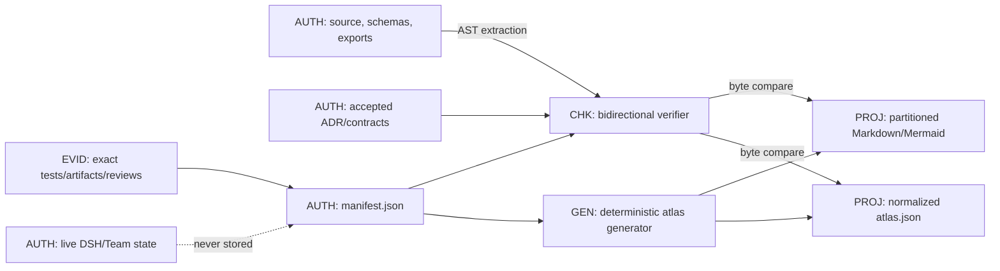
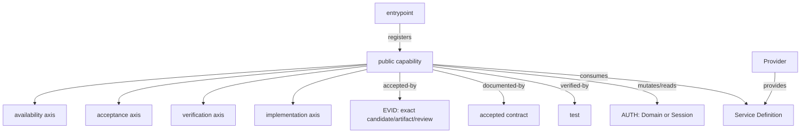

# Plugin knowledge graph: canonical inventory and generated atlas design

Status: proposed design package; not an implemented manifest, generator, verifier, or acceptance result.

This proposal is bound to repository base `5fad624f446ed4696220c901f9bf46fe5a16dd08`. It defines how the project can make its complete plugin capability graph machine-checkable without turning Markdown into live runtime, task, review, or deployment authority.

## 1. Outcome, boundary, and claim ceiling

The outcome is one canonical machine graph that covers:

- every public or registered plugin capability;
- every module under `src/`, including Host and Client faces;
- every public `TeamDomainPort` transaction and persisted entity/state enum;
- registration, Provider/Consumer, required/optional injection, event/listener, configuration, RPC, UI slot/surface, Settings and package-export contracts;
- source, tests, decision documents and exact acceptance artifacts without conflating those evidence levels.

The graph is a static contract and traceability authority. It is not Team state, a task ledger, a lease, a live service registry, current Profile health, a review verdict queue, a release pointer, or proof that a capability works in the user's environment. Current runtime truth remains with official DSH Session/Agent Loop services and the plugin's named domain authorities. Source and accepted contracts remain the implementation/architecture facts that the graph maps; the graph cannot redefine them.

This package is documentation-only. It does not claim the current source is fully inventoried yet. In particular, source and tests for a candidate capability do not imply real-Profile acceptance. R3 and M7-A remain no higher than their exact existing evidence allows until KG4 binds an exact candidate, artifact, representative populated state, real boundary and non-author result.

### 1.1 Public-capability closure

A capability is graph-public when any of these is true:

- it is in `package.json` exports or re-exported from `src/public-api.ts`;
- it is registered with a DSH/Cordis registry, route, slot, Settings namespace, tool registry, Provider registry, system-prompt section or event surface;
- it is a public method of `TeamDomainPort`, another published service contract, or a public persisted/domain schema;
- it is a user/model/browser-visible method, page, status, error, gate, setting or feature flag;
- it is an explicitly declared `separately-verified-boundary`; or
- it is a user/operator-facing script entrypoint deliberately registered as public operations capability.

Ordinary tests, fixtures, internal scripts and documents contribute `test`, `module`, `document` or evidence nodes and edges only. Importing or calling a symbol from a test/script does not make that symbol public.

Every `src/**/*.{ts,tsx}` file receives a `module` node. CSS/string-only source modules are also covered as modules when imported by a Client surface. Private helpers belong to their containing module node. A private function becomes its own node only when it owns a transaction, external effect, lifecycle resource, security boundary, recovery decision or separately verified contract. This keeps full module coverage without creating an unbounded function-call graph.

### 1.2 Non-goals

The first graph does not:

- parse arbitrary control flow or enumerate every private function/local type;
- infer assignment, permission or acceptance from prose;
- store dynamic Team/task/member/job/Session state;
- replace TypeScript, Zod, package exports, official registries, ADRs or evidence artifacts;
- copy external reference repositories into project authority;
- create a second Agent Loop, scheduler, workflow engine or storage authority;
- treat a generated Mermaid view as a canonical input.

## 2. Canonical machine authority

The proposed fact authority is `docs/knowledge-graph/manifest.json`. JSON is selected so strict parsing, duplicate-key rejection, JSON Schema validation and deterministic normalization need no YAML-specific interpretation. `docs/knowledge-graph/schema/manifest.schema.json` defines syntax; it does not contain graph facts. The normalized graph digest is SHA-256 over RFC 8785 JCS UTF-8 of the validated manifest, prefixed by the domain tag `dsh-agent-swarm/knowledge-graph/v1` and one NUL byte.

Canonical graph arrays are sorted by stable `id`; set-like fields are sorted by stable id or enum value. Unknown fields, duplicate ids/keys, non-NFC strings, backslashes in repository paths, line-number anchors, absolute machine paths, timestamps and environment observations fail closed. The manifest contains no `generatedAt`, branch, active task, lease, current reviewer, local port, PID or latest-run status.

### 2.1 Top-level schema

```ts
interface KnowledgeGraphManifestV1 {
  schemaVersion: 2
  project: {
    id: 'dsh-agent-swarm'
    sourceRoot: 'src'
    packageManifest: 'package.json'
  }
  inventoryPolicy: {
    sourceGlobs: readonly ['src/**/*.ts', 'src/**/*.tsx']
    importedAssetGlobs: readonly string[]
    excludedFiles: readonly GraphExceptionRef[]
  }
  nodes: readonly GraphNodeV1[]
  edges: readonly GraphEdgeV1[]
  exceptions: readonly GraphExceptionV1[]
}
```

`inventoryPolicy` is exhaustive, not advisory: every matched source file must resolve to exactly one module node. An exclusion requires a bounded exception record and cannot hide a public/registered symbol.

### 2.2 Node schema

```ts
type GraphNodeKind =
  | 'package' | 'entrypoint' | 'module' | 'public-capability'
  | 'model-tool' | 'service' | 'provider-registry' | 'provider' | 'consumer'
  | 'authority' | 'official-authority' | 'domain' | 'entity' | 'state'
  | 'state-predicate' | 'transaction' | 'flow' | 'flow-branch'
  | 'checkpoint' | 'fence' | 'guard' | 'event'
  | 'config-key' | 'injection' | 'rpc-route' | 'rpc-method'
  | 'ui-slot' | 'ui-surface' | 'settings-section'
  | 'separately-verified-boundary' | 'artifact' | 'test' | 'document'
  | 'gate' | 'redline'

interface NodeRefV1<K extends GraphNodeKind> { id: string; kind: K }
type AuthorityRefV1 = NodeRefV1<'authority' | 'official-authority' | 'domain'>
type RecoveryOwnerRefV1 = NodeRefV1<
  'service' | 'provider' | 'consumer' | 'transaction'
>
type GuardRefV1 = NodeRefV1<'guard'>
type RedlineRefV1 = NodeRefV1<'redline'>
type FlowRefV1 = NodeRefV1<'flow'>
type FlowBranchRefV1 = NodeRefV1<'flow-branch'>
type StatePredicateRefV1 = NodeRefV1<'state-predicate'>
type CheckpointRefV1 = NodeRefV1<'checkpoint'>
type FenceRefV1 = NodeRefV1<'fence'>

interface SourceAnchorV1 {
  file: string                 // normalized repository-relative path
  symbol?: string              // exact declared/qualified symbol
  exportName?: string          // exact package/module export
  selector?: string            // constrained AST selector, never a line number
}

interface GraphNodeV1 {
  id: string                   // kind namespace + stable semantic identity
  kind: GraphNodeKind
  title: string
  anchors: readonly SourceAnchorV1[]
  ownerAuthority: AuthorityRefV1
  config: {
    gates: readonly NodeRefV1<'config-key'>[]
    defaultState: 'enabled' | 'disabled' | 'conditional' | 'not-applicable'
    blockerCodes: readonly string[]
  }
  inject: {
    required: readonly string[]
    optional: readonly string[]
    provides: readonly string[]
  }
  lifecycle: {
    admissionOwner?: string
    registrationOwner?: string
    disposerOwner?: string
    drainOwner?: string
    recoveryOwner?: RecoveryOwnerRefV1
  }
  maturity: MaturityV1
  security: SecurityContractV1
  bounds: readonly BoundV1[]
  contract?:
    | { nodeKind: 'state-predicate'; predicate: StatePredicateV1 }
    | { nodeKind: 'flow-branch'; flow: FlowRefV1 }
  tags: readonly string[]
}
```

Stable ids describe identities, not filenames. Examples are `tool:agent_swarm_create`, `module:runtime/orchestrator-runtime`, `domain:agent_swarm`, `service:agentSwarmHostRead`, `rpc-method:swarm-v1/page`, `ui-slot:conversation.session.header.utilities`, and `tx:team/claim-task`. JSON Schema requires the matching `contract.nodeKind` on every `state-predicate` and `flow-branch` node and forbids it elsewhere. A rename that preserves a public identity keeps its id and changes its anchor; a contract rename changes the id and requires a `supersedes` edge.

### 2.3 Four independent maturity axes

```ts
interface MaturityV1 {
  implementation: {
    state: 'absent' | 'declared' | 'implemented'
    evidence: readonly string[]
  }
  verification: {
    state: 'none' | 'static' | 'unit' | 'composition' | 'real-profile'
    evidence: readonly string[]
  }
  acceptance: {
    state: 'not-candidate' | 'candidate' | 'accepted' | 'rejected' | 'superseded'
    receipt?: AcceptanceEvidenceRefV1
  }
  availability: {
    state: 'always-registered' | 'config-gated' | 'optional-injection'
      | 'profile-dependent' | 'package-exported' | 'unavailable'
    conditions: readonly string[]
    blockers: readonly string[]
  }
}
```

The axes never imply one another. `implemented + composition + candidate + config-gated` is valid. `accepted` requires the immutable receipt reference below; all other states must omit it. `real-profile` requires an artifact and representative real starting state, not an empty render or mock. Availability describes the static deployment contract and conditions; it never records whether a particular live Profile is currently mounted.

#### 2.3.1 Immutable acceptance evidence

The manifest stores only a content-addressed receipt identity, never copied receipt fields or an in-progress run:

```ts
interface AcceptanceEvidenceRefV1 {
  locator: {
    kind: 'repository-object' | 'evidence-store-object'
    storeId: string            // normalized id allowed by project binding
    objectId: string           // immutable blob/object identity, never a path
  }
  schema: {
    id: 'dsh-agent-swarm/acceptance-receipt/v1'
    sha256: string
  }
  receiptSha256: string
}

interface AcceptanceReceiptV1 {
  schemaVersion: 2
  receiptId: string
  candidate: { commit: string; tree: string; artifactSha256: string; authorIdentityRef: string }
  officialBaseline: { identity: string; digestSha256: string }
  executionIdentity: {
    profileSha256: string
    runtimeSha256: string
    configSha256: string
  }
  startingState: {
    fixtureSha256: string
    requiredEntityCounts: readonly {
      entity: NodeRefV1<'entity'>
      minimum: number
    }[]
  }
  operatorAction: { actionId: string; inputSha256: string }
  crossedBoundaries: readonly NodeRefV1<
    'public-capability' | 'model-tool' | 'service' | 'rpc-route'
      | 'rpc-method' | 'ui-surface' | 'separately-verified-boundary'
  >[]
  terminalObservation: {
    authority: AuthorityRefV1
    readbackId: string
    valueSha256: string
  }
  review: {
    trustedRegistryId: string
    identityRef: string
    identityProofSha256: string
    reviewedCoreSha256: string
    verdict: 'accept'
    nonAuthor: true
    candidateBindingSha256: string
  }
  policy: {
    projectBindingSha256: string
    methodPolicySha256: string
    verifierGenerationSha256: string
  }
}
```

`storeId` is NFC lowercase and matches `[a-z][a-z0-9._-]{0,63}` plus an exact project-binding allowed repository/evidence-store entry. A repository `objectId` is a lowercase object id under that binding's declared Git hash algorithm; an evidence-store `objectId` is the lowercase content id under its declared content-address algorithm. Absolute/workspace-relative paths, URLs, branches, “latest”, ports, PIDs and run ids are forbidden locators. The verifier fetches the immutable object, checks the versioned receipt-schema digest, rejects unknown/missing/duplicate/noncanonical fields, and validates all lowercase hashes and commit/tree identities. The non-self-referential final identity is:

```text
receiptSha256 = SHA-256(
  UTF-8("dsh-agent-swarm/acceptance-receipt/v1") || 0x00 || UTF-8(JCS(receipt))
)
```

If the project binding has no allowed immutable receipt store, or its evidence-store capability is `NOT_CONFIGURED`, `accepted` fails closed; a path/string embedded by the candidate cannot configure it.

`requiredEntityCounts` is nonempty and every `minimum >= 1`; the capability's declared representative-state contract decides the required entity kinds. The terminal read-back must be owned by the named authority and its digest must match the receipt. `candidateBindingSha256` is the same construction with tag `dsh-agent-swarm/acceptance-candidate/v1` over JCS(`candidate`). `reviewedCoreSha256` uses tag `dsh-agent-swarm/acceptance-reviewed-core/v1` over JCS of every receipt field except `review`; the trusted proof signs that core plus the candidate binding. Candidate author and reviewer identities must both resolve through project governance, differ, bind that exact core/candidate, and have `verdict === 'accept'` and `nonAuthor === true`. The final `receiptSha256` then covers the complete receipt including review, avoiding self-reference. Baseline, Profile/runtime/config, action, crossed-boundary, terminal, project-binding, policy or verifier-generation mismatch fails closed. This receipt records a completed immutable observation; it never carries current process health, task progress, leases or mutable review state.

### 2.4 Security and bounds

```ts
interface SecurityContractV1 {
  authoritySource: AuthorityRefV1
  callerIdentity: 'exec-agent' | 'live-root-session' | 'host-attested-human'
    | 'internal-provider' | 'none'
  mutation: 'none' | 'read' | 'domain-transaction' | 'external-effect'
  dataClasses: readonly ('public' | 'workspace' | 'session' | 'team' | 'personal' | 'secret-excluded')[]
  guards: readonly GuardRefV1[]
  redlines: readonly RedlineRefV1[]
}

interface BoundV1 {
  name: string
  kind: 'bytes' | 'items' | 'time-ms' | 'depth' | 'concurrency'
    | 'retention' | 'pagination' | 'revision' | 'attempt-fence'
  value: number | { min?: number; max?: number; default?: number }
  source: SourceAnchorV1
}
```

Free-text security summaries are not gates. Authority, guard, denial, size/time/concurrency/retention bounds and known `NOT_CONFIGURED` capability blockers use typed refs and source anchors. A secret value, local root, bearer token or user content is forbidden graph data.

### 2.5 Typed edges and crash semantics

```ts
type GraphEdgeType =
  | 'contains' | 'exports' | 'registers' | 'provides' | 'consumes'
  | 'requires-inject' | 'optionally-injects' | 'configured-by'
  | 'owns' | 'reads' | 'mutates' | 'persists-in'
  | 'emits' | 'listens' | 'projects' | 'exposes'
  | 'triggers' | 'calls' | 'transitions' | 'checkpoints'
  | 'recovers' | 'guards' | 'bounded-by'
  | 'verified-by' | 'documented-by' | 'accepted-by'
  | 'blocked-by' | 'supersedes' | 'violates'

interface CrashContractV1 {
  flow: FlowRefV1
  branch: FlowBranchRefV1
  ordinal: number
  phase: 'trigger' | 'transaction' | 'external-effect' | 'checkpoint' | 'recovery'
  durability: 'none' | 'atomic-commit' | 'external-unknown' | 'durable-readback'
  recoveryMode: 'state-changing' | 'observe-block'
  expectedBefore: readonly StatePredicateRefV1[]
  committedAfter: readonly StatePredicateRefV1[]
  checkpoint?: CheckpointRefV1
  fences: readonly FenceRefV1[]
  recoveryTransactions: readonly NodeRefV1<'transaction'>[]
  failureCode: string
  authoritativePostState: 'unchanged' | 'committed' | 'unknown'
  idempotency?: IdempotencyTupleV1
  retryRule: 'never' | 'exact-readback-first' | 'same-fenced-operation'
  recoveryOwner: RecoveryOwnerRefV1
}

interface StatePredicateV1 {
  entity: NodeRefV1<'entity'>
  field: { schema: NodeRefV1<'entity'>; selector: string }
  operator: 'eq' | 'neq' | 'in' | 'present' | 'absent'
  value?: string | number | boolean | null | readonly (string | number | boolean)[]
}

interface IdempotencyTupleV1 {
  domainTag: string
  components: readonly {
    source: NodeRefV1<'model-tool' | 'rpc-method' | 'transaction' | 'entity'>
    kind: 'argument' | 'entity-field' | 'transaction-input'
    selector: string
  }[]
}

interface GraphEdgeV1 {
  id: string
  type: GraphEdgeType
  from: NodeRefV1<GraphNodeKind>
  to: NodeRefV1<GraphNodeKind>
  anchors: readonly SourceAnchorV1[]
  contract?: 'required' | 'optional' | 'read-only' | 'mutation' | 'projection'
  crash?: CrashContractV1
}
```

`state-predicate` nodes carry one strict `StatePredicateV1`; their selectors must resolve against the referenced entity's extracted schema AST and their typed values must match the selected field/operator. `IdempotencyTupleV1.components` is nonempty and ordered; every selector resolves against the referenced argument, transaction-input or entity schema, so a free-text key such as `team/task/revision` is invalid.

Only edges on effectful flows carry `crash`. `external-effect` defaults to authoritative post-state `unknown` unless exact provider semantics prove otherwise. `flow`, `branch`, ordinal, predicates, checkpoint, fences and recovery owner must close to canonical nodes; the branch must belong to the same flow and ordinals must be unique/contiguous within it. Recovery names one typed executable owner and an exact read-back/fence rule. An authority/domain is never an executor: when an authority exposes recovery, a separate service or transaction node performs it.

Every entity, state and checkpoint has exactly one `ownerAuthority`. For each before/checkpoint/fence/after ref, the recovery owner must have a typed `reads` path to the ref and onward to that ref's unique owner. A `state-changing` recovery has a nonempty `committedAfter` and nonempty `recoveryTransactions`; the owner must `calls` each listed typed transaction, and those transactions' `mutates` edges name every committed target entity/state/checkpoint and close to each target's unique authority. An `observe-block` recovery has empty `committedAfter` and `recoveryTransactions`, but still reads every predicate/checkpoint/fence used by its decision. The per-contract transaction list permits one executable recovery service to support several flows without attributing an unrelated transaction to an observe-only branch. A Service/Provider/Consumer never uses `mutates` to point at a transaction; execution uses `calls`, while only the transaction mutates state targets. The mode is explicit so an empty array cannot silently bypass a required transaction. One recovery may read several evidence/state authorities and mutate several explicit targets; there is no whole-flow single-authority constraint. Every external effect has an explicit `calls` edge to its Provider. A graph edge cannot downgrade an unknown effect to unchanged or authorize a blind retry.

The JSON Schema fixes the reference-kind matrix:

| Field | Allowed target kinds |
|---|---|
| `ownerAuthority`, `security.authoritySource` | `authority`, `official-authority`, `domain` |
| lifecycle/crash `recoveryOwner` | executable `service`, `provider`, `consumer`, `transaction` only; authorities/domains are forbidden executors |
| `security.guards` / `security.redlines` | `guard` / `redline` |
| `crash.flow` / `crash.branch` | `flow` / `flow-branch` linked to that flow |
| `expectedBefore`, `committedAfter` / `checkpoint` / `fences` | `state-predicate` / `checkpoint` / `fence` |
| idempotency component `source` | `model-tool`, `rpc-method`, `transaction`, `entity` with selector-kind compatibility |
| config gates | `config-key` |

Edge endpoints also use a schema-owned `(edge type, from kind, to kind)` matrix; the manifest cannot add or widen combinations.

### 2.6 Exception schema

```ts
interface GraphExceptionV1 {
  id: string
  scope: string
  rule: string
  owner: string
  reason: string
  expiry: { kind: 'date'; value: string } | { kind: 'milestone'; value: string }
  evidence: readonly SourceAnchorV1[]
}
```

Exceptions are narrow verifier suppressions, not maturity upgrades. Missing owner/reason/expiry, expired exceptions, wildcard scope, public-capability exclusion or nested-repository escape fails closed.

## 3. Initial design acceptance inventory

KG1 must populate the manifest from extraction plus reviewed classification. The following tables are the acceptance baseline, not a substitute for the future manifest.

### 3.1 Exact model-facing tool baseline: 19

| # | Stable node id | Family | Registration module | Authority class |
|---:|---|---|---|---|
| 1 | `tool:agent_swarm_create` | Team lifecycle | `src/tools/team-lifecycle.ts` | Captain/domain mutation |
| 2 | `tool:agent_swarm_add_member` | Team lifecycle/profile | `src/tools/team-lifecycle.ts` | Captain + Subagent effect |
| 3 | `tool:agent_swarm_remove_member` | Team lifecycle | `src/tools/team-lifecycle.ts` | Captain/domain + drain effect |
| 4 | `tool:agent_swarm_interrupt_member` | Emergency member control | `src/tools/team-lifecycle.ts` | Host-evidence-gated Captain effect |
| 5 | `tool:agent_swarm_archive` | Team lifecycle | `src/tools/team-lifecycle.ts` | Captain/domain mutation |
| 6 | `tool:agent_swarm_create_task` | Task/DAG | `src/tools/task-board.ts` | Team domain mutation |
| 7 | `tool:agent_swarm_claim_task` | Task/attempt | `src/tools/task-board.ts` | Revision/attempt-fenced mutation |
| 8 | `tool:agent_swarm_submit_task` | Task/attempt | `src/tools/task-board.ts` | Owner/attempt-fenced mutation |
| 9 | `tool:agent_swarm_reassign_task` | Task/attempt | `src/tools/task-board.ts` | Captain/revision-fenced mutation |
| 10 | `tool:agent_swarm_review_task` | Review | `src/tools/task-board.ts` | Captain/review transaction |
| 11 | `tool:agent_swarm_send_message` | Mailbox | `src/tools/mailbox.ts` | Membership/domain + delivery effect |
| 12 | `tool:agent_swarm_wait` | Wait/read | `src/tools/mailbox.ts` | Revision-bound read/wait |
| 13 | `tool:agent_swarm_set_budget` | Budget | `src/tools/budget-memory.ts` | Captain/domain mutation |
| 14 | `tool:agent_swarm_add_memory` | Shared memory | `src/tools/budget-memory.ts` | Authorized Team mutation |
| 15 | `tool:agent_swarm_add_personal_memory` | Personal memory | `src/tools/budget-memory.ts` | Member-owner-scoped mutation |
| 16 | `tool:agent_swarm_list_memory` | Memory query | `src/tools/budget-memory.ts` | Authorized bounded read |
| 17 | `tool:agent_swarm_status` | Team read | `src/tools/read-surface.ts` | Bounded projection read |
| 18 | `tool:agent_swarm_list_tasks` | Task read | `src/tools/read-surface.ts` | Filtered/paginated read |
| 19 | `tool:agent_swarm_list_jobs` | Jobs read | `src/tools/read-surface.ts` | Optional projection read |

The verifier derives this set independently from all `defineTool({ name })` declarations, `registerAgentSwarmTools` registration order and the permission-policy inventory. Missing, duplicate or disagreeing sets fail; the table above is not parsed as the source.

### 3.2 Full inventory matrix

| Capability family | Required graph dimensions | Primary extraction roots | Minimum evidence class |
|---|---|---|---|
| Package/bootstrap | entrypoints, named/default exports, bundle/client exports, required inject, apply/dispose | `package.json`, `cordis.patch.yml`, `src/index.ts`, `src/public-api.ts`, `src/client/plugin-entry.ts` | structure + package artifact |
| Model tools | all 19 names, schema/register order, caller role, domain/effect, output/bounds | `src/tools.ts`, `src/tools/**`, `src/runtime/permission-policy.ts` | tool tests + composition |
| Team aggregate/storage | domain name/version, schema, store Provider, atomic transaction, migration read path | `src/domain/**`, `src/storage/**`, `src/migration/**` | schema/store/reload tests |
| Roster/Subagent lifecycle | provision/settle/recover/remove/archive, Provider route, Session checkpoint, disposer | `src/runtime/member-provisioning.ts`, `src/runtime/member-control.ts`, roster domain modules | failure/recovery composition |
| Task DAG/attempt/review | entities/enums, public port methods, revision CAS, attempt fence, verification gate | board/graph/types/review modules | domain + executable-review tests |
| Mailbox/wakeup/wait | queued/delivered/cancelled, exact frame, quiet/wakeup, acknowledgement, wait cursor | mailbox, delivery, visibility, wait modules | crash-window tests |
| Budget/usage | limits/defaults, usage cursor, reservations/retries, Session-event fold | budget and usage modules | replay/reload/boundary tests |
| Team/personal memory/profile | scope/owner policy, member provider/model/skills/deny intent, deterministic/semantic query | memory modules, member provisioning, projections | populated/reload/Profile evidence before acceptance |
| Scheduler/orchestration | Provider registry, priority/DAG selection, adaptive/workflow single-owner gate | scheduling, providers, ownership, orchestrator | race/fencing tests |
| Workflow bridge | official service Provider, overlay domain, run states, script bounds, disposal | `src/runtime/workflow/**`, workflow overlay | official invariant + composition |
| Jobs bridge | official registry Provider, read-only task projection, disabled blocker | `src/runtime/jobs/**` | dual-face/projection tests |
| Execution/review roots | Provider registries, capabilities, root lease/residue/release, verification routes | execution-root and review-root modules | real-root failure/recovery evidence |
| Permission/Skills/LLM | pre-execute guard, monotone policy, caller identity, optional registries, creation filter | permission/tool-policy/member provisioning | denial + real composition |
| Human interaction/control | typed request/effect/receipt, overlay domain, principal, liaison/review Provider | `src/human/**`, provenance/review transaction | correlation/reload/security tests |
| Host producer/read | service definitions, provide/inject, binding authority, immutable read projection | `src/host/**` | Host assembly tests |
| RPC | exact route, trust gate, methods, request/result schemas, page kinds, body/drain bounds | `src/rpc/**` | contract/transport/failure + real Profile |
| Client dashboard/chat handoff | Client inject, slots, controllers, reset/disposal, pages, locale/theme | `src/client/**` | UI unit + exact-artifact official Profile/browser proof |
| Settings | namespace, all Zod keys/defaults, live/read-only behavior, UI surface | `src/runtime/settings.ts`, `src/index.ts`, settings Client modules | config/default + UI tests |
| Node mapping | phase/parallel/pipeline/nested/human compile/apply edges | `src/patterns/**` | pure mapping tests |
| Events/lifecycle | all listeners, registrations, effects, admission close, drain/dispose, recovery owner | all `src/**`, especially bootstrap/runtime/client | lifecycle/HMR/dispose tests |
| Traceability/governance | source/test/doc/artifact links, redlines, gates, exact acceptance identity | tests, registered docs, artifact receipts | verifier + non-author audit |

KG1 exits only when every matched source module is assigned to one of these families or a narrower declared family, every public symbol is reachable from a package/entrypoint or explicitly internal, and every family has its security, bounds and four maturity axes filled.

### 3.3 Example canonical records

```json
{
  "id": "tool:agent_swarm_claim_task",
  "kind": "model-tool",
  "anchors": [{ "file": "src/tools/task-board.ts", "symbol": "registerClaimTaskTool" }],
  "ownerAuthority": { "id": "domain:agent_swarm", "kind": "domain" },
  "config": { "gates": [], "defaultState": "enabled", "blockerCodes": [] },
  "inject": { "required": ["service:tools"], "optional": [], "provides": [] },
  "lifecycle": { "registrationOwner": "entrypoint:host" },
  "maturity": { "implementation": { "state": "implemented", "evidence": ["module:tools/task-board"] }, "verification": { "state": "composition", "evidence": ["test:assignment-visibility"] }, "acceptance": { "state": "candidate" }, "availability": { "state": "always-registered", "conditions": [], "blockers": [] } },
  "security": { "authoritySource": { "id": "domain:agent_swarm", "kind": "domain" }, "callerIdentity": "exec-agent", "mutation": "domain-transaction", "dataClasses": ["team", "workspace"], "guards": [{ "id": "guard:membership", "kind": "guard" }, { "id": "guard:task-revision", "kind": "guard" }, { "id": "guard:attempt-fence", "kind": "guard" }], "redlines": [{ "id": "redline:no-prompt-authority", "kind": "redline" }] },
  "bounds": [], "tags": ["task", "attempt"]
}
```

An edge example is `edge:claim-task/domain-tx`, type `mutates`, from the tool above to `tx:team/claim-task`. Its `crash` references `flow:claim-task`, `flow-branch:claim-task/normal`, before/after `state-predicate` nodes, `fence:task-revision` and `checkpoint:attempt-reserved`; its idempotency tuple uses domain tag `dsh-agent-swarm/claim-task/v1` and ordered argument selectors `teamId`, `taskId`, `expectedRevision`; its recovery owner is `{id:"service:agent-swarm-runtime",kind:"service"}`. The positive recovery fixture additionally makes that service `reads` the official Session acceptance checkpoint, then `calls` `{id:"tx:team/acknowledge-assignment",kind:"transaction"}`, whose typed `mutates` edge updates the Team attempt owned by `{id:"domain:agent_swarm",kind:"domain"}`. Session and Team remain separate authorities; the runtime is neither. These are canonical node ids, not free-text states/keys. The examples demonstrate shape only; KG1 must derive exact evidence rather than copy sample maturity.

## 4. Generated atlas views

The generator reads only the validated manifest and writes deterministic projections under `docs/generated/knowledge-graph/`:

| View | Question answered | Partition key |
|---|---|---|
| `entrypoints-and-switches.md` | What loads, exports, registers, and which config/default gates it? | entrypoint/config |
| `service-provider-consumer.md` | Which Service/registry owns each Provider and Consumer? | service family |
| `domain-state.md` | Which authority owns each entity, state and public transaction? | domain/entity |
| `effect-recovery.md` | What is trigger → transaction → effect → checkpoint → recovery? | typed `flow` node id |
| `authority-permission.md` | Which identity, guard and redline protects each read/mutation/effect? | owner/security class |
| `traceability.md` | Which source, test, document and artifact supports each claim? | capability/maturity axis |
| `availability.md` | What is always registered, config-gated, optional, Profile-dependent or unavailable? | availability state/blocker |
| `redlines.md` | Which prohibited edge would cross an authority or trust boundary? | redline/violation |
| `atlas.json` | Stable normalized graph for tooling and external read-only consumers | whole graph |

No single Mermaid diagram attempts to contain the complete graph. Each Markdown view contains small subgraphs capped by configured node/edge limits and links stable ids to a generated symbol index. Line numbers are derived during generation from the AST and appear only in projections; they are never canonical anchors.

Generation rules are byte deterministic: strict UTF-8 without BOM, LF, fixed headings, stable sort, fixed Mermaid ids, no clock/environment fields, and the normalized manifest digest in the header. Generated files start with `DO NOT EDIT: generated from docs/knowledge-graph/manifest.json`. Humans change manifest/schema/generator/tests, never generated output.

## 5. Verifier and extraction contract

The proposed command is `pnpm verify:knowledge-graph`; the implementation uses the TypeScript compiler AST plus strict JSON parsing. Regex may be a diagnostic only, never the acceptance extractor.

### 5.1 Required extractors

The verifier independently extracts:

1. all `defineTool` names, registration functions and the `registerAgentSwarmTools` call order; the extracted set must equal 19 and equal the permission-policy surface;
2. every static `inject`, `ctx.provide`, `ctx.inject`, `ctx.get` optional lookup, Provider registry declaration and `register*Provider` call;
3. Service/Provider registries, their names, capabilities, default selections, duplicate rules and disposers;
4. `Config` interface and Zod object keys, enums, bounds and defaults; interface/schema/default disagreements fail;
5. Storage Domain specs, versions, record schemas, public `TeamDomainPort` methods, entity discriminants and state enums/unions;
6. RPC exact routes, HTTP method, RPC method enum, request/result schema, capability list and page kinds;
7. Client package entrypoints, declared inject, slot injection/registration, surfaces, Settings namespace/fields and connection/lifecycle listeners;
8. `ctx.on`, relevant scoped event listeners, system-prompt sections, domain listeners and disposer ownership;
9. `package.json` exports, DSH bundle/client metadata and every exported symbol reachable through `src/index.ts`/`src/public-api.ts`;
10. every `src/**/*.{ts,tsx}` module and imported source asset covered by `inventoryPolicy`.

Dynamic registry names that cannot be statically enumerated must be declared as bounded extension points with an anchor, name grammar, duplicate behavior and test. They are not silently skipped.

### 5.2 Source-to-graph positive coverage

For every extracted fact, the verifier requires a matching canonical node/edge:

- a registered capability has one stable id, owner, lifecycle and maturity record;
- a module has exactly one module node and family containment path;
- a required injection closes to a provided/official-external service node;
- an optional injection/get has an explicit unavailable behavior or blocker;
- a config key has an exact default/gate and all gated capabilities point back to it;
- a public transaction has typed trigger/caller, authority owner, mutation target, state predicates, checkpoint, fences, idempotency tuple and recovery flow;
- a public surface has at least one source, test and decision/user-document trace appropriate to its claim;
- every package export points to a resolvable source symbol and capability family.

Tests and ordinary scripts are evidence/module inventory only. The positive public set is derived solely from package exports, registrations, public Service/Domain contracts, explicit user/operator script entrypoints and `separately-verified-boundary` declarations.

Coverage is set equality, not a target percentage. New source that the extractor recognizes and the graph omits fails the candidate.

### 5.3 Graph-to-source reverse validation

For every manifest record, the verifier requires:

- file containment under the repository and a parsed source/document/test of the expected kind;
- exact symbol/export/selector resolution, without line-number fallback;
- existing endpoints and a legal schema-owned `(edge type, from kind, to kind)` tuple;
- exactly one typed `ownerAuthority` for every entity, state, checkpoint, mutable transaction/effect and public capability, closed only to `authority`, `official-authority` or `domain`;
- complete injection closure and no Provider/Consumer cycle that bypasses its Service Definition;
- exact config default, enum, bound, blocker and activation condition;
- lifecycle resource registration paired with disposer/drain ownership;
- guard/redline refs resolve to their exact kinds; state predicates resolve typed selectors/values against extracted entity schemas; idempotency components resolve ordered source selectors;
- every crash flow/branch/checkpoint/fence closes to its allowed kind and ordinals form an acyclic contiguous branch;
- every failure/unknown effect has one executable recovery owner; every decision ref has a `reads` path to its unique owner, every mutation goes through a typed transaction to each explicit target/owner, and every effect has a `calls`/Provider edge; multi-authority reads/targets are legal, while observe/block recovery may omit mutation only;
- public capabilities have source + test + document links, with artifact/review only when claimed;
- `accepted` resolves one project-binding-allowed immutable receipt, validates its strict schema/JCS digest, exact candidate/artifact/baseline/execution/populated-state/action/boundaries/terminal read-back and trusted non-author `accept` review;
- redline edges are absent from the implemented graph; a `violates` record is a blocking finding, never a tolerated relationship.

Unknown kinds/edges/enums/fields, orphan nodes, duplicate ownership, dangling evidence, acceptance without exact identity, future-dated exceptions and stale/superseded evidence fail closed.

### 5.4 Maturity and availability gates

The verifier enforces monotone claim ceilings, not a simplistic progression:

- `implemented` needs a source anchor; `verification != none` needs a matching test/gate node;
- `composition` must cross the declared Provider/Consumer boundary; a pure mock cannot claim it;
- `real-profile` needs exact artifact/Profile/runtime/config identity, populated starting-state counts, action digest, crossed boundaries and authoritative terminal read-back;
- `accepted` needs the exact immutable receipt and independent trusted review required by project binding; copied receipt fields or a mutable locator are rejected;
- `profile-dependent` and `optional-injection` must name the condition and structured absent behavior;
- a config default in the graph must match Zod and all prose projections;
- an unresolved blocker prevents only the dependent axis/capability, not unrelated graph generation.

The graph may preserve historical acceptance evidence only when it is bound to its historical candidate. It must not project that result onto current HEAD. Latest source/tests are a current candidate until exact-current acceptance exists.

### 5.5 Generated-output drift check

`generate-knowledge-graph --check` validates the manifest, renders into a temporary directory, compares the expected file set and bytes, and reports a bounded semantic diff. It never rewrites the worktree in check mode. Manual generated edits, missing outputs, extra outputs, generator-version drift or changed manifest digest fail.

The write command is explicit and local: `pnpm generate:knowledge-graph`. Its output request must be the exact canonical repository-relative path `docs/generated/knowledge-graph`; absolute, escaped, normalized-equivalent, symlink/junction and unknown-entry targets fail closed, and the generator never deletes an unknown file or directory. After generation, the candidate must include manifest/schema/generator/test changes and all generated deltas together. A generator that is unavailable reports `NOT_CONFIGURED`; it cannot declare stale outputs green.

### 5.6 Negative self-tests

Fixture tests must prove rejection of at least:

- a twentieth registered tool absent from the graph, a graph-only tool, duplicate tool name and registration-policy set mismatch;
- one unowned `src` module, unresolved symbol/export, absolute/escaped path and case/Unicode collision;
- illegal edge kinds, dangling endpoints, duplicate mutation owners and inject closure failure;
- bogus guard/redline kind, authority/domain masquerading as recovery executor, nonexistent/non-executable recovery owner, missing official Session read, wrong target authority, one entity/state/checkpoint with multiple owners, state-changing recovery with empty `committedAfter`/`recoveryTransactions` or a missing transaction call, observe-block recovery with nonempty committed/transaction lists, a non-transaction executor using `mutates` to point at a transaction, free-text before/after state, invalid entity selector/value, idempotency source/kind mismatch or unordered/empty tuple, unclosed flow branch/checkpoint/fence;
- missing Provider disposer, optional inject without blocker, and lifecycle recovery without an owner;
- Config interface/Zod/default/gate drift and a disabled feature projected as always available;
- domain enum/public port method/schema drift;
- RPC route/method/page or Client slot/settings drift;
- transaction ordinal gaps, blind retry after unknown effect and two recovery owners;
- public capability missing source/test/doc evidence;
- forged `accepted`, unapproved/absolute/dynamic evidence locator, receipt/schema/digest mismatch, missing candidate/artifact/baseline/Profile/runtime/config/populated-state/action/boundary/read-back/policy identity, review other than trusted non-author `accept`, historical evidence projected to current HEAD;
- unknown manifest fields, duplicate JSON keys, noncanonical order, expired/wildcard exception;
- manual generated edit, missing generated file and nondeterministic clock/path output;
- a source/test/document claiming a redlined second authority or prompt-derived permission.

Every negative fixture asserts the stable diagnostic code, not just nonzero exit. A positive fixture covers the smallest complete plugin graph, including one config-gated Provider/Consumer and recovery that reads an official Session authority checkpoint before a typed transaction mutates a TeamDomain-owned attempt.

### 5.7 Project-check integration

Integration is phased:

- `verify:structure` calls the accepted graph schema, source inventory, reverse-anchor and `generate --check` gates after KG3;
- full `pnpm verify` additionally runs extractor fixtures, negative self-tests, traceability/maturity gates and package-artifact graph checks;
- neither command writes generated output;
- the accepted-base verifier evaluates a candidate that changes the verifier; the changed verifier cannot approve itself;
- failures report `PASS`, `FAIL`, `NOT_RUN` or `NOT_CONFIGURED` and block only the affected claim unless the manifest/schema itself is invalid.

## 6. Synchronization protocol

Any candidate that adds, deletes, renames or changes a registered capability, module, export, owner, state, public transaction, event, config/default, inject, RPC/UI/Settings contract, lifecycle effect, security boundary, bound, maturity claim or availability condition must update, in the same candidate:

1. source and affected tests;
2. canonical manifest and, when the format changes, schema/generator fixtures;
3. deterministic generated atlas views;
4. affected registered architecture/contract/user documents;
5. exact evidence references for any maturity upgrade.

The verifier derives changed facts and refuses “manifest not needed” when an extracted set changed. Line movement alone changes only generated line links and does not require canonical manifest edits. Pure private-helper refactors remain inside their module node unless they change a transaction/effect/lifecycle/security contract.

Exceptions require stable id, exact rule/scope, accountable owner, reason, expiry and evidence. They are reviewed with the candidate and cannot suppress public exports, tools, routes, domain methods, trust boundaries, acceptance gates or graph determinism.

The canonical manifest never stores dynamic task progress. Work packages, candidate reviews, current acceptance runs, leases and blockers live in their selected dynamic/evidence authorities; only immutable evidence identities may be linked after they exist.

## 7. Documentation governance and conflict priority

Implementation of this proposal requires one governance candidate that:

- registers `plugin-knowledge-graph-manifest` as a `stable-authority`, subject `architecture`, write mode `human`;
- registers each generated Markdown/JSON atlas family as `projection`, write mode `generated`, with `sourceAuthority: plugin-knowledge-graph-manifest` and byte-drift validation;
- links `docs/README.md` to the human atlas entry;
- adds one thin AGENTS instruction: public/registered/contract changes run the graph verifier and update its source manifest, without duplicating inventory;
- links KG milestones from the roadmap without copying live completion state;
- keeps this development proposal as reference until the governance candidate is accepted, then marks it superseded or retains it as design history.

Conflict priority is explicit:

1. official DSH runtime/Session authorities and plugin domain authorities own live behavior/state;
2. current source, Zod/domain schemas, package exports and accepted ADR/contracts own implementation and intended contract facts in their domains;
3. the canonical graph owns stable graph identity, classification, ownership mapping and traceability links, and must validate against 1-2;
4. generated atlas files are projections only;
5. README, roadmap and AGENTS links are thin navigation/instruction projections.

A conflict between levels is a verifier/design finding. Lower levels never override higher authority, and the graph never “wins” by hiding source drift. Document authority and mutation rules remain those of `docs/governance/document-registry.yaml`.

## 8. Design diagrams

Legend: `AUTH` is a canonical authority, `GEN` a deterministic generator, `CHK` a verifier gate, `PROJ` a generated projection, and `EVID` immutable evidence.

### D1 — authority and generation boundary



The manifest is the sole graph-fact authority, but source/contracts are independently checked authorities for what it claims. Live state never flows into the manifest.

### D2 — capability trace and four maturity axes



The generator partitions this relationship by family and axis; it does not collapse source, test, acceptance and availability into one “done” label.

### D3 — transaction/effect/checkpoint/recovery view

D3 legend: `DC` = durable commit/read-back boundary, `FX` = external effect, `FAIL` = failure or authoritative-unknown edge, and `REC` = the typed recovery owner/edge.

```mermaid
sequenceDiagram
  participant T as Trigger/Consumer
  participant D as AUTH: TeamDomainPort
  participant P as External Provider
  participant S as AUTH: official Session checkpoint
  participant R as REC: executable recovery owner
  T->>D: fenced transaction request
  D->>D: DC atomic intent/state commit
  D->>P: FX calls Provider
  Note over P: FAIL response loss => post-state unknown
  P->>S: target-side durable acceptance
  S-->>D: exact read-back
  D->>D: DC settle/checkpoint
  alt any unknown result
    D-->>R: REC recovery debt + exact identity
    R->>S: REC reads Session authority
    R->>D: REC calls typed transaction; mutates Team target
  else confirmed
    D-->>T: publish success after commit
  end
```

Every effectful `flow` node produces a diagram like D3 from ordered typed edges. D3 deliberately reads official Session evidence and mutates TeamDomain state through a transaction: each authority stays unique for its own state, while the recovery service is only an executor. `unknown` never maps to blind retry or rollback.

### 8.1 Diagram coverage

| Diagram | States/authority covered | Canonical inputs | Required fault checks | Atlas destination |
|---|---|---|---|---|
| D1 | source/contract/manifest authority, generation and live-state exclusion | package/source nodes, document nodes, graph digest | manual generated edit, source/manifest drift, dynamic field injection | atlas overview/governance |
| D2 | entrypoint → capability → service/provider/domain plus four maturity axes | capability/service/owner/evidence edges | missing owner/inject/test/doc/artifact; maturity overclaim | service-provider, traceability, availability |
| D3 | trigger → transaction → effect → Session checkpoint → recovery transaction → Team state | ordered crash edges, executable recovery owner and per-ref authority closure | failure before/after effect, lost response, authority-as-executor, missing Session read, wrong/multiple state owner, blind retry | effect-recovery |

The complete atlas later adds family-specific state and redline diagrams generated from the same schema; these three validate the design vocabulary, not full inventory completion.

## 9. Milestones and real exit gates

### KG0 — schema, fixtures and generator check

- Add the strict graph and `AcceptanceReceiptV1` schemas, typed-ref/edge matrices, minimal positive fixture, required negative fixtures, canonical JCS digests and deterministic generator/check mode.
- Register manifest/projection document authorities through the existing governance process.
- Exit: accepted-base verifier rejects unknown fields, duplicate ids/keys, illegal edges, nondeterminism and manual projection edits; two identical generations are byte-identical on Windows and CI.

### KG1 — complete source inventory

- **KG1-C is only the mechanical skeleton, not KG1 completion.** Its nodes and edges record extractor-backed source shape with `classification: mechanical`, `factAuthority: authority:source-tree`, no `ownerAuthority`, no runtime `security.authoritySource`, `unclassified` security, `verification: none` and `acceptance: not-candidate`. Mechanical edges may encode structure such as contains/imports/exports/registers, but never runtime ownership, reads, mutation, crash or recovery semantics. `--seed` emits only this skeleton and must never overwrite reviewed records.
- **KG1-D performs the reviewed semantic closure.** A reviewed node gains a non-source runtime owner and classified security only when an accepted contract and exact source evidence support it. Reviewed semantic edges connect reviewed endpoints and close authority, guards, bounds, transactions, effects, checkpoints, fences, recovery and traceability. Until KG1-D completes, KG1-C inventory success must not be reported as KG1 success.
- **KG1-D1 is the assignment-delivery/recovery vertical slice, not KG1-D completion.** It binds the Team `claimTask` reservation and its same-transaction `usedRequests + 1` budget charge, official Subagent inbox admission, official Session frame visibility, claimed-only acknowledgement and exact fenced rollback/recovery. A rejected `followup` means the message was not admitted and permits the exact rollback transaction; only a crash after successful admission has unknown post-state. Recovery must read the exact Session frame first: claimed acknowledges, absent redelivers the same fenced frame, and the distinct typed `pending` and `unknown` branches observe and block without resending. Reviewed reverse closure is the strict union of an explicit semantic-slice registry; every canonical reviewed node and edge must occur exactly once in that union, independent of tags or anchor text. Its reviewed records remain `candidate` (never `accepted`), and branches not directly exercised by the registered composition tests retain static verification. Mailbox, member lifecycle, human interaction and other KG1-D semantic families remain open.
- Populate every `src` module, all 19 tools, package/public exports, TeamDomain public methods/entities/enums, Config/defaults, inject/provide/get, Provider registries, Domains, RPC, Client slots/surfaces/Settings, events/listeners and lifecycle resources.
- Fill owner, security, bounds, crash/recovery and all four maturity axes; use exact blockers rather than optimistic defaults.
- Exit: extractor-to-graph and graph-to-anchor set equality passes; zero unexplained modules/public symbols; inventory matrix review confirms every capability family.

### KG2 — generated atlas

- Generate the eight partitioned Markdown views plus normalized `atlas.json`, stable symbol links and bounded Mermaid subgraphs.
- Update documentation navigation and thin registry/AGENTS/roadmap references in the same candidate.
- Exit: generated file set/bytes/digest pass on a clean checkout; no hand-edited output; each stable capability id is reachable from at least one human atlas index.

### KG3 — verifier self-tests and CI integration

- Land all negative self-tests, stable diagnostic codes and source/schema/export/RPC/UI extraction fixtures.
- Wire the accepted verifier into `verify:structure` and full `pnpm verify` without write side effects.
- Exit: every §5.6 mutation is caught; accepted-base candidate verification and normal CI pass; verifier failure scopes are explicit and no changed verifier self-accepts.

### KG4 — exact-current candidate evidence audit

- Audit each maturity claim against current exact commit/tree, package artifact, tests, registered documents and real boundary evidence.
- Downgrade stale/historical projection; bind historical acceptance only to its original candidate. For R3 and M7-A, require their stated exact-artifact populated/reload/Profile/browser/non-author evidence before `accepted`/`real-profile`.
- Exit: a non-author reviews the frozen graph candidate; every accepted node has exact evidence and every unavailable/gated capability names its condition; current `atlas.json` digest is recorded in the candidate evidence without becoming live status.

No milestone may close on document existence, fixture-only proof, empty state or generated diagrams alone. KG1 source inventory can proceed before real acceptance; KG4 corrects claim levels rather than blocking useful atlas generation.

## 10. Implementation slice and open decisions

The smallest safe implementation order is schema/fixtures → read-only extractor → generator check → manifest population. Do not begin by manually writing hundreds of capability nodes without extractor feedback.

KG0 freezes these tooling decisions:

1. JSON Schema is executed by dev-only Ajv `8.20.0` in strict mode; RFC 8785 JCS uses dev-only `canonicalize` `4.0.0`; the project parser rejects duplicate keys before validation. Neither dependency enters the plugin runtime dependency set.
2. A candidate that introduces or changes the graph verifier is checked by the previously accepted governance/structure gates plus the verifier's negative fixtures, then receives non-author review against its immutable Git tree. The changed verifier is not wired into the trusted project chain until that candidate is accepted and read back.
3. Stable diagnostics use the `KG_` namespace and negative fixtures assert the exact code.
4. Each Mermaid projection is capped at 30 nodes and 60 edges; the complete normalized graph remains available in `atlas.json`.

These choices change tooling, not the single-authority boundary above. A later dependency, verifier-generation or cap change creates a new candidate and invalidates acceptance that depends on the old tooling identity.
