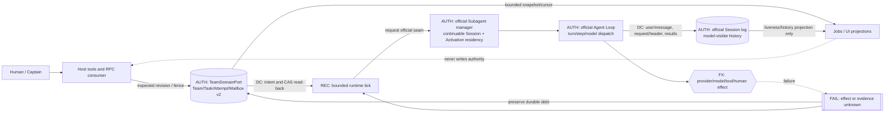
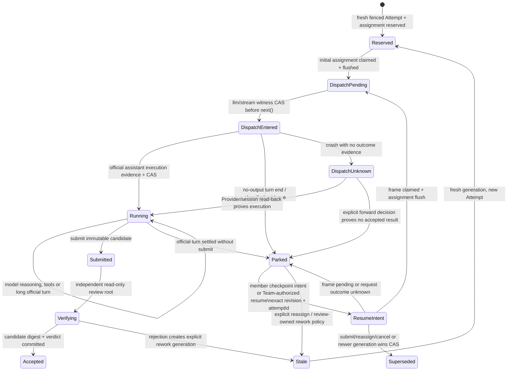

# Team runtime architecture blueprint v1

Status: **PROPOSED / REVIEW_REQUIRED**. This design candidate changes no runtime, source schema, public API, stable architecture authority, official DSH checkout, or reference checkout. The accepted authorities remain `docs/00-vision.md`, `docs/03-capability-family.md`, `docs/04-core-protocol.md`, `docs/11-official-first-development.md`, and the registered source pins. [ADR-0010](../adr/0010-model-autonomy-and-parked-attempts.md) is the normative correction for model autonomy, parked attempts, explicit continuation and timeout semantics; it supersedes any time-driven progress or idle-means-failure implication in this blueprint. The 2026-08-25 R10 audit is treated as partial evidence only: it proves a real three-member DAG and functional API/browser paths, but it does not prove durable continuation, restart recovery, immutable acceptance or formal integration.

Accepted A1a base: repository commit `e72f0344191360aef56b9055da63cb88544ba64e`. A1b is frozen at `e436e38d44374b46861174f4d494595c3854bcc8` with isolated official Profile evidence and two non-author PASS verdicts; its claim remains `DEV_SMOKE_ONLY`, not release acceptance. The following A2a online continuation work is an unfrozen, config-gated implementation candidate: it has domain and official Agent Loop composition evidence but no clean Profile proof or non-author verdict yet, and it deliberately does not claim cold recovery. Official DSH `0.1.1-rc.2` / `b150a551b8d465e31e418e1b2eaf5e79bbb7d28e` is the untouched verification host. JiuwenSwarm is reviewed and pinned at `ea3b740173c74e4cd4e8939ae546cfec3ebb7d80`; dsh-agent-teams is reviewed and pinned at `912aae5225d3d85fa841a1b0c8a5c77021876c25` / `0.1.13`. LoopX is a remote, non-dependency reference whose relevant control-plane and native-DSH surfaces were reviewed at `6aa2fb8a9fb97f0bfa6ee8b0ca6fabf6265bbe95`. Gate A passes for the locally registered pins; implementation candidates still require milestone-specific non-author acceptance.

```yaml
documentationImpact:
  affectedAuthorities:
    - core-protocol
    - capability-family
    - implementation-roadmap
    - fusion-audit
  disposition: follow-up
  rationale: This proposal changes no authority; an accepted implementation must update the registered authorities and migration contract in the same reviewed candidate.
```

## 1. Outcome and invariants

The first user-visible correction is narrow: `agent_swarm_add_member` durably declares a member but does not create an empty child turn. The first ready task starts that member with the exact assignment as its initial prompt. The larger target architecture makes that correction a coherent part of a durable Team runtime rather than a special-case patch.

The non-negotiable invariants are:

1. Official DSH owns Agent execution, Agent Loop, Session history, inbox activation, continuable-child lifecycle, provider routing, model invocation, tool execution, and model-visible replay.
2. `TeamDomainPort` owns one durable Team/Task/Attempt/Mailbox aggregate. Runtime status, UI, RPC, Jobs and prompts are projections or Consumers, never competing truth.
3. A task revision CAS and an attempt identity fence different races; both remain mandatory.
4. A model-visible assignment is acknowledged only after the exact target-side frame is durably present and claimed. Admission, wall-clock time, or a parent-side return is insufficient.
5. Every external effect is driven from a durable intent, is bounded, and is reconciled after a crash. Publish success only after the authoritative commit.
6. Adaptive scheduling and deterministic Workflow never own the same attempt.
7. No Team-specific Agent Loop, no second model loop, no transcript-derived Team state, no browser-owned truth, and no cross-Session timestamp total order.

## 2. Evidence boundary and reference fusion

### 2.1 DSH native boundary

The plugin composes existing DSH seams rather than replacing them:

| Concern | Authority / seam | Plugin responsibility |
|---|---|---|
| Model turn and Agent lifecycle | official Agent Loop and `ctx.agents` | Observe status and request bounded work; never fork or patch the loop. |
| Durable model history | Session + Session persistence | Build exact frames and prove target-side acceptance/claim; never mirror transcript truth into Team state. |
| Continuable child | `ctx.subagents.startContinuable`, `followup`, inbox, interrupt/drain | Supply a preallocated child ID, persona, tool filter, initial assignment, and later followups. |
| Long operation disclosure | `ctx.jobs` | Project finite scheduler/recovery operations and allow wait/cancel/observation. |
| Deterministic flow | `ctx.workflowEngine` | Optional orchestration owner; cannot race the adaptive scheduler. |
| Business durability | `ctx.storageDomain` through `TeamDomainPort` | Persist Team/Task/Attempt/Mailbox and lifecycle intent before effects. |
| Human interaction | official question/approval presentation plus the project HumanInteraction port | Correlate typed requests and receipts; route Team changes back through `TeamDomainPort`. |
| UI/RPC | Host producer and DSH Client Consumers | Emit bounded, versioned projections with cursors; never mutate by replaying UI state. |

This is deliberately **not** an Agent Loop redesign. An official continuable child owns one durable Session and at most one process-local **Activation**, where Activation means a residency epoch for a reconstructed child Agent — not a request, result, Task or model turn (`packages/subagent/subagent/README.md` §continuable lifecycle). The official Agent Loop still owns every turn/step and model dispatch. The Team runtime only decides which durable intent should be offered to those existing seams.

### 2.2 Jiuwen patterns worth retaining

The accepted project mapping in `docs/11-official-first-development.md` §5 and the clean local checkout at the registered pin are the evidence boundary for this proposal; the unreviewed remote delta supplies no architecture claim. The reusable product ideas are durable Team/Task/Attempt identity, dependency-aware ready work, claim/lease/fencing, queued-before-delivered mailbox, restart reconciliation, explicit human nodes, shared and personal memory, tiered capability policy, and long-lived run observability.

These are requirements to translate, not implementation to copy. The plugin must not import Jiuwen's Python runtime, persistence schema, Rails/ZMQ control plane, permission engine, public types, or its own agent loop. The reviewed Jiuwen checkout proves application-level metadata persistence, Team/Skill rails and visible long-run patterns, but the authoritative mailbox/Team runtime implementation is partly delegated to its pinned `openjiuwen` dependency; this checkout alone therefore does **not** prove process-crash durable mailbox CAS, exactly-once delivery or cold recovery. Any later upstream change requires a new Gate A review before it can change this mapping.

### 2.3 LoopX patterns worth retaining

LoopX is registered as a remote read-only reference at focused reviewed commit `6aa2fb8a9fb97f0bfa6ee8b0ca6fabf6265bbe95`; it is not a dependency or a local runtime authority. Its reusable behavior-level principles are:

- an external **bounded tick** reads durable state, performs a finite number of transitions/effects, records progress, then returns;
- long-running work may use one long official turn or many turns according to the selected model/runtime; correctness cannot require one immortal turn, because durable checkpoints and explicit continuation must make later turns and process recovery possible;
- heartbeat is liveness/lease evidence with expiry, not proof of work or completion;
- interaction pauses are durable states, and an answer schedules a new bounded tick;
- retry and resume start from durable checkpoints and idempotency keys.
- recommendations and bounded action projections guide an autonomous member but do not become hidden whitelists; hard restrictions require typed authority contracts;
- automatic continuation binds one exact Session, is single-flight, revalidates authority immediately before model entry, and yields to newer human input.

The project should reuse this state/evidence shape through the existing DSH seams. LoopX's `run_loopx_turn_once`-style timeout bounds an external host invocation owned by LoopX; it is not a model-thinking deadline and must not be applied to DSH Agent Loop turns. Heartbeat cadence and quota admission are execution/control-plane policy, not proof that a member is idle, failed or replaceable. The plugin must not copy a perpetual polling daemon, private queue, private Session runtime, second scheduler, or an unbounded recursive prompt loop. A later remote delta cannot change a claim until its exact commit is reviewed and registered.

### 2.4 Explicit non-fusion list

Do not adopt or infer:

- `role`, persona text, member profile, or a standby report as work assignment;
- free-text report contents as lifecycle authority;
- cross-Session `time`/`sessionId` sorting as causality (DBG-059);
- a scheduler-local task ledger, UI-side mailbox, or transcript parser;
- an in-memory mutex described as distributed CAS/lease;
- heartbeat as task ownership, acceptance, or completion;
- elapsed reasoning time, plan count, silence, token growth or missing file changes as task failure, abandonment or interrupt authority;
- a prompt-level first-output deadline, progress counter or hidden replacement for the official DSH Agent Loop;
- a workflow engine and adaptive scheduler both assigning/retrying one attempt;
- prompt-only permissions, prompt-only filesystem isolation, or prompt-declared skills as authority;
- automatic legacy migration, dual write, runtime fallback, or old-binary rollback after cutover.

### 2.5 Gate A consumption

Gate A currently passes with official DSH `b150a55…`, Jiuwen `ea3b740…`, and dsh-agent-teams `912aae5…`. The existing project verifier and registered source pointers remain the single authority for those identities. This architecture does not define another cryptographic receipt format or identity registry. Any pin, remote tree, claim anchor, official package export or target Profile change reruns the existing gate and reopens only the affected compatibility decision. A Gate A result authorizes neither source mutation nor architecture acceptance; the exact architecture candidate still requires one non-author verdict.

### 2.6 2026-08-25 reference recheck and delivery decision

The recheck selects incremental vertical delivery, not either extreme of “keep testing missing features” or “finish every feature before testing”:

1. finish A1b's initial-dispatch vertical, synchronize its mechanical graph plus the reviewed dispatch proof, run focused tests continuously, then accept it once against a fresh official Profile;
2. implement one durable parked-attempt continuation vertical and test its intent/effect/dispatch/unknown crash windows before adding another continuation feature;
3. add durable mailbox delivery/replay over v2 and prove restart idempotency;
4. add submit/review/immutable candidate/integration result and the runtime completion barrier;
5. add target-side Skill-load evidence and capability read-back; assignment intent remains distinct from loading proof;
6. only after those slices pass independently, run the fresh multi-member long-duration scenario and the clean fault-route matrix.

Dynamic tool permission widening is not a promised hot-update feature: the official continuation seam carries no followup-level tool-filter composition. A changed tool policy requires a new member/Session identity or an explicit loud rejection until an official seam exists. Dynamic Skill visibility is a separate later slice because the Skill Registry can change between steps, but success still requires a target Session `skill-invocation` or equivalent accepted receipt.

## 3. Current code anchors and gaps

| Area | Current anchor | Current behavior | Target gap |
|---|---|---|---|
| Member schema | `src/domain/types.ts:18-36` | `provisioning → active/failed/removed`; identity, subagent provider, resolved LLM provider/model/source, denied-tool snapshot and assigned-Skill intent persist. | Add durable `declared` and `starting`, persist resolved `maxDepth`, and add starting-attempt correlation. Do not add a generic capability snapshot. |
| Task/attempt | `src/domain/types.ts:52-115` | Task revision, owner, current attempt; attempt generation and `reserved/delivered` assignment checkpoint. | Bind first activation to the exact attempt and initial prompt checkpoint without creating a second task record. |
| Aggregate | `src/domain/types.ts:153-171` | Schema v1 Team owns roster, task DAG, attempts, mailbox, budget and shared memory. | Move the changed member/profile shape through an explicit v2 authority migration. |
| Roster transitions | `src/domain/team-domain-roster.ts:160-217` | `provisionMember` writes `provisioning`; `settleMember` activates after child start. | Replace new-write path with declare/reserve-start/settle-start CAS transitions; retain a legacy provisioning reconciler. |
| Durable schema | `src/storage/team-spec.ts:24-32,61-76,113-121`; `src/domain/state-validation.ts:46-68` | Zod boundary and structural validator admit only schema v1 fields; undeclared keys are stripped on load. | Declare every new optional/required field at both boundaries; no same-version silent extension. |
| Empty first turn | `src/runtime/member-provisioning.ts:60-180`; `src/runtime/prompts.ts:91-99` | `add_member` immediately calls `startContinuable(memberJoinNotice)` and waits for active settlement. | `add_member` ends after durable declaration; first task calls `startContinuable(assignmentPrompt)`. Delete the empty-wait path only after migration acceptance. |
| Provisioning recovery | `src/runtime/member-provisioning.ts:188-245` | Reconciles child parent/provider/accepted initial join prompt. | Reconcile exact attempt, child descriptor and exact initial assignment visibility/claim. |
| Scheduler | `src/runtime/scheduling.ts:88-182` | Mailbox, reserved debt, stranded heal, then new work for active members only. | Include eligible declared members; atomically seat task+attempt+starting before the child effect. |
| Assignment delivery | `src/runtime/scheduling.ts:196-311` | Active member gets `followup`; claimed frame then `acknowledgeAssignment`. | Split initial-start dispatch from unchanged followup dispatch, sharing the exact frame visibility fold. |
| Runtime trigger | `src/runtime/orchestrator-runtime.ts:263-287,496-531` | Add blocks on start; task creation and idle edges serialize scheduling in process. | Add returns declared; recovery/tick resumes starting debt; distributed safety remains NOT_CONFIGURED without a CAS/lease Provider. |
| Permissions/profile | `src/runtime/member-provisioning.ts:73-190`; `src/runtime/tool-policy.ts`; `src/tools/team-lifecycle.ts:41-99` | Provider/model/depth/tool filter are resolved before immediate creation. Skill names are validated through the official Skill Registry `list`, then persisted as assignment intent and rendered into persona guidance; this is not proof that a Skill was loaded. The child descriptor remains the applied creation-policy authority. | Delayed start reproduces persisted provider/LLM model/`maxDepth`/deny/Skill intent and derives one fixed required-capability predicate from them; start revalidates that predicate exactly. Real Skill loading still requires target-side evidence. |
| DAG | `src/domain/graph.ts:9-55`; `src/domain/team-domain-board.ts:110-224` | Dependency validation/readiness plus atomic claim. | Keep; extend claim transaction to member-start reservation. |
| Mailbox | `src/domain/team-domain-mailbox.ts`; `src/runtime/message-delivery.ts` | Durable queue, exact frame, target-side acceptance and acknowledgement. | Reuse its checkpoint discipline; declared targets queue messages but a message cannot impersonate a task claim. |
| Memory | `src/domain/types.ts:143-151`; `src/domain/team-domain-projection.ts:26-52` | Bounded manual Team memory only. | Separate shared accepted Team memory from personal memory/Session context; add provenance and proposal/approval flow. |
| Human | `src/human/human-interaction-contract.ts`; `src/human/captain-liaison.ts` | Typed correlation overlay; Team mutation remains canonical. | Integrate pause/resume with task/attempt fences and bounded ticks, without copying Team truth. |
| UI/Jobs | `src/runtime/jobs/team-job-projection.ts`; roadmap I2-I4 | Projection families exist or are planned. | Add member lifecycle/runtime debt/cursor fields as bounded projections, never authority. |

## 4. Target aggregate and state machines

### 4.1 Durable member declaration

The v2 member record should carry immutable creation identity and the data required to reproduce the official child creation request:

```ts
type MemberPhase = 'declared' | 'starting' | 'active' | 'failed' | 'removed'

interface TeamMemberV2 {
  name: string
  role: string
  sessionId: string          // preallocated once at declaration
  provider: string           // continuable subagent Provider
  llmProvider?: string
  model?: string
  modelSource?: 'explicit' | 'member-default' | 'captain-inherited' | 'unresolved'
  deniedTools: string[]      // exact deny-only creation snapshot
  assignedSkills: string[]   // validated assignment intent; not a loaded-Skill claim
  maxDepth: number           // frozen creation-time delegation cap
  phase: MemberPhase
  startingAttemptId?: AttemptId
  initialPromptDigest?: string
  initialMessageSeq?: number
  createdAt: number
  activatedAt?: number
  error?: string
}
```

`role` remains fenced participant data, never an assignment. The creation fields are immutable for that Session identity. A provider/model/policy/Skill-intent change requires a new member/session identity; it cannot silently alter an existing continuable child.

Current code already checks each requested Skill name against the official Skill Registry, persists `assignedSkills`, and tells the member through persona guidance to load assigned Skills through the official Skill tool when relevant (`src/runtime/member-provisioning.ts:108-125,159-190`; `src/runtime/prompts.ts:83-91`). Those facts prove validation plus durable intent, not target-side loading or capability binding. The target architecture preserves that distinction: UI/RPC reports `assigned`, and may report `loaded` only from a future official target-side receipt or other accepted evidence; persona text alone never grants Skill authority.

### 4.2 First assignment transition

```text
add_member
  └─ durable member(declared, preallocated sessionId/profile)
       └─ scheduler sees ready task + declared member
            └─ one Team transaction:
                 task pending -> in_progress
                 fresh attempt(reserved, assignment=reserved)
                 member declared -> starting(startingAttemptId=attempt.id)
                 [CAS: task.revision + member.phase + no open owner]
                  └─ acquire exact execution root (if enabled)
                  └─ startContinuable(childId, initial assignmentPrompt,
                                      persona, provider/model/toolFilter/depth)
                       ├─ no published child -> retry start under the SAME tuple
                       ├─ matching child + frame absent -> followup the SAME exact frame
                       ├─ target frame pending -> leave starting/reserved; reconcile later
                       └─ target frame claimed -> pre-model causal gate + one Team transaction:
                            member starting -> active
                            attempt assignment reserved -> delivered
                            initialMessageSeq/activatedAt/assignmentDeliveredAt checkpoint
                             └─ subsequent assignments use existing followup path
```

The reserve and settle operations must be domain methods, not an orchestration sequence of unrelated writes. Proposed port vocabulary:

- `declareMember(...)`
- `reserveInitialAssignment(teamId, captainId, taskId, expectedRevision, memberSessionId)`
- `settleInitialAssignment(teamId, taskId, attemptId, memberSessionId, checkpoint)`
- `failInitialAssignment(teamId, taskId, attemptId, memberSessionId, diagnostic)`

Each terminal method checks the full tuple `teamId + taskId + task.currentAttemptId + attemptId + member.sessionId + member.startingAttemptId + member.phase`. A stale tuple is a structured no-op/error; it never mutates a successor.

`startingAttemptId` is retained as the recovery index and must satisfy a bidirectional invariant inside every Team transaction: a member is `starting` iff it carries exactly one `startingAttemptId`; that id is the `currentAttemptId` of exactly one `in_progress` task; the referenced attempt is top-level `reserved` with assignment checkpoint `reserved` and names the same member Session; and no other member references it. `active/declared/failed/removed` members carry no `startingAttemptId`. Successful assignment settlement atomically clears the member field and changes only the assignment checkpoint to `delivered`; the Attempt remains top-level `reserved` through `dispatch-pending/entered` and becomes `running` only from exact assistant execution evidence. Terminal failure atomically marks the member `failed`, cancels the attempt and requeues the task. There is no observable half-state and no second activation table.

### 4.3 Pre-model causal gate

Target-side history must not race Team settlement. Initial assignment and later continuation use the same common `DispatchEpoch`; neither path may infer model dispatch from frame claim, Agent status or `request/header`. An epoch is identified by `teamId + taskId + attemptId + dispatchOrdinal`, binds `kind=initial|continuation|recovery`, effect identity, exact Session/turn/step and assignment/recovery message sequence, and follows `frame-pending -> frame-claimed -> dispatch-pending -> dispatch-entered -> settled|dispatch-unknown|superseded`. Its receipts live in the same bounded ADR-0009 effect ledger.

Register an agent-scoped listener on the official `agent/request` waterfall (or an upstream-equivalent pre-dispatch seam with the same ordering). Official `packages/core/agent-loop/src/agent.ts:282-287` appends the messages claimed for the step as durable `user/message` events before request construction, and `:457-460` awaits the waterfall before provider/model preparation and dispatch. For the exact initial-assignment frame of a mapped member, the listener handles either still-`starting` debt or an already-idempotently-settled `active/delivered` checkpoint:

1. read the exact Team/member/task/attempt tuple and reconstruct the frozen assignment frame/digest;
2. locate the exact just-claimed `user/message` in that Session and require it to match `startingAttemptId` and `initialPromptDigest` — unrelated requests delegate immediately;
3. await `ctx.sessions.flush(child.session)` so the claimed user/message and its sequence are durable;
4. when still `starting`, one Team transaction calls idempotent `settleInitialAssignment(...)` and persists the exact initial `DispatchEpoch` as `dispatch-pending`; when another recovery caller already settled, require that same epoch; read back member `active`, no `startingAttemptId`, attempt `delivered` but not yet execution-proven, and the exact Session/turn/step/message/digest fence;
5. only after that read-back call `next()` so the official Agent Loop may build the model request. The common `llm/stream` witness described in §7 then owns `dispatch-pending -> dispatch-entered` before downstream model dispatch; only assistant execution evidence makes the Attempt `running`.

If flush, evidence classification, settle response or read-back fails or is `unknown`, the listener does **not** call `next()`: it throws a structured, secret-free activation-debt error and rejects that model request before dispatch. The authoritative post-state is then explicitly **unknown**: a failure before the settle write is proven leaves `starting/reserved`, but a lost response/read-back may mean the write already committed `active/delivered + dispatch-pending`. Recovery performs exact read-back only. Exact `starting/reserved` may invoke the idempotent settle; exact `active/delivered + pending epoch` uses the common proven-not-entered recovery-epoch rule; entered/ambiguous stays unknown. It never writes again, rolls back or resends merely because the caller saw an error. Scheduler and recovery ticks are only concurrent callers; `TeamDomainPort` remains the unique writer and the exact tuple CAS/read-back makes one result authoritative.

If recovery finds an initial or continuation epoch still `dispatch-pending`, it first proves the original Activation/request quiesced/fenced or takes exclusive cold `load/prepare` ownership; a still-live or ambiguous request remains pending. With a valid bound witness capability, the expected cold repair may have appended an exact synthetic `turn/end {kind:'interrupted'}` for the formerly open epoch turn/step; when no assistant evidence exists, exact quiescence/repair confirms the crash rather than making dispatch unknown. Recovery queues one durable once-only trigger through the v2 Team effect ledger, keyed by `attemptId + oldDispatchOrdinal + recoveryOrdinal`; it never resends the assignment. On trigger claim, the target flushes the new recovery message, and one CAS terminalizes the old epoch as proven-not-entered while creating the next `kind=recovery` epoch bound to the new official turn/step/message sequence in `dispatch-pending`. Replayed claims return the same epoch/receipt. The new epoch must pass the same `llm/stream` witness. If the old epoch is `dispatch-entered`, has assistant evidence or a non-repair/ambiguous end, or quiescence/witness/repair evidence is absent/ambiguous, recovery is `dispatch-unknown`, not an automatic trigger. Without the v2 once-only ledger, recovery stays blocked rather than issuing an opaque wake.

The dispatch witness is a global/prepend `llm/stream` listener backed by a one-shot permit created by the exact official `agent/request` callback. The permit binds `sessionId + turn + step` and the same live `AbortSignal` object supplied by that Agent Loop request. The stream listener requires `options.signal` object identity with that permit, resolves `options.sessionId` to the exact live Agent and identical Session object, matches the same Team-owned `dispatch-pending` epoch, and consumes the permit before attempting its durable witness. It then flushes that Session, CASes/read-backs `dispatch-entered`, and only then calls downstream `next()`. It does not use an imported `isAgentLoopRequest` WeakSet as cross-package authority: a normally installed plugin may resolve another peer-package instance whose private WeakSet cannot see the Host's marker. A shared-instance marker may be an additional sentinel, never the sole fence. A stored witness-capability digest binds the exact configured official-host contract, candidate artifact, configured Provider routes and listener contract used for the epoch. A network-free sentinel runs across every configured Provider route after the A1b listeners are installed and again immediately before each Team admission, so a newly prepended terminal/short-circuit route fails closed. `llm/adapters-updated`, HMR or plugin disposal revokes admission; A1b never republishes capability inside that live Profile, and requires a full Profile restart plus a fresh sentinel proof instead. Live drain/re-probe/republication remains an A3 optimization, not an A1b claim. If assistant output or a non-repair `turn/end` appears for a Team-owned pending epoch without its matching `dispatch-entered` receipt, runtime marks `dispatch-unknown`, revokes autonomous recovery for that Profile and never assumes the model was not called. The sole exception is exact cold Session Persistence `load/prepare` read-back that appended the synthetic `turn/end {kind:'interrupted'}` for this epoch's formerly open turn/step with no assistant evidence; that is official crash-repair proof and preserves the proven-not-entered recovery route.

### 4.4 Runtime status is a projection

Durable member `phase` describes Team lifecycle. Runtime status is derived from official live/persisted Session evidence:

```text
unstarted | starting | running | idle | cold | interrupted | unavailable | unknown
```

Do not store live `running/idle` in the Team aggregate. Persist only lifecycle intents/checkpoints needed for recovery. UI and status RPC may join durable phase with current `ctx.agents`/Session projection and must label unknown evidence honestly.

## 5. Scheduler, DAG, permission and profile rules

One bounded scheduler tick performs, in order:

1. read one authoritative Team snapshot and tick cursor;
2. stop on archived/closing state or an unowned orchestration mode;
3. reconcile starting members and reserved assignment debt;
4. deliver pre-existing queued mailbox debt according to its exact-message rules;
5. derive DAG-ready tasks (`blockedBy` all accepted/completed), budget admission, ownership and member availability;
6. ask the selected scheduler Provider for a finite set of non-overlapping decisions;
7. commit each decision through revision/member-phase CAS;
8. perform bounded official effects; checkpoint or leave explicit debt;
9. publish a Jobs/change projection and return.

Every tick is a finite control-plane operation: it has project-configured limits for selected decisions, effects, records and disposal, plus an abort signal. A wall-time bound may protect the control operation or an external call, but it never measures model thinking and never rotates a healthy Attempt. One process keeps at most one running tick and one coalesced `rerunRequested` latch per Team; `(teamId, observedRevision, orchestrationOwner, reasonClass)` deduplicates admissions. A tick that commits no transition, acknowledges no debt and observes no newer revision records `no_progress` Jobs evidence, clears its latch and schedules **no self-wake**. Only a new authoritative revision/event, an explicit human/control result, a declared task deadline, a lease event owned by an accepted Provider, or an official Agent status edge may request another tick. There is no `setInterval` polling loop or recursive tick.

Ticks are serialized per Team in the current process, but that is not distributed exclusion. A multi-host milestone requires store-side atomic CAS plus lease/fencing token. On lease uncertainty or partition, stop new work; target-side accepted frames may only be reconciled, never duplicated.

Provider/model/permissions and requested Skill names are resolved and validated before declaration commits. `deny_tools` has two distinct gates: plugin-side structural pre-validation/deduplication/mandatory captain-only union occurs before the roster commit; exact tool-name existence remains the official creation-window `tools.restrict()` check during child composition. A name that becomes unavailable after declaration leaves visible starting debt or terminal failure under the exact attempt; it never starts an unfiltered child.

The member persists the resolved subagent provider, LLM provider/model/source, `maxDepth`, exact deny list and assigned-Skill intent — no open-ended “capability snapshot.” A fixed code-owned predicate is derived from those fields: the named provider exists and supports continuable start + `depthLimit` + persona + tool filter; the exact LLM route still resolves; the Skill Registry exists and still contains every assigned name; and structural denial remains valid. Declaration checks it before commit and start checks it again immediately before `startContinuable`; creation-window `tools.restrict()` then owns exact tool-name existence. Any failure blocks/terminalizes the same fenced start according to §9, without fallback or silently dropped policy. Skill assignment still does not mean loaded: only official target-side loading evidence may promote that projection. Credentials and capabilities cannot be granted by role/task/persona text.

Messages to a `declared` member remain queued. A normal peer message does not create an unfenced work turn before the first task. If product requirements later need message-only members, define a separate typed activation intent with its own durable identity and tests; do not reinterpret arbitrary message text as a task.

## 6. Memory model

Three stores must remain distinct:

| Memory kind | Authority | Admission |
|---|---|---|
| Session context | official Session history/compaction | Native model-visible messages and summaries; never copied as canonical Team truth. |
| Team shared memory | Team/storage memory family | Only bounded entries with provenance; automated entries originate from accepted task/review evidence through proposal → deterministic validation → approval → write. |
| Personal durable memory | a separate typed personal-memory Provider keyed by member/person principal | Private or selectively shared records with retention, provenance, redaction and explicit sharing; absent until provider and policy are accepted. |

The existing manual Team memory remains a v1 capability. This blueprint does not silently promote arbitrary worker output, child reports, heartbeats or UI text into memory. Personal memory cannot live in `TeamMember.role`, persona, browser local storage, or a second transcript index. Team archival defines retention/export policy; it does not silently erase personal memory owned by another domain.

## 7. Human interaction and long-running continuation

A worker question becomes a durable, typed interaction request correlated to `teamId/taskId/attemptId/memberSessionId` and an idempotent request ID. The Team attempt enters a derived/persisted wait condition only through its accepted domain contract; the official HumanInteraction producer presents it. The answer commits a receipt first, then schedules a bounded tick/followup using the same attempt fence. If the presentation or another opaque external effect exposes no authoritative operation identity/read-back, a crash after invocation remains `outcome-unknown`/blocked; neither transcript text, UI state nor retry converts it to answered/applied.

Heartbeat means “the owner renewed liveness for lease generation N at cursor C.” It does not mean progress, result, correctness or acceptance. Missing heartbeats expire only a lease/admission right; task reassignment still creates a fresh attempt and rejects late old updates.

Long work therefore permits either a long official turn or explicit continuation:

```text
official turn (duration chosen by model/runtime)
  -> submit, or durable semantic checkpoint/question when continuation is needed
  -> parked/waiting with the same attempt fence
  -> typed member continuation intent, Team event/message, answer or declared deadline decision
  -> bounded control tick -> resume same attempt or explicitly reassign
```

The default continuation authority is `team-autonomous`: an owning member may checkpoint and request its own same-attempt continuation, and the Team leader may coordinate or resume ordinary work inside the existing task envelope. `captain` or `human` continuation is selected only for a task whose authority or risk requires it. The manager does not approve normal planning or continuation and cannot infer a wake merely from idle time, elapsed time, token use, file cadence or an unresolved task.

The policy grants request authority only. It never constitutes a request. `team-autonomous` permits the owning member and root-Captain Team leader, `captain` permits only that Team leader, and `human` permits only an authenticated human principal; the root Captain Session is not fabricated as a Team member. Each Attempt has one CAS-protected current continuation slot with lifecycle `requested -> admitted -> claimed -> dispatch-pending -> dispatch-entered -> settled`, plus `dispatch-unknown` and terminal `superseded | cancelled` branches. All principals compete in that same slot. Submit/cancel/reassign or any current-Attempt replacement atomically terminalizes an unresolved intent, and both effect dispatch and the target pre-model gate reject a terminal or old-generation identity. After restart, only the exact persisted nonterminal intent may continue; a stored policy or merely parked task cannot synthesize one.

Admission requires the exact Attempt to be current and `parked`, its prior official turn durably settled, and no live/in-flight owner. The same v2 Team transaction writes `admitted` and the once-only effect identity. A proven-absent frame is published under that identity; pending waits; claimed moves to `dispatch-pending` only after the exact assignment message is flushed, while the Attempt remains parked. Claim and `agent/status=running` do not prove model dispatch. A plugin-owned `llm/stream` witness matches the exact Team-owned Session/turn/step, flushes it, CASes `dispatch-pending -> dispatch-entered` before downstream `next()`, reads back and only then delegates. A `dispatch-pending` recovery trigger requires the original Activation/request to be exactly quiesced/fenced or exclusive cold repair; an active or ambiguous request remains pending. An exact cold synthetic `turn/end {interrupted}` with no assistant evidence preserves that path. A crash after `dispatch-entered` without outcome evidence is `dispatch-unknown` and requires Provider read-back or an explicit forward decision. Assistant execution evidence changes the Attempt to `running` and settles the intent; a non-repair turn ending without output settles the wake and leaves the Attempt parked with classified evidence. Gate A/Loader composition must prove the witness wraps every configured terminal/short-circuit model path for Team-owned calls; otherwise continuation is unavailable in that Profile.

Public tools/RPC never accept a `requestedBy` claim. At request creation, member authority is derived from exact live `exec.agent`, roster and Attempt-owner identity; Team-leader authority is derived from the exact live registered root and `captainSessionId`. Human authority is NOT_CONFIGURED unless the existing host-only `HumanPrincipalVerifier` plus an accepted write gateway supplies a request-bound opaque attestation. At later admission/restart, the domain revalidates the stored principal against the current nonterminal durable roster/captain/Attempt owner, policy, revision/generation and slot; member/Team-leader residency is not required. Wake admission separately requires no live/in-flight owner. Model prose, browser fields and copied IDs cannot mint authority.

On `settled/superseded/cancelled`, the terminal receipt moves atomically into ADR-0009's bounded effect ledger and the current slot clears. A later round checks the slot and ledger: an old identity returns its receipt, a new identity may use the empty slot, and capacity exhaustion fails closed under the ledger's retention rules. This supports repeated autonomous continuation without an unbounded parallel history.

### 7.1 Low-interference manager and blocker triage

The management surface is event-driven and read-mostly. It leaves normal/in-flight work alone and intervenes only after authoritative state exposes a concrete blocker. Before mutation, interruption, reassignment or a corrective prompt, one bounded diagnosis classifies the route as product defect, environment/provider/tool/capability failure, test-harness/oracle defect, declared dependency/external wait, authority/human gate, or external-effect outcome unknown. Each class has a different remedy; an environment or harness failure must not be hidden by changing product code, and an unknown external outcome must be reconciled rather than retried.

Repeated completed failures with no new decision-relevant evidence may produce an evidence-only `suspected_loop` notification to the Team leader. It does not itself authorize interruption or a new generation. The Team leader may reassign or create a replacement generation when the declared Team/task policy already grants it; that is internal coordination, not an external-manager gate. Acceptance-scope change, new permissions/capabilities, budget/deadline policy changes and unresolved external outcomes remain escalation boundaries. Unrelated Team work continues while one route is held or escalated.

`ctx.jobs` exposes this run and its current wait reason, next eligible wake, cancel request and last durable checkpoint. Cancellation changes admission first, then interrupts/drains official children, then records the outcome; it never deletes evidence before the effect settles.

### 7.2 Dispatch capability and artifact contract

Before a task can be assigned, its contract must name every artifact family required by its acceptance criteria and a non-overlapping writable namespace for each family. Examples are product source, task-local tests, evidence, generated data and documentation. A scope is enforced by the execution-root Provider or the task remains explicitly advisory-only; the UI and test report must not claim technical isolation from prompt compliance alone. Accepted dependencies are mounted or copied read-only into a consumer root. A consumer cannot modify the producer's accepted root.

Dispatch also checks only the capabilities that affect the task: resolved provider/model route, required tools, requested Skills, browser/runtime availability, execution-root containment and evidence-return mechanism. `assignedSkills` proves validated intent only. `loadedSkills` or a browser/tool capability may be reported only from target-side or host-attested evidence. If a required capability is absent, the task enters a typed hold before model work; it is not allowed to replace a real-browser criterion with HTTP or mock evidence.

```text
task contract
  -> validate artifact namespaces and required capabilities
  -> CAS reserve Attempt + immutable execution-root policy
  -> official DSH assignment
  -> target-side capability/load receipts
  -> model work inside the same official Agent Loop
```

### 7.3 Candidate, review and integration authority

Submission freezes a content-addressed candidate, not a mutable author directory. The minimum receipt binds Team/task/attempt generation, source tree digest, artifact/package digest when applicable, declared evidence digests, write-scope policy and source build identity. The author root becomes read-only or is no longer used as review authority after submission. A later followup cannot mutate an accepted candidate; additional work requires a new candidate or fresh attempt according to the task state.

The reviewer tests the frozen candidate from an independent read-only review root. Test-created data, logs and screenshots live in review evidence, never in the author candidate. Acceptance binds candidate digest, task revision, reviewer identity and verdict. Downstream dependency materialization records source candidate digest, accepted revision, copied/mounted scopes and target digest, and verifies them before work.

Formal integration is a separate serial operation:

```text
accepted candidate(s) + expected integration target digest
  -> integrate once
  -> read back result digest and dependency manifest
  -> run QA only against that result digest
  -> preserve integration receipt or reconcile an unknown result
```

A QA Attempt that merely copies producer files into its own temporary root is a development smoke, not formal integration. UI/API completion claims must identify the one integrated digest they tested.

## 8. Whole-Team completion

Whole-Team completion is a derived snapshot predicate, not a worker report and not a heartbeat:

- every required task is terminal and accepted/completed under the configured review gate;
- no task is pending/ready/in_progress/submitted/verifying and no current attempt has delivery/review debt;
- no current Attempt is `reserved` or `parked`, no continuation/dispatch intent for the current Attempt is nonterminal, and no recovery/effect/integration result is `unknown`; terminal `superseded/cancelled` receipts remain evidence and do not block;
- no member is `starting` or legacy `provisioning`;
- no queued wakeup mailbox item, unresolved required HumanInteraction, workflow-owned step, budget/retry recovery action, or admitted scheduler/effect operation remains;
- no official child turn is running for a Team-owned attempt; unknown liveness makes completion pending;
- declared members with no assigned task and no typed activation intent are quiescent and do not block completion;
- failed/removed members do not block unless they leave an unresolved task/message/interaction obligation.
- every required accepted task names an immutable candidate digest, and the required integrated result plus its target-level QA receipt exist and identify the same result digest.

Completion evaluation is a pure derived predicate over one read-back snapshot; the domain never writes a synthetic `complete` transition. Only the runtime owner may publish the cursor/revision-bound completion projection after it verifies official liveness, candidate/integration receipts and all external-debt faces. UI/RPC merely consume it. Archive remains a separate captain-authorized transition; completion does not auto-delete Sessions, Team state, memory or evidence.

## 9. Crash windows, recovery and idempotency

| Observation for exact `startingAttemptId` | Required decision | Execution-root owner / release | Durable debt and forbidden action |
|---|---|---|---|
| No child exists in live enumeration **and** Session persistence proves the preallocated id absent | Re-run `startContinuable` with the same child id, provider/profile, exact assignment frame and same Team/member/task/attempt tuple. Provider pre-publication failure must quiesce before another bounded retry. | The exact attempt owns its acquired/reattached root; retain it across retry. If root acquisition itself is retryable, keep the same tuple and bounded debt. | `starting/reserved/start-needed`; do not allocate a new attempt, return the member to `declared`, or mint a new Session id. |
| Matching continuable child and exact frame is `absent` | Freeze the minimum safe repair: deliver the **same byte-identical frame** once through official `followup`, using the existing attempt/digest as identity; then let the pre-model gate classify/settle. | Same attempt retains the same root. | `starting/reserved/frame-delivery-needed`; never call `startContinuable` again and never create a second assignment identity. |
| Matching child and frame is `pending` (accepted in inbox but not claimed) | Do nothing except observe a later official status/request edge. | Same attempt retains root. | `starting/reserved/frame-pending`; no resend, acknowledgement, activation or self-wake polling. |
| Matching child and frame is `claimed` | Flush the exact target Session; atomically settle member `active` + assignment checkpoint `delivered` and create/read the initial `dispatch-pending` epoch; only then call `next()`. Attempt remains top-level `reserved`; common dispatch witness/recovery decides `entered/running/unknown`. | Ownership transfers from activation debt to the delivered but not yet execution-proven reserved attempt; root remains until ordinary attempt terminal/review release. | Dispatch-epoch debt; frame claim never proves model execution and accepted work never rolls back. |
| Exact descriptor/parent/provider/profile conflicts | Quarantine and drain only the precisely identified mismatched child. After confirmed drain, `failInitialAssignment` atomically makes member `failed`, attempt `cancelled`, task `pending`; a replacement member needs a fresh name/session identity. | Retain root while drain is unresolved; release only after terminal Team read-back, preserving residue evidence on cleanup failure. | `activation-mismatch` or `drain-unknown`; never return to `declared` and never reuse that Session id. |
| Child/session/frame evidence is unavailable, ambiguous or corrupt | Fail closed and block. Do not drain an unproven target and do not retry any effect. | Attempt retains/quarantines root as recovery evidence. | `activation-evidence-unknown`; never return to `declared`, reuse the Session id, resend, or publish pass/completion. |
| Pre-model flush/settle response/read-back fails | Reject that exact model request before dispatch; classify authoritative post-state only by exact read-back. If member `starting` + Attempt/assignment `reserved`, settle idempotently; if member `active` + Attempt `reserved` + assignment `delivered` + epoch pending, use common proven-not-entered recovery; if entered/ambiguous, mark unknown; otherwise block. | Attempt retains root under every nonterminal classification. | `pre-model-post-state-unknown`; never infer unchanged state, write/rollback again or resend from a caller error. |
| Member `active` + Attempt `reserved` + assignment `delivered` + dispatch epoch exists but caller response was lost | Read back and fold the exact epoch: pending may create one recovery epoch, entered becomes unknown until outcome evidence, settled returns the recorded result. | Reserved/delivered attempt owns root; it is `running` only after execution evidence. | No second child/start/assignment; recovery trigger uses a new ordinal and never repeats assignment text. |
| Later active-member followup is reserved | Keep the existing path: pending is not resent, claimed acknowledges, proven absent redelivers once. | Ordinary attempt root rules apply. | This does not enter member `starting` again. |
| Human/external effect lacks authoritative read-back | Keep the typed interaction/effect `outcome-unknown`. | Unrelated attempt root follows its own state; no inference from it. | Block retry/completion until an official read-back seam or an authorized forward decision exists. |

The recovery owner evaluates at most one bounded classification/effect step per record per tick. Every destructive branch requires exact child identity and terminal read-back. There is no generic “rollback to declared”: after `starting` commits, retry stays on the same tuple or terminalizes/quarantines that member identity.

Once the member has activated, ordinary attempt continuation follows ADR-0010 rather than the legacy `strandedAfterMs` self-heal:

| Exact observation | Required decision |
|---|---|
| `running`, official owner is live/running or has an in-flight tool | Preserve the exact attempt regardless of elapsed time, reasoning style, token use or file activity. |
| Official owning turn settled without submission | CAS `running -> parked`; retain ownership, root, checkpoint and generation; arm no retry timer. |
| `parked`, no resume intent | Preserve indefinitely unless a declared dependency/deadline or authorized Team decision supplies a typed intent. |
| `parked`, exact resume frame pending | Wait; no resend, new attempt or self-wake. |
| `parked`, exact resume frame claimed | Flush/read back, CAS intent to `dispatch-pending` while retaining `parked`, then permit the official request waterfall; only later official assistant execution evidence may produce `running`. |
| `parked`, prior turn settled, no live/in-flight owner, exact current continuation intent is `requested` | In one v2 transaction CAS it to `admitted` and persist one same-attempt resume effect identity; no manager approval and no periodic wake. |
| `running` or owner live/in-flight while a request exists | Preserve `requested`; never admit an overlapping wake. |
| Continuation request races another authorized principal | One CAS identity wins; same identity is idempotent and a different identity receives the current conflict without another wake. |
| `admitted`, frame proven absent/pending/claimed | Publish exact frame once under the stored effect / wait / flush the assignment and move to `dispatch-pending` while retaining `parked`; claim is not execution proof. |
| `dispatch-pending`, original Activation/request is exactly quiesced/fenced, or exclusive cold `load/prepare` repairs the exact open turn/step before witness commit | With valid witness capability and no assistant evidence, exact quiescence or cold synthetic `turn/end {interrupted}` proves downstream dispatch was not admitted; issue one separate ledger-backed recovery trigger without appending the original assignment again. Any other end/evidence/ambiguity is unknown. |
| `dispatch-pending`, original Activation/request is still live/in-flight or termination is unknown | Preserve pending; no recovery trigger, second wake or reassignment inference. |
| `dispatch-entered`, no assistant output/end after crash | Mark `dispatch-unknown`; Provider read-back or explicit forward decision is required, with no blind retry. |
| `dispatch-entered`, exact assistant execution evidence or no-output turn/end exists | Move Attempt to `running` and settle, or settle and retain `parked` with classified evidence, respectively. |
| Submit/cancel/reassign/current-Attempt replacement races a continuation | The task transition and intent `superseded/cancelled` settlement are one authoritative transaction; dispatch/pre-model gates fence any late wake. |
| Restart finds old intent beside terminal or newer-generation Attempt | Preserve its receipt, terminalize it if needed and prohibit wake; policy alone cannot recreate an intent. |
| Resume delivery outcome unknown | Query exact Session/effect evidence; block until pending/claimed/absent is proven. |
| Captain explicitly reassigns or review rejects for rework | Fence the old attempt and create a fresh generation under the declared policy. |
| Accepted candidate receives stale followup/write | Reject mutation; accepted digest and dependency snapshots remain unchanged. |
| Process restarts with an open attempt | Reopen Team/Session/mailbox/root authorities, classify exact state, then preserve, park or resume; never redo accepted work. |
| External mutation or integration response is lost | Query operation/result identity before retry; an unknown result blocks duplicate execution. |

Test-attempt generations are evidence boundaries. A product, harness or oracle failure remains failed. Its corrective candidate is frozen separately and the same scenario reruns from an isolated fresh namespace or authoritative deterministic reset. Screenshots, logs, data and ports from a failed generation cannot be overwritten and presented as the passing generation.

Recovery uses per-authority monotonic cursors and exact identities. Different Sessions provide a partial order only through explicit edges such as parent/child identity, Team transaction revision, task/attempt tuple, mailbox message ID and delivered checkpoint, or interaction request/receipt ID. Equal timestamps and lexical Session IDs establish no causal edge.

## 10. Storage schema and migration

This architecture is not a safe additive v1 field patch. The official storage-domain load path strips undeclared Zod keys, current validation requires `schemaVersion: 1`, and ADR-0009 already records that a same-version layout change is undefined. Lazy activation therefore merges into ADR-0009's single `agent_swarm_v2` authority and effect-ledger design; it does not create an intermediate domain, side activation table or competing migration.

Runtime configuration migrates separately from Team media. New or absent configuration uses `idleRecoveryPolicy: manual` and `continuationPolicy: team-autonomous`; `manual` prohibits timer-inferred retry and does not require human approval for typed continuation inside existing task authority. `strandedAfterMs` defaults to `0` and is deprecated. A positive legacy value is accepted only with an explicit `idleRecoveryPolicy: legacy-timed-retry`, emits a warning and is excluded from v2 release acceptance. Positive delay without the legacy opt-in fails closed. Migration never converts elapsed idle time into a retry or a new attempt.

Delivery deliberately separates **fresh/empty v2** from **user-media cutover** so the real lazy vertical can run before destructive migration authority exists:

1. define strict v2 schemas, the bidirectional starting-attempt invariants and a pure deterministic `v1 record -> v2 record` transformer with canonical digest vectors; no runtime writes and no user media;
2. in an isolated fresh Profile with empty v2 media, create/read back the ADR-0009 fresh-v2 authority record, then run the real declared→initial-assignment→Attempt reserved/assignment delivered→dispatch witness→assistant evidence→Attempt running vertical over official Session persistence and Storage Domain;
3. keep existing v1 installations on the unchanged v1 artifact. User-media migration/cutover remains **BLOCKED** until either a host-owned pre-plugin compatibility registry or a Storage Provider durable retirement fence is accepted, exactly as ADR-0009 §2 requires;
4. only the separately authorized cutover controller may run the migration rules below. A real old artifact is the mandatory negative fixture: after epoch-2 selection it must fail before plugin module admission/v1 domain open or write, while the exact accepted v2 artifact succeeds and the owner reads the decision back.

User-media cutover rules:

1. stop admission and drain v1 provisioning/scheduling/delivery/usage/workflow/human writers;
2. read back a durable drain receipt;
3. open v1 only through a process-internal non-writing migration adapter;
4. transform each aggregate into v2 and write to an empty v2 destination;
5. validate strict schema, all identities/fences, and durable read-back before a receipt;
6. switch to exactly one v2 writer; retain v1 as read-only recovery evidence;
7. publish/read back the epoch-2 cutover record and external compatibility/retirement fence before ordinary v2 activation;
8. never dual-write, runtime-fallback, auto-migrate, or let an old binary reopen/write retired v1.

Legacy member mapping:

- `active` → v2 `active`; import the strictly parsed v1 `llmProvider/model/modelSource/deniedTools/assignedSkills` intent and reconcile the authoritative applied creation policy against the official durable child descriptor;
- `failed`/`removed` → same terminal phase and immutable name occupation;
- `provisioning` must first run the existing exact-child reconciliation while v1 is still the writer. A verified child becomes `active`; a verified absence/mismatch becomes `failed`. It must not be blindly relabelled `declared` because an accepted initial join prompt or orphan child may exist;
- no legacy member can infer missing `maxDepth`, loaded-Skill status or any policy from free text. Persisted v1 model/tool/Skill-intent fields may be imported, but an applied-policy or loaded-Skill claim still requires descriptor/target-side evidence; otherwise migration remains blocked or the projection stays `unknown`/`assigned`.

Rollback before cutover discards the empty/incomplete v2 candidate and resumes the unchanged v1 writer after read-back. After cutover, rollback is a new forward migration/corrective release; it is not old-binary restart against v2. Fresh-v2 acceptance proves the new behavior but grants no authority to migrate user media.

## 11. UI and RPC projection

Host RPC returns a versioned bounded snapshot and delta cursor containing:

- Team revision/phase and whole-Team completion blockers;
- member durable phase plus separately labelled runtime status/evidence age;
- task revision/status/readiness/owner/current attempt and assignment checkpoint;
- queued/delivered message counts and exact IDs only where authorized;
- interaction wait reason, Job/run status, budget/lease/heartbeat age and recovery debt;
- capability availability (`configured`, `not_configured`, `degraded`, `unknown`) for provider, skills, personal memory and distributed fencing.
- candidate/review/integration identities and evidence availability, never mutable author-root paths as acceptance authority.

RPC commands carry expected revision/fence/idempotency key and call the same Host service/`TeamDomainPort`; they never mutate projection caches. Client reconnect requests a fresh snapshot then deltas from a cursor. A cursor gap triggers refetch, not event reordering. Browser clocks, row order, optimistic state and transcript parsing never determine authority or completion.

## 12. Minimal implementation slices and risk

### 12.1 Domain/store minimum

- `src/domain/types.ts`: v2 member/profile/start-fence shapes plus `parked` and durable resume/effect/candidate identities; retain task revision and attempt generation.
- `src/domain/team-domain-port.ts`, `src/domain/team-domain.ts`, `src/domain/team-domain-roster.ts`, `src/domain/team-domain-board.ts`: declare/reserve/settle/fail first-assignment transactions and bidirectional starting-attempt validation.
- `src/domain/state-validation.ts`, `src/storage/team-spec.ts`, `src/storage/team-store.ts`: strict v2 schema and explicit v1 read-only migration boundary.
- ADR-0009 migration/controller surfaces: fresh-v2 authority record, pure transformer, reviewed receipts, later cutover fence; no parallel authority.

Risk: member and attempt live in one aggregate today, which is favorable for atomicity; introducing a separate activation table would create a cross-domain transaction and is rejected unless the storage Provider supplies atomic multi-record commit.

### 12.2 Runtime minimum

- `src/runtime/member-provisioning.ts`: become declaration/profile validation plus initial-start reconciler; remove `memberJoinNotice` only after compatible migration.
- `src/runtime/scheduling.ts`: include declared members, route first assignment to `startContinuable`, keep active-member `followup` unchanged, reuse frame visibility, and remove default time-driven idle retry.
- `src/runtime/orchestrator-runtime.ts`: add returns after declaration; task creation/recovery/events request bounded ticks; disposal drains starting effects.
- agent-scoped runtime listener: gate exact starting assignment in official `agent/request`, flush claimed Session input, settle/read back, and call `next()` only on success.
- `src/runtime/prompts.ts`: reuse exact `assignmentPrompt` as the first user message; persona remains identity data.
- `src/runtime/frame-visibility.ts`, `src/runtime/session-acceptance.ts`: share exact initial/followup target-side checkpoint logic.
- `src/runtime/execution-roots.ts`, usage accounting and Jobs projection: bind acquisition/accounting/run disclosure to the initial attempt without inventing another owner; enforce the resolved write policy, freeze submitted candidates and retain parked roots.
- candidate/review/integration services: content-addressed submit, independent read-only review materialization, accepted dependency receipt and expected-target integration/read-back; these are Consumers of Team authority, not another task ledger.

Risks: delayed-start profile durability, official child-ID collision semantics, target claim observability, usage attribution before active membership, remove/archive of declared/starting members, and disposal during start all require fault tests. Process-local serialization must not be marketed as distributed safety.

### 12.3 API/projection minimum

- `src/tools/team-lifecycle.ts`: preserve input names where possible; output `phase: declared` and document asynchronous activation. This is observable compatibility change and needs versioned snapshots/docs.
- read/status/list projections: expose durable vs runtime state, parked/resume debt, capability receipts and immutable candidate/integration identity without unbounded arrays.
- workflow bridge: declare members/tasks in an order that lets the selected orchestration owner drive the first assignment; no duplicate scheduler ownership.
- HumanInteraction/UI/RPC: join by stable IDs only; no copied task/member authority.

Risk: callers currently assume add-member returns `active`. A compatibility period may offer an explicit bounded `wait_until_active` read operation, but `add_member` itself must not recreate the empty turn by blocking until a future task exists.

## 13. Required architecture diagrams

Legend used in every diagram: `AUTH` is an authority owner, `DC` is a durable commit/read-back boundary, `FX` is an external effect, `FAIL` is a failure/unknown edge, and `REC` is its recovery owner/edge.

### D1 — authority and container boundary



The Team runtime is a coordinator/Consumer outside the Agent Loop. It does not own Activation residency, inbox order, model dispatch or Session history, and UI/RPC/Jobs do not own Team state.

### D2 — normal first-task activation and pre-model causal gate

```mermaid
sequenceDiagram
  participant D as AUTH TeamDomainPort
  participant K as Runtime scheduler tick
  participant X as Execution-root Provider
  participant C as FX official Subagent manager
  participant L as AUTH official Agent Loop
  participant W as Team dispatch witness
  participant S as AUTH Session persistence
  participant M as FX model Provider

  K->>D: reserveInitialAssignment(expected revision, member session)
  D-->>K: DC read-back: member=starting, attempt=reserved, assignment=reserved
  K->>X: FX acquire(root, exact attemptId)
  X-->>K: root owned by attemptId
  K->>C: FX startContinuable(same childId, exact assignmentPrompt/profile)
  C->>L: publish/reside child and admit initial prompt
  L->>S: DC append claimed user/message
  L->>K: official agent/request waterfall before model dispatch
  K->>S: flush exact child Session through initialMessageSeq
  S-->>K: DC flush success
  K->>D: settleInitialAssignment + initial dispatch-pending epoch
  D-->>K: DC read-back: member=active, attempt=reserved, assignment=delivered, epoch pending
  K-->>L: next()
  L->>W: llm/stream + exact one-shot AbortSignal permit + live Session/open step
  W->>S: flush exact Session
  W->>D: CAS dispatch-pending -> dispatch-entered; read back
  W->>M: downstream next() / FX model request
  M-->>L: assistant stream evidence
  L-->>W: official Session assistant evidence
  W->>D: CAS attempt running + settle epoch receipt
  Note over D,M: FAIL before witness commit: proven-not-entered recovery epoch, never replay assignment. FAIL after witness without outcome: dispatch-unknown, no blind retry
```

### D3 — first-start failure classification and recovery

```mermaid
sequenceDiagram
  participant R as REC bounded recovery tick
  participant D as AUTH TeamDomainPort
  participant P as AUTH Session/Subagent persistence
  participant X as Execution-root owner
  participant C as FX Subagent manager

  R->>D: read exact startingAttempt tuple
  D-->>R: DC starting + attempt reserved/assignment reserved + root identity
  R->>P: inspect exact child descriptor and frame visibility
  alt no child proven
    R->>X: retain/reattach same attempt root
    R->>C: FX retry startContinuable with same tuple/frame/childId
  else matching child and frame absent
    R->>X: retain same attempt root
    R->>C: FX followup same byte-identical frame once
  else frame pending
    R-->>D: keep DC debt; no resend and no self-wake
  else frame claimed
    R->>P: DC flush claimed message
    R->>D: idempotent settle member active + assignment delivered + initial dispatch-pending epoch; Attempt remains reserved
    D-->>R: DC exact read-back; common dispatch witness/recovery owns next decision
  else descriptor mismatch
    R->>C: FX drain exact mismatched child
    alt drain confirmed
      R->>D: DC member failed + attempt cancelled + task pending
      R->>X: release root after terminal read-back
    else drain failed or unknown
      R-->>D: DC activation-mismatch/drain-unknown remains blocked
      R-->>X: quarantine/retain root evidence
    end
  else evidence ambiguous or corrupt
    R-->>D: DC activation-evidence-unknown remains blocked
    R-->>X: quarantine/retain root evidence
  end
  Note over R,C: FAIL/unknown never returns member to declared, reuses the Session id for a fresh identity, or guesses from clocks/text
```

### D4 — bounded tick, workflow, heartbeat and completion ownership

```mermaid
stateDiagram-v2
  state "AUTH runtime adaptive owner" as AdaptiveOwned
  state "AUTH workflow run owner" as WorkflowOwned
  state "DC durable progress" as DurableProgress
  state "DC heartbeat lease live" as LeaseLive
  state "runtime-only completion projection" as CompletionPublished
  state "FAIL external effect/evidence unknown" as FailureUnknown
  [*] --> Quiescent
  Quiescent --> TickAdmitted: authoritative revision/event or explicit wake
  TickAdmitted --> AdaptiveOwned: AUTH orchestration owner = adaptive
  TickAdmitted --> WorkflowOwned: AUTH orchestration owner = workflow
  AdaptiveOwned --> DurableProgress: DC finite CAS/effect checkpoint within bounds
  WorkflowOwned --> DurableProgress: DC workflow step owns exact attempt
  DurableProgress --> Quiescent: bounded tick returns
  AdaptiveOwned --> NoProgress: no commit/ack/new revision
  WorkflowOwned --> NoProgress: no commit/ack/new revision
  NoProgress --> Quiescent: clear latch; no self-wake
  DurableProgress --> WaitingHuman: DC typed interaction request
  WaitingHuman --> TickAdmitted: DC authoritative answer/read-back
  DurableProgress --> LeaseLive: DC heartbeat renews lease generation only
  LeaseLive --> TickAdmitted: external expiry timer event
  Quiescent --> CompletionCheck: runtime reads exact Team + official liveness
  CompletionCheck --> CompletionPublished: runtime-only cursor/revision projection
  CompletionCheck --> Quiescent: blocker or unknown remains
  AdaptiveOwned --> FailureUnknown: FAIL external effect/evidence
  WorkflowOwned --> FailureUnknown: FAIL external effect/evidence
  FailureUnknown --> Quiescent: REC preserve debt/blocked state
```

Adaptive and Workflow ownership are mutually exclusive for an attempt. Heartbeat owns lease liveness only. The domain supplies facts; runtime alone publishes completion; UI/Jobs only project it.

### D5 — v1 to v2 cutover and old-binary fence

```mermaid
sequenceDiagram
  participant O as AUTH host cutover owner
  participant G as AUTH pre-plugin registry or retired-medium fence
  participant V1 as AUTH retired v1 medium
  participant V2 as AUTH new v2 medium
  participant N as Accepted v2 artifact
  participant B as FAIL old v1 artifact

  O->>G: DC CAS epoch1 -> migration-in-progress; read back
  G-->>B: deny before plugin load / v1 open
  O->>V1: stop admission, drain/close writers, DC drain receipt
  O->>V1: open frozen non-writing adapter and read source
  O->>V2: DC pure transform write + exact read-back + receipts
  O->>V2: DC epoch2 cutover record
  O->>G: DC CAS migration-in-progress -> epoch2; read back
  G-->>B: negative fixture: old artifact denied before v1 mutation
  G-->>N: exact artifact/epoch digest admitted
  N->>V2: open sole writable authority
  Note over O,N: FAIL at any pre-cutover point preserves v1 and blocks admission; FAIL after cutover requires forward repair, never old-binary fallback
```

### D6 — model-autonomous park, same-attempt resume and explicit reassign



Elapsed time, planning style, token growth, file changes, control ticks and UI polls create no edge in this state machine. A declared task deadline may authorize a separate cancel/reassign decision, but cannot silently masquerade as `parked -> running` or completion.

### D7 — immutable candidate, dependency handoff and formal integration

```mermaid
sequenceDiagram
  participant A as Author Attempt root
  participant D as AUTH TeamDomainPort
  participant C as Candidate store
  participant R as Independent reviewer
  participant I as Serial integrator
  participant Q as QA Attempt

  A->>C: freeze tree/artifact/evidence digests
  C-->>D: DC candidate receipt bound to task/attempt generation
  D-->>A: submitted; author root no longer acceptance authority
  R->>C: materialize read-only candidate
  R->>D: DC verdict(candidate digest, task revision)
  D-->>I: accepted candidate identities
  I->>I: verify expected target digest; integrate once
  I->>D: DC source→result receipt or outcome-unknown
  D-->>Q: materialize exact integrated result digest
  Q->>D: API/browser/fault evidence bound to result digest
  Note over A,Q: stale followups cannot mutate accepted content; lost integration responses are queried before retry
```

### Diagram coverage table

| Diagram ID | State / authority covered | Source anchors | Required fault tests | Milestone |
|---|---|---|---|---|
| D1 | DSH Session/Agent Loop/Subagent versus TeamDomain and UI/RPC containers | `docs/11-official-first-development.md` §4; official `docs/architecture.md:76-84`; `src/domain/types.ts:153-171` | shadow Team authority, transcript/UI write attempt, missing official seam, effect unknown | A0, A1b |
| D2 | member `declared→starting→active`, Attempt `reserved→running`, assignment `reserved→delivered`, common dispatch witness | `src/runtime/member-provisioning.ts:159-190`; `src/runtime/scheduling.ts:196-311`; official Agent request/stream and Session persistence seams | flush/settle/read-back failure, witness/downstream kill, cold synthetic interrupted repair, running-before-assistant sentinel | A1b |
| D3 | no-child/absent/pending/claimed/mismatch/unknown recovery and root ownership | `src/runtime/member-provisioning.ts:188-245`; `src/runtime/frame-visibility.ts`; `src/runtime/execution-roots.ts`; official Subagent Provider publication contract | every decision branch, child-id collision, drain failure, root release/quarantine, no resend/redeclare/reuse | A1b, A2 |
| D4 | bounded adaptive/Workflow tick, human wait, heartbeat lease, runtime completion | `src/runtime/scheduling.ts:88-182`; `src/runtime/orchestrator-runtime.ts:496-531`; `src/runtime/jobs/team-job-projection.ts`; `src/human/human-interaction-contract.ts` | control-operation/effect/disposal bounds, dedupe latch, no-progress no-selfwake, dual owner, expired lease, opaque human unknown, false completion | A2, A3, A4 |
| D5 | ADR-0009 single v2 authority, user-media cutover, old binary exclusion | `docs/adr/0009-i1b-v2-effect-ledger-authority.md` §§1-2; `src/storage/team-spec.ts`; `src/storage/team-store.ts` | partial migration/receipt, changed source, registry/fence restart, real old artifact denied before open/write, no fallback | A1a, A5 |
| D6 | official model autonomy, parked same-attempt continuation, explicit reassign/rework | ADR-0010; `src/runtime/usage-prompt.ts`; official Agent status/Session evidence; official `llm/stream` waterfall | long reasoning/tool, forged/stale/replayed principals, multi-round same-header continuation, duplicate/principal race, continue-vs-submit/reassign/cancel, admission/effect/frame/agent-request/prepareCall/dispatch-witness/downstream kill points, stale followup, old intent/new generation | A2, A3 |
| D7 | immutable candidate/review/dependency/integration/QA identities | project binding integration contract; execution-root and review Providers | post-submit mutation, digest mismatch, lost response, expected-target race, harness failure generation, consumer source drift | A2, A3 |

## 14. Test matrix

| Layer | Required positive evidence | Required negative/fault evidence |
|---|---|---|
| Gate A compatibility | project verifier validates official baseline, target package exports and clean registered reference pins | changed/missing pin, dirty reference, absent official export or mismatched Profile blocks only the affected compatibility claim; the gate cannot mutate sources or self-accept architecture |
| Pure domain | declaration; atomic member-starting + top-level Attempt/assignment reserved; atomic member-active + Attempt-reserved/assignment-delivered + initial epoch; assistant-evidence CAS to running; continuation/recovery ordinal and receipts | stale task revision, wrong member/Attempt/assignment/epoch phase, running before assistant evidence, double settle/fail, replayed assignment/recovery trigger, broken start invariant, DAG/budget/member-busy races |
| Schema/migration | strict fresh-v2 authority, pure deterministic v1→v2 vectors, isolated fresh Profile reopen, active/terminal mapping | undeclared-key stripping, provisioning ambiguity, occupied destination, partial receipt, dual writer; user-media path remains blocked without external fence |
| Provider/dispatch contract | exact preallocated child ID/profile/persona/tool filter/assigned-Skill intent, resolved artifact namespaces and required capabilities | missing browser/tool/provider, model drift, unknown deny tool, unavailable Skill Registry/name, assigned-without-loaded-proof, overlapping/uncovered artifact family, root/path escape, child-ID collision |
| Prompt/session causal gate | initial, continuation and recovery messages are flushed; one common dispatch epoch is read back pending, then the exact one-shot Agent Loop signal permit and `llm/stream` witness commit entered before downstream model dispatch | every agent-request/prepareCall/witness/downstream kill point; duplicate peer-package instances; stolen/missing/replayed signal permit; a still-live pending request never admits recovery; only exact quiescence/cold repair creates a new ordinal without assignment replay; entered without outcome is unknown; bypass/HMR revokes Profile capability |
| Crash recovery | every §9 decision branch over real cold `inspect/load/prepare`, Session persistence/child descriptors/Storage Domain and execution roots | exact synthetic interrupted repair stays proven-not-entered only without assistant evidence; other ends/evidence become unknown; absent/pending never duplicate; mismatch never redeclares/reuses; drain failure quarantines |
| Scheduler | bounded finite tick, priority/DAG/concurrency/budget, declared member activation, coalesced rerun latch | Workflow/adaptive dual owner, control-operation bound, timer storm, no-progress selfwake, partition without lease, duplicate decision; long healthy model turns are never rotated by a control timer |
| Mailbox | queue while declared; exact delivery after active; dedupe/replay | arbitrary message cannot become task claim; queued/pending frame cannot publish delivered |
| Model autonomy/continuation | long and immediate model styles both stay in their official turns; repeated same-header rounds park and resume under one CAS-protected typed intent/ledger receipt with the same fence/root and no manager approval; dispatch witness wraps configured model paths | prompt/idle/token/file/plan heuristic, forged/stale/replayed member/Captain/human principal, duplicate/principal race, replayed assignment, every admission-to-witness/downstream kill point, blind retry of dispatch-unknown, old intent/new generation |
| Intervention triage | normal/in-flight work remains untouched; each proven blocker receives the remedy for product, environment/capability, harness, wait, authority or outcome-unknown class | manager prompt/reassign on elapsed time; product edit for environment/harness failure; blind retry of unknown effect; unrelated Team work stopped |
| Human/long run | question→receipt→same-attempt resume, Job wait/cancel, Provider-backed heartbeat lease renewal | forged answer, expired attempt, heartbeat-as-completion, opaque effect without read-back remains unknown/blocked, cancel/delete race |
| Candidate/review | submit freezes tree/artifact/evidence digests; reviewer uses independent read-only root; accept binds candidate/revision/reviewer | author-root or post-accept mutation, review-generated data changing candidate, digest mismatch, stale followup, same-author acceptance |
| Dependency/integration | accepted dependency receipt and expected-target integration produce one read-back result digest; QA evidence names it | producer drift, copied scope mismatch, concurrent target movement, response loss without query, QA against mutable/temp-only composition |
| Test generations | a failed harness/product route is preserved, corrected candidate is frozen and the same scenario passes from a fresh deterministic baseline | patching a failed generation in place, overwritten screenshot/log/data, fixed ports owned by an unknown process, old Session/store/root leakage |
| Memory | accepted-evidence Team proposal; scoped personal memory Provider | raw output/report auto-write, cross-member leak, prompt/profile storage, missing provenance |
| Completion | runtime publishes revision-bound completion projection after exact domain/liveness read-back; declared-unused member is quiescent | domain/UI cannot publish completion; starting/reserved/queued/unknown blocks; worker report alone never completes |
| UI/RPC | snapshot/delta cursor and reconnect | cursor gap refetch, no wall-clock ordering, no UI/transcript mutation authority |
| Lifecycle | dispose/reload/HMR with zero duplicate listeners/timers/children | hung start/drain bounded and visible; no orphan is silently deleted |

Real acceptance must use an isolated Profile, official Loader composition, official Storage Domain and Session persistence, continuable provider, exact frozen artifact, fresh state root/dynamically owned ports/Session/Team/member/task/attempt, formal integrated result digest, and a non-author QA. Every fault route gets a new test-attempt generation and proves process/port/root disposition. Mock-only tests cannot accept model-visible delivery, recovery, RPC composition or whole-Team completion.

## 15. Milestones and real exit gates

### A0 — source drift and architecture admission

- Existing Gate A passes against official DSH `b150a55…`, Jiuwen `ea3b740…` and dsh-agent-teams `912aae5…`. Any later affected pin/export/Profile movement reruns the project verifier before production code resumes.
- One non-author architecture review accepts the DSH boundary, model-autonomy/parked protocol, immutable candidate/integration path, pre-model causal gate, recovery decisions, no-second-loop invariant, ADR-0009 merge and public compatibility decision.
- Update registered architecture/contract/roadmap/audit documents in one reviewed candidate; no source yet.

### A1 — fresh-v2 foundation and first runnable lazy vertical

- **A1a:** implement strict empty-v2 schema/authority record, starting-attempt invariants, pure v1→v2 transformer and canonical vectors. It does not touch user media or open a v1 writer.
- **A1b:** in a fresh isolated Profile, run the real `add_member → declared → first assignment start → pre-model gate → active/delivered + initial dispatch-pending → llm/stream witness entered → assistant evidence → running` vertical over official Loader, Session persistence and Storage Domain.
- Pass domain CAS, one-shot official Agent Loop signal permit/live-Session/open-step binding, duplicate peer-package installation, configured short-circuit sentinel, witness capability/HMR drain, provider failure, Session flush, read-back, schema strip/reopen and no-blank-turn tests. The mechanical graph must include all v2 modules/config/domain/tool nodes; reviewed slice `kg1-d2-fresh-v2-initial-dispatch` proves the implemented initial path and marks cold recovery branches unavailable, without treating a 30-second I/O wait as a model or manager deadline. This is the first runnable product slice; it does not wait for user-media migration.

### A2 — complete first-start recovery and bounded run control

- **A2a continuation:** the first online sub-slice lets one owning member write one typed same-attempt continuation intent during its current official turn, park only after durable turn settlement, admit one once-only effect at official idle, resume through Captain-owned official `followup` plus exact target inbox claim and the common Agent Loop dispatch witness, then settle from exact assistant evidence. Its composition gate proves duplicate/conflicting request, exact principal, same Attempt/generation, one effect/frame/dispatch and rejection of an ordinary unframed later wake. This sub-slice is not the A2a exit: cold process restart, crash-before-effect, crash-after-admission, dispatch-pending/entered unknown classification and submit/reassign/cancel competition must land and pass before A2a is accepted. No elapsed-time wake or manager approval is added.
- **A2b mailbox:** move queued message identity, target delivery acknowledgement and bounded receipts into the v2 authority. Prove queue-before-effect, replay dedupe, target-pending versus absent versus unknown, cold restart and per-target bounds before enabling Team chat on the new path.
- **A2c acceptance/completion:** submit/review freezes an immutable candidate; dependency handoff and expected-target integration produce a read-back result digest. Add the completion barrier only after it can check tasks, members, current attempts, continuation/dispatch intents, mailbox debt, human gates and unknown effects from authoritative state.
- Across those slices, accept every applicable §9 recovery branch, execution-root retain/release/quarantine rule and same-tuple idempotency over real cold restart. Real composition then proves exact persona/tool/Skill-intent policy, target-side capability receipts, artifact namespace enforcement, usage attribution, removal/archive/disposal and no Session-id reuse after mismatch/unknown.

### A3 — workflow, heartbeat and autonomous long-running continuation

- Jobs projects bounded ticks and durable waits; real long official turns and at least three same-header member-declared `running -> parked -> running` rounds work without manager approval. Trusted principal derivation/restart binding, forged/stale/replayed identity rejection, Team-leader coordination, hard restart, still-live-pending versus quiesced/cold-repaired pending, admission/effect/frame/agent-request/`prepareCall`/dispatch-witness/downstream kill points, assignment non-replay, duplicate/principal request, continue-vs-submit/reassign/cancel, dispatch-unknown, old-intent/new-generation, stale followup, lease/heartbeat and explicit reassign tests pass.
- Blocker-triage routes prove normal work is untouched and product, environment/capability, harness, external wait, authority and outcome-unknown evidence are neither conflated nor repaired through the wrong layer.
- Adaptive and Workflow modes prove one orchestration owner per attempt.
- Each fault route starts from a new clean generation, binds dynamic ports/process ownership and preserves failed evidence; API and browser acceptance identify the same integrated result digest.

### A4 — memory, human continuation and completion projections

- Accepted-evidence Team memory pipeline and, only if an official Provider is available, typed personal memory.
- Typed human pause/resume correlates exact attempt and survives restart; opaque effects without read-back remain outcome-unknown/blocked.
- Runtime-only whole-Team completion, privacy, provenance, retention, forged answer/result and cross-member leakage tests pass.

### A5 — user-media v1→v2 cutover and Host projections

- This milestone remains BLOCKED until the host pre-plugin registry or Storage Provider durable retirement fence in ADR-0009 §2 is independently accepted.
- A real old v1 artifact is denied before plugin load/v1 open/write after epoch-2 selection; the exact v2 artifact and cutover digest are admitted/read back.
- Run drain/backup/pure transform/receipt/cutover/forward-repair fault tests on disposable media before any authorized user-media migration. Versioned RPC snapshot/delta and native UI remain projections.

### A6 — distributed Provider (separate capability milestone)

- Only a backend with atomic claims, leases and fencing may enable multi-host scheduling.
- Partition, split-brain, lease expiry/renewal, late ACK, mailbox idempotency and failover tests pass against the real Provider.
- Until then the product remains explicitly process-local; no configuration or UI label may imply distributed safety.

## 16. QA questions for this proposal

1. Do initial, continuation and recovery paths flush their exact message, bind one dispatch epoch, and require the marked `llm/stream` witness to commit `dispatch-entered` before downstream model dispatch, while pending/entered/unknown crash recovery never replays an assignment or retries an unknown effect?
2. Does every no-child/absent/pending/claimed/mismatch/unknown branch have one identity, root owner, release rule and recovery owner without redeclare/Session-id reuse?
3. Is `startingAttemptId` bidirectionally validated and atomically cleared/terminalized rather than becoming redundant drift?
4. Does fresh-v2 A1b run the real lazy vertical before migration, while user-media cutover stays blocked on the external old-binary fence?
5. Does Gate A remain the existing source/export compatibility verifier without creating a second identity system or allowing the candidate to accept itself?
6. Can no elapsed-time, plan, token, file-change or UI/heartbeat heuristic rotate a healthy Attempt, while an officially settled open Attempt parks and resumes under the same fence?
7. Are write scopes enforced, required capabilities host-attested, submitted candidates immutable, and QA bound to one formal integration result digest?
8. Do D1-D7 mark every authority, durable commit, external effect, failure and recovery edge, with source anchors/fault tests/milestones in the coverage table?
9. Does every fault route preserve the failed generation and rerun the same scenario from a clean baseline with process/port/root disposition?
10. Does every milestone require real composition and an independent candidate-bound acceptance result?
11. Is ordinary work and typed same-attempt continuation autonomous within the Team/task envelope, with external-manager intervention restricted to evidence-classified blockers and authority-changing decisions?
12. Does one CAS-protected continuation slot plus the bounded v2 receipt ledger make principal authorization, multiple continuation rounds, submit/reassign/cancel competition, every admission-to-request crash window and old-intent/new-generation recovery deterministic, while claim alone never proves model dispatch and terminal receipts neither wake work nor block completion?

No implementation should begin from this document until Gate A passes and these questions receive an accepted, non-author verdict bound to the exact candidate.
