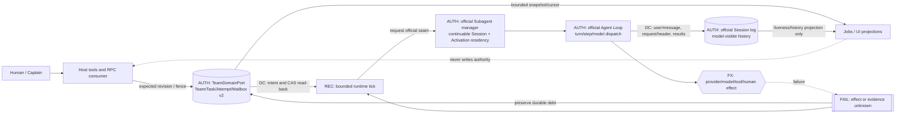

# Team runtime architecture blueprint v1

Status: **PROPOSED / UNVERIFIED**. This P0 slice is a design candidate only. It changes no runtime, source schema, public API, stable architecture authority, official DSH checkout, or reference checkout. The accepted authorities remain `docs/00-vision.md`, `docs/03-capability-family.md`, `docs/04-core-protocol.md`, `docs/11-official-first-development.md`, and the registered source pins.

Candidate base: repository commit `82c3ac97d1e741bf58ee884605f026c544a7d13f`. Official DSH `0.1.1-rc.2` / `b150a551b8d465e31e418e1b2eaf5e79bbb7d28e` passes. The Jiuwen reference is now reviewed and pinned at `9ac2fa5e7d60142146448bd1395ec2165292beaa`; the `2cc2048… → 9ac2fa5…` delta adds Agent template/plugin composition and runtime/upload/restart fixes without changing the Team CAS, mailbox, memory, worktree or attempt-recovery semantics consumed here. Gate A passes for the exact pin; implementation candidates still require their milestone-specific non-author acceptance.

```yaml
documentationImpact:
  affectedAuthorities:
    - core-protocol
    - capability-family
    - implementation-roadmap
    - fusion-audit
  disposition: follow-up
  rationale: This proposal changes no authority; an accepted implementation must update the registered authorities and migration contract in the same reviewed candidate.
```

## 1. Outcome and invariants

The first user-visible correction is narrow: `agent_swarm_add_member` durably declares a member but does not create an empty child turn. The first ready task starts that member with the exact assignment as its initial prompt. The larger target architecture makes that correction a coherent part of a durable Team runtime rather than a special-case patch.

The non-negotiable invariants are:

1. Official DSH owns Agent execution, Agent Loop, Session history, inbox activation, continuable-child lifecycle, provider routing, model invocation, tool execution, and model-visible replay.
2. `TeamDomainPort` owns one durable Team/Task/Attempt/Mailbox aggregate. Runtime status, UI, RPC, Jobs and prompts are projections or Consumers, never competing truth.
3. A task revision CAS and an attempt identity fence different races; both remain mandatory.
4. A model-visible assignment is acknowledged only after the exact target-side frame is durably present and claimed. Admission, wall-clock time, or a parent-side return is insufficient.
5. Every external effect is driven from a durable intent, is bounded, and is reconciled after a crash. Publish success only after the authoritative commit.
6. Adaptive scheduling and deterministic Workflow never own the same attempt.
7. No Team-specific Agent Loop, no second model loop, no transcript-derived Team state, no browser-owned truth, and no cross-Session timestamp total order.

## 2. Evidence boundary and reference fusion

### 2.1 DSH native boundary

The plugin composes existing DSH seams rather than replacing them:

| Concern | Authority / seam | Plugin responsibility |
|---|---|---|
| Model turn and Agent lifecycle | official Agent Loop and `ctx.agents` | Observe status and request bounded work; never fork or patch the loop. |
| Durable model history | Session + Session persistence | Build exact frames and prove target-side acceptance/claim; never mirror transcript truth into Team state. |
| Continuable child | `ctx.subagents.startContinuable`, `followup`, inbox, interrupt/drain | Supply a preallocated child ID, persona, tool filter, initial assignment, and later followups. |
| Long operation disclosure | `ctx.jobs` | Project finite scheduler/recovery operations and allow wait/cancel/observation. |
| Deterministic flow | `ctx.workflowEngine` | Optional orchestration owner; cannot race the adaptive scheduler. |
| Business durability | `ctx.storageDomain` through `TeamDomainPort` | Persist Team/Task/Attempt/Mailbox and lifecycle intent before effects. |
| Human interaction | official question/approval presentation plus the project HumanInteraction port | Correlate typed requests and receipts; route Team changes back through `TeamDomainPort`. |
| UI/RPC | Host producer and DSH Client Consumers | Emit bounded, versioned projections with cursors; never mutate by replaying UI state. |

This is deliberately **not** an Agent Loop redesign. An official continuable child owns one durable Session and at most one process-local **Activation**, where Activation means a residency epoch for a reconstructed child Agent — not a request, result, Task or model turn (`packages/subagent/subagent/README.md` §continuable lifecycle). The official Agent Loop still owns every turn/step and model dispatch. The Team runtime only decides which durable intent should be offered to those existing seams.

### 2.2 Jiuwen patterns worth retaining

The accepted project mapping in `docs/11-official-first-development.md` §5 and the clean local checkout at the registered pin are the evidence boundary for this proposal; the unreviewed remote delta supplies no architecture claim. The reusable product ideas are durable Team/Task/Attempt identity, dependency-aware ready work, claim/lease/fencing, queued-before-delivered mailbox, restart reconciliation, explicit human nodes, shared and personal memory, tiered capability policy, and long-lived run observability.

These are requirements to translate, not implementation to copy. The plugin must not import Jiuwen's Python runtime, persistence schema, Rails/ZMQ control plane, permission engine, public types, or its own agent loop. Any later upstream change requires a new Gate A review before it can change this mapping.

### 2.3 LoopX patterns worth retaining

No pinned LoopX source exists in this repository, so the following is a benchmark-derived design hypothesis, not source authority:

- an external **bounded tick** reads durable state, performs a finite number of transitions/effects, records progress, then returns;
- long-running work advances through repeated explicit wakeups rather than one immortal model turn;
- heartbeat is liveness/lease evidence with expiry, not proof of work or completion;
- interaction pauses are durable states, and an answer schedules a new bounded tick;
- retry and resume start from durable checkpoints and idempotency keys.

The project should reuse this control shape through `ctx.jobs`, event listeners and bounded timers. It must not copy a perpetual polling daemon, private queue, private Session runtime, or an unbounded recursive prompt loop. A future source-backed LoopX claim requires its own registered reference and Gate A review.

### 2.4 Explicit non-fusion list

Do not adopt or infer:

- `role`, persona text, member profile, or a standby report as work assignment;
- free-text report contents as lifecycle authority;
- cross-Session `time`/`sessionId` sorting as causality (DBG-059);
- a scheduler-local task ledger, UI-side mailbox, or transcript parser;
- an in-memory mutex described as distributed CAS/lease;
- heartbeat as task ownership, acceptance, or completion;
- a workflow engine and adaptive scheduler both assigning/retrying one attempt;
- prompt-only permissions, prompt-only filesystem isolation, or prompt-declared skills as authority;
- automatic legacy migration, dual write, runtime fallback, or old-binary rollback after cutover.

### 2.5 Reviewed-drift receipt and Gate A consumption

Gate A currently passes with official DSH `b150a55…` and the reviewed Jiuwen pin `9ac2fa5…`. Future remote movement reopens the same freshness review; prose cannot waive a failing gate. Architecture review consists of one non-self-referential canonical core plus two external attestations:

```ts
interface ReviewedDriftCoreV1 {
  schemaVersion: 1
  source: { repositoryUrl: string; ref: 'refs/heads/develop' }
  fromPin: { commit: string; tree: string }
  observedRemote: { commit: string; tree: string }
  mergeBase: string
  diffScope: Array<{ path: string; status: 'added' | 'modified' | 'deleted'; blobBefore?: string; blobAfter?: string }>
  diffDigest: string
  consumedClaimRegistryDigest: string
  consumedClaims: Array<{ claimId: string; path: string; locator: string; anchorBlob: string; impact: 'none' | 'confirm' | 'change' }>
  candidate: { commit: string; tree: string; documentDigest: string }
  disposition: 'retain' | 'repin'
  generatedAt: string
}

interface DriftOwnerAttestationV1 {
  schemaVersion: 1
  role: 'source-pin-owner'
  identityRef: string
  coreDigest: string
  candidate: { commit: string; tree: string; documentDigest: string }
  authentication: TrustedIdentityProof
  attestedAt: string
}

interface DriftReviewAttestationV1 {
  schemaVersion: 1
  role: 'non-author-reviewer'
  identityRef: string
  coreDigest: string
  candidate: { commit: string; tree: string; documentDigest: string }
  verdict: 'accept' | 'reject'
  authentication: TrustedIdentityProof
  attestedAt: string
}
```

Strict parsing first rejects unknown/missing fields, unknown enums, non-NFC strings, non-lowercase 40/64-hex object IDs or digests, duplicate paths/claims and non-canonical path separators. `diffScope` is sorted by normalized UTF-8 path bytes then status/blob tuple; `consumedClaims` is sorted by `claimId`, and must cover the complete project claim registry whose canonical digest is `consumedClaimRegistryDigest` — omission is failure, not “unaffected.” `diffDigest` is the same domain-separated SHA-256 construction over JCS(`diffScope`) with tag `dsh-agent-swarm/reviewed-drift/diff-scope/v1`; `consumedClaimRegistryDigest` uses tag `dsh-agent-swarm/reviewed-drift/claim-registry/v1` over JCS of the complete, canonically sorted registry. `candidate.documentDigest` is SHA-256 of the candidate document's exact UTF-8 bytes. The canonical core bytes are RFC 8785 JCS UTF-8. The non-self-referential identity is:

```text
coreDigest = SHA-256(
  UTF-8("dsh-agent-swarm/reviewed-drift/core/v1") || 0x00 || UTF-8(JCS(core))
)
```

`TrustedIdentityProof` is not a free-form name. `identityRef` must resolve through a trusted identity registry configured by the project binding, and `authentication` must verify either a registry-approved signature/key or an immutable repository-governance mapping bound to the same candidate and `coreDigest`. A signature proof signs the RFC 8785 JCS UTF-8 attestation payload, excluding only `authentication`, under the role-specific domain tag `dsh-agent-swarm/reviewed-drift/{owner|review}/attestation/v1`; the payload contains the exact `identityRef`, `coreDigest` and candidate tuple. If that capability is `NOT_CONFIGURED`, Gate A remains FAIL; agents cannot fill strings to simulate it.

The trusted Gate A verifier recomputes repository URL/ref, from commit/tree, remote commit/tree, merge-base, exact canonical path/status/blob scope, `diffDigest`, the complete claim registry/digest and every claim impact. It requires both attestations to bind the same `coreDigest` and identical candidate commit/tree/document digest, requires owner identity != reviewer identity, and requires `review.verdict === 'accept'`; forged/untrusted identity, same-author review, `reject`, reordered scope, omitted claim, candidate/diff/anchor/remote movement or any non-canonical encoding fails closed. Only then is the core disposition applied. `retain` keeps `SOURCE_POINTER` and the clean local checkout at `fromPin`; `repin` is a separate reviewed candidate that updates pointer/checkout and affected authorities. The receipt/attestations are immutable evidence, never a floating bypass or authority to fetch/write refs.

## 3. Current code anchors and gaps

| Area | Current anchor | Current behavior | Target gap |
|---|---|---|---|
| Member schema | `src/domain/types.ts:18-36` | `provisioning → active/failed/removed`; identity, subagent provider, resolved LLM provider/model/source, denied-tool snapshot and assigned-Skill intent persist. | Add durable `declared` and `starting`, persist resolved `maxDepth`, and add starting-attempt correlation. Do not add a generic capability snapshot. |
| Task/attempt | `src/domain/types.ts:52-115` | Task revision, owner, current attempt; attempt generation and `reserved/delivered` assignment checkpoint. | Bind first activation to the exact attempt and initial prompt checkpoint without creating a second task record. |
| Aggregate | `src/domain/types.ts:153-171` | Schema v1 Team owns roster, task DAG, attempts, mailbox, budget and shared memory. | Move the changed member/profile shape through an explicit v2 authority migration. |
| Roster transitions | `src/domain/team-domain-roster.ts:160-217` | `provisionMember` writes `provisioning`; `settleMember` activates after child start. | Replace new-write path with declare/reserve-start/settle-start CAS transitions; retain a legacy provisioning reconciler. |
| Durable schema | `src/storage/team-spec.ts:24-32,61-76,113-121`; `src/domain/state-validation.ts:46-68` | Zod boundary and structural validator admit only schema v1 fields; undeclared keys are stripped on load. | Declare every new optional/required field at both boundaries; no same-version silent extension. |
| Empty first turn | `src/runtime/member-provisioning.ts:60-180`; `src/runtime/prompts.ts:91-99` | `add_member` immediately calls `startContinuable(memberJoinNotice)` and waits for active settlement. | `add_member` ends after durable declaration; first task calls `startContinuable(assignmentPrompt)`. Delete the empty-wait path only after migration acceptance. |
| Provisioning recovery | `src/runtime/member-provisioning.ts:188-245` | Reconciles child parent/provider/accepted initial join prompt. | Reconcile exact attempt, child descriptor and exact initial assignment visibility/claim. |
| Scheduler | `src/runtime/scheduling.ts:88-182` | Mailbox, reserved debt, stranded heal, then new work for active members only. | Include eligible declared members; atomically seat task+attempt+starting before the child effect. |
| Assignment delivery | `src/runtime/scheduling.ts:196-311` | Active member gets `followup`; claimed frame then `acknowledgeAssignment`. | Split initial-start dispatch from unchanged followup dispatch, sharing the exact frame visibility fold. |
| Runtime trigger | `src/runtime/orchestrator-runtime.ts:263-287,496-531` | Add blocks on start; task creation and idle edges serialize scheduling in process. | Add returns declared; recovery/tick resumes starting debt; distributed safety remains NOT_CONFIGURED without a CAS/lease Provider. |
| Permissions/profile | `src/runtime/member-provisioning.ts:73-190`; `src/runtime/tool-policy.ts`; `src/tools/team-lifecycle.ts:41-99` | Provider/model/depth/tool filter are resolved before immediate creation. Skill names are validated through the official Skill Registry `list`, then persisted as assignment intent and rendered into persona guidance; this is not proof that a Skill was loaded. The child descriptor remains the applied creation-policy authority. | Delayed start reproduces persisted provider/LLM model/`maxDepth`/deny/Skill intent and derives one fixed required-capability predicate from them; start revalidates that predicate exactly. Real Skill loading still requires target-side evidence. |
| DAG | `src/domain/graph.ts:9-55`; `src/domain/team-domain-board.ts:110-224` | Dependency validation/readiness plus atomic claim. | Keep; extend claim transaction to member-start reservation. |
| Mailbox | `src/domain/team-domain-mailbox.ts`; `src/runtime/message-delivery.ts` | Durable queue, exact frame, target-side acceptance and acknowledgement. | Reuse its checkpoint discipline; declared targets queue messages but a message cannot impersonate a task claim. |
| Memory | `src/domain/types.ts:143-151`; `src/domain/team-domain-projection.ts:26-52` | Bounded manual Team memory only. | Separate shared accepted Team memory from personal memory/Session context; add provenance and proposal/approval flow. |
| Human | `src/human/human-interaction-contract.ts`; `src/human/captain-liaison.ts` | Typed correlation overlay; Team mutation remains canonical. | Integrate pause/resume with task/attempt fences and bounded ticks, without copying Team truth. |
| UI/Jobs | `src/runtime/jobs/team-job-projection.ts`; roadmap I2-I4 | Projection families exist or are planned. | Add member lifecycle/runtime debt/cursor fields as bounded projections, never authority. |

## 4. Target aggregate and state machines

### 4.1 Durable member declaration

The v2 member record should carry immutable creation identity and the data required to reproduce the official child creation request:

```ts
type MemberPhase = 'declared' | 'starting' | 'active' | 'failed' | 'removed'

interface TeamMemberV2 {
  name: string
  role: string
  sessionId: string          // preallocated once at declaration
  provider: string           // continuable subagent Provider
  llmProvider?: string
  model?: string
  modelSource?: 'explicit' | 'member-default' | 'captain-inherited' | 'unresolved'
  deniedTools: string[]      // exact deny-only creation snapshot
  assignedSkills: string[]   // validated assignment intent; not a loaded-Skill claim
  maxDepth: number           // frozen creation-time delegation cap
  phase: MemberPhase
  startingAttemptId?: AttemptId
  initialPromptDigest?: string
  initialMessageSeq?: number
  createdAt: number
  activatedAt?: number
  error?: string
}
```

`role` remains fenced participant data, never an assignment. The creation fields are immutable for that Session identity. A provider/model/policy/Skill-intent change requires a new member/session identity; it cannot silently alter an existing continuable child.

Current code already checks each requested Skill name against the official Skill Registry, persists `assignedSkills`, and tells the member through persona guidance to load assigned Skills through the official Skill tool when relevant (`src/runtime/member-provisioning.ts:108-125,159-190`; `src/runtime/prompts.ts:83-91`). Those facts prove validation plus durable intent, not target-side loading or capability binding. The target architecture preserves that distinction: UI/RPC reports `assigned`, and may report `loaded` only from a future official target-side receipt or other accepted evidence; persona text alone never grants Skill authority.

### 4.2 First assignment transition

```text
add_member
  └─ durable member(declared, preallocated sessionId/profile)
       └─ scheduler sees ready task + declared member
            └─ one Team transaction:
                 task pending -> in_progress
                 fresh attempt(running, assignment=reserved)
                 member declared -> starting(startingAttemptId=attempt.id)
                 [CAS: task.revision + member.phase + no open owner]
                  └─ acquire exact execution root (if enabled)
                  └─ startContinuable(childId, initial assignmentPrompt,
                                      persona, provider/model/toolFilter/depth)
                       ├─ no published child -> retry start under the SAME tuple
                       ├─ matching child + frame absent -> followup the SAME exact frame
                       ├─ target frame pending -> leave starting/reserved; reconcile later
                       └─ target frame claimed -> pre-model causal gate + one Team transaction:
                            member starting -> active
                            attempt assignment reserved -> delivered
                            initialMessageSeq/activatedAt/assignmentDeliveredAt checkpoint
                             └─ subsequent assignments use existing followup path
```

The reserve and settle operations must be domain methods, not an orchestration sequence of unrelated writes. Proposed port vocabulary:

- `declareMember(...)`
- `reserveInitialAssignment(teamId, captainId, taskId, expectedRevision, memberSessionId)`
- `settleInitialAssignment(teamId, taskId, attemptId, memberSessionId, checkpoint)`
- `failInitialAssignment(teamId, taskId, attemptId, memberSessionId, diagnostic)`

Each terminal method checks the full tuple `teamId + taskId + task.currentAttemptId + attemptId + member.sessionId + member.startingAttemptId + member.phase`. A stale tuple is a structured no-op/error; it never mutates a successor.

`startingAttemptId` is retained as the recovery index and must satisfy a bidirectional invariant inside every Team transaction: a member is `starting` iff it carries exactly one `startingAttemptId`; that id is the `currentAttemptId` of exactly one `in_progress` task; the referenced attempt is `running/reserved` and names the same member Session; and no other member references it. `active/declared/failed/removed` members carry no `startingAttemptId`. Successful settlement atomically clears the member field while changing that exact attempt to `delivered`; terminal failure atomically marks the member `failed`, cancels the attempt and requeues the task. There is no observable half-state and no second activation table.

### 4.3 Pre-model causal gate

Target-side history must not race Team settlement. Register an agent-scoped listener on the official `agent/request` waterfall (or an upstream-equivalent pre-dispatch seam with the same ordering). Official `packages/core/agent-loop/src/agent.ts:282-287` appends the messages claimed for the step as durable `user/message` events before request construction, and `:457-460` awaits the waterfall before provider/model preparation and dispatch. For the exact initial-assignment frame of a mapped member, the listener handles either still-`starting` debt or an already-idempotently-settled `active/delivered` checkpoint:

1. read the exact Team/member/task/attempt tuple and reconstruct the frozen assignment frame/digest;
2. locate the exact just-claimed `user/message` in that Session and require it to match `startingAttemptId` and `initialPromptDigest` — unrelated requests delegate immediately;
3. await `ctx.sessions.flush(child.session)` so the claimed user/message and its sequence are durable;
4. when still `starting`, call idempotent `settleInitialAssignment(...)`; when another recovery caller already settled, skip the write; in both cases read back the same fence and require member `active`, no `startingAttemptId`, attempt `running/delivered`, and the exact `initialMessageSeq`/prompt digest;
5. only after that read-back call `next()` so the official Agent Loop may issue the model request.

If flush, evidence classification, settle response or read-back fails or is `unknown`, the listener does **not** call `next()`: it throws a structured, secret-free activation-debt error and rejects that model request before dispatch. The authoritative post-state is then explicitly **unknown**: a failure before the settle write is proven leaves `starting/reserved`, but a lost response/read-back may mean the write already committed `active/delivered`. Recovery performs exact read-back only. Exact `starting/reserved` may invoke the idempotent settle; exact `active/delivered` is preserved and may queue the once-only resume below; any mismatch/unknown remains blocked. It never writes again, rolls back or resends merely because the caller saw an error. Scheduler and recovery ticks are only concurrent callers; `TeamDomainPort` remains the unique writer and the exact tuple CAS/read-back makes one result authoritative.

If recovery later proves the exact initial user/message was claimed but its model request was blocked, it queues one durable once-only `activation-resume` wake through the v2 Team effect ledger, keyed by `attemptId + initialMessageSeq`; the existing mailbox delivers a trusted system frame that tells the child to continue the already-recorded assignment. Target-side acceptance/claim is reconciled like other exact Team mail. It never resends the assignment, and a crash cannot enqueue a second wake. Without the v2 once-only ledger, recovery stays blocked rather than issuing an opaque wake.

### 4.4 Runtime status is a projection

Durable member `phase` describes Team lifecycle. Runtime status is derived from official live/persisted Session evidence:

```text
unstarted | starting | running | idle | cold | interrupted | unavailable | unknown
```

Do not store live `running/idle` in the Team aggregate. Persist only lifecycle intents/checkpoints needed for recovery. UI and status RPC may join durable phase with current `ctx.agents`/Session projection and must label unknown evidence honestly.

## 5. Scheduler, DAG, permission and profile rules

One bounded scheduler tick performs, in order:

1. read one authoritative Team snapshot and tick cursor;
2. stop on archived/closing state or an unowned orchestration mode;
3. reconcile starting members and reserved assignment debt;
4. deliver pre-existing queued mailbox debt according to its exact-message rules;
5. derive DAG-ready tasks (`blockedBy` all accepted/completed), budget admission, ownership and member availability;
6. ask the selected scheduler Provider for a finite set of non-overlapping decisions;
7. commit each decision through revision/member-phase CAS;
8. perform bounded official effects; checkpoint or leave explicit debt;
9. publish a Jobs/change projection and return.

Every tick has fixed configuration ceilings for wall time, selected decisions, external effects and recovery records, plus an abort signal. One process keeps at most one running tick and one coalesced `rerunRequested` latch per Team; `(teamId, observedRevision, orchestrationOwner, reasonClass)` deduplicates admissions. A tick that commits no transition, acknowledges no debt and observes no newer revision records bounded `no_progress` Jobs evidence, clears its latch and schedules **no self-wake**. Only a new authoritative revision/event, an explicit human/control result, a lease deadline owned by an external timer, or an official Agent status edge may request another tick. There is no `setInterval` polling loop or recursive tick.

Ticks are serialized per Team in the current process, but that is not distributed exclusion. A multi-host milestone requires store-side atomic CAS plus lease/fencing token. On lease uncertainty or partition, stop new work; target-side accepted frames may only be reconciled, never duplicated.

Provider/model/permissions and requested Skill names are resolved and validated before declaration commits. `deny_tools` has two distinct gates: plugin-side structural pre-validation/deduplication/mandatory captain-only union occurs before the roster commit; exact tool-name existence remains the official creation-window `tools.restrict()` check during child composition. A name that becomes unavailable after declaration leaves visible starting debt or terminal failure under the exact attempt; it never starts an unfiltered child.

The member persists the resolved subagent provider, LLM provider/model/source, `maxDepth`, exact deny list and assigned-Skill intent — no open-ended “capability snapshot.” A fixed code-owned predicate is derived from those fields: the named provider exists and supports continuable start + `depthLimit` + persona + tool filter; the exact LLM route still resolves; the Skill Registry exists and still contains every assigned name; and structural denial remains valid. Declaration checks it before commit and start checks it again immediately before `startContinuable`; creation-window `tools.restrict()` then owns exact tool-name existence. Any failure blocks/terminalizes the same fenced start according to §9, without fallback or silently dropped policy. Skill assignment still does not mean loaded: only official target-side loading evidence may promote that projection. Credentials and capabilities cannot be granted by role/task/persona text.

Messages to a `declared` member remain queued. A normal peer message does not create an unfenced work turn before the first task. If product requirements later need message-only members, define a separate typed activation intent with its own durable identity and tests; do not reinterpret arbitrary message text as a task.

## 6. Memory model

Three stores must remain distinct:

| Memory kind | Authority | Admission |
|---|---|---|
| Session context | official Session history/compaction | Native model-visible messages and summaries; never copied as canonical Team truth. |
| Team shared memory | Team/storage memory family | Only bounded entries with provenance; automated entries originate from accepted task/review evidence through proposal → deterministic validation → approval → write. |
| Personal durable memory | a separate typed personal-memory Provider keyed by member/person principal | Private or selectively shared records with retention, provenance, redaction and explicit sharing; absent until provider and policy are accepted. |

The existing manual Team memory remains a v1 capability. This blueprint does not silently promote arbitrary worker output, child reports, heartbeats or UI text into memory. Personal memory cannot live in `TeamMember.role`, persona, browser local storage, or a second transcript index. Team archival defines retention/export policy; it does not silently erase personal memory owned by another domain.

## 7. Human interaction and long-running continuation

A worker question becomes a durable, typed interaction request correlated to `teamId/taskId/attemptId/memberSessionId` and an idempotent request ID. The Team attempt enters a derived/persisted wait condition only through its accepted domain contract; the official HumanInteraction producer presents it. The answer commits a receipt first, then schedules a bounded tick/followup using the same attempt fence. If the presentation or another opaque external effect exposes no authoritative operation identity/read-back, a crash after invocation remains `outcome-unknown`/blocked; neither transcript text, UI state nor retry converts it to answered/applied.

Heartbeat means “the owner renewed liveness for lease generation N at cursor C.” It does not mean progress, result, correctness or acceptance. Missing heartbeats expire only a lease/admission right; task reassignment still creates a fresh attempt and rejects late old updates.

Long work therefore follows:

```text
bounded turn -> durable checkpoint or question -> idle/wait
  -> explicit event/message/answer/timer wakeup -> bounded tick
  -> same fenced attempt or fresh retry attempt -> bounded turn
```

`ctx.jobs` exposes this run and its current wait reason, next eligible wake, cancel request and last durable checkpoint. Cancellation changes admission first, then interrupts/drains official children, then records the outcome; it never deletes evidence before the effect settles.

## 8. Whole-Team completion

Whole-Team completion is a derived snapshot predicate, not a worker report and not a heartbeat:

- every required task is terminal and accepted/completed under the configured review gate;
- no task is pending/ready/in_progress/submitted/verifying and no current attempt has delivery/review debt;
- no member is `starting` or legacy `provisioning`;
- no queued wakeup mailbox item, unresolved required HumanInteraction, workflow-owned step, budget/retry recovery action, or admitted scheduler/effect operation remains;
- no official child turn is running for a Team-owned attempt; unknown liveness makes completion pending;
- declared members with no assigned task and no typed activation intent are quiescent and do not block completion;
- failed/removed members do not block unless they leave an unresolved task/message/interaction obligation.

Completion evaluation is a pure derived predicate over one read-back snapshot; the domain never writes a synthetic `complete` transition. Only the runtime owner may publish the cursor/revision-bound completion projection after it verifies official liveness and all external-debt faces. UI/RPC merely consume it. Archive remains a separate captain-authorized transition; completion does not auto-delete Sessions, Team state, memory or evidence.

## 9. Crash windows, recovery and idempotency

| Observation for exact `startingAttemptId` | Required decision | Execution-root owner / release | Durable debt and forbidden action |
|---|---|---|---|
| No child exists in live enumeration **and** Session persistence proves the preallocated id absent | Re-run `startContinuable` with the same child id, provider/profile, exact assignment frame and same Team/member/task/attempt tuple. Provider pre-publication failure must quiesce before another bounded retry. | The exact attempt owns its acquired/reattached root; retain it across retry. If root acquisition itself is retryable, keep the same tuple and bounded debt. | `starting/reserved/start-needed`; do not allocate a new attempt, return the member to `declared`, or mint a new Session id. |
| Matching continuable child and exact frame is `absent` | Freeze the minimum safe repair: deliver the **same byte-identical frame** once through official `followup`, using the existing attempt/digest as identity; then let the pre-model gate classify/settle. | Same attempt retains the same root. | `starting/reserved/frame-delivery-needed`; never call `startContinuable` again and never create a second assignment identity. |
| Matching child and frame is `pending` (accepted in inbox but not claimed) | Do nothing except observe a later official status/request edge. | Same attempt retains root. | `starting/reserved/frame-pending`; no resend, acknowledgement, activation or self-wake polling. |
| Matching child and frame is `claimed` | Flush the exact target Session, idempotently settle `active + delivered`, read back, then allow the pre-model gate to call `next()` or schedule the one resume wake if the original request was already blocked. | Ownership transfers from activation debt to the now-delivered running attempt; root remains until ordinary attempt terminal/review release. | Settlement/read-back debt only; never roll back accepted work. |
| Exact descriptor/parent/provider/profile conflicts | Quarantine and drain only the precisely identified mismatched child. After confirmed drain, `failInitialAssignment` atomically makes member `failed`, attempt `cancelled`, task `pending`; a replacement member needs a fresh name/session identity. | Retain root while drain is unresolved; release only after terminal Team read-back, preserving residue evidence on cleanup failure. | `activation-mismatch` or `drain-unknown`; never return to `declared` and never reuse that Session id. |
| Child/session/frame evidence is unavailable, ambiguous or corrupt | Fail closed and block. Do not drain an unproven target and do not retry any effect. | Attempt retains/quarantines root as recovery evidence. | `activation-evidence-unknown`; never return to `declared`, reuse the Session id, resend, or publish pass/completion. |
| Pre-model flush/settle response/read-back fails | Reject that exact model request before dispatch; classify authoritative post-state only by exact read-back. If `starting/reserved`, settle idempotently; if exact `active/delivered`, preserve it and use once-only resume; otherwise block. | Attempt retains root under either nonterminal classification. | `pre-model-post-state-unknown`; never infer unchanged state, write/rollback again or resend from a caller error. |
| `active/delivered` commit exists but caller response was lost | Read back and return/project the same result. | Ordinary running attempt owns root. | No debt; no second child/start/settle. |
| Later active-member followup is reserved | Keep the existing path: pending is not resent, claimed acknowledges, proven absent redelivers once. | Ordinary attempt root rules apply. | This does not enter member `starting` again. |
| Human/external effect lacks authoritative read-back | Keep the typed interaction/effect `outcome-unknown`. | Unrelated attempt root follows its own state; no inference from it. | Block retry/completion until an official read-back seam or an authorized forward decision exists. |

The recovery owner evaluates at most one bounded classification/effect step per record per tick. Every destructive branch requires exact child identity and terminal read-back. There is no generic “rollback to declared”: after `starting` commits, retry stays on the same tuple or terminalizes/quarantines that member identity.

Recovery uses per-authority monotonic cursors and exact identities. Different Sessions provide a partial order only through explicit edges such as parent/child identity, Team transaction revision, task/attempt tuple, mailbox message ID and delivered checkpoint, or interaction request/receipt ID. Equal timestamps and lexical Session IDs establish no causal edge.

## 10. Storage schema and migration

This architecture is not a safe additive v1 field patch. The official storage-domain load path strips undeclared Zod keys, current validation requires `schemaVersion: 1`, and ADR-0009 already records that a same-version layout change is undefined. Lazy activation therefore merges into ADR-0009's single `agent_swarm_v2` authority and effect-ledger design; it does not create an intermediate domain, side activation table or competing migration.

Delivery deliberately separates **fresh/empty v2** from **user-media cutover** so the real lazy vertical can run before destructive migration authority exists:

1. define strict v2 schemas, the bidirectional starting-attempt invariants and a pure deterministic `v1 record -> v2 record` transformer with canonical digest vectors; no runtime writes and no user media;
2. in an isolated fresh Profile with empty v2 media, create/read back the ADR-0009 fresh-v2 authority record, then run the real declared→initial-assignment→pre-model-gate→active/delivered vertical over official Session persistence and Storage Domain;
3. keep existing v1 installations on the unchanged v1 artifact. User-media migration/cutover remains **BLOCKED** until either a host-owned pre-plugin compatibility registry or a Storage Provider durable retirement fence is accepted, exactly as ADR-0009 §2 requires;
4. only the separately authorized cutover controller may run the migration rules below. A real old artifact is the mandatory negative fixture: after epoch-2 selection it must fail before plugin module admission/v1 domain open or write, while the exact accepted v2 artifact succeeds and the owner reads the decision back.

User-media cutover rules:

1. stop admission and drain v1 provisioning/scheduling/delivery/usage/workflow/human writers;
2. read back a durable drain receipt;
3. open v1 only through a process-internal non-writing migration adapter;
4. transform each aggregate into v2 and write to an empty v2 destination;
5. validate strict schema, all identities/fences, and durable read-back before a receipt;
6. switch to exactly one v2 writer; retain v1 as read-only recovery evidence;
7. publish/read back the epoch-2 cutover record and external compatibility/retirement fence before ordinary v2 activation;
8. never dual-write, runtime-fallback, auto-migrate, or let an old binary reopen/write retired v1.

Legacy member mapping:

- `active` → v2 `active`; import the strictly parsed v1 `llmProvider/model/modelSource/deniedTools/assignedSkills` intent and reconcile the authoritative applied creation policy against the official durable child descriptor;
- `failed`/`removed` → same terminal phase and immutable name occupation;
- `provisioning` must first run the existing exact-child reconciliation while v1 is still the writer. A verified child becomes `active`; a verified absence/mismatch becomes `failed`. It must not be blindly relabelled `declared` because an accepted initial join prompt or orphan child may exist;
- no legacy member can infer missing `maxDepth`, loaded-Skill status or any policy from free text. Persisted v1 model/tool/Skill-intent fields may be imported, but an applied-policy or loaded-Skill claim still requires descriptor/target-side evidence; otherwise migration remains blocked or the projection stays `unknown`/`assigned`.

Rollback before cutover discards the empty/incomplete v2 candidate and resumes the unchanged v1 writer after read-back. After cutover, rollback is a new forward migration/corrective release; it is not old-binary restart against v2. Fresh-v2 acceptance proves the new behavior but grants no authority to migrate user media.

## 11. UI and RPC projection

Host RPC returns a versioned bounded snapshot and delta cursor containing:

- Team revision/phase and whole-Team completion blockers;
- member durable phase plus separately labelled runtime status/evidence age;
- task revision/status/readiness/owner/current attempt and assignment checkpoint;
- queued/delivered message counts and exact IDs only where authorized;
- interaction wait reason, Job/run status, budget/lease/heartbeat age and recovery debt;
- capability availability (`configured`, `not_configured`, `degraded`, `unknown`) for provider, skills, personal memory and distributed fencing.

RPC commands carry expected revision/fence/idempotency key and call the same Host service/`TeamDomainPort`; they never mutate projection caches. Client reconnect requests a fresh snapshot then deltas from a cursor. A cursor gap triggers refetch, not event reordering. Browser clocks, row order, optimistic state and transcript parsing never determine authority or completion.

## 12. Minimal implementation slices and risk

### 12.1 Domain/store minimum

- `src/domain/types.ts`: v2 member/profile/start-fence shapes; retain task revision and attempt generation.
- `src/domain/team-domain-port.ts`, `src/domain/team-domain.ts`, `src/domain/team-domain-roster.ts`, `src/domain/team-domain-board.ts`: declare/reserve/settle/fail first-assignment transactions and bidirectional starting-attempt validation.
- `src/domain/state-validation.ts`, `src/storage/team-spec.ts`, `src/storage/team-store.ts`: strict v2 schema and explicit v1 read-only migration boundary.
- ADR-0009 migration/controller surfaces: fresh-v2 authority record, pure transformer, reviewed receipts, later cutover fence; no parallel authority.

Risk: member and attempt live in one aggregate today, which is favorable for atomicity; introducing a separate activation table would create a cross-domain transaction and is rejected unless the storage Provider supplies atomic multi-record commit.

### 12.2 Runtime minimum

- `src/runtime/member-provisioning.ts`: become declaration/profile validation plus initial-start reconciler; remove `memberJoinNotice` only after compatible migration.
- `src/runtime/scheduling.ts`: include declared members, route first assignment to `startContinuable`, keep active-member `followup` unchanged, reuse frame visibility.
- `src/runtime/orchestrator-runtime.ts`: add returns after declaration; task creation/recovery/events request bounded ticks; disposal drains starting effects.
- agent-scoped runtime listener: gate exact starting assignment in official `agent/request`, flush claimed Session input, settle/read back, and call `next()` only on success.
- `src/runtime/prompts.ts`: reuse exact `assignmentPrompt` as the first user message; persona remains identity data.
- `src/runtime/frame-visibility.ts`, `src/runtime/session-acceptance.ts`: share exact initial/followup target-side checkpoint logic.
- `src/runtime/execution-roots.ts`, usage accounting and Jobs projection: bind acquisition/accounting/run disclosure to the initial attempt without inventing another owner.

Risks: delayed-start profile durability, official child-ID collision semantics, target claim observability, usage attribution before active membership, remove/archive of declared/starting members, and disposal during start all require fault tests. Process-local serialization must not be marketed as distributed safety.

### 12.3 API/projection minimum

- `src/tools/team-lifecycle.ts`: preserve input names where possible; output `phase: declared` and document asynchronous activation. This is observable compatibility change and needs versioned snapshots/docs.
- read/status/list projections: expose durable vs runtime state and activation debt without unbounded arrays.
- workflow bridge: declare members/tasks in an order that lets the selected orchestration owner drive the first assignment; no duplicate scheduler ownership.
- HumanInteraction/UI/RPC: join by stable IDs only; no copied task/member authority.

Risk: callers currently assume add-member returns `active`. A compatibility period may offer an explicit bounded `wait_until_active` read operation, but `add_member` itself must not recreate the empty turn by blocking until a future task exists.

## 13. Required architecture diagrams

Legend used in every diagram: `AUTH` is an authority owner, `DC` is a durable commit/read-back boundary, `FX` is an external effect, `FAIL` is a failure/unknown edge, and `REC` is its recovery owner/edge.

### D1 — authority and container boundary



The Team runtime is a coordinator/Consumer outside the Agent Loop. It does not own Activation residency, inbox order, model dispatch or Session history, and UI/RPC/Jobs do not own Team state.

### D2 — normal first-task activation and pre-model causal gate

```mermaid
sequenceDiagram
  participant D as AUTH TeamDomainPort
  participant K as Runtime scheduler tick
  participant X as Execution-root Provider
  participant C as FX official Subagent manager
  participant L as AUTH official Agent Loop
  participant S as AUTH Session persistence
  participant M as FX model Provider

  K->>D: reserveInitialAssignment(expected revision, member session)
  D-->>K: DC read-back: member=starting, attempt=running/reserved, promptDigest
  K->>X: FX acquire(root, exact attemptId)
  X-->>K: root owned by attemptId
  K->>C: FX startContinuable(same childId, exact assignmentPrompt/profile)
  C->>L: publish/reside child and admit initial prompt
  L->>S: DC append claimed user/message
  L->>K: official agent/request waterfall before model dispatch
  K->>S: flush exact child Session through initialMessageSeq
  S-->>K: DC flush success
  K->>D: settleInitialAssignment(exact tuple, seq, digest)
  D-->>K: DC read-back: member=active, attempt=delivered
  K-->>L: next()
  L->>M: FX model request
  Note over D,M: FAIL before next(): reject model dispatch; post-state may be starting/reserved OR active/delivered. REC exact-readbacks only; no blind rewrite/rollback/resend
```

### D3 — first-start failure classification and recovery

```mermaid
sequenceDiagram
  participant R as REC bounded recovery tick
  participant D as AUTH TeamDomainPort
  participant P as AUTH Session/Subagent persistence
  participant X as Execution-root owner
  participant C as FX Subagent manager

  R->>D: read exact startingAttempt tuple
  D-->>R: DC starting + running/reserved + root identity
  R->>P: inspect exact child descriptor and frame visibility
  alt no child proven
    R->>X: retain/reattach same attempt root
    R->>C: FX retry startContinuable with same tuple/frame/childId
  else matching child and frame absent
    R->>X: retain same attempt root
    R->>C: FX followup same byte-identical frame once
  else frame pending
    R-->>D: keep DC debt; no resend and no self-wake
  else frame claimed
    R->>P: DC flush claimed message
    R->>D: idempotent settle active + delivered
    D-->>R: DC exact read-back; normal attempt owns root
  else descriptor mismatch
    R->>C: FX drain exact mismatched child
    alt drain confirmed
      R->>D: DC member failed + attempt cancelled + task pending
      R->>X: release root after terminal read-back
    else drain failed or unknown
      R-->>D: DC activation-mismatch/drain-unknown remains blocked
      R-->>X: quarantine/retain root evidence
    end
  else evidence ambiguous or corrupt
    R-->>D: DC activation-evidence-unknown remains blocked
    R-->>X: quarantine/retain root evidence
  end
  Note over R,C: FAIL/unknown never returns member to declared, reuses the Session id for a fresh identity, or guesses from clocks/text
```

### D4 — bounded tick, workflow, heartbeat and completion ownership

```mermaid
stateDiagram-v2
  state "AUTH runtime adaptive owner" as AdaptiveOwned
  state "AUTH workflow run owner" as WorkflowOwned
  state "DC durable progress" as DurableProgress
  state "DC heartbeat lease live" as LeaseLive
  state "runtime-only completion projection" as CompletionPublished
  state "FAIL external effect/evidence unknown" as FailureUnknown
  [*] --> Quiescent
  Quiescent --> TickAdmitted: authoritative revision/event or explicit wake
  TickAdmitted --> AdaptiveOwned: AUTH orchestration owner = adaptive
  TickAdmitted --> WorkflowOwned: AUTH orchestration owner = workflow
  AdaptiveOwned --> DurableProgress: DC finite CAS/effect checkpoint within bounds
  WorkflowOwned --> DurableProgress: DC workflow step owns exact attempt
  DurableProgress --> Quiescent: bounded tick returns
  AdaptiveOwned --> NoProgress: no commit/ack/new revision
  WorkflowOwned --> NoProgress: no commit/ack/new revision
  NoProgress --> Quiescent: clear latch; no self-wake
  DurableProgress --> WaitingHuman: DC typed interaction request
  WaitingHuman --> TickAdmitted: DC authoritative answer/read-back
  DurableProgress --> LeaseLive: DC heartbeat renews lease generation only
  LeaseLive --> TickAdmitted: external expiry timer event
  Quiescent --> CompletionCheck: runtime reads exact Team + official liveness
  CompletionCheck --> CompletionPublished: runtime-only cursor/revision projection
  CompletionCheck --> Quiescent: blocker or unknown remains
  AdaptiveOwned --> FailureUnknown: FAIL external effect/evidence
  WorkflowOwned --> FailureUnknown: FAIL external effect/evidence
  FailureUnknown --> Quiescent: REC preserve debt/blocked state
```

Adaptive and Workflow ownership are mutually exclusive for an attempt. Heartbeat owns lease liveness only. The domain supplies facts; runtime alone publishes completion; UI/Jobs only project it.

### D5 — v1 to v2 cutover and old-binary fence

```mermaid
sequenceDiagram
  participant O as AUTH host cutover owner
  participant G as AUTH pre-plugin registry or retired-medium fence
  participant V1 as AUTH retired v1 medium
  participant V2 as AUTH new v2 medium
  participant N as Accepted v2 artifact
  participant B as FAIL old v1 artifact

  O->>G: DC CAS epoch1 -> migration-in-progress; read back
  G-->>B: deny before plugin load / v1 open
  O->>V1: stop admission, drain/close writers, DC drain receipt
  O->>V1: open frozen non-writing adapter and read source
  O->>V2: DC pure transform write + exact read-back + receipts
  O->>V2: DC epoch2 cutover record
  O->>G: DC CAS migration-in-progress -> epoch2; read back
  G-->>B: negative fixture: old artifact denied before v1 mutation
  G-->>N: exact artifact/epoch digest admitted
  N->>V2: open sole writable authority
  Note over O,N: FAIL at any pre-cutover point preserves v1 and blocks admission; FAIL after cutover requires forward repair, never old-binary fallback
```

### Diagram coverage table

| Diagram ID | State / authority covered | Source anchors | Required fault tests | Milestone |
|---|---|---|---|---|
| D1 | DSH Session/Agent Loop/Subagent versus TeamDomain and UI/RPC containers | `docs/11-official-first-development.md` §4; official `docs/architecture.md:76-84`; `src/domain/types.ts:153-171` | shadow Team authority, transcript/UI write attempt, missing official seam, effect unknown | A0, A1b |
| D2 | `declared → starting/reserved → active/delivered`, pre-model causal gate | `src/runtime/member-provisioning.ts:159-190`; `src/runtime/scheduling.ts:196-311`; official `packages/core/agent-loop/src/agent.ts:282-287,457-460`; `src/runtime/frame-visibility.ts:49-110` | flush failure, settle/read-back failure, concurrent settle, model-dispatch-before-settle sentinel | A1b |
| D3 | no-child/absent/pending/claimed/mismatch/unknown recovery and root ownership | `src/runtime/member-provisioning.ts:188-245`; `src/runtime/frame-visibility.ts`; `src/runtime/execution-roots.ts`; official Subagent Provider publication contract | every decision branch, child-id collision, drain failure, root release/quarantine, no resend/redeclare/reuse | A1b, A2 |
| D4 | bounded adaptive/Workflow tick, human wait, heartbeat lease, runtime completion | `src/runtime/scheduling.ts:88-182`; `src/runtime/orchestrator-runtime.ts:496-531`; `src/runtime/jobs/team-job-projection.ts`; `src/human/human-interaction-contract.ts` | tick/effect/time bounds, dedupe latch, no-progress no-selfwake, dual owner, expired lease, opaque human unknown, false completion | A2, A3, A4 |
| D5 | ADR-0009 single v2 authority, user-media cutover, old binary exclusion | `docs/adr/0009-i1b-v2-effect-ledger-authority.md` §§1-2; `src/storage/team-spec.ts`; `src/storage/team-store.ts` | partial migration/receipt, changed source, registry/fence restart, real old artifact denied before open/write, no fallback | A1a, A5 |

## 14. Test matrix

| Layer | Required positive evidence | Required negative/fault evidence |
|---|---|---|
| Gate A drift | canonical `ReviewedDriftCoreV1` plus trusted owner/reviewer attestations validate exact from-pin/remote tree/diff/complete claim registry and accepted retain/repin disposition | forged/untrusted identity, same author, review `reject`, reordered scope, claim omission, remote/candidate/diff/claim movement, unknown fields or non-canonical bytes fail closed; receipt cannot write refs |
| Pure domain | declaration; atomic starting+claim; atomic active+delivered; later followup attempt | stale task revision, wrong member phase, wrong attempt, double settle, double fail, broken bidirectional start invariant, DAG/budget/member-busy races |
| Schema/migration | strict fresh-v2 authority, pure deterministic v1→v2 vectors, isolated fresh Profile reopen, active/terminal mapping | undeclared-key stripping, provisioning ambiguity, occupied destination, partial receipt, dual writer; user-media path remains blocked without external fence |
| Provider contract | exact preallocated child ID/profile/persona/tool filter/assigned-Skill intent and initial assignment | missing provider/capability, model drift, unknown deny tool, unavailable Skill Registry/name, assigned-without-loaded-proof, child-ID collision |
| Prompt/session causal gate | exact assignment user/message is flushed and active/delivered read back before model dispatch; later assignment uses followup | every pre-next failure rejects model dispatch; committed-write/response-loss read-back preserves active/delivered + once-only resume; starting debt settles idempotently; no blind rewrite/rollback/resend; unrelated requests delegate |
| Crash recovery | every §9 decision branch over real Session persistence/child descriptors/Storage Domain and execution roots | absent/pending never duplicate; mismatch/unknown never redeclare/reuse; drain failure quarantines; claimed work never rolls back |
| Scheduler | bounded finite tick, priority/DAG/concurrency/budget, declared member activation, coalesced rerun latch | Workflow/adaptive dual owner, wall/effect/record bound, timer storm, no-progress selfwake, partition without lease, duplicate decision |
| Mailbox | queue while declared; exact delivery after active; dedupe/replay | arbitrary message cannot become task claim; queued/pending frame cannot publish delivered |
| Human/long run | question→receipt→resume, Job wait/cancel, heartbeat lease renewal | forged answer, expired attempt, heartbeat-as-completion, opaque effect without read-back remains unknown/blocked, cancel/delete race |
| Memory | accepted-evidence Team proposal; scoped personal memory Provider | raw output/report auto-write, cross-member leak, prompt/profile storage, missing provenance |
| Completion | runtime publishes revision-bound completion projection after exact domain/liveness read-back; declared-unused member is quiescent | domain/UI cannot publish completion; starting/reserved/queued/unknown blocks; worker report alone never completes |
| UI/RPC | snapshot/delta cursor and reconnect | cursor gap refetch, no wall-clock ordering, no UI/transcript mutation authority |
| Lifecycle | dispose/reload/HMR with zero duplicate listeners/timers/children | hung start/drain bounded and visible; no orphan is silently deleted |

Real acceptance must use an isolated Profile, official Loader composition, official Storage Domain and Session persistence, continuable provider, exact frozen artifact, fresh state root/port/Session/Team/member/task/attempt, and a non-author QA. Mock-only tests cannot accept model-visible delivery, recovery, RPC composition or whole-Team completion.

## 15. Milestones and real exit gates

### A0 — source drift and architecture admission

- Preserve the reviewed-drift receipt/verifier contract in §2.5; current Jiuwen pin `9ac2fa5…` is reviewed and Gate A passes. Any later upstream movement must be reviewed and repinned before production code resumes.
- Non-author architecture review accepts the DSH boundary, pre-model causal gate, recovery decisions, no-second-loop invariant, ADR-0009 merge and public compatibility decision.
- Update registered architecture/contract/roadmap/audit documents in one reviewed candidate; no source yet.

### A1 — fresh-v2 foundation and first runnable lazy vertical

- **A1a:** implement strict empty-v2 schema/authority record, starting-attempt invariants, pure v1→v2 transformer and canonical vectors. It does not touch user media or open a v1 writer.
- **A1b:** in a fresh isolated Profile, run the real `add_member → declared → first assignment start → pre-model gate → active/delivered → model work` vertical over official Loader, Session persistence and Storage Domain.
- Pass domain CAS, provider failure, Session flush, read-back, schema strip/reopen and no-blank-turn tests. This is the first runnable product slice; it does not wait for user-media migration.

### A2 — complete first-start recovery and bounded run control

- Accept every §9 recovery branch, execution-root retain/release/quarantine rule and same-tuple idempotency over real cold restart.
- Enforce tick wall/decision/effect/recovery bounds, deduped/coalesced wake admission and no-progress/no-selfwake.
- Real composition proves exact persona/tool/Skill-intent policy, usage attribution, removal/archive/disposal and no Session-id reuse after mismatch/unknown.

### A3 — workflow, heartbeat and long-running continuation

- Jobs projects bounded ticks and durable waits; real interrupt/resume, pending-frame, late-old-attempt, lease/heartbeat and long-duration soak tests pass.
- Adaptive and Workflow modes prove one orchestration owner per attempt.

### A4 — memory, human continuation and completion projections

- Accepted-evidence Team memory pipeline and, only if an official Provider is available, typed personal memory.
- Typed human pause/resume correlates exact attempt and survives restart; opaque effects without read-back remain outcome-unknown/blocked.
- Runtime-only whole-Team completion, privacy, provenance, retention, forged answer/result and cross-member leakage tests pass.

### A5 — user-media v1→v2 cutover and Host projections

- This milestone remains BLOCKED until the host pre-plugin registry or Storage Provider durable retirement fence in ADR-0009 §2 is independently accepted.
- A real old v1 artifact is denied before plugin load/v1 open/write after epoch-2 selection; the exact v2 artifact and cutover digest are admitted/read back.
- Run drain/backup/pure transform/receipt/cutover/forward-repair fault tests on disposable media before any authorized user-media migration. Versioned RPC snapshot/delta and native UI remain projections.

### A6 — distributed Provider (separate capability milestone)

- Only a backend with atomic claims, leases and fencing may enable multi-host scheduling.
- Partition, split-brain, lease expiry/renewal, late ACK, mailbox idempotency and failover tests pass against the real Provider.
- Until then the product remains explicitly process-local; no configuration or UI label may imply distributed safety.

## 16. QA questions for this proposal

1. Does the official pre-model waterfall flush the exact claimed assignment and read back `active/delivered` before `next()`, while every failure rejects dispatch and exact recovery distinguishes `starting/reserved` from already-committed `active/delivered` without blind rewrite/rollback/resend?
2. Does every no-child/absent/pending/claimed/mismatch/unknown branch have one identity, root owner, release rule and recovery owner without redeclare/Session-id reuse?
3. Is `startingAttemptId` bidirectionally validated and atomically cleared/terminalized rather than becoming redundant drift?
4. Does fresh-v2 A1b run the real lazy vertical before migration, while user-media cutover stays blocked on the external old-binary fence?
5. Does the reviewed-drift receipt invalidate on any remote/diff/candidate movement and require source-pin-owner plus non-author acceptance?
6. Are bounded tick/no-progress, two-stage tool denial, Activation terminology, opaque human effects and runtime-only completion explicit and testable?
7. Do D1-D5 mark every authority, durable commit, external effect, failure and recovery edge, with source anchors/fault tests/milestones in the coverage table?
8. Does every milestone require real composition and an independent candidate-bound acceptance result?

No implementation should begin from this document until Gate A passes and these questions receive an accepted, non-author verdict bound to the exact candidate.
