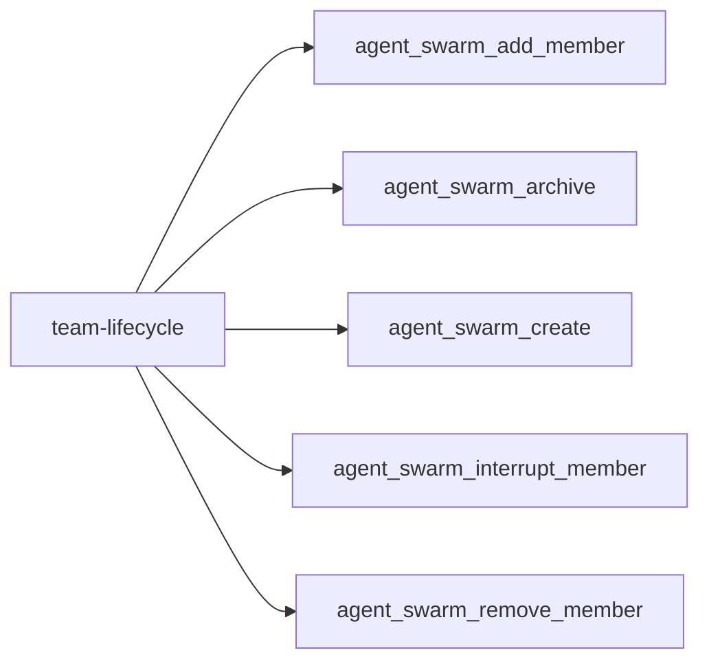
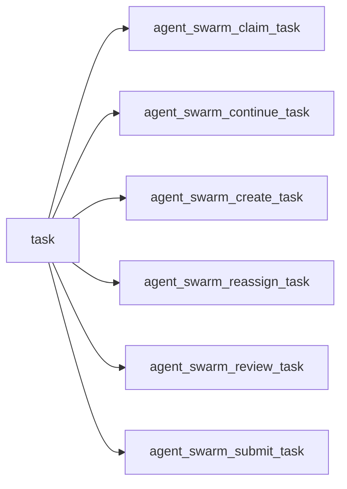
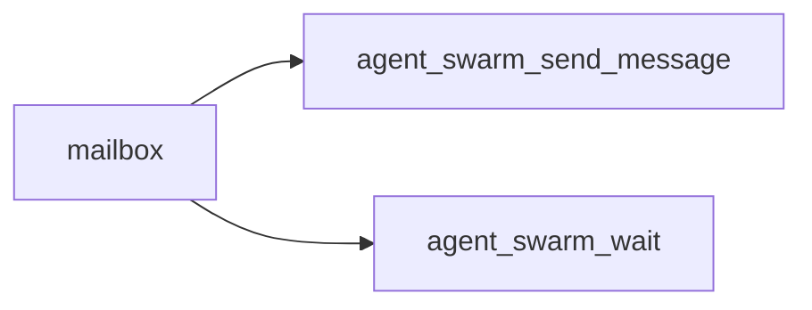
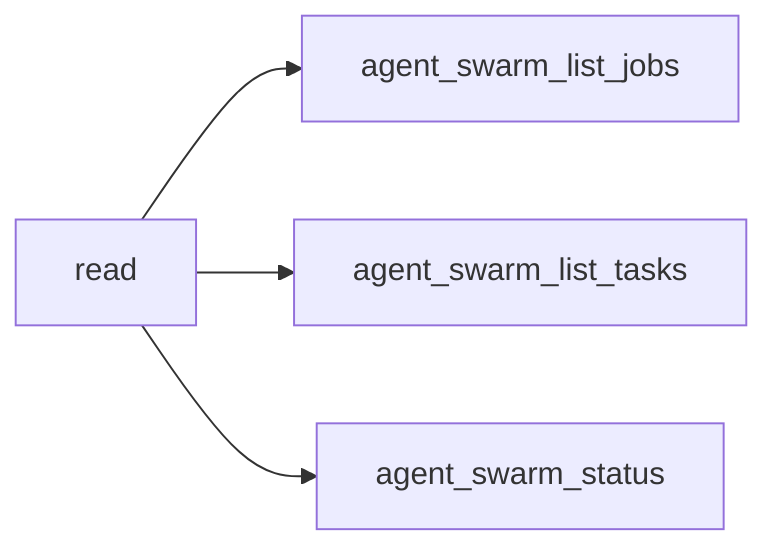
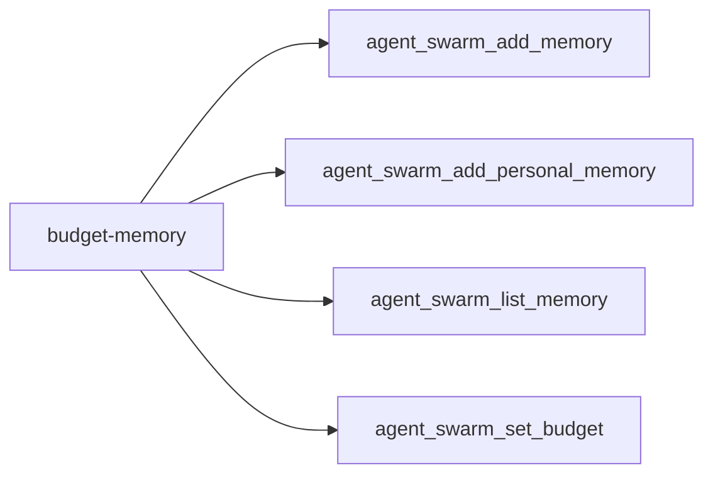

<!-- DO NOT EDIT: generated from docs/knowledge-graph/manifest.json -->

# Availability

Manifest digest: `de78175cbb0c5c34f900ba9b2ccdebf1644e3daebb23bd92cdd9023ff6a57b01`

Curated tool-registry digest: `283582c7136106164f285f14766ed25004dff20b51ed1b76248a0cb59849ce8d`

> Claim ceiling: the registry is a reviewed capability overlay over exact source extraction. Per-tool deep semantic closure, acceptance, and real-Profile evidence remain explicit gaps; the complete mechanical graph is retained in `atlas.json`.

## Functional facets

| Functional facet | Title | Source anchors | Test anchors | Related tools | Evidence gaps |
|---|---|---|---|---|---|
| `config` | Plugin configuration and feature switches | src/index.ts#Config | tests/agent-swarm-settings.spec.tsx tests/dsh-composition.spec.ts | tool:agent_swarm_add_member tool:agent_swarm_claim_task tool:agent_swarm_list_jobs tool:agent_swarm_list_memory | NO_REAL_PROFILE_EVIDENCE PROFILE_DEPENDENT |
| `workflow` | Workflow bridge and scripted Team runs | src/runtime/workflow/team-bridge-engine.ts#TeamBridgeWorkflowEngine src/runtime/workflow/team-run.ts#TeamRun | tests/workflow-bridge.spec.ts | tool:agent_swarm_create_task tool:agent_swarm_review_task tool:agent_swarm_submit_task | NO_REAL_PROFILE_EVIDENCE PROFILE_DEPENDENT |
| `jobs` | Read-only Team jobs projection | src/runtime/jobs/team-job-projection.ts#TeamJobProjection | tests/jobs-reader.spec.ts tests/jobs-bridge.spec.ts | tool:agent_swarm_list_jobs | NO_REAL_PROFILE_EVIDENCE PROFILE_DEPENDENT CONFIG_DISABLED_BY_DEFAULT |
| `rpc` | Versioned bounded read RPC | src/rpc/read-rpc-service.ts#mountAgentSwarmReadRpc src/rpc/read-rpc-contract.ts#SWARM_READ_RPC_VERSION | tests/read-rpc-service.spec.ts tests/read-rpc-client.spec.ts | tool:agent_swarm_list_jobs tool:agent_swarm_list_tasks tool:agent_swarm_status | NO_REAL_PROFILE_EVIDENCE PROFILE_DEPENDENT |
| `ui` | Team dashboard UI projection | src/client/team-dashboard-plugin.ts#apply src/client/team-dashboard-controller.ts#TeamDashboardController | tests/team-dashboard-ui.spec.tsx tests/team-dashboard-controller.spec.ts | tool:agent_swarm_list_jobs tool:agent_swarm_list_tasks tool:agent_swarm_status | NO_REAL_PROFILE_EVIDENCE PROFILE_DEPENDENT |

## Tool families

### team-lifecycle

| Stable capability id | Availability | Verification | Acceptance | Evidence gaps |
|---|---|---|---|---|
| `tool:agent_swarm_add_member` | registered | composition-anchored | not-asserted | NO_REAL_PROFILE_EVIDENCE PROFILE_DEPENDENT PER_TOOL_DEEP_SEMANTICS_DEFERRED |
| `tool:agent_swarm_archive` | registered | none | not-asserted | NO_DIRECT_TEST NO_COMPOSITION_TEST NO_REAL_PROFILE_EVIDENCE PROFILE_DEPENDENT PER_TOOL_DEEP_SEMANTICS_DEFERRED |
| `tool:agent_swarm_create` | registered | composition-anchored | not-asserted | NO_REAL_PROFILE_EVIDENCE PROFILE_DEPENDENT PER_TOOL_DEEP_SEMANTICS_DEFERRED |
| `tool:agent_swarm_interrupt_member` | registered | composition-anchored | not-asserted | NO_REAL_PROFILE_EVIDENCE PROFILE_DEPENDENT PER_TOOL_DEEP_SEMANTICS_DEFERRED |
| `tool:agent_swarm_remove_member` | registered | none | not-asserted | NO_DIRECT_TEST NO_COMPOSITION_TEST NO_REAL_PROFILE_EVIDENCE PROFILE_DEPENDENT PER_TOOL_DEEP_SEMANTICS_DEFERRED |

### task

| Stable capability id | Availability | Verification | Acceptance | Evidence gaps |
|---|---|---|---|---|
| `tool:agent_swarm_claim_task` | registered | composition-anchored | not-asserted | NO_REAL_PROFILE_EVIDENCE PROFILE_DEPENDENT PER_TOOL_DEEP_SEMANTICS_DEFERRED |
| `tool:agent_swarm_continue_task` | config-disabled-by-default | official-composition-anchored | not-asserted | NO_REAL_PROFILE_EVIDENCE PROFILE_DEPENDENT CONFIG_DISABLED_BY_DEFAULT PER_TOOL_DEEP_SEMANTICS_DEFERRED |
| `tool:agent_swarm_create_task` | registered | composition-anchored | not-asserted | NO_REAL_PROFILE_EVIDENCE PROFILE_DEPENDENT PER_TOOL_DEEP_SEMANTICS_DEFERRED |
| `tool:agent_swarm_reassign_task` | registered | none | not-asserted | NO_DIRECT_TEST NO_COMPOSITION_TEST NO_REAL_PROFILE_EVIDENCE PROFILE_DEPENDENT PER_TOOL_DEEP_SEMANTICS_DEFERRED |
| `tool:agent_swarm_review_task` | registered | composition-anchored | not-asserted | NO_REAL_PROFILE_EVIDENCE PROFILE_DEPENDENT PER_TOOL_DEEP_SEMANTICS_DEFERRED |
| `tool:agent_swarm_submit_task` | registered | composition-anchored | not-asserted | NO_REAL_PROFILE_EVIDENCE PROFILE_DEPENDENT PER_TOOL_DEEP_SEMANTICS_DEFERRED |

### mailbox

| Stable capability id | Availability | Verification | Acceptance | Evidence gaps |
|---|---|---|---|---|
| `tool:agent_swarm_send_message` | registered | composition-anchored | not-asserted | NO_REAL_PROFILE_EVIDENCE PROFILE_DEPENDENT PER_TOOL_DEEP_SEMANTICS_DEFERRED |
| `tool:agent_swarm_wait` | registered | composition-anchored | not-asserted | NO_REAL_PROFILE_EVIDENCE PROFILE_DEPENDENT PER_TOOL_DEEP_SEMANTICS_DEFERRED |

### read

| Stable capability id | Availability | Verification | Acceptance | Evidence gaps |
|---|---|---|---|---|
| `tool:agent_swarm_list_jobs` | config-disabled-by-default | composition-anchored | not-asserted | NO_REAL_PROFILE_EVIDENCE PROFILE_DEPENDENT CONFIG_DISABLED_BY_DEFAULT PER_TOOL_DEEP_SEMANTICS_DEFERRED |
| `tool:agent_swarm_list_tasks` | registered | composition-anchored | not-asserted | NO_REAL_PROFILE_EVIDENCE PROFILE_DEPENDENT PER_TOOL_DEEP_SEMANTICS_DEFERRED |
| `tool:agent_swarm_status` | registered | composition-anchored | not-asserted | NO_REAL_PROFILE_EVIDENCE PROFILE_DEPENDENT PER_TOOL_DEEP_SEMANTICS_DEFERRED |

### budget-memory

| Stable capability id | Availability | Verification | Acceptance | Evidence gaps |
|---|---|---|---|---|
| `tool:agent_swarm_add_memory` | registered | unit-anchored | not-asserted | NO_REAL_PROFILE_EVIDENCE PROFILE_DEPENDENT PER_TOOL_DEEP_SEMANTICS_DEFERRED |
| `tool:agent_swarm_add_personal_memory` | registered | unit-anchored | not-asserted | NO_DIRECT_TEST NO_COMPOSITION_TEST NO_REAL_PROFILE_EVIDENCE PROFILE_DEPENDENT PER_TOOL_DEEP_SEMANTICS_DEFERRED |
| `tool:agent_swarm_list_memory` | registered | unit-anchored | not-asserted | NO_DIRECT_TEST NO_COMPOSITION_TEST NO_REAL_PROFILE_EVIDENCE PROFILE_DEPENDENT PER_TOOL_DEEP_SEMANTICS_DEFERRED |
| `tool:agent_swarm_set_budget` | registered | none | not-asserted | NO_DIRECT_TEST NO_COMPOSITION_TEST NO_REAL_PROFILE_EVIDENCE PROFILE_DEPENDENT PER_TOOL_DEEP_SEMANTICS_DEFERRED |

## Complete graph projection

```mermaid
flowchart LR
  n_61727469666163743a7061636b6167652d7265736f757263652f636f726469732e70617463682e796d6c["Package resource ./cordis.patch.yml"]
  n_61727469666163743a7061636b6167652d7265736f757263652f7061636b6167652e6a736f6e["Package resource ./package.json"]
  n_617574686f726974793a70726f6a6563742d636f6e747261637473["Registered project contract authority"]
  n_617574686f726974793a736f757263652d74726565["Repository source-tree authority"]
  n_6361706162696c6974793a66726573682d76322d6d6f64656c2d64697370617463682d7769746e657373["Network-free per-Provider model dispatch witness capability"]
  n_636865636b706f696e743a617474656d70742d64656c697665726564["Delivered attempt Team checkpoint"]
  n_636865636b706f696e743a617474656d70742d7265736572766564["Reserved attempt durable Team checkpoint"]
  n_636865636b706f696e743a66726573682d76322d61737369676e6d656e742d6672616d652d64757261626c65["Initial assignment Session frame is durable"]
  n_636865636b706f696e743a66726573682d76322d617373697374616e742d65766964656e63652d64757261626c65["Assistant evidence Session flush succeeded"]
  n_636865636b706f696e743a66726573682d76322d64697370617463682d656e74657265642d726561646261636b["Dispatch-entered Team read-back succeeded"]
  n_636865636b706f696e743a66726573682d76322d64697370617463682d70656e64696e672d726561646261636b["Dispatch-pending Team read-back succeeded"]
  n_636865636b706f696e743a73657373696f6e2d6672616d652d636c61696d6564["Claimed exact Session frame checkpoint"]
  n_636f6e6669672d6b65793a646973706f73616c74696d656f75746d73["Config disposalTimeoutMs"]
  n_636f6e6669672d6b65793a656e61626c6564["Config enabled"]
  n_636f6e6669672d6b65793a657865637574696f6e726f6f7470726f7669646572["Config executionRootProvider"]
  n_636f6e6669672d6b65793a657865637574696f6e726f6f7473["Config executionRoots"]
  n_636f6e6669672d6b65793a657865637574696f6e726f6f747362617365["Config executionRootsBase"]
  n_636f6e6669672d6b65793a6578706572696d656e74616c66726573687632["Config experimentalFreshV2"]
  n_636f6e6669672d6b65793a667265736876326172746966616374636f6e7472616374["Config freshV2ArtifactContract"]
  n_636f6e6669672d6b65793a66726573687632686f7374636f6e7472616374["Config freshV2HostContract"]
  n_636f6e6669672d6b65793a667265736876326c65676163796d616e69666573746361706163697479["Config freshV2LegacyManifestCapacity"]
  n_636f6e6669672d6b65793a6a6f6273627269646765["Config jobsBridge"]
  n_636f6e6669672d6b65793a6c617a796d656d6265727374617274["Config lazyMemberStart"]
  n_636f6e6669672d6b65793a6d6178646570656e64656e63696573["Config maxDependencies"]
  n_636f6e6669672d6b65793a6d61786d656d62657273["Config maxMembers"]
  n_636f6e6669672d6b65793a6d61786d656d6f72696573["Config maxMemories"]
  n_636f6e6669672d6b65793a6d61786d6573736167656279746573["Config maxMessageBytes"]
  n_636f6e6669672d6b65793a6d617870656e64696e676d657373616765737065726d656d626572["Config maxPendingMessagesPerMember"]
  n_636f6e6669672d6b65793a6d617872657461696e6564617474656d707473["Config maxRetainedAttempts"]
  n_636f6e6669672d6b65793a6d617872657461696e65646d65737361676573["Config maxRetainedMessages"]
```

_View capped at 30 nodes and 60 edges; use atlas.json for the complete graph._

| Stable id | Kind | Classification | Implementation | Verification | Acceptance | Availability | Owner |
|---|---|---|---|---|---|---|---|
| `artifact:package-resource/cordis.patch.yml` | artifact | MECHANICAL / UNCLASSIFIED | implemented | none | not-candidate | package-exported | `(unclassified)` |
| `artifact:package-resource/package.json` | artifact | MECHANICAL / UNCLASSIFIED | implemented | none | not-candidate | package-exported | `(unclassified)` |
| `authority:project-contracts` | authority | REVIEWED | implemented | static | candidate | always-registered | `authority:project-contracts` |
| `authority:source-tree` | authority | MECHANICAL / UNCLASSIFIED | implemented | none | not-candidate | package-exported | `(unclassified)` |
| `capability:fresh-v2-model-dispatch-witness` | public-capability | REVIEWED | implemented | composition | candidate | config-gated | `official-authority:llm-runtime` |
| `checkpoint:attempt-delivered` | checkpoint | REVIEWED | implemented | static | candidate | always-registered | `domain:agent-swarm` |
| `checkpoint:attempt-reserved` | checkpoint | REVIEWED | implemented | static | candidate | always-registered | `domain:agent-swarm` |
| `checkpoint:fresh-v2-assignment-frame-durable` | checkpoint | REVIEWED | implemented | composition | candidate | config-gated | `official-authority:session` |
| `checkpoint:fresh-v2-assistant-evidence-durable` | checkpoint | REVIEWED | implemented | composition | candidate | config-gated | `official-authority:session` |
| `checkpoint:fresh-v2-dispatch-entered-readback` | checkpoint | REVIEWED | implemented | composition | candidate | config-gated | `domain:agent-swarm` |
| `checkpoint:fresh-v2-dispatch-pending-readback` | checkpoint | REVIEWED | implemented | composition | candidate | config-gated | `domain:agent-swarm` |
| `checkpoint:session-frame-claimed` | checkpoint | REVIEWED | implemented | static | candidate | always-registered | `official-authority:session` |
| `config-key:disposaltimeoutms` | config-key | MECHANICAL / UNCLASSIFIED | implemented | none | not-candidate | config-gated | `(unclassified)` |
| `config-key:enabled` | config-key | MECHANICAL / UNCLASSIFIED | implemented | none | not-candidate | config-gated | `(unclassified)` |
| `config-key:executionrootprovider` | config-key | MECHANICAL / UNCLASSIFIED | implemented | none | not-candidate | config-gated | `(unclassified)` |
| `config-key:executionroots` | config-key | MECHANICAL / UNCLASSIFIED | implemented | none | not-candidate | config-gated | `(unclassified)` |
| `config-key:executionrootsbase` | config-key | MECHANICAL / UNCLASSIFIED | implemented | none | not-candidate | config-gated | `(unclassified)` |
| `config-key:experimentalfreshv2` | config-key | MECHANICAL / UNCLASSIFIED | implemented | none | not-candidate | config-gated | `(unclassified)` |
| `config-key:freshv2artifactcontract` | config-key | MECHANICAL / UNCLASSIFIED | implemented | none | not-candidate | config-gated | `(unclassified)` |
| `config-key:freshv2hostcontract` | config-key | MECHANICAL / UNCLASSIFIED | implemented | none | not-candidate | config-gated | `(unclassified)` |
| `config-key:freshv2legacymanifestcapacity` | config-key | MECHANICAL / UNCLASSIFIED | implemented | none | not-candidate | config-gated | `(unclassified)` |
| `config-key:jobsbridge` | config-key | MECHANICAL / UNCLASSIFIED | implemented | none | not-candidate | config-gated | `(unclassified)` |
| `config-key:lazymemberstart` | config-key | MECHANICAL / UNCLASSIFIED | implemented | none | not-candidate | config-gated | `(unclassified)` |
| `config-key:maxdependencies` | config-key | MECHANICAL / UNCLASSIFIED | implemented | none | not-candidate | config-gated | `(unclassified)` |
| `config-key:maxmembers` | config-key | MECHANICAL / UNCLASSIFIED | implemented | none | not-candidate | config-gated | `(unclassified)` |
| `config-key:maxmemories` | config-key | MECHANICAL / UNCLASSIFIED | implemented | none | not-candidate | config-gated | `(unclassified)` |
| `config-key:maxmessagebytes` | config-key | MECHANICAL / UNCLASSIFIED | implemented | none | not-candidate | config-gated | `(unclassified)` |
| `config-key:maxpendingmessagespermember` | config-key | MECHANICAL / UNCLASSIFIED | implemented | none | not-candidate | config-gated | `(unclassified)` |
| `config-key:maxretainedattempts` | config-key | MECHANICAL / UNCLASSIFIED | implemented | none | not-candidate | config-gated | `(unclassified)` |
| `config-key:maxretainedmessages` | config-key | MECHANICAL / UNCLASSIFIED | implemented | none | not-candidate | config-gated | `(unclassified)` |
| `config-key:maxtaskbytes` | config-key | MECHANICAL / UNCLASSIFIED | implemented | none | not-candidate | config-gated | `(unclassified)` |
| `config-key:maxtasks` | config-key | MECHANICAL / UNCLASSIFIED | implemented | none | not-candidate | config-gated | `(unclassified)` |
| `config-key:maxverificationcommandms` | config-key | MECHANICAL / UNCLASSIFIED | implemented | none | not-candidate | config-gated | `(unclassified)` |
| `config-key:maxverificationcommands` | config-key | MECHANICAL / UNCLASSIFIED | implemented | none | not-candidate | config-gated | `(unclassified)` |
| `config-key:memberdenytools` | config-key | MECHANICAL / UNCLASSIFIED | implemented | none | not-candidate | config-gated | `(unclassified)` |
| `config-key:memberllmprovider` | config-key | MECHANICAL / UNCLASSIFIED | implemented | none | not-candidate | config-gated | `(unclassified)` |
| `config-key:membermaxdepth` | config-key | MECHANICAL / UNCLASSIFIED | implemented | none | not-candidate | config-gated | `(unclassified)` |
| `config-key:membermodel` | config-key | MECHANICAL / UNCLASSIFIED | implemented | none | not-candidate | config-gated | `(unclassified)` |
| `config-key:memberprovider` | config-key | MECHANICAL / UNCLASSIFIED | implemented | none | not-candidate | config-gated | `(unclassified)` |
| `config-key:memberskills` | config-key | MECHANICAL / UNCLASSIFIED | implemented | none | not-candidate | config-gated | `(unclassified)` |
| `config-key:memoryquerymaxcandidates` | config-key | MECHANICAL / UNCLASSIFIED | implemented | none | not-candidate | config-gated | `(unclassified)` |
| `config-key:memoryquerytimeoutms` | config-key | MECHANICAL / UNCLASSIFIED | implemented | none | not-candidate | config-gated | `(unclassified)` |
| `config-key:memorysemanticenabled` | config-key | MECHANICAL / UNCLASSIFIED | implemented | none | not-candidate | config-gated | `(unclassified)` |
| `config-key:memorysemanticmodel` | config-key | MECHANICAL / UNCLASSIFIED | implemented | none | not-candidate | config-gated | `(unclassified)` |
| `config-key:memorysemanticprovider` | config-key | MECHANICAL / UNCLASSIFIED | implemented | none | not-candidate | config-gated | `(unclassified)` |
| `config-key:orchestrationmode` | config-key | MECHANICAL / UNCLASSIFIED | implemented | none | not-candidate | config-gated | `(unclassified)` |
| `config-key:promptsectionorder` | config-key | MECHANICAL / UNCLASSIFIED | implemented | none | not-candidate | config-gated | `(unclassified)` |
| `config-key:reviewprovider` | config-key | MECHANICAL / UNCLASSIFIED | implemented | none | not-candidate | config-gated | `(unclassified)` |
| `config-key:reviewrootprovider` | config-key | MECHANICAL / UNCLASSIFIED | implemented | none | not-candidate | config-gated | `(unclassified)` |
| `config-key:schedulerprovider` | config-key | MECHANICAL / UNCLASSIFIED | implemented | none | not-candidate | config-gated | `(unclassified)` |
| `config-key:strandedafterms` | config-key | MECHANICAL / UNCLASSIFIED | implemented | none | not-candidate | config-gated | `(unclassified)` |
| `config-key:toolpolicy` | config-key | MECHANICAL / UNCLASSIFIED | implemented | none | not-candidate | config-gated | `(unclassified)` |
| `config-key:workflowbridge` | config-key | MECHANICAL / UNCLASSIFIED | implemented | none | not-candidate | config-gated | `(unclassified)` |
| `config-key:workflowdisposegracems` | config-key | MECHANICAL / UNCLASSIFIED | implemented | none | not-candidate | config-gated | `(unclassified)` |
| `config-key:workflowmaxtotalagents` | config-key | MECHANICAL / UNCLASSIFIED | implemented | none | not-candidate | config-gated | `(unclassified)` |
| `consumer:registry-facade/src/runtime/execution-root-surface.ts/executionrootsurface/registerprovider` | consumer | MECHANICAL / UNCLASSIFIED | implemented | none | not-candidate | always-registered | `(unclassified)` |
| `consumer:registry-facade/src/runtime/orchestrator-runtime.ts/agentswarmruntime/registerexecutionrootprovider` | consumer | MECHANICAL / UNCLASSIFIED | implemented | none | not-candidate | always-registered | `(unclassified)` |
| `consumer:registry-facade/src/runtime/orchestrator-runtime.ts/agentswarmruntime/registerreviewrootprovider` | consumer | MECHANICAL / UNCLASSIFIED | implemented | none | not-candidate | always-registered | `(unclassified)` |
| `consumer:registry-facade/src/runtime/orchestrator-runtime.ts/agentswarmruntime/registerverificationcommandtemplate` | consumer | MECHANICAL / UNCLASSIFIED | implemented | none | not-candidate | always-registered | `(unclassified)` |
| `document:core-protocol` | document | REVIEWED | implemented | static | candidate | always-registered | `authority:project-contracts` |
| `document:fresh-v2-runtime-blueprint` | document | REVIEWED | implemented | static | candidate | config-gated | `authority:project-contracts` |
| `document:official-baseline` | document | REVIEWED | implemented | static | candidate | always-registered | `authority:project-contracts` |
| `document:source-register` | document | REVIEWED | implemented | static | candidate | always-registered | `authority:project-contracts` |
| `document:testing-verification` | document | REVIEWED | implemented | static | candidate | always-registered | `authority:project-contracts` |
| `domain:agent-swarm` | domain | REVIEWED | implemented | composition | candidate | always-registered | `domain:agent-swarm` |
| `domain:agent-swarm-human` | domain | MECHANICAL / UNCLASSIFIED | implemented | none | not-candidate | always-registered | `(unclassified)` |
| `domain:agent-swarm-v2` | domain | MECHANICAL / UNCLASSIFIED | implemented | none | not-candidate | always-registered | `(unclassified)` |
| `domain:agent-swarm-workflow` | domain | MECHANICAL / UNCLASSIFIED | implemented | none | not-candidate | always-registered | `(unclassified)` |
| `entity:agent-swarm-human/humaninteractionrecord` | entity | MECHANICAL / UNCLASSIFIED | implemented | none | not-candidate | unavailable | `(unclassified)` |
| `entity:agent-swarm-v2/freshv2authorityrecord` | entity | MECHANICAL / UNCLASSIFIED | implemented | none | not-candidate | unavailable | `(unclassified)` |
| `entity:agent-swarm-v2/teamrecordv2` | entity | MECHANICAL / UNCLASSIFIED | implemented | none | not-candidate | unavailable | `(unclassified)` |
| `entity:agent-swarm-workflow/workflowrunoverlayrecord` | entity | MECHANICAL / UNCLASSIFIED | implemented | none | not-candidate | unavailable | `(unclassified)` |
| `entity:agent-swarm/migrationreceipt` | entity | MECHANICAL / UNCLASSIFIED | implemented | none | not-candidate | unavailable | `(unclassified)` |
| `entity:agent-swarm/teamrecord` | entity | MECHANICAL / UNCLASSIFIED | implemented | none | not-candidate | unavailable | `(unclassified)` |
| `entity:client-settings/agentswarmsettingsdocument` | entity | MECHANICAL / UNCLASSIFIED | implemented | none | not-candidate | unavailable | `(unclassified)` |
| `entity:fresh-v2-continuation-effect` | entity | REVIEWED | implemented | composition | candidate | config-gated | `domain:agent-swarm` |
| `entity:fresh-v2-continuation-intent` | entity | REVIEWED | implemented | composition | candidate | config-gated | `domain:agent-swarm` |
| `entity:fresh-v2-initial-assignment-frame` | entity | REVIEWED | implemented | composition | candidate | config-gated | `official-authority:session` |
| `entity:fresh-v2-model-dispatch-epoch` | entity | REVIEWED | implemented | composition | candidate | config-gated | `domain:agent-swarm` |
| `entity:fresh-v2-task-attempt` | entity | REVIEWED | implemented | composition | candidate | config-gated | `domain:agent-swarm` |
| `entity:rpc-schema/agentswarmreadrpcdeps` | entity | MECHANICAL / UNCLASSIFIED | implemented | none | not-candidate | unavailable | `(unclassified)` |
| `entity:rpc-schema/swarm_read_rpc_contract_v1` | entity | MECHANICAL / UNCLASSIFIED | implemented | none | not-candidate | unavailable | `(unclassified)` |
| `entity:rpc-schema/swarm_read_rpc_fixtures_v1` | entity | MECHANICAL / UNCLASSIFIED | implemented | none | not-candidate | unavailable | `(unclassified)` |
| `entity:rpc-schema/swarmreadbindingv1` | entity | MECHANICAL / UNCLASSIFIED | implemented | none | not-candidate | unavailable | `(unclassified)` |
| `entity:rpc-schema/swarmreadcapabilitiesrequest` | entity | MECHANICAL / UNCLASSIFIED | implemented | none | not-candidate | unavailable | `(unclassified)` |
| `entity:rpc-schema/swarmreadcapabilitiesv1` | entity | MECHANICAL / UNCLASSIFIED | implemented | none | not-candidate | unavailable | `(unclassified)` |
| `entity:rpc-schema/swarmreadcapability` | entity | MECHANICAL / UNCLASSIFIED | implemented | none | not-candidate | unavailable | `(unclassified)` |
| `entity:rpc-schema/swarmreadcapabilitystate` | entity | MECHANICAL / UNCLASSIFIED | implemented | none | not-candidate | unavailable | `(unclassified)` |
| `entity:rpc-schema/swarmreadpagekind` | entity | MECHANICAL / UNCLASSIFIED | implemented | none | not-candidate | unavailable | `(unclassified)` |
| `entity:rpc-schema/swarmreadpagerequest` | entity | MECHANICAL / UNCLASSIFIED | implemented | none | not-candidate | unavailable | `(unclassified)` |
| `entity:rpc-schema/swarmreadpagev1` | entity | MECHANICAL / UNCLASSIFIED | implemented | none | not-candidate | unavailable | `(unclassified)` |
| `entity:rpc-schema/swarmreadrpcenvelope` | entity | MECHANICAL / UNCLASSIFIED | implemented | none | not-candidate | unavailable | `(unclassified)` |
| `entity:rpc-schema/swarmreadrpcfailure` | entity | MECHANICAL / UNCLASSIFIED | implemented | none | not-candidate | unavailable | `(unclassified)` |
| `entity:rpc-schema/swarmreadrpcmethod` | entity | MECHANICAL / UNCLASSIFIED | implemented | none | not-candidate | unavailable | `(unclassified)` |
| `entity:rpc-schema/swarmreadrpcrequest` | entity | MECHANICAL / UNCLASSIFIED | implemented | none | not-candidate | unavailable | `(unclassified)` |
| `entity:rpc-schema/swarmreadrpcsuccess` | entity | MECHANICAL / UNCLASSIFIED | implemented | none | not-candidate | unavailable | `(unclassified)` |
| `entity:rpc-schema/swarmreadrpcvalue` | entity | MECHANICAL / UNCLASSIFIED | implemented | none | not-candidate | unavailable | `(unclassified)` |
| `entity:rpc-schema/swarmreadstatusv1` | entity | MECHANICAL / UNCLASSIFIED | implemented | none | not-candidate | unavailable | `(unclassified)` |
| `entity:rpc-schema/swarmreadtargethint` | entity | MECHANICAL / UNCLASSIFIED | implemented | none | not-candidate | unavailable | `(unclassified)` |
| `entity:rpc-schema/swarmreadtargetrequest` | entity | MECHANICAL / UNCLASSIFIED | implemented | none | not-candidate | unavailable | `(unclassified)` |
| `entity:rpc-schema/swarmrequesttrustfacts` | entity | MECHANICAL / UNCLASSIFIED | implemented | none | not-candidate | unavailable | `(unclassified)` |
| `entity:rpc-schema/swarmrequesttrustresult` | entity | MECHANICAL / UNCLASSIFIED | implemented | none | not-candidate | unavailable | `(unclassified)` |
| `entity:rpc-schema/swarmwebserver` | entity | MECHANICAL / UNCLASSIFIED | implemented | none | not-candidate | unavailable | `(unclassified)` |
| `entity:session-assignment-frame` | entity | REVIEWED | implemented | static | candidate | always-registered | `official-authority:session` |
| `entity:task-attempt` | entity | REVIEWED | implemented | static | candidate | always-registered | `domain:agent-swarm` |
| `entity:team-request-budget` | entity | REVIEWED | implemented | static | candidate | always-registered | `domain:agent-swarm` |
| `entity:team-task` | entity | REVIEWED | implemented | static | candidate | always-registered | `domain:agent-swarm` |
| `entrypoint:client/index` | entrypoint | MECHANICAL / UNCLASSIFIED | implemented | none | not-candidate | package-exported | `(unclassified)` |
| `entrypoint:client/plugin-entry` | entrypoint | MECHANICAL / UNCLASSIFIED | implemented | none | not-candidate | package-exported | `(unclassified)` |
| `entrypoint:package/client` | entrypoint | MECHANICAL / UNCLASSIFIED | implemented | none | not-candidate | package-exported | `(unclassified)` |
| `entrypoint:package/cordis.patch.yml` | entrypoint | MECHANICAL / UNCLASSIFIED | implemented | none | not-candidate | package-exported | `(unclassified)` |
| `entrypoint:package/package.json` | entrypoint | MECHANICAL / UNCLASSIFIED | implemented | none | not-candidate | package-exported | `(unclassified)` |
| `entrypoint:package/root` | entrypoint | MECHANICAL / UNCLASSIFIED | implemented | none | not-candidate | package-exported | `(unclassified)` |
| `entrypoint:source/public-api` | entrypoint | MECHANICAL / UNCLASSIFIED | implemented | none | not-candidate | package-exported | `(unclassified)` |
| `event:effect/01-src/client/team-dashboard-plugin.ts` | event | MECHANICAL / UNCLASSIFIED | implemented | none | not-candidate | unavailable | `(unclassified)` |
| `event:effect/02-src/client/team-dashboard-plugin.ts` | event | MECHANICAL / UNCLASSIFIED | implemented | none | not-candidate | unavailable | `(unclassified)` |
| `event:effect/03-src/client/team-dashboard-plugin.ts` | event | MECHANICAL / UNCLASSIFIED | implemented | none | not-candidate | unavailable | `(unclassified)` |
| `event:effect/04-src/client/team-dashboard-plugin.ts` | event | MECHANICAL / UNCLASSIFIED | implemented | none | not-candidate | unavailable | `(unclassified)` |
| `event:effect/05-src/index.ts` | event | MECHANICAL / UNCLASSIFIED | implemented | none | not-candidate | unavailable | `(unclassified)` |
| `event:effect/06-src/index.ts` | event | MECHANICAL / UNCLASSIFIED | implemented | none | not-candidate | unavailable | `(unclassified)` |
| `event:effect/07-src/index.ts` | event | MECHANICAL / UNCLASSIFIED | implemented | none | not-candidate | unavailable | `(unclassified)` |
| `event:effect/08-src/index.ts` | event | MECHANICAL / UNCLASSIFIED | implemented | none | not-candidate | unavailable | `(unclassified)` |
| `event:effect/09-src/index.ts` | event | MECHANICAL / UNCLASSIFIED | implemented | none | not-candidate | unavailable | `(unclassified)` |
| `event:effect/10-src/index.ts` | event | MECHANICAL / UNCLASSIFIED | implemented | none | not-candidate | unavailable | `(unclassified)` |
| `event:effect/11-src/index.ts` | event | MECHANICAL / UNCLASSIFIED | implemented | none | not-candidate | unavailable | `(unclassified)` |
| `event:effect/12-src/index.ts` | event | MECHANICAL / UNCLASSIFIED | implemented | none | not-candidate | unavailable | `(unclassified)` |
| `event:effect/13-src/index.ts` | event | MECHANICAL / UNCLASSIFIED | implemented | none | not-candidate | unavailable | `(unclassified)` |
| `event:effect/14-src/index.ts` | event | MECHANICAL / UNCLASSIFIED | implemented | none | not-candidate | unavailable | `(unclassified)` |
| `event:effect/15-src/index.ts` | event | MECHANICAL / UNCLASSIFIED | implemented | none | not-candidate | unavailable | `(unclassified)` |
| `event:effect/16-src/index.ts` | event | MECHANICAL / UNCLASSIFIED | implemented | none | not-candidate | unavailable | `(unclassified)` |
| `event:effect/17-src/index.ts` | event | MECHANICAL / UNCLASSIFIED | implemented | none | not-candidate | unavailable | `(unclassified)` |
| `event:effect/18-src/index.ts` | event | MECHANICAL / UNCLASSIFIED | implemented | none | not-candidate | unavailable | `(unclassified)` |
| `event:effect/19-src/index.ts` | event | MECHANICAL / UNCLASSIFIED | implemented | none | not-candidate | unavailable | `(unclassified)` |
| `event:effect/20-src/rpc/read-rpc-service.ts` | event | MECHANICAL / UNCLASSIFIED | implemented | none | not-candidate | unavailable | `(unclassified)` |
| `event:effect/21-src/runtime/fresh-v2-hooks.ts` | event | MECHANICAL / UNCLASSIFIED | implemented | none | not-candidate | unavailable | `(unclassified)` |
| `event:effect/22-src/runtime/fresh-v2-hooks.ts` | event | MECHANICAL / UNCLASSIFIED | implemented | none | not-candidate | unavailable | `(unclassified)` |
| `event:effect/23-src/runtime/fresh-v2-hooks.ts` | event | MECHANICAL / UNCLASSIFIED | implemented | none | not-candidate | unavailable | `(unclassified)` |
| `event:effect/24-src/runtime/fresh-v2-hooks.ts` | event | MECHANICAL / UNCLASSIFIED | implemented | none | not-candidate | unavailable | `(unclassified)` |
| `event:effect/25-src/runtime/fresh-v2-hooks.ts` | event | MECHANICAL / UNCLASSIFIED | implemented | none | not-candidate | unavailable | `(unclassified)` |
| `event:effect/26-src/runtime/fresh-v2-hooks.ts` | event | MECHANICAL / UNCLASSIFIED | implemented | none | not-candidate | unavailable | `(unclassified)` |
| `event:effect/27-src/runtime/jobs/team-job-projection.ts` | event | MECHANICAL / UNCLASSIFIED | implemented | none | not-candidate | unavailable | `(unclassified)` |
| `event:effect/28-src/runtime/jobs/team-job-projection.ts` | event | MECHANICAL / UNCLASSIFIED | implemented | none | not-candidate | unavailable | `(unclassified)` |
| `event:effect/29-src/runtime/jobs/team-job-projection.ts` | event | MECHANICAL / UNCLASSIFIED | implemented | none | not-candidate | unavailable | `(unclassified)` |
| `event:effect/30-src/tools/shared.ts` | event | MECHANICAL / UNCLASSIFIED | implemented | none | not-candidate | unavailable | `(unclassified)` |
| `event:fresh-v2-assistant-message-evidence` | event | REVIEWED | implemented | composition | candidate | config-gated | `official-authority:session` |
| `event:fresh-v2-continuation-frame` | event | REVIEWED | implemented | composition | candidate | config-gated | `official-authority:session` |
| `event:listener/01-src/client/teamdashboarddetails.tsx-keydown` | event | MECHANICAL / UNCLASSIFIED | implemented | none | not-candidate | unavailable | `(unclassified)` |
| `event:listener/02-src/client/team-dashboard-plugin.ts-connection/reset` | event | MECHANICAL / UNCLASSIFIED | implemented | none | not-candidate | unavailable | `(unclassified)` |
| `event:listener/03-src/index.ts-agent/status` | event | MECHANICAL / UNCLASSIFIED | implemented | none | not-candidate | unavailable | `(unclassified)` |
| `event:listener/04-src/index.ts-session/event` | event | MECHANICAL / UNCLASSIFIED | implemented | none | not-candidate | unavailable | `(unclassified)` |
| `event:listener/05-src/index.ts-agent/request` | event | MECHANICAL / UNCLASSIFIED | implemented | none | not-candidate | unavailable | `(unclassified)` |
| `event:listener/06-src/runtime/disposal.ts-abort` | event | MECHANICAL / UNCLASSIFIED | implemented | none | not-candidate | unavailable | `(unclassified)` |
| `event:listener/07-src/runtime/fresh-v2-hooks.ts-agent/request` | event | MECHANICAL / UNCLASSIFIED | implemented | none | not-candidate | unavailable | `(unclassified)` |
| `event:listener/08-src/runtime/fresh-v2-hooks.ts-llm/stream` | event | MECHANICAL / UNCLASSIFIED | implemented | none | not-candidate | unavailable | `(unclassified)` |
| `event:listener/09-src/runtime/fresh-v2-hooks.ts-session/event` | event | MECHANICAL / UNCLASSIFIED | implemented | none | not-candidate | unavailable | `(unclassified)` |
| `event:listener/10-src/runtime/fresh-v2-hooks.ts-agent/inbox/claimed` | event | MECHANICAL / UNCLASSIFIED | implemented | none | not-candidate | unavailable | `(unclassified)` |
| `event:listener/11-src/runtime/fresh-v2-hooks.ts-agent/status` | event | MECHANICAL / UNCLASSIFIED | implemented | none | not-candidate | unavailable | `(unclassified)` |
| `event:listener/12-src/runtime/fresh-v2-hooks.ts-llm/adapters-updated` | event | MECHANICAL / UNCLASSIFIED | implemented | none | not-candidate | unavailable | `(unclassified)` |
| `event:listener/13-src/runtime/jobs/team-job-projection.ts-domain/changed` | event | MECHANICAL / UNCLASSIFIED | implemented | none | not-candidate | unavailable | `(unclassified)` |
| `event:listener/14-src/runtime/jobs/team-job-projection.ts-abort` | event | MECHANICAL / UNCLASSIFIED | implemented | none | not-candidate | unavailable | `(unclassified)` |
| `event:listener/15-src/runtime/permission-surface.ts-tools/pre-execute` | event | MECHANICAL / UNCLASSIFIED | implemented | none | not-candidate | unavailable | `(unclassified)` |
| `event:listener/16-src/runtime/review-root.ts-data` | event | MECHANICAL / UNCLASSIFIED | implemented | none | not-candidate | unavailable | `(unclassified)` |
| `event:listener/17-src/runtime/review-root.ts-abort` | event | MECHANICAL / UNCLASSIFIED | implemented | none | not-candidate | unavailable | `(unclassified)` |
| `event:listener/18-src/runtime/review-root.ts-error` | event | MECHANICAL / UNCLASSIFIED | implemented | none | not-candidate | unavailable | `(unclassified)` |
| `event:listener/19-src/runtime/review-root.ts-abort` | event | MECHANICAL / UNCLASSIFIED | implemented | none | not-candidate | unavailable | `(unclassified)` |
| `event:listener/20-src/runtime/review-root.ts-abort` | event | MECHANICAL / UNCLASSIFIED | implemented | none | not-candidate | unavailable | `(unclassified)` |
| `event:listener/21-src/runtime/review-root.ts-error` | event | MECHANICAL / UNCLASSIFIED | implemented | none | not-candidate | unavailable | `(unclassified)` |
| `event:listener/22-src/runtime/review-root.ts-close` | event | MECHANICAL / UNCLASSIFIED | implemented | none | not-candidate | unavailable | `(unclassified)` |
| `event:listener/23-src/runtime/workflow/team-run.ts-abort` | event | MECHANICAL / UNCLASSIFIED | implemented | none | not-candidate | unavailable | `(unclassified)` |
| `event:listener/24-src/runtime/workflow/team-run.ts-agent/status` | event | MECHANICAL / UNCLASSIFIED | implemented | none | not-candidate | unavailable | `(unclassified)` |
| `event:listener/25-src/storage/storage-domain-team-store-v2.ts-domain/changed` | event | MECHANICAL / UNCLASSIFIED | implemented | none | not-candidate | unavailable | `(unclassified)` |
| `event:listener/26-src/storage/storage-domain-team-store.ts-domain/changed` | event | MECHANICAL / UNCLASSIFIED | implemented | none | not-candidate | unavailable | `(unclassified)` |
| `event:listener/27-src/storage/storage-domain-team-store.ts-abort` | event | MECHANICAL / UNCLASSIFIED | implemented | none | not-candidate | unavailable | `(unclassified)` |
| `event:system-prompt/01` | event | MECHANICAL / UNCLASSIFIED | implemented | none | not-candidate | unavailable | `(unclassified)` |
| `fence:current-attempt-id` | fence | REVIEWED | implemented | static | candidate | always-registered | `domain:agent-swarm` |
| `fence:exact-assignment-frame` | fence | REVIEWED | implemented | static | candidate | always-registered | `official-authority:session` |
| `fence:fresh-v2-current-attempt-tuple` | fence | REVIEWED | implemented | composition | candidate | config-gated | `domain:agent-swarm` |
| `fence:fresh-v2-dispatch-identity` | fence | REVIEWED | implemented | composition | candidate | config-gated | `domain:agent-swarm` |
| `fence:fresh-v2-initial-prompt-digest` | fence | REVIEWED | implemented | composition | candidate | config-gated | `official-authority:session` |
| `fence:task-revision` | fence | REVIEWED | implemented | static | candidate | always-registered | `domain:agent-swarm` |
| `flow-branch:assignment-delivery/absent` | flow-branch | REVIEWED | implemented | static | candidate | always-registered | `domain:agent-swarm` |
| `flow-branch:assignment-delivery/admission-rejected` | flow-branch | REVIEWED | implemented | static | candidate | always-registered | `domain:agent-swarm` |
| `flow-branch:assignment-delivery/admission-unknown` | flow-branch | REVIEWED | implemented | static | candidate | always-registered | `domain:agent-swarm` |
| `flow-branch:assignment-delivery/claim-reserved` | flow-branch | REVIEWED | implemented | static | candidate | always-registered | `domain:agent-swarm` |
| `flow-branch:assignment-delivery/claimed` | flow-branch | REVIEWED | implemented | static | candidate | always-registered | `domain:agent-swarm` |
| `flow-branch:assignment-delivery/pending` | flow-branch | REVIEWED | implemented | static | candidate | always-registered | `domain:agent-swarm` |
| `flow-branch:assignment-delivery/unknown` | flow-branch | REVIEWED | implemented | static | candidate | always-registered | `domain:agent-swarm` |
| `flow-branch:fresh-v2-initial-dispatch/assistant-evidence-undurable` | flow-branch | REVIEWED | implemented | composition | candidate | config-gated | `domain:agent-swarm` |
| `flow-branch:fresh-v2-initial-dispatch/cold-dispatch-entered-unclassified` | flow-branch | REVIEWED | absent | none | not-candidate | unavailable | `domain:agent-swarm` |
| `flow-branch:fresh-v2-initial-dispatch/cold-dispatch-pending-unrecovered` | flow-branch | REVIEWED | absent | none | not-candidate | unavailable | `domain:agent-swarm` |
| `flow-branch:fresh-v2-initial-dispatch/cold-evidence-unrefolded` | flow-branch | REVIEWED | absent | none | not-candidate | unavailable | `domain:agent-swarm` |
| `flow-branch:fresh-v2-initial-dispatch/cold-starting-unreconciled` | flow-branch | REVIEWED | absent | none | not-candidate | unavailable | `domain:agent-swarm` |
| `flow-branch:fresh-v2-initial-dispatch/dispatch-pending-held` | flow-branch | REVIEWED | implemented | composition | candidate | config-gated | `domain:agent-swarm` |
| `flow-branch:fresh-v2-initial-dispatch/downstream-failed-after-entered` | flow-branch | REVIEWED | implemented | composition | candidate | config-gated | `domain:agent-swarm` |
| `flow-branch:fresh-v2-initial-dispatch/pre-model-barrier-rejected` | flow-branch | REVIEWED | implemented | composition | candidate | config-gated | `domain:agent-swarm` |
| `flow-branch:fresh-v2-initial-dispatch/provider-start-rejected` | flow-branch | REVIEWED | implemented | composition | candidate | config-gated | `domain:agent-swarm` |
| `flow-branch:fresh-v2-initial-dispatch/provider-start-result-unknown` | flow-branch | REVIEWED | absent | none | not-candidate | unavailable | `domain:agent-swarm` |
| `flow-branch:fresh-v2-online-continuation/cold-recovery-absent` | flow-branch | REVIEWED | absent | none | not-candidate | unavailable | `domain:agent-swarm` |
| `flow:assignment-delivery` | flow | REVIEWED | implemented | static | candidate | always-registered | `domain:agent-swarm` |
| `flow:fresh-v2-initial-dispatch` | flow | REVIEWED | implemented | real-profile | candidate | config-gated | `domain:agent-swarm` |
| `flow:fresh-v2-online-continuation` | flow | REVIEWED | implemented | composition | candidate | config-gated | `domain:agent-swarm` |
| `guard:attempt-running-reserved` | guard | REVIEWED | implemented | static | candidate | always-registered | `domain:agent-swarm` |
| `guard:budget-reservation-admissible` | guard | REVIEWED | implemented | static | candidate | always-registered | `domain:agent-swarm` |
| `guard:captain-or-self-membership` | guard | REVIEWED | implemented | static | candidate | always-registered | `domain:agent-swarm` |
| `guard:claimed-frame-only-acknowledgement` | guard | REVIEWED | implemented | static | candidate | always-registered | `official-authority:session` |
| `guard:exact-current-attempt` | guard | REVIEWED | implemented | static | candidate | always-registered | `domain:agent-swarm` |
| `guard:exact-task-revision` | guard | REVIEWED | implemented | static | candidate | always-registered | `domain:agent-swarm` |
| `guard:fresh-v2-continuation-exact-attempt` | guard | REVIEWED | implemented | composition | candidate | config-gated | `domain:agent-swarm` |
| `guard:fresh-v2-experimental-activation` | guard | REVIEWED | implemented | composition | candidate | config-gated | `domain:agent-swarm` |
| `guard:fresh-v2-fixed-profile-witness-capability` | guard | REVIEWED | implemented | composition | candidate | config-gated | `official-authority:llm-runtime` |
| `guard:fresh-v2-official-agent-loop-request` | guard | REVIEWED | implemented | composition | candidate | config-gated | `official-authority:agent-loop` |
| `guard:member-has-no-open-work` | guard | REVIEWED | implemented | static | candidate | always-registered | `domain:agent-swarm` |
| `guard:official-live-direct-parent-admission` | guard | REVIEWED | implemented | static | candidate | always-registered | `official-authority:subagent` |
| `guard:rpc-bound/src/client/team-dashboard-controller.ts/page_limit` | guard | MECHANICAL / UNCLASSIFIED | implemented | none | not-candidate | unavailable | `(unclassified)` |
| `guard:rpc-bound/src/rpc/read-rpc-contract.ts/swarm_read_rpc_version` | guard | MECHANICAL / UNCLASSIFIED | implemented | none | not-candidate | unavailable | `(unclassified)` |
| `guard:rpc-bound/src/rpc/read-rpc-service.ts/default_disposal_timeout_ms` | guard | MECHANICAL / UNCLASSIFIED | implemented | none | not-candidate | unavailable | `(unclassified)` |
| `guard:rpc-bound/src/rpc/read-rpc-service.ts/default_page_limit` | guard | MECHANICAL / UNCLASSIFIED | implemented | none | not-candidate | unavailable | `(unclassified)` |
| `guard:rpc-bound/src/rpc/read-rpc-service.ts/max_page_limit` | guard | MECHANICAL / UNCLASSIFIED | implemented | none | not-candidate | unavailable | `(unclassified)` |
| `guard:rpc-http/01-src/client/read-client.ts` | guard | MECHANICAL / UNCLASSIFIED | implemented | none | not-candidate | unavailable | `(unclassified)` |
| `guard:rpc-http/02-src/rpc/read-rpc-service.ts` | guard | MECHANICAL / UNCLASSIFIED | implemented | none | not-candidate | unavailable | `(unclassified)` |
| `guard:task-ready` | guard | REVIEWED | implemented | static | candidate | always-registered | `domain:agent-swarm` |
| `module:src/client/agent-swarm-settings-controller.ts` | module | MECHANICAL / UNCLASSIFIED | implemented | none | not-candidate | unavailable | `(unclassified)` |
| `module:src/client/agent-swarm-settings-locales.ts` | module | MECHANICAL / UNCLASSIFIED | implemented | none | not-candidate | unavailable | `(unclassified)` |
| `module:src/client/agent-swarm-settings-styles.ts` | module | MECHANICAL / UNCLASSIFIED | implemented | none | not-candidate | unavailable | `(unclassified)` |
| `module:src/client/agentswarmsettingscard.tsx` | module | MECHANICAL / UNCLASSIFIED | implemented | none | not-candidate | unavailable | `(unclassified)` |
| `module:src/client/index.ts` | module | MECHANICAL / UNCLASSIFIED | implemented | none | not-candidate | unavailable | `(unclassified)` |
| `module:src/client/plugin-entry.ts` | module | MECHANICAL / UNCLASSIFIED | implemented | none | not-candidate | unavailable | `(unclassified)` |
| `module:src/client/read-client.ts` | module | MECHANICAL / UNCLASSIFIED | implemented | none | not-candidate | unavailable | `(unclassified)` |
| `module:src/client/team-dashboard-controller.ts` | module | MECHANICAL / UNCLASSIFIED | implemented | none | not-candidate | unavailable | `(unclassified)` |
| `module:src/client/team-dashboard-locales.ts` | module | MECHANICAL / UNCLASSIFIED | implemented | none | not-candidate | unavailable | `(unclassified)` |
| `module:src/client/team-dashboard-plugin.ts` | module | MECHANICAL / UNCLASSIFIED | implemented | none | not-candidate | unavailable | `(unclassified)` |
| `module:src/client/team-dashboard-styles.ts` | module | MECHANICAL / UNCLASSIFIED | implemented | none | not-candidate | unavailable | `(unclassified)` |
| `module:src/client/team-dashboard-surface-coordinator.ts` | module | MECHANICAL / UNCLASSIFIED | implemented | none | not-candidate | unavailable | `(unclassified)` |
| `module:src/client/teamdashboardaction.tsx` | module | MECHANICAL / UNCLASSIFIED | implemented | none | not-candidate | unavailable | `(unclassified)` |
| `module:src/client/teamdashboardcontent.tsx` | module | MECHANICAL / UNCLASSIFIED | implemented | none | not-candidate | unavailable | `(unclassified)` |
| `module:src/client/teamdashboarddetails.tsx` | module | MECHANICAL / UNCLASSIFIED | implemented | none | not-candidate | unavailable | `(unclassified)` |
| `module:src/domain/error.ts` | module | MECHANICAL / UNCLASSIFIED | implemented | none | not-candidate | unavailable | `(unclassified)` |
| `module:src/domain/graph.ts` | module | MECHANICAL / UNCLASSIFIED | implemented | none | not-candidate | unavailable | `(unclassified)` |
| `module:src/domain/state-validation-v2.ts` | module | MECHANICAL / UNCLASSIFIED | implemented | none | not-candidate | unavailable | `(unclassified)` |
| `module:src/domain/state-validation.ts` | module | MECHANICAL / UNCLASSIFIED | implemented | none | not-candidate | unavailable | `(unclassified)` |
| `module:src/domain/team-domain-board.ts` | module | MECHANICAL / UNCLASSIFIED | implemented | none | not-candidate | unavailable | `(unclassified)` |
| `module:src/domain/team-domain-budget.ts` | module | MECHANICAL / UNCLASSIFIED | implemented | none | not-candidate | unavailable | `(unclassified)` |
| `module:src/domain/team-domain-mailbox.ts` | module | MECHANICAL / UNCLASSIFIED | implemented | none | not-candidate | unavailable | `(unclassified)` |
| `module:src/domain/team-domain-port.ts` | module | MECHANICAL / UNCLASSIFIED | implemented | none | not-candidate | unavailable | `(unclassified)` |
| `module:src/domain/team-domain-projection.ts` | module | MECHANICAL / UNCLASSIFIED | implemented | none | not-candidate | unavailable | `(unclassified)` |
| `module:src/domain/team-domain-roster.ts` | module | MECHANICAL / UNCLASSIFIED | implemented | none | not-candidate | unavailable | `(unclassified)` |
| `module:src/domain/team-domain-shared.ts` | module | MECHANICAL / UNCLASSIFIED | implemented | none | not-candidate | unavailable | `(unclassified)` |
| `module:src/domain/team-domain-v2-continuation-recovery.ts` | module | MECHANICAL / UNCLASSIFIED | implemented | none | not-candidate | unavailable | `(unclassified)` |
| `module:src/domain/team-domain-v2-continuation.ts` | module | MECHANICAL / UNCLASSIFIED | implemented | none | not-candidate | unavailable | `(unclassified)` |
| `module:src/domain/team-domain-v2-shared.ts` | module | MECHANICAL / UNCLASSIFIED | implemented | none | not-candidate | unavailable | `(unclassified)` |
| `module:src/domain/team-domain-v2-start.ts` | module | MECHANICAL / UNCLASSIFIED | implemented | none | not-candidate | unavailable | `(unclassified)` |
| `module:src/domain/team-domain.ts` | module | MECHANICAL / UNCLASSIFIED | implemented | none | not-candidate | unavailable | `(unclassified)` |
| `module:src/domain/team-state-v2.ts` | module | MECHANICAL / UNCLASSIFIED | implemented | none | not-candidate | unavailable | `(unclassified)` |
| `module:src/domain/types.ts` | module | MECHANICAL / UNCLASSIFIED | implemented | none | not-candidate | unavailable | `(unclassified)` |
| `module:src/host/frozen-json.ts` | module | MECHANICAL / UNCLASSIFIED | implemented | none | not-candidate | unavailable | `(unclassified)` |
| `module:src/host/host-read-assembly.ts` | module | MECHANICAL / UNCLASSIFIED | implemented | none | not-candidate | unavailable | `(unclassified)` |
| `module:src/host/host-read-service.ts` | module | MECHANICAL / UNCLASSIFIED | implemented | none | not-candidate | unavailable | `(unclassified)` |
| `module:src/host/host-read-types.ts` | module | MECHANICAL / UNCLASSIFIED | implemented | none | not-candidate | unavailable | `(unclassified)` |
| `module:src/host/producer-contract.ts` | module | MECHANICAL / UNCLASSIFIED | implemented | none | not-candidate | unavailable | `(unclassified)` |
| `module:src/host/producer-floor-assembly.ts` | module | MECHANICAL / UNCLASSIFIED | implemented | none | not-candidate | unavailable | `(unclassified)` |
| `module:src/host/producer-floor-service.ts` | module | MECHANICAL / UNCLASSIFIED | implemented | none | not-candidate | unavailable | `(unclassified)` |
| `module:src/human/captain-liaison.ts` | module | MECHANICAL / UNCLASSIFIED | implemented | none | not-candidate | unavailable | `(unclassified)` |
| `module:src/human/human-control-gateway.ts` | module | MECHANICAL / UNCLASSIFIED | implemented | none | not-candidate | unavailable | `(unclassified)` |
| `module:src/human/human-control-validation.ts` | module | MECHANICAL / UNCLASSIFIED | implemented | none | not-candidate | unavailable | `(unclassified)` |
| `module:src/human/human-interaction-contract.ts` | module | MECHANICAL / UNCLASSIFIED | implemented | none | not-candidate | unavailable | `(unclassified)` |
| `module:src/human/human-interaction-store.ts` | module | MECHANICAL / UNCLASSIFIED | implemented | none | not-candidate | unavailable | `(unclassified)` |
| `module:src/human/human-review-provider.ts` | module | MECHANICAL / UNCLASSIFIED | implemented | none | not-candidate | unavailable | `(unclassified)` |
| `module:src/human/official-question-presentation.ts` | module | MECHANICAL / UNCLASSIFIED | implemented | none | not-candidate | unavailable | `(unclassified)` |
| `module:src/index.ts` | module | MECHANICAL / UNCLASSIFIED | implemented | none | not-candidate | unavailable | `(unclassified)` |
| `module:src/migration/migrate-legacy-store.ts` | module | MECHANICAL / UNCLASSIFIED | implemented | none | not-candidate | unavailable | `(unclassified)` |
| `module:src/migration/team-v1-to-v2.ts` | module | MECHANICAL / UNCLASSIFIED | implemented | none | not-candidate | unavailable | `(unclassified)` |
| `module:src/patterns/node-mapping.ts` | module | MECHANICAL / UNCLASSIFIED | implemented | none | not-candidate | unavailable | `(unclassified)` |
| `module:src/protocol/canonical-v2.ts` | module | MECHANICAL / UNCLASSIFIED | implemented | none | not-candidate | unavailable | `(unclassified)` |
| `module:src/public-api.ts` | module | MECHANICAL / UNCLASSIFIED | implemented | none | not-candidate | unavailable | `(unclassified)` |
| `module:src/rpc/read-rpc-artifact.ts` | module | MECHANICAL / UNCLASSIFIED | implemented | none | not-candidate | unavailable | `(unclassified)` |
| `module:src/rpc/read-rpc-contract.ts` | module | MECHANICAL / UNCLASSIFIED | implemented | none | not-candidate | unavailable | `(unclassified)` |
| `module:src/rpc/read-rpc-service.ts` | module | MECHANICAL / UNCLASSIFIED | implemented | none | not-candidate | unavailable | `(unclassified)` |
| `module:src/runtime/authority.ts` | module | MECHANICAL / UNCLASSIFIED | implemented | none | not-candidate | unavailable | `(unclassified)` |
| `module:src/runtime/disposal.ts` | module | MECHANICAL / UNCLASSIFIED | implemented | none | not-candidate | unavailable | `(unclassified)` |
| `module:src/runtime/executable-review.ts` | module | MECHANICAL / UNCLASSIFIED | implemented | none | not-candidate | unavailable | `(unclassified)` |
| `module:src/runtime/execution-root-handoff.ts` | module | MECHANICAL / UNCLASSIFIED | implemented | none | not-candidate | unavailable | `(unclassified)` |
| `module:src/runtime/execution-root-surface.ts` | module | MECHANICAL / UNCLASSIFIED | implemented | none | not-candidate | unavailable | `(unclassified)` |
| `module:src/runtime/execution-roots.ts` | module | MECHANICAL / UNCLASSIFIED | implemented | none | not-candidate | unavailable | `(unclassified)` |
| `module:src/runtime/frame-visibility.ts` | module | MECHANICAL / UNCLASSIFIED | implemented | none | not-candidate | unavailable | `(unclassified)` |
| `module:src/runtime/fresh-v2-continuation-fold.ts` | module | MECHANICAL / UNCLASSIFIED | implemented | none | not-candidate | unavailable | `(unclassified)` |
| `module:src/runtime/fresh-v2-continuation-recovery-fold.ts` | module | MECHANICAL / UNCLASSIFIED | implemented | none | not-candidate | unavailable | `(unclassified)` |
| `module:src/runtime/fresh-v2-continuation-runtime.ts` | module | MECHANICAL / UNCLASSIFIED | implemented | none | not-candidate | unavailable | `(unclassified)` |
| `module:src/runtime/fresh-v2-evidence-coordinator.ts` | module | MECHANICAL / UNCLASSIFIED | implemented | none | not-candidate | unavailable | `(unclassified)` |
| `module:src/runtime/fresh-v2-hooks.ts` | module | MECHANICAL / UNCLASSIFIED | implemented | none | not-candidate | unavailable | `(unclassified)` |
| `module:src/runtime/fresh-v2-initial-runtime.ts` | module | MECHANICAL / UNCLASSIFIED | implemented | none | not-candidate | unavailable | `(unclassified)` |
| `module:src/runtime/fresh-v2-initial-support.ts` | module | MECHANICAL / UNCLASSIFIED | implemented | none | not-candidate | unavailable | `(unclassified)` |
| `module:src/runtime/fresh-v2-model-permit.ts` | module | MECHANICAL / UNCLASSIFIED | implemented | none | not-candidate | unavailable | `(unclassified)` |
| `module:src/runtime/fresh-v2-session-fold.ts` | module | MECHANICAL / UNCLASSIFIED | implemented | none | not-candidate | unavailable | `(unclassified)` |
| `module:src/runtime/fresh-v2-witness-capability.ts` | module | MECHANICAL / UNCLASSIFIED | implemented | none | not-candidate | unavailable | `(unclassified)` |
| `module:src/runtime/human-provenance.ts` | module | MECHANICAL / UNCLASSIFIED | implemented | none | not-candidate | unavailable | `(unclassified)` |
| `module:src/runtime/jobs/projection-derive.ts` | module | MECHANICAL / UNCLASSIFIED | implemented | none | not-candidate | unavailable | `(unclassified)` |
| `module:src/runtime/jobs/team-job-projection.ts` | module | MECHANICAL / UNCLASSIFIED | implemented | none | not-candidate | unavailable | `(unclassified)` |
| `module:src/runtime/member-control.ts` | module | MECHANICAL / UNCLASSIFIED | implemented | none | not-candidate | unavailable | `(unclassified)` |
| `module:src/runtime/member-provisioning.ts` | module | MECHANICAL / UNCLASSIFIED | implemented | none | not-candidate | unavailable | `(unclassified)` |
| `module:src/runtime/member-skill-policy.ts` | module | MECHANICAL / UNCLASSIFIED | implemented | none | not-candidate | unavailable | `(unclassified)` |
| `module:src/runtime/memory-operations.ts` | module | MECHANICAL / UNCLASSIFIED | implemented | none | not-candidate | unavailable | `(unclassified)` |
| `module:src/runtime/memory-query.ts` | module | MECHANICAL / UNCLASSIFIED | implemented | none | not-candidate | unavailable | `(unclassified)` |
| `module:src/runtime/message-delivery.ts` | module | MECHANICAL / UNCLASSIFIED | implemented | none | not-candidate | unavailable | `(unclassified)` |
| `module:src/runtime/orchestration-ownership.ts` | module | MECHANICAL / UNCLASSIFIED | implemented | none | not-candidate | unavailable | `(unclassified)` |
| `module:src/runtime/orchestrator-runtime.ts` | module | MECHANICAL / UNCLASSIFIED | implemented | none | not-candidate | unavailable | `(unclassified)` |
| `module:src/runtime/permission-policy.ts` | module | MECHANICAL / UNCLASSIFIED | implemented | none | not-candidate | unavailable | `(unclassified)` |
| `module:src/runtime/permission-surface.ts` | module | MECHANICAL / UNCLASSIFIED | implemented | none | not-candidate | unavailable | `(unclassified)` |
| `module:src/runtime/prompts.ts` | module | MECHANICAL / UNCLASSIFIED | implemented | none | not-candidate | unavailable | `(unclassified)` |
| `module:src/runtime/providers.ts` | module | MECHANICAL / UNCLASSIFIED | implemented | none | not-candidate | unavailable | `(unclassified)` |
| `module:src/runtime/review-root.ts` | module | MECHANICAL / UNCLASSIFIED | implemented | none | not-candidate | unavailable | `(unclassified)` |
| `module:src/runtime/review-transaction.ts` | module | MECHANICAL / UNCLASSIFIED | implemented | none | not-candidate | unavailable | `(unclassified)` |
| `module:src/runtime/reviewer-boundary.ts` | module | MECHANICAL / UNCLASSIFIED | implemented | none | not-candidate | unavailable | `(unclassified)` |
| `module:src/runtime/runtime-contract.ts` | module | MECHANICAL / UNCLASSIFIED | implemented | none | not-candidate | unavailable | `(unclassified)` |
| `module:src/runtime/scheduling.ts` | module | MECHANICAL / UNCLASSIFIED | implemented | none | not-candidate | unavailable | `(unclassified)` |
| `module:src/runtime/session-acceptance.ts` | module | MECHANICAL / UNCLASSIFIED | implemented | none | not-candidate | unavailable | `(unclassified)` |
| `module:src/runtime/settings.ts` | module | MECHANICAL / UNCLASSIFIED | implemented | none | not-candidate | unavailable | `(unclassified)` |
| `module:src/runtime/tool-policy.ts` | module | MECHANICAL / UNCLASSIFIED | implemented | none | not-candidate | unavailable | `(unclassified)` |
| `module:src/runtime/usage-accounting.ts` | module | MECHANICAL / UNCLASSIFIED | implemented | none | not-candidate | unavailable | `(unclassified)` |
| `module:src/runtime/usage-prompt.ts` | module | MECHANICAL / UNCLASSIFIED | implemented | none | not-candidate | unavailable | `(unclassified)` |
| `module:src/runtime/usage-recovery.ts` | module | MECHANICAL / UNCLASSIFIED | implemented | none | not-candidate | unavailable | `(unclassified)` |
| `module:src/runtime/verification-commands.ts` | module | MECHANICAL / UNCLASSIFIED | implemented | none | not-candidate | unavailable | `(unclassified)` |
| `module:src/runtime/verification-family.ts` | module | MECHANICAL / UNCLASSIFIED | implemented | none | not-candidate | unavailable | `(unclassified)` |
| `module:src/runtime/verification-summary.ts` | module | MECHANICAL / UNCLASSIFIED | implemented | none | not-candidate | unavailable | `(unclassified)` |
| `module:src/runtime/wait-surface.ts` | module | MECHANICAL / UNCLASSIFIED | implemented | none | not-candidate | unavailable | `(unclassified)` |
| `module:src/runtime/workflow/budget-carry.ts` | module | MECHANICAL / UNCLASSIFIED | implemented | none | not-candidate | unavailable | `(unclassified)` |
| `module:src/runtime/workflow/realm.ts` | module | MECHANICAL / UNCLASSIFIED | implemented | none | not-candidate | unavailable | `(unclassified)` |
| `module:src/runtime/workflow/script-executor.ts` | module | MECHANICAL / UNCLASSIFIED | implemented | none | not-candidate | unavailable | `(unclassified)` |
| `module:src/runtime/workflow/team-bridge-engine.ts` | module | MECHANICAL / UNCLASSIFIED | implemented | none | not-candidate | unavailable | `(unclassified)` |
| `module:src/runtime/workflow/team-run.ts` | module | MECHANICAL / UNCLASSIFIED | implemented | none | not-candidate | unavailable | `(unclassified)` |
| `module:src/storage/storage-domain-team-store-v2.ts` | module | MECHANICAL / UNCLASSIFIED | implemented | none | not-candidate | unavailable | `(unclassified)` |
| `module:src/storage/storage-domain-team-store.ts` | module | MECHANICAL / UNCLASSIFIED | implemented | none | not-candidate | unavailable | `(unclassified)` |
| `module:src/storage/team-spec-v2.ts` | module | MECHANICAL / UNCLASSIFIED | implemented | none | not-candidate | unavailable | `(unclassified)` |
| `module:src/storage/team-spec.ts` | module | MECHANICAL / UNCLASSIFIED | implemented | none | not-candidate | unavailable | `(unclassified)` |
| `module:src/storage/team-store.ts` | module | MECHANICAL / UNCLASSIFIED | implemented | none | not-candidate | unavailable | `(unclassified)` |
| `module:src/storage/workflow-run-overlay.ts` | module | MECHANICAL / UNCLASSIFIED | implemented | none | not-candidate | unavailable | `(unclassified)` |
| `module:src/tools.ts` | module | MECHANICAL / UNCLASSIFIED | implemented | none | not-candidate | unavailable | `(unclassified)` |
| `module:src/tools/budget-memory.ts` | module | MECHANICAL / UNCLASSIFIED | implemented | none | not-candidate | unavailable | `(unclassified)` |
| `module:src/tools/continuation.ts` | module | MECHANICAL / UNCLASSIFIED | implemented | none | not-candidate | unavailable | `(unclassified)` |
| `module:src/tools/mailbox.ts` | module | MECHANICAL / UNCLASSIFIED | implemented | none | not-candidate | unavailable | `(unclassified)` |
| `module:src/tools/read-surface.ts` | module | MECHANICAL / UNCLASSIFIED | implemented | none | not-candidate | unavailable | `(unclassified)` |
| `module:src/tools/shared.ts` | module | MECHANICAL / UNCLASSIFIED | implemented | none | not-candidate | unavailable | `(unclassified)` |
| `module:src/tools/task-board.ts` | module | MECHANICAL / UNCLASSIFIED | implemented | none | not-candidate | unavailable | `(unclassified)` |
| `module:src/tools/team-lifecycle.ts` | module | MECHANICAL / UNCLASSIFIED | implemented | none | not-candidate | unavailable | `(unclassified)` |
| `official-authority:agent-loop` | official-authority | REVIEWED | implemented | real-profile | candidate | config-gated | `official-authority:agent-loop` |
| `official-authority:llm-runtime` | official-authority | REVIEWED | implemented | composition | candidate | config-gated | `official-authority:llm-runtime` |
| `official-authority:session` | official-authority | REVIEWED | implemented | static | candidate | always-registered | `official-authority:session` |
| `official-authority:subagent` | official-authority | REVIEWED | implemented | static | candidate | always-registered | `official-authority:subagent` |
| `package:dsh-agent-swarm` | package | MECHANICAL / UNCLASSIFIED | implemented | none | not-candidate | package-exported | `(unclassified)` |
| `package:external/deepseek-ai/cordis` | package | MECHANICAL / UNCLASSIFIED | implemented | none | not-candidate | unavailable | `(unclassified)` |
| `package:external/deepseek-ai/dsh-agent` | package | MECHANICAL / UNCLASSIFIED | implemented | none | not-candidate | unavailable | `(unclassified)` |
| `package:external/deepseek-ai/dsh-client-locale` | package | MECHANICAL / UNCLASSIFIED | implemented | none | not-candidate | unavailable | `(unclassified)` |
| `package:external/deepseek-ai/dsh-client-runtime` | package | MECHANICAL / UNCLASSIFIED | implemented | none | not-candidate | unavailable | `(unclassified)` |
| `package:external/deepseek-ai/dsh-client-ui-conversation` | package | MECHANICAL / UNCLASSIFIED | implemented | none | not-candidate | unavailable | `(unclassified)` |
| `package:external/deepseek-ai/dsh-client-ui-layout` | package | MECHANICAL / UNCLASSIFIED | implemented | none | not-candidate | unavailable | `(unclassified)` |
| `package:external/deepseek-ai/dsh-client-ui-primitives` | package | MECHANICAL / UNCLASSIFIED | implemented | none | not-candidate | unavailable | `(unclassified)` |
| `package:external/deepseek-ai/dsh-client-ui-settings` | package | MECHANICAL / UNCLASSIFIED | implemented | none | not-candidate | unavailable | `(unclassified)` |
| `package:external/deepseek-ai/dsh-client-ui-settings-plugins` | package | MECHANICAL / UNCLASSIFIED | implemented | none | not-candidate | unavailable | `(unclassified)` |
| `package:external/deepseek-ai/dsh-client-ui-slots` | package | MECHANICAL / UNCLASSIFIED | implemented | none | not-candidate | unavailable | `(unclassified)` |
| `package:external/deepseek-ai/dsh-jobs` | package | MECHANICAL / UNCLASSIFIED | implemented | none | not-candidate | unavailable | `(unclassified)` |
| `package:external/deepseek-ai/dsh-llm` | package | MECHANICAL / UNCLASSIFIED | implemented | none | not-candidate | unavailable | `(unclassified)` |
| `package:external/deepseek-ai/dsh-session` | package | MECHANICAL / UNCLASSIFIED | implemented | none | not-candidate | unavailable | `(unclassified)` |
| `package:external/deepseek-ai/dsh-session-persistence` | package | MECHANICAL / UNCLASSIFIED | implemented | none | not-candidate | unavailable | `(unclassified)` |
| `package:external/deepseek-ai/dsh-settings` | package | MECHANICAL / UNCLASSIFIED | implemented | none | not-candidate | unavailable | `(unclassified)` |
| `package:external/deepseek-ai/dsh-skill` | package | MECHANICAL / UNCLASSIFIED | implemented | none | not-candidate | unavailable | `(unclassified)` |
| `package:external/deepseek-ai/dsh-storage-domain` | package | MECHANICAL / UNCLASSIFIED | implemented | none | not-candidate | unavailable | `(unclassified)` |
| `package:external/deepseek-ai/dsh-subagent` | package | MECHANICAL / UNCLASSIFIED | implemented | none | not-candidate | unavailable | `(unclassified)` |
| `package:external/deepseek-ai/dsh-system-prompt` | package | MECHANICAL / UNCLASSIFIED | implemented | none | not-candidate | unavailable | `(unclassified)` |
| `package:external/deepseek-ai/dsh-tools` | package | MECHANICAL / UNCLASSIFIED | implemented | none | not-candidate | unavailable | `(unclassified)` |
| `package:external/deepseek-ai/dsh-workflow` | package | MECHANICAL / UNCLASSIFIED | implemented | none | not-candidate | unavailable | `(unclassified)` |
| `package:external/deepseek-ai/schemastery` | package | MECHANICAL / UNCLASSIFIED | implemented | none | not-candidate | unavailable | `(unclassified)` |
| `package:external/node-buffer` | package | MECHANICAL / UNCLASSIFIED | implemented | none | not-candidate | unavailable | `(unclassified)` |
| `package:external/node-child_process` | package | MECHANICAL / UNCLASSIFIED | implemented | none | not-candidate | unavailable | `(unclassified)` |
| `package:external/node-crypto` | package | MECHANICAL / UNCLASSIFIED | implemented | none | not-candidate | unavailable | `(unclassified)` |
| `package:external/node-fs` | package | MECHANICAL / UNCLASSIFIED | implemented | none | not-candidate | unavailable | `(unclassified)` |
| `package:external/node-http` | package | MECHANICAL / UNCLASSIFIED | implemented | none | not-candidate | unavailable | `(unclassified)` |
| `package:external/node-os` | package | MECHANICAL / UNCLASSIFIED | implemented | none | not-candidate | unavailable | `(unclassified)` |
| `package:external/node-path` | package | MECHANICAL / UNCLASSIFIED | implemented | none | not-candidate | unavailable | `(unclassified)` |
| `package:external/node-util` | package | MECHANICAL / UNCLASSIFIED | implemented | none | not-candidate | unavailable | `(unclassified)` |
| `package:external/node-vm` | package | MECHANICAL / UNCLASSIFIED | implemented | none | not-candidate | unavailable | `(unclassified)` |
| `package:external/react` | package | MECHANICAL / UNCLASSIFIED | implemented | none | not-candidate | unavailable | `(unclassified)` |
| `package:external/zod` | package | MECHANICAL / UNCLASSIFIED | implemented | none | not-candidate | unavailable | `(unclassified)` |
| `provider-registry:src/runtime/execution-roots.ts/executionroots/providers` | provider-registry | MECHANICAL / UNCLASSIFIED | implemented | none | not-candidate | always-registered | `(unclassified)` |
| `provider-registry:src/runtime/orchestrator-runtime.ts/agentswarmruntime/reviewproviders` | provider-registry | MECHANICAL / UNCLASSIFIED | implemented | none | not-candidate | always-registered | `(unclassified)` |
| `provider-registry:src/runtime/orchestrator-runtime.ts/agentswarmruntime/schedulerproviders` | provider-registry | MECHANICAL / UNCLASSIFIED | implemented | none | not-candidate | always-registered | `(unclassified)` |
| `provider-registry:src/runtime/permission-surface.ts/teampermissionsurface/humanprincipalverifier` | provider-registry | MECHANICAL / UNCLASSIFIED | implemented | none | not-candidate | always-registered | `(unclassified)` |
| `provider-registry:src/runtime/permission-surface.ts/teampermissionsurface/revieweragentprovider` | provider-registry | MECHANICAL / UNCLASSIFIED | implemented | none | not-candidate | always-registered | `(unclassified)` |
| `provider-registry:src/runtime/verification-family.ts/verificationfamily/roots` | provider-registry | MECHANICAL / UNCLASSIFIED | implemented | none | not-candidate | always-registered | `(unclassified)` |
| `provider-registry:src/runtime/verification-family.ts/verificationfamily/templates` | provider-registry | MECHANICAL / UNCLASSIFIED | implemented | none | not-candidate | always-registered | `(unclassified)` |
| `provider:builtin/src/runtime/execution-roots.ts/providers/git-worktree` | provider | MECHANICAL / UNCLASSIFIED | implemented | none | not-candidate | always-registered | `(unclassified)` |
| `provider:builtin/src/runtime/orchestrator-runtime.ts/reviewproviders/executable` | provider | MECHANICAL / UNCLASSIFIED | implemented | none | not-candidate | always-registered | `(unclassified)` |
| `provider:builtin/src/runtime/orchestrator-runtime.ts/reviewproviders/manual` | provider | MECHANICAL / UNCLASSIFIED | implemented | none | not-candidate | always-registered | `(unclassified)` |
| `provider:builtin/src/runtime/orchestrator-runtime.ts/schedulerproviders/priority-ready` | provider | MECHANICAL / UNCLASSIFIED | implemented | none | not-candidate | always-registered | `(unclassified)` |
| `provider:builtin/src/runtime/verification-family.ts/roots/node` | provider | MECHANICAL / UNCLASSIFIED | implemented | none | not-candidate | always-registered | `(unclassified)` |
| `provider:builtin/src/runtime/verification-family.ts/roots/python` | provider | MECHANICAL / UNCLASSIFIED | implemented | none | not-candidate | always-registered | `(unclassified)` |
| `provider:builtin/src/runtime/verification-family.ts/roots/temp` | provider | MECHANICAL / UNCLASSIFIED | implemented | none | not-candidate | always-registered | `(unclassified)` |
| `provider:builtin/src/runtime/verification-family.ts/templates/node.build` | provider | MECHANICAL / UNCLASSIFIED | implemented | none | not-candidate | always-registered | `(unclassified)` |
| `provider:builtin/src/runtime/verification-family.ts/templates/node.lint` | provider | MECHANICAL / UNCLASSIFIED | implemented | none | not-candidate | always-registered | `(unclassified)` |
| `provider:builtin/src/runtime/verification-family.ts/templates/node.test` | provider | MECHANICAL / UNCLASSIFIED | implemented | none | not-candidate | always-registered | `(unclassified)` |
| `provider:builtin/src/runtime/verification-family.ts/templates/node.typecheck` | provider | MECHANICAL / UNCLASSIFIED | implemented | none | not-candidate | always-registered | `(unclassified)` |
| `provider:builtin/src/runtime/verification-family.ts/templates/python.build` | provider | MECHANICAL / UNCLASSIFIED | implemented | none | not-candidate | always-registered | `(unclassified)` |
| `provider:builtin/src/runtime/verification-family.ts/templates/python.lint` | provider | MECHANICAL / UNCLASSIFIED | implemented | none | not-candidate | always-registered | `(unclassified)` |
| `provider:builtin/src/runtime/verification-family.ts/templates/python.test` | provider | MECHANICAL / UNCLASSIFIED | implemented | none | not-candidate | always-registered | `(unclassified)` |
| `provider:builtin/src/runtime/verification-family.ts/templates/python.typecheck` | provider | MECHANICAL / UNCLASSIFIED | implemented | none | not-candidate | always-registered | `(unclassified)` |
| `provider:ctx/08-src/host/host-read-service.ts-agentswarmhostread` | provider | MECHANICAL / UNCLASSIFIED | implemented | none | not-candidate | always-registered | `(unclassified)` |
| `provider:ctx/09-src/host/producer-floor-service.ts-agentswarmproducerfloor` | provider | MECHANICAL / UNCLASSIFIED | implemented | none | not-candidate | always-registered | `(unclassified)` |
| `provider:ctx/20-src/index.ts-agentswarmv2initial` | provider | MECHANICAL / UNCLASSIFIED | implemented | none | not-candidate | always-registered | `(unclassified)` |
| `provider:ctx/21-src/index.ts-agentswarmpermission` | provider | MECHANICAL / UNCLASSIFIED | implemented | none | not-candidate | always-registered | `(unclassified)` |
| `provider:ctx/22-src/index.ts-agentswarmhumancontrol` | provider | MECHANICAL / UNCLASSIFIED | implemented | none | not-candidate | always-registered | `(unclassified)` |
| `provider:ctx/23-src/index.ts-agentswarmhumaninteraction` | provider | MECHANICAL / UNCLASSIFIED | implemented | none | not-candidate | always-registered | `(unclassified)` |
| `provider:ctx/28-src/rpc/read-rpc-service.ts-agentswarmreadrpc` | provider | MECHANICAL / UNCLASSIFIED | implemented | none | not-candidate | always-registered | `(unclassified)` |
| `provider:official-session-readback` | provider | REVIEWED | implemented | composition | candidate | always-registered | `official-authority:session` |
| `provider:official-subagent-continuation-followup` | provider | REVIEWED | implemented | composition | candidate | config-gated | `official-authority:subagent` |
| `provider:official-subagent-followup` | provider | REVIEWED | implemented | static | candidate | always-registered | `official-authority:subagent` |
| `provider:official-subagent-start-continuable` | provider | REVIEWED | implemented | composition | candidate | config-gated | `official-authority:subagent` |
| `provider:registry-extension/src/runtime/execution-roots.ts/executionroots/registerprovider` | provider | MECHANICAL / UNCLASSIFIED | implemented | none | not-candidate | always-registered | `(unclassified)` |
| `provider:registry-extension/src/runtime/orchestrator-runtime.ts/agentswarmruntime/registerreviewprovider` | provider | MECHANICAL / UNCLASSIFIED | implemented | none | not-candidate | always-registered | `(unclassified)` |
| `provider:registry-extension/src/runtime/orchestrator-runtime.ts/agentswarmruntime/registerschedulerprovider` | provider | MECHANICAL / UNCLASSIFIED | implemented | none | not-candidate | always-registered | `(unclassified)` |
| `provider:registry-extension/src/runtime/permission-surface.ts/teampermissionsurface/registerhumanprincipalverifier` | provider | MECHANICAL / UNCLASSIFIED | implemented | none | not-candidate | always-registered | `(unclassified)` |
| `provider:registry-extension/src/runtime/permission-surface.ts/teampermissionsurface/registerrevieweragentprovider` | provider | MECHANICAL / UNCLASSIFIED | implemented | none | not-candidate | always-registered | `(unclassified)` |
| `provider:registry-extension/src/runtime/verification-family.ts/verificationfamily/registerroot` | provider | MECHANICAL / UNCLASSIFIED | implemented | none | not-candidate | always-registered | `(unclassified)` |
| `provider:registry-extension/src/runtime/verification-family.ts/verificationfamily/registertemplate` | provider | MECHANICAL / UNCLASSIFIED | implemented | none | not-candidate | always-registered | `(unclassified)` |
| `public-capability:export/public-api/agentswarmhostreaddeps` | public-capability | MECHANICAL / UNCLASSIFIED | implemented | none | not-candidate | package-exported | `(unclassified)` |
| `public-capability:export/public-api/agentswarmhostreadservice` | public-capability | MECHANICAL / UNCLASSIFIED | implemented | none | not-candidate | package-exported | `(unclassified)` |
| `public-capability:export/public-api/agentswarmproducerfloordeps` | public-capability | MECHANICAL / UNCLASSIFIED | implemented | none | not-candidate | package-exported | `(unclassified)` |
| `public-capability:export/public-api/agentswarmproducerfloorservice` | public-capability | MECHANICAL / UNCLASSIFIED | implemented | none | not-candidate | package-exported | `(unclassified)` |
| `public-capability:export/public-api/agentswarmruntime` | public-capability | MECHANICAL / UNCLASSIFIED | implemented | none | not-candidate | package-exported | `(unclassified)` |
| `public-capability:export/public-api/aggregateverificationevidence` | public-capability | MECHANICAL / UNCLASSIFIED | implemented | none | not-candidate | package-exported | `(unclassified)` |
| `public-capability:export/public-api/appliednodeplan` | public-capability | MECHANICAL / UNCLASSIFIED | implemented | none | not-candidate | package-exported | `(unclassified)` |
| `public-capability:export/public-api/applynodeplan` | public-capability | MECHANICAL / UNCLASSIFIED | implemented | none | not-candidate | package-exported | `(unclassified)` |
| `public-capability:export/public-api/attemptid` | public-capability | MECHANICAL / UNCLASSIFIED | implemented | none | not-candidate | package-exported | `(unclassified)` |
| `public-capability:export/public-api/bridgeengineconfig` | public-capability | MECHANICAL / UNCLASSIFIED | implemented | none | not-candidate | package-exported | `(unclassified)` |
| `public-capability:export/public-api/builtinverificationtemplate` | public-capability | MECHANICAL / UNCLASSIFIED | implemented | none | not-candidate | package-exported | `(unclassified)` |
| `public-capability:export/public-api/builtinverificationtemplates` | public-capability | MECHANICAL / UNCLASSIFIED | implemented | none | not-candidate | package-exported | `(unclassified)` |
| `public-capability:export/public-api/candidate_output_artifact` | public-capability | MECHANICAL / UNCLASSIFIED | implemented | none | not-candidate | package-exported | `(unclassified)` |
| `public-capability:export/public-api/canonicaljson` | public-capability | MECHANICAL / UNCLASSIFIED | implemented | none | not-candidate | package-exported | `(unclassified)` |
| `public-capability:export/public-api/captainliaison` | public-capability | MECHANICAL / UNCLASSIFIED | implemented | none | not-candidate | package-exported | `(unclassified)` |
| `public-capability:export/public-api/captainquestion` | public-capability | MECHANICAL / UNCLASSIFIED | implemented | none | not-candidate | package-exported | `(unclassified)` |
| `public-capability:export/public-api/captainquestionpresentation` | public-capability | MECHANICAL / UNCLASSIFIED | implemented | none | not-candidate | package-exported | `(unclassified)` |
| `public-capability:export/public-api/compilednodeplan` | public-capability | MECHANICAL / UNCLASSIFIED | implemented | none | not-candidate | package-exported | `(unclassified)` |
| `public-capability:export/public-api/compiledreviewgate` | public-capability | MECHANICAL / UNCLASSIFIED | implemented | none | not-candidate | package-exported | `(unclassified)` |
| `public-capability:export/public-api/compiledtaskinput` | public-capability | MECHANICAL / UNCLASSIFIED | implemented | none | not-candidate | package-exported | `(unclassified)` |
| `public-capability:export/public-api/compiledtaskop` | public-capability | MECHANICAL / UNCLASSIFIED | implemented | none | not-candidate | package-exported | `(unclassified)` |
| `public-capability:export/public-api/compilenodeplan` | public-capability | MECHANICAL / UNCLASSIFIED | implemented | none | not-candidate | package-exported | `(unclassified)` |
| `public-capability:export/public-api/compileverificationdeclarations` | public-capability | MECHANICAL / UNCLASSIFIED | implemented | none | not-candidate | package-exported | `(unclassified)` |
| `public-capability:export/public-api/createtaskinput` | public-capability | MECHANICAL / UNCLASSIFIED | implemented | none | not-candidate | package-exported | `(unclassified)` |
| `public-capability:export/public-api/derivedteamjob` | public-capability | MECHANICAL / UNCLASSIFIED | implemented | none | not-candidate | package-exported | `(unclassified)` |
| `public-capability:export/public-api/effectivetoolpolicy` | public-capability | MECHANICAL / UNCLASSIFIED | implemented | none | not-candidate | package-exported | `(unclassified)` |
| `public-capability:export/public-api/encodeverificationcommand` | public-capability | MECHANICAL / UNCLASSIFIED | implemented | none | not-candidate | package-exported | `(unclassified)` |
| `public-capability:export/public-api/executablereview` | public-capability | MECHANICAL / UNCLASSIFIED | implemented | none | not-candidate | package-exported | `(unclassified)` |
| `public-capability:export/public-api/executablereviewoptions` | public-capability | MECHANICAL / UNCLASSIFIED | implemented | none | not-candidate | package-exported | `(unclassified)` |
| `public-capability:export/public-api/executablereviewprovider` | public-capability | MECHANICAL / UNCLASSIFIED | implemented | none | not-candidate | package-exported | `(unclassified)` |
| `public-capability:export/public-api/executablereviewresult` | public-capability | MECHANICAL / UNCLASSIFIED | implemented | none | not-candidate | package-exported | `(unclassified)` |
| `public-capability:export/public-api/executablereviewrootcapabilities` | public-capability | MECHANICAL / UNCLASSIFIED | implemented | none | not-candidate | package-exported | `(unclassified)` |
| `public-capability:export/public-api/execution_root_marker` | public-capability | MECHANICAL / UNCLASSIFIED | implemented | none | not-candidate | package-exported | `(unclassified)` |
| `public-capability:export/public-api/executionlease` | public-capability | MECHANICAL / UNCLASSIFIED | implemented | none | not-candidate | package-exported | `(unclassified)` |
| `public-capability:export/public-api/executionroot` | public-capability | MECHANICAL / UNCLASSIFIED | implemented | none | not-candidate | package-exported | `(unclassified)` |
| `public-capability:export/public-api/executionrootisolation` | public-capability | MECHANICAL / UNCLASSIFIED | implemented | none | not-candidate | package-exported | `(unclassified)` |
| `public-capability:export/public-api/executionrootresidue` | public-capability | MECHANICAL / UNCLASSIFIED | implemented | none | not-candidate | package-exported | `(unclassified)` |
| `public-capability:export/public-api/executionroots` | public-capability | MECHANICAL / UNCLASSIFIED | implemented | none | not-candidate | package-exported | `(unclassified)` |
| `public-capability:export/public-api/fileteamstore` | public-capability | MECHANICAL / UNCLASSIFIED | implemented | none | not-candidate | package-exported | `(unclassified)` |
| `public-capability:export/public-api/gitworktreeexecutionroots` | public-capability | MECHANICAL / UNCLASSIFIED | implemented | none | not-candidate | package-exported | `(unclassified)` |
| `public-capability:export/public-api/human_interaction_control_intents` | public-capability | MECHANICAL / UNCLASSIFIED | implemented | none | not-candidate | package-exported | `(unclassified)` |
| `public-capability:export/public-api/human_interaction_domain_name` | public-capability | MECHANICAL / UNCLASSIFIED | implemented | none | not-candidate | package-exported | `(unclassified)` |
| `public-capability:export/public-api/human_interaction_domain_version` | public-capability | MECHANICAL / UNCLASSIFIED | implemented | none | not-candidate | package-exported | `(unclassified)` |
| `public-capability:export/public-api/humancontroladmission` | public-capability | MECHANICAL / UNCLASSIFIED | implemented | none | not-candidate | package-exported | `(unclassified)` |
| `public-capability:export/public-api/humancontrolgateway` | public-capability | MECHANICAL / UNCLASSIFIED | implemented | none | not-candidate | package-exported | `(unclassified)` |
| `public-capability:export/public-api/humancontrolgatewaydeps` | public-capability | MECHANICAL / UNCLASSIFIED | implemented | none | not-candidate | package-exported | `(unclassified)` |
| `public-capability:export/public-api/humaninteractionadmission` | public-capability | MECHANICAL / UNCLASSIFIED | implemented | none | not-candidate | package-exported | `(unclassified)` |
| `public-capability:export/public-api/humaninteractiondomainspec` | public-capability | MECHANICAL / UNCLASSIFIED | implemented | none | not-candidate | package-exported | `(unclassified)` |
| `public-capability:export/public-api/humaninteractionintent` | public-capability | MECHANICAL / UNCLASSIFIED | implemented | none | not-candidate | package-exported | `(unclassified)` |
| `public-capability:export/public-api/humaninteractionorigin` | public-capability | MECHANICAL / UNCLASSIFIED | implemented | none | not-candidate | package-exported | `(unclassified)` |
| `public-capability:export/public-api/humaninteractionoverlaystore` | public-capability | MECHANICAL / UNCLASSIFIED | implemented | none | not-candidate | package-exported | `(unclassified)` |
| `public-capability:export/public-api/humaninteractionport` | public-capability | MECHANICAL / UNCLASSIFIED | implemented | none | not-candidate | package-exported | `(unclassified)` |
| `public-capability:export/public-api/humaninteractionreceipt` | public-capability | MECHANICAL / UNCLASSIFIED | implemented | none | not-candidate | package-exported | `(unclassified)` |
| `public-capability:export/public-api/humaninteractionrecord` | public-capability | MECHANICAL / UNCLASSIFIED | implemented | none | not-candidate | package-exported | `(unclassified)` |
| `public-capability:export/public-api/humaninteractionrequest` | public-capability | MECHANICAL / UNCLASSIFIED | implemented | none | not-candidate | package-exported | `(unclassified)` |
| `public-capability:export/public-api/humaninteractionsource` | public-capability | MECHANICAL / UNCLASSIFIED | implemented | none | not-candidate | package-exported | `(unclassified)` |
| `public-capability:export/public-api/humaninteractionstatus` | public-capability | MECHANICAL / UNCLASSIFIED | implemented | none | not-candidate | package-exported | `(unclassified)` |
| `public-capability:export/public-api/humaninteractiontarget` | public-capability | MECHANICAL / UNCLASSIFIED | implemented | none | not-candidate | package-exported | `(unclassified)` |
| `public-capability:export/public-api/humanprincipalverifier` | public-capability | MECHANICAL / UNCLASSIFIED | implemented | none | not-candidate | package-exported | `(unclassified)` |
| `public-capability:export/public-api/humanreviewprovider` | public-capability | MECHANICAL / UNCLASSIFIED | implemented | none | not-candidate | package-exported | `(unclassified)` |
| `public-capability:export/public-api/mergepretooldecision` | public-capability | MECHANICAL / UNCLASSIFIED | implemented | none | not-candidate | package-exported | `(unclassified)` |
| `public-capability:export/public-api/migratelegacyteamstore` | public-capability | MECHANICAL / UNCLASSIFIED | implemented | none | not-candidate | package-exported | `(unclassified)` |
| `public-capability:export/public-api/migrationoptions` | public-capability | MECHANICAL / UNCLASSIFIED | implemented | none | not-candidate | package-exported | `(unclassified)` |
| `public-capability:export/public-api/migrationreceipt` | public-capability | MECHANICAL / UNCLASSIFIED | implemented | none | not-candidate | package-exported | `(unclassified)` |
| `public-capability:export/public-api/migrationreport` | public-capability | MECHANICAL / UNCLASSIFIED | implemented | none | not-candidate | package-exported | `(unclassified)` |
| `public-capability:export/public-api/migrationteamoutcome` | public-capability | MECHANICAL / UNCLASSIFIED | implemented | none | not-candidate | package-exported | `(unclassified)` |
| `public-capability:export/public-api/nodeplan` | public-capability | MECHANICAL / UNCLASSIFIED | implemented | none | not-candidate | package-exported | `(unclassified)` |
| `public-capability:export/public-api/officialcaptainquestionpresentation` | public-capability | MECHANICAL / UNCLASSIFIED | implemented | none | not-candidate | package-exported | `(unclassified)` |
| `public-capability:export/public-api/openedverificationroot` | public-capability | MECHANICAL / UNCLASSIFIED | implemented | none | not-candidate | package-exported | `(unclassified)` |
| `public-capability:export/public-api/orchestrationmode` | public-capability | MECHANICAL / UNCLASSIFIED | implemented | none | not-candidate | package-exported | `(unclassified)` |
| `public-capability:export/public-api/orchestrationownership` | public-capability | MECHANICAL / UNCLASSIFIED | implemented | none | not-candidate | package-exported | `(unclassified)` |
| `public-capability:export/public-api/parseverificationcommand` | public-capability | MECHANICAL / UNCLASSIFIED | implemented | none | not-candidate | package-exported | `(unclassified)` |
| `public-capability:export/public-api/phasedecl` | public-capability | MECHANICAL / UNCLASSIFIED | implemented | none | not-candidate | package-exported | `(unclassified)` |
| `public-capability:export/public-api/pipelineitemdecl` | public-capability | MECHANICAL / UNCLASSIFIED | implemented | none | not-candidate | package-exported | `(unclassified)` |
| `public-capability:export/public-api/plannodedecl` | public-capability | MECHANICAL / UNCLASSIFIED | implemented | none | not-candidate | package-exported | `(unclassified)` |
| `public-capability:export/public-api/presentquestioninput` | public-capability | MECHANICAL / UNCLASSIFIED | implemented | none | not-candidate | package-exported | `(unclassified)` |
| `public-capability:export/public-api/provideagentswarmhostread` | public-capability | MECHANICAL / UNCLASSIFIED | implemented | none | not-candidate | package-exported | `(unclassified)` |
| `public-capability:export/public-api/provideagentswarmproducerfloor` | public-capability | MECHANICAL / UNCLASSIFIED | implemented | none | not-candidate | package-exported | `(unclassified)` |
| `public-capability:export/public-api/relaymemberquestioninput` | public-capability | MECHANICAL / UNCLASSIFIED | implemented | none | not-candidate | package-exported | `(unclassified)` |
| `public-capability:export/public-api/resolvestateroot` | public-capability | MECHANICAL / UNCLASSIFIED | implemented | none | not-candidate | package-exported | `(unclassified)` |
| `public-capability:export/public-api/reviewcommandevidence` | public-capability | MECHANICAL / UNCLASSIFIED | implemented | none | not-candidate | package-exported | `(unclassified)` |
| `public-capability:export/public-api/revieweragentprovider` | public-capability | MECHANICAL / UNCLASSIFIED | implemented | none | not-candidate | package-exported | `(unclassified)` |
| `public-capability:export/public-api/revieweragentreviewprovider` | public-capability | MECHANICAL / UNCLASSIFIED | implemented | none | not-candidate | package-exported | `(unclassified)` |
| `public-capability:export/public-api/revieweragentverdict` | public-capability | MECHANICAL / UNCLASSIFIED | implemented | none | not-candidate | package-exported | `(unclassified)` |
| `public-capability:export/public-api/reviewproviderinput` | public-capability | MECHANICAL / UNCLASSIFIED | implemented | none | not-candidate | package-exported | `(unclassified)` |
| `public-capability:export/public-api/reviewproviderresult` | public-capability | MECHANICAL / UNCLASSIFIED | implemented | none | not-candidate | package-exported | `(unclassified)` |
| `public-capability:export/public-api/reviewrootavailability` | public-capability | MECHANICAL / UNCLASSIFIED | implemented | none | not-candidate | package-exported | `(unclassified)` |
| `public-capability:export/public-api/reviewrootcapabilities` | public-capability | MECHANICAL / UNCLASSIFIED | implemented | none | not-candidate | package-exported | `(unclassified)` |
| `public-capability:export/public-api/reviewrootopeninput` | public-capability | MECHANICAL / UNCLASSIFIED | implemented | none | not-candidate | package-exported | `(unclassified)` |
| `public-capability:export/public-api/reviewrootprovider` | public-capability | MECHANICAL / UNCLASSIFIED | implemented | none | not-candidate | package-exported | `(unclassified)` |
| `public-capability:export/public-api/reviewrootsession` | public-capability | MECHANICAL / UNCLASSIFIED | implemented | none | not-candidate | package-exported | `(unclassified)` |
| `public-capability:export/public-api/reviewverificationcommand` | public-capability | MECHANICAL / UNCLASSIFIED | implemented | none | not-candidate | package-exported | `(unclassified)` |
| `public-capability:export/public-api/routedreviewcommandevidence` | public-capability | MECHANICAL / UNCLASSIFIED | implemented | none | not-candidate | package-exported | `(unclassified)` |
| `public-capability:export/public-api/runtimeconfig` | public-capability | MECHANICAL / UNCLASSIFIED | implemented | none | not-candidate | package-exported | `(unclassified)` |
| `public-capability:export/public-api/runtimecreatetaskinput` | public-capability | MECHANICAL / UNCLASSIFIED | implemented | none | not-candidate | package-exported | `(unclassified)` |
| `public-capability:export/public-api/samehumaninteractionrequest` | public-capability | MECHANICAL / UNCLASSIFIED | implemented | none | not-candidate | package-exported | `(unclassified)` |
| `public-capability:export/public-api/schedulerdecision` | public-capability | MECHANICAL / UNCLASSIFIED | implemented | none | not-candidate | package-exported | `(unclassified)` |
| `public-capability:export/public-api/schedulerselectioninput` | public-capability | MECHANICAL / UNCLASSIFIED | implemented | none | not-candidate | package-exported | `(unclassified)` |
| `public-capability:export/public-api/storagedomainteamstore` | public-capability | MECHANICAL / UNCLASSIFIED | implemented | none | not-candidate | package-exported | `(unclassified)` |
| `public-capability:export/public-api/swarm_producer_capabilities_v1` | public-capability | MECHANICAL / UNCLASSIFIED | implemented | none | not-candidate | package-exported | `(unclassified)` |
| `public-capability:export/public-api/swarm_producer_contract_digest_v1` | public-capability | MECHANICAL / UNCLASSIFIED | implemented | none | not-candidate | package-exported | `(unclassified)` |
| `public-capability:export/public-api/swarm_producer_contract_v1` | public-capability | MECHANICAL / UNCLASSIFIED | implemented | none | not-candidate | package-exported | `(unclassified)` |
| `public-capability:export/public-api/swarm_producer_contract_version` | public-capability | MECHANICAL / UNCLASSIFIED | implemented | none | not-candidate | package-exported | `(unclassified)` |
| `public-capability:export/public-api/swarm_producer_effect_blocker` | public-capability | MECHANICAL / UNCLASSIFIED | implemented | none | not-candidate | package-exported | `(unclassified)` |
| `public-capability:export/public-api/swarm_producer_fixtures_v1` | public-capability | MECHANICAL / UNCLASSIFIED | implemented | none | not-candidate | package-exported | `(unclassified)` |
| `public-capability:export/public-api/swarm_producer_namespace` | public-capability | MECHANICAL / UNCLASSIFIED | implemented | none | not-candidate | package-exported | `(unclassified)` |
| `public-capability:export/public-api/swarm_producer_protocol` | public-capability | MECHANICAL / UNCLASSIFIED | implemented | none | not-candidate | package-exported | `(unclassified)` |
| `public-capability:export/public-api/swarm_producer_schema_dialect` | public-capability | MECHANICAL / UNCLASSIFIED | implemented | none | not-candidate | package-exported | `(unclassified)` |
| `public-capability:export/public-api/swarmhostreadinput` | public-capability | MECHANICAL / UNCLASSIFIED | implemented | none | not-candidate | package-exported | `(unclassified)` |
| `public-capability:export/public-api/swarmhostreadprojectionv1` | public-capability | MECHANICAL / UNCLASSIFIED | implemented | none | not-candidate | package-exported | `(unclassified)` |
| `public-capability:export/public-api/swarmproducercapability` | public-capability | MECHANICAL / UNCLASSIFIED | implemented | none | not-candidate | package-exported | `(unclassified)` |
| `public-capability:export/public-api/swarmproducercapabilitystate` | public-capability | MECHANICAL / UNCLASSIFIED | implemented | none | not-candidate | package-exported | `(unclassified)` |
| `public-capability:export/public-api/swarmproducerdescriptionv1` | public-capability | MECHANICAL / UNCLASSIFIED | implemented | none | not-candidate | package-exported | `(unclassified)` |
| `public-capability:export/public-api/swarmproducerreadinput` | public-capability | MECHANICAL / UNCLASSIFIED | implemented | none | not-candidate | package-exported | `(unclassified)` |
| `public-capability:export/public-api/swarmproducerreceiptintent` | public-capability | MECHANICAL / UNCLASSIFIED | implemented | none | not-candidate | package-exported | `(unclassified)` |
| `public-capability:export/public-api/swarmproducerreceiptpagev1` | public-capability | MECHANICAL / UNCLASSIFIED | implemented | none | not-candidate | package-exported | `(unclassified)` |
| `public-capability:export/public-api/swarmproducerreceiptreadinput` | public-capability | MECHANICAL / UNCLASSIFIED | implemented | none | not-candidate | package-exported | `(unclassified)` |
| `public-capability:export/public-api/swarmproducerreceiptrowv1` | public-capability | MECHANICAL / UNCLASSIFIED | implemented | none | not-candidate | package-exported | `(unclassified)` |
| `public-capability:export/public-api/swarmproducerreceiptstatus` | public-capability | MECHANICAL / UNCLASSIFIED | implemented | none | not-candidate | package-exported | `(unclassified)` |
| `public-capability:export/public-api/swarmproducersnapshotv1` | public-capability | MECHANICAL / UNCLASSIFIED | implemented | none | not-candidate | package-exported | `(unclassified)` |
| `public-capability:export/public-api/swarmproducerunavailableerrorv1` | public-capability | MECHANICAL / UNCLASSIFIED | implemented | none | not-candidate | package-exported | `(unclassified)` |
| `public-capability:export/public-api/taskid` | public-capability | MECHANICAL / UNCLASSIFIED | implemented | none | not-candidate | package-exported | `(unclassified)` |
| `public-capability:export/public-api/taskstepdecl` | public-capability | MECHANICAL / UNCLASSIFIED | implemented | none | not-candidate | package-exported | `(unclassified)` |
| `public-capability:export/public-api/team_domain_name` | public-capability | MECHANICAL / UNCLASSIFIED | implemented | none | not-candidate | package-exported | `(unclassified)` |
| `public-capability:export/public-api/team_domain_version` | public-capability | MECHANICAL / UNCLASSIFIED | implemented | none | not-candidate | package-exported | `(unclassified)` |
| `public-capability:export/public-api/team_task_job_kind` | public-capability | MECHANICAL / UNCLASSIFIED | implemented | none | not-candidate | package-exported | `(unclassified)` |
| `public-capability:export/public-api/teamaggregatestore` | public-capability | MECHANICAL / UNCLASSIFIED | implemented | none | not-candidate | package-exported | `(unclassified)` |
| `public-capability:export/public-api/teambridgeworkflowengine` | public-capability | MECHANICAL / UNCLASSIFIED | implemented | none | not-candidate | package-exported | `(unclassified)` |
| `public-capability:export/public-api/teambudget` | public-capability | MECHANICAL / UNCLASSIFIED | implemented | none | not-candidate | package-exported | `(unclassified)` |
| `public-capability:export/public-api/teamdomainerror` | public-capability | MECHANICAL / UNCLASSIFIED | implemented | none | not-candidate | package-exported | `(unclassified)` |
| `public-capability:export/public-api/teamdomainport` | public-capability | MECHANICAL / UNCLASSIFIED | implemented | none | not-candidate | package-exported | `(unclassified)` |
| `public-capability:export/public-api/teamdomainspec` | public-capability | MECHANICAL / UNCLASSIFIED | implemented | none | not-candidate | package-exported | `(unclassified)` |
| `public-capability:export/public-api/teamexecutionrootprovider` | public-capability | MECHANICAL / UNCLASSIFIED | implemented | none | not-candidate | package-exported | `(unclassified)` |
| `public-capability:export/public-api/teamid` | public-capability | MECHANICAL / UNCLASSIFIED | implemented | none | not-candidate | package-exported | `(unclassified)` |
| `public-capability:export/public-api/teamjobprojection` | public-capability | MECHANICAL / UNCLASSIFIED | implemented | none | not-candidate | package-exported | `(unclassified)` |
| `public-capability:export/public-api/teammember` | public-capability | MECHANICAL / UNCLASSIFIED | implemented | none | not-candidate | package-exported | `(unclassified)` |
| `public-capability:export/public-api/teammemoryentry` | public-capability | MECHANICAL / UNCLASSIFIED | implemented | none | not-candidate | package-exported | `(unclassified)` |
| `public-capability:export/public-api/teammessage` | public-capability | MECHANICAL / UNCLASSIFIED | implemented | none | not-candidate | package-exported | `(unclassified)` |
| `public-capability:export/public-api/teammessageid` | public-capability | MECHANICAL / UNCLASSIFIED | implemented | none | not-candidate | package-exported | `(unclassified)` |
| `public-capability:export/public-api/teampermissionsurface` | public-capability | MECHANICAL / UNCLASSIFIED | implemented | none | not-candidate | package-exported | `(unclassified)` |
| `public-capability:export/public-api/teamreviewprovider` | public-capability | MECHANICAL / UNCLASSIFIED | implemented | none | not-candidate | package-exported | `(unclassified)` |
| `public-capability:export/public-api/teamschedulerprovider` | public-capability | MECHANICAL / UNCLASSIFIED | implemented | none | not-candidate | package-exported | `(unclassified)` |
| `public-capability:export/public-api/teamscope` | public-capability | MECHANICAL / UNCLASSIFIED | implemented | none | not-candidate | package-exported | `(unclassified)` |
| `public-capability:export/public-api/teamstate` | public-capability | MECHANICAL / UNCLASSIFIED | implemented | none | not-candidate | package-exported | `(unclassified)` |
| `public-capability:export/public-api/teamstatussnapshot` | public-capability | MECHANICAL / UNCLASSIFIED | implemented | none | not-candidate | package-exported | `(unclassified)` |
| `public-capability:export/public-api/teamtask` | public-capability | MECHANICAL / UNCLASSIFIED | implemented | none | not-candidate | package-exported | `(unclassified)` |
| `public-capability:export/public-api/teamtransaction` | public-capability | MECHANICAL / UNCLASSIFIED | implemented | none | not-candidate | package-exported | `(unclassified)` |
| `public-capability:export/public-api/tempreviewrootprovider` | public-capability | MECHANICAL / UNCLASSIFIED | implemented | none | not-candidate | package-exported | `(unclassified)` |
| `public-capability:export/public-api/toolexecutionauthority` | public-capability | MECHANICAL / UNCLASSIFIED | implemented | none | not-candidate | package-exported | `(unclassified)` |
| `public-capability:export/public-api/toolpolicydeclaration` | public-capability | MECHANICAL / UNCLASSIFIED | implemented | none | not-candidate | package-exported | `(unclassified)` |
| `public-capability:export/public-api/unavailablefixture` | public-capability | MECHANICAL / UNCLASSIFIED | implemented | none | not-candidate | package-exported | `(unclassified)` |
| `public-capability:export/public-api/validatebridgemeta` | public-capability | MECHANICAL / UNCLASSIFIED | implemented | none | not-candidate | package-exported | `(unclassified)` |
| `public-capability:export/public-api/verificationcommandroute` | public-capability | MECHANICAL / UNCLASSIFIED | implemented | none | not-candidate | package-exported | `(unclassified)` |
| `public-capability:export/public-api/verificationcommandtemplate` | public-capability | MECHANICAL / UNCLASSIFIED | implemented | none | not-candidate | package-exported | `(unclassified)` |
| `public-capability:export/public-api/verificationdeclaration` | public-capability | MECHANICAL / UNCLASSIFIED | implemented | none | not-candidate | package-exported | `(unclassified)` |
| `public-capability:export/public-api/verificationevidencesummary` | public-capability | MECHANICAL / UNCLASSIFIED | implemented | none | not-candidate | package-exported | `(unclassified)` |
| `public-capability:export/public-api/verificationrootsummary` | public-capability | MECHANICAL / UNCLASSIFIED | implemented | none | not-candidate | package-exported | `(unclassified)` |
| `public-capability:export/public-api/verificationtemplateinvocation` | public-capability | MECHANICAL / UNCLASSIFIED | implemented | none | not-candidate | package-exported | `(unclassified)` |
| `public-capability:export/public-api/verificationtemplateparametervalue` | public-capability | MECHANICAL / UNCLASSIFIED | implemented | none | not-candidate | package-exported | `(unclassified)` |
| `public-capability:export/public-api/workflow_overlay_domain_name` | public-capability | MECHANICAL / UNCLASSIFIED | implemented | none | not-candidate | package-exported | `(unclassified)` |
| `public-capability:export/public-api/workflow_overlay_domain_version` | public-capability | MECHANICAL / UNCLASSIFIED | implemented | none | not-candidate | package-exported | `(unclassified)` |
| `public-capability:export/public-api/workflowoverlaydomainspec` | public-capability | MECHANICAL / UNCLASSIFIED | implemented | none | not-candidate | package-exported | `(unclassified)` |
| `public-capability:export/public-api/workflowrunoverlayrecord` | public-capability | MECHANICAL / UNCLASSIFIED | implemented | none | not-candidate | package-exported | `(unclassified)` |
| `public-capability:export/public-api/workflowrunoverlaystate` | public-capability | MECHANICAL / UNCLASSIFIED | implemented | none | not-candidate | package-exported | `(unclassified)` |
| `public-capability:export/public-api/workflowrunoverlaystore` | public-capability | MECHANICAL / UNCLASSIFIED | implemented | none | not-candidate | package-exported | `(unclassified)` |
| `public-capability:export/root/agent_swarm_settings_namespace` | public-capability | MECHANICAL / UNCLASSIFIED | implemented | none | not-candidate | package-exported | `(unclassified)` |
| `public-capability:export/root/agentswarmhostreaddeps` | public-capability | MECHANICAL / UNCLASSIFIED | implemented | none | not-candidate | package-exported | `(unclassified)` |
| `public-capability:export/root/agentswarmhostreadservice` | public-capability | MECHANICAL / UNCLASSIFIED | implemented | none | not-candidate | package-exported | `(unclassified)` |
| `public-capability:export/root/agentswarmproducerfloordeps` | public-capability | MECHANICAL / UNCLASSIFIED | implemented | none | not-candidate | package-exported | `(unclassified)` |
| `public-capability:export/root/agentswarmproducerfloorservice` | public-capability | MECHANICAL / UNCLASSIFIED | implemented | none | not-candidate | package-exported | `(unclassified)` |
| `public-capability:export/root/agentswarmruntime` | public-capability | MECHANICAL / UNCLASSIFIED | implemented | none | not-candidate | package-exported | `(unclassified)` |
| `public-capability:export/root/aggregateverificationevidence` | public-capability | MECHANICAL / UNCLASSIFIED | implemented | none | not-candidate | package-exported | `(unclassified)` |
| `public-capability:export/root/appliednodeplan` | public-capability | MECHANICAL / UNCLASSIFIED | implemented | none | not-candidate | package-exported | `(unclassified)` |
| `public-capability:export/root/apply` | public-capability | MECHANICAL / UNCLASSIFIED | implemented | none | not-candidate | package-exported | `(unclassified)` |
| `public-capability:export/root/applynodeplan` | public-capability | MECHANICAL / UNCLASSIFIED | implemented | none | not-candidate | package-exported | `(unclassified)` |
| `public-capability:export/root/attemptid` | public-capability | MECHANICAL / UNCLASSIFIED | implemented | none | not-candidate | package-exported | `(unclassified)` |
| `public-capability:export/root/bridgeengineconfig` | public-capability | MECHANICAL / UNCLASSIFIED | implemented | none | not-candidate | package-exported | `(unclassified)` |
| `public-capability:export/root/builtinverificationtemplate` | public-capability | MECHANICAL / UNCLASSIFIED | implemented | none | not-candidate | package-exported | `(unclassified)` |
| `public-capability:export/root/builtinverificationtemplates` | public-capability | MECHANICAL / UNCLASSIFIED | implemented | none | not-candidate | package-exported | `(unclassified)` |
| `public-capability:export/root/candidate_output_artifact` | public-capability | MECHANICAL / UNCLASSIFIED | implemented | none | not-candidate | package-exported | `(unclassified)` |
| `public-capability:export/root/canonicaljson` | public-capability | MECHANICAL / UNCLASSIFIED | implemented | none | not-candidate | package-exported | `(unclassified)` |
| `public-capability:export/root/captainliaison` | public-capability | MECHANICAL / UNCLASSIFIED | implemented | none | not-candidate | package-exported | `(unclassified)` |
| `public-capability:export/root/captainquestion` | public-capability | MECHANICAL / UNCLASSIFIED | implemented | none | not-candidate | package-exported | `(unclassified)` |
| `public-capability:export/root/captainquestionpresentation` | public-capability | MECHANICAL / UNCLASSIFIED | implemented | none | not-candidate | package-exported | `(unclassified)` |
| `public-capability:export/root/compilednodeplan` | public-capability | MECHANICAL / UNCLASSIFIED | implemented | none | not-candidate | package-exported | `(unclassified)` |
| `public-capability:export/root/compiledreviewgate` | public-capability | MECHANICAL / UNCLASSIFIED | implemented | none | not-candidate | package-exported | `(unclassified)` |
| `public-capability:export/root/compiledtaskinput` | public-capability | MECHANICAL / UNCLASSIFIED | implemented | none | not-candidate | package-exported | `(unclassified)` |
| `public-capability:export/root/compiledtaskop` | public-capability | MECHANICAL / UNCLASSIFIED | implemented | none | not-candidate | package-exported | `(unclassified)` |
| `public-capability:export/root/compilenodeplan` | public-capability | MECHANICAL / UNCLASSIFIED | implemented | none | not-candidate | package-exported | `(unclassified)` |
| `public-capability:export/root/compileverificationdeclarations` | public-capability | MECHANICAL / UNCLASSIFIED | implemented | none | not-candidate | package-exported | `(unclassified)` |
| `public-capability:export/root/config` | public-capability | MECHANICAL / UNCLASSIFIED | implemented | none | not-candidate | package-exported | `(unclassified)` |
| `public-capability:export/root/createtaskinput` | public-capability | MECHANICAL / UNCLASSIFIED | implemented | none | not-candidate | package-exported | `(unclassified)` |
| `public-capability:export/root/derivedteamjob` | public-capability | MECHANICAL / UNCLASSIFIED | implemented | none | not-candidate | package-exported | `(unclassified)` |
| `public-capability:export/root/effectivetoolpolicy` | public-capability | MECHANICAL / UNCLASSIFIED | implemented | none | not-candidate | package-exported | `(unclassified)` |
| `public-capability:export/root/encodeverificationcommand` | public-capability | MECHANICAL / UNCLASSIFIED | implemented | none | not-candidate | package-exported | `(unclassified)` |
| `public-capability:export/root/executablereview` | public-capability | MECHANICAL / UNCLASSIFIED | implemented | none | not-candidate | package-exported | `(unclassified)` |
| `public-capability:export/root/executablereviewoptions` | public-capability | MECHANICAL / UNCLASSIFIED | implemented | none | not-candidate | package-exported | `(unclassified)` |
| `public-capability:export/root/executablereviewprovider` | public-capability | MECHANICAL / UNCLASSIFIED | implemented | none | not-candidate | package-exported | `(unclassified)` |
| `public-capability:export/root/executablereviewresult` | public-capability | MECHANICAL / UNCLASSIFIED | implemented | none | not-candidate | package-exported | `(unclassified)` |
| `public-capability:export/root/executablereviewrootcapabilities` | public-capability | MECHANICAL / UNCLASSIFIED | implemented | none | not-candidate | package-exported | `(unclassified)` |
| `public-capability:export/root/execution_root_marker` | public-capability | MECHANICAL / UNCLASSIFIED | implemented | none | not-candidate | package-exported | `(unclassified)` |
| `public-capability:export/root/executionlease` | public-capability | MECHANICAL / UNCLASSIFIED | implemented | none | not-candidate | package-exported | `(unclassified)` |
| `public-capability:export/root/executionroot` | public-capability | MECHANICAL / UNCLASSIFIED | implemented | none | not-candidate | package-exported | `(unclassified)` |
| `public-capability:export/root/executionrootisolation` | public-capability | MECHANICAL / UNCLASSIFIED | implemented | none | not-candidate | package-exported | `(unclassified)` |
| `public-capability:export/root/executionrootresidue` | public-capability | MECHANICAL / UNCLASSIFIED | implemented | none | not-candidate | package-exported | `(unclassified)` |
| `public-capability:export/root/executionroots` | public-capability | MECHANICAL / UNCLASSIFIED | implemented | none | not-candidate | package-exported | `(unclassified)` |
| `public-capability:export/root/fileteamstore` | public-capability | MECHANICAL / UNCLASSIFIED | implemented | none | not-candidate | package-exported | `(unclassified)` |
| `public-capability:export/root/gitworktreeexecutionroots` | public-capability | MECHANICAL / UNCLASSIFIED | implemented | none | not-candidate | package-exported | `(unclassified)` |
| `public-capability:export/root/human_interaction_control_intents` | public-capability | MECHANICAL / UNCLASSIFIED | implemented | none | not-candidate | package-exported | `(unclassified)` |
| `public-capability:export/root/human_interaction_domain_name` | public-capability | MECHANICAL / UNCLASSIFIED | implemented | none | not-candidate | package-exported | `(unclassified)` |
| `public-capability:export/root/human_interaction_domain_version` | public-capability | MECHANICAL / UNCLASSIFIED | implemented | none | not-candidate | package-exported | `(unclassified)` |
| `public-capability:export/root/humancontroladmission` | public-capability | MECHANICAL / UNCLASSIFIED | implemented | none | not-candidate | package-exported | `(unclassified)` |
| `public-capability:export/root/humancontrolgateway` | public-capability | MECHANICAL / UNCLASSIFIED | implemented | none | not-candidate | package-exported | `(unclassified)` |
| `public-capability:export/root/humancontrolgatewaydeps` | public-capability | MECHANICAL / UNCLASSIFIED | implemented | none | not-candidate | package-exported | `(unclassified)` |
| `public-capability:export/root/humaninteractionadmission` | public-capability | MECHANICAL / UNCLASSIFIED | implemented | none | not-candidate | package-exported | `(unclassified)` |
| `public-capability:export/root/humaninteractiondomainspec` | public-capability | MECHANICAL / UNCLASSIFIED | implemented | none | not-candidate | package-exported | `(unclassified)` |
| `public-capability:export/root/humaninteractionintent` | public-capability | MECHANICAL / UNCLASSIFIED | implemented | none | not-candidate | package-exported | `(unclassified)` |
| `public-capability:export/root/humaninteractionorigin` | public-capability | MECHANICAL / UNCLASSIFIED | implemented | none | not-candidate | package-exported | `(unclassified)` |
| `public-capability:export/root/humaninteractionoverlaystore` | public-capability | MECHANICAL / UNCLASSIFIED | implemented | none | not-candidate | package-exported | `(unclassified)` |
| `public-capability:export/root/humaninteractionport` | public-capability | MECHANICAL / UNCLASSIFIED | implemented | none | not-candidate | package-exported | `(unclassified)` |
| `public-capability:export/root/humaninteractionreceipt` | public-capability | MECHANICAL / UNCLASSIFIED | implemented | none | not-candidate | package-exported | `(unclassified)` |
| `public-capability:export/root/humaninteractionrecord` | public-capability | MECHANICAL / UNCLASSIFIED | implemented | none | not-candidate | package-exported | `(unclassified)` |
| `public-capability:export/root/humaninteractionrequest` | public-capability | MECHANICAL / UNCLASSIFIED | implemented | none | not-candidate | package-exported | `(unclassified)` |
| `public-capability:export/root/humaninteractionsource` | public-capability | MECHANICAL / UNCLASSIFIED | implemented | none | not-candidate | package-exported | `(unclassified)` |
| `public-capability:export/root/humaninteractionstatus` | public-capability | MECHANICAL / UNCLASSIFIED | implemented | none | not-candidate | package-exported | `(unclassified)` |
| `public-capability:export/root/humaninteractiontarget` | public-capability | MECHANICAL / UNCLASSIFIED | implemented | none | not-candidate | package-exported | `(unclassified)` |
| `public-capability:export/root/humanprincipalverifier` | public-capability | MECHANICAL / UNCLASSIFIED | implemented | none | not-candidate | package-exported | `(unclassified)` |
| `public-capability:export/root/humanreviewprovider` | public-capability | MECHANICAL / UNCLASSIFIED | implemented | none | not-candidate | package-exported | `(unclassified)` |
| `public-capability:export/root/inject` | public-capability | MECHANICAL / UNCLASSIFIED | implemented | none | not-candidate | package-exported | `(unclassified)` |
| `public-capability:export/root/mergepretooldecision` | public-capability | MECHANICAL / UNCLASSIFIED | implemented | none | not-candidate | package-exported | `(unclassified)` |
| `public-capability:export/root/migratelegacyteamstore` | public-capability | MECHANICAL / UNCLASSIFIED | implemented | none | not-candidate | package-exported | `(unclassified)` |
| `public-capability:export/root/migrationoptions` | public-capability | MECHANICAL / UNCLASSIFIED | implemented | none | not-candidate | package-exported | `(unclassified)` |
| `public-capability:export/root/migrationreceipt` | public-capability | MECHANICAL / UNCLASSIFIED | implemented | none | not-candidate | package-exported | `(unclassified)` |
| `public-capability:export/root/migrationreport` | public-capability | MECHANICAL / UNCLASSIFIED | implemented | none | not-candidate | package-exported | `(unclassified)` |
| `public-capability:export/root/migrationteamoutcome` | public-capability | MECHANICAL / UNCLASSIFIED | implemented | none | not-candidate | package-exported | `(unclassified)` |
| `public-capability:export/root/name` | public-capability | MECHANICAL / UNCLASSIFIED | implemented | none | not-candidate | package-exported | `(unclassified)` |
| `public-capability:export/root/nodeplan` | public-capability | MECHANICAL / UNCLASSIFIED | implemented | none | not-candidate | package-exported | `(unclassified)` |
| `public-capability:export/root/officialcaptainquestionpresentation` | public-capability | MECHANICAL / UNCLASSIFIED | implemented | none | not-candidate | package-exported | `(unclassified)` |
| `public-capability:export/root/openedverificationroot` | public-capability | MECHANICAL / UNCLASSIFIED | implemented | none | not-candidate | package-exported | `(unclassified)` |
| `public-capability:export/root/orchestrationmode` | public-capability | MECHANICAL / UNCLASSIFIED | implemented | none | not-candidate | package-exported | `(unclassified)` |
| `public-capability:export/root/orchestrationownership` | public-capability | MECHANICAL / UNCLASSIFIED | implemented | none | not-candidate | package-exported | `(unclassified)` |
| `public-capability:export/root/parseverificationcommand` | public-capability | MECHANICAL / UNCLASSIFIED | implemented | none | not-candidate | package-exported | `(unclassified)` |
| `public-capability:export/root/phasedecl` | public-capability | MECHANICAL / UNCLASSIFIED | implemented | none | not-candidate | package-exported | `(unclassified)` |
| `public-capability:export/root/pipelineitemdecl` | public-capability | MECHANICAL / UNCLASSIFIED | implemented | none | not-candidate | package-exported | `(unclassified)` |
| `public-capability:export/root/plannodedecl` | public-capability | MECHANICAL / UNCLASSIFIED | implemented | none | not-candidate | package-exported | `(unclassified)` |
| `public-capability:export/root/presentquestioninput` | public-capability | MECHANICAL / UNCLASSIFIED | implemented | none | not-candidate | package-exported | `(unclassified)` |
| `public-capability:export/root/provideagentswarmhostread` | public-capability | MECHANICAL / UNCLASSIFIED | implemented | none | not-candidate | package-exported | `(unclassified)` |
| `public-capability:export/root/provideagentswarmproducerfloor` | public-capability | MECHANICAL / UNCLASSIFIED | implemented | none | not-candidate | package-exported | `(unclassified)` |
| `public-capability:export/root/relaymemberquestioninput` | public-capability | MECHANICAL / UNCLASSIFIED | implemented | none | not-candidate | package-exported | `(unclassified)` |
| `public-capability:export/root/resolvestateroot` | public-capability | MECHANICAL / UNCLASSIFIED | implemented | none | not-candidate | package-exported | `(unclassified)` |
| `public-capability:export/root/reviewcommandevidence` | public-capability | MECHANICAL / UNCLASSIFIED | implemented | none | not-candidate | package-exported | `(unclassified)` |
| `public-capability:export/root/revieweragentprovider` | public-capability | MECHANICAL / UNCLASSIFIED | implemented | none | not-candidate | package-exported | `(unclassified)` |
| `public-capability:export/root/revieweragentreviewprovider` | public-capability | MECHANICAL / UNCLASSIFIED | implemented | none | not-candidate | package-exported | `(unclassified)` |
| `public-capability:export/root/revieweragentverdict` | public-capability | MECHANICAL / UNCLASSIFIED | implemented | none | not-candidate | package-exported | `(unclassified)` |
| `public-capability:export/root/reviewproviderinput` | public-capability | MECHANICAL / UNCLASSIFIED | implemented | none | not-candidate | package-exported | `(unclassified)` |
| `public-capability:export/root/reviewproviderresult` | public-capability | MECHANICAL / UNCLASSIFIED | implemented | none | not-candidate | package-exported | `(unclassified)` |
| `public-capability:export/root/reviewrootavailability` | public-capability | MECHANICAL / UNCLASSIFIED | implemented | none | not-candidate | package-exported | `(unclassified)` |
| `public-capability:export/root/reviewrootcapabilities` | public-capability | MECHANICAL / UNCLASSIFIED | implemented | none | not-candidate | package-exported | `(unclassified)` |
| `public-capability:export/root/reviewrootopeninput` | public-capability | MECHANICAL / UNCLASSIFIED | implemented | none | not-candidate | package-exported | `(unclassified)` |
| `public-capability:export/root/reviewrootprovider` | public-capability | MECHANICAL / UNCLASSIFIED | implemented | none | not-candidate | package-exported | `(unclassified)` |
| `public-capability:export/root/reviewrootsession` | public-capability | MECHANICAL / UNCLASSIFIED | implemented | none | not-candidate | package-exported | `(unclassified)` |
| `public-capability:export/root/reviewverificationcommand` | public-capability | MECHANICAL / UNCLASSIFIED | implemented | none | not-candidate | package-exported | `(unclassified)` |
| `public-capability:export/root/routedreviewcommandevidence` | public-capability | MECHANICAL / UNCLASSIFIED | implemented | none | not-candidate | package-exported | `(unclassified)` |
| `public-capability:export/root/runtimeconfig` | public-capability | MECHANICAL / UNCLASSIFIED | implemented | none | not-candidate | package-exported | `(unclassified)` |
| `public-capability:export/root/runtimecreatetaskinput` | public-capability | MECHANICAL / UNCLASSIFIED | implemented | none | not-candidate | package-exported | `(unclassified)` |
| `public-capability:export/root/samehumaninteractionrequest` | public-capability | MECHANICAL / UNCLASSIFIED | implemented | none | not-candidate | package-exported | `(unclassified)` |
| `public-capability:export/root/schedulerdecision` | public-capability | MECHANICAL / UNCLASSIFIED | implemented | none | not-candidate | package-exported | `(unclassified)` |
| `public-capability:export/root/schedulerselectioninput` | public-capability | MECHANICAL / UNCLASSIFIED | implemented | none | not-candidate | package-exported | `(unclassified)` |
| `public-capability:export/root/storagedomainteamstore` | public-capability | MECHANICAL / UNCLASSIFIED | implemented | none | not-candidate | package-exported | `(unclassified)` |
| `public-capability:export/root/swarm_producer_capabilities_v1` | public-capability | MECHANICAL / UNCLASSIFIED | implemented | none | not-candidate | package-exported | `(unclassified)` |
| `public-capability:export/root/swarm_producer_contract_digest_v1` | public-capability | MECHANICAL / UNCLASSIFIED | implemented | none | not-candidate | package-exported | `(unclassified)` |
| `public-capability:export/root/swarm_producer_contract_v1` | public-capability | MECHANICAL / UNCLASSIFIED | implemented | none | not-candidate | package-exported | `(unclassified)` |
| `public-capability:export/root/swarm_producer_contract_version` | public-capability | MECHANICAL / UNCLASSIFIED | implemented | none | not-candidate | package-exported | `(unclassified)` |
| `public-capability:export/root/swarm_producer_effect_blocker` | public-capability | MECHANICAL / UNCLASSIFIED | implemented | none | not-candidate | package-exported | `(unclassified)` |
| `public-capability:export/root/swarm_producer_fixtures_v1` | public-capability | MECHANICAL / UNCLASSIFIED | implemented | none | not-candidate | package-exported | `(unclassified)` |
| `public-capability:export/root/swarm_producer_namespace` | public-capability | MECHANICAL / UNCLASSIFIED | implemented | none | not-candidate | package-exported | `(unclassified)` |
| `public-capability:export/root/swarm_producer_protocol` | public-capability | MECHANICAL / UNCLASSIFIED | implemented | none | not-candidate | package-exported | `(unclassified)` |
| `public-capability:export/root/swarm_producer_schema_dialect` | public-capability | MECHANICAL / UNCLASSIFIED | implemented | none | not-candidate | package-exported | `(unclassified)` |
| `public-capability:export/root/swarmhostreadinput` | public-capability | MECHANICAL / UNCLASSIFIED | implemented | none | not-candidate | package-exported | `(unclassified)` |
| `public-capability:export/root/swarmhostreadprojectionv1` | public-capability | MECHANICAL / UNCLASSIFIED | implemented | none | not-candidate | package-exported | `(unclassified)` |
| `public-capability:export/root/swarmproducercapability` | public-capability | MECHANICAL / UNCLASSIFIED | implemented | none | not-candidate | package-exported | `(unclassified)` |
| `public-capability:export/root/swarmproducercapabilitystate` | public-capability | MECHANICAL / UNCLASSIFIED | implemented | none | not-candidate | package-exported | `(unclassified)` |
| `public-capability:export/root/swarmproducerdescriptionv1` | public-capability | MECHANICAL / UNCLASSIFIED | implemented | none | not-candidate | package-exported | `(unclassified)` |
| `public-capability:export/root/swarmproducerreadinput` | public-capability | MECHANICAL / UNCLASSIFIED | implemented | none | not-candidate | package-exported | `(unclassified)` |
| `public-capability:export/root/swarmproducerreceiptintent` | public-capability | MECHANICAL / UNCLASSIFIED | implemented | none | not-candidate | package-exported | `(unclassified)` |
| `public-capability:export/root/swarmproducerreceiptpagev1` | public-capability | MECHANICAL / UNCLASSIFIED | implemented | none | not-candidate | package-exported | `(unclassified)` |
| `public-capability:export/root/swarmproducerreceiptreadinput` | public-capability | MECHANICAL / UNCLASSIFIED | implemented | none | not-candidate | package-exported | `(unclassified)` |
| `public-capability:export/root/swarmproducerreceiptrowv1` | public-capability | MECHANICAL / UNCLASSIFIED | implemented | none | not-candidate | package-exported | `(unclassified)` |
| `public-capability:export/root/swarmproducerreceiptstatus` | public-capability | MECHANICAL / UNCLASSIFIED | implemented | none | not-candidate | package-exported | `(unclassified)` |
| `public-capability:export/root/swarmproducersnapshotv1` | public-capability | MECHANICAL / UNCLASSIFIED | implemented | none | not-candidate | package-exported | `(unclassified)` |
| `public-capability:export/root/swarmproducerunavailableerrorv1` | public-capability | MECHANICAL / UNCLASSIFIED | implemented | none | not-candidate | package-exported | `(unclassified)` |
| `public-capability:export/root/taskid` | public-capability | MECHANICAL / UNCLASSIFIED | implemented | none | not-candidate | package-exported | `(unclassified)` |
| `public-capability:export/root/taskstepdecl` | public-capability | MECHANICAL / UNCLASSIFIED | implemented | none | not-candidate | package-exported | `(unclassified)` |
| `public-capability:export/root/team_domain_name` | public-capability | MECHANICAL / UNCLASSIFIED | implemented | none | not-candidate | package-exported | `(unclassified)` |
| `public-capability:export/root/team_domain_version` | public-capability | MECHANICAL / UNCLASSIFIED | implemented | none | not-candidate | package-exported | `(unclassified)` |
| `public-capability:export/root/team_task_job_kind` | public-capability | MECHANICAL / UNCLASSIFIED | implemented | none | not-candidate | package-exported | `(unclassified)` |
| `public-capability:export/root/teamaggregatestore` | public-capability | MECHANICAL / UNCLASSIFIED | implemented | none | not-candidate | package-exported | `(unclassified)` |
| `public-capability:export/root/teambridgeworkflowengine` | public-capability | MECHANICAL / UNCLASSIFIED | implemented | none | not-candidate | package-exported | `(unclassified)` |
| `public-capability:export/root/teambudget` | public-capability | MECHANICAL / UNCLASSIFIED | implemented | none | not-candidate | package-exported | `(unclassified)` |
| `public-capability:export/root/teamdomainerror` | public-capability | MECHANICAL / UNCLASSIFIED | implemented | none | not-candidate | package-exported | `(unclassified)` |
| `public-capability:export/root/teamdomainport` | public-capability | MECHANICAL / UNCLASSIFIED | implemented | none | not-candidate | package-exported | `(unclassified)` |
| `public-capability:export/root/teamdomainspec` | public-capability | MECHANICAL / UNCLASSIFIED | implemented | none | not-candidate | package-exported | `(unclassified)` |
| `public-capability:export/root/teamexecutionrootprovider` | public-capability | MECHANICAL / UNCLASSIFIED | implemented | none | not-candidate | package-exported | `(unclassified)` |
| `public-capability:export/root/teamid` | public-capability | MECHANICAL / UNCLASSIFIED | implemented | none | not-candidate | package-exported | `(unclassified)` |
| `public-capability:export/root/teamjobprojection` | public-capability | MECHANICAL / UNCLASSIFIED | implemented | none | not-candidate | package-exported | `(unclassified)` |
| `public-capability:export/root/teammember` | public-capability | MECHANICAL / UNCLASSIFIED | implemented | none | not-candidate | package-exported | `(unclassified)` |
| `public-capability:export/root/teammemoryentry` | public-capability | MECHANICAL / UNCLASSIFIED | implemented | none | not-candidate | package-exported | `(unclassified)` |
| `public-capability:export/root/teammessage` | public-capability | MECHANICAL / UNCLASSIFIED | implemented | none | not-candidate | package-exported | `(unclassified)` |
| `public-capability:export/root/teammessageid` | public-capability | MECHANICAL / UNCLASSIFIED | implemented | none | not-candidate | package-exported | `(unclassified)` |
| `public-capability:export/root/teampermissionsurface` | public-capability | MECHANICAL / UNCLASSIFIED | implemented | none | not-candidate | package-exported | `(unclassified)` |
| `public-capability:export/root/teamreviewprovider` | public-capability | MECHANICAL / UNCLASSIFIED | implemented | none | not-candidate | package-exported | `(unclassified)` |
| `public-capability:export/root/teamschedulerprovider` | public-capability | MECHANICAL / UNCLASSIFIED | implemented | none | not-candidate | package-exported | `(unclassified)` |
| `public-capability:export/root/teamscope` | public-capability | MECHANICAL / UNCLASSIFIED | implemented | none | not-candidate | package-exported | `(unclassified)` |
| `public-capability:export/root/teamstate` | public-capability | MECHANICAL / UNCLASSIFIED | implemented | none | not-candidate | package-exported | `(unclassified)` |
| `public-capability:export/root/teamstatussnapshot` | public-capability | MECHANICAL / UNCLASSIFIED | implemented | none | not-candidate | package-exported | `(unclassified)` |
| `public-capability:export/root/teamtask` | public-capability | MECHANICAL / UNCLASSIFIED | implemented | none | not-candidate | package-exported | `(unclassified)` |
| `public-capability:export/root/teamtransaction` | public-capability | MECHANICAL / UNCLASSIFIED | implemented | none | not-candidate | package-exported | `(unclassified)` |
| `public-capability:export/root/tempreviewrootprovider` | public-capability | MECHANICAL / UNCLASSIFIED | implemented | none | not-candidate | package-exported | `(unclassified)` |
| `public-capability:export/root/toolexecutionauthority` | public-capability | MECHANICAL / UNCLASSIFIED | implemented | none | not-candidate | package-exported | `(unclassified)` |
| `public-capability:export/root/toolpolicydeclaration` | public-capability | MECHANICAL / UNCLASSIFIED | implemented | none | not-candidate | package-exported | `(unclassified)` |
| `public-capability:export/root/unavailablefixture` | public-capability | MECHANICAL / UNCLASSIFIED | implemented | none | not-candidate | package-exported | `(unclassified)` |
| `public-capability:export/root/validatebridgemeta` | public-capability | MECHANICAL / UNCLASSIFIED | implemented | none | not-candidate | package-exported | `(unclassified)` |
| `public-capability:export/root/verificationcommandroute` | public-capability | MECHANICAL / UNCLASSIFIED | implemented | none | not-candidate | package-exported | `(unclassified)` |
| `public-capability:export/root/verificationcommandtemplate` | public-capability | MECHANICAL / UNCLASSIFIED | implemented | none | not-candidate | package-exported | `(unclassified)` |
| `public-capability:export/root/verificationdeclaration` | public-capability | MECHANICAL / UNCLASSIFIED | implemented | none | not-candidate | package-exported | `(unclassified)` |
| `public-capability:export/root/verificationevidencesummary` | public-capability | MECHANICAL / UNCLASSIFIED | implemented | none | not-candidate | package-exported | `(unclassified)` |
| `public-capability:export/root/verificationrootsummary` | public-capability | MECHANICAL / UNCLASSIFIED | implemented | none | not-candidate | package-exported | `(unclassified)` |
| `public-capability:export/root/verificationtemplateinvocation` | public-capability | MECHANICAL / UNCLASSIFIED | implemented | none | not-candidate | package-exported | `(unclassified)` |
| `public-capability:export/root/verificationtemplateparametervalue` | public-capability | MECHANICAL / UNCLASSIFIED | implemented | none | not-candidate | package-exported | `(unclassified)` |
| `public-capability:export/root/workflow_overlay_domain_name` | public-capability | MECHANICAL / UNCLASSIFIED | implemented | none | not-candidate | package-exported | `(unclassified)` |
| `public-capability:export/root/workflow_overlay_domain_version` | public-capability | MECHANICAL / UNCLASSIFIED | implemented | none | not-candidate | package-exported | `(unclassified)` |
| `public-capability:export/root/workflowoverlaydomainspec` | public-capability | MECHANICAL / UNCLASSIFIED | implemented | none | not-candidate | package-exported | `(unclassified)` |
| `public-capability:export/root/workflowrunoverlayrecord` | public-capability | MECHANICAL / UNCLASSIFIED | implemented | none | not-candidate | package-exported | `(unclassified)` |
| `public-capability:export/root/workflowrunoverlaystate` | public-capability | MECHANICAL / UNCLASSIFIED | implemented | none | not-candidate | package-exported | `(unclassified)` |
| `public-capability:export/root/workflowrunoverlaystore` | public-capability | MECHANICAL / UNCLASSIFIED | implemented | none | not-candidate | package-exported | `(unclassified)` |
| `public-capability:permission-policy/model-tools` | public-capability | MECHANICAL / UNCLASSIFIED | implemented | none | not-candidate | always-registered | `(unclassified)` |
| `public-capability:reexport-layer/01-src/client/index.ts` | public-capability | MECHANICAL / UNCLASSIFIED | implemented | none | not-candidate | package-exported | `(unclassified)` |
| `public-capability:reexport-layer/02-src/client/index.ts` | public-capability | MECHANICAL / UNCLASSIFIED | implemented | none | not-candidate | package-exported | `(unclassified)` |
| `public-capability:reexport-layer/03-src/client/index.ts` | public-capability | MECHANICAL / UNCLASSIFIED | implemented | none | not-candidate | package-exported | `(unclassified)` |
| `public-capability:reexport-layer/04-src/client/index.ts` | public-capability | MECHANICAL / UNCLASSIFIED | implemented | none | not-candidate | package-exported | `(unclassified)` |
| `public-capability:reexport-layer/05-src/client/plugin-entry.ts` | public-capability | MECHANICAL / UNCLASSIFIED | implemented | none | not-candidate | package-exported | `(unclassified)` |
| `public-capability:reexport-layer/06-src/client/plugin-entry.ts` | public-capability | MECHANICAL / UNCLASSIFIED | implemented | none | not-candidate | package-exported | `(unclassified)` |
| `public-capability:reexport-layer/07-src/host/host-read-assembly.ts` | public-capability | MECHANICAL / UNCLASSIFIED | implemented | none | not-candidate | package-exported | `(unclassified)` |
| `public-capability:reexport-layer/08-src/host/host-read-assembly.ts` | public-capability | MECHANICAL / UNCLASSIFIED | implemented | none | not-candidate | package-exported | `(unclassified)` |
| `public-capability:reexport-layer/09-src/host/host-read-service.ts` | public-capability | MECHANICAL / UNCLASSIFIED | implemented | none | not-candidate | package-exported | `(unclassified)` |
| `public-capability:reexport-layer/10-src/human/human-control-gateway.ts` | public-capability | MECHANICAL / UNCLASSIFIED | implemented | none | not-candidate | package-exported | `(unclassified)` |
| `public-capability:reexport-layer/11-src/human/human-control-gateway.ts` | public-capability | MECHANICAL / UNCLASSIFIED | implemented | none | not-candidate | package-exported | `(unclassified)` |
| `public-capability:reexport-layer/12-src/index.ts` | public-capability | MECHANICAL / UNCLASSIFIED | implemented | none | not-candidate | package-exported | `(unclassified)` |
| `public-capability:reexport-layer/13-src/index.ts` | public-capability | MECHANICAL / UNCLASSIFIED | implemented | none | not-candidate | package-exported | `(unclassified)` |
| `public-capability:reexport-layer/14-src/public-api.ts` | public-capability | MECHANICAL / UNCLASSIFIED | implemented | none | not-candidate | package-exported | `(unclassified)` |
| `public-capability:reexport-layer/15-src/public-api.ts` | public-capability | MECHANICAL / UNCLASSIFIED | implemented | none | not-candidate | package-exported | `(unclassified)` |
| `public-capability:reexport-layer/16-src/public-api.ts` | public-capability | MECHANICAL / UNCLASSIFIED | implemented | none | not-candidate | package-exported | `(unclassified)` |
| `public-capability:reexport-layer/17-src/public-api.ts` | public-capability | MECHANICAL / UNCLASSIFIED | implemented | none | not-candidate | package-exported | `(unclassified)` |
| `public-capability:reexport-layer/18-src/public-api.ts` | public-capability | MECHANICAL / UNCLASSIFIED | implemented | none | not-candidate | package-exported | `(unclassified)` |
| `public-capability:reexport-layer/19-src/public-api.ts` | public-capability | MECHANICAL / UNCLASSIFIED | implemented | none | not-candidate | package-exported | `(unclassified)` |
| `public-capability:reexport-layer/20-src/public-api.ts` | public-capability | MECHANICAL / UNCLASSIFIED | implemented | none | not-candidate | package-exported | `(unclassified)` |
| `public-capability:reexport-layer/21-src/public-api.ts` | public-capability | MECHANICAL / UNCLASSIFIED | implemented | none | not-candidate | package-exported | `(unclassified)` |
| `public-capability:reexport-layer/22-src/public-api.ts` | public-capability | MECHANICAL / UNCLASSIFIED | implemented | none | not-candidate | package-exported | `(unclassified)` |
| `public-capability:reexport-layer/23-src/public-api.ts` | public-capability | MECHANICAL / UNCLASSIFIED | implemented | none | not-candidate | package-exported | `(unclassified)` |
| `public-capability:reexport-layer/24-src/public-api.ts` | public-capability | MECHANICAL / UNCLASSIFIED | implemented | none | not-candidate | package-exported | `(unclassified)` |
| `public-capability:reexport-layer/25-src/public-api.ts` | public-capability | MECHANICAL / UNCLASSIFIED | implemented | none | not-candidate | package-exported | `(unclassified)` |
| `public-capability:reexport-layer/26-src/public-api.ts` | public-capability | MECHANICAL / UNCLASSIFIED | implemented | none | not-candidate | package-exported | `(unclassified)` |
| `public-capability:reexport-layer/27-src/public-api.ts` | public-capability | MECHANICAL / UNCLASSIFIED | implemented | none | not-candidate | package-exported | `(unclassified)` |
| `public-capability:reexport-layer/28-src/public-api.ts` | public-capability | MECHANICAL / UNCLASSIFIED | implemented | none | not-candidate | package-exported | `(unclassified)` |
| `public-capability:reexport-layer/29-src/public-api.ts` | public-capability | MECHANICAL / UNCLASSIFIED | implemented | none | not-candidate | package-exported | `(unclassified)` |
| `public-capability:reexport-layer/30-src/public-api.ts` | public-capability | MECHANICAL / UNCLASSIFIED | implemented | none | not-candidate | package-exported | `(unclassified)` |
| `public-capability:reexport-layer/31-src/public-api.ts` | public-capability | MECHANICAL / UNCLASSIFIED | implemented | none | not-candidate | package-exported | `(unclassified)` |
| `public-capability:reexport-layer/32-src/public-api.ts` | public-capability | MECHANICAL / UNCLASSIFIED | implemented | none | not-candidate | package-exported | `(unclassified)` |
| `public-capability:reexport-layer/33-src/public-api.ts` | public-capability | MECHANICAL / UNCLASSIFIED | implemented | none | not-candidate | package-exported | `(unclassified)` |
| `public-capability:reexport-layer/34-src/public-api.ts` | public-capability | MECHANICAL / UNCLASSIFIED | implemented | none | not-candidate | package-exported | `(unclassified)` |
| `public-capability:reexport-layer/35-src/public-api.ts` | public-capability | MECHANICAL / UNCLASSIFIED | implemented | none | not-candidate | package-exported | `(unclassified)` |
| `public-capability:reexport-layer/36-src/public-api.ts` | public-capability | MECHANICAL / UNCLASSIFIED | implemented | none | not-candidate | package-exported | `(unclassified)` |
| `public-capability:reexport-layer/37-src/public-api.ts` | public-capability | MECHANICAL / UNCLASSIFIED | implemented | none | not-candidate | package-exported | `(unclassified)` |
| `public-capability:reexport-layer/38-src/public-api.ts` | public-capability | MECHANICAL / UNCLASSIFIED | implemented | none | not-candidate | package-exported | `(unclassified)` |
| `public-capability:reexport-layer/39-src/public-api.ts` | public-capability | MECHANICAL / UNCLASSIFIED | implemented | none | not-candidate | package-exported | `(unclassified)` |
| `public-capability:reexport-layer/40-src/public-api.ts` | public-capability | MECHANICAL / UNCLASSIFIED | implemented | none | not-candidate | package-exported | `(unclassified)` |
| `public-capability:reexport-layer/41-src/public-api.ts` | public-capability | MECHANICAL / UNCLASSIFIED | implemented | none | not-candidate | package-exported | `(unclassified)` |
| `public-capability:reexport-layer/42-src/public-api.ts` | public-capability | MECHANICAL / UNCLASSIFIED | implemented | none | not-candidate | package-exported | `(unclassified)` |
| `public-capability:reexport-layer/43-src/public-api.ts` | public-capability | MECHANICAL / UNCLASSIFIED | implemented | none | not-candidate | package-exported | `(unclassified)` |
| `public-capability:reexport-layer/44-src/public-api.ts` | public-capability | MECHANICAL / UNCLASSIFIED | implemented | none | not-candidate | package-exported | `(unclassified)` |
| `public-capability:reexport-layer/45-src/public-api.ts` | public-capability | MECHANICAL / UNCLASSIFIED | implemented | none | not-candidate | package-exported | `(unclassified)` |
| `public-capability:reexport-layer/46-src/public-api.ts` | public-capability | MECHANICAL / UNCLASSIFIED | implemented | none | not-candidate | package-exported | `(unclassified)` |
| `public-capability:reexport-layer/47-src/public-api.ts` | public-capability | MECHANICAL / UNCLASSIFIED | implemented | none | not-candidate | package-exported | `(unclassified)` |
| `public-capability:reexport-layer/48-src/public-api.ts` | public-capability | MECHANICAL / UNCLASSIFIED | implemented | none | not-candidate | package-exported | `(unclassified)` |
| `public-capability:reexport-layer/49-src/public-api.ts` | public-capability | MECHANICAL / UNCLASSIFIED | implemented | none | not-candidate | package-exported | `(unclassified)` |
| `public-capability:reexport-layer/50-src/public-api.ts` | public-capability | MECHANICAL / UNCLASSIFIED | implemented | none | not-candidate | package-exported | `(unclassified)` |
| `public-capability:reexport-layer/51-src/public-api.ts` | public-capability | MECHANICAL / UNCLASSIFIED | implemented | none | not-candidate | package-exported | `(unclassified)` |
| `public-capability:reexport-layer/52-src/public-api.ts` | public-capability | MECHANICAL / UNCLASSIFIED | implemented | none | not-candidate | package-exported | `(unclassified)` |
| `public-capability:reexport-layer/53-src/public-api.ts` | public-capability | MECHANICAL / UNCLASSIFIED | implemented | none | not-candidate | package-exported | `(unclassified)` |
| `public-capability:reexport-layer/54-src/public-api.ts` | public-capability | MECHANICAL / UNCLASSIFIED | implemented | none | not-candidate | package-exported | `(unclassified)` |
| `public-capability:reexport-layer/55-src/public-api.ts` | public-capability | MECHANICAL / UNCLASSIFIED | implemented | none | not-candidate | package-exported | `(unclassified)` |
| `public-capability:reexport-layer/56-src/public-api.ts` | public-capability | MECHANICAL / UNCLASSIFIED | implemented | none | not-candidate | package-exported | `(unclassified)` |
| `public-capability:reexport-layer/57-src/public-api.ts` | public-capability | MECHANICAL / UNCLASSIFIED | implemented | none | not-candidate | package-exported | `(unclassified)` |
| `public-capability:reexport-layer/58-src/public-api.ts` | public-capability | MECHANICAL / UNCLASSIFIED | implemented | none | not-candidate | package-exported | `(unclassified)` |
| `public-capability:reexport-layer/59-src/public-api.ts` | public-capability | MECHANICAL / UNCLASSIFIED | implemented | none | not-candidate | package-exported | `(unclassified)` |
| `public-capability:reexport-layer/60-src/public-api.ts` | public-capability | MECHANICAL / UNCLASSIFIED | implemented | none | not-candidate | package-exported | `(unclassified)` |
| `public-capability:reexport-layer/61-src/public-api.ts` | public-capability | MECHANICAL / UNCLASSIFIED | implemented | none | not-candidate | package-exported | `(unclassified)` |
| `public-capability:reexport-layer/62-src/runtime/execution-roots.ts` | public-capability | MECHANICAL / UNCLASSIFIED | implemented | none | not-candidate | package-exported | `(unclassified)` |
| `public-capability:reexport-layer/63-src/runtime/orchestrator-runtime.ts` | public-capability | MECHANICAL / UNCLASSIFIED | implemented | none | not-candidate | package-exported | `(unclassified)` |
| `public-capability:reexport-layer/64-src/runtime/orchestrator-runtime.ts` | public-capability | MECHANICAL / UNCLASSIFIED | implemented | none | not-candidate | package-exported | `(unclassified)` |
| `public-capability:reexport-layer/65-src/runtime/orchestrator-runtime.ts` | public-capability | MECHANICAL / UNCLASSIFIED | implemented | none | not-candidate | package-exported | `(unclassified)` |
| `public-capability:reexport-layer/66-src/runtime/permission-surface.ts` | public-capability | MECHANICAL / UNCLASSIFIED | implemented | none | not-candidate | package-exported | `(unclassified)` |
| `public-capability:rpc-constant/swarm_read_rpc_contract_digest_v1` | public-capability | MECHANICAL / UNCLASSIFIED | implemented | none | not-candidate | package-exported | `(unclassified)` |
| `public-capability:rpc-constant/swarm_read_rpc_endpoint` | public-capability | MECHANICAL / UNCLASSIFIED | implemented | none | not-candidate | package-exported | `(unclassified)` |
| `public-capability:rpc-constant/swarm_read_rpc_namespace` | public-capability | MECHANICAL / UNCLASSIFIED | implemented | none | not-candidate | package-exported | `(unclassified)` |
| `public-capability:rpc-constant/swarm_read_rpc_protocol` | public-capability | MECHANICAL / UNCLASSIFIED | implemented | none | not-candidate | package-exported | `(unclassified)` |
| `public-capability:rpc-constant/swarm_read_rpc_schema_dialect` | public-capability | MECHANICAL / UNCLASSIFIED | implemented | none | not-candidate | package-exported | `(unclassified)` |
| `public-capability:rpc-constant/swarm_read_rpc_version` | public-capability | MECHANICAL / UNCLASSIFIED | implemented | none | not-candidate | package-exported | `(unclassified)` |
| `public-capability:rpc-declaration/01-swarm_producer_capabilities_v1/control.write` | public-capability | MECHANICAL / UNCLASSIFIED | implemented | none | not-candidate | unavailable | `(unclassified)` |
| `public-capability:rpc-declaration/01-swarm_producer_capabilities_v1/effect.cancel` | public-capability | MECHANICAL / UNCLASSIFIED | implemented | none | not-candidate | unavailable | `(unclassified)` |
| `public-capability:rpc-declaration/01-swarm_producer_capabilities_v1/message.write` | public-capability | MECHANICAL / UNCLASSIFIED | implemented | none | not-candidate | unavailable | `(unclassified)` |
| `public-capability:rpc-declaration/01-swarm_producer_capabilities_v1/receipt.read` | public-capability | MECHANICAL / UNCLASSIFIED | implemented | none | not-candidate | profile-dependent | `(unclassified)` |
| `public-capability:rpc-declaration/01-swarm_producer_capabilities_v1/snapshot.read` | public-capability | MECHANICAL / UNCLASSIFIED | implemented | none | not-candidate | profile-dependent | `(unclassified)` |
| `public-capability:rpc-declaration/02-readcapabilities/binding.read` | public-capability | MECHANICAL / UNCLASSIFIED | implemented | none | not-candidate | profile-dependent | `(unclassified)` |
| `public-capability:rpc-declaration/02-readcapabilities/control.write` | public-capability | MECHANICAL / UNCLASSIFIED | implemented | none | not-candidate | unavailable | `(unclassified)` |
| `public-capability:rpc-declaration/02-readcapabilities/effect.cancel` | public-capability | MECHANICAL / UNCLASSIFIED | implemented | none | not-candidate | unavailable | `(unclassified)` |
| `public-capability:rpc-declaration/02-readcapabilities/message.write` | public-capability | MECHANICAL / UNCLASSIFIED | implemented | none | not-candidate | unavailable | `(unclassified)` |
| `public-capability:rpc-declaration/02-readcapabilities/page.read` | public-capability | MECHANICAL / UNCLASSIFIED | implemented | none | not-candidate | profile-dependent | `(unclassified)` |
| `public-capability:rpc-declaration/02-readcapabilities/snapshot.read` | public-capability | MECHANICAL / UNCLASSIFIED | implemented | none | not-candidate | profile-dependent | `(unclassified)` |
| `public-capability:rpc-declaration/02-readcapabilities/status.read` | public-capability | MECHANICAL / UNCLASSIFIED | implemented | none | not-candidate | profile-dependent | `(unclassified)` |
| `public-capability:rpc-declaration/03-projectioncapabilities/control.write` | public-capability | MECHANICAL / UNCLASSIFIED | implemented | none | not-candidate | unavailable | `(unclassified)` |
| `public-capability:rpc-declaration/03-projectioncapabilities/effect.cancel` | public-capability | MECHANICAL / UNCLASSIFIED | implemented | none | not-candidate | unavailable | `(unclassified)` |
| `public-capability:rpc-declaration/03-projectioncapabilities/message.write` | public-capability | MECHANICAL / UNCLASSIFIED | implemented | none | not-candidate | unavailable | `(unclassified)` |
| `public-capability:rpc-declaration/03-projectioncapabilities/receipt.read` | public-capability | MECHANICAL / UNCLASSIFIED | implemented | none | not-candidate | profile-dependent | `(unclassified)` |
| `public-capability:rpc-declaration/03-projectioncapabilities/snapshot.read` | public-capability | MECHANICAL / UNCLASSIFIED | implemented | none | not-candidate | profile-dependent | `(unclassified)` |
| `public-capability:rpc-runtime/agentswarmreadrpcservice/binding.read` | public-capability | MECHANICAL / UNCLASSIFIED | implemented | none | not-candidate | profile-dependent | `(unclassified)` |
| `public-capability:rpc-runtime/agentswarmreadrpcservice/control.write` | public-capability | MECHANICAL / UNCLASSIFIED | implemented | none | not-candidate | profile-dependent | `(unclassified)` |
| `public-capability:rpc-runtime/agentswarmreadrpcservice/effect.cancel` | public-capability | MECHANICAL / UNCLASSIFIED | implemented | none | not-candidate | profile-dependent | `(unclassified)` |
| `public-capability:rpc-runtime/agentswarmreadrpcservice/message.write` | public-capability | MECHANICAL / UNCLASSIFIED | implemented | none | not-candidate | profile-dependent | `(unclassified)` |
| `public-capability:rpc-runtime/agentswarmreadrpcservice/page.read` | public-capability | MECHANICAL / UNCLASSIFIED | implemented | none | not-candidate | profile-dependent | `(unclassified)` |
| `public-capability:rpc-runtime/agentswarmreadrpcservice/snapshot.read` | public-capability | MECHANICAL / UNCLASSIFIED | implemented | none | not-candidate | profile-dependent | `(unclassified)` |
| `public-capability:rpc-runtime/agentswarmreadrpcservice/status.read` | public-capability | MECHANICAL / UNCLASSIFIED | implemented | none | not-candidate | profile-dependent | `(unclassified)` |
| `public-capability:team-domain-port/acknowledgeassignment` | public-capability | MECHANICAL / UNCLASSIFIED | implemented | none | not-candidate | always-registered | `(unclassified)` |
| `public-capability:team-domain-port/acknowledgemessage` | public-capability | MECHANICAL / UNCLASSIFIED | implemented | none | not-candidate | always-registered | `(unclassified)` |
| `public-capability:team-domain-port/activateinitialassignment` | public-capability | MECHANICAL / UNCLASSIFIED | implemented | none | not-candidate | always-registered | `(unclassified)` |
| `public-capability:team-domain-port/addmemory` | public-capability | MECHANICAL / UNCLASSIFIED | implemented | none | not-candidate | always-registered | `(unclassified)` |
| `public-capability:team-domain-port/adoptbudget` | public-capability | MECHANICAL / UNCLASSIFIED | implemented | none | not-candidate | always-registered | `(unclassified)` |
| `public-capability:team-domain-port/archiveteam` | public-capability | MECHANICAL / UNCLASSIFIED | implemented | none | not-candidate | always-registered | `(unclassified)` |
| `public-capability:team-domain-port/cancelattempt` | public-capability | MECHANICAL / UNCLASSIFIED | implemented | none | not-candidate | always-registered | `(unclassified)` |
| `public-capability:team-domain-port/claimtask` | public-capability | MECHANICAL / UNCLASSIFIED | implemented | none | not-candidate | always-registered | `(unclassified)` |
| `public-capability:team-domain-port/consumetokens` | public-capability | MECHANICAL / UNCLASSIFIED | implemented | none | not-candidate | always-registered | `(unclassified)` |
| `public-capability:team-domain-port/createtask` | public-capability | MECHANICAL / UNCLASSIFIED | implemented | none | not-candidate | always-registered | `(unclassified)` |
| `public-capability:team-domain-port/createteam` | public-capability | MECHANICAL / UNCLASSIFIED | implemented | none | not-candidate | always-registered | `(unclassified)` |
| `public-capability:team-domain-port/findaccountingmembership` | public-capability | MECHANICAL / UNCLASSIFIED | implemented | none | not-candidate | always-registered | `(unclassified)` |
| `public-capability:team-domain-port/findmembership` | public-capability | MECHANICAL / UNCLASSIFIED | implemented | none | not-candidate | always-registered | `(unclassified)` |
| `public-capability:team-domain-port/findreadmembership` | public-capability | MECHANICAL / UNCLASSIFIED | implemented | none | not-candidate | always-registered | `(unclassified)` |
| `public-capability:team-domain-port/provisionmember` | public-capability | MECHANICAL / UNCLASSIFIED | implemented | none | not-candidate | always-registered | `(unclassified)` |
| `public-capability:team-domain-port/queuemessage` | public-capability | MECHANICAL / UNCLASSIFIED | implemented | none | not-candidate | always-registered | `(unclassified)` |
| `public-capability:team-domain-port/recordsessionusage` | public-capability | MECHANICAL / UNCLASSIFIED | implemented | none | not-candidate | always-registered | `(unclassified)` |
| `public-capability:team-domain-port/recordsessionusagebatch` | public-capability | MECHANICAL / UNCLASSIFIED | implemented | none | not-candidate | always-registered | `(unclassified)` |
| `public-capability:team-domain-port/recoverprovisioningmembers` | public-capability | MECHANICAL / UNCLASSIFIED | implemented | none | not-candidate | always-registered | `(unclassified)` |
| `public-capability:team-domain-port/reinstateattempt` | public-capability | MECHANICAL / UNCLASSIFIED | implemented | none | not-candidate | always-registered | `(unclassified)` |
| `public-capability:team-domain-port/removemember` | public-capability | MECHANICAL / UNCLASSIFIED | implemented | none | not-candidate | always-registered | `(unclassified)` |
| `public-capability:team-domain-port/requiremembership` | public-capability | MECHANICAL / UNCLASSIFIED | implemented | none | not-candidate | always-registered | `(unclassified)` |
| `public-capability:team-domain-port/requirereadmembership` | public-capability | MECHANICAL / UNCLASSIFIED | implemented | none | not-candidate | always-registered | `(unclassified)` |
| `public-capability:team-domain-port/retryattempt` | public-capability | MECHANICAL / UNCLASSIFIED | implemented | none | not-candidate | always-registered | `(unclassified)` |
| `public-capability:team-domain-port/reviewtask` | public-capability | MECHANICAL / UNCLASSIFIED | implemented | none | not-candidate | always-registered | `(unclassified)` |
| `public-capability:team-domain-port/setbudget` | public-capability | MECHANICAL / UNCLASSIFIED | implemented | none | not-candidate | always-registered | `(unclassified)` |
| `public-capability:team-domain-port/settlemember` | public-capability | MECHANICAL / UNCLASSIFIED | implemented | none | not-candidate | always-registered | `(unclassified)` |
| `public-capability:team-domain-port/snapshot` | public-capability | MECHANICAL / UNCLASSIFIED | implemented | none | not-candidate | always-registered | `(unclassified)` |
| `public-capability:team-domain-port/submittask` | public-capability | MECHANICAL / UNCLASSIFIED | implemented | none | not-candidate | always-registered | `(unclassified)` |
| `public-capability:team-domain-port/waitforchange` | public-capability | MECHANICAL / UNCLASSIFIED | implemented | none | not-candidate | always-registered | `(unclassified)` |
| `redline:no-pending-or-unknown-acknowledgement` | redline | REVIEWED | implemented | static | candidate | always-registered | `authority:project-contracts` |
| `redline:no-pending-or-unknown-redelivery` | redline | REVIEWED | implemented | static | candidate | always-registered | `authority:project-contracts` |
| `redline:no-rollback-after-admission` | redline | REVIEWED | implemented | static | candidate | always-registered | `authority:project-contracts` |
| `redline:storage-is-not-team-authority` | redline | REVIEWED | implemented | static | candidate | always-registered | `domain:agent-swarm` |
| `rpc-method:binding` | rpc-method | MECHANICAL / UNCLASSIFIED | implemented | none | not-candidate | profile-dependent | `(unclassified)` |
| `rpc-method:capabilities` | rpc-method | MECHANICAL / UNCLASSIFIED | implemented | none | not-candidate | profile-dependent | `(unclassified)` |
| `rpc-method:page` | rpc-method | MECHANICAL / UNCLASSIFIED | implemented | none | not-candidate | profile-dependent | `(unclassified)` |
| `rpc-method:snapshot` | rpc-method | MECHANICAL / UNCLASSIFIED | implemented | none | not-candidate | profile-dependent | `(unclassified)` |
| `rpc-method:status` | rpc-method | MECHANICAL / UNCLASSIFIED | implemented | none | not-candidate | profile-dependent | `(unclassified)` |
| `rpc-route:swarm/v1` | rpc-route | MECHANICAL / UNCLASSIFIED | implemented | none | not-candidate | profile-dependent | `(unclassified)` |
| `service:agents` | service | MECHANICAL / UNCLASSIFIED | implemented | none | not-candidate | unavailable | `(unclassified)` |
| `service:agentswarm` | service | MECHANICAL / UNCLASSIFIED | implemented | none | not-candidate | always-registered | `(unclassified)` |
| `service:agentswarmhostread` | service | MECHANICAL / UNCLASSIFIED | implemented | none | not-candidate | unavailable | `(unclassified)` |
| `service:agentswarmhumancontrol` | service | MECHANICAL / UNCLASSIFIED | implemented | none | not-candidate | unavailable | `(unclassified)` |
| `service:agentswarmhumaninteraction` | service | MECHANICAL / UNCLASSIFIED | implemented | none | not-candidate | unavailable | `(unclassified)` |
| `service:agentswarmpermission` | service | MECHANICAL / UNCLASSIFIED | implemented | none | not-candidate | unavailable | `(unclassified)` |
| `service:agentswarmproducerfloor` | service | MECHANICAL / UNCLASSIFIED | implemented | none | not-candidate | unavailable | `(unclassified)` |
| `service:agentswarmreadrpc` | service | MECHANICAL / UNCLASSIFIED | implemented | none | not-candidate | unavailable | `(unclassified)` |
| `service:agentswarmv2initial` | service | MECHANICAL / UNCLASSIFIED | implemented | none | not-candidate | unavailable | `(unclassified)` |
| `service:approval` | service | MECHANICAL / UNCLASSIFIED | implemented | none | not-candidate | unavailable | `(unclassified)` |
| `service:assignment-frame-visibility` | service | REVIEWED | implemented | composition | candidate | always-registered | `domain:agent-swarm` |
| `service:assignment-scheduling` | service | REVIEWED | implemented | static | candidate | always-registered | `domain:agent-swarm` |
| `service:deepseek-ai/dsh-client-locale` | service | MECHANICAL / UNCLASSIFIED | implemented | none | not-candidate | unavailable | `(unclassified)` |
| `service:deepseek-ai/dsh-client-runtime` | service | MECHANICAL / UNCLASSIFIED | implemented | none | not-candidate | unavailable | `(unclassified)` |
| `service:deepseek-ai/dsh-client-ui-conversation` | service | MECHANICAL / UNCLASSIFIED | implemented | none | not-candidate | unavailable | `(unclassified)` |
| `service:deepseek-ai/dsh-client-ui-layout` | service | MECHANICAL / UNCLASSIFIED | implemented | none | not-candidate | unavailable | `(unclassified)` |
| `service:deepseek-ai/dsh-client-ui-primitives` | service | MECHANICAL / UNCLASSIFIED | implemented | none | not-candidate | unavailable | `(unclassified)` |
| `service:deepseek-ai/dsh-client-ui-settings` | service | MECHANICAL / UNCLASSIFIED | implemented | none | not-candidate | unavailable | `(unclassified)` |
| `service:deepseek-ai/dsh-client-ui-settings-plugins` | service | MECHANICAL / UNCLASSIFIED | implemented | none | not-candidate | unavailable | `(unclassified)` |
| `service:fresh-v2-continuation-runtime` | service | REVIEWED | implemented | composition | candidate | config-gated | `domain:agent-swarm` |
| `service:fresh-v2-initial-runtime` | service | REVIEWED | implemented | real-profile | candidate | config-gated | `domain:agent-swarm` |
| `service:layout` | service | MECHANICAL / UNCLASSIFIED | implemented | none | not-candidate | unavailable | `(unclassified)` |
| `service:llm` | service | MECHANICAL / UNCLASSIFIED | implemented | none | not-candidate | unavailable | `(unclassified)` |
| `service:locale` | service | MECHANICAL / UNCLASSIFIED | implemented | none | not-candidate | unavailable | `(unclassified)` |
| `service:official-subagent-continuation` | service | REVIEWED | implemented | static | candidate | always-registered | `official-authority:subagent` |
| `service:registry-method/src/runtime/execution-root-surface.ts/executionrootsurface/registerprovider` | service | MECHANICAL / UNCLASSIFIED | implemented | none | not-candidate | always-registered | `(unclassified)` |
| `service:registry-method/src/runtime/execution-roots.ts/executionroots/registerprovider` | service | MECHANICAL / UNCLASSIFIED | implemented | none | not-candidate | always-registered | `(unclassified)` |
| `service:registry-method/src/runtime/orchestrator-runtime.ts/agentswarmruntime/registerexecutionrootprovider` | service | MECHANICAL / UNCLASSIFIED | implemented | none | not-candidate | always-registered | `(unclassified)` |
| `service:registry-method/src/runtime/orchestrator-runtime.ts/agentswarmruntime/registerreviewprovider` | service | MECHANICAL / UNCLASSIFIED | implemented | none | not-candidate | always-registered | `(unclassified)` |
| `service:registry-method/src/runtime/orchestrator-runtime.ts/agentswarmruntime/registerreviewrootprovider` | service | MECHANICAL / UNCLASSIFIED | implemented | none | not-candidate | always-registered | `(unclassified)` |
| `service:registry-method/src/runtime/orchestrator-runtime.ts/agentswarmruntime/registerschedulerprovider` | service | MECHANICAL / UNCLASSIFIED | implemented | none | not-candidate | always-registered | `(unclassified)` |
| `service:registry-method/src/runtime/orchestrator-runtime.ts/agentswarmruntime/registerverificationcommandtemplate` | service | MECHANICAL / UNCLASSIFIED | implemented | none | not-candidate | always-registered | `(unclassified)` |
| `service:registry-method/src/runtime/permission-surface.ts/teampermissionsurface/registerhumanprincipalverifier` | service | MECHANICAL / UNCLASSIFIED | implemented | none | not-candidate | always-registered | `(unclassified)` |
| `service:registry-method/src/runtime/permission-surface.ts/teampermissionsurface/registerrevieweragentprovider` | service | MECHANICAL / UNCLASSIFIED | implemented | none | not-candidate | always-registered | `(unclassified)` |
| `service:registry-method/src/runtime/verification-family.ts/verificationfamily/registerroot` | service | MECHANICAL / UNCLASSIFIED | implemented | none | not-candidate | always-registered | `(unclassified)` |
| `service:registry-method/src/runtime/verification-family.ts/verificationfamily/registertemplate` | service | MECHANICAL / UNCLASSIFIED | implemented | none | not-candidate | always-registered | `(unclassified)` |
| `service:sessionpersistence` | service | MECHANICAL / UNCLASSIFIED | implemented | none | not-candidate | unavailable | `(unclassified)` |
| `service:sessions` | service | MECHANICAL / UNCLASSIFIED | implemented | none | not-candidate | unavailable | `(unclassified)` |
| `service:settingsscope` | service | MECHANICAL / UNCLASSIFIED | implemented | none | not-candidate | unavailable | `(unclassified)` |
| `service:skills` | service | MECHANICAL / UNCLASSIFIED | implemented | none | not-candidate | unavailable | `(unclassified)` |
| `service:slots` | service | MECHANICAL / UNCLASSIFIED | implemented | none | not-candidate | unavailable | `(unclassified)` |
| `service:storagedomain` | service | MECHANICAL / UNCLASSIFIED | implemented | none | not-candidate | unavailable | `(unclassified)` |
| `service:subagents` | service | MECHANICAL / UNCLASSIFIED | implemented | none | not-candidate | unavailable | `(unclassified)` |
| `service:systemprompt` | service | MECHANICAL / UNCLASSIFIED | implemented | none | not-candidate | unavailable | `(unclassified)` |
| `service:tools` | service | MECHANICAL / UNCLASSIFIED | implemented | none | not-candidate | unavailable | `(unclassified)` |
| `service:userquestions` | service | MECHANICAL / UNCLASSIFIED | implemented | none | not-candidate | unavailable | `(unclassified)` |
| `service:webserver` | service | MECHANICAL / UNCLASSIFIED | implemented | none | not-candidate | unavailable | `(unclassified)` |
| `settings-section:agent-swarm` | settings-section | MECHANICAL / UNCLASSIFIED | implemented | none | not-candidate | optional-injection | `(unclassified)` |
| `state-predicate:attempt-assignment-delivered` | state-predicate | REVIEWED | implemented | static | candidate | always-registered | `domain:agent-swarm` |
| `state-predicate:attempt-assignment-reserved` | state-predicate | REVIEWED | implemented | static | candidate | always-registered | `domain:agent-swarm` |
| `state-predicate:attempt-phase-running` | state-predicate | REVIEWED | implemented | static | candidate | always-registered | `domain:agent-swarm` |
| `state-predicate:attempt-phase-stale` | state-predicate | REVIEWED | implemented | static | candidate | always-registered | `domain:agent-swarm` |
| `state-predicate:fresh-v2-initial/dispatch-entered` | state-predicate | REVIEWED | implemented | composition | candidate | config-gated | `domain:agent-swarm` |
| `state-predicate:fresh-v2-initial/dispatch-pending` | state-predicate | REVIEWED | implemented | composition | candidate | config-gated | `domain:agent-swarm` |
| `state-predicate:fresh-v2-initial/failed-requeued` | state-predicate | REVIEWED | implemented | composition | candidate | config-gated | `domain:agent-swarm` |
| `state-predicate:fresh-v2-initial/running-evidenced` | state-predicate | REVIEWED | implemented | composition | candidate | config-gated | `domain:agent-swarm` |
| `state-predicate:fresh-v2-initial/start-reserved` | state-predicate | REVIEWED | implemented | composition | candidate | config-gated | `domain:agent-swarm` |
| `state-predicate:session-frame-absent` | state-predicate | REVIEWED | implemented | static | candidate | always-registered | `official-authority:session` |
| `state-predicate:session-frame-claimed` | state-predicate | REVIEWED | implemented | static | candidate | always-registered | `official-authority:session` |
| `state-predicate:session-frame-pending` | state-predicate | REVIEWED | implemented | static | candidate | always-registered | `official-authority:session` |
| `state-predicate:session-frame-unknown` | state-predicate | REVIEWED | implemented | static | candidate | always-registered | `official-authority:session` |
| `state-predicate:task-current-attempt-present` | state-predicate | REVIEWED | implemented | static | candidate | always-registered | `domain:agent-swarm` |
| `state-predicate:task-status-pending` | state-predicate | REVIEWED | implemented | static | candidate | always-registered | `domain:agent-swarm` |
| `state:attempt-assignment-phase` | state | REVIEWED | implemented | static | candidate | always-registered | `domain:agent-swarm` |
| `state:discriminant/continuationintent/phase` | state | MECHANICAL / UNCLASSIFIED | implemented | none | not-candidate | unavailable | `(unclassified)` |
| `state:discriminant/continuationprincipal/kind` | state | MECHANICAL / UNCLASSIFIED | implemented | none | not-candidate | unavailable | `(unclassified)` |
| `state:discriminant/freshv2authorityrecord/authorityepoch` | state | MECHANICAL / UNCLASSIFIED | implemented | none | not-candidate | unavailable | `(unclassified)` |
| `state:discriminant/freshv2authorityrecord/origin` | state | MECHANICAL / UNCLASSIFIED | implemented | none | not-candidate | unavailable | `(unclassified)` |
| `state:discriminant/freshv2authorityrecord/schemaversion` | state | MECHANICAL / UNCLASSIFIED | implemented | none | not-candidate | unavailable | `(unclassified)` |
| `state:discriminant/freshv2authorityrecord/teamschemaversion` | state | MECHANICAL / UNCLASSIFIED | implemented | none | not-candidate | unavailable | `(unclassified)` |
| `state:discriminant/humaninteractionorigin/kind` | state | MECHANICAL / UNCLASSIFIED | implemented | none | not-candidate | unavailable | `(unclassified)` |
| `state:discriminant/humaninteractionreceipt/status` | state | MECHANICAL / UNCLASSIFIED | implemented | none | not-candidate | unavailable | `(unclassified)` |
| `state:discriminant/humaninteractionrecord/schemaversion` | state | MECHANICAL / UNCLASSIFIED | implemented | none | not-candidate | unavailable | `(unclassified)` |
| `state:discriminant/humaninteractionrequest/decision` | state | MECHANICAL / UNCLASSIFIED | implemented | none | not-candidate | unavailable | `(unclassified)` |
| `state:discriminant/humaninteractionrequest/intent` | state | MECHANICAL / UNCLASSIFIED | implemented | none | not-candidate | unavailable | `(unclassified)` |
| `state:discriminant/humaninteractionrequest/schemaversion` | state | MECHANICAL / UNCLASSIFIED | implemented | none | not-candidate | unavailable | `(unclassified)` |
| `state:discriminant/humaninteractionsource/kind` | state | MECHANICAL / UNCLASSIFIED | implemented | none | not-candidate | unavailable | `(unclassified)` |
| `state:discriminant/humaninteractiontarget/kind` | state | MECHANICAL / UNCLASSIFIED | implemented | none | not-candidate | unavailable | `(unclassified)` |
| `state:discriminant/modeldispatchepoch/assistantevidencetype` | state | MECHANICAL / UNCLASSIFIED | implemented | none | not-candidate | unavailable | `(unclassified)` |
| `state:discriminant/modeldispatchepoch/kind` | state | MECHANICAL / UNCLASSIFIED | implemented | none | not-candidate | unavailable | `(unclassified)` |
| `state:discriminant/modeldispatchepoch/phase` | state | MECHANICAL / UNCLASSIFIED | implemented | none | not-candidate | unavailable | `(unclassified)` |
| `state:discriminant/modeldispatchepoch/turnendevidencereason` | state | MECHANICAL / UNCLASSIFIED | implemented | none | not-candidate | unavailable | `(unclassified)` |
| `state:discriminant/parkedattemptstate/continuationpolicy` | state | MECHANICAL / UNCLASSIFIED | implemented | none | not-candidate | unavailable | `(unclassified)` |
| `state:discriminant/parkedattemptstate/parkedreason` | state | MECHANICAL / UNCLASSIFIED | implemented | none | not-candidate | unavailable | `(unclassified)` |
| `state:discriminant/taskattempt/assignmentphase` | state | MECHANICAL / UNCLASSIFIED | implemented | none | not-candidate | unavailable | `(unclassified)` |
| `state:discriminant/taskattempt/phase` | state | MECHANICAL / UNCLASSIFIED | implemented | none | not-candidate | unavailable | `(unclassified)` |
| `state:discriminant/taskattemptv2/assignmentphase` | state | MECHANICAL / UNCLASSIFIED | implemented | none | not-candidate | unavailable | `(unclassified)` |
| `state:discriminant/taskattemptv2/phase` | state | MECHANICAL / UNCLASSIFIED | implemented | none | not-candidate | unavailable | `(unclassified)` |
| `state:discriminant/teameffectreceiptv2/decision` | state | MECHANICAL / UNCLASSIFIED | implemented | none | not-candidate | unavailable | `(unclassified)` |
| `state:discriminant/teameffectreceiptv2/kind` | state | MECHANICAL / UNCLASSIFIED | implemented | none | not-candidate | unavailable | `(unclassified)` |
| `state:discriminant/teameffectreceiptv2/status` | state | MECHANICAL / UNCLASSIFIED | implemented | none | not-candidate | unavailable | `(unclassified)` |
| `state:discriminant/teameffectreceiptv2/step` | state | MECHANICAL / UNCLASSIFIED | implemented | none | not-candidate | unavailable | `(unclassified)` |
| `state:discriminant/teammember/modelsource` | state | MECHANICAL / UNCLASSIFIED | implemented | none | not-candidate | unavailable | `(unclassified)` |
| `state:discriminant/teammember/phase` | state | MECHANICAL / UNCLASSIFIED | implemented | none | not-candidate | unavailable | `(unclassified)` |
| `state:discriminant/teammemberprovisioninput/modelsource` | state | MECHANICAL / UNCLASSIFIED | implemented | none | not-candidate | unavailable | `(unclassified)` |
| `state:discriminant/teammembership/role` | state | MECHANICAL / UNCLASSIFIED | implemented | none | not-candidate | unavailable | `(unclassified)` |
| `state:discriminant/teammemberv2/modelsource` | state | MECHANICAL / UNCLASSIFIED | implemented | none | not-candidate | unavailable | `(unclassified)` |
| `state:discriminant/teammemberv2/phase` | state | MECHANICAL / UNCLASSIFIED | implemented | none | not-candidate | unavailable | `(unclassified)` |
| `state:discriminant/teammemoryentry/category` | state | MECHANICAL / UNCLASSIFIED | implemented | none | not-candidate | unavailable | `(unclassified)` |
| `state:discriminant/teammemoryentry/scope` | state | MECHANICAL / UNCLASSIFIED | implemented | none | not-candidate | unavailable | `(unclassified)` |
| `state:discriminant/teammessage/delivery` | state | MECHANICAL / UNCLASSIFIED | implemented | none | not-candidate | unavailable | `(unclassified)` |
| `state:discriminant/teammessage/phase` | state | MECHANICAL / UNCLASSIFIED | implemented | none | not-candidate | unavailable | `(unclassified)` |
| `state:discriminant/teamstate/phase` | state | MECHANICAL / UNCLASSIFIED | implemented | none | not-candidate | unavailable | `(unclassified)` |
| `state:discriminant/teamstate/schemaversion` | state | MECHANICAL / UNCLASSIFIED | implemented | none | not-candidate | unavailable | `(unclassified)` |
| `state:discriminant/teamstatev2/phase` | state | MECHANICAL / UNCLASSIFIED | implemented | none | not-candidate | unavailable | `(unclassified)` |
| `state:discriminant/teamstatev2/schemaversion` | state | MECHANICAL / UNCLASSIFIED | implemented | none | not-candidate | unavailable | `(unclassified)` |
| `state:discriminant/teamtask/status` | state | MECHANICAL / UNCLASSIFIED | implemented | none | not-candidate | unavailable | `(unclassified)` |
| `state:discriminant/workflowrunoverlayrecord/schemaversion` | state | MECHANICAL / UNCLASSIFIED | implemented | none | not-candidate | unavailable | `(unclassified)` |
| `state:discriminant/workflowrunoverlayrecord/state` | state | MECHANICAL / UNCLASSIFIED | implemented | none | not-candidate | unavailable | `(unclassified)` |
| `state:discriminant/workflowrunoverlayrecord/stopreason` | state | MECHANICAL / UNCLASSIFIED | implemented | none | not-candidate | unavailable | `(unclassified)` |
| `state:fresh-v2-continuation/admitted` | state | REVIEWED | implemented | composition | candidate | config-gated | `domain:agent-swarm` |
| `state:fresh-v2-continuation/dispatch-entered` | state | REVIEWED | implemented | composition | candidate | config-gated | `domain:agent-swarm` |
| `state:fresh-v2-continuation/dispatch-pending` | state | REVIEWED | implemented | composition | candidate | config-gated | `domain:agent-swarm` |
| `state:fresh-v2-continuation/parked` | state | REVIEWED | implemented | composition | candidate | config-gated | `domain:agent-swarm` |
| `state:fresh-v2-continuation/requested` | state | REVIEWED | implemented | composition | candidate | config-gated | `domain:agent-swarm` |
| `state:fresh-v2-continuation/running-evidenced` | state | REVIEWED | implemented | composition | candidate | config-gated | `domain:agent-swarm` |
| `state:fresh-v2-initial/dispatch-entered` | state | REVIEWED | implemented | composition | candidate | config-gated | `domain:agent-swarm` |
| `state:fresh-v2-initial/dispatch-pending` | state | REVIEWED | implemented | composition | candidate | config-gated | `domain:agent-swarm` |
| `state:fresh-v2-initial/failed-requeued` | state | REVIEWED | implemented | composition | candidate | config-gated | `domain:agent-swarm` |
| `state:fresh-v2-initial/running-evidenced` | state | REVIEWED | implemented | composition | candidate | config-gated | `domain:agent-swarm` |
| `state:fresh-v2-initial/start-reserved` | state | REVIEWED | implemented | composition | candidate | config-gated | `domain:agent-swarm` |
| `state:rpc-union/swarmreadcapability` | state | MECHANICAL / UNCLASSIFIED | implemented | none | not-candidate | unavailable | `(unclassified)` |
| `state:rpc-union/swarmreadpagekind` | state | MECHANICAL / UNCLASSIFIED | implemented | none | not-candidate | unavailable | `(unclassified)` |
| `state:rpc-union/swarmreadrpcmethod` | state | MECHANICAL / UNCLASSIFIED | implemented | none | not-candidate | unavailable | `(unclassified)` |
| `state:session-frame-visibility` | state | REVIEWED | implemented | static | candidate | always-registered | `official-authority:session` |
| `state:team-budget-used-requests` | state | REVIEWED | implemented | static | candidate | always-registered | `domain:agent-swarm` |
| `state:union/continuationintentphase` | state | MECHANICAL / UNCLASSIFIED | implemented | none | not-candidate | unavailable | `(unclassified)` |
| `state:union/continuationpolicy` | state | MECHANICAL / UNCLASSIFIED | implemented | none | not-candidate | unavailable | `(unclassified)` |
| `state:union/humaninteractionintent` | state | MECHANICAL / UNCLASSIFIED | implemented | none | not-candidate | unavailable | `(unclassified)` |
| `state:union/humaninteractionstatus` | state | MECHANICAL / UNCLASSIFIED | implemented | none | not-candidate | unavailable | `(unclassified)` |
| `state:union/modeldispatchphase` | state | MECHANICAL / UNCLASSIFIED | implemented | none | not-candidate | unavailable | `(unclassified)` |
| `state:union/taskattemptphase` | state | MECHANICAL / UNCLASSIFIED | implemented | none | not-candidate | unavailable | `(unclassified)` |
| `state:union/taskattemptphasev2` | state | MECHANICAL / UNCLASSIFIED | implemented | none | not-candidate | unavailable | `(unclassified)` |
| `state:union/teammemberphase` | state | MECHANICAL / UNCLASSIFIED | implemented | none | not-candidate | unavailable | `(unclassified)` |
| `state:union/teammemberphasev2` | state | MECHANICAL / UNCLASSIFIED | implemented | none | not-candidate | unavailable | `(unclassified)` |
| `state:union/teammemorycategory` | state | MECHANICAL / UNCLASSIFIED | implemented | none | not-candidate | unavailable | `(unclassified)` |
| `state:union/teammessagedelivery` | state | MECHANICAL / UNCLASSIFIED | implemented | none | not-candidate | unavailable | `(unclassified)` |
| `state:union/teammessagephase` | state | MECHANICAL / UNCLASSIFIED | implemented | none | not-candidate | unavailable | `(unclassified)` |
| `state:union/teamtaskstatus` | state | MECHANICAL / UNCLASSIFIED | implemented | none | not-candidate | unavailable | `(unclassified)` |
| `state:union/workflowrunoverlaystate` | state | MECHANICAL / UNCLASSIFIED | implemented | none | not-candidate | unavailable | `(unclassified)` |
| `test:a1b-official-profile-smoke` | test | REVIEWED | implemented | real-profile | candidate | config-gated | `authority:project-contracts` |
| `test:assignment-visibility` | test | REVIEWED | implemented | composition | candidate | always-registered | `authority:project-contracts` |
| `test:fresh-v2-continuation-domain` | test | REVIEWED | implemented | unit | candidate | config-gated | `authority:project-contracts` |
| `test:fresh-v2-continuation-fold` | test | REVIEWED | implemented | unit | candidate | config-gated | `authority:project-contracts` |
| `test:fresh-v2-continuation-runtime` | test | REVIEWED | implemented | composition | candidate | config-gated | `authority:project-contracts` |
| `test:fresh-v2-initial-runtime` | test | REVIEWED | implemented | unit | candidate | config-gated | `authority:project-contracts` |
| `test:fresh-v2-session-fold` | test | REVIEWED | implemented | unit | candidate | config-gated | `authority:project-contracts` |
| `test:fresh-v2-witness-capability` | test | REVIEWED | implemented | unit | candidate | config-gated | `authority:project-contracts` |
| `test:scheduling-discipline` | test | REVIEWED | implemented | composition | candidate | always-registered | `authority:project-contracts` |
| `test:team-assignment-checkpoint` | test | REVIEWED | implemented | unit | candidate | always-registered | `authority:project-contracts` |
| `test:team-v2-foundation` | test | REVIEWED | implemented | unit | candidate | config-gated | `authority:project-contracts` |
| `tool:agent_swarm_add_member` | model-tool | MECHANICAL / UNCLASSIFIED | implemented | none | not-candidate | always-registered | `(unclassified)` |
| `tool:agent_swarm_add_memory` | model-tool | MECHANICAL / UNCLASSIFIED | implemented | none | not-candidate | always-registered | `(unclassified)` |
| `tool:agent_swarm_add_personal_memory` | model-tool | MECHANICAL / UNCLASSIFIED | implemented | none | not-candidate | always-registered | `(unclassified)` |
| `tool:agent_swarm_archive` | model-tool | MECHANICAL / UNCLASSIFIED | implemented | none | not-candidate | always-registered | `(unclassified)` |
| `tool:agent_swarm_claim_task` | model-tool | MECHANICAL / UNCLASSIFIED | implemented | none | not-candidate | always-registered | `(unclassified)` |
| `tool:agent_swarm_continue_task` | model-tool | MECHANICAL / UNCLASSIFIED | implemented | none | not-candidate | config-gated | `(unclassified)` |
| `tool:agent_swarm_create` | model-tool | MECHANICAL / UNCLASSIFIED | implemented | none | not-candidate | always-registered | `(unclassified)` |
| `tool:agent_swarm_create_task` | model-tool | MECHANICAL / UNCLASSIFIED | implemented | none | not-candidate | always-registered | `(unclassified)` |
| `tool:agent_swarm_interrupt_member` | model-tool | MECHANICAL / UNCLASSIFIED | implemented | none | not-candidate | always-registered | `(unclassified)` |
| `tool:agent_swarm_list_jobs` | model-tool | MECHANICAL / UNCLASSIFIED | implemented | none | not-candidate | always-registered | `(unclassified)` |
| `tool:agent_swarm_list_memory` | model-tool | MECHANICAL / UNCLASSIFIED | implemented | none | not-candidate | always-registered | `(unclassified)` |
| `tool:agent_swarm_list_tasks` | model-tool | MECHANICAL / UNCLASSIFIED | implemented | none | not-candidate | always-registered | `(unclassified)` |
| `tool:agent_swarm_reassign_task` | model-tool | MECHANICAL / UNCLASSIFIED | implemented | none | not-candidate | always-registered | `(unclassified)` |
| `tool:agent_swarm_remove_member` | model-tool | MECHANICAL / UNCLASSIFIED | implemented | none | not-candidate | always-registered | `(unclassified)` |
| `tool:agent_swarm_review_task` | model-tool | MECHANICAL / UNCLASSIFIED | implemented | none | not-candidate | always-registered | `(unclassified)` |
| `tool:agent_swarm_send_message` | model-tool | MECHANICAL / UNCLASSIFIED | implemented | none | not-candidate | always-registered | `(unclassified)` |
| `tool:agent_swarm_set_budget` | model-tool | MECHANICAL / UNCLASSIFIED | implemented | none | not-candidate | always-registered | `(unclassified)` |
| `tool:agent_swarm_status` | model-tool | MECHANICAL / UNCLASSIFIED | implemented | none | not-candidate | always-registered | `(unclassified)` |
| `tool:agent_swarm_submit_task` | model-tool | MECHANICAL / UNCLASSIFIED | implemented | none | not-candidate | always-registered | `(unclassified)` |
| `tool:agent_swarm_wait` | model-tool | MECHANICAL / UNCLASSIFIED | implemented | none | not-candidate | always-registered | `(unclassified)` |
| `transaction:acknowledge-assignment` | transaction | REVIEWED | implemented | static | candidate | always-registered | `domain:agent-swarm` |
| `transaction:cancel-undelivered-assignment` | transaction | REVIEWED | implemented | static | candidate | always-registered | `domain:agent-swarm` |
| `transaction:claim-task` | transaction | REVIEWED | implemented | static | candidate | always-registered | `domain:agent-swarm` |
| `transaction:fresh-v2-admit-continuation` | transaction | REVIEWED | implemented | composition | candidate | config-gated | `domain:agent-swarm` |
| `transaction:fresh-v2-claim-continuation-frame` | transaction | REVIEWED | implemented | composition | candidate | config-gated | `domain:agent-swarm` |
| `transaction:fresh-v2-create-reserve-initial` | transaction | REVIEWED | implemented | composition | candidate | config-gated | `domain:agent-swarm` |
| `transaction:fresh-v2-enter-continuation-dispatch` | transaction | REVIEWED | implemented | composition | candidate | config-gated | `domain:agent-swarm` |
| `transaction:fresh-v2-enter-initial-dispatch` | transaction | REVIEWED | implemented | composition | candidate | config-gated | `domain:agent-swarm` |
| `transaction:fresh-v2-fail-initial` | transaction | REVIEWED | implemented | composition | candidate | config-gated | `domain:agent-swarm` |
| `transaction:fresh-v2-park-after-turn` | transaction | REVIEWED | implemented | composition | candidate | config-gated | `domain:agent-swarm` |
| `transaction:fresh-v2-record-continuation-frame` | transaction | REVIEWED | implemented | composition | candidate | config-gated | `domain:agent-swarm` |
| `transaction:fresh-v2-request-continuation` | transaction | REVIEWED | implemented | composition | candidate | config-gated | `domain:agent-swarm` |
| `transaction:fresh-v2-settle-assistant-evidence` | transaction | REVIEWED | implemented | composition | candidate | config-gated | `domain:agent-swarm` |
| `transaction:fresh-v2-settle-continuation-evidence` | transaction | REVIEWED | implemented | composition | candidate | config-gated | `domain:agent-swarm` |
| `transaction:fresh-v2-settle-initial-assignment` | transaction | REVIEWED | implemented | composition | candidate | config-gated | `domain:agent-swarm` |
| `ui-slot:01-details-inject` | ui-slot | MECHANICAL / UNCLASSIFIED | implemented | none | not-candidate | optional-injection | `(unclassified)` |
| `ui-slot:02-conversation.session.header.utilities-inject` | ui-slot | MECHANICAL / UNCLASSIFIED | implemented | none | not-candidate | optional-injection | `(unclassified)` |
| `ui-slot:03-conversation.session.header.utilities-register` | ui-slot | MECHANICAL / UNCLASSIFIED | implemented | none | not-candidate | optional-injection | `(unclassified)` |
| `ui-slot:04-settings.plugin.item-inject` | ui-slot | MECHANICAL / UNCLASSIFIED | implemented | none | not-candidate | optional-injection | `(unclassified)` |
| `ui-slot:05-settings.plugin.item-register` | ui-slot | MECHANICAL / UNCLASSIFIED | implemented | none | not-candidate | optional-injection | `(unclassified)` |
| `ui-slot:06-details-register` | ui-slot | MECHANICAL / UNCLASSIFIED | implemented | none | not-candidate | optional-injection | `(unclassified)` |
| `ui-surface:03-conversation.session.header.utilities` | ui-surface | MECHANICAL / UNCLASSIFIED | implemented | none | not-candidate | optional-injection | `(unclassified)` |
| `ui-surface:05-settings.plugin.item` | ui-surface | MECHANICAL / UNCLASSIFIED | implemented | none | not-candidate | optional-injection | `(unclassified)` |
| `ui-surface:06-details` | ui-surface | MECHANICAL / UNCLASSIFIED | implemented | none | not-candidate | optional-injection | `(unclassified)` |
