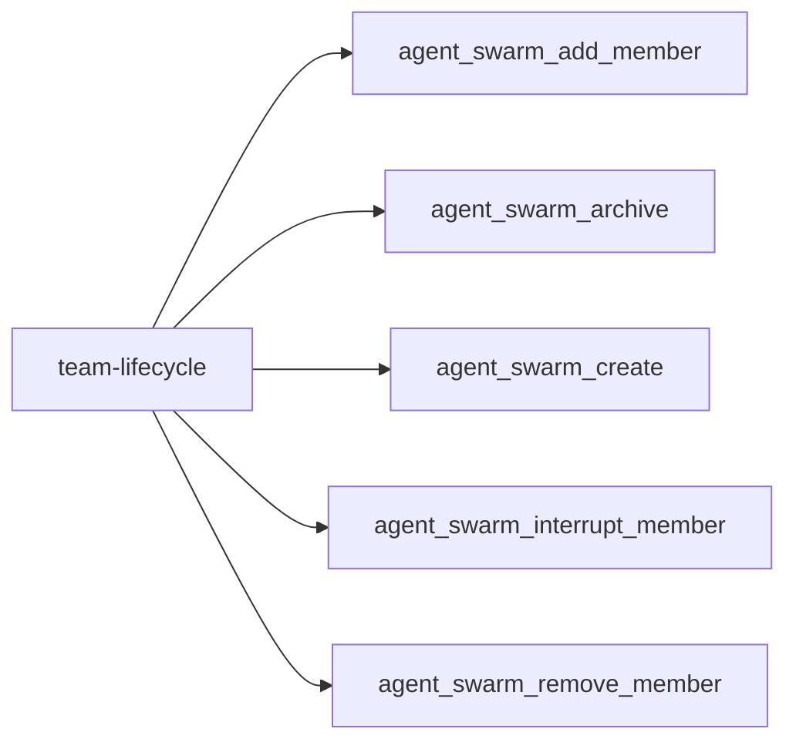
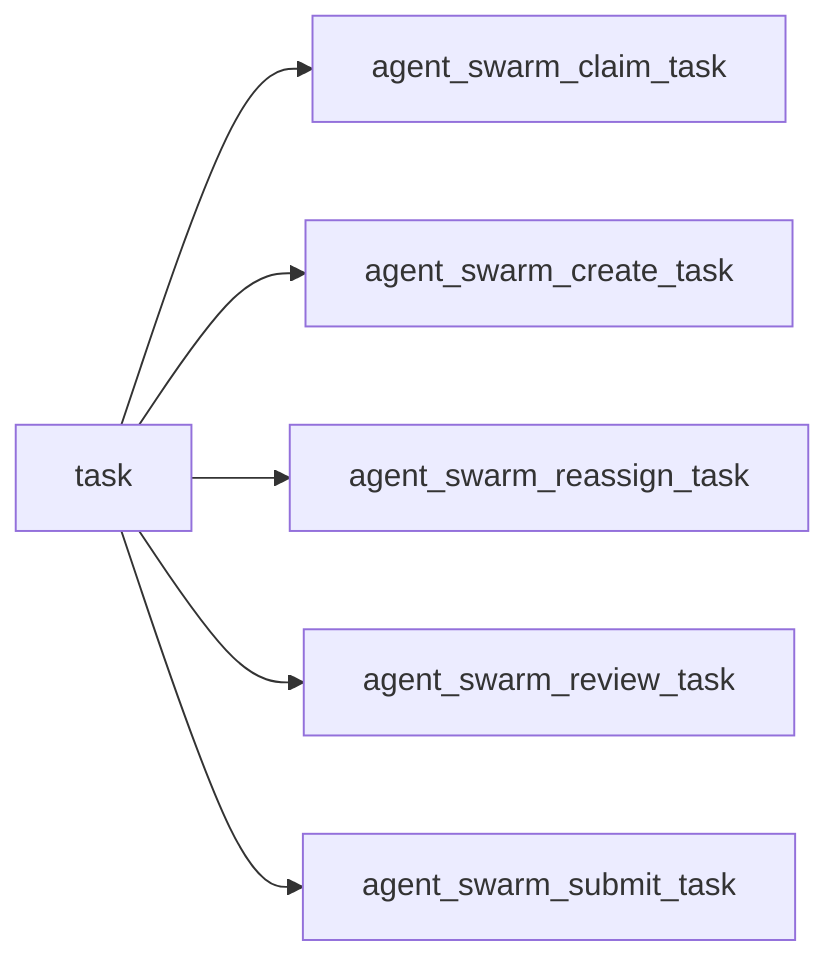
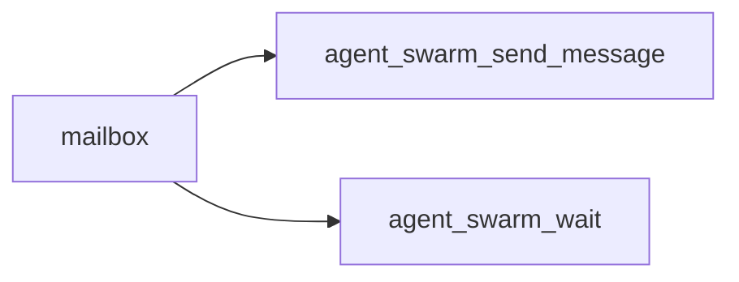
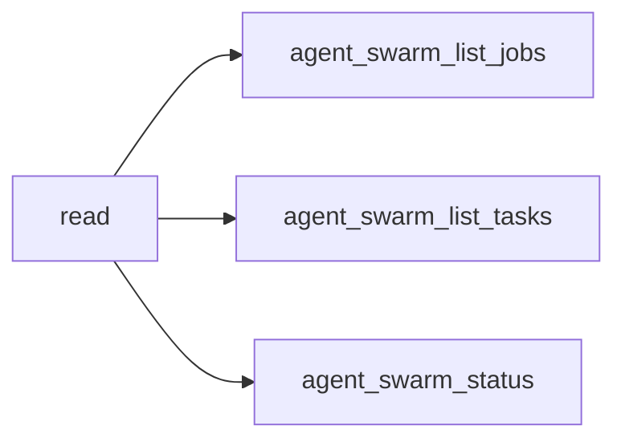
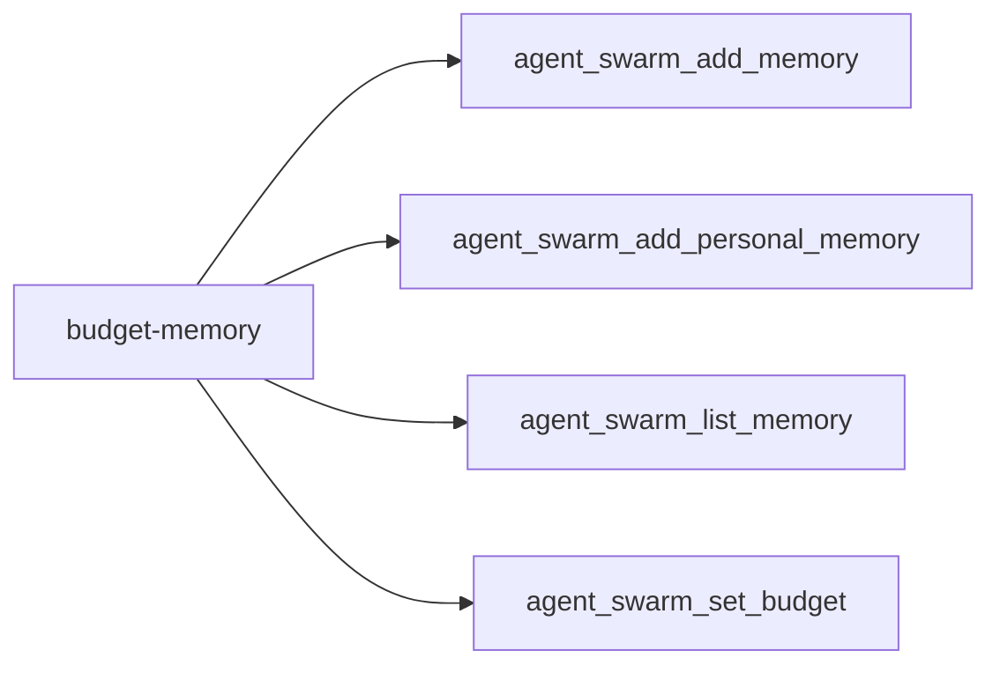

<!-- DO NOT EDIT: generated from docs/knowledge-graph/manifest.json -->

# Domain and state

Manifest digest: `2592b328010d51522d913c905eb3383011f8c631c880206b52c3267cfb840363`

Curated tool-registry digest: `331defbb12c4ac44efa0bdd7b16007d003dfa3704477b0c2c925d9cc1b665783`

> Claim ceiling: the registry is a reviewed capability overlay over exact source extraction. Per-tool deep semantic closure, acceptance, and real-Profile evidence remain explicit gaps; the complete mechanical graph is retained in `atlas.json`.

## Functional facets

| Functional facet | Title | Source anchors | Test anchors | Related tools | Evidence gaps |
|---|---|---|---|---|---|
| `team` | Team lifecycle authority | src/domain/team-domain.ts#TeamDomain | tests/team-domain.spec.ts | tool:agent_swarm_add_member tool:agent_swarm_archive tool:agent_swarm_create tool:agent_swarm_interrupt_member tool:agent_swarm_remove_member | NO_REAL_PROFILE_EVIDENCE PROFILE_DEPENDENT |
| `member` | Member provisioning and lifecycle | src/runtime/member-provisioning.ts#MemberProvisioner.addMember | tests/member-provisioning.spec.ts | tool:agent_swarm_add_member tool:agent_swarm_interrupt_member tool:agent_swarm_remove_member | NO_REAL_PROFILE_EVIDENCE PROFILE_DEPENDENT |
| `task` | Task board and attempt fencing | src/domain/team-domain-board.ts#claimTask | tests/team-assignment-checkpoint.spec.ts tests/model-experience.spec.ts | tool:agent_swarm_claim_task tool:agent_swarm_create_task tool:agent_swarm_reassign_task tool:agent_swarm_review_task tool:agent_swarm_submit_task | NO_REAL_PROFILE_EVIDENCE PROFILE_DEPENDENT |
| `message` | Durable Team mailbox and wakeup delivery | src/domain/team-domain-mailbox.ts#queueMessage src/runtime/message-delivery.ts#MessageDelivery.deliverQueuedMessage | tests/message-delivery.spec.ts | tool:agent_swarm_send_message tool:agent_swarm_wait | NO_REAL_PROFILE_EVIDENCE PROFILE_DEPENDENT |
| `memory` | Team and personal memory | src/runtime/memory-operations.ts#MemoryOperations.list src/runtime/memory-query.ts#lexicalScore | tests/memory-member-profile.spec.ts | tool:agent_swarm_add_memory tool:agent_swarm_add_personal_memory tool:agent_swarm_list_memory | NO_REAL_PROFILE_EVIDENCE PROFILE_DEPENDENT |
| `budget` | Budget limits, usage, and reservation admission | src/domain/team-domain-budget.ts#setBudget | tests/budget-family.spec.ts | tool:agent_swarm_set_budget | NO_REAL_PROFILE_EVIDENCE PROFILE_DEPENDENT |

## Tool families

### team-lifecycle

| Stable capability id | Operation | Domain relation | Transaction / effect summary |
|---|---|---|---|
| `tool:agent_swarm_add_member` | mutation | domain-transaction+external-effect | Provisions a continuable subagent and commits the member roster under Team authority. |
| `tool:agent_swarm_archive` | mutation | domain-transaction+external-effect | Irreversibly archives Team state, fences unfinished work, cancels queued mail, then drains members. |
| `tool:agent_swarm_create` | mutation | domain-transaction | Creates one durable Team aggregate and binds the live calling agent as captain. |
| `tool:agent_swarm_interrupt_member` | mutation | external-effect | Cancels one member turn through the continuable subagent boundary while preserving inbox, ownership, and roster state. |
| `tool:agent_swarm_remove_member` | mutation | domain-transaction+external-effect | Fences member attempts, requeues tasks, cancels queued mail, commits roster removal, then interrupts and drains the child. |

### task

| Stable capability id | Operation | Domain relation | Transaction / effect summary |
|---|---|---|---|
| `tool:agent_swarm_claim_task` | mutation | domain-transaction+external-effect | Revision-CAS claims a ready task, creates an attempt fence, and optionally allocates an execution root before delivery. |
| `tool:agent_swarm_create_task` | mutation | domain-transaction | Commits a dependency-aware task and may trigger priority-ready scheduling. |
| `tool:agent_swarm_reassign_task` | mutation | domain-transaction+external-effect | Fences the current attempt, returns the task to pending, and interrupts the prior assignee before fresh scheduling. |
| `tool:agent_swarm_review_task` | mutation | domain-transaction+external-effect | Runs the configured review provider and accepts or rejects the exact submitted attempt through the canonical review gate. |
| `tool:agent_swarm_submit_task` | mutation | domain-transaction | Submits the exact current attempt and evidence for captain review without completing the canonical task. |

### mailbox

| Stable capability id | Operation | Domain relation | Transaction / effect summary |
|---|---|---|---|
| `tool:agent_swarm_send_message` | mutation | domain-transaction+external-effect | Persists a Team message before quiet or wakeup best-effort delivery to the continuable recipient. |
| `tool:agent_swarm_wait` | read | revision-wait | Waits without polling for an authoritative Team revision change and returns unchanged at timeout. |

### read

| Stable capability id | Operation | Domain relation | Transaction / effect summary |
|---|---|---|---|
| `tool:agent_swarm_list_jobs` | read | projection-read | Reads the non-authoritative Team jobs projection and never creates or cancels jobs. |
| `tool:agent_swarm_list_tasks` | read | authoritative-read | Reads filtered task rows from the canonical Team aggregate with cursor pagination. |
| `tool:agent_swarm_status` | read | authoritative-read | Reads a fixed-size Team counter summary without embedding unbounded task rows. |

### budget-memory

| Stable capability id | Operation | Domain relation | Transaction / effect summary |
|---|---|---|---|
| `tool:agent_swarm_add_memory` | mutation | domain-transaction | Appends bounded durable Team memory to the canonical Team aggregate. |
| `tool:agent_swarm_add_personal_memory` | mutation | domain-transaction | Appends personal memory fenced to the live caller or a captain-selected active member. |
| `tool:agent_swarm_list_memory` | read | authoritative-read | Reads authorized Team or personal memories; semantic ranking may degrade explicitly to deterministic ranking. |
| `tool:agent_swarm_set_budget` | mutation | domain-transaction | Updates Team token, request, retry, and deadline limits while retaining accumulated usage. |

## Complete graph projection

```mermaid
flowchart LR
  n_617574686f726974793a70726f6a6563742d636f6e747261637473["Registered project contract authority"]
  n_617574686f726974793a736f757263652d74726565["Repository source-tree authority"]
  n_636865636b706f696e743a617474656d70742d64656c697665726564["Delivered attempt Team checkpoint"]
  n_636865636b706f696e743a617474656d70742d7265736572766564["Reserved attempt durable Team checkpoint"]
  n_636865636b706f696e743a73657373696f6e2d6672616d652d636c61696d6564["Claimed exact Session frame checkpoint"]
  n_646f6d61696e3a6167656e742d737761726d["Storage Domain agent_swarm v1"]
  n_646f6d61696e3a6167656e742d737761726d2d68756d616e["Storage Domain agent_swarm_human v1"]
  n_646f6d61696e3a6167656e742d737761726d2d776f726b666c6f77["Storage Domain agent_swarm_workflow v1"]
  n_656e746974793a6167656e742d737761726d2d68756d616e2f68756d616e696e746572616374696f6e7265636f7264["HumanInteractionRecord record"]
  n_656e746974793a6167656e742d737761726d2d776f726b666c6f772f776f726b666c6f7772756e6f7665726c61797265636f7264["WorkflowRunOverlayRecord record"]
  n_656e746974793a6167656e742d737761726d2f6d6967726174696f6e72656365697074["MigrationReceipt record"]
  n_656e746974793a6167656e742d737761726d2f7465616d7265636f7264["TeamRecord record"]
  n_656e746974793a636c69656e742d73657474696e67732f6167656e74737761726d73657474696e6773646f63756d656e74["AgentSwarmSettingsDocument: memberDenyTools, memberLlmProvider, memberModel, memberProvider, memberSkills, memoryQueryMaxCandidates, memoryQueryTimeoutMs, memorySemanticEnabled, memorySemanticModel, memorySemanticProvider"]
  n_656e746974793a7270632d736368656d612f6167656e74737761726d7265616472706364657073["RPC schema AgentSwarmReadRpcDeps"]
  n_656e746974793a7270632d736368656d612f737761726d5f726561645f7270635f636f6e74726163745f7631["RPC schema SWARM_READ_RPC_CONTRACT_V1"]
  n_656e746974793a7270632d736368656d612f737761726d5f726561645f7270635f66697874757265735f7631["RPC schema SWARM_READ_RPC_FIXTURES_V1"]
  n_656e746974793a7270632d736368656d612f737761726d7265616462696e64696e677631["RPC schema SwarmReadBindingV1"]
  n_656e746974793a7270632d736368656d612f737761726d726561646361706162696c697469657372657175657374["RPC schema SwarmReadCapabilitiesRequest"]
  n_656e746974793a7270632d736368656d612f737761726d726561646361706162696c69746965737631["RPC schema SwarmReadCapabilitiesV1"]
  n_656e746974793a7270632d736368656d612f737761726d726561646361706162696c697479["RPC schema SwarmReadCapability"]
  n_656e746974793a7270632d736368656d612f737761726d726561646361706162696c6974797374617465["RPC schema SwarmReadCapabilityState"]
  n_656e746974793a7270632d736368656d612f737761726d72656164706167656b696e64["RPC schema SwarmReadPageKind"]
  n_656e746974793a7270632d736368656d612f737761726d726561647061676572657175657374["RPC schema SwarmReadPageRequest"]
  n_656e746974793a7270632d736368656d612f737761726d72656164706167657631["RPC schema SwarmReadPageV1"]
  n_656e746974793a7270632d736368656d612f737761726d72656164727063656e76656c6f7065["RPC schema SwarmReadRpcEnvelope"]
  n_656e746974793a7270632d736368656d612f737761726d726561647270636661696c757265["RPC schema SwarmReadRpcFailure"]
  n_656e746974793a7270632d736368656d612f737761726d726561647270636d6574686f64["RPC schema SwarmReadRpcMethod"]
  n_656e746974793a7270632d736368656d612f737761726d7265616472706372657175657374["RPC schema SwarmReadRpcRequest"]
  n_656e746974793a7270632d736368656d612f737761726d7265616472706373756363657373["RPC schema SwarmReadRpcSuccess"]
  n_656e746974793a7270632d736368656d612f737761726d7265616472706376616c7565["RPC schema SwarmReadRpcValue"]
  n_646f6d61696e3a6167656e742d737761726d -->|contains| n_656e746974793a6167656e742d737761726d2f6d6967726174696f6e72656365697074
  n_646f6d61696e3a6167656e742d737761726d -->|contains| n_656e746974793a6167656e742d737761726d2f7465616d7265636f7264
  n_646f6d61696e3a6167656e742d737761726d2d68756d616e -->|contains| n_656e746974793a6167656e742d737761726d2d68756d616e2f68756d616e696e746572616374696f6e7265636f7264
  n_646f6d61696e3a6167656e742d737761726d2d776f726b666c6f77 -->|contains| n_656e746974793a6167656e742d737761726d2d776f726b666c6f772f776f726b666c6f7772756e6f7665726c61797265636f7264
  n_646f6d61696e3a6167656e742d737761726d -->|owns| n_636865636b706f696e743a617474656d70742d64656c697665726564
  n_646f6d61696e3a6167656e742d737761726d -->|owns| n_636865636b706f696e743a617474656d70742d7265736572766564
```

_View capped at 30 nodes and 60 edges; use atlas.json for the complete graph._

| Stable id | Kind | Classification | Implementation | Verification | Acceptance | Availability | Owner |
|---|---|---|---|---|---|---|---|
| `authority:project-contracts` | authority | REVIEWED | implemented | static | candidate | always-registered | `authority:project-contracts` |
| `authority:source-tree` | authority | MECHANICAL / UNCLASSIFIED | implemented | none | not-candidate | package-exported | `(unclassified)` |
| `checkpoint:attempt-delivered` | checkpoint | REVIEWED | implemented | static | candidate | always-registered | `domain:agent-swarm` |
| `checkpoint:attempt-reserved` | checkpoint | REVIEWED | implemented | static | candidate | always-registered | `domain:agent-swarm` |
| `checkpoint:session-frame-claimed` | checkpoint | REVIEWED | implemented | static | candidate | always-registered | `official-authority:session` |
| `domain:agent-swarm` | domain | REVIEWED | implemented | composition | candidate | always-registered | `domain:agent-swarm` |
| `domain:agent-swarm-human` | domain | MECHANICAL / UNCLASSIFIED | implemented | none | not-candidate | always-registered | `(unclassified)` |
| `domain:agent-swarm-workflow` | domain | MECHANICAL / UNCLASSIFIED | implemented | none | not-candidate | always-registered | `(unclassified)` |
| `entity:agent-swarm-human/humaninteractionrecord` | entity | MECHANICAL / UNCLASSIFIED | implemented | none | not-candidate | unavailable | `(unclassified)` |
| `entity:agent-swarm-workflow/workflowrunoverlayrecord` | entity | MECHANICAL / UNCLASSIFIED | implemented | none | not-candidate | unavailable | `(unclassified)` |
| `entity:agent-swarm/migrationreceipt` | entity | MECHANICAL / UNCLASSIFIED | implemented | none | not-candidate | unavailable | `(unclassified)` |
| `entity:agent-swarm/teamrecord` | entity | MECHANICAL / UNCLASSIFIED | implemented | none | not-candidate | unavailable | `(unclassified)` |
| `entity:client-settings/agentswarmsettingsdocument` | entity | MECHANICAL / UNCLASSIFIED | implemented | none | not-candidate | unavailable | `(unclassified)` |
| `entity:rpc-schema/agentswarmreadrpcdeps` | entity | MECHANICAL / UNCLASSIFIED | implemented | none | not-candidate | unavailable | `(unclassified)` |
| `entity:rpc-schema/swarm_read_rpc_contract_v1` | entity | MECHANICAL / UNCLASSIFIED | implemented | none | not-candidate | unavailable | `(unclassified)` |
| `entity:rpc-schema/swarm_read_rpc_fixtures_v1` | entity | MECHANICAL / UNCLASSIFIED | implemented | none | not-candidate | unavailable | `(unclassified)` |
| `entity:rpc-schema/swarmreadbindingv1` | entity | MECHANICAL / UNCLASSIFIED | implemented | none | not-candidate | unavailable | `(unclassified)` |
| `entity:rpc-schema/swarmreadcapabilitiesrequest` | entity | MECHANICAL / UNCLASSIFIED | implemented | none | not-candidate | unavailable | `(unclassified)` |
| `entity:rpc-schema/swarmreadcapabilitiesv1` | entity | MECHANICAL / UNCLASSIFIED | implemented | none | not-candidate | unavailable | `(unclassified)` |
| `entity:rpc-schema/swarmreadcapability` | entity | MECHANICAL / UNCLASSIFIED | implemented | none | not-candidate | unavailable | `(unclassified)` |
| `entity:rpc-schema/swarmreadcapabilitystate` | entity | MECHANICAL / UNCLASSIFIED | implemented | none | not-candidate | unavailable | `(unclassified)` |
| `entity:rpc-schema/swarmreadpagekind` | entity | MECHANICAL / UNCLASSIFIED | implemented | none | not-candidate | unavailable | `(unclassified)` |
| `entity:rpc-schema/swarmreadpagerequest` | entity | MECHANICAL / UNCLASSIFIED | implemented | none | not-candidate | unavailable | `(unclassified)` |
| `entity:rpc-schema/swarmreadpagev1` | entity | MECHANICAL / UNCLASSIFIED | implemented | none | not-candidate | unavailable | `(unclassified)` |
| `entity:rpc-schema/swarmreadrpcenvelope` | entity | MECHANICAL / UNCLASSIFIED | implemented | none | not-candidate | unavailable | `(unclassified)` |
| `entity:rpc-schema/swarmreadrpcfailure` | entity | MECHANICAL / UNCLASSIFIED | implemented | none | not-candidate | unavailable | `(unclassified)` |
| `entity:rpc-schema/swarmreadrpcmethod` | entity | MECHANICAL / UNCLASSIFIED | implemented | none | not-candidate | unavailable | `(unclassified)` |
| `entity:rpc-schema/swarmreadrpcrequest` | entity | MECHANICAL / UNCLASSIFIED | implemented | none | not-candidate | unavailable | `(unclassified)` |
| `entity:rpc-schema/swarmreadrpcsuccess` | entity | MECHANICAL / UNCLASSIFIED | implemented | none | not-candidate | unavailable | `(unclassified)` |
| `entity:rpc-schema/swarmreadrpcvalue` | entity | MECHANICAL / UNCLASSIFIED | implemented | none | not-candidate | unavailable | `(unclassified)` |
| `entity:rpc-schema/swarmreadstatusv1` | entity | MECHANICAL / UNCLASSIFIED | implemented | none | not-candidate | unavailable | `(unclassified)` |
| `entity:rpc-schema/swarmreadtargethint` | entity | MECHANICAL / UNCLASSIFIED | implemented | none | not-candidate | unavailable | `(unclassified)` |
| `entity:rpc-schema/swarmreadtargetrequest` | entity | MECHANICAL / UNCLASSIFIED | implemented | none | not-candidate | unavailable | `(unclassified)` |
| `entity:rpc-schema/swarmrequesttrustfacts` | entity | MECHANICAL / UNCLASSIFIED | implemented | none | not-candidate | unavailable | `(unclassified)` |
| `entity:rpc-schema/swarmrequesttrustresult` | entity | MECHANICAL / UNCLASSIFIED | implemented | none | not-candidate | unavailable | `(unclassified)` |
| `entity:rpc-schema/swarmwebserver` | entity | MECHANICAL / UNCLASSIFIED | implemented | none | not-candidate | unavailable | `(unclassified)` |
| `entity:session-assignment-frame` | entity | REVIEWED | implemented | static | candidate | always-registered | `official-authority:session` |
| `entity:task-attempt` | entity | REVIEWED | implemented | static | candidate | always-registered | `domain:agent-swarm` |
| `entity:team-request-budget` | entity | REVIEWED | implemented | static | candidate | always-registered | `domain:agent-swarm` |
| `entity:team-task` | entity | REVIEWED | implemented | static | candidate | always-registered | `domain:agent-swarm` |
| `fence:current-attempt-id` | fence | REVIEWED | implemented | static | candidate | always-registered | `domain:agent-swarm` |
| `fence:exact-assignment-frame` | fence | REVIEWED | implemented | static | candidate | always-registered | `official-authority:session` |
| `fence:task-revision` | fence | REVIEWED | implemented | static | candidate | always-registered | `domain:agent-swarm` |
| `official-authority:session` | official-authority | REVIEWED | implemented | static | candidate | always-registered | `official-authority:session` |
| `official-authority:subagent` | official-authority | REVIEWED | implemented | static | candidate | always-registered | `official-authority:subagent` |
| `state:attempt-assignment-phase` | state | REVIEWED | implemented | static | candidate | always-registered | `domain:agent-swarm` |
| `state:discriminant/humaninteractionorigin/kind` | state | MECHANICAL / UNCLASSIFIED | implemented | none | not-candidate | unavailable | `(unclassified)` |
| `state:discriminant/humaninteractionreceipt/status` | state | MECHANICAL / UNCLASSIFIED | implemented | none | not-candidate | unavailable | `(unclassified)` |
| `state:discriminant/humaninteractionrecord/schemaversion` | state | MECHANICAL / UNCLASSIFIED | implemented | none | not-candidate | unavailable | `(unclassified)` |
| `state:discriminant/humaninteractionrequest/decision` | state | MECHANICAL / UNCLASSIFIED | implemented | none | not-candidate | unavailable | `(unclassified)` |
| `state:discriminant/humaninteractionrequest/intent` | state | MECHANICAL / UNCLASSIFIED | implemented | none | not-candidate | unavailable | `(unclassified)` |
| `state:discriminant/humaninteractionrequest/schemaversion` | state | MECHANICAL / UNCLASSIFIED | implemented | none | not-candidate | unavailable | `(unclassified)` |
| `state:discriminant/humaninteractionsource/kind` | state | MECHANICAL / UNCLASSIFIED | implemented | none | not-candidate | unavailable | `(unclassified)` |
| `state:discriminant/humaninteractiontarget/kind` | state | MECHANICAL / UNCLASSIFIED | implemented | none | not-candidate | unavailable | `(unclassified)` |
| `state:discriminant/taskattempt/assignmentphase` | state | MECHANICAL / UNCLASSIFIED | implemented | none | not-candidate | unavailable | `(unclassified)` |
| `state:discriminant/taskattempt/phase` | state | MECHANICAL / UNCLASSIFIED | implemented | none | not-candidate | unavailable | `(unclassified)` |
| `state:discriminant/teammember/modelsource` | state | MECHANICAL / UNCLASSIFIED | implemented | none | not-candidate | unavailable | `(unclassified)` |
| `state:discriminant/teammember/phase` | state | MECHANICAL / UNCLASSIFIED | implemented | none | not-candidate | unavailable | `(unclassified)` |
| `state:discriminant/teammemberprovisioninput/modelsource` | state | MECHANICAL / UNCLASSIFIED | implemented | none | not-candidate | unavailable | `(unclassified)` |
| `state:discriminant/teammembership/role` | state | MECHANICAL / UNCLASSIFIED | implemented | none | not-candidate | unavailable | `(unclassified)` |
| `state:discriminant/teammemoryentry/category` | state | MECHANICAL / UNCLASSIFIED | implemented | none | not-candidate | unavailable | `(unclassified)` |
| `state:discriminant/teammemoryentry/scope` | state | MECHANICAL / UNCLASSIFIED | implemented | none | not-candidate | unavailable | `(unclassified)` |
| `state:discriminant/teammessage/delivery` | state | MECHANICAL / UNCLASSIFIED | implemented | none | not-candidate | unavailable | `(unclassified)` |
| `state:discriminant/teammessage/phase` | state | MECHANICAL / UNCLASSIFIED | implemented | none | not-candidate | unavailable | `(unclassified)` |
| `state:discriminant/teamstate/phase` | state | MECHANICAL / UNCLASSIFIED | implemented | none | not-candidate | unavailable | `(unclassified)` |
| `state:discriminant/teamstate/schemaversion` | state | MECHANICAL / UNCLASSIFIED | implemented | none | not-candidate | unavailable | `(unclassified)` |
| `state:discriminant/teamtask/status` | state | MECHANICAL / UNCLASSIFIED | implemented | none | not-candidate | unavailable | `(unclassified)` |
| `state:discriminant/workflowrunoverlayrecord/schemaversion` | state | MECHANICAL / UNCLASSIFIED | implemented | none | not-candidate | unavailable | `(unclassified)` |
| `state:discriminant/workflowrunoverlayrecord/state` | state | MECHANICAL / UNCLASSIFIED | implemented | none | not-candidate | unavailable | `(unclassified)` |
| `state:discriminant/workflowrunoverlayrecord/stopreason` | state | MECHANICAL / UNCLASSIFIED | implemented | none | not-candidate | unavailable | `(unclassified)` |
| `state:rpc-union/swarmreadcapability` | state | MECHANICAL / UNCLASSIFIED | implemented | none | not-candidate | unavailable | `(unclassified)` |
| `state:rpc-union/swarmreadpagekind` | state | MECHANICAL / UNCLASSIFIED | implemented | none | not-candidate | unavailable | `(unclassified)` |
| `state:rpc-union/swarmreadrpcmethod` | state | MECHANICAL / UNCLASSIFIED | implemented | none | not-candidate | unavailable | `(unclassified)` |
| `state:session-frame-visibility` | state | REVIEWED | implemented | static | candidate | always-registered | `official-authority:session` |
| `state:team-budget-used-requests` | state | REVIEWED | implemented | static | candidate | always-registered | `domain:agent-swarm` |
| `state:union/humaninteractionintent` | state | MECHANICAL / UNCLASSIFIED | implemented | none | not-candidate | unavailable | `(unclassified)` |
| `state:union/humaninteractionstatus` | state | MECHANICAL / UNCLASSIFIED | implemented | none | not-candidate | unavailable | `(unclassified)` |
| `state:union/taskattemptphase` | state | MECHANICAL / UNCLASSIFIED | implemented | none | not-candidate | unavailable | `(unclassified)` |
| `state:union/teammemberphase` | state | MECHANICAL / UNCLASSIFIED | implemented | none | not-candidate | unavailable | `(unclassified)` |
| `state:union/teammemorycategory` | state | MECHANICAL / UNCLASSIFIED | implemented | none | not-candidate | unavailable | `(unclassified)` |
| `state:union/teammessagedelivery` | state | MECHANICAL / UNCLASSIFIED | implemented | none | not-candidate | unavailable | `(unclassified)` |
| `state:union/teammessagephase` | state | MECHANICAL / UNCLASSIFIED | implemented | none | not-candidate | unavailable | `(unclassified)` |
| `state:union/teamtaskstatus` | state | MECHANICAL / UNCLASSIFIED | implemented | none | not-candidate | unavailable | `(unclassified)` |
| `state:union/workflowrunoverlaystate` | state | MECHANICAL / UNCLASSIFIED | implemented | none | not-candidate | unavailable | `(unclassified)` |
| `transaction:acknowledge-assignment` | transaction | REVIEWED | implemented | static | candidate | always-registered | `domain:agent-swarm` |
| `transaction:cancel-undelivered-assignment` | transaction | REVIEWED | implemented | static | candidate | always-registered | `domain:agent-swarm` |
| `transaction:claim-task` | transaction | REVIEWED | implemented | static | candidate | always-registered | `domain:agent-swarm` |
