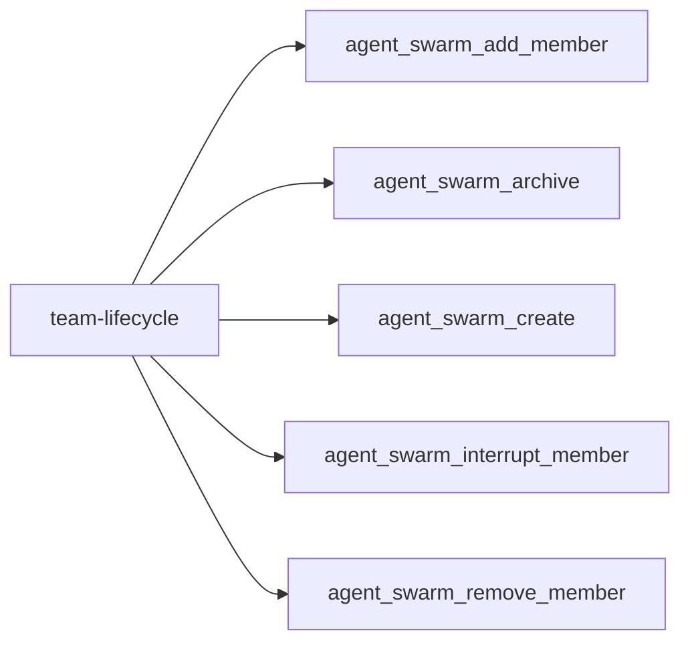
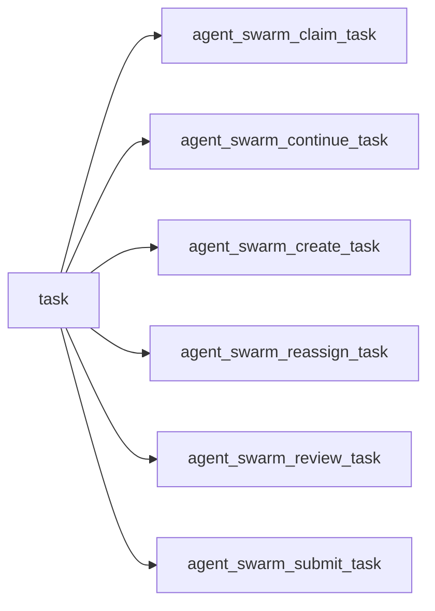
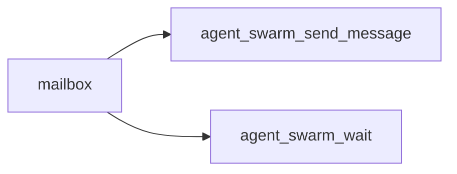
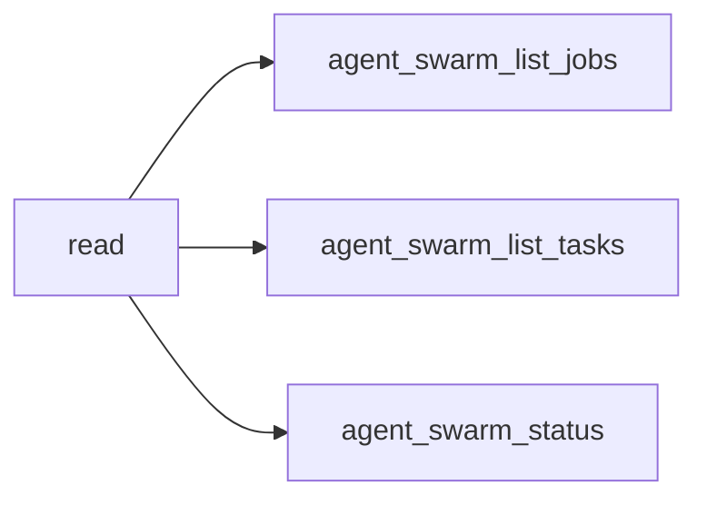
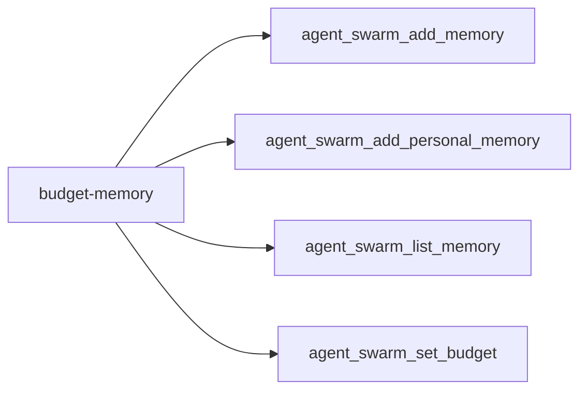

<!-- DO NOT EDIT: generated from docs/knowledge-graph/manifest.json -->

# Effects and recovery

Manifest digest: `7235e0c2e18f734d08125d6fb242613054ad4e8e09ef66c5d0d81fc412405edc`

Curated tool-registry digest: `c5d326eaafe8ee14415e4ad0f73e97f429ef152cd80f5192e2747529fad49c09`

> Claim ceiling: the registry is a reviewed capability overlay over exact source extraction. Per-tool deep semantic closure, acceptance, and real-Profile evidence remain explicit gaps; the complete mechanical graph is retained in `atlas.json`.

## Functional facets

| Functional facet | Title | Source anchors | Test anchors | Related tools | Evidence gaps |
|---|---|---|---|---|---|
| `member` | Member provisioning and lifecycle | src/runtime/member-provisioning.ts#MemberProvisioner.addMember | tests/member-provisioning.spec.ts | tool:agent_swarm_add_member tool:agent_swarm_interrupt_member tool:agent_swarm_remove_member | NO_REAL_PROFILE_EVIDENCE PROFILE_DEPENDENT |
| `task` | Task board and attempt fencing | src/domain/team-domain-board.ts#claimTask | tests/team-assignment-checkpoint.spec.ts tests/model-experience.spec.ts | tool:agent_swarm_claim_task tool:agent_swarm_continue_task tool:agent_swarm_create_task tool:agent_swarm_reassign_task tool:agent_swarm_review_task tool:agent_swarm_submit_task | NO_REAL_PROFILE_EVIDENCE PROFILE_DEPENDENT |
| `message` | Durable Team mailbox and wakeup delivery | src/domain/team-domain-mailbox.ts#queueMessage src/runtime/message-delivery.ts#MessageDelivery.deliverQueuedMessage | tests/message-delivery.spec.ts | tool:agent_swarm_send_message tool:agent_swarm_wait | NO_REAL_PROFILE_EVIDENCE PROFILE_DEPENDENT |
| `workflow` | Workflow bridge and scripted Team runs | src/runtime/workflow/team-bridge-engine.ts#TeamBridgeWorkflowEngine src/runtime/workflow/team-run.ts#TeamRun | tests/workflow-bridge.spec.ts | tool:agent_swarm_create_task tool:agent_swarm_review_task tool:agent_swarm_submit_task | NO_REAL_PROFILE_EVIDENCE PROFILE_DEPENDENT |
| `jobs` | Read-only Team jobs projection | src/runtime/jobs/team-job-projection.ts#TeamJobProjection | tests/jobs-reader.spec.ts tests/jobs-bridge.spec.ts | tool:agent_swarm_list_jobs | NO_REAL_PROFILE_EVIDENCE PROFILE_DEPENDENT CONFIG_DISABLED_BY_DEFAULT |

## Tool families

### team-lifecycle

| Stable capability id | Effect | Recovery / failure | Explicit evidence gaps |
|---|---|---|---|
| `tool:agent_swarm_add_member` | domain-transaction+external-effect | Provisioning validation fails before roster commit; post-provision commit failure is compensated by member teardown, while unknown provider state fails loud. | NO_REAL_PROFILE_EVIDENCE PROFILE_DEPENDENT PER_TOOL_DEEP_SEMANTICS_DEFERRED |
| `tool:agent_swarm_archive` | domain-transaction+external-effect | The durable archive transition is authoritative; member drain failures remain explicit cleanup failures and must not resurrect the Team. | NO_DIRECT_TEST NO_COMPOSITION_TEST NO_REAL_PROFILE_EVIDENCE PROFILE_DEPENDENT PER_TOOL_DEEP_SEMANTICS_DEFERRED |
| `tool:agent_swarm_create` | domain-transaction | Duplicate active ownership and validation fail closed; durable commit failure publishes no Team result. | NO_REAL_PROFILE_EVIDENCE PROFILE_DEPENDENT PER_TOOL_DEEP_SEMANTICS_DEFERRED |
| `tool:agent_swarm_interrupt_member` | external-effect | Admission fails without host evidence; an interrupt transport failure preserves canonical Team ownership and must be observed before retry. | NO_REAL_PROFILE_EVIDENCE PROFILE_DEPENDENT PER_TOOL_DEEP_SEMANTICS_DEFERRED |
| `tool:agent_swarm_remove_member` | domain-transaction+external-effect | The fenced Team mutation is authoritative once committed; interruption or drain failure remains explicit cleanup work and cannot restore ownership. | NO_DIRECT_TEST NO_COMPOSITION_TEST NO_REAL_PROFILE_EVIDENCE PROFILE_DEPENDENT PER_TOOL_DEEP_SEMANTICS_DEFERRED |

### task

| Stable capability id | Effect | Recovery / failure | Explicit evidence gaps |
|---|---|---|---|
| `tool:agent_swarm_claim_task` | domain-transaction+external-effect | Stale revision or unavailable work fails before ownership transfer; assignment delivery uses the D1 exact-read-back recovery closure, while execution-root availability remains configuration-dependent. | NO_REAL_PROFILE_EVIDENCE PROFILE_DEPENDENT PER_TOOL_DEEP_SEMANTICS_DEFERRED |
| `tool:agent_swarm_continue_task` | domain-transaction+external-effect | Stale revision, owner, Attempt, or competing intent fails before mutation; a cold entered dispatch holds the official unpublished Session reservation while one Team transaction folds exact terminal evidence, or becomes durable dispatch-unknown without retry. Pre-dispatch cold recovery remains unaccepted. | NO_REAL_PROFILE_EVIDENCE PROFILE_DEPENDENT CONFIG_DISABLED_BY_DEFAULT PER_TOOL_DEEP_SEMANTICS_DEFERRED |
| `tool:agent_swarm_create_task` | domain-transaction | Invalid dependencies, verification declarations, reservation floors, or size limits fail before task commit; scheduling follows committed state. | NO_REAL_PROFILE_EVIDENCE PROFILE_DEPENDENT PER_TOOL_DEEP_SEMANTICS_DEFERRED |
| `tool:agent_swarm_reassign_task` | domain-transaction+external-effect | Revision or attempt mismatch fails closed; the fenced Team transition remains authoritative if later interruption or rescheduling fails. | NO_DIRECT_TEST NO_COMPOSITION_TEST NO_REAL_PROFILE_EVIDENCE PROFILE_DEPENDENT PER_TOOL_DEEP_SEMANTICS_DEFERRED |
| `tool:agent_swarm_review_task` | domain-transaction+external-effect | Provider failure does not self-accept; stale attempts fail closed and an unknown verification result requires authoritative task read-back before retry. | NO_REAL_PROFILE_EVIDENCE PROFILE_DEPENDENT PER_TOOL_DEEP_SEMANTICS_DEFERRED |
| `tool:agent_swarm_submit_task` | domain-transaction | Stale attempt or revision fails closed and the caller must stop; commit failure does not imply submission and requires authoritative task read-back. | NO_REAL_PROFILE_EVIDENCE PROFILE_DEPENDENT PER_TOOL_DEEP_SEMANTICS_DEFERRED |

### mailbox

| Stable capability id | Effect | Recovery / failure | Explicit evidence gaps |
|---|---|---|---|
| `tool:agent_swarm_send_message` | domain-transaction+external-effect | A queued result is durable and must not be resent; delivery failure preserves queued authority for later retry or cold resume. | NO_REAL_PROFILE_EVIDENCE PROFILE_DEPENDENT PER_TOOL_DEEP_SEMANTICS_DEFERRED |
| `tool:agent_swarm_wait` | revision-wait | Caller cancellation fails with TEAM_WAIT_ABORTED; timeout is an unchanged read result and no_progress returns immediately when waiting cannot help. | NO_REAL_PROFILE_EVIDENCE PROFILE_DEPENDENT PER_TOOL_DEEP_SEMANTICS_DEFERRED |

### read

| Stable capability id | Effect | Recovery / failure | Explicit evidence gaps |
|---|---|---|---|
| `tool:agent_swarm_list_jobs` | projection-read | Fails loud with TEAM_JOBS_BRIDGE_DISABLED when the projection is absent; invalid cursor or limit fails before projection read. | NO_REAL_PROFILE_EVIDENCE PROFILE_DEPENDENT CONFIG_DISABLED_BY_DEFAULT PER_TOOL_DEEP_SEMANTICS_DEFERRED |
| `tool:agent_swarm_list_tasks` | authoritative-read | Invalid filters, cursor, or limit fail before the read; retries are read-only and use the returned revision/cursor context. | NO_REAL_PROFILE_EVIDENCE PROFILE_DEPENDENT PER_TOOL_DEEP_SEMANTICS_DEFERRED |
| `tool:agent_swarm_status` | authoritative-read | Read or authorization failure has no mutation; callers may retry after checking active Team identity. | NO_REAL_PROFILE_EVIDENCE PROFILE_DEPENDENT PER_TOOL_DEEP_SEMANTICS_DEFERRED |

### budget-memory

| Stable capability id | Effect | Recovery / failure | Explicit evidence gaps |
|---|---|---|---|
| `tool:agent_swarm_add_memory` | domain-transaction | Validation or durable commit failure returns an error and does not publish a memory id; callers must read authoritative memory before uncertain retry. | NO_REAL_PROFILE_EVIDENCE PROFILE_DEPENDENT PER_TOOL_DEEP_SEMANTICS_DEFERRED |
| `tool:agent_swarm_add_personal_memory` | domain-transaction | Ownership mismatch and inactive owners fail closed; commit failure publishes no successful result and requires authoritative read-back before retry. | NO_DIRECT_TEST NO_COMPOSITION_TEST NO_REAL_PROFILE_EVIDENCE PROFILE_DEPENDENT PER_TOOL_DEEP_SEMANTICS_DEFERRED |
| `tool:agent_swarm_list_memory` | authoritative-read | Authorization, cursor, and bound failures are terminal for the call; semantic provider failure returns an explicit degraded deterministic strategy. | NO_DIRECT_TEST NO_COMPOSITION_TEST NO_REAL_PROFILE_EVIDENCE PROFILE_DEPENDENT PER_TOOL_DEEP_SEMANTICS_DEFERRED |
| `tool:agent_swarm_set_budget` | domain-transaction | Invalid limits fail before mutation; durable commit failure retains prior limits and usage and must be read back before retry. | NO_DIRECT_TEST NO_COMPOSITION_TEST NO_REAL_PROFILE_EVIDENCE PROFILE_DEPENDENT PER_TOOL_DEEP_SEMANTICS_DEFERRED |

## Complete graph projection

```mermaid
flowchart LR
  n_636865636b706f696e743a617474656d70742d64656c697665726564["Delivered attempt Team checkpoint"]
  n_636865636b706f696e743a617474656d70742d7265736572766564["Reserved attempt durable Team checkpoint"]
  n_636865636b706f696e743a66726573682d76322d61737369676e6d656e742d6672616d652d64757261626c65["Initial assignment Session frame is durable"]
  n_636865636b706f696e743a66726573682d76322d617373697374616e742d65766964656e63652d64757261626c65["Assistant evidence Session flush succeeded"]
  n_636865636b706f696e743a66726573682d76322d64697370617463682d656e74657265642d726561646261636b["Dispatch-entered Team read-back succeeded"]
  n_636865636b706f696e743a66726573682d76322d64697370617463682d70656e64696e672d726561646261636b["Dispatch-pending Team read-back succeeded"]
  n_636865636b706f696e743a73657373696f6e2d6672616d652d636c61696d6564["Claimed exact Session frame checkpoint"]
  n_66656e63653a63757272656e742d617474656d70742d6964["Task currentAttemptId exact fence"]
  n_66656e63653a65786163742d61737369676e6d656e742d6672616d65["Byte-exact assignment frame identity fence"]
  n_66656e63653a66726573682d76322d63757272656e742d617474656d70742d7475706c65["Exact task/Attempt/member causal tuple"]
  n_66656e63653a66726573682d76322d64697370617463682d6964656e74697479["Exact dispatch id/effect/turn/step identity"]
  n_66656e63653a66726573682d76322d696e697469616c2d70726f6d70742d646967657374["Exact initial prompt digest"]
  n_66656e63653a7461736b2d7265766973696f6e["Task revision CAS fence"]
  n_666c6f772d6272616e63683a61737369676e6d656e742d64656c69766572792f616273656e74["Assignment absent"]
  n_666c6f772d6272616e63683a61737369676e6d656e742d64656c69766572792f61646d697373696f6e2d72656a6563746564["Assignment admission rejected"]
  n_666c6f772d6272616e63683a61737369676e6d656e742d64656c69766572792f61646d697373696f6e2d756e6b6e6f776e["Assignment admission unknown"]
  n_666c6f772d6272616e63683a61737369676e6d656e742d64656c69766572792f636c61696d2d7265736572766564["Assignment claim reserved"]
  n_666c6f772d6272616e63683a61737369676e6d656e742d64656c69766572792f636c61696d6564["Assignment claimed"]
  n_666c6f772d6272616e63683a61737369676e6d656e742d64656c69766572792f70656e64696e67["Assignment pending"]
  n_666c6f772d6272616e63683a61737369676e6d656e742d64656c69766572792f756e6b6e6f776e["Assignment unknown"]
  n_666c6f772d6272616e63683a66726573682d76322d696e697469616c2d64697370617463682f617373697374616e742d65766964656e63652d756e64757261626c65["assistant evidence undurable"]
  n_666c6f772d6272616e63683a66726573682d76322d696e697469616c2d64697370617463682f636f6c642d64697370617463682d656e74657265642d756e636c6173736966696564["cold dispatch entered unclassified"]
  n_666c6f772d6272616e63683a66726573682d76322d696e697469616c2d64697370617463682f636f6c642d64697370617463682d70656e64696e672d7265636f766572792d7265736572766564["cold dispatch pending recovery reserved"]
  n_666c6f772d6272616e63683a66726573682d76322d696e697469616c2d64697370617463682f636f6c642d65766964656e63652d756e7265666f6c646564["cold evidence unrefolded"]
  n_666c6f772d6272616e63683a66726573682d76322d696e697469616c2d64697370617463682f636f6c642d7265636f766572792d747269676765722d756e64656c697665726564["cold recovery trigger undelivered"]
  n_666c6f772d6272616e63683a66726573682d76322d696e697469616c2d64697370617463682f636f6c642d7374617274696e672d756e7265636f6e63696c6564["cold starting unreconciled"]
  n_666c6f772d6272616e63683a66726573682d76322d696e697469616c2d64697370617463682f64697370617463682d70656e64696e672d68656c64["dispatch pending held"]
  n_666c6f772d6272616e63683a66726573682d76322d696e697469616c2d64697370617463682f646f776e73747265616d2d6661696c65642d61667465722d656e7465726564["downstream failed after entered"]
  n_666c6f772d6272616e63683a66726573682d76322d696e697469616c2d64697370617463682f7072652d6d6f64656c2d626172726965722d72656a6563746564["pre model barrier rejected"]
  n_666c6f772d6272616e63683a66726573682d76322d696e697469616c2d64697370617463682f70726f76696465722d73746172742d72656a6563746564["provider start rejected"]
```

_View capped at 30 nodes and 60 edges; use atlas.json for the complete graph._

| Stable id | Kind | Classification | Implementation | Verification | Acceptance | Availability | Owner |
|---|---|---|---|---|---|---|---|
| `checkpoint:attempt-delivered` | checkpoint | REVIEWED | implemented | static | candidate | always-registered | `domain:agent-swarm` |
| `checkpoint:attempt-reserved` | checkpoint | REVIEWED | implemented | static | candidate | always-registered | `domain:agent-swarm` |
| `checkpoint:fresh-v2-assignment-frame-durable` | checkpoint | REVIEWED | implemented | composition | candidate | config-gated | `official-authority:session` |
| `checkpoint:fresh-v2-assistant-evidence-durable` | checkpoint | REVIEWED | implemented | composition | candidate | config-gated | `official-authority:session` |
| `checkpoint:fresh-v2-dispatch-entered-readback` | checkpoint | REVIEWED | implemented | composition | candidate | config-gated | `domain:agent-swarm` |
| `checkpoint:fresh-v2-dispatch-pending-readback` | checkpoint | REVIEWED | implemented | composition | candidate | config-gated | `domain:agent-swarm` |
| `checkpoint:session-frame-claimed` | checkpoint | REVIEWED | implemented | static | candidate | always-registered | `official-authority:session` |
| `fence:current-attempt-id` | fence | REVIEWED | implemented | static | candidate | always-registered | `domain:agent-swarm` |
| `fence:exact-assignment-frame` | fence | REVIEWED | implemented | static | candidate | always-registered | `official-authority:session` |
| `fence:fresh-v2-current-attempt-tuple` | fence | REVIEWED | implemented | composition | candidate | config-gated | `domain:agent-swarm` |
| `fence:fresh-v2-dispatch-identity` | fence | REVIEWED | implemented | composition | candidate | config-gated | `domain:agent-swarm` |
| `fence:fresh-v2-initial-prompt-digest` | fence | REVIEWED | implemented | composition | candidate | config-gated | `official-authority:session` |
| `fence:task-revision` | fence | REVIEWED | implemented | static | candidate | always-registered | `domain:agent-swarm` |
| `flow-branch:assignment-delivery/absent` | flow-branch | REVIEWED | implemented | static | candidate | always-registered | `domain:agent-swarm` |
| `flow-branch:assignment-delivery/admission-rejected` | flow-branch | REVIEWED | implemented | static | candidate | always-registered | `domain:agent-swarm` |
| `flow-branch:assignment-delivery/admission-unknown` | flow-branch | REVIEWED | implemented | static | candidate | always-registered | `domain:agent-swarm` |
| `flow-branch:assignment-delivery/claim-reserved` | flow-branch | REVIEWED | implemented | static | candidate | always-registered | `domain:agent-swarm` |
| `flow-branch:assignment-delivery/claimed` | flow-branch | REVIEWED | implemented | static | candidate | always-registered | `domain:agent-swarm` |
| `flow-branch:assignment-delivery/pending` | flow-branch | REVIEWED | implemented | static | candidate | always-registered | `domain:agent-swarm` |
| `flow-branch:assignment-delivery/unknown` | flow-branch | REVIEWED | implemented | static | candidate | always-registered | `domain:agent-swarm` |
| `flow-branch:fresh-v2-initial-dispatch/assistant-evidence-undurable` | flow-branch | REVIEWED | implemented | composition | candidate | config-gated | `domain:agent-swarm` |
| `flow-branch:fresh-v2-initial-dispatch/cold-dispatch-entered-unclassified` | flow-branch | REVIEWED | absent | none | not-candidate | unavailable | `domain:agent-swarm` |
| `flow-branch:fresh-v2-initial-dispatch/cold-dispatch-pending-recovery-reserved` | flow-branch | REVIEWED | implemented | composition | candidate | config-gated | `domain:agent-swarm` |
| `flow-branch:fresh-v2-initial-dispatch/cold-evidence-unrefolded` | flow-branch | REVIEWED | absent | none | not-candidate | unavailable | `domain:agent-swarm` |
| `flow-branch:fresh-v2-initial-dispatch/cold-recovery-trigger-undelivered` | flow-branch | REVIEWED | absent | none | not-candidate | unavailable | `domain:agent-swarm` |
| `flow-branch:fresh-v2-initial-dispatch/cold-starting-unreconciled` | flow-branch | REVIEWED | absent | none | not-candidate | unavailable | `domain:agent-swarm` |
| `flow-branch:fresh-v2-initial-dispatch/dispatch-pending-held` | flow-branch | REVIEWED | implemented | composition | candidate | config-gated | `domain:agent-swarm` |
| `flow-branch:fresh-v2-initial-dispatch/downstream-failed-after-entered` | flow-branch | REVIEWED | implemented | composition | candidate | config-gated | `domain:agent-swarm` |
| `flow-branch:fresh-v2-initial-dispatch/pre-model-barrier-rejected` | flow-branch | REVIEWED | implemented | composition | candidate | config-gated | `domain:agent-swarm` |
| `flow-branch:fresh-v2-initial-dispatch/provider-start-rejected` | flow-branch | REVIEWED | implemented | composition | candidate | config-gated | `domain:agent-swarm` |
| `flow-branch:fresh-v2-initial-dispatch/provider-start-result-unknown` | flow-branch | REVIEWED | absent | none | not-candidate | unavailable | `domain:agent-swarm` |
| `flow-branch:fresh-v2-online-continuation/cold-recovery-trigger-undelivered` | flow-branch | REVIEWED | absent | none | not-candidate | unavailable | `domain:agent-swarm` |
| `flow:assignment-delivery` | flow | REVIEWED | implemented | static | candidate | always-registered | `domain:agent-swarm` |
| `flow:fresh-v2-initial-dispatch` | flow | REVIEWED | implemented | real-profile | candidate | config-gated | `domain:agent-swarm` |
| `flow:fresh-v2-online-continuation` | flow | REVIEWED | implemented | composition | candidate | config-gated | `domain:agent-swarm` |
| `provider:builtin/src/runtime/execution-roots.ts/providers/git-worktree` | provider | MECHANICAL / UNCLASSIFIED | implemented | none | not-candidate | always-registered | `(unclassified)` |
| `provider:builtin/src/runtime/orchestrator-runtime.ts/reviewproviders/executable` | provider | MECHANICAL / UNCLASSIFIED | implemented | none | not-candidate | always-registered | `(unclassified)` |
| `provider:builtin/src/runtime/orchestrator-runtime.ts/reviewproviders/manual` | provider | MECHANICAL / UNCLASSIFIED | implemented | none | not-candidate | always-registered | `(unclassified)` |
| `provider:builtin/src/runtime/orchestrator-runtime.ts/schedulerproviders/priority-ready` | provider | MECHANICAL / UNCLASSIFIED | implemented | none | not-candidate | always-registered | `(unclassified)` |
| `provider:builtin/src/runtime/verification-family.ts/roots/node` | provider | MECHANICAL / UNCLASSIFIED | implemented | none | not-candidate | always-registered | `(unclassified)` |
| `provider:builtin/src/runtime/verification-family.ts/roots/python` | provider | MECHANICAL / UNCLASSIFIED | implemented | none | not-candidate | always-registered | `(unclassified)` |
| `provider:builtin/src/runtime/verification-family.ts/roots/temp` | provider | MECHANICAL / UNCLASSIFIED | implemented | none | not-candidate | always-registered | `(unclassified)` |
| `provider:builtin/src/runtime/verification-family.ts/templates/node.build` | provider | MECHANICAL / UNCLASSIFIED | implemented | none | not-candidate | always-registered | `(unclassified)` |
| `provider:builtin/src/runtime/verification-family.ts/templates/node.lint` | provider | MECHANICAL / UNCLASSIFIED | implemented | none | not-candidate | always-registered | `(unclassified)` |
| `provider:builtin/src/runtime/verification-family.ts/templates/node.test` | provider | MECHANICAL / UNCLASSIFIED | implemented | none | not-candidate | always-registered | `(unclassified)` |
| `provider:builtin/src/runtime/verification-family.ts/templates/node.typecheck` | provider | MECHANICAL / UNCLASSIFIED | implemented | none | not-candidate | always-registered | `(unclassified)` |
| `provider:builtin/src/runtime/verification-family.ts/templates/python.build` | provider | MECHANICAL / UNCLASSIFIED | implemented | none | not-candidate | always-registered | `(unclassified)` |
| `provider:builtin/src/runtime/verification-family.ts/templates/python.lint` | provider | MECHANICAL / UNCLASSIFIED | implemented | none | not-candidate | always-registered | `(unclassified)` |
| `provider:builtin/src/runtime/verification-family.ts/templates/python.test` | provider | MECHANICAL / UNCLASSIFIED | implemented | none | not-candidate | always-registered | `(unclassified)` |
| `provider:builtin/src/runtime/verification-family.ts/templates/python.typecheck` | provider | MECHANICAL / UNCLASSIFIED | implemented | none | not-candidate | always-registered | `(unclassified)` |
| `provider:ctx/08-src/host/host-read-service.ts-agentswarmhostread` | provider | MECHANICAL / UNCLASSIFIED | implemented | none | not-candidate | always-registered | `(unclassified)` |
| `provider:ctx/09-src/host/producer-floor-service.ts-agentswarmproducerfloor` | provider | MECHANICAL / UNCLASSIFIED | implemented | none | not-candidate | always-registered | `(unclassified)` |
| `provider:ctx/20-src/index.ts-agentswarmv2initial` | provider | MECHANICAL / UNCLASSIFIED | implemented | none | not-candidate | always-registered | `(unclassified)` |
| `provider:ctx/21-src/index.ts-agentswarmpermission` | provider | MECHANICAL / UNCLASSIFIED | implemented | none | not-candidate | always-registered | `(unclassified)` |
| `provider:ctx/22-src/index.ts-agentswarmhumancontrol` | provider | MECHANICAL / UNCLASSIFIED | implemented | none | not-candidate | always-registered | `(unclassified)` |
| `provider:ctx/23-src/index.ts-agentswarmhumaninteraction` | provider | MECHANICAL / UNCLASSIFIED | implemented | none | not-candidate | always-registered | `(unclassified)` |
| `provider:ctx/28-src/rpc/read-rpc-service.ts-agentswarmreadrpc` | provider | MECHANICAL / UNCLASSIFIED | implemented | none | not-candidate | always-registered | `(unclassified)` |
| `provider:official-session-readback` | provider | REVIEWED | implemented | composition | candidate | always-registered | `official-authority:session` |
| `provider:official-subagent-continuation-followup` | provider | REVIEWED | implemented | composition | candidate | config-gated | `official-authority:subagent` |
| `provider:official-subagent-followup` | provider | REVIEWED | implemented | static | candidate | always-registered | `official-authority:subagent` |
| `provider:official-subagent-start-continuable` | provider | REVIEWED | implemented | composition | candidate | config-gated | `official-authority:subagent` |
| `provider:registry-extension/src/runtime/execution-roots.ts/executionroots/registerprovider` | provider | MECHANICAL / UNCLASSIFIED | implemented | none | not-candidate | always-registered | `(unclassified)` |
| `provider:registry-extension/src/runtime/orchestrator-runtime.ts/agentswarmruntime/registerreviewprovider` | provider | MECHANICAL / UNCLASSIFIED | implemented | none | not-candidate | always-registered | `(unclassified)` |
| `provider:registry-extension/src/runtime/orchestrator-runtime.ts/agentswarmruntime/registerschedulerprovider` | provider | MECHANICAL / UNCLASSIFIED | implemented | none | not-candidate | always-registered | `(unclassified)` |
| `provider:registry-extension/src/runtime/permission-surface.ts/teampermissionsurface/registerhumanprincipalverifier` | provider | MECHANICAL / UNCLASSIFIED | implemented | none | not-candidate | always-registered | `(unclassified)` |
| `provider:registry-extension/src/runtime/permission-surface.ts/teampermissionsurface/registerrevieweragentprovider` | provider | MECHANICAL / UNCLASSIFIED | implemented | none | not-candidate | always-registered | `(unclassified)` |
| `provider:registry-extension/src/runtime/verification-family.ts/verificationfamily/registerroot` | provider | MECHANICAL / UNCLASSIFIED | implemented | none | not-candidate | always-registered | `(unclassified)` |
| `provider:registry-extension/src/runtime/verification-family.ts/verificationfamily/registertemplate` | provider | MECHANICAL / UNCLASSIFIED | implemented | none | not-candidate | always-registered | `(unclassified)` |
| `service:agents` | service | MECHANICAL / UNCLASSIFIED | implemented | none | not-candidate | unavailable | `(unclassified)` |
| `service:agentswarm` | service | MECHANICAL / UNCLASSIFIED | implemented | none | not-candidate | always-registered | `(unclassified)` |
| `service:agentswarmhostread` | service | MECHANICAL / UNCLASSIFIED | implemented | none | not-candidate | unavailable | `(unclassified)` |
| `service:agentswarmhumancontrol` | service | MECHANICAL / UNCLASSIFIED | implemented | none | not-candidate | unavailable | `(unclassified)` |
| `service:agentswarmhumaninteraction` | service | MECHANICAL / UNCLASSIFIED | implemented | none | not-candidate | unavailable | `(unclassified)` |
| `service:agentswarmpermission` | service | MECHANICAL / UNCLASSIFIED | implemented | none | not-candidate | unavailable | `(unclassified)` |
| `service:agentswarmproducerfloor` | service | MECHANICAL / UNCLASSIFIED | implemented | none | not-candidate | unavailable | `(unclassified)` |
| `service:agentswarmreadrpc` | service | MECHANICAL / UNCLASSIFIED | implemented | none | not-candidate | unavailable | `(unclassified)` |
| `service:agentswarmv2initial` | service | MECHANICAL / UNCLASSIFIED | implemented | none | not-candidate | unavailable | `(unclassified)` |
| `service:approval` | service | MECHANICAL / UNCLASSIFIED | implemented | none | not-candidate | unavailable | `(unclassified)` |
| `service:assignment-frame-visibility` | service | REVIEWED | implemented | composition | candidate | always-registered | `domain:agent-swarm` |
| `service:assignment-scheduling` | service | REVIEWED | implemented | static | candidate | always-registered | `domain:agent-swarm` |
| `service:deepseek-ai/dsh-client-locale` | service | MECHANICAL / UNCLASSIFIED | implemented | none | not-candidate | unavailable | `(unclassified)` |
| `service:deepseek-ai/dsh-client-runtime` | service | MECHANICAL / UNCLASSIFIED | implemented | none | not-candidate | unavailable | `(unclassified)` |
| `service:deepseek-ai/dsh-client-ui-conversation` | service | MECHANICAL / UNCLASSIFIED | implemented | none | not-candidate | unavailable | `(unclassified)` |
| `service:deepseek-ai/dsh-client-ui-layout` | service | MECHANICAL / UNCLASSIFIED | implemented | none | not-candidate | unavailable | `(unclassified)` |
| `service:deepseek-ai/dsh-client-ui-primitives` | service | MECHANICAL / UNCLASSIFIED | implemented | none | not-candidate | unavailable | `(unclassified)` |
| `service:deepseek-ai/dsh-client-ui-settings` | service | MECHANICAL / UNCLASSIFIED | implemented | none | not-candidate | unavailable | `(unclassified)` |
| `service:deepseek-ai/dsh-client-ui-settings-plugins` | service | MECHANICAL / UNCLASSIFIED | implemented | none | not-candidate | unavailable | `(unclassified)` |
| `service:fresh-v2-continuation-runtime` | service | REVIEWED | implemented | composition | candidate | config-gated | `domain:agent-swarm` |
| `service:fresh-v2-initial-runtime` | service | REVIEWED | implemented | real-profile | candidate | config-gated | `domain:agent-swarm` |
| `service:layout` | service | MECHANICAL / UNCLASSIFIED | implemented | none | not-candidate | unavailable | `(unclassified)` |
| `service:llm` | service | MECHANICAL / UNCLASSIFIED | implemented | none | not-candidate | unavailable | `(unclassified)` |
| `service:locale` | service | MECHANICAL / UNCLASSIFIED | implemented | none | not-candidate | unavailable | `(unclassified)` |
| `service:official-subagent-continuation` | service | REVIEWED | implemented | static | candidate | always-registered | `official-authority:subagent` |
| `service:registry-method/src/runtime/execution-root-surface.ts/executionrootsurface/registerprovider` | service | MECHANICAL / UNCLASSIFIED | implemented | none | not-candidate | always-registered | `(unclassified)` |
| `service:registry-method/src/runtime/execution-roots.ts/executionroots/registerprovider` | service | MECHANICAL / UNCLASSIFIED | implemented | none | not-candidate | always-registered | `(unclassified)` |
| `service:registry-method/src/runtime/orchestrator-runtime.ts/agentswarmruntime/registerexecutionrootprovider` | service | MECHANICAL / UNCLASSIFIED | implemented | none | not-candidate | always-registered | `(unclassified)` |
| `service:registry-method/src/runtime/orchestrator-runtime.ts/agentswarmruntime/registerreviewprovider` | service | MECHANICAL / UNCLASSIFIED | implemented | none | not-candidate | always-registered | `(unclassified)` |
| `service:registry-method/src/runtime/orchestrator-runtime.ts/agentswarmruntime/registerreviewrootprovider` | service | MECHANICAL / UNCLASSIFIED | implemented | none | not-candidate | always-registered | `(unclassified)` |
| `service:registry-method/src/runtime/orchestrator-runtime.ts/agentswarmruntime/registerschedulerprovider` | service | MECHANICAL / UNCLASSIFIED | implemented | none | not-candidate | always-registered | `(unclassified)` |
| `service:registry-method/src/runtime/orchestrator-runtime.ts/agentswarmruntime/registerverificationcommandtemplate` | service | MECHANICAL / UNCLASSIFIED | implemented | none | not-candidate | always-registered | `(unclassified)` |
| `service:registry-method/src/runtime/permission-surface.ts/teampermissionsurface/registerhumanprincipalverifier` | service | MECHANICAL / UNCLASSIFIED | implemented | none | not-candidate | always-registered | `(unclassified)` |
| `service:registry-method/src/runtime/permission-surface.ts/teampermissionsurface/registerrevieweragentprovider` | service | MECHANICAL / UNCLASSIFIED | implemented | none | not-candidate | always-registered | `(unclassified)` |
| `service:registry-method/src/runtime/verification-family.ts/verificationfamily/registerroot` | service | MECHANICAL / UNCLASSIFIED | implemented | none | not-candidate | always-registered | `(unclassified)` |
| `service:registry-method/src/runtime/verification-family.ts/verificationfamily/registertemplate` | service | MECHANICAL / UNCLASSIFIED | implemented | none | not-candidate | always-registered | `(unclassified)` |
| `service:sessionpersistence` | service | MECHANICAL / UNCLASSIFIED | implemented | none | not-candidate | unavailable | `(unclassified)` |
| `service:sessions` | service | MECHANICAL / UNCLASSIFIED | implemented | none | not-candidate | unavailable | `(unclassified)` |
| `service:settingsscope` | service | MECHANICAL / UNCLASSIFIED | implemented | none | not-candidate | unavailable | `(unclassified)` |
| `service:skills` | service | MECHANICAL / UNCLASSIFIED | implemented | none | not-candidate | unavailable | `(unclassified)` |
| `service:slots` | service | MECHANICAL / UNCLASSIFIED | implemented | none | not-candidate | unavailable | `(unclassified)` |
| `service:storagedomain` | service | MECHANICAL / UNCLASSIFIED | implemented | none | not-candidate | unavailable | `(unclassified)` |
| `service:subagents` | service | MECHANICAL / UNCLASSIFIED | implemented | none | not-candidate | unavailable | `(unclassified)` |
| `service:systemprompt` | service | MECHANICAL / UNCLASSIFIED | implemented | none | not-candidate | unavailable | `(unclassified)` |
| `service:tools` | service | MECHANICAL / UNCLASSIFIED | implemented | none | not-candidate | unavailable | `(unclassified)` |
| `service:userquestions` | service | MECHANICAL / UNCLASSIFIED | implemented | none | not-candidate | unavailable | `(unclassified)` |
| `service:webserver` | service | MECHANICAL / UNCLASSIFIED | implemented | none | not-candidate | unavailable | `(unclassified)` |
| `state-predicate:attempt-assignment-delivered` | state-predicate | REVIEWED | implemented | static | candidate | always-registered | `domain:agent-swarm` |
| `state-predicate:attempt-assignment-reserved` | state-predicate | REVIEWED | implemented | static | candidate | always-registered | `domain:agent-swarm` |
| `state-predicate:attempt-phase-running` | state-predicate | REVIEWED | implemented | static | candidate | always-registered | `domain:agent-swarm` |
| `state-predicate:attempt-phase-stale` | state-predicate | REVIEWED | implemented | static | candidate | always-registered | `domain:agent-swarm` |
| `state-predicate:fresh-v2-initial/dispatch-entered` | state-predicate | REVIEWED | implemented | composition | candidate | config-gated | `domain:agent-swarm` |
| `state-predicate:fresh-v2-initial/dispatch-pending` | state-predicate | REVIEWED | implemented | composition | candidate | config-gated | `domain:agent-swarm` |
| `state-predicate:fresh-v2-initial/failed-requeued` | state-predicate | REVIEWED | implemented | composition | candidate | config-gated | `domain:agent-swarm` |
| `state-predicate:fresh-v2-initial/running-evidenced` | state-predicate | REVIEWED | implemented | composition | candidate | config-gated | `domain:agent-swarm` |
| `state-predicate:fresh-v2-initial/start-reserved` | state-predicate | REVIEWED | implemented | composition | candidate | config-gated | `domain:agent-swarm` |
| `state-predicate:session-frame-absent` | state-predicate | REVIEWED | implemented | static | candidate | always-registered | `official-authority:session` |
| `state-predicate:session-frame-claimed` | state-predicate | REVIEWED | implemented | static | candidate | always-registered | `official-authority:session` |
| `state-predicate:session-frame-pending` | state-predicate | REVIEWED | implemented | static | candidate | always-registered | `official-authority:session` |
| `state-predicate:session-frame-unknown` | state-predicate | REVIEWED | implemented | static | candidate | always-registered | `official-authority:session` |
| `state-predicate:task-current-attempt-present` | state-predicate | REVIEWED | implemented | static | candidate | always-registered | `domain:agent-swarm` |
| `state-predicate:task-status-pending` | state-predicate | REVIEWED | implemented | static | candidate | always-registered | `domain:agent-swarm` |
| `transaction:acknowledge-assignment` | transaction | REVIEWED | implemented | static | candidate | always-registered | `domain:agent-swarm` |
| `transaction:cancel-undelivered-assignment` | transaction | REVIEWED | implemented | static | candidate | always-registered | `domain:agent-swarm` |
| `transaction:claim-task` | transaction | REVIEWED | implemented | static | candidate | always-registered | `domain:agent-swarm` |
| `transaction:fresh-v2-admit-continuation` | transaction | REVIEWED | implemented | composition | candidate | config-gated | `domain:agent-swarm` |
| `transaction:fresh-v2-claim-continuation-frame` | transaction | REVIEWED | implemented | composition | candidate | config-gated | `domain:agent-swarm` |
| `transaction:fresh-v2-create-reserve-initial` | transaction | REVIEWED | implemented | composition | candidate | config-gated | `domain:agent-swarm` |
| `transaction:fresh-v2-enter-continuation-dispatch` | transaction | REVIEWED | implemented | composition | candidate | config-gated | `domain:agent-swarm` |
| `transaction:fresh-v2-enter-initial-dispatch` | transaction | REVIEWED | implemented | composition | candidate | config-gated | `domain:agent-swarm` |
| `transaction:fresh-v2-fail-initial` | transaction | REVIEWED | implemented | composition | candidate | config-gated | `domain:agent-swarm` |
| `transaction:fresh-v2-park-after-turn` | transaction | REVIEWED | implemented | composition | candidate | config-gated | `domain:agent-swarm` |
| `transaction:fresh-v2-record-continuation-frame` | transaction | REVIEWED | implemented | composition | candidate | config-gated | `domain:agent-swarm` |
| `transaction:fresh-v2-request-continuation` | transaction | REVIEWED | implemented | composition | candidate | config-gated | `domain:agent-swarm` |
| `transaction:fresh-v2-settle-assistant-evidence` | transaction | REVIEWED | implemented | composition | candidate | config-gated | `domain:agent-swarm` |
| `transaction:fresh-v2-settle-continuation-evidence` | transaction | REVIEWED | implemented | composition | candidate | config-gated | `domain:agent-swarm` |
| `transaction:fresh-v2-settle-initial-assignment` | transaction | REVIEWED | implemented | composition | candidate | config-gated | `domain:agent-swarm` |
