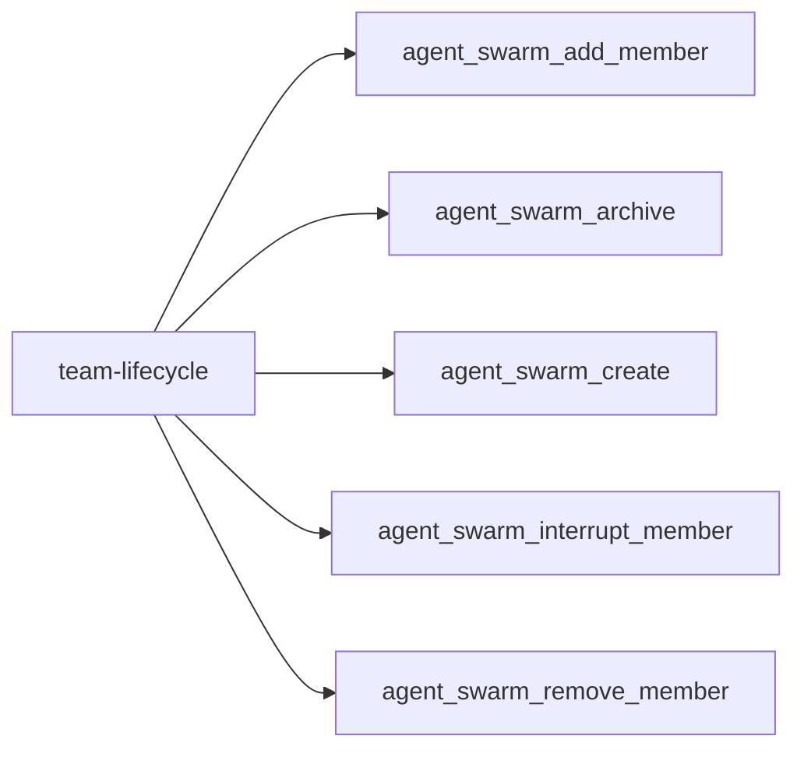
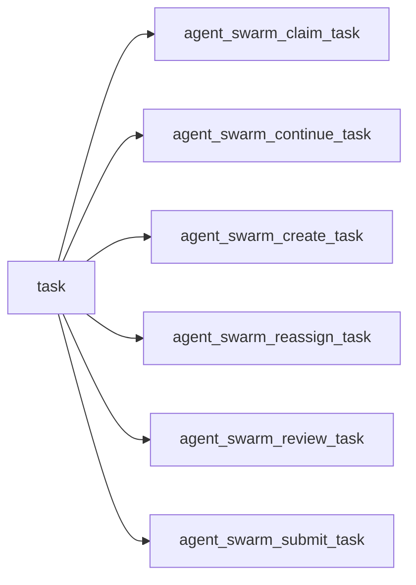
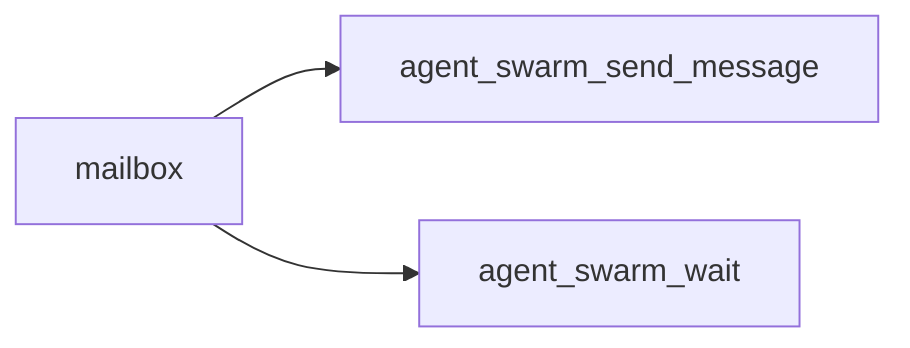
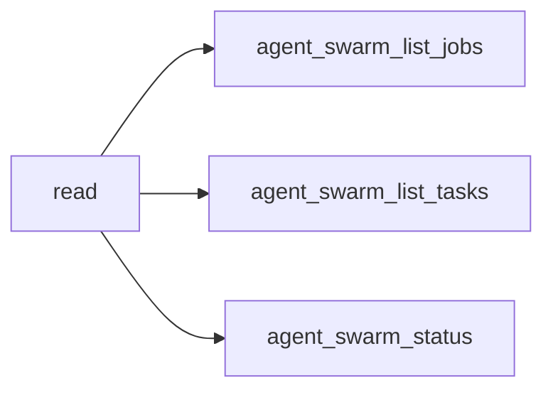
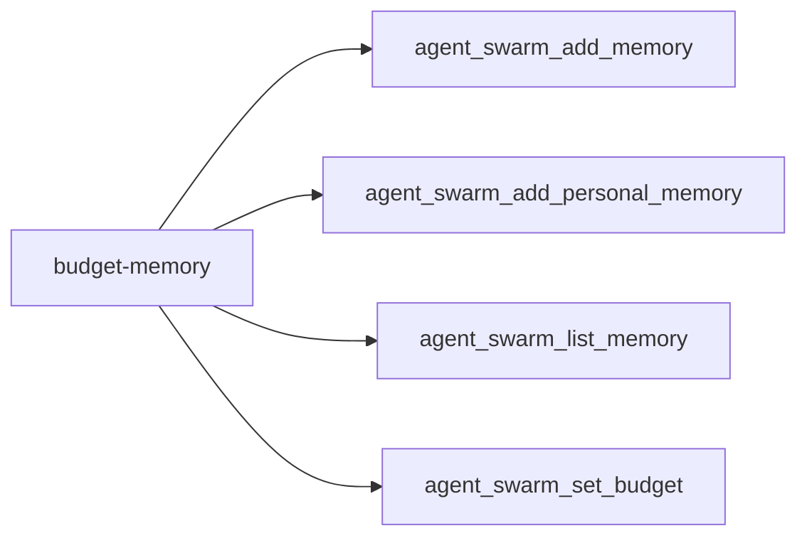

<!-- DO NOT EDIT: generated from docs/knowledge-graph/manifest.json -->

# Entrypoints and switches

Manifest digest: `fdf552d1c6cfd19835bdf09a135ec37e2264db7e2b3691c5b29e77cd71429b13`

Curated tool-registry digest: `2af060c2441600f775e82097e626303c8fd607845230f4c489473bcecd4d7878`

> Claim ceiling: the registry is a reviewed capability overlay over exact source extraction. Per-tool deep semantic closure, acceptance, and real-Profile evidence remain explicit gaps; the complete mechanical graph is retained in `atlas.json`.

## Functional facets

| Functional facet | Title | Source anchors | Test anchors | Related tools | Evidence gaps |
|---|---|---|---|---|---|
| `tool` | Cross-mode static union of model-facing tools; default live surface is 19 and fresh-v2 live surface is the exclusive 6-tool vertical slice | src/tools.ts#registerAgentSwarmTools | tests/tool-policy.spec.ts | tool:agent_swarm_add_member tool:agent_swarm_add_memory tool:agent_swarm_add_personal_memory tool:agent_swarm_archive tool:agent_swarm_claim_task tool:agent_swarm_continue_task tool:agent_swarm_create tool:agent_swarm_create_task tool:agent_swarm_interrupt_member tool:agent_swarm_list_jobs tool:agent_swarm_list_memory tool:agent_swarm_list_tasks tool:agent_swarm_reassign_task tool:agent_swarm_remove_member tool:agent_swarm_review_task tool:agent_swarm_send_message tool:agent_swarm_set_budget tool:agent_swarm_status tool:agent_swarm_submit_task tool:agent_swarm_wait | NO_REAL_PROFILE_EVIDENCE PROFILE_DEPENDENT |
| `config` | Plugin configuration and feature switches | src/index.ts#Config | tests/agent-swarm-settings.spec.tsx tests/dsh-composition.spec.ts | tool:agent_swarm_add_member tool:agent_swarm_claim_task tool:agent_swarm_list_jobs tool:agent_swarm_list_memory | NO_REAL_PROFILE_EVIDENCE PROFILE_DEPENDENT |

## Tool families

### team-lifecycle

| Stable capability id | Source module | Symbol | Availability / switches |
|---|---|---|---|
| `tool:agent_swarm_add_member` | src/tools/team-lifecycle.ts | registerAddMemberTool | registered: plugin enabled; required injections mounted; configured continuable provider available |
| `tool:agent_swarm_archive` | src/tools/team-lifecycle.ts | registerArchiveTool | registered: plugin enabled; live captain; active Team |
| `tool:agent_swarm_create` | src/tools/team-lifecycle.ts | registerCreateTool | registered: plugin enabled; required injections mounted; captain has no active Team in workspace |
| `tool:agent_swarm_interrupt_member` | src/tools/team-lifecycle.ts | registerInterruptMemberTool | registered: plugin enabled; live captain; host proves an unmatched aged tool call |
| `tool:agent_swarm_remove_member` | src/tools/team-lifecycle.ts | registerRemoveMemberTool | registered: plugin enabled; live captain; active member |

### task

| Stable capability id | Source module | Symbol | Availability / switches |
|---|---|---|---|
| `tool:agent_swarm_claim_task` | src/tools/task-board.ts | registerClaimTaskTool | registered: plugin enabled; ready task; budget and membership guards pass |
| `tool:agent_swarm_continue_task` | src/tools/continuation.ts | registerContinueTaskTool | config-disabled-by-default: plugin enabled; experimentalFreshV2 true; calling member owns exact running task and Attempt; current turn settles completed or max-tokens; exact live Captain available for immediate online delivery |
| `tool:agent_swarm_create_task` | src/tools/task-board.ts | registerCreateTaskTool | registered: plugin enabled; active Team; task and dependency bounds pass |
| `tool:agent_swarm_reassign_task` | src/tools/task-board.ts | registerReassignTaskTool | registered: plugin enabled; live captain; exact task revision |
| `tool:agent_swarm_review_task` | src/tools/task-board.ts | registerReviewTaskTool | registered: plugin enabled; live captain; submitted exact attempt; review provider available |
| `tool:agent_swarm_submit_task` | src/tools/task-board.ts | registerSubmitTaskTool | registered: plugin enabled; calling participant owns exact current attempt |

### mailbox

| Stable capability id | Source module | Symbol | Availability / switches |
|---|---|---|---|
| `tool:agent_swarm_send_message` | src/tools/mailbox.ts | registerSendMessageTool | registered: plugin enabled; active Team; authorized target |
| `tool:agent_swarm_wait` | src/tools/mailbox.ts | registerWaitTool | registered: plugin enabled; active Team; another member can make progress or immediate no_progress |

### read

| Stable capability id | Source module | Symbol | Availability / switches |
|---|---|---|---|
| `tool:agent_swarm_list_jobs` | src/tools/read-surface.ts | registerListJobsTool | config-disabled-by-default: plugin enabled; jobsBridge=true; jobs projection mounted |
| `tool:agent_swarm_list_tasks` | src/tools/read-surface.ts | registerListTasksTool | registered: plugin enabled; active Team |
| `tool:agent_swarm_status` | src/tools/read-surface.ts | registerStatusTool | registered: plugin enabled; active Team |

### budget-memory

| Stable capability id | Source module | Symbol | Availability / switches |
|---|---|---|---|
| `tool:agent_swarm_add_memory` | src/tools/budget-memory.ts | registerAddMemoryTool | registered: plugin enabled; active Team; required injections mounted |
| `tool:agent_swarm_add_personal_memory` | src/tools/budget-memory.ts | registerAddPersonalMemoryTool | registered: plugin enabled; active Team; required injections mounted |
| `tool:agent_swarm_list_memory` | src/tools/budget-memory.ts | registerListMemoryTool | registered: plugin enabled; active Team; semantic provider optional |
| `tool:agent_swarm_set_budget` | src/tools/budget-memory.ts | registerSetBudgetTool | registered: plugin enabled; live captain; active Team |

## Complete graph projection

```mermaid
flowchart LR
  n_636f6e6669672d6b65793a646973706f73616c74696d656f75746d73["Config disposalTimeoutMs"]
  n_636f6e6669672d6b65793a656e61626c6564["Config enabled"]
  n_636f6e6669672d6b65793a657865637574696f6e726f6f7470726f7669646572["Config executionRootProvider"]
  n_636f6e6669672d6b65793a657865637574696f6e726f6f7473["Config executionRoots"]
  n_636f6e6669672d6b65793a657865637574696f6e726f6f747362617365["Config executionRootsBase"]
  n_636f6e6669672d6b65793a6578706572696d656e74616c66726573687632["Config experimentalFreshV2"]
  n_636f6e6669672d6b65793a667265736876326172746966616374636f6e7472616374["Config freshV2ArtifactContract"]
  n_636f6e6669672d6b65793a66726573687632686f7374636f6e7472616374["Config freshV2HostContract"]
  n_636f6e6669672d6b65793a667265736876326c65676163796d616e69666573746361706163697479["Config freshV2LegacyManifestCapacity"]
  n_636f6e6669672d6b65793a6a6f6273627269646765["Config jobsBridge"]
  n_636f6e6669672d6b65793a6c617a796d656d6265727374617274["Config lazyMemberStart"]
  n_636f6e6669672d6b65793a6d6178646570656e64656e63696573["Config maxDependencies"]
  n_636f6e6669672d6b65793a6d61786d656d62657273["Config maxMembers"]
  n_636f6e6669672d6b65793a6d61786d656d6f72696573["Config maxMemories"]
  n_636f6e6669672d6b65793a6d61786d6573736167656279746573["Config maxMessageBytes"]
  n_636f6e6669672d6b65793a6d617870656e64696e676d657373616765737065726d656d626572["Config maxPendingMessagesPerMember"]
  n_636f6e6669672d6b65793a6d617872657461696e6564617474656d707473["Config maxRetainedAttempts"]
  n_636f6e6669672d6b65793a6d617872657461696e65646d65737361676573["Config maxRetainedMessages"]
  n_636f6e6669672d6b65793a6d61787461736b6279746573["Config maxTaskBytes"]
  n_636f6e6669672d6b65793a6d61787461736b73["Config maxTasks"]
  n_636f6e6669672d6b65793a6d6178766572696669636174696f6e636f6d6d616e646d73["Config maxVerificationCommandMs"]
  n_636f6e6669672d6b65793a6d6178766572696669636174696f6e636f6d6d616e6473["Config maxVerificationCommands"]
  n_636f6e6669672d6b65793a6d656d62657264656e79746f6f6c73["Config memberDenyTools"]
  n_636f6e6669672d6b65793a6d656d6265726c6c6d70726f7669646572["Config memberLlmProvider"]
  n_636f6e6669672d6b65793a6d656d6265726d61786465707468["Config memberMaxDepth"]
  n_636f6e6669672d6b65793a6d656d6265726d6f64656c["Config memberModel"]
  n_636f6e6669672d6b65793a6d656d62657270726f7669646572["Config memberProvider"]
  n_636f6e6669672d6b65793a6d656d626572736b696c6c73["Config memberSkills"]
  n_636f6e6669672d6b65793a6d656d6f727971756572796d617863616e64696461746573["Config memoryQueryMaxCandidates"]
  n_636f6e6669672d6b65793a6d656d6f7279717565727974696d656f75746d73["Config memoryQueryTimeoutMs"]
```

_View capped at 30 nodes and 60 edges; use atlas.json for the complete graph._

| Stable id | Kind | Classification | Implementation | Verification | Acceptance | Availability | Owner |
|---|---|---|---|---|---|---|---|
| `config-key:disposaltimeoutms` | config-key | MECHANICAL / UNCLASSIFIED | implemented | none | not-candidate | config-gated | `(unclassified)` |
| `config-key:enabled` | config-key | MECHANICAL / UNCLASSIFIED | implemented | none | not-candidate | config-gated | `(unclassified)` |
| `config-key:executionrootprovider` | config-key | MECHANICAL / UNCLASSIFIED | implemented | none | not-candidate | config-gated | `(unclassified)` |
| `config-key:executionroots` | config-key | MECHANICAL / UNCLASSIFIED | implemented | none | not-candidate | config-gated | `(unclassified)` |
| `config-key:executionrootsbase` | config-key | MECHANICAL / UNCLASSIFIED | implemented | none | not-candidate | config-gated | `(unclassified)` |
| `config-key:experimentalfreshv2` | config-key | MECHANICAL / UNCLASSIFIED | implemented | none | not-candidate | config-gated | `(unclassified)` |
| `config-key:freshv2artifactcontract` | config-key | MECHANICAL / UNCLASSIFIED | implemented | none | not-candidate | config-gated | `(unclassified)` |
| `config-key:freshv2hostcontract` | config-key | MECHANICAL / UNCLASSIFIED | implemented | none | not-candidate | config-gated | `(unclassified)` |
| `config-key:freshv2legacymanifestcapacity` | config-key | MECHANICAL / UNCLASSIFIED | implemented | none | not-candidate | config-gated | `(unclassified)` |
| `config-key:jobsbridge` | config-key | MECHANICAL / UNCLASSIFIED | implemented | none | not-candidate | config-gated | `(unclassified)` |
| `config-key:lazymemberstart` | config-key | MECHANICAL / UNCLASSIFIED | implemented | none | not-candidate | config-gated | `(unclassified)` |
| `config-key:maxdependencies` | config-key | MECHANICAL / UNCLASSIFIED | implemented | none | not-candidate | config-gated | `(unclassified)` |
| `config-key:maxmembers` | config-key | MECHANICAL / UNCLASSIFIED | implemented | none | not-candidate | config-gated | `(unclassified)` |
| `config-key:maxmemories` | config-key | MECHANICAL / UNCLASSIFIED | implemented | none | not-candidate | config-gated | `(unclassified)` |
| `config-key:maxmessagebytes` | config-key | MECHANICAL / UNCLASSIFIED | implemented | none | not-candidate | config-gated | `(unclassified)` |
| `config-key:maxpendingmessagespermember` | config-key | MECHANICAL / UNCLASSIFIED | implemented | none | not-candidate | config-gated | `(unclassified)` |
| `config-key:maxretainedattempts` | config-key | MECHANICAL / UNCLASSIFIED | implemented | none | not-candidate | config-gated | `(unclassified)` |
| `config-key:maxretainedmessages` | config-key | MECHANICAL / UNCLASSIFIED | implemented | none | not-candidate | config-gated | `(unclassified)` |
| `config-key:maxtaskbytes` | config-key | MECHANICAL / UNCLASSIFIED | implemented | none | not-candidate | config-gated | `(unclassified)` |
| `config-key:maxtasks` | config-key | MECHANICAL / UNCLASSIFIED | implemented | none | not-candidate | config-gated | `(unclassified)` |
| `config-key:maxverificationcommandms` | config-key | MECHANICAL / UNCLASSIFIED | implemented | none | not-candidate | config-gated | `(unclassified)` |
| `config-key:maxverificationcommands` | config-key | MECHANICAL / UNCLASSIFIED | implemented | none | not-candidate | config-gated | `(unclassified)` |
| `config-key:memberdenytools` | config-key | MECHANICAL / UNCLASSIFIED | implemented | none | not-candidate | config-gated | `(unclassified)` |
| `config-key:memberllmprovider` | config-key | MECHANICAL / UNCLASSIFIED | implemented | none | not-candidate | config-gated | `(unclassified)` |
| `config-key:membermaxdepth` | config-key | MECHANICAL / UNCLASSIFIED | implemented | none | not-candidate | config-gated | `(unclassified)` |
| `config-key:membermodel` | config-key | MECHANICAL / UNCLASSIFIED | implemented | none | not-candidate | config-gated | `(unclassified)` |
| `config-key:memberprovider` | config-key | MECHANICAL / UNCLASSIFIED | implemented | none | not-candidate | config-gated | `(unclassified)` |
| `config-key:memberskills` | config-key | MECHANICAL / UNCLASSIFIED | implemented | none | not-candidate | config-gated | `(unclassified)` |
| `config-key:memoryquerymaxcandidates` | config-key | MECHANICAL / UNCLASSIFIED | implemented | none | not-candidate | config-gated | `(unclassified)` |
| `config-key:memoryquerytimeoutms` | config-key | MECHANICAL / UNCLASSIFIED | implemented | none | not-candidate | config-gated | `(unclassified)` |
| `config-key:memorysemanticenabled` | config-key | MECHANICAL / UNCLASSIFIED | implemented | none | not-candidate | config-gated | `(unclassified)` |
| `config-key:memorysemanticmodel` | config-key | MECHANICAL / UNCLASSIFIED | implemented | none | not-candidate | config-gated | `(unclassified)` |
| `config-key:memorysemanticprovider` | config-key | MECHANICAL / UNCLASSIFIED | implemented | none | not-candidate | config-gated | `(unclassified)` |
| `config-key:orchestrationmode` | config-key | MECHANICAL / UNCLASSIFIED | implemented | none | not-candidate | config-gated | `(unclassified)` |
| `config-key:promptsectionorder` | config-key | MECHANICAL / UNCLASSIFIED | implemented | none | not-candidate | config-gated | `(unclassified)` |
| `config-key:reviewprovider` | config-key | MECHANICAL / UNCLASSIFIED | implemented | none | not-candidate | config-gated | `(unclassified)` |
| `config-key:reviewrootprovider` | config-key | MECHANICAL / UNCLASSIFIED | implemented | none | not-candidate | config-gated | `(unclassified)` |
| `config-key:schedulerprovider` | config-key | MECHANICAL / UNCLASSIFIED | implemented | none | not-candidate | config-gated | `(unclassified)` |
| `config-key:strandedafterms` | config-key | MECHANICAL / UNCLASSIFIED | implemented | none | not-candidate | config-gated | `(unclassified)` |
| `config-key:toolpolicy` | config-key | MECHANICAL / UNCLASSIFIED | implemented | none | not-candidate | config-gated | `(unclassified)` |
| `config-key:workflowbridge` | config-key | MECHANICAL / UNCLASSIFIED | implemented | none | not-candidate | config-gated | `(unclassified)` |
| `config-key:workflowdisposegracems` | config-key | MECHANICAL / UNCLASSIFIED | implemented | none | not-candidate | config-gated | `(unclassified)` |
| `config-key:workflowmaxtotalagents` | config-key | MECHANICAL / UNCLASSIFIED | implemented | none | not-candidate | config-gated | `(unclassified)` |
| `entrypoint:client/index` | entrypoint | MECHANICAL / UNCLASSIFIED | implemented | none | not-candidate | package-exported | `(unclassified)` |
| `entrypoint:client/plugin-entry` | entrypoint | MECHANICAL / UNCLASSIFIED | implemented | none | not-candidate | package-exported | `(unclassified)` |
| `entrypoint:package/client` | entrypoint | MECHANICAL / UNCLASSIFIED | implemented | none | not-candidate | package-exported | `(unclassified)` |
| `entrypoint:package/cordis.patch.yml` | entrypoint | MECHANICAL / UNCLASSIFIED | implemented | none | not-candidate | package-exported | `(unclassified)` |
| `entrypoint:package/package.json` | entrypoint | MECHANICAL / UNCLASSIFIED | implemented | none | not-candidate | package-exported | `(unclassified)` |
| `entrypoint:package/root` | entrypoint | MECHANICAL / UNCLASSIFIED | implemented | none | not-candidate | package-exported | `(unclassified)` |
| `entrypoint:source/public-api` | entrypoint | MECHANICAL / UNCLASSIFIED | implemented | none | not-candidate | package-exported | `(unclassified)` |
| `package:dsh-agent-swarm` | package | MECHANICAL / UNCLASSIFIED | implemented | none | not-candidate | package-exported | `(unclassified)` |
| `package:external/deepseek-ai/cordis` | package | MECHANICAL / UNCLASSIFIED | implemented | none | not-candidate | unavailable | `(unclassified)` |
| `package:external/deepseek-ai/dsh-agent` | package | MECHANICAL / UNCLASSIFIED | implemented | none | not-candidate | unavailable | `(unclassified)` |
| `package:external/deepseek-ai/dsh-client-locale` | package | MECHANICAL / UNCLASSIFIED | implemented | none | not-candidate | unavailable | `(unclassified)` |
| `package:external/deepseek-ai/dsh-client-runtime` | package | MECHANICAL / UNCLASSIFIED | implemented | none | not-candidate | unavailable | `(unclassified)` |
| `package:external/deepseek-ai/dsh-client-ui-conversation` | package | MECHANICAL / UNCLASSIFIED | implemented | none | not-candidate | unavailable | `(unclassified)` |
| `package:external/deepseek-ai/dsh-client-ui-layout` | package | MECHANICAL / UNCLASSIFIED | implemented | none | not-candidate | unavailable | `(unclassified)` |
| `package:external/deepseek-ai/dsh-client-ui-primitives` | package | MECHANICAL / UNCLASSIFIED | implemented | none | not-candidate | unavailable | `(unclassified)` |
| `package:external/deepseek-ai/dsh-client-ui-settings` | package | MECHANICAL / UNCLASSIFIED | implemented | none | not-candidate | unavailable | `(unclassified)` |
| `package:external/deepseek-ai/dsh-client-ui-settings-plugins` | package | MECHANICAL / UNCLASSIFIED | implemented | none | not-candidate | unavailable | `(unclassified)` |
| `package:external/deepseek-ai/dsh-client-ui-slots` | package | MECHANICAL / UNCLASSIFIED | implemented | none | not-candidate | unavailable | `(unclassified)` |
| `package:external/deepseek-ai/dsh-jobs` | package | MECHANICAL / UNCLASSIFIED | implemented | none | not-candidate | unavailable | `(unclassified)` |
| `package:external/deepseek-ai/dsh-llm` | package | MECHANICAL / UNCLASSIFIED | implemented | none | not-candidate | unavailable | `(unclassified)` |
| `package:external/deepseek-ai/dsh-session` | package | MECHANICAL / UNCLASSIFIED | implemented | none | not-candidate | unavailable | `(unclassified)` |
| `package:external/deepseek-ai/dsh-session-persistence` | package | MECHANICAL / UNCLASSIFIED | implemented | none | not-candidate | unavailable | `(unclassified)` |
| `package:external/deepseek-ai/dsh-settings` | package | MECHANICAL / UNCLASSIFIED | implemented | none | not-candidate | unavailable | `(unclassified)` |
| `package:external/deepseek-ai/dsh-skill` | package | MECHANICAL / UNCLASSIFIED | implemented | none | not-candidate | unavailable | `(unclassified)` |
| `package:external/deepseek-ai/dsh-storage-domain` | package | MECHANICAL / UNCLASSIFIED | implemented | none | not-candidate | unavailable | `(unclassified)` |
| `package:external/deepseek-ai/dsh-subagent` | package | MECHANICAL / UNCLASSIFIED | implemented | none | not-candidate | unavailable | `(unclassified)` |
| `package:external/deepseek-ai/dsh-system-prompt` | package | MECHANICAL / UNCLASSIFIED | implemented | none | not-candidate | unavailable | `(unclassified)` |
| `package:external/deepseek-ai/dsh-tools` | package | MECHANICAL / UNCLASSIFIED | implemented | none | not-candidate | unavailable | `(unclassified)` |
| `package:external/deepseek-ai/dsh-workflow` | package | MECHANICAL / UNCLASSIFIED | implemented | none | not-candidate | unavailable | `(unclassified)` |
| `package:external/deepseek-ai/schemastery` | package | MECHANICAL / UNCLASSIFIED | implemented | none | not-candidate | unavailable | `(unclassified)` |
| `package:external/node-buffer` | package | MECHANICAL / UNCLASSIFIED | implemented | none | not-candidate | unavailable | `(unclassified)` |
| `package:external/node-child_process` | package | MECHANICAL / UNCLASSIFIED | implemented | none | not-candidate | unavailable | `(unclassified)` |
| `package:external/node-crypto` | package | MECHANICAL / UNCLASSIFIED | implemented | none | not-candidate | unavailable | `(unclassified)` |
| `package:external/node-fs` | package | MECHANICAL / UNCLASSIFIED | implemented | none | not-candidate | unavailable | `(unclassified)` |
| `package:external/node-http` | package | MECHANICAL / UNCLASSIFIED | implemented | none | not-candidate | unavailable | `(unclassified)` |
| `package:external/node-os` | package | MECHANICAL / UNCLASSIFIED | implemented | none | not-candidate | unavailable | `(unclassified)` |
| `package:external/node-path` | package | MECHANICAL / UNCLASSIFIED | implemented | none | not-candidate | unavailable | `(unclassified)` |
| `package:external/node-util` | package | MECHANICAL / UNCLASSIFIED | implemented | none | not-candidate | unavailable | `(unclassified)` |
| `package:external/node-vm` | package | MECHANICAL / UNCLASSIFIED | implemented | none | not-candidate | unavailable | `(unclassified)` |
| `package:external/react` | package | MECHANICAL / UNCLASSIFIED | implemented | none | not-candidate | unavailable | `(unclassified)` |
| `package:external/zod` | package | MECHANICAL / UNCLASSIFIED | implemented | none | not-candidate | unavailable | `(unclassified)` |
