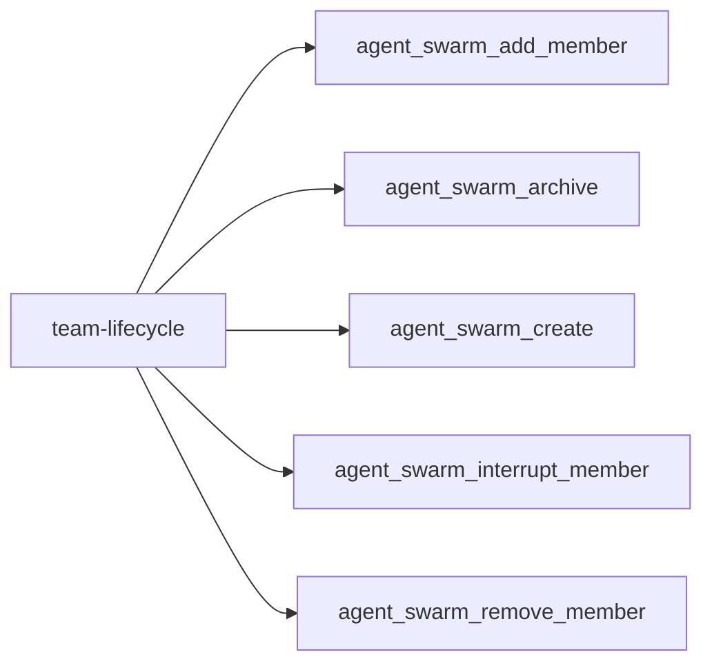
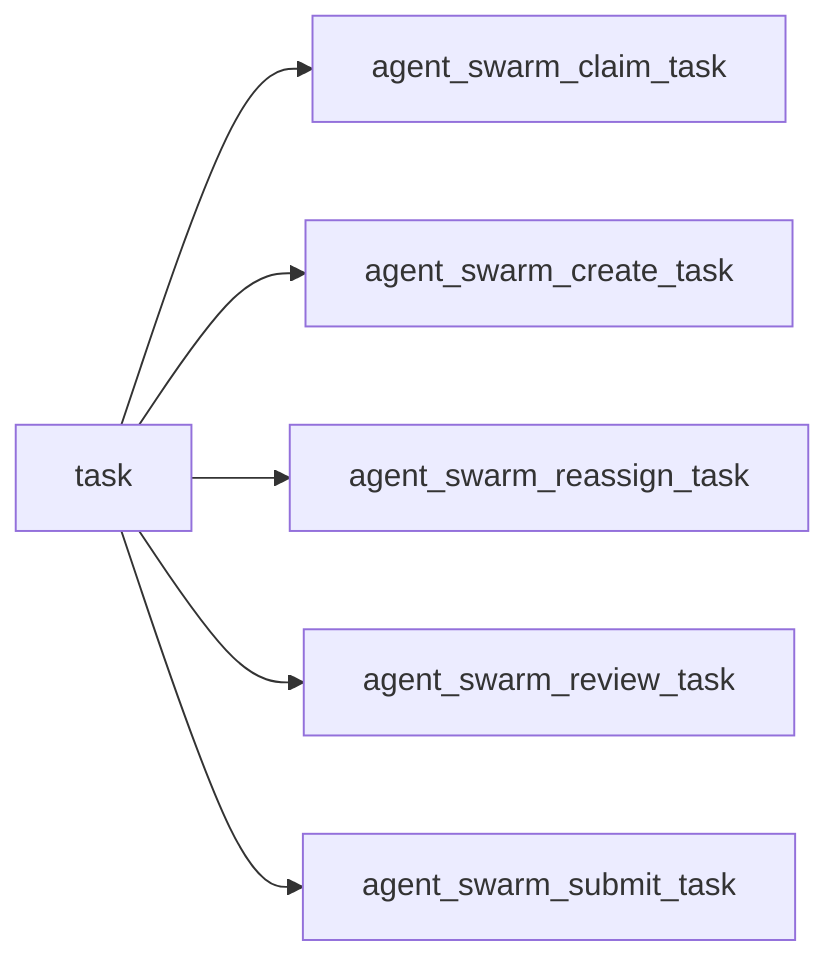
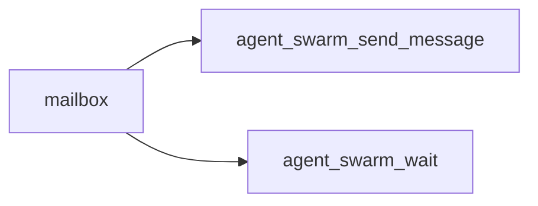
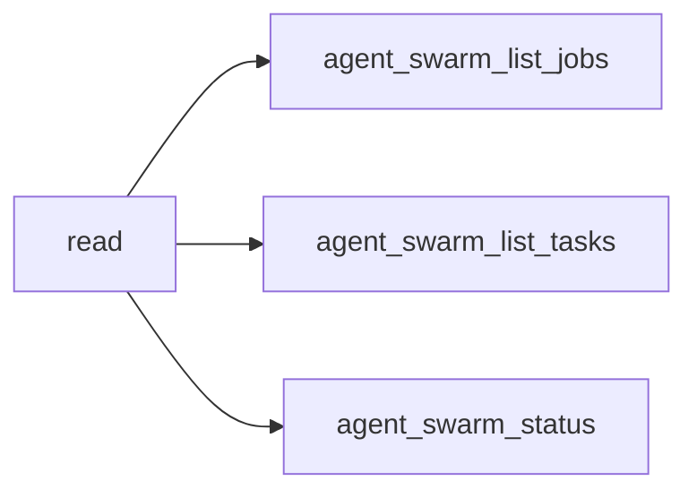
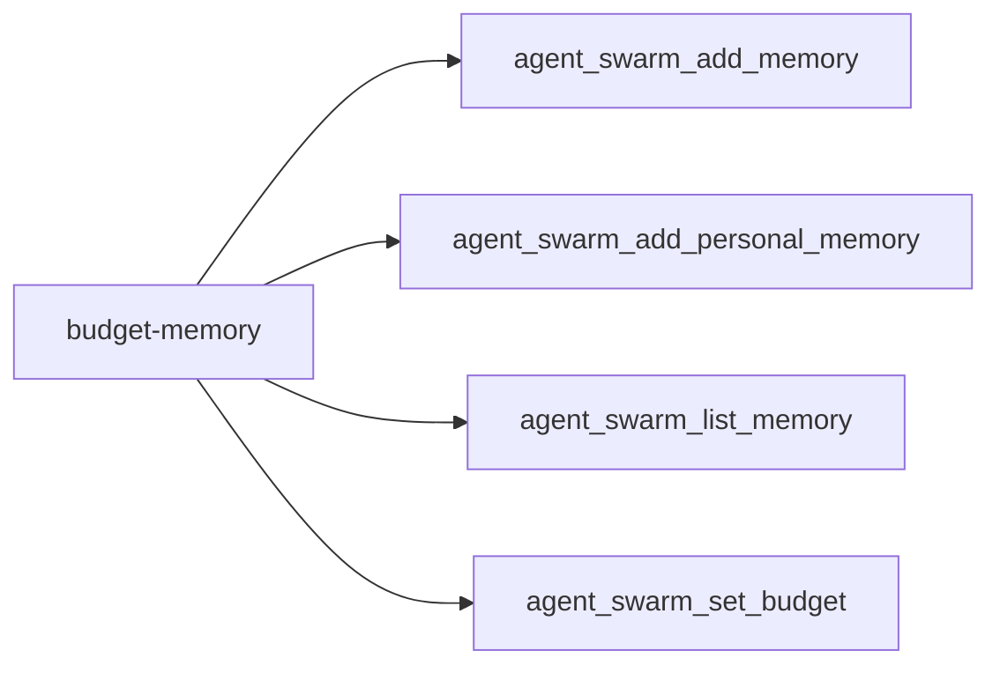

<!-- DO NOT EDIT: generated from docs/knowledge-graph/manifest.json -->

# Redlines

Manifest digest: `07e305828aaaacf54a29c304df6361f54c10bd3847b42da8fbc88f36bf8e3543`

Curated tool-registry digest: `331defbb12c4ac44efa0bdd7b16007d003dfa3704477b0c2c925d9cc1b665783`

> Claim ceiling: the registry is a reviewed capability overlay over exact source extraction. Per-tool deep semantic closure, acceptance, and real-Profile evidence remain explicit gaps; the complete mechanical graph is retained in `atlas.json`.

## Functional facets

| Functional facet | Title | Source anchors | Test anchors | Related tools | Evidence gaps |
|---|---|---|---|---|---|
| `team` | Team lifecycle authority | src/domain/team-domain.ts#TeamDomain | tests/team-domain.spec.ts | tool:agent_swarm_add_member tool:agent_swarm_archive tool:agent_swarm_create tool:agent_swarm_interrupt_member tool:agent_swarm_remove_member | NO_REAL_PROFILE_EVIDENCE PROFILE_DEPENDENT |
| `task` | Task board and attempt fencing | src/domain/team-domain-board.ts#claimTask | tests/team-assignment-checkpoint.spec.ts tests/model-experience.spec.ts | tool:agent_swarm_claim_task tool:agent_swarm_create_task tool:agent_swarm_reassign_task tool:agent_swarm_review_task tool:agent_swarm_submit_task | NO_REAL_PROFILE_EVIDENCE PROFILE_DEPENDENT |
| `message` | Durable Team mailbox and wakeup delivery | src/domain/team-domain-mailbox.ts#queueMessage src/runtime/message-delivery.ts#MessageDelivery.deliverQueuedMessage | tests/message-delivery.spec.ts | tool:agent_swarm_send_message tool:agent_swarm_wait | NO_REAL_PROFILE_EVIDENCE PROFILE_DEPENDENT |
| `permission` | Caller identity and monotone tool permission policy | src/runtime/permission-policy.ts#decideToolPermission src/runtime/permission-surface.ts#TeamPermissionSurface.attachPreExecute | tests/permission-boundary.spec.ts tests/permission-real-composition.spec.ts | tool:agent_swarm_add_member tool:agent_swarm_add_memory tool:agent_swarm_add_personal_memory tool:agent_swarm_archive tool:agent_swarm_claim_task tool:agent_swarm_create tool:agent_swarm_create_task tool:agent_swarm_interrupt_member tool:agent_swarm_list_jobs tool:agent_swarm_list_memory tool:agent_swarm_list_tasks tool:agent_swarm_reassign_task tool:agent_swarm_remove_member tool:agent_swarm_review_task tool:agent_swarm_send_message tool:agent_swarm_set_budget tool:agent_swarm_status tool:agent_swarm_submit_task tool:agent_swarm_wait | NO_REAL_PROFILE_EVIDENCE PROFILE_DEPENDENT |

## Tool families

### team-lifecycle

| Stable capability id | Permission guard | Failure boundary | Unclosed evidence |
|---|---|---|---|
| `tool:agent_swarm_add_member` | captain-only | Provisioning validation fails before roster commit; post-provision commit failure is compensated by member teardown, while unknown provider state fails loud. | NO_REAL_PROFILE_EVIDENCE PROFILE_DEPENDENT PER_TOOL_DEEP_SEMANTICS_DEFERRED |
| `tool:agent_swarm_archive` | captain-only | The durable archive transition is authoritative; member drain failures remain explicit cleanup failures and must not resurrect the Team. | NO_DIRECT_TEST NO_COMPOSITION_TEST NO_REAL_PROFILE_EVIDENCE PROFILE_DEPENDENT PER_TOOL_DEEP_SEMANTICS_DEFERRED |
| `tool:agent_swarm_create` | captain-only | Duplicate active ownership and validation fail closed; durable commit failure publishes no Team result. | NO_REAL_PROFILE_EVIDENCE PROFILE_DEPENDENT PER_TOOL_DEEP_SEMANTICS_DEFERRED |
| `tool:agent_swarm_interrupt_member` | captain-only | Admission fails without host evidence; an interrupt transport failure preserves canonical Team ownership and must be observed before retry. | NO_REAL_PROFILE_EVIDENCE PROFILE_DEPENDENT PER_TOOL_DEEP_SEMANTICS_DEFERRED |
| `tool:agent_swarm_remove_member` | captain-only | The fenced Team mutation is authoritative once committed; interruption or drain failure remains explicit cleanup work and cannot restore ownership. | NO_DIRECT_TEST NO_COMPOSITION_TEST NO_REAL_PROFILE_EVIDENCE PROFILE_DEPENDENT PER_TOOL_DEEP_SEMANTICS_DEFERRED |

### task

| Stable capability id | Permission guard | Failure boundary | Unclosed evidence |
|---|---|---|---|
| `tool:agent_swarm_claim_task` | team-participant | Stale revision or unavailable work fails before ownership transfer; assignment delivery uses the D1 exact-read-back recovery closure, while execution-root availability remains configuration-dependent. | NO_REAL_PROFILE_EVIDENCE PROFILE_DEPENDENT PER_TOOL_DEEP_SEMANTICS_DEFERRED |
| `tool:agent_swarm_create_task` | team-participant | Invalid dependencies, verification declarations, reservation floors, or size limits fail before task commit; scheduling follows committed state. | NO_REAL_PROFILE_EVIDENCE PROFILE_DEPENDENT PER_TOOL_DEEP_SEMANTICS_DEFERRED |
| `tool:agent_swarm_reassign_task` | captain-only | Revision or attempt mismatch fails closed; the fenced Team transition remains authoritative if later interruption or rescheduling fails. | NO_DIRECT_TEST NO_COMPOSITION_TEST NO_REAL_PROFILE_EVIDENCE PROFILE_DEPENDENT PER_TOOL_DEEP_SEMANTICS_DEFERRED |
| `tool:agent_swarm_review_task` | captain-only | Provider failure does not self-accept; stale attempts fail closed and an unknown verification result requires authoritative task read-back before retry. | NO_REAL_PROFILE_EVIDENCE PROFILE_DEPENDENT PER_TOOL_DEEP_SEMANTICS_DEFERRED |
| `tool:agent_swarm_submit_task` | team-participant | Stale attempt or revision fails closed and the caller must stop; commit failure does not imply submission and requires authoritative task read-back. | NO_REAL_PROFILE_EVIDENCE PROFILE_DEPENDENT PER_TOOL_DEEP_SEMANTICS_DEFERRED |

### mailbox

| Stable capability id | Permission guard | Failure boundary | Unclosed evidence |
|---|---|---|---|
| `tool:agent_swarm_send_message` | team-participant | A queued result is durable and must not be resent; delivery failure preserves queued authority for later retry or cold resume. | NO_REAL_PROFILE_EVIDENCE PROFILE_DEPENDENT PER_TOOL_DEEP_SEMANTICS_DEFERRED |
| `tool:agent_swarm_wait` | team-participant | Caller cancellation fails with TEAM_WAIT_ABORTED; timeout is an unchanged read result and no_progress returns immediately when waiting cannot help. | NO_REAL_PROFILE_EVIDENCE PROFILE_DEPENDENT PER_TOOL_DEEP_SEMANTICS_DEFERRED |

### read

| Stable capability id | Permission guard | Failure boundary | Unclosed evidence |
|---|---|---|---|
| `tool:agent_swarm_list_jobs` | team-participant | Fails loud with TEAM_JOBS_BRIDGE_DISABLED when the projection is absent; invalid cursor or limit fails before projection read. | NO_REAL_PROFILE_EVIDENCE PROFILE_DEPENDENT CONFIG_DISABLED_BY_DEFAULT PER_TOOL_DEEP_SEMANTICS_DEFERRED |
| `tool:agent_swarm_list_tasks` | team-participant | Invalid filters, cursor, or limit fail before the read; retries are read-only and use the returned revision/cursor context. | NO_REAL_PROFILE_EVIDENCE PROFILE_DEPENDENT PER_TOOL_DEEP_SEMANTICS_DEFERRED |
| `tool:agent_swarm_status` | team-participant | Read or authorization failure has no mutation; callers may retry after checking active Team identity. | NO_REAL_PROFILE_EVIDENCE PROFILE_DEPENDENT PER_TOOL_DEEP_SEMANTICS_DEFERRED |

### budget-memory

| Stable capability id | Permission guard | Failure boundary | Unclosed evidence |
|---|---|---|---|
| `tool:agent_swarm_add_memory` | team-participant | Validation or durable commit failure returns an error and does not publish a memory id; callers must read authoritative memory before uncertain retry. | NO_REAL_PROFILE_EVIDENCE PROFILE_DEPENDENT PER_TOOL_DEEP_SEMANTICS_DEFERRED |
| `tool:agent_swarm_add_personal_memory` | team-participant | Ownership mismatch and inactive owners fail closed; commit failure publishes no successful result and requires authoritative read-back before retry. | NO_DIRECT_TEST NO_COMPOSITION_TEST NO_REAL_PROFILE_EVIDENCE PROFILE_DEPENDENT PER_TOOL_DEEP_SEMANTICS_DEFERRED |
| `tool:agent_swarm_list_memory` | team-participant | Authorization, cursor, and bound failures are terminal for the call; semantic provider failure returns an explicit degraded deterministic strategy. | NO_DIRECT_TEST NO_COMPOSITION_TEST NO_REAL_PROFILE_EVIDENCE PROFILE_DEPENDENT PER_TOOL_DEEP_SEMANTICS_DEFERRED |
| `tool:agent_swarm_set_budget` | captain-only | Invalid limits fail before mutation; durable commit failure retains prior limits and usage and must be read back before retry. | NO_DIRECT_TEST NO_COMPOSITION_TEST NO_REAL_PROFILE_EVIDENCE PROFILE_DEPENDENT PER_TOOL_DEEP_SEMANTICS_DEFERRED |

## Complete graph projection

```mermaid
flowchart LR
  n_617574686f726974793a70726f6a6563742d636f6e747261637473["Registered project contract authority"]
  n_617574686f726974793a736f757263652d74726565["Repository source-tree authority"]
  n_646f6d61696e3a6167656e742d737761726d["Storage Domain agent_swarm v1"]
  n_646f6d61696e3a6167656e742d737761726d2d68756d616e["Storage Domain agent_swarm_human v1"]
  n_646f6d61696e3a6167656e742d737761726d2d7632["Storage Domain agent_swarm_v2 v1"]
  n_646f6d61696e3a6167656e742d737761726d2d776f726b666c6f77["Storage Domain agent_swarm_workflow v1"]
  n_67756172643a617474656d70742d72756e6e696e672d7265736572766564["runningReserved"]
  n_67756172643a6275646765742d7265736572766174696f6e2d61646d69737369626c65["budget"]
  n_67756172643a6361707461696e2d6f722d73656c662d6d656d62657273686970["membership"]
  n_67756172643a636c61696d65642d6672616d652d6f6e6c792d61636b6e6f776c656467656d656e74["claimed"]
  n_67756172643a65786163742d63757272656e742d617474656d7074["current"]
  n_67756172643a65786163742d7461736b2d7265766973696f6e["revision"]
  n_67756172643a66726573682d76322d6578706572696d656e74616c2d61637469766174696f6e["Fresh-v2 is explicit and isolated from v1 activation"]
  n_67756172643a66726573682d76322d66697865642d70726f66696c652d7769746e6573732d6361706162696c697479["Fixed-Profile host, artifact, Provider and listener-order witness"]
  n_67756172643a66726573682d76322d6f6666696369616c2d6167656e742d6c6f6f702d72657175657374["Exact official Agent Loop AbortSignal permit and Session coordinates"]
  n_67756172643a6d656d6265722d6861732d6e6f2d6f70656e2d776f726b["available"]
  n_67756172643a6f6666696369616c2d6c6976652d6469726563742d706172656e742d61646d697373696f6e["parent"]
  n_67756172643a7270632d626f756e642f7372632f636c69656e742f7465616d2d64617368626f6172642d636f6e74726f6c6c65722e74732f706167655f6c696d6974["PAGE_LIMIT = 50"]
  n_67756172643a7270632d626f756e642f7372632f7270632f726561642d7270632d636f6e74726163742e74732f737761726d5f726561645f7270635f76657273696f6e["SWARM_READ_RPC_VERSION = 1"]
  n_67756172643a7270632d626f756e642f7372632f7270632f726561642d7270632d736572766963652e74732f64656661756c745f646973706f73616c5f74696d656f75745f6d73["DEFAULT_DISPOSAL_TIMEOUT_MS = 5000"]
  n_67756172643a7270632d626f756e642f7372632f7270632f726561642d7270632d736572766963652e74732f64656661756c745f706167655f6c696d6974["DEFAULT_PAGE_LIMIT = 50"]
  n_67756172643a7270632d626f756e642f7372632f7270632f726561642d7270632d736572766963652e74732f6d61785f706167655f6c696d6974["MAX_PAGE_LIMIT = 50"]
  n_67756172643a7270632d687474702f30312d7372632f636c69656e742f726561642d636c69656e742e7473["client-fetch POST"]
  n_67756172643a7270632d687474702f30322d7372632f7270632f726561642d7270632d736572766963652e7473["route-handler POST"]
  n_67756172643a7461736b2d7265616479["ready"]
  n_6f6666696369616c2d617574686f726974793a6167656e742d6c6f6f70["Official DSH Agent Loop execution authority"]
  n_6f6666696369616c2d617574686f726974793a6c6c6d2d72756e74696d65["Official DSH LLM registry and stream waterfall authority"]
  n_6f6666696369616c2d617574686f726974793a73657373696f6e["Official Session event/history authority"]
  n_6f6666696369616c2d617574686f726974793a7375626167656e74["Official continuable Subagent admission authority"]
  n_7265646c696e653a6e6f2d70656e64696e672d6f722d756e6b6e6f776e2d61636b6e6f776c656467656d656e74["pending"]
  n_646f6d61696e3a6167656e742d737761726d -->|owns| n_67756172643a66726573682d76322d6578706572696d656e74616c2d61637469766174696f6e
  n_6f6666696369616c2d617574686f726974793a6c6c6d2d72756e74696d65 -->|owns| n_67756172643a66726573682d76322d66697865642d70726f66696c652d7769746e6573732d6361706162696c697479
  n_6f6666696369616c2d617574686f726974793a6167656e742d6c6f6f70 -->|owns| n_67756172643a66726573682d76322d6f6666696369616c2d6167656e742d6c6f6f702d72657175657374
  n_646f6d61696e3a6167656e742d737761726d -->|owns| n_67756172643a617474656d70742d72756e6e696e672d7265736572766564
  n_646f6d61696e3a6167656e742d737761726d -->|owns| n_67756172643a6275646765742d7265736572766174696f6e2d61646d69737369626c65
  n_646f6d61696e3a6167656e742d737761726d -->|owns| n_67756172643a6361707461696e2d6f722d73656c662d6d656d62657273686970
  n_6f6666696369616c2d617574686f726974793a73657373696f6e -->|owns| n_67756172643a636c61696d65642d6672616d652d6f6e6c792d61636b6e6f776c656467656d656e74
  n_646f6d61696e3a6167656e742d737761726d -->|owns| n_67756172643a65786163742d63757272656e742d617474656d7074
  n_646f6d61696e3a6167656e742d737761726d -->|owns| n_67756172643a65786163742d7461736b2d7265766973696f6e
  n_646f6d61696e3a6167656e742d737761726d -->|owns| n_67756172643a6d656d6265722d6861732d6e6f2d6f70656e2d776f726b
  n_6f6666696369616c2d617574686f726974793a7375626167656e74 -->|owns| n_67756172643a6f6666696369616c2d6c6976652d6469726563742d706172656e742d61646d697373696f6e
  n_646f6d61696e3a6167656e742d737761726d -->|owns| n_67756172643a7461736b2d7265616479
  n_617574686f726974793a70726f6a6563742d636f6e747261637473 -->|owns| n_7265646c696e653a6e6f2d70656e64696e672d6f722d756e6b6e6f776e2d61636b6e6f776c656467656d656e74
```

_View capped at 30 nodes and 60 edges; use atlas.json for the complete graph._

| Stable id | Kind | Classification | Implementation | Verification | Acceptance | Availability | Owner |
|---|---|---|---|---|---|---|---|
| `authority:project-contracts` | authority | REVIEWED | implemented | static | candidate | always-registered | `authority:project-contracts` |
| `authority:source-tree` | authority | MECHANICAL / UNCLASSIFIED | implemented | none | not-candidate | package-exported | `(unclassified)` |
| `domain:agent-swarm` | domain | REVIEWED | implemented | composition | candidate | always-registered | `domain:agent-swarm` |
| `domain:agent-swarm-human` | domain | MECHANICAL / UNCLASSIFIED | implemented | none | not-candidate | always-registered | `(unclassified)` |
| `domain:agent-swarm-v2` | domain | MECHANICAL / UNCLASSIFIED | implemented | none | not-candidate | always-registered | `(unclassified)` |
| `domain:agent-swarm-workflow` | domain | MECHANICAL / UNCLASSIFIED | implemented | none | not-candidate | always-registered | `(unclassified)` |
| `guard:attempt-running-reserved` | guard | REVIEWED | implemented | static | candidate | always-registered | `domain:agent-swarm` |
| `guard:budget-reservation-admissible` | guard | REVIEWED | implemented | static | candidate | always-registered | `domain:agent-swarm` |
| `guard:captain-or-self-membership` | guard | REVIEWED | implemented | static | candidate | always-registered | `domain:agent-swarm` |
| `guard:claimed-frame-only-acknowledgement` | guard | REVIEWED | implemented | static | candidate | always-registered | `official-authority:session` |
| `guard:exact-current-attempt` | guard | REVIEWED | implemented | static | candidate | always-registered | `domain:agent-swarm` |
| `guard:exact-task-revision` | guard | REVIEWED | implemented | static | candidate | always-registered | `domain:agent-swarm` |
| `guard:fresh-v2-experimental-activation` | guard | REVIEWED | implemented | composition | candidate | config-gated | `domain:agent-swarm` |
| `guard:fresh-v2-fixed-profile-witness-capability` | guard | REVIEWED | implemented | composition | candidate | config-gated | `official-authority:llm-runtime` |
| `guard:fresh-v2-official-agent-loop-request` | guard | REVIEWED | implemented | composition | candidate | config-gated | `official-authority:agent-loop` |
| `guard:member-has-no-open-work` | guard | REVIEWED | implemented | static | candidate | always-registered | `domain:agent-swarm` |
| `guard:official-live-direct-parent-admission` | guard | REVIEWED | implemented | static | candidate | always-registered | `official-authority:subagent` |
| `guard:rpc-bound/src/client/team-dashboard-controller.ts/page_limit` | guard | MECHANICAL / UNCLASSIFIED | implemented | none | not-candidate | unavailable | `(unclassified)` |
| `guard:rpc-bound/src/rpc/read-rpc-contract.ts/swarm_read_rpc_version` | guard | MECHANICAL / UNCLASSIFIED | implemented | none | not-candidate | unavailable | `(unclassified)` |
| `guard:rpc-bound/src/rpc/read-rpc-service.ts/default_disposal_timeout_ms` | guard | MECHANICAL / UNCLASSIFIED | implemented | none | not-candidate | unavailable | `(unclassified)` |
| `guard:rpc-bound/src/rpc/read-rpc-service.ts/default_page_limit` | guard | MECHANICAL / UNCLASSIFIED | implemented | none | not-candidate | unavailable | `(unclassified)` |
| `guard:rpc-bound/src/rpc/read-rpc-service.ts/max_page_limit` | guard | MECHANICAL / UNCLASSIFIED | implemented | none | not-candidate | unavailable | `(unclassified)` |
| `guard:rpc-http/01-src/client/read-client.ts` | guard | MECHANICAL / UNCLASSIFIED | implemented | none | not-candidate | unavailable | `(unclassified)` |
| `guard:rpc-http/02-src/rpc/read-rpc-service.ts` | guard | MECHANICAL / UNCLASSIFIED | implemented | none | not-candidate | unavailable | `(unclassified)` |
| `guard:task-ready` | guard | REVIEWED | implemented | static | candidate | always-registered | `domain:agent-swarm` |
| `official-authority:agent-loop` | official-authority | REVIEWED | implemented | real-profile | candidate | config-gated | `official-authority:agent-loop` |
| `official-authority:llm-runtime` | official-authority | REVIEWED | implemented | composition | candidate | config-gated | `official-authority:llm-runtime` |
| `official-authority:session` | official-authority | REVIEWED | implemented | static | candidate | always-registered | `official-authority:session` |
| `official-authority:subagent` | official-authority | REVIEWED | implemented | static | candidate | always-registered | `official-authority:subagent` |
| `redline:no-pending-or-unknown-acknowledgement` | redline | REVIEWED | implemented | static | candidate | always-registered | `authority:project-contracts` |
| `redline:no-pending-or-unknown-redelivery` | redline | REVIEWED | implemented | static | candidate | always-registered | `authority:project-contracts` |
| `redline:no-rollback-after-admission` | redline | REVIEWED | implemented | static | candidate | always-registered | `authority:project-contracts` |
| `redline:storage-is-not-team-authority` | redline | REVIEWED | implemented | static | candidate | always-registered | `domain:agent-swarm` |
