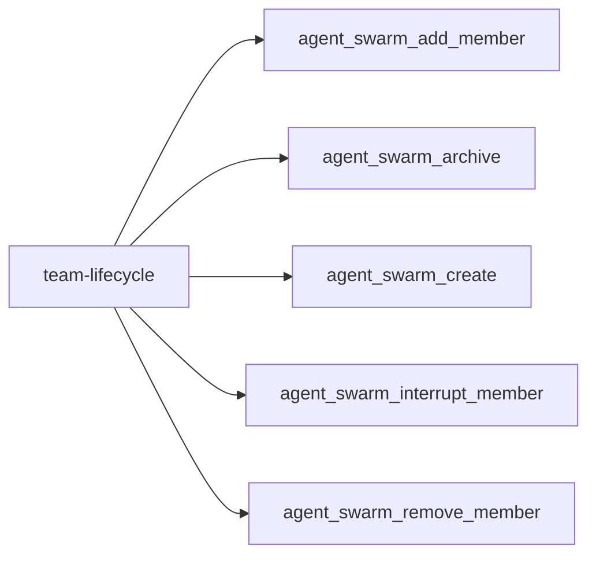
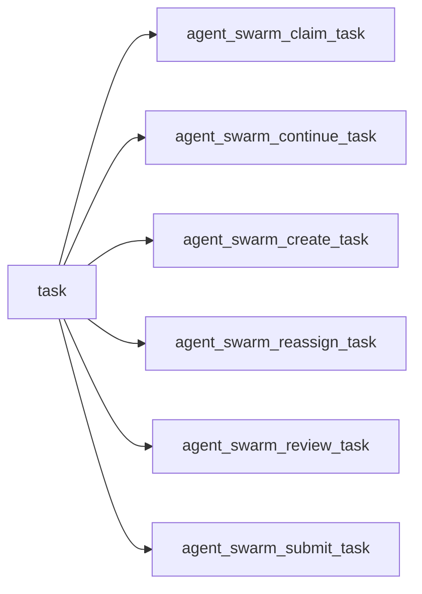
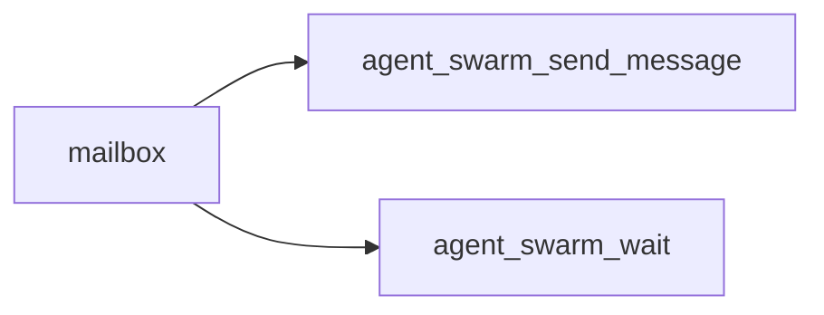
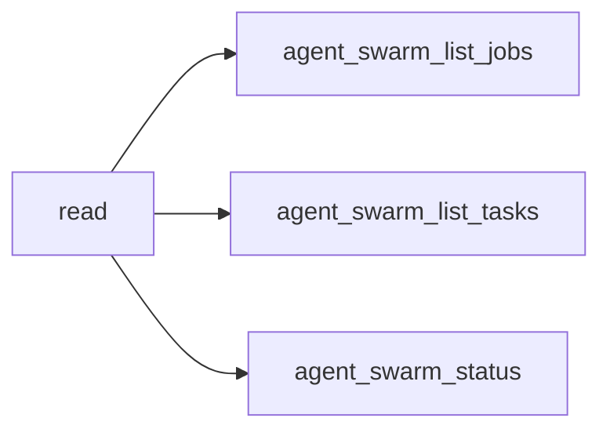
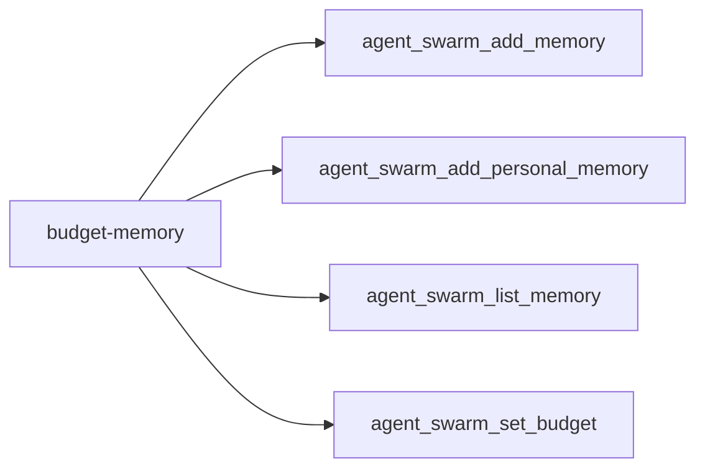

<!-- DO NOT EDIT: generated from docs/knowledge-graph/manifest.json -->

# Service, Provider and Consumer

Manifest digest: `5dd09bc6a3db9f195b78af4d5b43d9fe1a21abe41157edcab4f5c1ce95a67fc3`

Curated tool-registry digest: `2af060c2441600f775e82097e626303c8fd607845230f4c489473bcecd4d7878`

> Claim ceiling: the registry is a reviewed capability overlay over exact source extraction. Per-tool deep semantic closure, acceptance, and real-Profile evidence remain explicit gaps; the complete mechanical graph is retained in `atlas.json`.

## Functional facets

| Functional facet | Title | Source anchors | Test anchors | Related tools | Evidence gaps |
|---|---|---|---|---|---|
| `tool` | Cross-mode static union of model-facing tools; default live surface is 19 and fresh-v2 live surface is the exclusive 6-tool vertical slice | src/tools.ts#registerAgentSwarmTools | tests/tool-policy.spec.ts | tool:agent_swarm_add_member tool:agent_swarm_add_memory tool:agent_swarm_add_personal_memory tool:agent_swarm_archive tool:agent_swarm_claim_task tool:agent_swarm_continue_task tool:agent_swarm_create tool:agent_swarm_create_task tool:agent_swarm_interrupt_member tool:agent_swarm_list_jobs tool:agent_swarm_list_memory tool:agent_swarm_list_tasks tool:agent_swarm_reassign_task tool:agent_swarm_remove_member tool:agent_swarm_review_task tool:agent_swarm_send_message tool:agent_swarm_set_budget tool:agent_swarm_status tool:agent_swarm_submit_task tool:agent_swarm_wait | NO_REAL_PROFILE_EVIDENCE PROFILE_DEPENDENT |
| `workflow` | Workflow bridge and scripted Team runs | src/runtime/workflow/team-bridge-engine.ts#TeamBridgeWorkflowEngine src/runtime/workflow/team-run.ts#TeamRun | tests/workflow-bridge.spec.ts | tool:agent_swarm_create_task tool:agent_swarm_review_task tool:agent_swarm_submit_task | NO_REAL_PROFILE_EVIDENCE PROFILE_DEPENDENT |
| `jobs` | Read-only Team jobs projection | src/runtime/jobs/team-job-projection.ts#TeamJobProjection | tests/jobs-reader.spec.ts tests/jobs-bridge.spec.ts | tool:agent_swarm_list_jobs | NO_REAL_PROFILE_EVIDENCE PROFILE_DEPENDENT CONFIG_DISABLED_BY_DEFAULT |
| `rpc` | Versioned bounded read RPC | src/rpc/read-rpc-service.ts#mountAgentSwarmReadRpc src/rpc/read-rpc-contract.ts#SWARM_READ_RPC_VERSION | tests/read-rpc-service.spec.ts tests/read-rpc-client.spec.ts | tool:agent_swarm_list_jobs tool:agent_swarm_list_tasks tool:agent_swarm_status | NO_REAL_PROFILE_EVIDENCE PROFILE_DEPENDENT |

## Tool families

### team-lifecycle

| Stable capability id | Capability authority | Caller / permission | Operation / effect |
|---|---|---|---|
| `tool:agent_swarm_add_member` | domain:agent-swarm | captain-only | mutation / domain-transaction+external-effect |
| `tool:agent_swarm_archive` | domain:agent-swarm | captain-only | mutation / domain-transaction+external-effect |
| `tool:agent_swarm_create` | domain:agent-swarm | captain-only | mutation / domain-transaction |
| `tool:agent_swarm_interrupt_member` | domain:agent-swarm | captain-only | mutation / external-effect |
| `tool:agent_swarm_remove_member` | domain:agent-swarm | captain-only | mutation / domain-transaction+external-effect |

### task

| Stable capability id | Capability authority | Caller / permission | Operation / effect |
|---|---|---|---|
| `tool:agent_swarm_claim_task` | domain:agent-swarm | team-participant | mutation / domain-transaction+external-effect |
| `tool:agent_swarm_continue_task` | domain:agent-swarm | team-participant | mutation / domain-transaction+external-effect |
| `tool:agent_swarm_create_task` | domain:agent-swarm | team-participant | mutation / domain-transaction |
| `tool:agent_swarm_reassign_task` | domain:agent-swarm | captain-only | mutation / domain-transaction+external-effect |
| `tool:agent_swarm_review_task` | domain:agent-swarm | captain-only | mutation / domain-transaction+external-effect |
| `tool:agent_swarm_submit_task` | domain:agent-swarm | team-participant | mutation / domain-transaction |

### mailbox

| Stable capability id | Capability authority | Caller / permission | Operation / effect |
|---|---|---|---|
| `tool:agent_swarm_send_message` | domain:agent-swarm | team-participant | mutation / domain-transaction+external-effect |
| `tool:agent_swarm_wait` | domain:agent-swarm | team-participant | read / revision-wait |

### read

| Stable capability id | Capability authority | Caller / permission | Operation / effect |
|---|---|---|---|
| `tool:agent_swarm_list_jobs` | domain:agent-swarm | team-participant | read / projection-read |
| `tool:agent_swarm_list_tasks` | domain:agent-swarm | team-participant | read / authoritative-read |
| `tool:agent_swarm_status` | domain:agent-swarm | team-participant | read / authoritative-read |

### budget-memory

| Stable capability id | Capability authority | Caller / permission | Operation / effect |
|---|---|---|---|
| `tool:agent_swarm_add_memory` | domain:agent-swarm | team-participant | mutation / domain-transaction |
| `tool:agent_swarm_add_personal_memory` | domain:agent-swarm | team-participant | mutation / domain-transaction |
| `tool:agent_swarm_list_memory` | domain:agent-swarm | team-participant | read / authoritative-read |
| `tool:agent_swarm_set_budget` | domain:agent-swarm | captain-only | mutation / domain-transaction |

## Complete graph projection

```mermaid
flowchart LR
  n_636f6e73756d65723a66726573682d76322d746f6f6c2d726567697374726174696f6e["Fresh-v2 model-tool registration surface in src/tools.ts"]
  n_636f6e73756d65723a72656769737472792d6661636164652f7372632f72756e74696d652f657865637574696f6e2d726f6f742d737572666163652e74732f657865637574696f6e726f6f74737572666163652f726567697374657270726f7669646572["Registry façade ExecutionRootSurface.registerProvider"]
  n_636f6e73756d65723a72656769737472792d6661636164652f7372632f72756e74696d652f6f7263686573747261746f722d72756e74696d652e74732f6167656e74737761726d72756e74696d652f7265676973746572657865637574696f6e726f6f7470726f7669646572["Registry façade AgentSwarmRuntime.registerExecutionRootProvider"]
  n_636f6e73756d65723a72656769737472792d6661636164652f7372632f72756e74696d652f6f7263686573747261746f722d72756e74696d652e74732f6167656e74737761726d72756e74696d652f7265676973746572726576696577726f6f7470726f7669646572["Registry façade AgentSwarmRuntime.registerReviewRootProvider"]
  n_636f6e73756d65723a72656769737472792d6661636164652f7372632f72756e74696d652f6f7263686573747261746f722d72756e74696d652e74732f6167656e74737761726d72756e74696d652f7265676973746572766572696669636174696f6e636f6d6d616e6474656d706c617465["Registry façade AgentSwarmRuntime.registerVerificationCommandTemplate"]
  n_70726f76696465722d72656769737472793a7372632f72756e74696d652f657865637574696f6e2d726f6f74732e74732f657865637574696f6e726f6f74732f70726f766964657273["ExecutionRoots.providers"]
  n_70726f76696465722d72656769737472793a7372632f72756e74696d652f6f7263686573747261746f722d72756e74696d652e74732f6167656e74737761726d72756e74696d652f72657669657770726f766964657273["AgentSwarmRuntime.reviewProviders"]
  n_70726f76696465722d72656769737472793a7372632f72756e74696d652f6f7263686573747261746f722d72756e74696d652e74732f6167656e74737761726d72756e74696d652f7363686564756c657270726f766964657273["AgentSwarmRuntime.schedulerProviders"]
  n_70726f76696465722d72656769737472793a7372632f72756e74696d652f7065726d697373696f6e2d737572666163652e74732f7465616d7065726d697373696f6e737572666163652f68756d616e7072696e636970616c7665726966696572["TeamPermissionSurface.humanPrincipalVerifier"]
  n_70726f76696465722d72656769737472793a7372632f72756e74696d652f7065726d697373696f6e2d737572666163652e74732f7465616d7065726d697373696f6e737572666163652f72657669657765726167656e7470726f7669646572["TeamPermissionSurface.reviewerAgentProvider"]
  n_70726f76696465722d72656769737472793a7372632f72756e74696d652f766572696669636174696f6e2d66616d696c792e74732f766572696669636174696f6e66616d696c792f726f6f7473["VerificationFamily.roots"]
  n_70726f76696465722d72656769737472793a7372632f72756e74696d652f766572696669636174696f6e2d66616d696c792e74732f766572696669636174696f6e66616d696c792f74656d706c61746573["VerificationFamily.templates"]
  n_70726f76696465723a6275696c74696e2f7372632f72756e74696d652f657865637574696f6e2d726f6f74732e74732f70726f7669646572732f6769742d776f726b74726565["Builtin Provider git-worktree"]
  n_70726f76696465723a6275696c74696e2f7372632f72756e74696d652f6f7263686573747261746f722d72756e74696d652e74732f72657669657770726f7669646572732f65786563757461626c65["Builtin Provider executable"]
  n_70726f76696465723a6275696c74696e2f7372632f72756e74696d652f6f7263686573747261746f722d72756e74696d652e74732f72657669657770726f7669646572732f6d616e75616c["Builtin Provider manual"]
  n_70726f76696465723a6275696c74696e2f7372632f72756e74696d652f6f7263686573747261746f722d72756e74696d652e74732f7363686564756c657270726f7669646572732f7072696f726974792d7265616479["Builtin Provider priority-ready"]
  n_70726f76696465723a6275696c74696e2f7372632f72756e74696d652f766572696669636174696f6e2d66616d696c792e74732f726f6f74732f6e6f6465["Builtin Provider node"]
  n_70726f76696465723a6275696c74696e2f7372632f72756e74696d652f766572696669636174696f6e2d66616d696c792e74732f726f6f74732f707974686f6e["Builtin Provider python"]
  n_70726f76696465723a6275696c74696e2f7372632f72756e74696d652f766572696669636174696f6e2d66616d696c792e74732f726f6f74732f74656d70["Builtin Provider temp"]
  n_70726f76696465723a6275696c74696e2f7372632f72756e74696d652f766572696669636174696f6e2d66616d696c792e74732f74656d706c617465732f6e6f64652e6275696c64["Builtin Provider node.build"]
  n_70726f76696465723a6275696c74696e2f7372632f72756e74696d652f766572696669636174696f6e2d66616d696c792e74732f74656d706c617465732f6e6f64652e6c696e74["Builtin Provider node.lint"]
  n_70726f76696465723a6275696c74696e2f7372632f72756e74696d652f766572696669636174696f6e2d66616d696c792e74732f74656d706c617465732f6e6f64652e74657374["Builtin Provider node.test"]
  n_70726f76696465723a6275696c74696e2f7372632f72756e74696d652f766572696669636174696f6e2d66616d696c792e74732f74656d706c617465732f6e6f64652e74797065636865636b["Builtin Provider node.typecheck"]
  n_70726f76696465723a6275696c74696e2f7372632f72756e74696d652f766572696669636174696f6e2d66616d696c792e74732f74656d706c617465732f707974686f6e2e6275696c64["Builtin Provider python.build"]
  n_70726f76696465723a6275696c74696e2f7372632f72756e74696d652f766572696669636174696f6e2d66616d696c792e74732f74656d706c617465732f707974686f6e2e6c696e74["Builtin Provider python.lint"]
  n_70726f76696465723a6275696c74696e2f7372632f72756e74696d652f766572696669636174696f6e2d66616d696c792e74732f74656d706c617465732f707974686f6e2e74657374["Builtin Provider python.test"]
  n_70726f76696465723a6275696c74696e2f7372632f72756e74696d652f766572696669636174696f6e2d66616d696c792e74732f74656d706c617465732f707974686f6e2e74797065636865636b["Builtin Provider python.typecheck"]
  n_70726f76696465723a6374782f30382d7372632f686f73742f686f73742d726561642d736572766963652e74732d6167656e74737761726d686f737472656164["ctx.provide agentSwarmHostRead"]
  n_70726f76696465723a6374782f30392d7372632f686f73742f70726f64756365722d666c6f6f722d736572766963652e74732d6167656e74737761726d70726f6475636572666c6f6f72["ctx.provide agentSwarmProducerFloor"]
  n_70726f76696465723a6374782f32302d7372632f696e6465782e74732d6167656e74737761726d7632696e697469616c["ctx.provide agentSwarmV2Initial"]
  n_70726f76696465723a6275696c74696e2f7372632f72756e74696d652f657865637574696f6e2d726f6f74732e74732f70726f7669646572732f6769742d776f726b74726565 -->|provides| n_70726f76696465722d72656769737472793a7372632f72756e74696d652f657865637574696f6e2d726f6f74732e74732f657865637574696f6e726f6f74732f70726f766964657273
  n_70726f76696465723a6275696c74696e2f7372632f72756e74696d652f6f7263686573747261746f722d72756e74696d652e74732f72657669657770726f7669646572732f6d616e75616c -->|provides| n_70726f76696465722d72656769737472793a7372632f72756e74696d652f6f7263686573747261746f722d72756e74696d652e74732f6167656e74737761726d72756e74696d652f72657669657770726f766964657273
  n_70726f76696465723a6275696c74696e2f7372632f72756e74696d652f6f7263686573747261746f722d72756e74696d652e74732f72657669657770726f7669646572732f65786563757461626c65 -->|provides| n_70726f76696465722d72656769737472793a7372632f72756e74696d652f6f7263686573747261746f722d72756e74696d652e74732f6167656e74737761726d72756e74696d652f72657669657770726f766964657273
  n_70726f76696465723a6275696c74696e2f7372632f72756e74696d652f6f7263686573747261746f722d72756e74696d652e74732f7363686564756c657270726f7669646572732f7072696f726974792d7265616479 -->|provides| n_70726f76696465722d72656769737472793a7372632f72756e74696d652f6f7263686573747261746f722d72756e74696d652e74732f6167656e74737761726d72756e74696d652f7363686564756c657270726f766964657273
  n_70726f76696465723a6275696c74696e2f7372632f72756e74696d652f766572696669636174696f6e2d66616d696c792e74732f726f6f74732f74656d70 -->|provides| n_70726f76696465722d72656769737472793a7372632f72756e74696d652f766572696669636174696f6e2d66616d696c792e74732f766572696669636174696f6e66616d696c792f726f6f7473
  n_70726f76696465723a6275696c74696e2f7372632f72756e74696d652f766572696669636174696f6e2d66616d696c792e74732f726f6f74732f6e6f6465 -->|provides| n_70726f76696465722d72656769737472793a7372632f72756e74696d652f766572696669636174696f6e2d66616d696c792e74732f766572696669636174696f6e66616d696c792f726f6f7473
  n_70726f76696465723a6275696c74696e2f7372632f72756e74696d652f766572696669636174696f6e2d66616d696c792e74732f726f6f74732f707974686f6e -->|provides| n_70726f76696465722d72656769737472793a7372632f72756e74696d652f766572696669636174696f6e2d66616d696c792e74732f766572696669636174696f6e66616d696c792f726f6f7473
  n_70726f76696465723a6275696c74696e2f7372632f72756e74696d652f766572696669636174696f6e2d66616d696c792e74732f74656d706c617465732f6e6f64652e74797065636865636b -->|provides| n_70726f76696465722d72656769737472793a7372632f72756e74696d652f766572696669636174696f6e2d66616d696c792e74732f766572696669636174696f6e66616d696c792f74656d706c61746573
  n_70726f76696465723a6275696c74696e2f7372632f72756e74696d652f766572696669636174696f6e2d66616d696c792e74732f74656d706c617465732f6e6f64652e74657374 -->|provides| n_70726f76696465722d72656769737472793a7372632f72756e74696d652f766572696669636174696f6e2d66616d696c792e74732f766572696669636174696f6e66616d696c792f74656d706c61746573
  n_70726f76696465723a6275696c74696e2f7372632f72756e74696d652f766572696669636174696f6e2d66616d696c792e74732f74656d706c617465732f6e6f64652e6275696c64 -->|provides| n_70726f76696465722d72656769737472793a7372632f72756e74696d652f766572696669636174696f6e2d66616d696c792e74732f766572696669636174696f6e66616d696c792f74656d706c61746573
  n_70726f76696465723a6275696c74696e2f7372632f72756e74696d652f766572696669636174696f6e2d66616d696c792e74732f74656d706c617465732f6e6f64652e6c696e74 -->|provides| n_70726f76696465722d72656769737472793a7372632f72756e74696d652f766572696669636174696f6e2d66616d696c792e74732f766572696669636174696f6e66616d696c792f74656d706c61746573
  n_70726f76696465723a6275696c74696e2f7372632f72756e74696d652f766572696669636174696f6e2d66616d696c792e74732f74656d706c617465732f707974686f6e2e74797065636865636b -->|provides| n_70726f76696465722d72656769737472793a7372632f72756e74696d652f766572696669636174696f6e2d66616d696c792e74732f766572696669636174696f6e66616d696c792f74656d706c61746573
  n_70726f76696465723a6275696c74696e2f7372632f72756e74696d652f766572696669636174696f6e2d66616d696c792e74732f74656d706c617465732f707974686f6e2e74657374 -->|provides| n_70726f76696465722d72656769737472793a7372632f72756e74696d652f766572696669636174696f6e2d66616d696c792e74732f766572696669636174696f6e66616d696c792f74656d706c61746573
  n_70726f76696465723a6275696c74696e2f7372632f72756e74696d652f766572696669636174696f6e2d66616d696c792e74732f74656d706c617465732f707974686f6e2e6275696c64 -->|provides| n_70726f76696465722d72656769737472793a7372632f72756e74696d652f766572696669636174696f6e2d66616d696c792e74732f766572696669636174696f6e66616d696c792f74656d706c61746573
  n_70726f76696465723a6275696c74696e2f7372632f72756e74696d652f766572696669636174696f6e2d66616d696c792e74732f74656d706c617465732f707974686f6e2e6c696e74 -->|provides| n_70726f76696465722d72656769737472793a7372632f72756e74696d652f766572696669636174696f6e2d66616d696c792e74732f766572696669636174696f6e66616d696c792f74656d706c61746573
```

_View capped at 30 nodes and 60 edges; use atlas.json for the complete graph._

| Stable id | Kind | Classification | Implementation | Verification | Acceptance | Availability | Owner |
|---|---|---|---|---|---|---|---|
| `consumer:fresh-v2-tool-registration` | consumer | REVIEWED | implemented | composition | candidate | config-gated | `domain:agent-swarm` |
| `consumer:registry-facade/src/runtime/execution-root-surface.ts/executionrootsurface/registerprovider` | consumer | MECHANICAL / UNCLASSIFIED | implemented | none | not-candidate | always-registered | `(unclassified)` |
| `consumer:registry-facade/src/runtime/orchestrator-runtime.ts/agentswarmruntime/registerexecutionrootprovider` | consumer | MECHANICAL / UNCLASSIFIED | implemented | none | not-candidate | always-registered | `(unclassified)` |
| `consumer:registry-facade/src/runtime/orchestrator-runtime.ts/agentswarmruntime/registerreviewrootprovider` | consumer | MECHANICAL / UNCLASSIFIED | implemented | none | not-candidate | always-registered | `(unclassified)` |
| `consumer:registry-facade/src/runtime/orchestrator-runtime.ts/agentswarmruntime/registerverificationcommandtemplate` | consumer | MECHANICAL / UNCLASSIFIED | implemented | none | not-candidate | always-registered | `(unclassified)` |
| `provider-registry:src/runtime/execution-roots.ts/executionroots/providers` | provider-registry | MECHANICAL / UNCLASSIFIED | implemented | none | not-candidate | always-registered | `(unclassified)` |
| `provider-registry:src/runtime/orchestrator-runtime.ts/agentswarmruntime/reviewproviders` | provider-registry | MECHANICAL / UNCLASSIFIED | implemented | none | not-candidate | always-registered | `(unclassified)` |
| `provider-registry:src/runtime/orchestrator-runtime.ts/agentswarmruntime/schedulerproviders` | provider-registry | MECHANICAL / UNCLASSIFIED | implemented | none | not-candidate | always-registered | `(unclassified)` |
| `provider-registry:src/runtime/permission-surface.ts/teampermissionsurface/humanprincipalverifier` | provider-registry | MECHANICAL / UNCLASSIFIED | implemented | none | not-candidate | always-registered | `(unclassified)` |
| `provider-registry:src/runtime/permission-surface.ts/teampermissionsurface/revieweragentprovider` | provider-registry | MECHANICAL / UNCLASSIFIED | implemented | none | not-candidate | always-registered | `(unclassified)` |
| `provider-registry:src/runtime/verification-family.ts/verificationfamily/roots` | provider-registry | MECHANICAL / UNCLASSIFIED | implemented | none | not-candidate | always-registered | `(unclassified)` |
| `provider-registry:src/runtime/verification-family.ts/verificationfamily/templates` | provider-registry | MECHANICAL / UNCLASSIFIED | implemented | none | not-candidate | always-registered | `(unclassified)` |
| `provider:builtin/src/runtime/execution-roots.ts/providers/git-worktree` | provider | MECHANICAL / UNCLASSIFIED | implemented | none | not-candidate | always-registered | `(unclassified)` |
| `provider:builtin/src/runtime/orchestrator-runtime.ts/reviewproviders/executable` | provider | MECHANICAL / UNCLASSIFIED | implemented | none | not-candidate | always-registered | `(unclassified)` |
| `provider:builtin/src/runtime/orchestrator-runtime.ts/reviewproviders/manual` | provider | MECHANICAL / UNCLASSIFIED | implemented | none | not-candidate | always-registered | `(unclassified)` |
| `provider:builtin/src/runtime/orchestrator-runtime.ts/schedulerproviders/priority-ready` | provider | MECHANICAL / UNCLASSIFIED | implemented | none | not-candidate | always-registered | `(unclassified)` |
| `provider:builtin/src/runtime/verification-family.ts/roots/node` | provider | MECHANICAL / UNCLASSIFIED | implemented | none | not-candidate | always-registered | `(unclassified)` |
| `provider:builtin/src/runtime/verification-family.ts/roots/python` | provider | MECHANICAL / UNCLASSIFIED | implemented | none | not-candidate | always-registered | `(unclassified)` |
| `provider:builtin/src/runtime/verification-family.ts/roots/temp` | provider | MECHANICAL / UNCLASSIFIED | implemented | none | not-candidate | always-registered | `(unclassified)` |
| `provider:builtin/src/runtime/verification-family.ts/templates/node.build` | provider | MECHANICAL / UNCLASSIFIED | implemented | none | not-candidate | always-registered | `(unclassified)` |
| `provider:builtin/src/runtime/verification-family.ts/templates/node.lint` | provider | MECHANICAL / UNCLASSIFIED | implemented | none | not-candidate | always-registered | `(unclassified)` |
| `provider:builtin/src/runtime/verification-family.ts/templates/node.test` | provider | MECHANICAL / UNCLASSIFIED | implemented | none | not-candidate | always-registered | `(unclassified)` |
| `provider:builtin/src/runtime/verification-family.ts/templates/node.typecheck` | provider | MECHANICAL / UNCLASSIFIED | implemented | none | not-candidate | always-registered | `(unclassified)` |
| `provider:builtin/src/runtime/verification-family.ts/templates/python.build` | provider | MECHANICAL / UNCLASSIFIED | implemented | none | not-candidate | always-registered | `(unclassified)` |
| `provider:builtin/src/runtime/verification-family.ts/templates/python.lint` | provider | MECHANICAL / UNCLASSIFIED | implemented | none | not-candidate | always-registered | `(unclassified)` |
| `provider:builtin/src/runtime/verification-family.ts/templates/python.test` | provider | MECHANICAL / UNCLASSIFIED | implemented | none | not-candidate | always-registered | `(unclassified)` |
| `provider:builtin/src/runtime/verification-family.ts/templates/python.typecheck` | provider | MECHANICAL / UNCLASSIFIED | implemented | none | not-candidate | always-registered | `(unclassified)` |
| `provider:ctx/08-src/host/host-read-service.ts-agentswarmhostread` | provider | MECHANICAL / UNCLASSIFIED | implemented | none | not-candidate | always-registered | `(unclassified)` |
| `provider:ctx/09-src/host/producer-floor-service.ts-agentswarmproducerfloor` | provider | MECHANICAL / UNCLASSIFIED | implemented | none | not-candidate | always-registered | `(unclassified)` |
| `provider:ctx/20-src/index.ts-agentswarmv2initial` | provider | MECHANICAL / UNCLASSIFIED | implemented | none | not-candidate | always-registered | `(unclassified)` |
| `provider:ctx/21-src/index.ts-agentswarmpermission` | provider | MECHANICAL / UNCLASSIFIED | implemented | none | not-candidate | always-registered | `(unclassified)` |
| `provider:ctx/22-src/index.ts-agentswarmhumancontrol` | provider | MECHANICAL / UNCLASSIFIED | implemented | none | not-candidate | always-registered | `(unclassified)` |
| `provider:ctx/23-src/index.ts-agentswarmhumaninteraction` | provider | MECHANICAL / UNCLASSIFIED | implemented | none | not-candidate | always-registered | `(unclassified)` |
| `provider:ctx/28-src/rpc/read-rpc-service.ts-agentswarmreadrpc` | provider | MECHANICAL / UNCLASSIFIED | implemented | none | not-candidate | always-registered | `(unclassified)` |
| `provider:official-session-readback` | provider | REVIEWED | implemented | composition | candidate | always-registered | `official-authority:session` |
| `provider:official-subagent-continuation-followup` | provider | REVIEWED | implemented | composition | candidate | config-gated | `official-authority:subagent` |
| `provider:official-subagent-followup` | provider | REVIEWED | implemented | static | candidate | always-registered | `official-authority:subagent` |
| `provider:official-subagent-interrupt` | provider | REVIEWED | implemented | composition | candidate | config-gated | `official-authority:subagent` |
| `provider:official-subagent-start-continuable` | provider | REVIEWED | implemented | composition | candidate | config-gated | `official-authority:subagent` |
| `provider:registry-extension/src/runtime/execution-roots.ts/executionroots/registerprovider` | provider | MECHANICAL / UNCLASSIFIED | implemented | none | not-candidate | always-registered | `(unclassified)` |
| `provider:registry-extension/src/runtime/orchestrator-runtime.ts/agentswarmruntime/registerreviewprovider` | provider | MECHANICAL / UNCLASSIFIED | implemented | none | not-candidate | always-registered | `(unclassified)` |
| `provider:registry-extension/src/runtime/orchestrator-runtime.ts/agentswarmruntime/registerschedulerprovider` | provider | MECHANICAL / UNCLASSIFIED | implemented | none | not-candidate | always-registered | `(unclassified)` |
| `provider:registry-extension/src/runtime/permission-surface.ts/teampermissionsurface/registerhumanprincipalverifier` | provider | MECHANICAL / UNCLASSIFIED | implemented | none | not-candidate | always-registered | `(unclassified)` |
| `provider:registry-extension/src/runtime/permission-surface.ts/teampermissionsurface/registerrevieweragentprovider` | provider | MECHANICAL / UNCLASSIFIED | implemented | none | not-candidate | always-registered | `(unclassified)` |
| `provider:registry-extension/src/runtime/verification-family.ts/verificationfamily/registerroot` | provider | MECHANICAL / UNCLASSIFIED | implemented | none | not-candidate | always-registered | `(unclassified)` |
| `provider:registry-extension/src/runtime/verification-family.ts/verificationfamily/registertemplate` | provider | MECHANICAL / UNCLASSIFIED | implemented | none | not-candidate | always-registered | `(unclassified)` |
| `service:agents` | service | MECHANICAL / UNCLASSIFIED | implemented | none | not-candidate | unavailable | `(unclassified)` |
| `service:agentswarm` | service | MECHANICAL / UNCLASSIFIED | implemented | none | not-candidate | always-registered | `(unclassified)` |
| `service:agentswarmhostread` | service | MECHANICAL / UNCLASSIFIED | implemented | none | not-candidate | unavailable | `(unclassified)` |
| `service:agentswarmhumancontrol` | service | MECHANICAL / UNCLASSIFIED | implemented | none | not-candidate | unavailable | `(unclassified)` |
| `service:agentswarmhumaninteraction` | service | MECHANICAL / UNCLASSIFIED | implemented | none | not-candidate | unavailable | `(unclassified)` |
| `service:agentswarmpermission` | service | MECHANICAL / UNCLASSIFIED | implemented | none | not-candidate | unavailable | `(unclassified)` |
| `service:agentswarmproducerfloor` | service | MECHANICAL / UNCLASSIFIED | implemented | none | not-candidate | unavailable | `(unclassified)` |
| `service:agentswarmreadrpc` | service | MECHANICAL / UNCLASSIFIED | implemented | none | not-candidate | unavailable | `(unclassified)` |
| `service:agentswarmv2initial` | service | MECHANICAL / UNCLASSIFIED | implemented | none | not-candidate | unavailable | `(unclassified)` |
| `service:approval` | service | MECHANICAL / UNCLASSIFIED | implemented | none | not-candidate | unavailable | `(unclassified)` |
| `service:assignment-frame-visibility` | service | REVIEWED | implemented | composition | candidate | always-registered | `domain:agent-swarm` |
| `service:assignment-scheduling` | service | REVIEWED | implemented | static | candidate | always-registered | `domain:agent-swarm` |
| `service:deepseek-ai/dsh-client-locale` | service | MECHANICAL / UNCLASSIFIED | implemented | none | not-candidate | unavailable | `(unclassified)` |
| `service:deepseek-ai/dsh-client-runtime` | service | MECHANICAL / UNCLASSIFIED | implemented | none | not-candidate | unavailable | `(unclassified)` |
| `service:deepseek-ai/dsh-client-ui-conversation` | service | MECHANICAL / UNCLASSIFIED | implemented | none | not-candidate | unavailable | `(unclassified)` |
| `service:deepseek-ai/dsh-client-ui-layout` | service | MECHANICAL / UNCLASSIFIED | implemented | none | not-candidate | unavailable | `(unclassified)` |
| `service:deepseek-ai/dsh-client-ui-primitives` | service | MECHANICAL / UNCLASSIFIED | implemented | none | not-candidate | unavailable | `(unclassified)` |
| `service:deepseek-ai/dsh-client-ui-settings` | service | MECHANICAL / UNCLASSIFIED | implemented | none | not-candidate | unavailable | `(unclassified)` |
| `service:deepseek-ai/dsh-client-ui-settings-plugins` | service | MECHANICAL / UNCLASSIFIED | implemented | none | not-candidate | unavailable | `(unclassified)` |
| `service:fresh-v2-continuation-runtime` | service | REVIEWED | implemented | composition | candidate | config-gated | `domain:agent-swarm` |
| `service:fresh-v2-initial-outcome-recovery` | service | REVIEWED | implemented | composition | candidate | config-gated | `domain:agent-swarm` |
| `service:fresh-v2-initial-runtime` | service | REVIEWED | implemented | real-profile | candidate | config-gated | `domain:agent-swarm` |
| `service:fresh-v2-recovery-driver` | service | REVIEWED | implemented | composition | candidate | config-gated | `domain:agent-swarm` |
| `service:fresh-v2-task-control-runtime` | service | REVIEWED | implemented | composition | candidate | config-gated | `domain:agent-swarm` |
| `service:layout` | service | MECHANICAL / UNCLASSIFIED | implemented | none | not-candidate | unavailable | `(unclassified)` |
| `service:llm` | service | MECHANICAL / UNCLASSIFIED | implemented | none | not-candidate | unavailable | `(unclassified)` |
| `service:locale` | service | MECHANICAL / UNCLASSIFIED | implemented | none | not-candidate | unavailable | `(unclassified)` |
| `service:official-subagent-continuation` | service | REVIEWED | implemented | static | candidate | always-registered | `official-authority:subagent` |
| `service:registry-method/src/runtime/execution-root-surface.ts/executionrootsurface/registerprovider` | service | MECHANICAL / UNCLASSIFIED | implemented | none | not-candidate | always-registered | `(unclassified)` |
| `service:registry-method/src/runtime/execution-roots.ts/executionroots/registerprovider` | service | MECHANICAL / UNCLASSIFIED | implemented | none | not-candidate | always-registered | `(unclassified)` |
| `service:registry-method/src/runtime/orchestrator-runtime.ts/agentswarmruntime/registerexecutionrootprovider` | service | MECHANICAL / UNCLASSIFIED | implemented | none | not-candidate | always-registered | `(unclassified)` |
| `service:registry-method/src/runtime/orchestrator-runtime.ts/agentswarmruntime/registerreviewprovider` | service | MECHANICAL / UNCLASSIFIED | implemented | none | not-candidate | always-registered | `(unclassified)` |
| `service:registry-method/src/runtime/orchestrator-runtime.ts/agentswarmruntime/registerreviewrootprovider` | service | MECHANICAL / UNCLASSIFIED | implemented | none | not-candidate | always-registered | `(unclassified)` |
| `service:registry-method/src/runtime/orchestrator-runtime.ts/agentswarmruntime/registerschedulerprovider` | service | MECHANICAL / UNCLASSIFIED | implemented | none | not-candidate | always-registered | `(unclassified)` |
| `service:registry-method/src/runtime/orchestrator-runtime.ts/agentswarmruntime/registerverificationcommandtemplate` | service | MECHANICAL / UNCLASSIFIED | implemented | none | not-candidate | always-registered | `(unclassified)` |
| `service:registry-method/src/runtime/permission-surface.ts/teampermissionsurface/registerhumanprincipalverifier` | service | MECHANICAL / UNCLASSIFIED | implemented | none | not-candidate | always-registered | `(unclassified)` |
| `service:registry-method/src/runtime/permission-surface.ts/teampermissionsurface/registerrevieweragentprovider` | service | MECHANICAL / UNCLASSIFIED | implemented | none | not-candidate | always-registered | `(unclassified)` |
| `service:registry-method/src/runtime/verification-family.ts/verificationfamily/registerroot` | service | MECHANICAL / UNCLASSIFIED | implemented | none | not-candidate | always-registered | `(unclassified)` |
| `service:registry-method/src/runtime/verification-family.ts/verificationfamily/registertemplate` | service | MECHANICAL / UNCLASSIFIED | implemented | none | not-candidate | always-registered | `(unclassified)` |
| `service:sessionpersistence` | service | MECHANICAL / UNCLASSIFIED | implemented | none | not-candidate | unavailable | `(unclassified)` |
| `service:sessions` | service | MECHANICAL / UNCLASSIFIED | implemented | none | not-candidate | unavailable | `(unclassified)` |
| `service:settingsscope` | service | MECHANICAL / UNCLASSIFIED | implemented | none | not-candidate | unavailable | `(unclassified)` |
| `service:skills` | service | MECHANICAL / UNCLASSIFIED | implemented | none | not-candidate | unavailable | `(unclassified)` |
| `service:slots` | service | MECHANICAL / UNCLASSIFIED | implemented | none | not-candidate | unavailable | `(unclassified)` |
| `service:storagedomain` | service | MECHANICAL / UNCLASSIFIED | implemented | none | not-candidate | unavailable | `(unclassified)` |
| `service:subagents` | service | MECHANICAL / UNCLASSIFIED | implemented | none | not-candidate | unavailable | `(unclassified)` |
| `service:systemprompt` | service | MECHANICAL / UNCLASSIFIED | implemented | none | not-candidate | unavailable | `(unclassified)` |
| `service:tools` | service | MECHANICAL / UNCLASSIFIED | implemented | none | not-candidate | unavailable | `(unclassified)` |
| `service:userquestions` | service | MECHANICAL / UNCLASSIFIED | implemented | none | not-candidate | unavailable | `(unclassified)` |
| `service:webserver` | service | MECHANICAL / UNCLASSIFIED | implemented | none | not-candidate | unavailable | `(unclassified)` |
| `tool:agent_swarm_add_member` | model-tool | MECHANICAL / UNCLASSIFIED | implemented | none | not-candidate | always-registered | `(unclassified)` |
| `tool:agent_swarm_add_memory` | model-tool | MECHANICAL / UNCLASSIFIED | implemented | none | not-candidate | always-registered | `(unclassified)` |
| `tool:agent_swarm_add_personal_memory` | model-tool | MECHANICAL / UNCLASSIFIED | implemented | none | not-candidate | always-registered | `(unclassified)` |
| `tool:agent_swarm_archive` | model-tool | MECHANICAL / UNCLASSIFIED | implemented | none | not-candidate | always-registered | `(unclassified)` |
| `tool:agent_swarm_claim_task` | model-tool | MECHANICAL / UNCLASSIFIED | implemented | none | not-candidate | always-registered | `(unclassified)` |
| `tool:agent_swarm_continue_task` | model-tool | MECHANICAL / UNCLASSIFIED | implemented | none | not-candidate | config-gated | `(unclassified)` |
| `tool:agent_swarm_create` | model-tool | MECHANICAL / UNCLASSIFIED | implemented | none | not-candidate | always-registered | `(unclassified)` |
| `tool:agent_swarm_create_task` | model-tool | MECHANICAL / UNCLASSIFIED | implemented | none | not-candidate | always-registered | `(unclassified)` |
| `tool:agent_swarm_interrupt_member` | model-tool | MECHANICAL / UNCLASSIFIED | implemented | none | not-candidate | always-registered | `(unclassified)` |
| `tool:agent_swarm_list_jobs` | model-tool | MECHANICAL / UNCLASSIFIED | implemented | none | not-candidate | always-registered | `(unclassified)` |
| `tool:agent_swarm_list_memory` | model-tool | MECHANICAL / UNCLASSIFIED | implemented | none | not-candidate | always-registered | `(unclassified)` |
| `tool:agent_swarm_list_tasks` | model-tool | MECHANICAL / UNCLASSIFIED | implemented | none | not-candidate | always-registered | `(unclassified)` |
| `tool:agent_swarm_reassign_task` | model-tool | REVIEWED | implemented | composition | candidate | config-gated | `domain:agent-swarm` |
| `tool:agent_swarm_remove_member` | model-tool | MECHANICAL / UNCLASSIFIED | implemented | none | not-candidate | always-registered | `(unclassified)` |
| `tool:agent_swarm_review_task` | model-tool | MECHANICAL / UNCLASSIFIED | implemented | none | not-candidate | always-registered | `(unclassified)` |
| `tool:agent_swarm_send_message` | model-tool | MECHANICAL / UNCLASSIFIED | implemented | none | not-candidate | always-registered | `(unclassified)` |
| `tool:agent_swarm_set_budget` | model-tool | MECHANICAL / UNCLASSIFIED | implemented | none | not-candidate | always-registered | `(unclassified)` |
| `tool:agent_swarm_status` | model-tool | MECHANICAL / UNCLASSIFIED | implemented | none | not-candidate | always-registered | `(unclassified)` |
| `tool:agent_swarm_submit_task` | model-tool | REVIEWED | implemented | composition | candidate | config-gated | `domain:agent-swarm` |
| `tool:agent_swarm_wait` | model-tool | MECHANICAL / UNCLASSIFIED | implemented | none | not-candidate | always-registered | `(unclassified)` |
