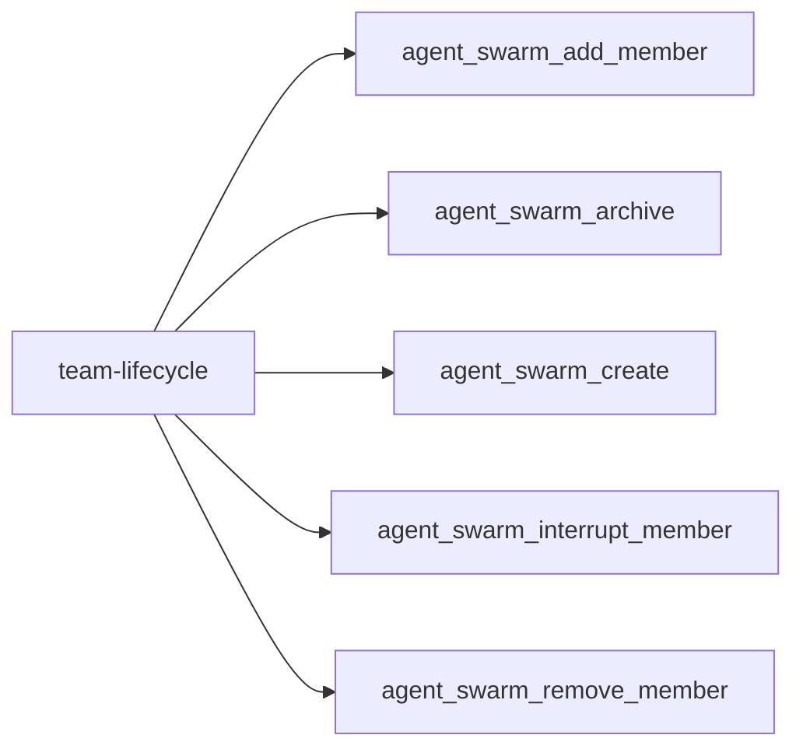
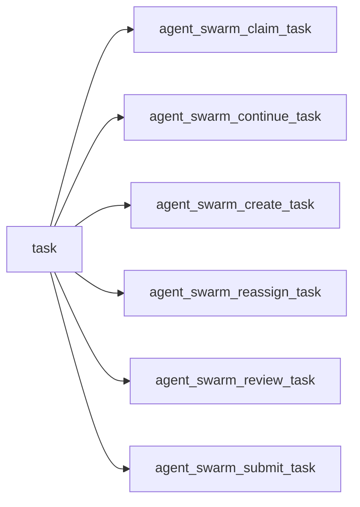
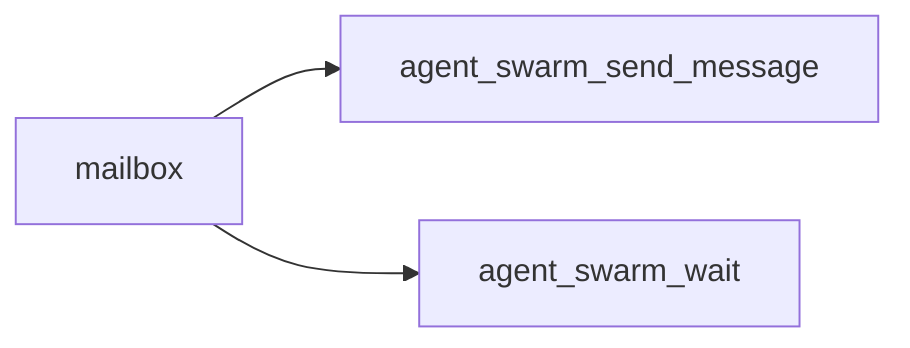
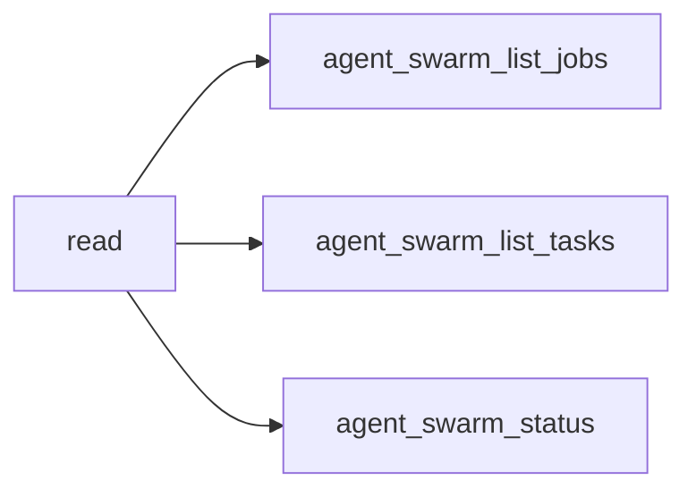
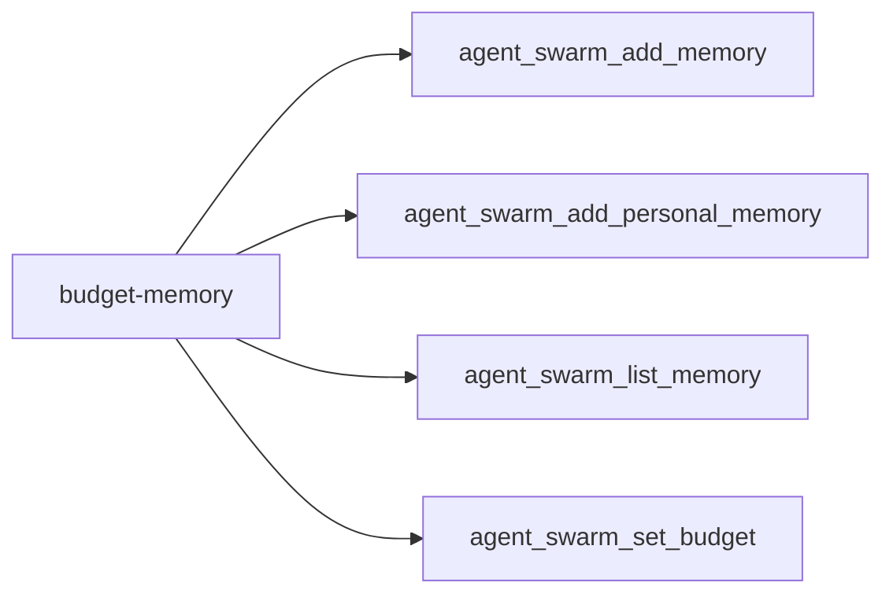

<!-- DO NOT EDIT: generated from docs/knowledge-graph/manifest.json -->

# Traceability

Manifest digest: `6b6f1e7d5b8bd8ed365a7641c9f97d2efa5c0a21c4d9baa6bb919bc8b026582f`

Curated tool-registry digest: `2af060c2441600f775e82097e626303c8fd607845230f4c489473bcecd4d7878`

> Claim ceiling: the registry is a reviewed capability overlay over exact source extraction. Per-tool deep semantic closure, acceptance, and real-Profile evidence remain explicit gaps; the complete mechanical graph is retained in `atlas.json`.

## Functional facets

| Functional facet | Title | Source anchors | Test anchors | Related tools | Evidence gaps |
|---|---|---|---|---|---|
| `tool` | Cross-mode static union of model-facing tools; default live surface is 19 and fresh-v2 live surface is the exclusive 6-tool vertical slice | src/tools.ts#registerAgentSwarmTools | tests/tool-policy.spec.ts | tool:agent_swarm_add_member tool:agent_swarm_add_memory tool:agent_swarm_add_personal_memory tool:agent_swarm_archive tool:agent_swarm_claim_task tool:agent_swarm_continue_task tool:agent_swarm_create tool:agent_swarm_create_task tool:agent_swarm_interrupt_member tool:agent_swarm_list_jobs tool:agent_swarm_list_memory tool:agent_swarm_list_tasks tool:agent_swarm_reassign_task tool:agent_swarm_remove_member tool:agent_swarm_review_task tool:agent_swarm_send_message tool:agent_swarm_set_budget tool:agent_swarm_status tool:agent_swarm_submit_task tool:agent_swarm_wait | NO_REAL_PROFILE_EVIDENCE PROFILE_DEPENDENT |
| `team` | Team lifecycle authority | src/domain/team-domain.ts#TeamDomain | tests/team-domain.spec.ts | tool:agent_swarm_add_member tool:agent_swarm_archive tool:agent_swarm_create tool:agent_swarm_interrupt_member tool:agent_swarm_remove_member | NO_REAL_PROFILE_EVIDENCE PROFILE_DEPENDENT |
| `member` | Member provisioning and lifecycle | src/runtime/member-provisioning.ts#MemberProvisioner.addMember | tests/member-provisioning.spec.ts | tool:agent_swarm_add_member tool:agent_swarm_interrupt_member tool:agent_swarm_remove_member | NO_REAL_PROFILE_EVIDENCE PROFILE_DEPENDENT |
| `task` | Task board and attempt fencing | src/domain/team-domain-board.ts#claimTask | tests/team-assignment-checkpoint.spec.ts tests/model-experience.spec.ts | tool:agent_swarm_claim_task tool:agent_swarm_continue_task tool:agent_swarm_create_task tool:agent_swarm_reassign_task tool:agent_swarm_review_task tool:agent_swarm_submit_task | NO_REAL_PROFILE_EVIDENCE PROFILE_DEPENDENT |
| `message` | Durable Team mailbox and wakeup delivery | src/domain/team-domain-mailbox.ts#queueMessage src/runtime/message-delivery.ts#MessageDelivery.deliverQueuedMessage | tests/message-delivery.spec.ts | tool:agent_swarm_send_message tool:agent_swarm_wait | NO_REAL_PROFILE_EVIDENCE PROFILE_DEPENDENT |
| `memory` | Team and personal memory | src/runtime/memory-operations.ts#MemoryOperations.list src/runtime/memory-query.ts#lexicalScore | tests/memory-member-profile.spec.ts | tool:agent_swarm_add_memory tool:agent_swarm_add_personal_memory tool:agent_swarm_list_memory | NO_REAL_PROFILE_EVIDENCE PROFILE_DEPENDENT |
| `budget` | Budget limits, usage, and reservation admission | src/domain/team-domain-budget.ts#setBudget | tests/budget-family.spec.ts | tool:agent_swarm_set_budget | NO_REAL_PROFILE_EVIDENCE PROFILE_DEPENDENT |
| `permission` | Caller identity and monotone tool permission policy | src/runtime/permission-policy.ts#decideToolPermission src/runtime/permission-surface.ts#TeamPermissionSurface.attachPreExecute | tests/permission-boundary.spec.ts tests/permission-real-composition.spec.ts | tool:agent_swarm_add_member tool:agent_swarm_add_memory tool:agent_swarm_add_personal_memory tool:agent_swarm_archive tool:agent_swarm_claim_task tool:agent_swarm_continue_task tool:agent_swarm_create tool:agent_swarm_create_task tool:agent_swarm_interrupt_member tool:agent_swarm_list_jobs tool:agent_swarm_list_memory tool:agent_swarm_list_tasks tool:agent_swarm_reassign_task tool:agent_swarm_remove_member tool:agent_swarm_review_task tool:agent_swarm_send_message tool:agent_swarm_set_budget tool:agent_swarm_status tool:agent_swarm_submit_task tool:agent_swarm_wait | NO_REAL_PROFILE_EVIDENCE PROFILE_DEPENDENT |
| `workflow` | Workflow bridge and scripted Team runs | src/runtime/workflow/team-bridge-engine.ts#TeamBridgeWorkflowEngine src/runtime/workflow/team-run.ts#TeamRun | tests/workflow-bridge.spec.ts | tool:agent_swarm_create_task tool:agent_swarm_review_task tool:agent_swarm_submit_task | NO_REAL_PROFILE_EVIDENCE PROFILE_DEPENDENT |
| `jobs` | Read-only Team jobs projection | src/runtime/jobs/team-job-projection.ts#TeamJobProjection | tests/jobs-reader.spec.ts tests/jobs-bridge.spec.ts | tool:agent_swarm_list_jobs | NO_REAL_PROFILE_EVIDENCE PROFILE_DEPENDENT CONFIG_DISABLED_BY_DEFAULT |
| `rpc` | Versioned bounded read RPC | src/rpc/read-rpc-service.ts#mountAgentSwarmReadRpc src/rpc/read-rpc-contract.ts#SWARM_READ_RPC_VERSION | tests/read-rpc-service.spec.ts tests/read-rpc-client.spec.ts | tool:agent_swarm_list_jobs tool:agent_swarm_list_tasks tool:agent_swarm_status | NO_REAL_PROFILE_EVIDENCE PROFILE_DEPENDENT |
| `ui` | Team dashboard UI projection | src/client/team-dashboard-plugin.ts#apply src/client/team-dashboard-controller.ts#TeamDashboardController | tests/team-dashboard-ui.spec.tsx tests/team-dashboard-controller.spec.ts | tool:agent_swarm_list_jobs tool:agent_swarm_list_tasks tool:agent_swarm_status | NO_REAL_PROFILE_EVIDENCE PROFILE_DEPENDENT |
| `config` | Plugin configuration and feature switches | src/index.ts#Config | tests/agent-swarm-settings.spec.tsx tests/dsh-composition.spec.ts | tool:agent_swarm_add_member tool:agent_swarm_claim_task tool:agent_swarm_list_jobs tool:agent_swarm_list_memory | NO_REAL_PROFILE_EVIDENCE PROFILE_DEPENDENT |

## Tool families

### team-lifecycle

| Stable capability id | Source | Test anchors | Documentation anchors |
|---|---|---|---|
| `tool:agent_swarm_add_member` | src/tools/team-lifecycle.ts#registerAddMemberTool | tests/member-provisioning.spec.ts | docs/04-core-protocol.md |
| `tool:agent_swarm_archive` | src/tools/team-lifecycle.ts#registerArchiveTool | — | docs/04-core-protocol.md |
| `tool:agent_swarm_create` | src/tools/team-lifecycle.ts#registerCreateTool | tests/dsh-composition.spec.ts | docs/04-core-protocol.md |
| `tool:agent_swarm_interrupt_member` | src/tools/team-lifecycle.ts#registerInterruptMemberTool | tests/official-compat-semantics.spec.ts | docs/04-core-protocol.md |
| `tool:agent_swarm_remove_member` | src/tools/team-lifecycle.ts#registerRemoveMemberTool | — | docs/04-core-protocol.md |

### task

| Stable capability id | Source | Test anchors | Documentation anchors |
|---|---|---|---|
| `tool:agent_swarm_claim_task` | src/tools/task-board.ts#registerClaimTaskTool | tests/model-experience.spec.ts tests/assignment-visibility.spec.ts | docs/04-core-protocol.md docs/08-testing-verification.md |
| `tool:agent_swarm_continue_task` | src/tools/continuation.ts#registerContinueTaskTool | tests/fresh-v2-continuation-domain.spec.ts tests/fresh-v2-continuation-fold.spec.ts tests/fresh-v2-continuation-runtime.spec.ts tests/fresh-v2-continuation-recovery-fold.spec.ts tests/fresh-v2-continuation-restart.spec.ts | docs/adr/0010-model-autonomy-and-parked-attempts.md docs/development/2026-08-24-team-runtime-architecture-blueprint-v1.md |
| `tool:agent_swarm_create_task` | src/tools/task-board.ts#registerCreateTaskTool | tests/assignment-visibility.spec.ts | docs/04-core-protocol.md |
| `tool:agent_swarm_reassign_task` | src/tools/task-board.ts#registerReassignTaskTool | tests/fresh-v2-task-control-domain.spec.ts tests/fresh-v2-task-control-runtime.spec.ts | docs/04-core-protocol.md docs/adr/0010-model-autonomy-and-parked-attempts.md docs/08-testing-verification.md |
| `tool:agent_swarm_review_task` | src/tools/task-board.ts#registerReviewTaskTool | tests/model-experience.spec.ts | docs/04-core-protocol.md docs/08-testing-verification.md |
| `tool:agent_swarm_submit_task` | src/tools/task-board.ts#registerSubmitTaskTool | tests/dsh-composition.spec.ts tests/fresh-v2-task-control-domain.spec.ts tests/fresh-v2-task-control-runtime.spec.ts | docs/04-core-protocol.md docs/adr/0010-model-autonomy-and-parked-attempts.md docs/08-testing-verification.md |

### mailbox

| Stable capability id | Source | Test anchors | Documentation anchors |
|---|---|---|---|
| `tool:agent_swarm_send_message` | src/tools/mailbox.ts#registerSendMessageTool | tests/message-delivery.spec.ts | docs/04-core-protocol.md |
| `tool:agent_swarm_wait` | src/tools/mailbox.ts#registerWaitTool | tests/model-experience.spec.ts tests/official-compat-semantics.spec.ts | docs/04-core-protocol.md docs/08-testing-verification.md |

### read

| Stable capability id | Source | Test anchors | Documentation anchors |
|---|---|---|---|
| `tool:agent_swarm_list_jobs` | src/tools/read-surface.ts#registerListJobsTool | tests/jobs-reader.spec.ts | docs/08-testing-verification.md |
| `tool:agent_swarm_list_tasks` | src/tools/read-surface.ts#registerListTasksTool | tests/model-experience.spec.ts | docs/08-testing-verification.md |
| `tool:agent_swarm_status` | src/tools/read-surface.ts#registerStatusTool | tests/model-experience.spec.ts | docs/08-testing-verification.md |

### budget-memory

| Stable capability id | Source | Test anchors | Documentation anchors |
|---|---|---|---|
| `tool:agent_swarm_add_memory` | src/tools/budget-memory.ts#registerAddMemoryTool | tests/memory-member-profile.spec.ts | docs/04-core-protocol.md |
| `tool:agent_swarm_add_personal_memory` | src/tools/budget-memory.ts#registerAddPersonalMemoryTool | tests/memory-member-profile.spec.ts | docs/04-core-protocol.md |
| `tool:agent_swarm_list_memory` | src/tools/budget-memory.ts#registerListMemoryTool | tests/memory-member-profile.spec.ts | docs/04-core-protocol.md |
| `tool:agent_swarm_set_budget` | src/tools/budget-memory.ts#registerSetBudgetTool | — | docs/04-core-protocol.md |

## Complete graph projection

```mermaid
flowchart LR
  n_61727469666163743a7061636b6167652d7265736f757263652f636f726469732e70617463682e796d6c["Package resource ./cordis.patch.yml"]
  n_61727469666163743a7061636b6167652d7265736f757263652f7061636b6167652e6a736f6e["Package resource ./package.json"]
  n_6361706162696c6974793a66726573682d76322d6d6f64656c2d64697370617463682d7769746e657373["Network-free per-Provider model dispatch witness capability"]
  n_646f63756d656e743a636f72652d70726f746f636f6c["Registered core protocol"]
  n_646f63756d656e743a66726573682d76322d72756e74696d652d626c75657072696e74["Fresh-v2 runtime architecture blueprint"]
  n_646f63756d656e743a6f6666696369616c2d626173656c696e65["Registered official release baseline"]
  n_646f63756d656e743a736f757263652d7265676973746572["Official source register"]
  n_646f63756d656e743a74657374696e672d766572696669636174696f6e["Registered verification contract"]
  n_6d6f64756c653a7372632f636c69656e742f6167656e742d737761726d2d73657474696e67732d636f6e74726f6c6c65722e7473["src/client/agent-swarm-settings-controller.ts"]
  n_6d6f64756c653a7372632f636c69656e742f6167656e742d737761726d2d73657474696e67732d6c6f63616c65732e7473["src/client/agent-swarm-settings-locales.ts"]
  n_6d6f64756c653a7372632f636c69656e742f6167656e742d737761726d2d73657474696e67732d7374796c65732e7473["src/client/agent-swarm-settings-styles.ts"]
  n_6d6f64756c653a7372632f636c69656e742f6167656e74737761726d73657474696e6773636172642e747378["src/client/AgentSwarmSettingsCard.tsx"]
  n_6d6f64756c653a7372632f636c69656e742f696e6465782e7473["src/client/index.ts"]
  n_6d6f64756c653a7372632f636c69656e742f706c7567696e2d656e7472792e7473["src/client/plugin-entry.ts"]
  n_6d6f64756c653a7372632f636c69656e742f726561642d636c69656e742e7473["src/client/read-client.ts"]
  n_6d6f64756c653a7372632f636c69656e742f7465616d2d64617368626f6172642d636f6e74726f6c6c65722e7473["src/client/team-dashboard-controller.ts"]
  n_6d6f64756c653a7372632f636c69656e742f7465616d2d64617368626f6172642d6c6f63616c65732e7473["src/client/team-dashboard-locales.ts"]
  n_6d6f64756c653a7372632f636c69656e742f7465616d2d64617368626f6172642d706c7567696e2e7473["src/client/team-dashboard-plugin.ts"]
  n_6d6f64756c653a7372632f636c69656e742f7465616d2d64617368626f6172642d7374796c65732e7473["src/client/team-dashboard-styles.ts"]
  n_6d6f64756c653a7372632f636c69656e742f7465616d2d64617368626f6172642d737572666163652d636f6f7264696e61746f722e7473["src/client/team-dashboard-surface-coordinator.ts"]
  n_6d6f64756c653a7372632f636c69656e742f7465616d64617368626f617264616374696f6e2e747378["src/client/TeamDashboardAction.tsx"]
  n_6d6f64756c653a7372632f636c69656e742f7465616d64617368626f617264636f6e74656e742e747378["src/client/TeamDashboardContent.tsx"]
  n_6d6f64756c653a7372632f636c69656e742f7465616d64617368626f61726464657461696c732e747378["src/client/TeamDashboardDetails.tsx"]
  n_6d6f64756c653a7372632f646f6d61696e2f6572726f722e7473["src/domain/error.ts"]
  n_6d6f64756c653a7372632f646f6d61696e2f67726170682e7473["src/domain/graph.ts"]
  n_6d6f64756c653a7372632f646f6d61696e2f73746174652d76616c69646174696f6e2d76322e7473["src/domain/state-validation-v2.ts"]
  n_6d6f64756c653a7372632f646f6d61696e2f73746174652d76616c69646174696f6e2e7473["src/domain/state-validation.ts"]
  n_6d6f64756c653a7372632f646f6d61696e2f7465616d2d646f6d61696e2d626f6172642e7473["src/domain/team-domain-board.ts"]
  n_6d6f64756c653a7372632f646f6d61696e2f7465616d2d646f6d61696e2d6275646765742e7473["src/domain/team-domain-budget.ts"]
  n_6d6f64756c653a7372632f646f6d61696e2f7465616d2d646f6d61696e2d6d61696c626f782e7473["src/domain/team-domain-mailbox.ts"]
  n_6d6f64756c653a7372632f636c69656e742f6167656e74737761726d73657474696e6773636172642e747378 -->|imports| n_6d6f64756c653a7372632f636c69656e742f6167656e742d737761726d2d73657474696e67732d636f6e74726f6c6c65722e7473
  n_6d6f64756c653a7372632f636c69656e742f6167656e74737761726d73657474696e6773636172642e747378 -->|imports| n_6d6f64756c653a7372632f636c69656e742f6167656e742d737761726d2d73657474696e67732d6c6f63616c65732e7473
  n_6d6f64756c653a7372632f636c69656e742f6167656e74737761726d73657474696e6773636172642e747378 -->|imports| n_6d6f64756c653a7372632f636c69656e742f6167656e742d737761726d2d73657474696e67732d7374796c65732e7473
  n_6d6f64756c653a7372632f636c69656e742f7465616d2d64617368626f6172642d636f6e74726f6c6c65722e7473 -->|imports| n_6d6f64756c653a7372632f636c69656e742f726561642d636c69656e742e7473
  n_6d6f64756c653a7372632f636c69656e742f7465616d2d64617368626f6172642d706c7567696e2e7473 -->|imports| n_6d6f64756c653a7372632f636c69656e742f726561642d636c69656e742e7473
  n_6d6f64756c653a7372632f636c69656e742f7465616d2d64617368626f6172642d706c7567696e2e7473 -->|imports| n_6d6f64756c653a7372632f636c69656e742f7465616d2d64617368626f6172642d636f6e74726f6c6c65722e7473
  n_6d6f64756c653a7372632f636c69656e742f7465616d2d64617368626f6172642d706c7567696e2e7473 -->|imports| n_6d6f64756c653a7372632f636c69656e742f7465616d2d64617368626f6172642d737572666163652d636f6f7264696e61746f722e7473
  n_6d6f64756c653a7372632f636c69656e742f7465616d2d64617368626f6172642d706c7567696e2e7473 -->|imports| n_6d6f64756c653a7372632f636c69656e742f7465616d64617368626f617264616374696f6e2e747378
  n_6d6f64756c653a7372632f636c69656e742f7465616d2d64617368626f6172642d706c7567696e2e7473 -->|imports| n_6d6f64756c653a7372632f636c69656e742f7465616d2d64617368626f6172642d6c6f63616c65732e7473
  n_6d6f64756c653a7372632f636c69656e742f7465616d2d64617368626f6172642d706c7567696e2e7473 -->|imports| n_6d6f64756c653a7372632f636c69656e742f6167656e74737761726d73657474696e6773636172642e747378
  n_6d6f64756c653a7372632f636c69656e742f7465616d2d64617368626f6172642d706c7567696e2e7473 -->|imports| n_6d6f64756c653a7372632f636c69656e742f6167656e742d737761726d2d73657474696e67732d636f6e74726f6c6c65722e7473
  n_6d6f64756c653a7372632f636c69656e742f7465616d2d64617368626f6172642d706c7567696e2e7473 -->|imports| n_6d6f64756c653a7372632f636c69656e742f6167656e742d737761726d2d73657474696e67732d6c6f63616c65732e7473
  n_6d6f64756c653a7372632f636c69656e742f7465616d2d64617368626f6172642d737572666163652d636f6f7264696e61746f722e7473 -->|imports| n_6d6f64756c653a7372632f636c69656e742f7465616d64617368626f61726464657461696c732e747378
  n_6d6f64756c653a7372632f636c69656e742f7465616d2d64617368626f6172642d737572666163652d636f6f7264696e61746f722e7473 -->|imports| n_6d6f64756c653a7372632f636c69656e742f7465616d2d64617368626f6172642d636f6e74726f6c6c65722e7473
  n_6d6f64756c653a7372632f636c69656e742f7465616d2d64617368626f6172642d737572666163652d636f6f7264696e61746f722e7473 -->|imports| n_6d6f64756c653a7372632f636c69656e742f7465616d2d64617368626f6172642d6c6f63616c65732e7473
  n_6d6f64756c653a7372632f636c69656e742f7465616d64617368626f617264616374696f6e2e747378 -->|imports| n_6d6f64756c653a7372632f636c69656e742f7465616d2d64617368626f6172642d6c6f63616c65732e7473
  n_6d6f64756c653a7372632f636c69656e742f7465616d64617368626f617264616374696f6e2e747378 -->|imports| n_6d6f64756c653a7372632f636c69656e742f7465616d2d64617368626f6172642d737572666163652d636f6f7264696e61746f722e7473
  n_6d6f64756c653a7372632f636c69656e742f7465616d64617368626f617264616374696f6e2e747378 -->|imports| n_6d6f64756c653a7372632f636c69656e742f7465616d2d64617368626f6172642d7374796c65732e7473
  n_6d6f64756c653a7372632f636c69656e742f7465616d64617368626f617264636f6e74656e742e747378 -->|imports| n_6d6f64756c653a7372632f636c69656e742f7465616d2d64617368626f6172642d636f6e74726f6c6c65722e7473
  n_6d6f64756c653a7372632f636c69656e742f7465616d64617368626f617264636f6e74656e742e747378 -->|imports| n_6d6f64756c653a7372632f636c69656e742f7465616d2d64617368626f6172642d737572666163652d636f6f7264696e61746f722e7473
  n_6d6f64756c653a7372632f636c69656e742f7465616d64617368626f617264636f6e74656e742e747378 -->|imports| n_6d6f64756c653a7372632f636c69656e742f7465616d2d64617368626f6172642d6c6f63616c65732e7473
  n_6d6f64756c653a7372632f636c69656e742f7465616d64617368626f61726464657461696c732e747378 -->|imports| n_6d6f64756c653a7372632f636c69656e742f7465616d2d64617368626f6172642d636f6e74726f6c6c65722e7473
  n_6d6f64756c653a7372632f636c69656e742f7465616d64617368626f61726464657461696c732e747378 -->|imports| n_6d6f64756c653a7372632f636c69656e742f7465616d2d64617368626f6172642d737572666163652d636f6f7264696e61746f722e7473
  n_6d6f64756c653a7372632f636c69656e742f7465616d64617368626f61726464657461696c732e747378 -->|imports| n_6d6f64756c653a7372632f636c69656e742f7465616d2d64617368626f6172642d6c6f63616c65732e7473
  n_6d6f64756c653a7372632f636c69656e742f7465616d64617368626f61726464657461696c732e747378 -->|imports| n_6d6f64756c653a7372632f636c69656e742f7465616d64617368626f617264636f6e74656e742e747378
  n_6d6f64756c653a7372632f646f6d61696e2f67726170682e7473 -->|imports| n_6d6f64756c653a7372632f646f6d61696e2f6572726f722e7473
  n_6d6f64756c653a7372632f646f6d61696e2f73746174652d76616c69646174696f6e2d76322e7473 -->|imports| n_6d6f64756c653a7372632f646f6d61696e2f6572726f722e7473
  n_6d6f64756c653a7372632f646f6d61696e2f73746174652d76616c69646174696f6e2d76322e7473 -->|imports| n_6d6f64756c653a7372632f646f6d61696e2f67726170682e7473
  n_6d6f64756c653a7372632f646f6d61696e2f73746174652d76616c69646174696f6e2e7473 -->|imports| n_6d6f64756c653a7372632f646f6d61696e2f6572726f722e7473
  n_6d6f64756c653a7372632f646f6d61696e2f73746174652d76616c69646174696f6e2e7473 -->|imports| n_6d6f64756c653a7372632f646f6d61696e2f67726170682e7473
  n_6d6f64756c653a7372632f646f6d61696e2f7465616d2d646f6d61696e2d626f6172642e7473 -->|imports| n_6d6f64756c653a7372632f646f6d61696e2f6572726f722e7473
  n_6d6f64756c653a7372632f646f6d61696e2f7465616d2d646f6d61696e2d626f6172642e7473 -->|imports| n_6d6f64756c653a7372632f646f6d61696e2f67726170682e7473
  n_6d6f64756c653a7372632f646f6d61696e2f7465616d2d646f6d61696e2d626f6172642e7473 -->|imports| n_6d6f64756c653a7372632f646f6d61696e2f7465616d2d646f6d61696e2d6275646765742e7473
  n_6d6f64756c653a7372632f646f6d61696e2f7465616d2d646f6d61696e2d6275646765742e7473 -->|imports| n_6d6f64756c653a7372632f646f6d61696e2f6572726f722e7473
  n_6d6f64756c653a7372632f646f6d61696e2f7465616d2d646f6d61696e2d6d61696c626f782e7473 -->|imports| n_6d6f64756c653a7372632f646f6d61696e2f6572726f722e7473
  n_6d6f64756c653a7372632f636c69656e742f696e6465782e7473 -->|exports| n_6d6f64756c653a7372632f636c69656e742f726561642d636c69656e742e7473
  n_6d6f64756c653a7372632f636c69656e742f696e6465782e7473 -->|exports| n_6d6f64756c653a7372632f636c69656e742f7465616d2d64617368626f6172642d636f6e74726f6c6c65722e7473
  n_6d6f64756c653a7372632f636c69656e742f706c7567696e2d656e7472792e7473 -->|exports| n_6d6f64756c653a7372632f636c69656e742f696e6465782e7473
  n_6d6f64756c653a7372632f636c69656e742f706c7567696e2d656e7472792e7473 -->|exports| n_6d6f64756c653a7372632f636c69656e742f7465616d2d64617368626f6172642d706c7567696e2e7473
```

_View capped at 30 nodes and 60 edges; use atlas.json for the complete graph._

| Stable id | Kind | Classification | Implementation | Verification | Acceptance | Availability | Owner |
|---|---|---|---|---|---|---|---|
| `artifact:package-resource/cordis.patch.yml` | artifact | MECHANICAL / UNCLASSIFIED | implemented | none | not-candidate | package-exported | `(unclassified)` |
| `artifact:package-resource/package.json` | artifact | MECHANICAL / UNCLASSIFIED | implemented | none | not-candidate | package-exported | `(unclassified)` |
| `capability:fresh-v2-model-dispatch-witness` | public-capability | REVIEWED | implemented | composition | candidate | config-gated | `official-authority:llm-runtime` |
| `document:core-protocol` | document | REVIEWED | implemented | static | candidate | always-registered | `authority:project-contracts` |
| `document:fresh-v2-runtime-blueprint` | document | REVIEWED | implemented | static | candidate | config-gated | `authority:project-contracts` |
| `document:official-baseline` | document | REVIEWED | implemented | static | candidate | always-registered | `authority:project-contracts` |
| `document:source-register` | document | REVIEWED | implemented | static | candidate | always-registered | `authority:project-contracts` |
| `document:testing-verification` | document | REVIEWED | implemented | static | candidate | always-registered | `authority:project-contracts` |
| `module:src/client/agent-swarm-settings-controller.ts` | module | MECHANICAL / UNCLASSIFIED | implemented | none | not-candidate | unavailable | `(unclassified)` |
| `module:src/client/agent-swarm-settings-locales.ts` | module | MECHANICAL / UNCLASSIFIED | implemented | none | not-candidate | unavailable | `(unclassified)` |
| `module:src/client/agent-swarm-settings-styles.ts` | module | MECHANICAL / UNCLASSIFIED | implemented | none | not-candidate | unavailable | `(unclassified)` |
| `module:src/client/agentswarmsettingscard.tsx` | module | MECHANICAL / UNCLASSIFIED | implemented | none | not-candidate | unavailable | `(unclassified)` |
| `module:src/client/index.ts` | module | MECHANICAL / UNCLASSIFIED | implemented | none | not-candidate | unavailable | `(unclassified)` |
| `module:src/client/plugin-entry.ts` | module | MECHANICAL / UNCLASSIFIED | implemented | none | not-candidate | unavailable | `(unclassified)` |
| `module:src/client/read-client.ts` | module | MECHANICAL / UNCLASSIFIED | implemented | none | not-candidate | unavailable | `(unclassified)` |
| `module:src/client/team-dashboard-controller.ts` | module | MECHANICAL / UNCLASSIFIED | implemented | none | not-candidate | unavailable | `(unclassified)` |
| `module:src/client/team-dashboard-locales.ts` | module | MECHANICAL / UNCLASSIFIED | implemented | none | not-candidate | unavailable | `(unclassified)` |
| `module:src/client/team-dashboard-plugin.ts` | module | MECHANICAL / UNCLASSIFIED | implemented | none | not-candidate | unavailable | `(unclassified)` |
| `module:src/client/team-dashboard-styles.ts` | module | MECHANICAL / UNCLASSIFIED | implemented | none | not-candidate | unavailable | `(unclassified)` |
| `module:src/client/team-dashboard-surface-coordinator.ts` | module | MECHANICAL / UNCLASSIFIED | implemented | none | not-candidate | unavailable | `(unclassified)` |
| `module:src/client/teamdashboardaction.tsx` | module | MECHANICAL / UNCLASSIFIED | implemented | none | not-candidate | unavailable | `(unclassified)` |
| `module:src/client/teamdashboardcontent.tsx` | module | MECHANICAL / UNCLASSIFIED | implemented | none | not-candidate | unavailable | `(unclassified)` |
| `module:src/client/teamdashboarddetails.tsx` | module | MECHANICAL / UNCLASSIFIED | implemented | none | not-candidate | unavailable | `(unclassified)` |
| `module:src/domain/error.ts` | module | MECHANICAL / UNCLASSIFIED | implemented | none | not-candidate | unavailable | `(unclassified)` |
| `module:src/domain/graph.ts` | module | MECHANICAL / UNCLASSIFIED | implemented | none | not-candidate | unavailable | `(unclassified)` |
| `module:src/domain/state-validation-v2.ts` | module | MECHANICAL / UNCLASSIFIED | implemented | none | not-candidate | unavailable | `(unclassified)` |
| `module:src/domain/state-validation.ts` | module | MECHANICAL / UNCLASSIFIED | implemented | none | not-candidate | unavailable | `(unclassified)` |
| `module:src/domain/team-domain-board.ts` | module | MECHANICAL / UNCLASSIFIED | implemented | none | not-candidate | unavailable | `(unclassified)` |
| `module:src/domain/team-domain-budget.ts` | module | MECHANICAL / UNCLASSIFIED | implemented | none | not-candidate | unavailable | `(unclassified)` |
| `module:src/domain/team-domain-mailbox.ts` | module | MECHANICAL / UNCLASSIFIED | implemented | none | not-candidate | unavailable | `(unclassified)` |
| `module:src/domain/team-domain-port.ts` | module | MECHANICAL / UNCLASSIFIED | implemented | none | not-candidate | unavailable | `(unclassified)` |
| `module:src/domain/team-domain-projection.ts` | module | MECHANICAL / UNCLASSIFIED | implemented | none | not-candidate | unavailable | `(unclassified)` |
| `module:src/domain/team-domain-roster.ts` | module | MECHANICAL / UNCLASSIFIED | implemented | none | not-candidate | unavailable | `(unclassified)` |
| `module:src/domain/team-domain-shared.ts` | module | MECHANICAL / UNCLASSIFIED | implemented | none | not-candidate | unavailable | `(unclassified)` |
| `module:src/domain/team-domain-v2-continuation-recovery.ts` | module | MECHANICAL / UNCLASSIFIED | implemented | none | not-candidate | unavailable | `(unclassified)` |
| `module:src/domain/team-domain-v2-continuation.ts` | module | MECHANICAL / UNCLASSIFIED | implemented | none | not-candidate | unavailable | `(unclassified)` |
| `module:src/domain/team-domain-v2-initial-outcome.ts` | module | MECHANICAL / UNCLASSIFIED | implemented | none | not-candidate | unavailable | `(unclassified)` |
| `module:src/domain/team-domain-v2-shared.ts` | module | MECHANICAL / UNCLASSIFIED | implemented | none | not-candidate | unavailable | `(unclassified)` |
| `module:src/domain/team-domain-v2-start.ts` | module | MECHANICAL / UNCLASSIFIED | implemented | none | not-candidate | unavailable | `(unclassified)` |
| `module:src/domain/team-domain-v2-task-control.ts` | module | MECHANICAL / UNCLASSIFIED | implemented | none | not-candidate | unavailable | `(unclassified)` |
| `module:src/domain/team-domain.ts` | module | MECHANICAL / UNCLASSIFIED | implemented | none | not-candidate | unavailable | `(unclassified)` |
| `module:src/domain/team-state-v2.ts` | module | MECHANICAL / UNCLASSIFIED | implemented | none | not-candidate | unavailable | `(unclassified)` |
| `module:src/domain/types.ts` | module | MECHANICAL / UNCLASSIFIED | implemented | none | not-candidate | unavailable | `(unclassified)` |
| `module:src/host/frozen-json.ts` | module | MECHANICAL / UNCLASSIFIED | implemented | none | not-candidate | unavailable | `(unclassified)` |
| `module:src/host/host-read-assembly.ts` | module | MECHANICAL / UNCLASSIFIED | implemented | none | not-candidate | unavailable | `(unclassified)` |
| `module:src/host/host-read-service.ts` | module | MECHANICAL / UNCLASSIFIED | implemented | none | not-candidate | unavailable | `(unclassified)` |
| `module:src/host/host-read-types.ts` | module | MECHANICAL / UNCLASSIFIED | implemented | none | not-candidate | unavailable | `(unclassified)` |
| `module:src/host/producer-contract.ts` | module | MECHANICAL / UNCLASSIFIED | implemented | none | not-candidate | unavailable | `(unclassified)` |
| `module:src/host/producer-floor-assembly.ts` | module | MECHANICAL / UNCLASSIFIED | implemented | none | not-candidate | unavailable | `(unclassified)` |
| `module:src/host/producer-floor-service.ts` | module | MECHANICAL / UNCLASSIFIED | implemented | none | not-candidate | unavailable | `(unclassified)` |
| `module:src/human/captain-liaison.ts` | module | MECHANICAL / UNCLASSIFIED | implemented | none | not-candidate | unavailable | `(unclassified)` |
| `module:src/human/human-control-gateway.ts` | module | MECHANICAL / UNCLASSIFIED | implemented | none | not-candidate | unavailable | `(unclassified)` |
| `module:src/human/human-control-validation.ts` | module | MECHANICAL / UNCLASSIFIED | implemented | none | not-candidate | unavailable | `(unclassified)` |
| `module:src/human/human-interaction-contract.ts` | module | MECHANICAL / UNCLASSIFIED | implemented | none | not-candidate | unavailable | `(unclassified)` |
| `module:src/human/human-interaction-store.ts` | module | MECHANICAL / UNCLASSIFIED | implemented | none | not-candidate | unavailable | `(unclassified)` |
| `module:src/human/human-review-provider.ts` | module | MECHANICAL / UNCLASSIFIED | implemented | none | not-candidate | unavailable | `(unclassified)` |
| `module:src/human/official-question-presentation.ts` | module | MECHANICAL / UNCLASSIFIED | implemented | none | not-candidate | unavailable | `(unclassified)` |
| `module:src/index.ts` | module | MECHANICAL / UNCLASSIFIED | implemented | none | not-candidate | unavailable | `(unclassified)` |
| `module:src/migration/migrate-legacy-store.ts` | module | MECHANICAL / UNCLASSIFIED | implemented | none | not-candidate | unavailable | `(unclassified)` |
| `module:src/migration/team-v1-to-v2.ts` | module | MECHANICAL / UNCLASSIFIED | implemented | none | not-candidate | unavailable | `(unclassified)` |
| `module:src/patterns/node-mapping.ts` | module | MECHANICAL / UNCLASSIFIED | implemented | none | not-candidate | unavailable | `(unclassified)` |
| `module:src/protocol/canonical-v2.ts` | module | MECHANICAL / UNCLASSIFIED | implemented | none | not-candidate | unavailable | `(unclassified)` |
| `module:src/public-api.ts` | module | MECHANICAL / UNCLASSIFIED | implemented | none | not-candidate | unavailable | `(unclassified)` |
| `module:src/rpc/read-rpc-artifact.ts` | module | MECHANICAL / UNCLASSIFIED | implemented | none | not-candidate | unavailable | `(unclassified)` |
| `module:src/rpc/read-rpc-contract.ts` | module | MECHANICAL / UNCLASSIFIED | implemented | none | not-candidate | unavailable | `(unclassified)` |
| `module:src/rpc/read-rpc-service.ts` | module | MECHANICAL / UNCLASSIFIED | implemented | none | not-candidate | unavailable | `(unclassified)` |
| `module:src/runtime/authority.ts` | module | MECHANICAL / UNCLASSIFIED | implemented | none | not-candidate | unavailable | `(unclassified)` |
| `module:src/runtime/disposal.ts` | module | MECHANICAL / UNCLASSIFIED | implemented | none | not-candidate | unavailable | `(unclassified)` |
| `module:src/runtime/executable-review.ts` | module | MECHANICAL / UNCLASSIFIED | implemented | none | not-candidate | unavailable | `(unclassified)` |
| `module:src/runtime/execution-root-handoff.ts` | module | MECHANICAL / UNCLASSIFIED | implemented | none | not-candidate | unavailable | `(unclassified)` |
| `module:src/runtime/execution-root-surface.ts` | module | MECHANICAL / UNCLASSIFIED | implemented | none | not-candidate | unavailable | `(unclassified)` |
| `module:src/runtime/execution-roots.ts` | module | MECHANICAL / UNCLASSIFIED | implemented | none | not-candidate | unavailable | `(unclassified)` |
| `module:src/runtime/frame-visibility.ts` | module | MECHANICAL / UNCLASSIFIED | implemented | none | not-candidate | unavailable | `(unclassified)` |
| `module:src/runtime/fresh-v2-continuation-fold.ts` | module | MECHANICAL / UNCLASSIFIED | implemented | none | not-candidate | unavailable | `(unclassified)` |
| `module:src/runtime/fresh-v2-continuation-recovery-fold.ts` | module | MECHANICAL / UNCLASSIFIED | implemented | none | not-candidate | unavailable | `(unclassified)` |
| `module:src/runtime/fresh-v2-continuation-runtime.ts` | module | MECHANICAL / UNCLASSIFIED | implemented | none | not-candidate | unavailable | `(unclassified)` |
| `module:src/runtime/fresh-v2-evidence-coordinator.ts` | module | MECHANICAL / UNCLASSIFIED | implemented | none | not-candidate | unavailable | `(unclassified)` |
| `module:src/runtime/fresh-v2-hooks.ts` | module | MECHANICAL / UNCLASSIFIED | implemented | none | not-candidate | unavailable | `(unclassified)` |
| `module:src/runtime/fresh-v2-initial-config.ts` | module | MECHANICAL / UNCLASSIFIED | implemented | none | not-candidate | unavailable | `(unclassified)` |
| `module:src/runtime/fresh-v2-initial-model-gate.ts` | module | MECHANICAL / UNCLASSIFIED | implemented | none | not-candidate | unavailable | `(unclassified)` |
| `module:src/runtime/fresh-v2-initial-outcome-fold.ts` | module | MECHANICAL / UNCLASSIFIED | implemented | none | not-candidate | unavailable | `(unclassified)` |
| `module:src/runtime/fresh-v2-initial-outcome-recovery.ts` | module | MECHANICAL / UNCLASSIFIED | implemented | none | not-candidate | unavailable | `(unclassified)` |
| `module:src/runtime/fresh-v2-initial-runtime.ts` | module | MECHANICAL / UNCLASSIFIED | implemented | none | not-candidate | unavailable | `(unclassified)` |
| `module:src/runtime/fresh-v2-initial-support.ts` | module | MECHANICAL / UNCLASSIFIED | implemented | none | not-candidate | unavailable | `(unclassified)` |
| `module:src/runtime/fresh-v2-model-permit.ts` | module | MECHANICAL / UNCLASSIFIED | implemented | none | not-candidate | unavailable | `(unclassified)` |
| `module:src/runtime/fresh-v2-recovery-driver.ts` | module | MECHANICAL / UNCLASSIFIED | implemented | none | not-candidate | unavailable | `(unclassified)` |
| `module:src/runtime/fresh-v2-session-fold.ts` | module | MECHANICAL / UNCLASSIFIED | implemented | none | not-candidate | unavailable | `(unclassified)` |
| `module:src/runtime/fresh-v2-session-step.ts` | module | MECHANICAL / UNCLASSIFIED | implemented | none | not-candidate | unavailable | `(unclassified)` |
| `module:src/runtime/fresh-v2-task-control-runtime.ts` | module | MECHANICAL / UNCLASSIFIED | implemented | none | not-candidate | unavailable | `(unclassified)` |
| `module:src/runtime/fresh-v2-witness-capability.ts` | module | MECHANICAL / UNCLASSIFIED | implemented | none | not-candidate | unavailable | `(unclassified)` |
| `module:src/runtime/human-provenance.ts` | module | MECHANICAL / UNCLASSIFIED | implemented | none | not-candidate | unavailable | `(unclassified)` |
| `module:src/runtime/jobs/projection-derive.ts` | module | MECHANICAL / UNCLASSIFIED | implemented | none | not-candidate | unavailable | `(unclassified)` |
| `module:src/runtime/jobs/team-job-projection.ts` | module | MECHANICAL / UNCLASSIFIED | implemented | none | not-candidate | unavailable | `(unclassified)` |
| `module:src/runtime/member-control.ts` | module | MECHANICAL / UNCLASSIFIED | implemented | none | not-candidate | unavailable | `(unclassified)` |
| `module:src/runtime/member-provisioning.ts` | module | MECHANICAL / UNCLASSIFIED | implemented | none | not-candidate | unavailable | `(unclassified)` |
| `module:src/runtime/member-skill-policy.ts` | module | MECHANICAL / UNCLASSIFIED | implemented | none | not-candidate | unavailable | `(unclassified)` |
| `module:src/runtime/memory-operations.ts` | module | MECHANICAL / UNCLASSIFIED | implemented | none | not-candidate | unavailable | `(unclassified)` |
| `module:src/runtime/memory-query.ts` | module | MECHANICAL / UNCLASSIFIED | implemented | none | not-candidate | unavailable | `(unclassified)` |
| `module:src/runtime/message-delivery.ts` | module | MECHANICAL / UNCLASSIFIED | implemented | none | not-candidate | unavailable | `(unclassified)` |
| `module:src/runtime/orchestration-ownership.ts` | module | MECHANICAL / UNCLASSIFIED | implemented | none | not-candidate | unavailable | `(unclassified)` |
| `module:src/runtime/orchestrator-runtime.ts` | module | MECHANICAL / UNCLASSIFIED | implemented | none | not-candidate | unavailable | `(unclassified)` |
| `module:src/runtime/permission-policy.ts` | module | MECHANICAL / UNCLASSIFIED | implemented | none | not-candidate | unavailable | `(unclassified)` |
| `module:src/runtime/permission-surface.ts` | module | MECHANICAL / UNCLASSIFIED | implemented | none | not-candidate | unavailable | `(unclassified)` |
| `module:src/runtime/prompts.ts` | module | MECHANICAL / UNCLASSIFIED | implemented | none | not-candidate | unavailable | `(unclassified)` |
| `module:src/runtime/providers.ts` | module | MECHANICAL / UNCLASSIFIED | implemented | none | not-candidate | unavailable | `(unclassified)` |
| `module:src/runtime/review-root.ts` | module | MECHANICAL / UNCLASSIFIED | implemented | none | not-candidate | unavailable | `(unclassified)` |
| `module:src/runtime/review-transaction.ts` | module | MECHANICAL / UNCLASSIFIED | implemented | none | not-candidate | unavailable | `(unclassified)` |
| `module:src/runtime/reviewer-boundary.ts` | module | MECHANICAL / UNCLASSIFIED | implemented | none | not-candidate | unavailable | `(unclassified)` |
| `module:src/runtime/runtime-contract.ts` | module | MECHANICAL / UNCLASSIFIED | implemented | none | not-candidate | unavailable | `(unclassified)` |
| `module:src/runtime/scheduling.ts` | module | MECHANICAL / UNCLASSIFIED | implemented | none | not-candidate | unavailable | `(unclassified)` |
| `module:src/runtime/session-acceptance.ts` | module | MECHANICAL / UNCLASSIFIED | implemented | none | not-candidate | unavailable | `(unclassified)` |
| `module:src/runtime/settings.ts` | module | MECHANICAL / UNCLASSIFIED | implemented | none | not-candidate | unavailable | `(unclassified)` |
| `module:src/runtime/tool-policy.ts` | module | MECHANICAL / UNCLASSIFIED | implemented | none | not-candidate | unavailable | `(unclassified)` |
| `module:src/runtime/usage-accounting.ts` | module | MECHANICAL / UNCLASSIFIED | implemented | none | not-candidate | unavailable | `(unclassified)` |
| `module:src/runtime/usage-prompt.ts` | module | MECHANICAL / UNCLASSIFIED | implemented | none | not-candidate | unavailable | `(unclassified)` |
| `module:src/runtime/usage-recovery.ts` | module | MECHANICAL / UNCLASSIFIED | implemented | none | not-candidate | unavailable | `(unclassified)` |
| `module:src/runtime/verification-commands.ts` | module | MECHANICAL / UNCLASSIFIED | implemented | none | not-candidate | unavailable | `(unclassified)` |
| `module:src/runtime/verification-family.ts` | module | MECHANICAL / UNCLASSIFIED | implemented | none | not-candidate | unavailable | `(unclassified)` |
| `module:src/runtime/verification-summary.ts` | module | MECHANICAL / UNCLASSIFIED | implemented | none | not-candidate | unavailable | `(unclassified)` |
| `module:src/runtime/wait-surface.ts` | module | MECHANICAL / UNCLASSIFIED | implemented | none | not-candidate | unavailable | `(unclassified)` |
| `module:src/runtime/workflow/budget-carry.ts` | module | MECHANICAL / UNCLASSIFIED | implemented | none | not-candidate | unavailable | `(unclassified)` |
| `module:src/runtime/workflow/realm.ts` | module | MECHANICAL / UNCLASSIFIED | implemented | none | not-candidate | unavailable | `(unclassified)` |
| `module:src/runtime/workflow/script-executor.ts` | module | MECHANICAL / UNCLASSIFIED | implemented | none | not-candidate | unavailable | `(unclassified)` |
| `module:src/runtime/workflow/team-bridge-engine.ts` | module | MECHANICAL / UNCLASSIFIED | implemented | none | not-candidate | unavailable | `(unclassified)` |
| `module:src/runtime/workflow/team-run.ts` | module | MECHANICAL / UNCLASSIFIED | implemented | none | not-candidate | unavailable | `(unclassified)` |
| `module:src/storage/storage-domain-team-store-v2.ts` | module | MECHANICAL / UNCLASSIFIED | implemented | none | not-candidate | unavailable | `(unclassified)` |
| `module:src/storage/storage-domain-team-store.ts` | module | MECHANICAL / UNCLASSIFIED | implemented | none | not-candidate | unavailable | `(unclassified)` |
| `module:src/storage/team-spec-v2.ts` | module | MECHANICAL / UNCLASSIFIED | implemented | none | not-candidate | unavailable | `(unclassified)` |
| `module:src/storage/team-spec.ts` | module | MECHANICAL / UNCLASSIFIED | implemented | none | not-candidate | unavailable | `(unclassified)` |
| `module:src/storage/team-store.ts` | module | MECHANICAL / UNCLASSIFIED | implemented | none | not-candidate | unavailable | `(unclassified)` |
| `module:src/storage/workflow-run-overlay.ts` | module | MECHANICAL / UNCLASSIFIED | implemented | none | not-candidate | unavailable | `(unclassified)` |
| `module:src/tools.ts` | module | MECHANICAL / UNCLASSIFIED | implemented | none | not-candidate | unavailable | `(unclassified)` |
| `module:src/tools/budget-memory.ts` | module | MECHANICAL / UNCLASSIFIED | implemented | none | not-candidate | unavailable | `(unclassified)` |
| `module:src/tools/continuation.ts` | module | MECHANICAL / UNCLASSIFIED | implemented | none | not-candidate | unavailable | `(unclassified)` |
| `module:src/tools/mailbox.ts` | module | MECHANICAL / UNCLASSIFIED | implemented | none | not-candidate | unavailable | `(unclassified)` |
| `module:src/tools/read-surface.ts` | module | MECHANICAL / UNCLASSIFIED | implemented | none | not-candidate | unavailable | `(unclassified)` |
| `module:src/tools/shared.ts` | module | MECHANICAL / UNCLASSIFIED | implemented | none | not-candidate | unavailable | `(unclassified)` |
| `module:src/tools/task-board.ts` | module | MECHANICAL / UNCLASSIFIED | implemented | none | not-candidate | unavailable | `(unclassified)` |
| `module:src/tools/team-lifecycle.ts` | module | MECHANICAL / UNCLASSIFIED | implemented | none | not-candidate | unavailable | `(unclassified)` |
| `public-capability:export/public-api/agentswarmhostreaddeps` | public-capability | MECHANICAL / UNCLASSIFIED | implemented | none | not-candidate | package-exported | `(unclassified)` |
| `public-capability:export/public-api/agentswarmhostreadservice` | public-capability | MECHANICAL / UNCLASSIFIED | implemented | none | not-candidate | package-exported | `(unclassified)` |
| `public-capability:export/public-api/agentswarmproducerfloordeps` | public-capability | MECHANICAL / UNCLASSIFIED | implemented | none | not-candidate | package-exported | `(unclassified)` |
| `public-capability:export/public-api/agentswarmproducerfloorservice` | public-capability | MECHANICAL / UNCLASSIFIED | implemented | none | not-candidate | package-exported | `(unclassified)` |
| `public-capability:export/public-api/agentswarmruntime` | public-capability | MECHANICAL / UNCLASSIFIED | implemented | none | not-candidate | package-exported | `(unclassified)` |
| `public-capability:export/public-api/aggregateverificationevidence` | public-capability | MECHANICAL / UNCLASSIFIED | implemented | none | not-candidate | package-exported | `(unclassified)` |
| `public-capability:export/public-api/appliednodeplan` | public-capability | MECHANICAL / UNCLASSIFIED | implemented | none | not-candidate | package-exported | `(unclassified)` |
| `public-capability:export/public-api/applynodeplan` | public-capability | MECHANICAL / UNCLASSIFIED | implemented | none | not-candidate | package-exported | `(unclassified)` |
| `public-capability:export/public-api/attemptid` | public-capability | MECHANICAL / UNCLASSIFIED | implemented | none | not-candidate | package-exported | `(unclassified)` |
| `public-capability:export/public-api/bridgeengineconfig` | public-capability | MECHANICAL / UNCLASSIFIED | implemented | none | not-candidate | package-exported | `(unclassified)` |
| `public-capability:export/public-api/builtinverificationtemplate` | public-capability | MECHANICAL / UNCLASSIFIED | implemented | none | not-candidate | package-exported | `(unclassified)` |
| `public-capability:export/public-api/builtinverificationtemplates` | public-capability | MECHANICAL / UNCLASSIFIED | implemented | none | not-candidate | package-exported | `(unclassified)` |
| `public-capability:export/public-api/candidate_output_artifact` | public-capability | MECHANICAL / UNCLASSIFIED | implemented | none | not-candidate | package-exported | `(unclassified)` |
| `public-capability:export/public-api/canonicaljson` | public-capability | MECHANICAL / UNCLASSIFIED | implemented | none | not-candidate | package-exported | `(unclassified)` |
| `public-capability:export/public-api/captainliaison` | public-capability | MECHANICAL / UNCLASSIFIED | implemented | none | not-candidate | package-exported | `(unclassified)` |
| `public-capability:export/public-api/captainquestion` | public-capability | MECHANICAL / UNCLASSIFIED | implemented | none | not-candidate | package-exported | `(unclassified)` |
| `public-capability:export/public-api/captainquestionpresentation` | public-capability | MECHANICAL / UNCLASSIFIED | implemented | none | not-candidate | package-exported | `(unclassified)` |
| `public-capability:export/public-api/compilednodeplan` | public-capability | MECHANICAL / UNCLASSIFIED | implemented | none | not-candidate | package-exported | `(unclassified)` |
| `public-capability:export/public-api/compiledreviewgate` | public-capability | MECHANICAL / UNCLASSIFIED | implemented | none | not-candidate | package-exported | `(unclassified)` |
| `public-capability:export/public-api/compiledtaskinput` | public-capability | MECHANICAL / UNCLASSIFIED | implemented | none | not-candidate | package-exported | `(unclassified)` |
| `public-capability:export/public-api/compiledtaskop` | public-capability | MECHANICAL / UNCLASSIFIED | implemented | none | not-candidate | package-exported | `(unclassified)` |
| `public-capability:export/public-api/compilenodeplan` | public-capability | MECHANICAL / UNCLASSIFIED | implemented | none | not-candidate | package-exported | `(unclassified)` |
| `public-capability:export/public-api/compileverificationdeclarations` | public-capability | MECHANICAL / UNCLASSIFIED | implemented | none | not-candidate | package-exported | `(unclassified)` |
| `public-capability:export/public-api/createtaskinput` | public-capability | MECHANICAL / UNCLASSIFIED | implemented | none | not-candidate | package-exported | `(unclassified)` |
| `public-capability:export/public-api/derivedteamjob` | public-capability | MECHANICAL / UNCLASSIFIED | implemented | none | not-candidate | package-exported | `(unclassified)` |
| `public-capability:export/public-api/effectivetoolpolicy` | public-capability | MECHANICAL / UNCLASSIFIED | implemented | none | not-candidate | package-exported | `(unclassified)` |
| `public-capability:export/public-api/encodeverificationcommand` | public-capability | MECHANICAL / UNCLASSIFIED | implemented | none | not-candidate | package-exported | `(unclassified)` |
| `public-capability:export/public-api/executablereview` | public-capability | MECHANICAL / UNCLASSIFIED | implemented | none | not-candidate | package-exported | `(unclassified)` |
| `public-capability:export/public-api/executablereviewoptions` | public-capability | MECHANICAL / UNCLASSIFIED | implemented | none | not-candidate | package-exported | `(unclassified)` |
| `public-capability:export/public-api/executablereviewprovider` | public-capability | MECHANICAL / UNCLASSIFIED | implemented | none | not-candidate | package-exported | `(unclassified)` |
| `public-capability:export/public-api/executablereviewresult` | public-capability | MECHANICAL / UNCLASSIFIED | implemented | none | not-candidate | package-exported | `(unclassified)` |
| `public-capability:export/public-api/executablereviewrootcapabilities` | public-capability | MECHANICAL / UNCLASSIFIED | implemented | none | not-candidate | package-exported | `(unclassified)` |
| `public-capability:export/public-api/execution_root_marker` | public-capability | MECHANICAL / UNCLASSIFIED | implemented | none | not-candidate | package-exported | `(unclassified)` |
| `public-capability:export/public-api/executionlease` | public-capability | MECHANICAL / UNCLASSIFIED | implemented | none | not-candidate | package-exported | `(unclassified)` |
| `public-capability:export/public-api/executionroot` | public-capability | MECHANICAL / UNCLASSIFIED | implemented | none | not-candidate | package-exported | `(unclassified)` |
| `public-capability:export/public-api/executionrootisolation` | public-capability | MECHANICAL / UNCLASSIFIED | implemented | none | not-candidate | package-exported | `(unclassified)` |
| `public-capability:export/public-api/executionrootresidue` | public-capability | MECHANICAL / UNCLASSIFIED | implemented | none | not-candidate | package-exported | `(unclassified)` |
| `public-capability:export/public-api/executionroots` | public-capability | MECHANICAL / UNCLASSIFIED | implemented | none | not-candidate | package-exported | `(unclassified)` |
| `public-capability:export/public-api/fileteamstore` | public-capability | MECHANICAL / UNCLASSIFIED | implemented | none | not-candidate | package-exported | `(unclassified)` |
| `public-capability:export/public-api/gitworktreeexecutionroots` | public-capability | MECHANICAL / UNCLASSIFIED | implemented | none | not-candidate | package-exported | `(unclassified)` |
| `public-capability:export/public-api/human_interaction_control_intents` | public-capability | MECHANICAL / UNCLASSIFIED | implemented | none | not-candidate | package-exported | `(unclassified)` |
| `public-capability:export/public-api/human_interaction_domain_name` | public-capability | MECHANICAL / UNCLASSIFIED | implemented | none | not-candidate | package-exported | `(unclassified)` |
| `public-capability:export/public-api/human_interaction_domain_version` | public-capability | MECHANICAL / UNCLASSIFIED | implemented | none | not-candidate | package-exported | `(unclassified)` |
| `public-capability:export/public-api/humancontroladmission` | public-capability | MECHANICAL / UNCLASSIFIED | implemented | none | not-candidate | package-exported | `(unclassified)` |
| `public-capability:export/public-api/humancontrolgateway` | public-capability | MECHANICAL / UNCLASSIFIED | implemented | none | not-candidate | package-exported | `(unclassified)` |
| `public-capability:export/public-api/humancontrolgatewaydeps` | public-capability | MECHANICAL / UNCLASSIFIED | implemented | none | not-candidate | package-exported | `(unclassified)` |
| `public-capability:export/public-api/humaninteractionadmission` | public-capability | MECHANICAL / UNCLASSIFIED | implemented | none | not-candidate | package-exported | `(unclassified)` |
| `public-capability:export/public-api/humaninteractiondomainspec` | public-capability | MECHANICAL / UNCLASSIFIED | implemented | none | not-candidate | package-exported | `(unclassified)` |
| `public-capability:export/public-api/humaninteractionintent` | public-capability | MECHANICAL / UNCLASSIFIED | implemented | none | not-candidate | package-exported | `(unclassified)` |
| `public-capability:export/public-api/humaninteractionorigin` | public-capability | MECHANICAL / UNCLASSIFIED | implemented | none | not-candidate | package-exported | `(unclassified)` |
| `public-capability:export/public-api/humaninteractionoverlaystore` | public-capability | MECHANICAL / UNCLASSIFIED | implemented | none | not-candidate | package-exported | `(unclassified)` |
| `public-capability:export/public-api/humaninteractionport` | public-capability | MECHANICAL / UNCLASSIFIED | implemented | none | not-candidate | package-exported | `(unclassified)` |
| `public-capability:export/public-api/humaninteractionreceipt` | public-capability | MECHANICAL / UNCLASSIFIED | implemented | none | not-candidate | package-exported | `(unclassified)` |
| `public-capability:export/public-api/humaninteractionrecord` | public-capability | MECHANICAL / UNCLASSIFIED | implemented | none | not-candidate | package-exported | `(unclassified)` |
| `public-capability:export/public-api/humaninteractionrequest` | public-capability | MECHANICAL / UNCLASSIFIED | implemented | none | not-candidate | package-exported | `(unclassified)` |
| `public-capability:export/public-api/humaninteractionsource` | public-capability | MECHANICAL / UNCLASSIFIED | implemented | none | not-candidate | package-exported | `(unclassified)` |
| `public-capability:export/public-api/humaninteractionstatus` | public-capability | MECHANICAL / UNCLASSIFIED | implemented | none | not-candidate | package-exported | `(unclassified)` |
| `public-capability:export/public-api/humaninteractiontarget` | public-capability | MECHANICAL / UNCLASSIFIED | implemented | none | not-candidate | package-exported | `(unclassified)` |
| `public-capability:export/public-api/humanprincipalverifier` | public-capability | MECHANICAL / UNCLASSIFIED | implemented | none | not-candidate | package-exported | `(unclassified)` |
| `public-capability:export/public-api/humanreviewprovider` | public-capability | MECHANICAL / UNCLASSIFIED | implemented | none | not-candidate | package-exported | `(unclassified)` |
| `public-capability:export/public-api/mergepretooldecision` | public-capability | MECHANICAL / UNCLASSIFIED | implemented | none | not-candidate | package-exported | `(unclassified)` |
| `public-capability:export/public-api/migratelegacyteamstore` | public-capability | MECHANICAL / UNCLASSIFIED | implemented | none | not-candidate | package-exported | `(unclassified)` |
| `public-capability:export/public-api/migrationoptions` | public-capability | MECHANICAL / UNCLASSIFIED | implemented | none | not-candidate | package-exported | `(unclassified)` |
| `public-capability:export/public-api/migrationreceipt` | public-capability | MECHANICAL / UNCLASSIFIED | implemented | none | not-candidate | package-exported | `(unclassified)` |
| `public-capability:export/public-api/migrationreport` | public-capability | MECHANICAL / UNCLASSIFIED | implemented | none | not-candidate | package-exported | `(unclassified)` |
| `public-capability:export/public-api/migrationteamoutcome` | public-capability | MECHANICAL / UNCLASSIFIED | implemented | none | not-candidate | package-exported | `(unclassified)` |
| `public-capability:export/public-api/nodeplan` | public-capability | MECHANICAL / UNCLASSIFIED | implemented | none | not-candidate | package-exported | `(unclassified)` |
| `public-capability:export/public-api/officialcaptainquestionpresentation` | public-capability | MECHANICAL / UNCLASSIFIED | implemented | none | not-candidate | package-exported | `(unclassified)` |
| `public-capability:export/public-api/openedverificationroot` | public-capability | MECHANICAL / UNCLASSIFIED | implemented | none | not-candidate | package-exported | `(unclassified)` |
| `public-capability:export/public-api/orchestrationmode` | public-capability | MECHANICAL / UNCLASSIFIED | implemented | none | not-candidate | package-exported | `(unclassified)` |
| `public-capability:export/public-api/orchestrationownership` | public-capability | MECHANICAL / UNCLASSIFIED | implemented | none | not-candidate | package-exported | `(unclassified)` |
| `public-capability:export/public-api/parseverificationcommand` | public-capability | MECHANICAL / UNCLASSIFIED | implemented | none | not-candidate | package-exported | `(unclassified)` |
| `public-capability:export/public-api/phasedecl` | public-capability | MECHANICAL / UNCLASSIFIED | implemented | none | not-candidate | package-exported | `(unclassified)` |
| `public-capability:export/public-api/pipelineitemdecl` | public-capability | MECHANICAL / UNCLASSIFIED | implemented | none | not-candidate | package-exported | `(unclassified)` |
| `public-capability:export/public-api/plannodedecl` | public-capability | MECHANICAL / UNCLASSIFIED | implemented | none | not-candidate | package-exported | `(unclassified)` |
| `public-capability:export/public-api/presentquestioninput` | public-capability | MECHANICAL / UNCLASSIFIED | implemented | none | not-candidate | package-exported | `(unclassified)` |
| `public-capability:export/public-api/provideagentswarmhostread` | public-capability | MECHANICAL / UNCLASSIFIED | implemented | none | not-candidate | package-exported | `(unclassified)` |
| `public-capability:export/public-api/provideagentswarmproducerfloor` | public-capability | MECHANICAL / UNCLASSIFIED | implemented | none | not-candidate | package-exported | `(unclassified)` |
| `public-capability:export/public-api/relaymemberquestioninput` | public-capability | MECHANICAL / UNCLASSIFIED | implemented | none | not-candidate | package-exported | `(unclassified)` |
| `public-capability:export/public-api/resolvestateroot` | public-capability | MECHANICAL / UNCLASSIFIED | implemented | none | not-candidate | package-exported | `(unclassified)` |
| `public-capability:export/public-api/reviewcommandevidence` | public-capability | MECHANICAL / UNCLASSIFIED | implemented | none | not-candidate | package-exported | `(unclassified)` |
| `public-capability:export/public-api/revieweragentprovider` | public-capability | MECHANICAL / UNCLASSIFIED | implemented | none | not-candidate | package-exported | `(unclassified)` |
| `public-capability:export/public-api/revieweragentreviewprovider` | public-capability | MECHANICAL / UNCLASSIFIED | implemented | none | not-candidate | package-exported | `(unclassified)` |
| `public-capability:export/public-api/revieweragentverdict` | public-capability | MECHANICAL / UNCLASSIFIED | implemented | none | not-candidate | package-exported | `(unclassified)` |
| `public-capability:export/public-api/reviewproviderinput` | public-capability | MECHANICAL / UNCLASSIFIED | implemented | none | not-candidate | package-exported | `(unclassified)` |
| `public-capability:export/public-api/reviewproviderresult` | public-capability | MECHANICAL / UNCLASSIFIED | implemented | none | not-candidate | package-exported | `(unclassified)` |
| `public-capability:export/public-api/reviewrootavailability` | public-capability | MECHANICAL / UNCLASSIFIED | implemented | none | not-candidate | package-exported | `(unclassified)` |
| `public-capability:export/public-api/reviewrootcapabilities` | public-capability | MECHANICAL / UNCLASSIFIED | implemented | none | not-candidate | package-exported | `(unclassified)` |
| `public-capability:export/public-api/reviewrootopeninput` | public-capability | MECHANICAL / UNCLASSIFIED | implemented | none | not-candidate | package-exported | `(unclassified)` |
| `public-capability:export/public-api/reviewrootprovider` | public-capability | MECHANICAL / UNCLASSIFIED | implemented | none | not-candidate | package-exported | `(unclassified)` |
| `public-capability:export/public-api/reviewrootsession` | public-capability | MECHANICAL / UNCLASSIFIED | implemented | none | not-candidate | package-exported | `(unclassified)` |
| `public-capability:export/public-api/reviewverificationcommand` | public-capability | MECHANICAL / UNCLASSIFIED | implemented | none | not-candidate | package-exported | `(unclassified)` |
| `public-capability:export/public-api/routedreviewcommandevidence` | public-capability | MECHANICAL / UNCLASSIFIED | implemented | none | not-candidate | package-exported | `(unclassified)` |
| `public-capability:export/public-api/runtimeconfig` | public-capability | MECHANICAL / UNCLASSIFIED | implemented | none | not-candidate | package-exported | `(unclassified)` |
| `public-capability:export/public-api/runtimecreatetaskinput` | public-capability | MECHANICAL / UNCLASSIFIED | implemented | none | not-candidate | package-exported | `(unclassified)` |
| `public-capability:export/public-api/samehumaninteractionrequest` | public-capability | MECHANICAL / UNCLASSIFIED | implemented | none | not-candidate | package-exported | `(unclassified)` |
| `public-capability:export/public-api/schedulerdecision` | public-capability | MECHANICAL / UNCLASSIFIED | implemented | none | not-candidate | package-exported | `(unclassified)` |
| `public-capability:export/public-api/schedulerselectioninput` | public-capability | MECHANICAL / UNCLASSIFIED | implemented | none | not-candidate | package-exported | `(unclassified)` |
| `public-capability:export/public-api/storagedomainteamstore` | public-capability | MECHANICAL / UNCLASSIFIED | implemented | none | not-candidate | package-exported | `(unclassified)` |
| `public-capability:export/public-api/swarm_producer_capabilities_v1` | public-capability | MECHANICAL / UNCLASSIFIED | implemented | none | not-candidate | package-exported | `(unclassified)` |
| `public-capability:export/public-api/swarm_producer_contract_digest_v1` | public-capability | MECHANICAL / UNCLASSIFIED | implemented | none | not-candidate | package-exported | `(unclassified)` |
| `public-capability:export/public-api/swarm_producer_contract_v1` | public-capability | MECHANICAL / UNCLASSIFIED | implemented | none | not-candidate | package-exported | `(unclassified)` |
| `public-capability:export/public-api/swarm_producer_contract_version` | public-capability | MECHANICAL / UNCLASSIFIED | implemented | none | not-candidate | package-exported | `(unclassified)` |
| `public-capability:export/public-api/swarm_producer_effect_blocker` | public-capability | MECHANICAL / UNCLASSIFIED | implemented | none | not-candidate | package-exported | `(unclassified)` |
| `public-capability:export/public-api/swarm_producer_fixtures_v1` | public-capability | MECHANICAL / UNCLASSIFIED | implemented | none | not-candidate | package-exported | `(unclassified)` |
| `public-capability:export/public-api/swarm_producer_namespace` | public-capability | MECHANICAL / UNCLASSIFIED | implemented | none | not-candidate | package-exported | `(unclassified)` |
| `public-capability:export/public-api/swarm_producer_protocol` | public-capability | MECHANICAL / UNCLASSIFIED | implemented | none | not-candidate | package-exported | `(unclassified)` |
| `public-capability:export/public-api/swarm_producer_schema_dialect` | public-capability | MECHANICAL / UNCLASSIFIED | implemented | none | not-candidate | package-exported | `(unclassified)` |
| `public-capability:export/public-api/swarmhostreadinput` | public-capability | MECHANICAL / UNCLASSIFIED | implemented | none | not-candidate | package-exported | `(unclassified)` |
| `public-capability:export/public-api/swarmhostreadprojectionv1` | public-capability | MECHANICAL / UNCLASSIFIED | implemented | none | not-candidate | package-exported | `(unclassified)` |
| `public-capability:export/public-api/swarmproducercapability` | public-capability | MECHANICAL / UNCLASSIFIED | implemented | none | not-candidate | package-exported | `(unclassified)` |
| `public-capability:export/public-api/swarmproducercapabilitystate` | public-capability | MECHANICAL / UNCLASSIFIED | implemented | none | not-candidate | package-exported | `(unclassified)` |
| `public-capability:export/public-api/swarmproducerdescriptionv1` | public-capability | MECHANICAL / UNCLASSIFIED | implemented | none | not-candidate | package-exported | `(unclassified)` |
| `public-capability:export/public-api/swarmproducerreadinput` | public-capability | MECHANICAL / UNCLASSIFIED | implemented | none | not-candidate | package-exported | `(unclassified)` |
| `public-capability:export/public-api/swarmproducerreceiptintent` | public-capability | MECHANICAL / UNCLASSIFIED | implemented | none | not-candidate | package-exported | `(unclassified)` |
| `public-capability:export/public-api/swarmproducerreceiptpagev1` | public-capability | MECHANICAL / UNCLASSIFIED | implemented | none | not-candidate | package-exported | `(unclassified)` |
| `public-capability:export/public-api/swarmproducerreceiptreadinput` | public-capability | MECHANICAL / UNCLASSIFIED | implemented | none | not-candidate | package-exported | `(unclassified)` |
| `public-capability:export/public-api/swarmproducerreceiptrowv1` | public-capability | MECHANICAL / UNCLASSIFIED | implemented | none | not-candidate | package-exported | `(unclassified)` |
| `public-capability:export/public-api/swarmproducerreceiptstatus` | public-capability | MECHANICAL / UNCLASSIFIED | implemented | none | not-candidate | package-exported | `(unclassified)` |
| `public-capability:export/public-api/swarmproducersnapshotv1` | public-capability | MECHANICAL / UNCLASSIFIED | implemented | none | not-candidate | package-exported | `(unclassified)` |
| `public-capability:export/public-api/swarmproducerunavailableerrorv1` | public-capability | MECHANICAL / UNCLASSIFIED | implemented | none | not-candidate | package-exported | `(unclassified)` |
| `public-capability:export/public-api/taskid` | public-capability | MECHANICAL / UNCLASSIFIED | implemented | none | not-candidate | package-exported | `(unclassified)` |
| `public-capability:export/public-api/taskstepdecl` | public-capability | MECHANICAL / UNCLASSIFIED | implemented | none | not-candidate | package-exported | `(unclassified)` |
| `public-capability:export/public-api/team_domain_name` | public-capability | MECHANICAL / UNCLASSIFIED | implemented | none | not-candidate | package-exported | `(unclassified)` |
| `public-capability:export/public-api/team_domain_version` | public-capability | MECHANICAL / UNCLASSIFIED | implemented | none | not-candidate | package-exported | `(unclassified)` |
| `public-capability:export/public-api/team_task_job_kind` | public-capability | MECHANICAL / UNCLASSIFIED | implemented | none | not-candidate | package-exported | `(unclassified)` |
| `public-capability:export/public-api/teamaggregatestore` | public-capability | MECHANICAL / UNCLASSIFIED | implemented | none | not-candidate | package-exported | `(unclassified)` |
| `public-capability:export/public-api/teambridgeworkflowengine` | public-capability | MECHANICAL / UNCLASSIFIED | implemented | none | not-candidate | package-exported | `(unclassified)` |
| `public-capability:export/public-api/teambudget` | public-capability | MECHANICAL / UNCLASSIFIED | implemented | none | not-candidate | package-exported | `(unclassified)` |
| `public-capability:export/public-api/teamdomainerror` | public-capability | MECHANICAL / UNCLASSIFIED | implemented | none | not-candidate | package-exported | `(unclassified)` |
| `public-capability:export/public-api/teamdomainport` | public-capability | MECHANICAL / UNCLASSIFIED | implemented | none | not-candidate | package-exported | `(unclassified)` |
| `public-capability:export/public-api/teamdomainspec` | public-capability | MECHANICAL / UNCLASSIFIED | implemented | none | not-candidate | package-exported | `(unclassified)` |
| `public-capability:export/public-api/teamexecutionrootprovider` | public-capability | MECHANICAL / UNCLASSIFIED | implemented | none | not-candidate | package-exported | `(unclassified)` |
| `public-capability:export/public-api/teamid` | public-capability | MECHANICAL / UNCLASSIFIED | implemented | none | not-candidate | package-exported | `(unclassified)` |
| `public-capability:export/public-api/teamjobprojection` | public-capability | MECHANICAL / UNCLASSIFIED | implemented | none | not-candidate | package-exported | `(unclassified)` |
| `public-capability:export/public-api/teammember` | public-capability | MECHANICAL / UNCLASSIFIED | implemented | none | not-candidate | package-exported | `(unclassified)` |
| `public-capability:export/public-api/teammemoryentry` | public-capability | MECHANICAL / UNCLASSIFIED | implemented | none | not-candidate | package-exported | `(unclassified)` |
| `public-capability:export/public-api/teammessage` | public-capability | MECHANICAL / UNCLASSIFIED | implemented | none | not-candidate | package-exported | `(unclassified)` |
| `public-capability:export/public-api/teammessageid` | public-capability | MECHANICAL / UNCLASSIFIED | implemented | none | not-candidate | package-exported | `(unclassified)` |
| `public-capability:export/public-api/teampermissionsurface` | public-capability | MECHANICAL / UNCLASSIFIED | implemented | none | not-candidate | package-exported | `(unclassified)` |
| `public-capability:export/public-api/teamreviewprovider` | public-capability | MECHANICAL / UNCLASSIFIED | implemented | none | not-candidate | package-exported | `(unclassified)` |
| `public-capability:export/public-api/teamschedulerprovider` | public-capability | MECHANICAL / UNCLASSIFIED | implemented | none | not-candidate | package-exported | `(unclassified)` |
| `public-capability:export/public-api/teamscope` | public-capability | MECHANICAL / UNCLASSIFIED | implemented | none | not-candidate | package-exported | `(unclassified)` |
| `public-capability:export/public-api/teamstate` | public-capability | MECHANICAL / UNCLASSIFIED | implemented | none | not-candidate | package-exported | `(unclassified)` |
| `public-capability:export/public-api/teamstatussnapshot` | public-capability | MECHANICAL / UNCLASSIFIED | implemented | none | not-candidate | package-exported | `(unclassified)` |
| `public-capability:export/public-api/teamtask` | public-capability | MECHANICAL / UNCLASSIFIED | implemented | none | not-candidate | package-exported | `(unclassified)` |
| `public-capability:export/public-api/teamtransaction` | public-capability | MECHANICAL / UNCLASSIFIED | implemented | none | not-candidate | package-exported | `(unclassified)` |
| `public-capability:export/public-api/tempreviewrootprovider` | public-capability | MECHANICAL / UNCLASSIFIED | implemented | none | not-candidate | package-exported | `(unclassified)` |
| `public-capability:export/public-api/toolexecutionauthority` | public-capability | MECHANICAL / UNCLASSIFIED | implemented | none | not-candidate | package-exported | `(unclassified)` |
| `public-capability:export/public-api/toolpolicydeclaration` | public-capability | MECHANICAL / UNCLASSIFIED | implemented | none | not-candidate | package-exported | `(unclassified)` |
| `public-capability:export/public-api/unavailablefixture` | public-capability | MECHANICAL / UNCLASSIFIED | implemented | none | not-candidate | package-exported | `(unclassified)` |
| `public-capability:export/public-api/validatebridgemeta` | public-capability | MECHANICAL / UNCLASSIFIED | implemented | none | not-candidate | package-exported | `(unclassified)` |
| `public-capability:export/public-api/verificationcommandroute` | public-capability | MECHANICAL / UNCLASSIFIED | implemented | none | not-candidate | package-exported | `(unclassified)` |
| `public-capability:export/public-api/verificationcommandtemplate` | public-capability | MECHANICAL / UNCLASSIFIED | implemented | none | not-candidate | package-exported | `(unclassified)` |
| `public-capability:export/public-api/verificationdeclaration` | public-capability | MECHANICAL / UNCLASSIFIED | implemented | none | not-candidate | package-exported | `(unclassified)` |
| `public-capability:export/public-api/verificationevidencesummary` | public-capability | MECHANICAL / UNCLASSIFIED | implemented | none | not-candidate | package-exported | `(unclassified)` |
| `public-capability:export/public-api/verificationrootsummary` | public-capability | MECHANICAL / UNCLASSIFIED | implemented | none | not-candidate | package-exported | `(unclassified)` |
| `public-capability:export/public-api/verificationtemplateinvocation` | public-capability | MECHANICAL / UNCLASSIFIED | implemented | none | not-candidate | package-exported | `(unclassified)` |
| `public-capability:export/public-api/verificationtemplateparametervalue` | public-capability | MECHANICAL / UNCLASSIFIED | implemented | none | not-candidate | package-exported | `(unclassified)` |
| `public-capability:export/public-api/workflow_overlay_domain_name` | public-capability | MECHANICAL / UNCLASSIFIED | implemented | none | not-candidate | package-exported | `(unclassified)` |
| `public-capability:export/public-api/workflow_overlay_domain_version` | public-capability | MECHANICAL / UNCLASSIFIED | implemented | none | not-candidate | package-exported | `(unclassified)` |
| `public-capability:export/public-api/workflowoverlaydomainspec` | public-capability | MECHANICAL / UNCLASSIFIED | implemented | none | not-candidate | package-exported | `(unclassified)` |
| `public-capability:export/public-api/workflowrunoverlayrecord` | public-capability | MECHANICAL / UNCLASSIFIED | implemented | none | not-candidate | package-exported | `(unclassified)` |
| `public-capability:export/public-api/workflowrunoverlaystate` | public-capability | MECHANICAL / UNCLASSIFIED | implemented | none | not-candidate | package-exported | `(unclassified)` |
| `public-capability:export/public-api/workflowrunoverlaystore` | public-capability | MECHANICAL / UNCLASSIFIED | implemented | none | not-candidate | package-exported | `(unclassified)` |
| `public-capability:export/root/agent_swarm_settings_namespace` | public-capability | MECHANICAL / UNCLASSIFIED | implemented | none | not-candidate | package-exported | `(unclassified)` |
| `public-capability:export/root/agentswarmhostreaddeps` | public-capability | MECHANICAL / UNCLASSIFIED | implemented | none | not-candidate | package-exported | `(unclassified)` |
| `public-capability:export/root/agentswarmhostreadservice` | public-capability | MECHANICAL / UNCLASSIFIED | implemented | none | not-candidate | package-exported | `(unclassified)` |
| `public-capability:export/root/agentswarmproducerfloordeps` | public-capability | MECHANICAL / UNCLASSIFIED | implemented | none | not-candidate | package-exported | `(unclassified)` |
| `public-capability:export/root/agentswarmproducerfloorservice` | public-capability | MECHANICAL / UNCLASSIFIED | implemented | none | not-candidate | package-exported | `(unclassified)` |
| `public-capability:export/root/agentswarmruntime` | public-capability | MECHANICAL / UNCLASSIFIED | implemented | none | not-candidate | package-exported | `(unclassified)` |
| `public-capability:export/root/aggregateverificationevidence` | public-capability | MECHANICAL / UNCLASSIFIED | implemented | none | not-candidate | package-exported | `(unclassified)` |
| `public-capability:export/root/appliednodeplan` | public-capability | MECHANICAL / UNCLASSIFIED | implemented | none | not-candidate | package-exported | `(unclassified)` |
| `public-capability:export/root/apply` | public-capability | MECHANICAL / UNCLASSIFIED | implemented | none | not-candidate | package-exported | `(unclassified)` |
| `public-capability:export/root/applynodeplan` | public-capability | MECHANICAL / UNCLASSIFIED | implemented | none | not-candidate | package-exported | `(unclassified)` |
| `public-capability:export/root/attemptid` | public-capability | MECHANICAL / UNCLASSIFIED | implemented | none | not-candidate | package-exported | `(unclassified)` |
| `public-capability:export/root/bridgeengineconfig` | public-capability | MECHANICAL / UNCLASSIFIED | implemented | none | not-candidate | package-exported | `(unclassified)` |
| `public-capability:export/root/builtinverificationtemplate` | public-capability | MECHANICAL / UNCLASSIFIED | implemented | none | not-candidate | package-exported | `(unclassified)` |
| `public-capability:export/root/builtinverificationtemplates` | public-capability | MECHANICAL / UNCLASSIFIED | implemented | none | not-candidate | package-exported | `(unclassified)` |
| `public-capability:export/root/candidate_output_artifact` | public-capability | MECHANICAL / UNCLASSIFIED | implemented | none | not-candidate | package-exported | `(unclassified)` |
| `public-capability:export/root/canonicaljson` | public-capability | MECHANICAL / UNCLASSIFIED | implemented | none | not-candidate | package-exported | `(unclassified)` |
| `public-capability:export/root/captainliaison` | public-capability | MECHANICAL / UNCLASSIFIED | implemented | none | not-candidate | package-exported | `(unclassified)` |
| `public-capability:export/root/captainquestion` | public-capability | MECHANICAL / UNCLASSIFIED | implemented | none | not-candidate | package-exported | `(unclassified)` |
| `public-capability:export/root/captainquestionpresentation` | public-capability | MECHANICAL / UNCLASSIFIED | implemented | none | not-candidate | package-exported | `(unclassified)` |
| `public-capability:export/root/compilednodeplan` | public-capability | MECHANICAL / UNCLASSIFIED | implemented | none | not-candidate | package-exported | `(unclassified)` |
| `public-capability:export/root/compiledreviewgate` | public-capability | MECHANICAL / UNCLASSIFIED | implemented | none | not-candidate | package-exported | `(unclassified)` |
| `public-capability:export/root/compiledtaskinput` | public-capability | MECHANICAL / UNCLASSIFIED | implemented | none | not-candidate | package-exported | `(unclassified)` |
| `public-capability:export/root/compiledtaskop` | public-capability | MECHANICAL / UNCLASSIFIED | implemented | none | not-candidate | package-exported | `(unclassified)` |
| `public-capability:export/root/compilenodeplan` | public-capability | MECHANICAL / UNCLASSIFIED | implemented | none | not-candidate | package-exported | `(unclassified)` |
| `public-capability:export/root/compileverificationdeclarations` | public-capability | MECHANICAL / UNCLASSIFIED | implemented | none | not-candidate | package-exported | `(unclassified)` |
| `public-capability:export/root/config` | public-capability | MECHANICAL / UNCLASSIFIED | implemented | none | not-candidate | package-exported | `(unclassified)` |
| `public-capability:export/root/createtaskinput` | public-capability | MECHANICAL / UNCLASSIFIED | implemented | none | not-candidate | package-exported | `(unclassified)` |
| `public-capability:export/root/derivedteamjob` | public-capability | MECHANICAL / UNCLASSIFIED | implemented | none | not-candidate | package-exported | `(unclassified)` |
| `public-capability:export/root/effectivetoolpolicy` | public-capability | MECHANICAL / UNCLASSIFIED | implemented | none | not-candidate | package-exported | `(unclassified)` |
| `public-capability:export/root/encodeverificationcommand` | public-capability | MECHANICAL / UNCLASSIFIED | implemented | none | not-candidate | package-exported | `(unclassified)` |
| `public-capability:export/root/executablereview` | public-capability | MECHANICAL / UNCLASSIFIED | implemented | none | not-candidate | package-exported | `(unclassified)` |
| `public-capability:export/root/executablereviewoptions` | public-capability | MECHANICAL / UNCLASSIFIED | implemented | none | not-candidate | package-exported | `(unclassified)` |
| `public-capability:export/root/executablereviewprovider` | public-capability | MECHANICAL / UNCLASSIFIED | implemented | none | not-candidate | package-exported | `(unclassified)` |
| `public-capability:export/root/executablereviewresult` | public-capability | MECHANICAL / UNCLASSIFIED | implemented | none | not-candidate | package-exported | `(unclassified)` |
| `public-capability:export/root/executablereviewrootcapabilities` | public-capability | MECHANICAL / UNCLASSIFIED | implemented | none | not-candidate | package-exported | `(unclassified)` |
| `public-capability:export/root/execution_root_marker` | public-capability | MECHANICAL / UNCLASSIFIED | implemented | none | not-candidate | package-exported | `(unclassified)` |
| `public-capability:export/root/executionlease` | public-capability | MECHANICAL / UNCLASSIFIED | implemented | none | not-candidate | package-exported | `(unclassified)` |
| `public-capability:export/root/executionroot` | public-capability | MECHANICAL / UNCLASSIFIED | implemented | none | not-candidate | package-exported | `(unclassified)` |
| `public-capability:export/root/executionrootisolation` | public-capability | MECHANICAL / UNCLASSIFIED | implemented | none | not-candidate | package-exported | `(unclassified)` |
| `public-capability:export/root/executionrootresidue` | public-capability | MECHANICAL / UNCLASSIFIED | implemented | none | not-candidate | package-exported | `(unclassified)` |
| `public-capability:export/root/executionroots` | public-capability | MECHANICAL / UNCLASSIFIED | implemented | none | not-candidate | package-exported | `(unclassified)` |
| `public-capability:export/root/fileteamstore` | public-capability | MECHANICAL / UNCLASSIFIED | implemented | none | not-candidate | package-exported | `(unclassified)` |
| `public-capability:export/root/gitworktreeexecutionroots` | public-capability | MECHANICAL / UNCLASSIFIED | implemented | none | not-candidate | package-exported | `(unclassified)` |
| `public-capability:export/root/human_interaction_control_intents` | public-capability | MECHANICAL / UNCLASSIFIED | implemented | none | not-candidate | package-exported | `(unclassified)` |
| `public-capability:export/root/human_interaction_domain_name` | public-capability | MECHANICAL / UNCLASSIFIED | implemented | none | not-candidate | package-exported | `(unclassified)` |
| `public-capability:export/root/human_interaction_domain_version` | public-capability | MECHANICAL / UNCLASSIFIED | implemented | none | not-candidate | package-exported | `(unclassified)` |
| `public-capability:export/root/humancontroladmission` | public-capability | MECHANICAL / UNCLASSIFIED | implemented | none | not-candidate | package-exported | `(unclassified)` |
| `public-capability:export/root/humancontrolgateway` | public-capability | MECHANICAL / UNCLASSIFIED | implemented | none | not-candidate | package-exported | `(unclassified)` |
| `public-capability:export/root/humancontrolgatewaydeps` | public-capability | MECHANICAL / UNCLASSIFIED | implemented | none | not-candidate | package-exported | `(unclassified)` |
| `public-capability:export/root/humaninteractionadmission` | public-capability | MECHANICAL / UNCLASSIFIED | implemented | none | not-candidate | package-exported | `(unclassified)` |
| `public-capability:export/root/humaninteractiondomainspec` | public-capability | MECHANICAL / UNCLASSIFIED | implemented | none | not-candidate | package-exported | `(unclassified)` |
| `public-capability:export/root/humaninteractionintent` | public-capability | MECHANICAL / UNCLASSIFIED | implemented | none | not-candidate | package-exported | `(unclassified)` |
| `public-capability:export/root/humaninteractionorigin` | public-capability | MECHANICAL / UNCLASSIFIED | implemented | none | not-candidate | package-exported | `(unclassified)` |
| `public-capability:export/root/humaninteractionoverlaystore` | public-capability | MECHANICAL / UNCLASSIFIED | implemented | none | not-candidate | package-exported | `(unclassified)` |
| `public-capability:export/root/humaninteractionport` | public-capability | MECHANICAL / UNCLASSIFIED | implemented | none | not-candidate | package-exported | `(unclassified)` |
| `public-capability:export/root/humaninteractionreceipt` | public-capability | MECHANICAL / UNCLASSIFIED | implemented | none | not-candidate | package-exported | `(unclassified)` |
| `public-capability:export/root/humaninteractionrecord` | public-capability | MECHANICAL / UNCLASSIFIED | implemented | none | not-candidate | package-exported | `(unclassified)` |
| `public-capability:export/root/humaninteractionrequest` | public-capability | MECHANICAL / UNCLASSIFIED | implemented | none | not-candidate | package-exported | `(unclassified)` |
| `public-capability:export/root/humaninteractionsource` | public-capability | MECHANICAL / UNCLASSIFIED | implemented | none | not-candidate | package-exported | `(unclassified)` |
| `public-capability:export/root/humaninteractionstatus` | public-capability | MECHANICAL / UNCLASSIFIED | implemented | none | not-candidate | package-exported | `(unclassified)` |
| `public-capability:export/root/humaninteractiontarget` | public-capability | MECHANICAL / UNCLASSIFIED | implemented | none | not-candidate | package-exported | `(unclassified)` |
| `public-capability:export/root/humanprincipalverifier` | public-capability | MECHANICAL / UNCLASSIFIED | implemented | none | not-candidate | package-exported | `(unclassified)` |
| `public-capability:export/root/humanreviewprovider` | public-capability | MECHANICAL / UNCLASSIFIED | implemented | none | not-candidate | package-exported | `(unclassified)` |
| `public-capability:export/root/inject` | public-capability | MECHANICAL / UNCLASSIFIED | implemented | none | not-candidate | package-exported | `(unclassified)` |
| `public-capability:export/root/mergepretooldecision` | public-capability | MECHANICAL / UNCLASSIFIED | implemented | none | not-candidate | package-exported | `(unclassified)` |
| `public-capability:export/root/migratelegacyteamstore` | public-capability | MECHANICAL / UNCLASSIFIED | implemented | none | not-candidate | package-exported | `(unclassified)` |
| `public-capability:export/root/migrationoptions` | public-capability | MECHANICAL / UNCLASSIFIED | implemented | none | not-candidate | package-exported | `(unclassified)` |
| `public-capability:export/root/migrationreceipt` | public-capability | MECHANICAL / UNCLASSIFIED | implemented | none | not-candidate | package-exported | `(unclassified)` |
| `public-capability:export/root/migrationreport` | public-capability | MECHANICAL / UNCLASSIFIED | implemented | none | not-candidate | package-exported | `(unclassified)` |
| `public-capability:export/root/migrationteamoutcome` | public-capability | MECHANICAL / UNCLASSIFIED | implemented | none | not-candidate | package-exported | `(unclassified)` |
| `public-capability:export/root/name` | public-capability | MECHANICAL / UNCLASSIFIED | implemented | none | not-candidate | package-exported | `(unclassified)` |
| `public-capability:export/root/nodeplan` | public-capability | MECHANICAL / UNCLASSIFIED | implemented | none | not-candidate | package-exported | `(unclassified)` |
| `public-capability:export/root/officialcaptainquestionpresentation` | public-capability | MECHANICAL / UNCLASSIFIED | implemented | none | not-candidate | package-exported | `(unclassified)` |
| `public-capability:export/root/openedverificationroot` | public-capability | MECHANICAL / UNCLASSIFIED | implemented | none | not-candidate | package-exported | `(unclassified)` |
| `public-capability:export/root/orchestrationmode` | public-capability | MECHANICAL / UNCLASSIFIED | implemented | none | not-candidate | package-exported | `(unclassified)` |
| `public-capability:export/root/orchestrationownership` | public-capability | MECHANICAL / UNCLASSIFIED | implemented | none | not-candidate | package-exported | `(unclassified)` |
| `public-capability:export/root/parseverificationcommand` | public-capability | MECHANICAL / UNCLASSIFIED | implemented | none | not-candidate | package-exported | `(unclassified)` |
| `public-capability:export/root/phasedecl` | public-capability | MECHANICAL / UNCLASSIFIED | implemented | none | not-candidate | package-exported | `(unclassified)` |
| `public-capability:export/root/pipelineitemdecl` | public-capability | MECHANICAL / UNCLASSIFIED | implemented | none | not-candidate | package-exported | `(unclassified)` |
| `public-capability:export/root/plannodedecl` | public-capability | MECHANICAL / UNCLASSIFIED | implemented | none | not-candidate | package-exported | `(unclassified)` |
| `public-capability:export/root/presentquestioninput` | public-capability | MECHANICAL / UNCLASSIFIED | implemented | none | not-candidate | package-exported | `(unclassified)` |
| `public-capability:export/root/provideagentswarmhostread` | public-capability | MECHANICAL / UNCLASSIFIED | implemented | none | not-candidate | package-exported | `(unclassified)` |
| `public-capability:export/root/provideagentswarmproducerfloor` | public-capability | MECHANICAL / UNCLASSIFIED | implemented | none | not-candidate | package-exported | `(unclassified)` |
| `public-capability:export/root/relaymemberquestioninput` | public-capability | MECHANICAL / UNCLASSIFIED | implemented | none | not-candidate | package-exported | `(unclassified)` |
| `public-capability:export/root/resolvestateroot` | public-capability | MECHANICAL / UNCLASSIFIED | implemented | none | not-candidate | package-exported | `(unclassified)` |
| `public-capability:export/root/reviewcommandevidence` | public-capability | MECHANICAL / UNCLASSIFIED | implemented | none | not-candidate | package-exported | `(unclassified)` |
| `public-capability:export/root/revieweragentprovider` | public-capability | MECHANICAL / UNCLASSIFIED | implemented | none | not-candidate | package-exported | `(unclassified)` |
| `public-capability:export/root/revieweragentreviewprovider` | public-capability | MECHANICAL / UNCLASSIFIED | implemented | none | not-candidate | package-exported | `(unclassified)` |
| `public-capability:export/root/revieweragentverdict` | public-capability | MECHANICAL / UNCLASSIFIED | implemented | none | not-candidate | package-exported | `(unclassified)` |
| `public-capability:export/root/reviewproviderinput` | public-capability | MECHANICAL / UNCLASSIFIED | implemented | none | not-candidate | package-exported | `(unclassified)` |
| `public-capability:export/root/reviewproviderresult` | public-capability | MECHANICAL / UNCLASSIFIED | implemented | none | not-candidate | package-exported | `(unclassified)` |
| `public-capability:export/root/reviewrootavailability` | public-capability | MECHANICAL / UNCLASSIFIED | implemented | none | not-candidate | package-exported | `(unclassified)` |
| `public-capability:export/root/reviewrootcapabilities` | public-capability | MECHANICAL / UNCLASSIFIED | implemented | none | not-candidate | package-exported | `(unclassified)` |
| `public-capability:export/root/reviewrootopeninput` | public-capability | MECHANICAL / UNCLASSIFIED | implemented | none | not-candidate | package-exported | `(unclassified)` |
| `public-capability:export/root/reviewrootprovider` | public-capability | MECHANICAL / UNCLASSIFIED | implemented | none | not-candidate | package-exported | `(unclassified)` |
| `public-capability:export/root/reviewrootsession` | public-capability | MECHANICAL / UNCLASSIFIED | implemented | none | not-candidate | package-exported | `(unclassified)` |
| `public-capability:export/root/reviewverificationcommand` | public-capability | MECHANICAL / UNCLASSIFIED | implemented | none | not-candidate | package-exported | `(unclassified)` |
| `public-capability:export/root/routedreviewcommandevidence` | public-capability | MECHANICAL / UNCLASSIFIED | implemented | none | not-candidate | package-exported | `(unclassified)` |
| `public-capability:export/root/runtimeconfig` | public-capability | MECHANICAL / UNCLASSIFIED | implemented | none | not-candidate | package-exported | `(unclassified)` |
| `public-capability:export/root/runtimecreatetaskinput` | public-capability | MECHANICAL / UNCLASSIFIED | implemented | none | not-candidate | package-exported | `(unclassified)` |
| `public-capability:export/root/samehumaninteractionrequest` | public-capability | MECHANICAL / UNCLASSIFIED | implemented | none | not-candidate | package-exported | `(unclassified)` |
| `public-capability:export/root/schedulerdecision` | public-capability | MECHANICAL / UNCLASSIFIED | implemented | none | not-candidate | package-exported | `(unclassified)` |
| `public-capability:export/root/schedulerselectioninput` | public-capability | MECHANICAL / UNCLASSIFIED | implemented | none | not-candidate | package-exported | `(unclassified)` |
| `public-capability:export/root/storagedomainteamstore` | public-capability | MECHANICAL / UNCLASSIFIED | implemented | none | not-candidate | package-exported | `(unclassified)` |
| `public-capability:export/root/swarm_producer_capabilities_v1` | public-capability | MECHANICAL / UNCLASSIFIED | implemented | none | not-candidate | package-exported | `(unclassified)` |
| `public-capability:export/root/swarm_producer_contract_digest_v1` | public-capability | MECHANICAL / UNCLASSIFIED | implemented | none | not-candidate | package-exported | `(unclassified)` |
| `public-capability:export/root/swarm_producer_contract_v1` | public-capability | MECHANICAL / UNCLASSIFIED | implemented | none | not-candidate | package-exported | `(unclassified)` |
| `public-capability:export/root/swarm_producer_contract_version` | public-capability | MECHANICAL / UNCLASSIFIED | implemented | none | not-candidate | package-exported | `(unclassified)` |
| `public-capability:export/root/swarm_producer_effect_blocker` | public-capability | MECHANICAL / UNCLASSIFIED | implemented | none | not-candidate | package-exported | `(unclassified)` |
| `public-capability:export/root/swarm_producer_fixtures_v1` | public-capability | MECHANICAL / UNCLASSIFIED | implemented | none | not-candidate | package-exported | `(unclassified)` |
| `public-capability:export/root/swarm_producer_namespace` | public-capability | MECHANICAL / UNCLASSIFIED | implemented | none | not-candidate | package-exported | `(unclassified)` |
| `public-capability:export/root/swarm_producer_protocol` | public-capability | MECHANICAL / UNCLASSIFIED | implemented | none | not-candidate | package-exported | `(unclassified)` |
| `public-capability:export/root/swarm_producer_schema_dialect` | public-capability | MECHANICAL / UNCLASSIFIED | implemented | none | not-candidate | package-exported | `(unclassified)` |
| `public-capability:export/root/swarmhostreadinput` | public-capability | MECHANICAL / UNCLASSIFIED | implemented | none | not-candidate | package-exported | `(unclassified)` |
| `public-capability:export/root/swarmhostreadprojectionv1` | public-capability | MECHANICAL / UNCLASSIFIED | implemented | none | not-candidate | package-exported | `(unclassified)` |
| `public-capability:export/root/swarmproducercapability` | public-capability | MECHANICAL / UNCLASSIFIED | implemented | none | not-candidate | package-exported | `(unclassified)` |
| `public-capability:export/root/swarmproducercapabilitystate` | public-capability | MECHANICAL / UNCLASSIFIED | implemented | none | not-candidate | package-exported | `(unclassified)` |
| `public-capability:export/root/swarmproducerdescriptionv1` | public-capability | MECHANICAL / UNCLASSIFIED | implemented | none | not-candidate | package-exported | `(unclassified)` |
| `public-capability:export/root/swarmproducerreadinput` | public-capability | MECHANICAL / UNCLASSIFIED | implemented | none | not-candidate | package-exported | `(unclassified)` |
| `public-capability:export/root/swarmproducerreceiptintent` | public-capability | MECHANICAL / UNCLASSIFIED | implemented | none | not-candidate | package-exported | `(unclassified)` |
| `public-capability:export/root/swarmproducerreceiptpagev1` | public-capability | MECHANICAL / UNCLASSIFIED | implemented | none | not-candidate | package-exported | `(unclassified)` |
| `public-capability:export/root/swarmproducerreceiptreadinput` | public-capability | MECHANICAL / UNCLASSIFIED | implemented | none | not-candidate | package-exported | `(unclassified)` |
| `public-capability:export/root/swarmproducerreceiptrowv1` | public-capability | MECHANICAL / UNCLASSIFIED | implemented | none | not-candidate | package-exported | `(unclassified)` |
| `public-capability:export/root/swarmproducerreceiptstatus` | public-capability | MECHANICAL / UNCLASSIFIED | implemented | none | not-candidate | package-exported | `(unclassified)` |
| `public-capability:export/root/swarmproducersnapshotv1` | public-capability | MECHANICAL / UNCLASSIFIED | implemented | none | not-candidate | package-exported | `(unclassified)` |
| `public-capability:export/root/swarmproducerunavailableerrorv1` | public-capability | MECHANICAL / UNCLASSIFIED | implemented | none | not-candidate | package-exported | `(unclassified)` |
| `public-capability:export/root/taskid` | public-capability | MECHANICAL / UNCLASSIFIED | implemented | none | not-candidate | package-exported | `(unclassified)` |
| `public-capability:export/root/taskstepdecl` | public-capability | MECHANICAL / UNCLASSIFIED | implemented | none | not-candidate | package-exported | `(unclassified)` |
| `public-capability:export/root/team_domain_name` | public-capability | MECHANICAL / UNCLASSIFIED | implemented | none | not-candidate | package-exported | `(unclassified)` |
| `public-capability:export/root/team_domain_version` | public-capability | MECHANICAL / UNCLASSIFIED | implemented | none | not-candidate | package-exported | `(unclassified)` |
| `public-capability:export/root/team_task_job_kind` | public-capability | MECHANICAL / UNCLASSIFIED | implemented | none | not-candidate | package-exported | `(unclassified)` |
| `public-capability:export/root/teamaggregatestore` | public-capability | MECHANICAL / UNCLASSIFIED | implemented | none | not-candidate | package-exported | `(unclassified)` |
| `public-capability:export/root/teambridgeworkflowengine` | public-capability | MECHANICAL / UNCLASSIFIED | implemented | none | not-candidate | package-exported | `(unclassified)` |
| `public-capability:export/root/teambudget` | public-capability | MECHANICAL / UNCLASSIFIED | implemented | none | not-candidate | package-exported | `(unclassified)` |
| `public-capability:export/root/teamdomainerror` | public-capability | MECHANICAL / UNCLASSIFIED | implemented | none | not-candidate | package-exported | `(unclassified)` |
| `public-capability:export/root/teamdomainport` | public-capability | MECHANICAL / UNCLASSIFIED | implemented | none | not-candidate | package-exported | `(unclassified)` |
| `public-capability:export/root/teamdomainspec` | public-capability | MECHANICAL / UNCLASSIFIED | implemented | none | not-candidate | package-exported | `(unclassified)` |
| `public-capability:export/root/teamexecutionrootprovider` | public-capability | MECHANICAL / UNCLASSIFIED | implemented | none | not-candidate | package-exported | `(unclassified)` |
| `public-capability:export/root/teamid` | public-capability | MECHANICAL / UNCLASSIFIED | implemented | none | not-candidate | package-exported | `(unclassified)` |
| `public-capability:export/root/teamjobprojection` | public-capability | MECHANICAL / UNCLASSIFIED | implemented | none | not-candidate | package-exported | `(unclassified)` |
| `public-capability:export/root/teammember` | public-capability | MECHANICAL / UNCLASSIFIED | implemented | none | not-candidate | package-exported | `(unclassified)` |
| `public-capability:export/root/teammemoryentry` | public-capability | MECHANICAL / UNCLASSIFIED | implemented | none | not-candidate | package-exported | `(unclassified)` |
| `public-capability:export/root/teammessage` | public-capability | MECHANICAL / UNCLASSIFIED | implemented | none | not-candidate | package-exported | `(unclassified)` |
| `public-capability:export/root/teammessageid` | public-capability | MECHANICAL / UNCLASSIFIED | implemented | none | not-candidate | package-exported | `(unclassified)` |
| `public-capability:export/root/teampermissionsurface` | public-capability | MECHANICAL / UNCLASSIFIED | implemented | none | not-candidate | package-exported | `(unclassified)` |
| `public-capability:export/root/teamreviewprovider` | public-capability | MECHANICAL / UNCLASSIFIED | implemented | none | not-candidate | package-exported | `(unclassified)` |
| `public-capability:export/root/teamschedulerprovider` | public-capability | MECHANICAL / UNCLASSIFIED | implemented | none | not-candidate | package-exported | `(unclassified)` |
| `public-capability:export/root/teamscope` | public-capability | MECHANICAL / UNCLASSIFIED | implemented | none | not-candidate | package-exported | `(unclassified)` |
| `public-capability:export/root/teamstate` | public-capability | MECHANICAL / UNCLASSIFIED | implemented | none | not-candidate | package-exported | `(unclassified)` |
| `public-capability:export/root/teamstatussnapshot` | public-capability | MECHANICAL / UNCLASSIFIED | implemented | none | not-candidate | package-exported | `(unclassified)` |
| `public-capability:export/root/teamtask` | public-capability | MECHANICAL / UNCLASSIFIED | implemented | none | not-candidate | package-exported | `(unclassified)` |
| `public-capability:export/root/teamtransaction` | public-capability | MECHANICAL / UNCLASSIFIED | implemented | none | not-candidate | package-exported | `(unclassified)` |
| `public-capability:export/root/tempreviewrootprovider` | public-capability | MECHANICAL / UNCLASSIFIED | implemented | none | not-candidate | package-exported | `(unclassified)` |
| `public-capability:export/root/toolexecutionauthority` | public-capability | MECHANICAL / UNCLASSIFIED | implemented | none | not-candidate | package-exported | `(unclassified)` |
| `public-capability:export/root/toolpolicydeclaration` | public-capability | MECHANICAL / UNCLASSIFIED | implemented | none | not-candidate | package-exported | `(unclassified)` |
| `public-capability:export/root/unavailablefixture` | public-capability | MECHANICAL / UNCLASSIFIED | implemented | none | not-candidate | package-exported | `(unclassified)` |
| `public-capability:export/root/validatebridgemeta` | public-capability | MECHANICAL / UNCLASSIFIED | implemented | none | not-candidate | package-exported | `(unclassified)` |
| `public-capability:export/root/verificationcommandroute` | public-capability | MECHANICAL / UNCLASSIFIED | implemented | none | not-candidate | package-exported | `(unclassified)` |
| `public-capability:export/root/verificationcommandtemplate` | public-capability | MECHANICAL / UNCLASSIFIED | implemented | none | not-candidate | package-exported | `(unclassified)` |
| `public-capability:export/root/verificationdeclaration` | public-capability | MECHANICAL / UNCLASSIFIED | implemented | none | not-candidate | package-exported | `(unclassified)` |
| `public-capability:export/root/verificationevidencesummary` | public-capability | MECHANICAL / UNCLASSIFIED | implemented | none | not-candidate | package-exported | `(unclassified)` |
| `public-capability:export/root/verificationrootsummary` | public-capability | MECHANICAL / UNCLASSIFIED | implemented | none | not-candidate | package-exported | `(unclassified)` |
| `public-capability:export/root/verificationtemplateinvocation` | public-capability | MECHANICAL / UNCLASSIFIED | implemented | none | not-candidate | package-exported | `(unclassified)` |
| `public-capability:export/root/verificationtemplateparametervalue` | public-capability | MECHANICAL / UNCLASSIFIED | implemented | none | not-candidate | package-exported | `(unclassified)` |
| `public-capability:export/root/workflow_overlay_domain_name` | public-capability | MECHANICAL / UNCLASSIFIED | implemented | none | not-candidate | package-exported | `(unclassified)` |
| `public-capability:export/root/workflow_overlay_domain_version` | public-capability | MECHANICAL / UNCLASSIFIED | implemented | none | not-candidate | package-exported | `(unclassified)` |
| `public-capability:export/root/workflowoverlaydomainspec` | public-capability | MECHANICAL / UNCLASSIFIED | implemented | none | not-candidate | package-exported | `(unclassified)` |
| `public-capability:export/root/workflowrunoverlayrecord` | public-capability | MECHANICAL / UNCLASSIFIED | implemented | none | not-candidate | package-exported | `(unclassified)` |
| `public-capability:export/root/workflowrunoverlaystate` | public-capability | MECHANICAL / UNCLASSIFIED | implemented | none | not-candidate | package-exported | `(unclassified)` |
| `public-capability:export/root/workflowrunoverlaystore` | public-capability | MECHANICAL / UNCLASSIFIED | implemented | none | not-candidate | package-exported | `(unclassified)` |
| `public-capability:permission-policy/model-tools` | public-capability | MECHANICAL / UNCLASSIFIED | implemented | none | not-candidate | always-registered | `(unclassified)` |
| `public-capability:reexport-layer/01-src/client/index.ts` | public-capability | MECHANICAL / UNCLASSIFIED | implemented | none | not-candidate | package-exported | `(unclassified)` |
| `public-capability:reexport-layer/02-src/client/index.ts` | public-capability | MECHANICAL / UNCLASSIFIED | implemented | none | not-candidate | package-exported | `(unclassified)` |
| `public-capability:reexport-layer/03-src/client/index.ts` | public-capability | MECHANICAL / UNCLASSIFIED | implemented | none | not-candidate | package-exported | `(unclassified)` |
| `public-capability:reexport-layer/04-src/client/index.ts` | public-capability | MECHANICAL / UNCLASSIFIED | implemented | none | not-candidate | package-exported | `(unclassified)` |
| `public-capability:reexport-layer/05-src/client/plugin-entry.ts` | public-capability | MECHANICAL / UNCLASSIFIED | implemented | none | not-candidate | package-exported | `(unclassified)` |
| `public-capability:reexport-layer/06-src/client/plugin-entry.ts` | public-capability | MECHANICAL / UNCLASSIFIED | implemented | none | not-candidate | package-exported | `(unclassified)` |
| `public-capability:reexport-layer/07-src/host/host-read-assembly.ts` | public-capability | MECHANICAL / UNCLASSIFIED | implemented | none | not-candidate | package-exported | `(unclassified)` |
| `public-capability:reexport-layer/08-src/host/host-read-assembly.ts` | public-capability | MECHANICAL / UNCLASSIFIED | implemented | none | not-candidate | package-exported | `(unclassified)` |
| `public-capability:reexport-layer/09-src/host/host-read-service.ts` | public-capability | MECHANICAL / UNCLASSIFIED | implemented | none | not-candidate | package-exported | `(unclassified)` |
| `public-capability:reexport-layer/10-src/human/human-control-gateway.ts` | public-capability | MECHANICAL / UNCLASSIFIED | implemented | none | not-candidate | package-exported | `(unclassified)` |
| `public-capability:reexport-layer/11-src/human/human-control-gateway.ts` | public-capability | MECHANICAL / UNCLASSIFIED | implemented | none | not-candidate | package-exported | `(unclassified)` |
| `public-capability:reexport-layer/12-src/index.ts` | public-capability | MECHANICAL / UNCLASSIFIED | implemented | none | not-candidate | package-exported | `(unclassified)` |
| `public-capability:reexport-layer/13-src/index.ts` | public-capability | MECHANICAL / UNCLASSIFIED | implemented | none | not-candidate | package-exported | `(unclassified)` |
| `public-capability:reexport-layer/14-src/public-api.ts` | public-capability | MECHANICAL / UNCLASSIFIED | implemented | none | not-candidate | package-exported | `(unclassified)` |
| `public-capability:reexport-layer/15-src/public-api.ts` | public-capability | MECHANICAL / UNCLASSIFIED | implemented | none | not-candidate | package-exported | `(unclassified)` |
| `public-capability:reexport-layer/16-src/public-api.ts` | public-capability | MECHANICAL / UNCLASSIFIED | implemented | none | not-candidate | package-exported | `(unclassified)` |
| `public-capability:reexport-layer/17-src/public-api.ts` | public-capability | MECHANICAL / UNCLASSIFIED | implemented | none | not-candidate | package-exported | `(unclassified)` |
| `public-capability:reexport-layer/18-src/public-api.ts` | public-capability | MECHANICAL / UNCLASSIFIED | implemented | none | not-candidate | package-exported | `(unclassified)` |
| `public-capability:reexport-layer/19-src/public-api.ts` | public-capability | MECHANICAL / UNCLASSIFIED | implemented | none | not-candidate | package-exported | `(unclassified)` |
| `public-capability:reexport-layer/20-src/public-api.ts` | public-capability | MECHANICAL / UNCLASSIFIED | implemented | none | not-candidate | package-exported | `(unclassified)` |
| `public-capability:reexport-layer/21-src/public-api.ts` | public-capability | MECHANICAL / UNCLASSIFIED | implemented | none | not-candidate | package-exported | `(unclassified)` |
| `public-capability:reexport-layer/22-src/public-api.ts` | public-capability | MECHANICAL / UNCLASSIFIED | implemented | none | not-candidate | package-exported | `(unclassified)` |
| `public-capability:reexport-layer/23-src/public-api.ts` | public-capability | MECHANICAL / UNCLASSIFIED | implemented | none | not-candidate | package-exported | `(unclassified)` |
| `public-capability:reexport-layer/24-src/public-api.ts` | public-capability | MECHANICAL / UNCLASSIFIED | implemented | none | not-candidate | package-exported | `(unclassified)` |
| `public-capability:reexport-layer/25-src/public-api.ts` | public-capability | MECHANICAL / UNCLASSIFIED | implemented | none | not-candidate | package-exported | `(unclassified)` |
| `public-capability:reexport-layer/26-src/public-api.ts` | public-capability | MECHANICAL / UNCLASSIFIED | implemented | none | not-candidate | package-exported | `(unclassified)` |
| `public-capability:reexport-layer/27-src/public-api.ts` | public-capability | MECHANICAL / UNCLASSIFIED | implemented | none | not-candidate | package-exported | `(unclassified)` |
| `public-capability:reexport-layer/28-src/public-api.ts` | public-capability | MECHANICAL / UNCLASSIFIED | implemented | none | not-candidate | package-exported | `(unclassified)` |
| `public-capability:reexport-layer/29-src/public-api.ts` | public-capability | MECHANICAL / UNCLASSIFIED | implemented | none | not-candidate | package-exported | `(unclassified)` |
| `public-capability:reexport-layer/30-src/public-api.ts` | public-capability | MECHANICAL / UNCLASSIFIED | implemented | none | not-candidate | package-exported | `(unclassified)` |
| `public-capability:reexport-layer/31-src/public-api.ts` | public-capability | MECHANICAL / UNCLASSIFIED | implemented | none | not-candidate | package-exported | `(unclassified)` |
| `public-capability:reexport-layer/32-src/public-api.ts` | public-capability | MECHANICAL / UNCLASSIFIED | implemented | none | not-candidate | package-exported | `(unclassified)` |
| `public-capability:reexport-layer/33-src/public-api.ts` | public-capability | MECHANICAL / UNCLASSIFIED | implemented | none | not-candidate | package-exported | `(unclassified)` |
| `public-capability:reexport-layer/34-src/public-api.ts` | public-capability | MECHANICAL / UNCLASSIFIED | implemented | none | not-candidate | package-exported | `(unclassified)` |
| `public-capability:reexport-layer/35-src/public-api.ts` | public-capability | MECHANICAL / UNCLASSIFIED | implemented | none | not-candidate | package-exported | `(unclassified)` |
| `public-capability:reexport-layer/36-src/public-api.ts` | public-capability | MECHANICAL / UNCLASSIFIED | implemented | none | not-candidate | package-exported | `(unclassified)` |
| `public-capability:reexport-layer/37-src/public-api.ts` | public-capability | MECHANICAL / UNCLASSIFIED | implemented | none | not-candidate | package-exported | `(unclassified)` |
| `public-capability:reexport-layer/38-src/public-api.ts` | public-capability | MECHANICAL / UNCLASSIFIED | implemented | none | not-candidate | package-exported | `(unclassified)` |
| `public-capability:reexport-layer/39-src/public-api.ts` | public-capability | MECHANICAL / UNCLASSIFIED | implemented | none | not-candidate | package-exported | `(unclassified)` |
| `public-capability:reexport-layer/40-src/public-api.ts` | public-capability | MECHANICAL / UNCLASSIFIED | implemented | none | not-candidate | package-exported | `(unclassified)` |
| `public-capability:reexport-layer/41-src/public-api.ts` | public-capability | MECHANICAL / UNCLASSIFIED | implemented | none | not-candidate | package-exported | `(unclassified)` |
| `public-capability:reexport-layer/42-src/public-api.ts` | public-capability | MECHANICAL / UNCLASSIFIED | implemented | none | not-candidate | package-exported | `(unclassified)` |
| `public-capability:reexport-layer/43-src/public-api.ts` | public-capability | MECHANICAL / UNCLASSIFIED | implemented | none | not-candidate | package-exported | `(unclassified)` |
| `public-capability:reexport-layer/44-src/public-api.ts` | public-capability | MECHANICAL / UNCLASSIFIED | implemented | none | not-candidate | package-exported | `(unclassified)` |
| `public-capability:reexport-layer/45-src/public-api.ts` | public-capability | MECHANICAL / UNCLASSIFIED | implemented | none | not-candidate | package-exported | `(unclassified)` |
| `public-capability:reexport-layer/46-src/public-api.ts` | public-capability | MECHANICAL / UNCLASSIFIED | implemented | none | not-candidate | package-exported | `(unclassified)` |
| `public-capability:reexport-layer/47-src/public-api.ts` | public-capability | MECHANICAL / UNCLASSIFIED | implemented | none | not-candidate | package-exported | `(unclassified)` |
| `public-capability:reexport-layer/48-src/public-api.ts` | public-capability | MECHANICAL / UNCLASSIFIED | implemented | none | not-candidate | package-exported | `(unclassified)` |
| `public-capability:reexport-layer/49-src/public-api.ts` | public-capability | MECHANICAL / UNCLASSIFIED | implemented | none | not-candidate | package-exported | `(unclassified)` |
| `public-capability:reexport-layer/50-src/public-api.ts` | public-capability | MECHANICAL / UNCLASSIFIED | implemented | none | not-candidate | package-exported | `(unclassified)` |
| `public-capability:reexport-layer/51-src/public-api.ts` | public-capability | MECHANICAL / UNCLASSIFIED | implemented | none | not-candidate | package-exported | `(unclassified)` |
| `public-capability:reexport-layer/52-src/public-api.ts` | public-capability | MECHANICAL / UNCLASSIFIED | implemented | none | not-candidate | package-exported | `(unclassified)` |
| `public-capability:reexport-layer/53-src/public-api.ts` | public-capability | MECHANICAL / UNCLASSIFIED | implemented | none | not-candidate | package-exported | `(unclassified)` |
| `public-capability:reexport-layer/54-src/public-api.ts` | public-capability | MECHANICAL / UNCLASSIFIED | implemented | none | not-candidate | package-exported | `(unclassified)` |
| `public-capability:reexport-layer/55-src/public-api.ts` | public-capability | MECHANICAL / UNCLASSIFIED | implemented | none | not-candidate | package-exported | `(unclassified)` |
| `public-capability:reexport-layer/56-src/public-api.ts` | public-capability | MECHANICAL / UNCLASSIFIED | implemented | none | not-candidate | package-exported | `(unclassified)` |
| `public-capability:reexport-layer/57-src/public-api.ts` | public-capability | MECHANICAL / UNCLASSIFIED | implemented | none | not-candidate | package-exported | `(unclassified)` |
| `public-capability:reexport-layer/58-src/public-api.ts` | public-capability | MECHANICAL / UNCLASSIFIED | implemented | none | not-candidate | package-exported | `(unclassified)` |
| `public-capability:reexport-layer/59-src/public-api.ts` | public-capability | MECHANICAL / UNCLASSIFIED | implemented | none | not-candidate | package-exported | `(unclassified)` |
| `public-capability:reexport-layer/60-src/public-api.ts` | public-capability | MECHANICAL / UNCLASSIFIED | implemented | none | not-candidate | package-exported | `(unclassified)` |
| `public-capability:reexport-layer/61-src/public-api.ts` | public-capability | MECHANICAL / UNCLASSIFIED | implemented | none | not-candidate | package-exported | `(unclassified)` |
| `public-capability:reexport-layer/62-src/runtime/execution-roots.ts` | public-capability | MECHANICAL / UNCLASSIFIED | implemented | none | not-candidate | package-exported | `(unclassified)` |
| `public-capability:reexport-layer/63-src/runtime/fresh-v2-initial-runtime.ts` | public-capability | MECHANICAL / UNCLASSIFIED | implemented | none | not-candidate | package-exported | `(unclassified)` |
| `public-capability:reexport-layer/64-src/runtime/orchestrator-runtime.ts` | public-capability | MECHANICAL / UNCLASSIFIED | implemented | none | not-candidate | package-exported | `(unclassified)` |
| `public-capability:reexport-layer/65-src/runtime/orchestrator-runtime.ts` | public-capability | MECHANICAL / UNCLASSIFIED | implemented | none | not-candidate | package-exported | `(unclassified)` |
| `public-capability:reexport-layer/66-src/runtime/orchestrator-runtime.ts` | public-capability | MECHANICAL / UNCLASSIFIED | implemented | none | not-candidate | package-exported | `(unclassified)` |
| `public-capability:reexport-layer/67-src/runtime/permission-surface.ts` | public-capability | MECHANICAL / UNCLASSIFIED | implemented | none | not-candidate | package-exported | `(unclassified)` |
| `public-capability:rpc-constant/swarm_read_rpc_contract_digest_v1` | public-capability | MECHANICAL / UNCLASSIFIED | implemented | none | not-candidate | package-exported | `(unclassified)` |
| `public-capability:rpc-constant/swarm_read_rpc_endpoint` | public-capability | MECHANICAL / UNCLASSIFIED | implemented | none | not-candidate | package-exported | `(unclassified)` |
| `public-capability:rpc-constant/swarm_read_rpc_namespace` | public-capability | MECHANICAL / UNCLASSIFIED | implemented | none | not-candidate | package-exported | `(unclassified)` |
| `public-capability:rpc-constant/swarm_read_rpc_protocol` | public-capability | MECHANICAL / UNCLASSIFIED | implemented | none | not-candidate | package-exported | `(unclassified)` |
| `public-capability:rpc-constant/swarm_read_rpc_schema_dialect` | public-capability | MECHANICAL / UNCLASSIFIED | implemented | none | not-candidate | package-exported | `(unclassified)` |
| `public-capability:rpc-constant/swarm_read_rpc_version` | public-capability | MECHANICAL / UNCLASSIFIED | implemented | none | not-candidate | package-exported | `(unclassified)` |
| `public-capability:rpc-declaration/01-swarm_producer_capabilities_v1/control.write` | public-capability | MECHANICAL / UNCLASSIFIED | implemented | none | not-candidate | unavailable | `(unclassified)` |
| `public-capability:rpc-declaration/01-swarm_producer_capabilities_v1/effect.cancel` | public-capability | MECHANICAL / UNCLASSIFIED | implemented | none | not-candidate | unavailable | `(unclassified)` |
| `public-capability:rpc-declaration/01-swarm_producer_capabilities_v1/message.write` | public-capability | MECHANICAL / UNCLASSIFIED | implemented | none | not-candidate | unavailable | `(unclassified)` |
| `public-capability:rpc-declaration/01-swarm_producer_capabilities_v1/receipt.read` | public-capability | MECHANICAL / UNCLASSIFIED | implemented | none | not-candidate | profile-dependent | `(unclassified)` |
| `public-capability:rpc-declaration/01-swarm_producer_capabilities_v1/snapshot.read` | public-capability | MECHANICAL / UNCLASSIFIED | implemented | none | not-candidate | profile-dependent | `(unclassified)` |
| `public-capability:rpc-declaration/02-readcapabilities/binding.read` | public-capability | MECHANICAL / UNCLASSIFIED | implemented | none | not-candidate | profile-dependent | `(unclassified)` |
| `public-capability:rpc-declaration/02-readcapabilities/control.write` | public-capability | MECHANICAL / UNCLASSIFIED | implemented | none | not-candidate | unavailable | `(unclassified)` |
| `public-capability:rpc-declaration/02-readcapabilities/effect.cancel` | public-capability | MECHANICAL / UNCLASSIFIED | implemented | none | not-candidate | unavailable | `(unclassified)` |
| `public-capability:rpc-declaration/02-readcapabilities/message.write` | public-capability | MECHANICAL / UNCLASSIFIED | implemented | none | not-candidate | unavailable | `(unclassified)` |
| `public-capability:rpc-declaration/02-readcapabilities/page.read` | public-capability | MECHANICAL / UNCLASSIFIED | implemented | none | not-candidate | profile-dependent | `(unclassified)` |
| `public-capability:rpc-declaration/02-readcapabilities/snapshot.read` | public-capability | MECHANICAL / UNCLASSIFIED | implemented | none | not-candidate | profile-dependent | `(unclassified)` |
| `public-capability:rpc-declaration/02-readcapabilities/status.read` | public-capability | MECHANICAL / UNCLASSIFIED | implemented | none | not-candidate | profile-dependent | `(unclassified)` |
| `public-capability:rpc-declaration/03-projectioncapabilities/control.write` | public-capability | MECHANICAL / UNCLASSIFIED | implemented | none | not-candidate | unavailable | `(unclassified)` |
| `public-capability:rpc-declaration/03-projectioncapabilities/effect.cancel` | public-capability | MECHANICAL / UNCLASSIFIED | implemented | none | not-candidate | unavailable | `(unclassified)` |
| `public-capability:rpc-declaration/03-projectioncapabilities/message.write` | public-capability | MECHANICAL / UNCLASSIFIED | implemented | none | not-candidate | unavailable | `(unclassified)` |
| `public-capability:rpc-declaration/03-projectioncapabilities/receipt.read` | public-capability | MECHANICAL / UNCLASSIFIED | implemented | none | not-candidate | profile-dependent | `(unclassified)` |
| `public-capability:rpc-declaration/03-projectioncapabilities/snapshot.read` | public-capability | MECHANICAL / UNCLASSIFIED | implemented | none | not-candidate | profile-dependent | `(unclassified)` |
| `public-capability:rpc-runtime/agentswarmreadrpcservice/binding.read` | public-capability | MECHANICAL / UNCLASSIFIED | implemented | none | not-candidate | profile-dependent | `(unclassified)` |
| `public-capability:rpc-runtime/agentswarmreadrpcservice/control.write` | public-capability | MECHANICAL / UNCLASSIFIED | implemented | none | not-candidate | profile-dependent | `(unclassified)` |
| `public-capability:rpc-runtime/agentswarmreadrpcservice/effect.cancel` | public-capability | MECHANICAL / UNCLASSIFIED | implemented | none | not-candidate | profile-dependent | `(unclassified)` |
| `public-capability:rpc-runtime/agentswarmreadrpcservice/message.write` | public-capability | MECHANICAL / UNCLASSIFIED | implemented | none | not-candidate | profile-dependent | `(unclassified)` |
| `public-capability:rpc-runtime/agentswarmreadrpcservice/page.read` | public-capability | MECHANICAL / UNCLASSIFIED | implemented | none | not-candidate | profile-dependent | `(unclassified)` |
| `public-capability:rpc-runtime/agentswarmreadrpcservice/snapshot.read` | public-capability | MECHANICAL / UNCLASSIFIED | implemented | none | not-candidate | profile-dependent | `(unclassified)` |
| `public-capability:rpc-runtime/agentswarmreadrpcservice/status.read` | public-capability | MECHANICAL / UNCLASSIFIED | implemented | none | not-candidate | profile-dependent | `(unclassified)` |
| `public-capability:team-domain-port/acknowledgeassignment` | public-capability | MECHANICAL / UNCLASSIFIED | implemented | none | not-candidate | always-registered | `(unclassified)` |
| `public-capability:team-domain-port/acknowledgemessage` | public-capability | MECHANICAL / UNCLASSIFIED | implemented | none | not-candidate | always-registered | `(unclassified)` |
| `public-capability:team-domain-port/activateinitialassignment` | public-capability | MECHANICAL / UNCLASSIFIED | implemented | none | not-candidate | always-registered | `(unclassified)` |
| `public-capability:team-domain-port/addmemory` | public-capability | MECHANICAL / UNCLASSIFIED | implemented | none | not-candidate | always-registered | `(unclassified)` |
| `public-capability:team-domain-port/adoptbudget` | public-capability | MECHANICAL / UNCLASSIFIED | implemented | none | not-candidate | always-registered | `(unclassified)` |
| `public-capability:team-domain-port/archiveteam` | public-capability | MECHANICAL / UNCLASSIFIED | implemented | none | not-candidate | always-registered | `(unclassified)` |
| `public-capability:team-domain-port/cancelattempt` | public-capability | MECHANICAL / UNCLASSIFIED | implemented | none | not-candidate | always-registered | `(unclassified)` |
| `public-capability:team-domain-port/claimtask` | public-capability | MECHANICAL / UNCLASSIFIED | implemented | none | not-candidate | always-registered | `(unclassified)` |
| `public-capability:team-domain-port/consumetokens` | public-capability | MECHANICAL / UNCLASSIFIED | implemented | none | not-candidate | always-registered | `(unclassified)` |
| `public-capability:team-domain-port/createtask` | public-capability | MECHANICAL / UNCLASSIFIED | implemented | none | not-candidate | always-registered | `(unclassified)` |
| `public-capability:team-domain-port/createteam` | public-capability | MECHANICAL / UNCLASSIFIED | implemented | none | not-candidate | always-registered | `(unclassified)` |
| `public-capability:team-domain-port/findaccountingmembership` | public-capability | MECHANICAL / UNCLASSIFIED | implemented | none | not-candidate | always-registered | `(unclassified)` |
| `public-capability:team-domain-port/findmembership` | public-capability | MECHANICAL / UNCLASSIFIED | implemented | none | not-candidate | always-registered | `(unclassified)` |
| `public-capability:team-domain-port/findreadmembership` | public-capability | MECHANICAL / UNCLASSIFIED | implemented | none | not-candidate | always-registered | `(unclassified)` |
| `public-capability:team-domain-port/provisionmember` | public-capability | MECHANICAL / UNCLASSIFIED | implemented | none | not-candidate | always-registered | `(unclassified)` |
| `public-capability:team-domain-port/queuemessage` | public-capability | MECHANICAL / UNCLASSIFIED | implemented | none | not-candidate | always-registered | `(unclassified)` |
| `public-capability:team-domain-port/recordsessionusage` | public-capability | MECHANICAL / UNCLASSIFIED | implemented | none | not-candidate | always-registered | `(unclassified)` |
| `public-capability:team-domain-port/recordsessionusagebatch` | public-capability | MECHANICAL / UNCLASSIFIED | implemented | none | not-candidate | always-registered | `(unclassified)` |
| `public-capability:team-domain-port/recoverprovisioningmembers` | public-capability | MECHANICAL / UNCLASSIFIED | implemented | none | not-candidate | always-registered | `(unclassified)` |
| `public-capability:team-domain-port/reinstateattempt` | public-capability | MECHANICAL / UNCLASSIFIED | implemented | none | not-candidate | always-registered | `(unclassified)` |
| `public-capability:team-domain-port/removemember` | public-capability | MECHANICAL / UNCLASSIFIED | implemented | none | not-candidate | always-registered | `(unclassified)` |
| `public-capability:team-domain-port/requiremembership` | public-capability | MECHANICAL / UNCLASSIFIED | implemented | none | not-candidate | always-registered | `(unclassified)` |
| `public-capability:team-domain-port/requirereadmembership` | public-capability | MECHANICAL / UNCLASSIFIED | implemented | none | not-candidate | always-registered | `(unclassified)` |
| `public-capability:team-domain-port/retryattempt` | public-capability | MECHANICAL / UNCLASSIFIED | implemented | none | not-candidate | always-registered | `(unclassified)` |
| `public-capability:team-domain-port/reviewtask` | public-capability | MECHANICAL / UNCLASSIFIED | implemented | none | not-candidate | always-registered | `(unclassified)` |
| `public-capability:team-domain-port/setbudget` | public-capability | MECHANICAL / UNCLASSIFIED | implemented | none | not-candidate | always-registered | `(unclassified)` |
| `public-capability:team-domain-port/settlemember` | public-capability | MECHANICAL / UNCLASSIFIED | implemented | none | not-candidate | always-registered | `(unclassified)` |
| `public-capability:team-domain-port/snapshot` | public-capability | MECHANICAL / UNCLASSIFIED | implemented | none | not-candidate | always-registered | `(unclassified)` |
| `public-capability:team-domain-port/submittask` | public-capability | MECHANICAL / UNCLASSIFIED | implemented | none | not-candidate | always-registered | `(unclassified)` |
| `public-capability:team-domain-port/waitforchange` | public-capability | MECHANICAL / UNCLASSIFIED | implemented | none | not-candidate | always-registered | `(unclassified)` |
| `test:a1b-official-profile-smoke` | test | REVIEWED | implemented | real-profile | candidate | config-gated | `authority:project-contracts` |
| `test:assignment-visibility` | test | REVIEWED | implemented | composition | candidate | always-registered | `authority:project-contracts` |
| `test:fresh-v2-continuation-domain` | test | REVIEWED | implemented | unit | candidate | config-gated | `authority:project-contracts` |
| `test:fresh-v2-continuation-fold` | test | REVIEWED | implemented | unit | candidate | config-gated | `authority:project-contracts` |
| `test:fresh-v2-continuation-restart` | test | REVIEWED | implemented | composition | candidate | config-gated | `authority:project-contracts` |
| `test:fresh-v2-continuation-runtime` | test | REVIEWED | implemented | composition | candidate | config-gated | `authority:project-contracts` |
| `test:fresh-v2-initial-outcome-restart` | test | REVIEWED | implemented | composition | candidate | config-gated | `authority:project-contracts` |
| `test:fresh-v2-initial-runtime` | test | REVIEWED | implemented | unit | candidate | config-gated | `authority:project-contracts` |
| `test:fresh-v2-session-fold` | test | REVIEWED | implemented | unit | candidate | config-gated | `authority:project-contracts` |
| `test:fresh-v2-task-control-domain` | test | REVIEWED | implemented | unit | candidate | config-gated | `authority:project-contracts` |
| `test:fresh-v2-task-control-runtime` | test | REVIEWED | implemented | composition | candidate | config-gated | `authority:project-contracts` |
| `test:fresh-v2-witness-capability` | test | REVIEWED | implemented | unit | candidate | config-gated | `authority:project-contracts` |
| `test:scheduling-discipline` | test | REVIEWED | implemented | composition | candidate | always-registered | `authority:project-contracts` |
| `test:team-assignment-checkpoint` | test | REVIEWED | implemented | unit | candidate | always-registered | `authority:project-contracts` |
| `test:team-v2-foundation` | test | REVIEWED | implemented | unit | candidate | config-gated | `authority:project-contracts` |
| `tool:agent_swarm_add_member` | model-tool | MECHANICAL / UNCLASSIFIED | implemented | none | not-candidate | always-registered | `(unclassified)` |
| `tool:agent_swarm_add_memory` | model-tool | MECHANICAL / UNCLASSIFIED | implemented | none | not-candidate | always-registered | `(unclassified)` |
| `tool:agent_swarm_add_personal_memory` | model-tool | MECHANICAL / UNCLASSIFIED | implemented | none | not-candidate | always-registered | `(unclassified)` |
| `tool:agent_swarm_archive` | model-tool | MECHANICAL / UNCLASSIFIED | implemented | none | not-candidate | always-registered | `(unclassified)` |
| `tool:agent_swarm_claim_task` | model-tool | MECHANICAL / UNCLASSIFIED | implemented | none | not-candidate | always-registered | `(unclassified)` |
| `tool:agent_swarm_continue_task` | model-tool | MECHANICAL / UNCLASSIFIED | implemented | none | not-candidate | config-gated | `(unclassified)` |
| `tool:agent_swarm_create` | model-tool | MECHANICAL / UNCLASSIFIED | implemented | none | not-candidate | always-registered | `(unclassified)` |
| `tool:agent_swarm_create_task` | model-tool | MECHANICAL / UNCLASSIFIED | implemented | none | not-candidate | always-registered | `(unclassified)` |
| `tool:agent_swarm_interrupt_member` | model-tool | MECHANICAL / UNCLASSIFIED | implemented | none | not-candidate | always-registered | `(unclassified)` |
| `tool:agent_swarm_list_jobs` | model-tool | MECHANICAL / UNCLASSIFIED | implemented | none | not-candidate | always-registered | `(unclassified)` |
| `tool:agent_swarm_list_memory` | model-tool | MECHANICAL / UNCLASSIFIED | implemented | none | not-candidate | always-registered | `(unclassified)` |
| `tool:agent_swarm_list_tasks` | model-tool | MECHANICAL / UNCLASSIFIED | implemented | none | not-candidate | always-registered | `(unclassified)` |
| `tool:agent_swarm_reassign_task` | model-tool | REVIEWED | implemented | composition | candidate | config-gated | `domain:agent-swarm` |
| `tool:agent_swarm_remove_member` | model-tool | MECHANICAL / UNCLASSIFIED | implemented | none | not-candidate | always-registered | `(unclassified)` |
| `tool:agent_swarm_review_task` | model-tool | MECHANICAL / UNCLASSIFIED | implemented | none | not-candidate | always-registered | `(unclassified)` |
| `tool:agent_swarm_send_message` | model-tool | MECHANICAL / UNCLASSIFIED | implemented | none | not-candidate | always-registered | `(unclassified)` |
| `tool:agent_swarm_set_budget` | model-tool | MECHANICAL / UNCLASSIFIED | implemented | none | not-candidate | always-registered | `(unclassified)` |
| `tool:agent_swarm_status` | model-tool | MECHANICAL / UNCLASSIFIED | implemented | none | not-candidate | always-registered | `(unclassified)` |
| `tool:agent_swarm_submit_task` | model-tool | REVIEWED | implemented | composition | candidate | config-gated | `domain:agent-swarm` |
| `tool:agent_swarm_wait` | model-tool | MECHANICAL / UNCLASSIFIED | implemented | none | not-candidate | always-registered | `(unclassified)` |
